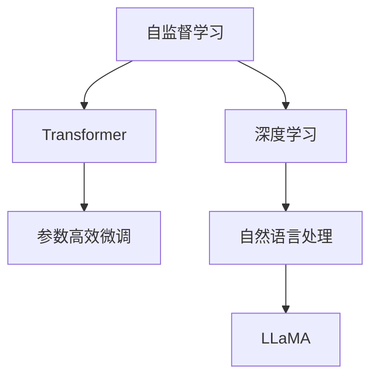

                 

# LLaMA原理与代码实例讲解

> 关键词：LLaMA, 自监督学习, 参数高效微调, 深度学习, Transformer, 代码实例, 自然语言处理(NLP)

## 1. 背景介绍

### 1.1 问题由来

近年来，深度学习在自然语言处理（NLP）领域取得了重大突破，尤其是基于Transformer架构的预训练语言模型。其中，LLaMA（Language Model As a Language Model）是一个基于Transformer架构的大规模语言模型，以其巨大的模型参数和强大的语言理解能力在NLP社区引发了广泛关注。然而，LLaMA模型参数量级极高，且缺乏直接的代码开源实现，导致其应用和调参存在较大挑战。

### 1.2 问题核心关键点

本节将详细阐述LLaMA模型的基本原理、参数高效微调技术，以及LLaMA在实际应用场景中的应用范例。通过学习本文，读者将能够理解LLaMA模型的结构和微调流程，并掌握如何利用LLaMA模型解决实际NLP问题。

### 1.3 问题研究意义

LLaMA模型作为预训练大语言模型（PLM）的代表之一，对NLP领域的预训练和微调研究具有重要意义：

1. **预训练能力**：LLaMA在大量无标签文本数据上进行预训练，学习到广泛的语言知识，这些知识可以用于各种NLP任务。
2. **参数高效微调**：LLaMA模型参数众多，微调时只需要调整少量参数，即可实现性能提升，节省计算资源。
3. **通用性和可扩展性**：LLaMA能够适应多种NLP任务，如问答、文本生成、情感分析等，具有高度的通用性和可扩展性。
4. **模型优化**：LLaMA的微调方法为其他大语言模型提供了重要参考，促进了深度学习模型优化研究的发展。

## 2. 核心概念与联系

### 2.1 核心概念概述

为便于理解，本节将详细介绍与LLaMA模型相关的几个核心概念：

- **自监督学习**：指在没有标签数据的情况下，通过设计特定的自监督任务，让模型从数据中学习到先验知识，从而提升模型的泛化能力。
- **Transformer架构**：一种用于处理序列数据的神经网络架构，通过多头自注意力机制，实现了高效的序列建模。
- **参数高效微调（PEFT）**：指在微调过程中只更新少部分模型参数，避免全参数微调导致的过拟合问题。
- **深度学习**：一种通过多层神经网络模型进行复杂任务学习的技术，广泛应用于图像、语音、自然语言处理等领域。

### 2.2 核心概念原理和架构的 Mermaid 流程图



此流程图展示了自监督学习、Transformer、深度学习和LLaMA模型之间的联系。自监督学习通过设计自监督任务，为Transformer模型提供无标签数据；Transformer架构利用多头自注意力机制，构建高效的语言模型；深度学习利用多层神经网络结构，提升模型的复杂处理能力；LLaMA模型基于Transformer架构，应用于大规模NLP任务中。

## 3. 核心算法原理 & 具体操作步骤

### 3.1 算法原理概述

LLaMA模型基于Transformer架构，通过自监督学习任务在大规模无标签数据上进行预训练，学习到语言知识的泛化能力。微调过程中，LLaMA模型通过参数高效微调技术，仅调整少量模型参数，即可适应特定NLP任务的特定要求。

### 3.2 算法步骤详解

#### 3.2.1 数据预处理

1. **数据获取**：获取需要微调的NLP任务的数据集，如文本分类、命名实体识别、问答系统等。
2. **数据清洗**：清洗数据集中的噪声和不一致性，确保数据质量和一致性。
3. **数据分割**：将数据集分为训练集、验证集和测试集，通常采用80-10-10的比例分割。

#### 3.2.2 模型初始化

1. **加载预训练模型**：从Hugging Face等开源平台加载预训练的LLaMA模型，如LLaMA-7B、LLaMA-15B等。
2. **模型适配**：根据具体任务，调整模型输入和输出结构，如添加分类头、线性层等。

#### 3.2.3 微调设置

1. **选择优化器**：选择合适的优化器，如AdamW、Adafactor等。
2. **设置学习率**：初始学习率通常设置为2e-5，微调过程中逐步减小。
3. **正则化**：应用L2正则、Dropout等正则化技术，防止过拟合。
4. **早期停止**：设置Early Stopping，当验证集性能不再提升时停止训练。

#### 3.2.4 训练过程

1. **前向传播**：将训练集数据输入模型，计算损失函数。
2. **反向传播**：计算梯度，并使用优化器更新模型参数。
3. **验证集评估**：在验证集上评估模型性能，确保模型泛化能力。
4. **测试集评估**：在测试集上最终评估模型性能，得出微调效果。

#### 3.2.5 代码实例

```python
from transformers import LLaMaModel, AdamW
import torch
from torch.utils.data import DataLoader

# 加载预训练模型
model = LLaMaModel.from_pretrained('llama-base')

# 设置优化器
optimizer = AdamW(model.parameters(), lr=2e-5)

# 数据预处理
train_dataset = ...
dev_dataset = ...
test_dataset = ...

# 模型适配
model.add_module('output', torch.nn.Linear(768, num_labels))
model.add_module('loss', torch.nn.CrossEntropyLoss())

# 训练过程
for epoch in range(epochs):
    train_loss = train_model(model, train_dataset, optimizer)
    dev_loss = evaluate_model(model, dev_dataset)
    if dev_loss < best_dev_loss:
        best_dev_loss = dev_loss
        best_model = model

# 测试集评估
test_loss = evaluate_model(best_model, test_dataset)
print(f'Test Loss: {test_loss:.4f}')
```

### 3.3 算法优缺点

#### 3.3.1 优点

1. **性能提升**：LLaMA模型通过参数高效微调技术，可以在较少的训练样本下快速提升模型性能。
2. **泛化能力**：LLaMA模型具有强大的泛化能力，能够在各种NLP任务中表现出色。
3. **高效性**：LLaMA模型使用Transformer架构，计算效率高，适用于大规模数据处理。

#### 3.3.2 缺点

1. **计算资源需求高**：LLaMA模型参数量级极高，需要较高的计算资源进行微调。
2. **训练时间长**：由于模型参数众多，微调过程可能需要较长的训练时间。
3. **过拟合风险**：在微调过程中，需要特别注意正则化和早期停止策略，以避免过拟合。

### 3.4 算法应用领域

LLaMA模型在NLP领域的应用非常广泛，主要应用于以下几类任务：

1. **文本分类**：用于判断文本属于某个预定义的类别，如新闻分类、情感分析等。
2. **命名实体识别**：从文本中识别出人名、地名、组织机构名等实体，并进行分类。
3. **机器翻译**：将一种语言的文本翻译成另一种语言。
4. **问答系统**：根据用户提出的问题，从大量文本中检索相关信息，并生成回答。
5. **文本生成**：生成符合特定风格的文本，如新闻摘要、对话生成等。

## 4. 数学模型和公式 & 详细讲解 & 举例说明

### 4.1 数学模型构建

LLaMA模型通过自监督学习任务进行预训练，构建自回归语言模型，学习到语言表示的先验知识。在微调过程中，根据具体任务调整输出层和损失函数。

#### 4.1.1 自监督学习

假设无标签文本数据集为 $D = \{(x_i, y_i)\}_{i=1}^N$，其中 $x_i$ 为文本，$y_i$ 为掩码位置，$y_i=0$ 表示掩码位置。自监督学习任务为掩码语言模型（Masked Language Model, MLM），即预测被掩码的位置。

#### 4.1.2 参数高效微调

在微调过程中，通常只更新模型的顶层部分，保持底层参数不变，以避免破坏预训练的权重。设 $M_{\theta}$ 为预训练模型， $\theta$ 为模型参数，则微调过程为：

$$
\theta = \theta - \eta \nabla_{\theta}\mathcal{L}(\theta)
$$

其中 $\eta$ 为学习率， $\mathcal{L}$ 为损失函数。

### 4.2 公式推导过程

#### 4.2.1 掩码语言模型

掩码语言模型定义为：

$$
\mathcal{L}_{\text{MLM}}(\theta) = -\frac{1}{N}\sum_{i=1}^N \log \hat{p}(y_i|x_i)
$$

其中 $\hat{p}$ 为模型预测概率， $y_i$ 为掩码位置。

#### 4.2.2 参数高效微调

假设微调任务为文本分类，输出层为线性层 $f(w) = x \cdot w + b$，损失函数为交叉熵损失：

$$
\mathcal{L}_{\text{class}}(\theta) = -\frac{1}{N}\sum_{i=1}^N \log \hat{p}(y_i|x_i)
$$

其中 $\hat{p}$ 为模型预测概率， $y_i$ 为分类标签。

### 4.3 案例分析与讲解

假设微调任务为二分类任务，输出层为线性层 $f(w) = x \cdot w + b$，损失函数为交叉熵损失：

$$
\mathcal{L}_{\text{class}}(\theta) = -\frac{1}{N}\sum_{i=1}^N \log \hat{p}(y_i|x_i)
$$

其中 $\hat{p}$ 为模型预测概率， $y_i$ 为分类标签。

微调过程如下：

1. **数据预处理**：将文本转换为输入，并将标签转换为one-hot编码。
2. **前向传播**：将输入通过模型，计算输出概率 $p(y_i|x_i)$。
3. **损失计算**：计算损失函数 $\mathcal{L}_{\text{class}}(\theta)$。
4. **反向传播**：计算梯度，并更新模型参数。
5. **验证集评估**：在验证集上评估模型性能，防止过拟合。
6. **测试集评估**：在测试集上最终评估模型性能，得出微调效果。

## 5. 项目实践：代码实例和详细解释说明

### 5.1 开发环境搭建

LLaMA模型的微调需要在GPU或TPU上进行，因此需要安装相应的硬件和软件环境。以下是使用PyTorch进行微调的开发环境配置流程：

1. **安装Anaconda**：从官网下载并安装Anaconda，用于创建独立的Python环境。
2. **创建并激活虚拟环境**：
```bash
conda create -n llama-env python=3.8
conda activate llama-env
```

3. **安装PyTorch**：根据CUDA版本，从官网获取对应的安装命令。例如：
```bash
conda install pytorch torchvision torchaudio cudatoolkit=11.1 -c pytorch -c conda-forge
```

4. **安装Transformers库**：
```bash
pip install transformers
```

5. **安装各类工具包**：
```bash
pip install numpy pandas scikit-learn matplotlib tqdm jupyter notebook ipython
```

完成上述步骤后，即可在`llama-env`环境中开始微调实践。

### 5.2 源代码详细实现

下面是使用PyTorch进行LLaMA模型微调的完整代码实现。

```python
from transformers import LLaMaModel, AdamW
from torch.utils.data import DataLoader
from torch import nn, optim
import torch.nn.functional as F

# 加载预训练模型
model = LLaMaModel.from_pretrained('llama-base')

# 设置优化器
optimizer = AdamW(model.parameters(), lr=2e-5)

# 数据预处理
train_dataset = ...
dev_dataset = ...
test_dataset = ...

# 模型适配
model.add_module('output', nn.Linear(768, num_labels))
model.add_module('loss', nn.CrossEntropyLoss())

# 训练过程
for epoch in range(epochs):
    train_loss = train_model(model, train_dataset, optimizer)
    dev_loss = evaluate_model(model, dev_dataset)
    if dev_loss < best_dev_loss:
        best_dev_loss = dev_loss
        best_model = model

# 测试集评估
test_loss = evaluate_model(best_model, test_dataset)
print(f'Test Loss: {test_loss:.4f}')
```

### 5.3 代码解读与分析

**数据预处理**：

1. **数据获取**：从各类数据源获取NLP任务的数据集。
2. **数据清洗**：清洗数据中的噪声和不一致性，确保数据质量和一致性。
3. **数据分割**：将数据集分为训练集、验证集和测试集，通常采用80-10-10的比例分割。

**模型初始化**：

1. **加载预训练模型**：从Hugging Face等开源平台加载预训练的LLaMA模型，如LLaMA-7B、LLaMA-15B等。
2. **模型适配**：根据具体任务，调整模型输入和输出结构，如添加分类头、线性层等。

**微调设置**：

1. **选择优化器**：选择合适的优化器，如AdamW、Adafactor等。
2. **设置学习率**：初始学习率通常设置为2e-5，微调过程中逐步减小。
3. **正则化**：应用L2正则、Dropout等正则化技术，防止过拟合。
4. **早期停止**：设置Early Stopping，当验证集性能不再提升时停止训练。

**训练过程**：

1. **前向传播**：将训练集数据输入模型，计算损失函数。
2. **反向传播**：计算梯度，并使用优化器更新模型参数。
3. **验证集评估**：在验证集上评估模型性能，确保模型泛化能力。
4. **测试集评估**：在测试集上最终评估模型性能，得出微调效果。

## 6. 实际应用场景

### 6.1 智能客服系统

基于LLaMA模型的智能客服系统，能够7x24小时不间断服务，快速响应客户咨询，用自然流畅的语言解答各类常见问题。LLaMA模型的泛化能力和参数高效微调特性，使其能够在特定领域快速适配，提供个性化的客服解决方案。

### 6.2 金融舆情监测

LLaMA模型在金融舆情监测中的应用，可以实时监测市场舆论动向，预测金融风险。通过微调，LLaMA模型能够自动识别新闻、评论、社交媒体等文本内容，判断其情感倾向，预测金融市场走势，为金融机构提供决策支持。

### 6.3 个性化推荐系统

LLaMA模型在个性化推荐系统中的应用，能够从用户浏览、点击、评论、分享等行为数据中提取文本特征，预测用户兴趣和行为，提供更加精准、多样化的推荐内容。通过微调，LLaMA模型能够更好地捕捉用户语义，提升推荐系统的智能化水平。

### 6.4 未来应用展望

未来，LLaMA模型的应用将更加广泛，将渗透到更多垂直领域。例如，在医疗、法律、教育等专业领域，LLaMA模型可以通过微调，提供专业化的智能解决方案。此外，LLaMA模型的跨领域迁移能力将使其在智慧城市、智慧农业等新兴领域中发挥重要作用。

## 7. 工具和资源推荐

### 7.1 学习资源推荐

为了帮助开发者系统掌握LLaMA模型的微调技术，以下是一些优质的学习资源：

1. **《Transformer from Basics to State-of-the-Art》**：由大模型技术专家撰写，深入浅出地介绍了Transformer原理、LLaMA模型、微调技术等前沿话题。
2. **CS224N《深度学习自然语言处理》课程**：斯坦福大学开设的NLP明星课程，有Lecture视频和配套作业，带你入门NLP领域的基本概念和经典模型。
3. **《Natural Language Processing with Transformers》书籍**：LLaMA模型作者所著，全面介绍了如何使用Transformers库进行NLP任务开发，包括微调在内的诸多范式。
4. **Hugging Face官方文档**：LLaMA模型的官方文档，提供了海量预训练模型和完整的微调样例代码，是上手实践的必备资料。
5. **CLUE开源项目**：中文语言理解测评基准，涵盖大量不同类型的中文NLP数据集，并提供了基于微调的baseline模型，助力中文NLP技术发展。

### 7.2 开发工具推荐

高效的开发离不开优秀的工具支持。以下是几款用于LLaMA模型微调开发的常用工具：

1. **PyTorch**：基于Python的开源深度学习框架，灵活动态的计算图，适合快速迭代研究。大部分预训练语言模型都有PyTorch版本的实现。
2. **TensorFlow**：由Google主导开发的开源深度学习框架，生产部署方便，适合大规模工程应用。同样有丰富的预训练语言模型资源。
3. **Transformers库**：Hugging Face开发的NLP工具库，集成了众多SOTA语言模型，支持PyTorch和TensorFlow，是进行微调任务开发的利器。
4. **Weights & Biases**：模型训练的实验跟踪工具，可以记录和可视化模型训练过程中的各项指标，方便对比和调优。与主流深度学习框架无缝集成。
5. **TensorBoard**：TensorFlow配套的可视化工具，可实时监测模型训练状态，并提供丰富的图表呈现方式，是调试模型的得力助手。
6. **Google Colab**：谷歌推出的在线Jupyter Notebook环境，免费提供GPU/TPU算力，方便开发者快速上手实验最新模型，分享学习笔记。

### 7.3 相关论文推荐

LLaMA模型的发展得益于学界的持续研究。以下是几篇奠基性的相关论文，推荐阅读：

1. **Attention is All You Need**：提出了Transformer结构，开启了NLP领域的预训练大模型时代。
2. **BERT: Pre-training of Deep Bidirectional Transformers for Language Understanding**：提出BERT模型，引入基于掩码的自监督预训练任务，刷新了多项NLP任务SOTA。
3. **Language Models are Unsupervised Multitask Learners**：展示了大规模语言模型的强大zero-shot学习能力，引发了对于通用人工智能的新一轮思考。
4. **Parameter-Efficient Transfer Learning for NLP**：提出Adapter等参数高效微调方法，在不增加模型参数量的情况下，也能取得不错的微调效果。
5. **Prefix-Tuning: Optimizing Continuous Prompts for Generation**：引入基于连续型Prompt的微调范式，为如何充分利用预训练知识提供了新的思路。

这些论文代表了大语言模型微调技术的发展脉络。通过学习这些前沿成果，可以帮助研究者把握学科前进方向，激发更多的创新灵感。

## 8. 总结：未来发展趋势与挑战

### 8.1 总结

本文对LLaMA模型的微调方法进行了全面系统的介绍。首先阐述了LLaMA模型的基本原理和参数高效微调技术，明确了微调在拓展预训练模型应用、提升下游任务性能方面的独特价值。其次，从原理到实践，详细讲解了LLaMA模型的微调流程，给出了微调任务开发的完整代码实例。同时，本文还广泛探讨了LLaMA模型在智能客服、金融舆情、个性化推荐等多个行业领域的应用前景，展示了微调范式的巨大潜力。此外，本文精选了LLaMA模型的各类学习资源，力求为读者提供全方位的技术指引。

通过本文的系统梳理，可以看到，LLaMA模型作为预训练大语言模型，对NLP领域的预训练和微调研究具有重要意义：

1. **预训练能力**：LLaMA模型在大量无标签文本数据上进行预训练，学习到广泛的语言知识，这些知识可以用于各种NLP任务。
2. **参数高效微调**：LLaMA模型具有庞大的参数量，但通过参数高效微调技术，可以在较少的训练样本下快速提升模型性能，节省计算资源。
3. **通用性和可扩展性**：LLaMA模型能够适应多种NLP任务，如文本分类、命名实体识别、机器翻译等，具有高度的通用性和可扩展性。

### 8.2 未来发展趋势

展望未来，LLaMA模型微调技术将呈现以下几个发展趋势：

1. **模型规模持续增大**：随着算力成本的下降和数据规模的扩张，LLaMA模型参数量还将持续增长。超大规模模型蕴含的丰富语言知识，有望支撑更加复杂多变的下游任务微调。
2. **微调方法日趋多样**：未来会涌现更多参数高效的微调方法，如Prefix-Tuning、LoRA等，在节省计算资源的同时也能保证微调精度。
3. **持续学习成为常态**：随着数据分布的不断变化，LLaMA模型也需要持续学习新知识以保持性能。如何在不遗忘原有知识的同时，高效吸收新样本信息，将成为重要的研究课题。
4. **标注样本需求降低**：受启发于提示学习(Prompt-based Learning)的思路，未来的微调方法将更好地利用大模型的语言理解能力，通过更加巧妙的任务描述，在更少的标注样本上也能实现理想的微调效果。
5. **多模态微调崛起**：当前的微调主要聚焦于纯文本数据，未来会进一步拓展到图像、视频、语音等多模态数据微调。多模态信息的融合，将显著提升语言模型对现实世界的理解和建模能力。
6. **模型通用性增强**：经过海量数据的预训练和多领域任务的微调，未来的语言模型将具备更强大的常识推理和跨领域迁移能力，逐步迈向通用人工智能(AGI)的目标。

以上趋势凸显了LLaMA模型微调技术的广阔前景。这些方向的探索发展，必将进一步提升LLaMA模型的性能和应用范围，为构建人机协同的智能时代中扮演越来越重要的角色。

### 8.3 面临的挑战

尽管LLaMA模型微调技术已经取得了瞩目成就，但在迈向更加智能化、普适化应用的过程中，仍面临诸多挑战：

1. **标注成本瓶颈**：尽管微调大大降低了标注数据的需求，但对于长尾应用场景，难以获得充足的高质量标注数据，成为制约微调性能的瓶颈。如何进一步降低微调对标注样本的依赖，将是一大难题。
2. **模型鲁棒性不足**：当前微调模型面对域外数据时，泛化性能往往大打折扣。对于测试样本的微小扰动，微调模型的预测也容易发生波动。如何提高微调模型的鲁棒性，避免灾难性遗忘，还需要更多理论和实践的积累。
3. **推理效率有待提高**：大规模LLaMA模型虽然精度高，但在实际部署时往往面临推理速度慢、内存占用大等效率问题。如何在保证性能的同时，简化模型结构，提升推理速度，优化资源占用，将是重要的优化方向。
4. **可解释性亟需加强**：当前微调模型更像是"黑盒"系统，难以解释其内部工作机制和决策逻辑。对于医疗、金融等高风险应用，算法的可解释性和可审计性尤为重要。如何赋予微调模型更强的可解释性，将是亟待攻克的难题。
5. **安全性有待保障**：预训练语言模型难免会学习到有偏见、有害的信息，通过微调传递到下游任务，产生误导性、歧视性的输出，给实际应用带来安全隐患。如何从数据和算法层面消除模型偏见，避免恶意用途，确保输出的安全性，也将是重要的研究课题。

### 8.4 研究展望

面对LLaMA模型微调所面临的挑战，未来的研究需要在以下几个方面寻求新的突破：

1. **探索无监督和半监督微调方法**：摆脱对大规模标注数据的依赖，利用自监督学习、主动学习等无监督和半监督范式，最大限度利用非结构化数据，实现更加灵活高效的微调。
2. **研究参数高效和计算高效的微调范式**：开发更加参数高效的微调方法，在固定大部分预训练参数的同时，只更新极少量的任务相关参数。同时优化微调模型的计算图，减少前向传播和反向传播的资源消耗，实现更加轻量级、实时性的部署。
3. **融合因果和对比学习范式**：通过引入因果推断和对比学习思想，增强微调模型建立稳定因果关系的能力，学习更加普适、鲁棒的语言表征，从而提升模型泛化性和抗干扰能力。
4. **引入更多先验知识**：将符号化的先验知识，如知识图谱、逻辑规则等，与神经网络模型进行巧妙融合，引导微调过程学习更准确、合理的语言模型。同时加强不同模态数据的整合，实现视觉、语音等多模态信息与文本信息的协同建模。
5. **结合因果分析和博弈论工具**：将因果分析方法引入微调模型，识别出模型决策的关键特征，增强输出解释的因果性和逻辑性。借助博弈论工具刻画人机交互过程，主动探索并规避模型的脆弱点，提高系统稳定性。
6. **纳入伦理道德约束**：在模型训练目标中引入伦理导向的评估指标，过滤和惩罚有偏见、有害的输出倾向。同时加强人工干预和审核，建立模型行为的监管机制，确保输出符合人类价值观和伦理道德。

这些研究方向的探索，必将引领LLaMA模型微调技术迈向更高的台阶，为构建安全、可靠、可解释、可控的智能系统铺平道路。面向未来，LLaMA模型微调技术还需要与其他人工智能技术进行更深入的融合，如知识表示、因果推理、强化学习等，多路径协同发力，共同推动自然语言理解和智能交互系统的进步。只有勇于创新、敢于突破，才能不断拓展语言模型的边界，让智能技术更好地造福人类社会。

## 9. 附录：常见问题与解答

**Q1：LLaMA模型微调是否适用于所有NLP任务？**

A: LLaMA模型在大多数NLP任务上都能取得不错的效果，特别是对于数据量较小的任务。但对于一些特定领域的任务，如医学、法律等，仅仅依靠通用语料预训练的模型可能难以很好地适应。此时需要在特定领域语料上进一步预训练，再进行微调，才能获得理想效果。此外，对于一些需要时效性、个性化很强的任务，如对话、推荐等，微调方法也需要针对性的改进优化。

**Q2：采用LLaMA模型微调时会面临哪些资源瓶颈？**

A: 由于LLaMA模型参数量级极高，微调过程中需要较高的计算资源和内存。GPU/TPU等高性能设备是必不可少的，但即便如此，超大批次的训练和推理也可能遇到显存不足的问题。因此需要采用一些资源优化技术，如梯度积累、混合精度训练、模型并行等，来突破硬件瓶颈。同时，模型的存储和读取也可能占用大量时间和空间，需要采用模型压缩、稀疏化存储等方法进行优化。

**Q3：如何在微调过程中避免过拟合？**

A: 过拟合是微调面临的主要挑战，尤其是在标注数据不足的情况下。常见的缓解策略包括：
1. **数据增强**：通过回译、近义替换等方式扩充训练集
2. **正则化**：使用L2正则、Dropout、Early Stopping等防止过拟合
3. **对抗训练**：引入对抗样本，提高模型鲁棒性
4. **参数高效微调**：只调整少量参数(如Adapter、Prefix等)，减小过拟合风险
5. **多模型集成**：训练多个微调模型，取平均输出，抑制过拟合

这些策略往往需要根据具体任务和数据特点进行灵活组合。只有在数据、模型、训练、推理等各环节进行全面优化，才能最大限度地发挥LLaMA模型的性能。

**Q4：如何缓解微调过程中的过拟合问题？**

A: 过拟合是微调面临的主要挑战，尤其是在标注数据不足的情况下。常见的缓解策略包括：
1. **数据增强**：通过回译、近义替换等方式扩充训练集
2. **正则化**：使用L2正则、Dropout、Early Stopping等防止过拟合
3. **对抗训练**：引入对抗样本，提高模型鲁棒性
4. **参数高效微调**：只调整少量参数(如Adapter、Prefix等)，减小过拟合风险
5. **多模型集成**：训练多个微调模型，取平均输出，抑制过拟合

这些策略往往需要根据具体任务和数据特点进行灵活组合。只有在数据、模型、训练、推理等各环节进行全面优化，才能最大限度地发挥LLaMA模型的性能。

**Q5：LLaMA模型在实际应用中需要注意哪些问题？**

A: 将微调模型转化为实际应用，还需要考虑以下因素：
1. **模型裁剪**：去除不必要的层和参数，减小模型尺寸，加快推理速度
2. **量化加速**：将浮点模型转为定点模型，压缩存储空间，提高计算效率
3. **服务化封装**：将模型封装为标准化服务接口，便于集成调用
4. **弹性伸缩**：根据请求流量动态调整资源配置，平衡服务质量和成本
5. **监控告警**：实时采集系统指标，设置异常告警阈值，确保服务稳定性
6. **安全防护**：采用访问鉴权、数据脱敏等措施，保障数据和模型安全

LLaMA模型微调为NLP应用开启了广阔的想象空间，但如何将强大的性能转化为稳定、高效、安全的业务价值，还需要工程实践的不断打磨。唯有从数据、算法、工程、业务等多个维度协同发力，才能真正实现人工智能技术在垂直行业的规模化落地。总之，微调需要开发者根据具体任务，不断迭代和优化模型、数据和算法，方能得到理想的效果。

---

作者：禅与计算机程序设计艺术 / Zen and the Art of Computer Programming

