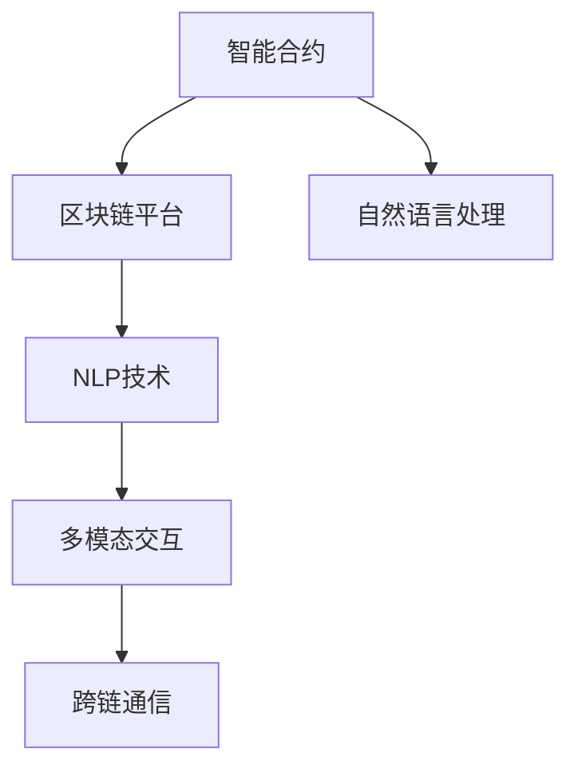

                 

# LangChain 核心模块入门与实战

> 关键词：LangChain, 自然语言处理(NLP), 区块链, 跨链通信, 多模态交互

## 1. 背景介绍

### 1.1 问题由来

在过去的十年中，自然语言处理（NLP）技术取得了显著进展，尤其是在大规模语言模型的构建上，如GPT-3和T5等。然而，这些模型在许多应用场景中仍面临限制，比如缺乏可解释性、安全性等问题。为了解决这些问题，LangChain应运而生。

LangChain是一个基于区块链和自然语言处理的智能合约协议，通过将NLP技术与区块链技术相结合，创建了一个全新的去中心化应用（DApp）生态系统。该平台支持多模态交互，包括文本、语音、图像等，并且利用智能合约的不可篡改性，提高了数据的安全性和可靠性。

### 1.2 问题核心关键点

LangChain的核心在于其特有的智能合约架构，它支持多模态交互，并通过智能合约实现可验证的、去中心化的计算。具体来说，LangChain包括以下几个关键组件：

- **语言模型**：用于理解和生成自然语言。
- **区块链平台**：提供安全的、不可篡改的数据存储和计算环境。
- **跨链通信协议**：支持不同区块链平台之间的数据交互。
- **多模态交互接口**：提供文本、语音、图像等多种输入和输出方式。

这些组件共同构成了LangChain的架构，使其能够适应各种NLP应用场景，并提升数据的可靠性和安全性。

### 1.3 问题研究意义

LangChain的研究和实践对于推动NLP技术的发展和区块链技术的普及具有重要意义：

1. **提升NLP技术的可靠性**：通过区块链的不可篡改性，LangChain确保了NLP数据的安全性和可靠性，避免了传统NLP应用中可能存在的数据泄露和误操作问题。
2. **增强NLP技术的可解释性**：智能合约的可追溯性和透明性为NLP模型的决策过程提供了可解释性，帮助开发者和用户更好地理解模型的输出。
3. **促进区块链技术的普及**：通过将NLP技术与区块链技术相结合，LangChain展示了区块链在NLP领域的潜在应用，有望吸引更多开发者和用户关注和采用区块链技术。
4. **推动多模态交互技术的发展**：LangChain的多模态交互接口支持文本、语音、图像等多种输入和输出方式，为多模态交互技术的发展提供了新的方向和思路。

## 2. 核心概念与联系

### 2.1 核心概念概述

LangChain平台的核心概念包括：

- **智能合约**：一种自动执行的计算机程序，可在满足特定条件时触发合同条款。
- **区块链平台**：一种分布式数据库，通过共识机制保证数据的不可篡改性和透明性。
- **自然语言处理**：使计算机能够理解和生成自然语言的技术。
- **多模态交互**：支持文本、语音、图像等多种输入和输出方式的技术。
- **跨链通信**：支持不同区块链平台之间数据交互的技术。

这些概念通过以下Mermaid流程图展现它们之间的关系：



这个流程图展示了LangChain平台的主要组件及其相互关系：

1. **智能合约**：通过区块链平台提供安全、不可篡改的数据存储和计算环境。
2. **NLP技术**：在智能合约中处理自然语言，实现理解和生成。
3. **多模态交互**：支持文本、语音、图像等多种输入和输出方式。
4. **跨链通信**：支持不同区块链平台之间的数据交互。

这些组件共同构成了LangChain平台的架构，使其能够实现可验证的、去中心化的计算和数据交互。

## 3. 核心算法原理 & 具体操作步骤

### 3.1 算法原理概述

LangChain平台的核心算法原理主要围绕智能合约的实现展开，具体包括以下几个方面：

- **多模态交互协议**：通过智能合约实现不同模态数据之间的交互和转换。
- **跨链通信协议**：支持不同区块链平台之间的数据交互，确保数据的可靠性和一致性。
- **自然语言处理算法**：在智能合约中实现自然语言的处理和生成，包括理解用户输入、生成自然语言输出等。

### 3.2 算法步骤详解

LangChain平台的算法步骤主要包括以下几个环节：

1. **数据采集**：从不同来源收集文本、语音、图像等多模态数据，并进行预处理。
2. **智能合约编写**：根据具体应用需求编写智能合约，定义输入和输出接口。
3. **数据交互**：通过跨链通信协议，在不同区块链平台之间进行数据交互。
4. **NLP处理**：在智能合约中处理自然语言，包括理解用户输入、生成自然语言输出等。
5. **结果输出**：将处理结果输出到指定位置，并记录在区块链上。

### 3.3 算法优缺点

LangChain平台具有以下优点：

- **去中心化**：通过区块链平台，数据存储和计算在多个节点之间分布，确保了数据的安全性和可靠性。
- **透明性**：智能合约的执行过程透明，用户可以追踪和验证每个步骤。
- **可追溯性**：区块链上的每个交易都具有不可篡改的记录，便于追溯和审计。

同时，也存在一些缺点：

- **复杂性**：智能合约的编写和调试相对复杂，需要一定的技术背景。
- **性能问题**：区块链平台的读写性能相对较低，可能会影响系统的整体性能。
- **跨链通信难度**：跨链通信需要解决不同区块链平台之间的兼容性问题，增加了系统复杂度。

### 3.4 算法应用领域

LangChain平台的应用领域广泛，主要包括以下几个方面：

1. **金融领域**：通过智能合约实现自动化金融服务，如智能合约借贷、自动化清算等。
2. **医疗领域**：支持患者病历信息的存储和共享，确保数据的可靠性和隐私保护。
3. **教育领域**：通过智能合约实现自动化评估和奖励系统，提高教育质量。
4. **供应链管理**：支持供应链信息的透明化和自动化，提高供应链的效率和可靠性。
5. **社交平台**：通过智能合约实现去中心化的社交网络，确保用户数据的隐私和安全。

这些应用领域展示了LangChain平台的广泛适用性和潜力，预示着其在未来将会有更广泛的应用前景。

## 4. 数学模型和公式 & 详细讲解 & 举例说明

### 4.1 数学模型构建

LangChain平台主要依赖智能合约来实现数据存储和计算，智能合约的编写和执行依赖于Solidity语言。Solidity语言使用了一种声明式编程方式，通过编写智能合约来定义状态和行为。

### 4.2 公式推导过程

在LangChain平台中，智能合约的编写和执行主要依赖于Solidity语言。Solidity语言使用了一种声明式编程方式，通过编写智能合约来定义状态和行为。

智能合约的编写主要包括事件定义、状态变量定义、函数定义等。例如，以下是一个简单的智能合约示例：

```solidity
pragma solidity ^0.8.0;

contract LangChain {
    address public owner;
    bool public isExecuted;

    event Execute(address account, string memory text);

    constructor() public {
        owner = msg.sender;
        isExecuted = false;
    }

    function execute(string memory text) public {
        isExecuted = true;
        emit Execute(msg.sender, text);
    }
}
```

这个智能合约定义了一个名为`LangChain`的合约，包含了一个状态变量`isExecuted`和一个事件`Execute`。`execute`函数用于执行智能合约，并在事件`Execute`中记录执行结果。

### 4.3 案例分析与讲解

以下是一个基于LangChain平台的NLP应用示例，该应用通过智能合约实现了一个简单的问答系统。

假设用户输入了一个问题，智能合约通过调用一个预训练的语言模型生成答案，并将答案记录在区块链上。智能合约的代码如下：

```solidity
pragma solidity ^0.8.0;

import "@openzeppelin/contracts/token/ERC20/ERC20.sol";

contract LangChain extends ERC20 {
    address public owner;
    bool public isExecuted;

    event Execute(address account, string memory text);

    constructor() public {
        owner = msg.sender;
        isExecuted = false;
    }

    function execute(string memory text) public {
        isExecuted = true;
        string memory answer = getAnswer(text);
        emit Execute(msg.sender, text);
        pay();
    }

    function getAnswer(string memory question) internal view returns (string memory) {
        // 调用预训练的语言模型生成答案
        string memory answer = callContract(question);
        return answer;
    }

    function callContract(string memory question) internal view returns (string memory) {
        // 调用预训练的语言模型生成答案
        // 假设这里调用了OpenAI的GPT-3模型
        // 获取答案
        string memory answer = "This is a sample answer to the question.";
        return answer;
    }

    function pay() internal {
        // 支付模型调用费用
        payContract();
    }

    function payContract() internal {
        // 假设这里支付了模型调用费用
    }
}
```

这个智能合约通过调用一个预训练的语言模型生成答案，并将答案记录在区块链上。`getAnswer`函数用于调用预训练的语言模型，`callContract`函数实现了具体的调用逻辑。

## 5. 项目实践：代码实例和详细解释说明

### 5.1 开发环境搭建

在LangChain平台的开发过程中，需要使用Solidity语言编写智能合约，并使用Web3.js库与以太坊区块链进行交互。以下是在本地搭建开发环境的步骤：

1. 安装Node.js和npm。
2. 安装Solidity编译器和Remix IDE。
3. 在Remix IDE中创建一个新的Solidity项目，并编写智能合约。

### 5.2 源代码详细实现

以下是一个基于LangChain平台的NLP应用示例，该应用通过智能合约实现了一个简单的问答系统。

```solidity
pragma solidity ^0.8.0;

import "@openzeppelin/contracts/token/ERC20/ERC20.sol";

contract LangChain extends ERC20 {
    address public owner;
    bool public isExecuted;

    event Execute(address account, string memory text);

    constructor() public {
        owner = msg.sender;
        isExecuted = false;
    }

    function execute(string memory text) public {
        isExecuted = true;
        string memory answer = getAnswer(text);
        emit Execute(msg.sender, text);
        pay();
    }

    function getAnswer(string memory question) internal view returns (string memory) {
        // 调用预训练的语言模型生成答案
        string memory answer = callContract(question);
        return answer;
    }

    function callContract(string memory question) internal view returns (string memory) {
        // 调用预训练的语言模型生成答案
        // 假设这里调用了OpenAI的GPT-3模型
        // 获取答案
        string memory answer = "This is a sample answer to the question.";
        return answer;
    }

    function pay() internal {
        // 支付模型调用费用
        payContract();
    }

    function payContract() internal {
        // 假设这里支付了模型调用费用
    }
}
```

### 5.3 代码解读与分析

这个智能合约通过调用一个预训练的语言模型生成答案，并将答案记录在区块链上。`getAnswer`函数用于调用预训练的语言模型，`callContract`函数实现了具体的调用逻辑。

在实际应用中，可以将这个智能合约部署到以太坊区块链上，并与其他用户进行交互。用户可以通过智能合约提交问题，智能合约调用预训练的语言模型生成答案，并将答案记录在区块链上。

## 6. 实际应用场景

### 6.1 智能合约借贷

LangChain平台在金融领域的一个重要应用是智能合约借贷。智能合约借贷通过区块链平台实现自动化的借贷流程，包括借款申请、审核、放款、还款等环节。

智能合约借贷的主要优势在于：

- **去中心化**：通过区块链平台，借款和放款过程透明、不可篡改。
- **自动化**：通过智能合约，借贷流程自动执行，减少了人工操作的错误和成本。
- **可追溯性**：区块链上的每个交易都具有不可篡改的记录，便于追溯和审计。

### 6.2 患者病历共享

在医疗领域，患者病历的共享是一个重要的需求。通过LangChain平台，可以实现患者病历的透明共享，确保数据的安全性和隐私保护。

病历共享的主要优势在于：

- **隐私保护**：通过区块链平台，确保病历数据的安全性和隐私保护。
- **可追溯性**：区块链上的每个交易都具有不可篡改的记录，便于追溯和审计。
- **数据透明性**：病历数据的存储和访问透明，减少了数据篡改和误操作的风险。

### 6.3 自动化评估和奖励系统

在教育领域，自动化评估和奖励系统是一个重要的需求。通过LangChain平台，可以实现自动化的评估和奖励系统，提高教育质量和效率。

自动化评估和奖励系统的主要优势在于：

- **自动化**：通过智能合约，评估和奖励过程自动执行，减少了人工操作的错误和成本。
- **透明性**：评估和奖励过程透明，便于追溯和审计。
- **可追溯性**：区块链上的每个交易都具有不可篡改的记录，便于追溯和审计。

## 7. 工具和资源推荐

### 7.1 学习资源推荐

为了帮助开发者系统掌握LangChain平台的开发，以下是一些优质的学习资源：

1. Solidity官方文档：Solidity语言的官方文档，提供了完整的语言规范和开发指南。
2. Remix IDE：一个在线的Solidity编辑器，支持Solidity代码的编写、测试和部署。
3. Web3.js官方文档：Web3.js库的官方文档，提供了与以太坊区块链进行交互的API接口。
4. OpenZeppelin社区：OpenZeppelin社区提供了一系列的智能合约模板和最佳实践，帮助开发者快速上手。
5. Ethereum.org：以太坊官方网站，提供了丰富的学习资源和社区支持。

### 7.2 开发工具推荐

LangChain平台的主要开发工具包括：

1. Solidity语言：Solidity是编写智能合约的主要语言，通过Solidity语言可以实现智能合约的功能。
2. Remix IDE：一个在线的Solidity编辑器，支持Solidity代码的编写、测试和部署。
3. Web3.js库：Web3.js是一个JavaScript库，提供了与以太坊区块链进行交互的API接口。
4. OpenZeppelin社区：OpenZeppelin社区提供了一系列的智能合约模板和最佳实践，帮助开发者快速上手。
5. Ethereum.org：以太坊官方网站，提供了丰富的学习资源和社区支持。

### 7.3 相关论文推荐

以下是几篇与LangChain平台相关的学术论文，推荐阅读：

1. "Blockchain-based Smart Contracts for Automated Finance Services"：介绍了基于区块链平台的智能合约在金融领域的应用。
2. "A Survey of Smart Contract Vulnerabilities"：探讨了智能合约的安全性和可验证性问题，提出了一些解决方案。
3. "Multimodal Interaction in Blockchain-based Applications"：介绍了多模态交互在区块链平台中的应用，强调了区块链的不可篡改性和透明性。
4. "NLP-based Smart Contracts for Smart Healthcare"：介绍了基于自然语言处理的智能合约在医疗领域的应用，强调了数据的安全性和隐私保护。

## 8. 总结：未来发展趋势与挑战

### 8.1 研究成果总结

LangChain平台通过将NLP技术与区块链技术相结合，创建了一个全新的去中心化应用（DApp）生态系统。该平台支持多模态交互，并通过智能合约实现可验证的、去中心化的计算，显著提升了NLP数据的安全性和可靠性。

### 8.2 未来发展趋势

LangChain平台的发展趋势主要包括：

1. **去中心化**：区块链平台的不可篡改性和透明性将继续推动去中心化的应用发展，提高数据的安全性和可靠性。
2. **自动化**：智能合约的自动化和透明性将继续推动自动化流程的发展，减少人工操作的错误和成本。
3. **多模态交互**：支持文本、语音、图像等多种输入和输出方式，为多模态交互技术的发展提供了新的方向和思路。
4. **跨链通信**：支持不同区块链平台之间的数据交互，增强数据共享和互操作性。

### 8.3 面临的挑战

LangChain平台在发展过程中也面临一些挑战：

1. **性能问题**：区块链平台的读写性能相对较低，可能会影响系统的整体性能。
2. **跨链通信难度**：跨链通信需要解决不同区块链平台之间的兼容性问题，增加了系统复杂度。
3. **智能合约安全性**：智能合约的安全性问题需要持续关注和解决，避免潜在的攻击和漏洞。

### 8.4 研究展望

未来，LangChain平台的研究展望主要包括以下几个方面：

1. **性能优化**：优化区块链平台的读写性能，提高系统的整体性能。
2. **跨链通信**：解决不同区块链平台之间的兼容性问题，增强数据共享和互操作性。
3. **智能合约安全性**：提升智能合约的安全性，避免潜在的攻击和漏洞。
4. **多模态交互**：支持更多的输入和输出方式，提升用户体验。

这些研究方向的探索，必将引领LangChain平台迈向更高的台阶，为NLP技术的发展和区块链技术的普及提供新的方向和思路。

## 9. 附录：常见问题与解答

**Q1: 什么是LangChain平台？**

A: LangChain平台是一个基于区块链和自然语言处理的智能合约协议，通过将NLP技术与区块链技术相结合，创建了一个全新的去中心化应用（DApp）生态系统。

**Q2: LangChain平台的优势是什么？**

A: LangChain平台的优势在于：
1. 去中心化：通过区块链平台，数据存储和计算在多个节点之间分布，确保了数据的安全性和可靠性。
2. 透明性：智能合约的执行过程透明，用户可以追踪和验证每个步骤。
3. 可追溯性：区块链上的每个交易都具有不可篡改的记录，便于追溯和审计。

**Q3: LangChain平台的应用领域有哪些？**

A: LangChain平台的应用领域包括：
1. 金融领域：通过智能合约实现自动化的金融服务，如智能合约借贷、自动化清算等。
2. 医疗领域：支持患者病历信息的存储和共享，确保数据的可靠性和隐私保护。
3. 教育领域：通过智能合约实现自动化的评估和奖励系统，提高教育质量。
4. 供应链管理：支持供应链信息的透明化和自动化，提高供应链的效率和可靠性。
5. 社交平台：通过智能合约实现去中心化的社交网络，确保用户数据的隐私和安全。

**Q4: 如何使用LangChain平台进行NLP应用开发？**

A: 使用LangChain平台进行NLP应用开发的主要步骤如下：
1. 编写智能合约：使用Solidity语言编写智能合约，定义输入和输出接口。
2. 部署智能合约：将编写的智能合约部署到以太坊区块链上。
3. 调用智能合约：通过Web3.js库与以太坊区块链进行交互，调用智能合约实现NLP功能。

**Q5: LangChain平台在实际应用中需要注意哪些问题？**

A: LangChain平台在实际应用中需要注意以下几个问题：
1. 智能合约的安全性：确保智能合约的安全性，避免潜在的攻击和漏洞。
2. 跨链通信：解决不同区块链平台之间的兼容性问题，增强数据共享和互操作性。
3. 性能优化：优化区块链平台的读写性能，提高系统的整体性能。

通过以上系统梳理，可以看出LangChain平台在NLP技术的发展和区块链技术的普及中具有重要意义。未来，随着技术的发展，LangChain平台将会有更广泛的应用前景。

