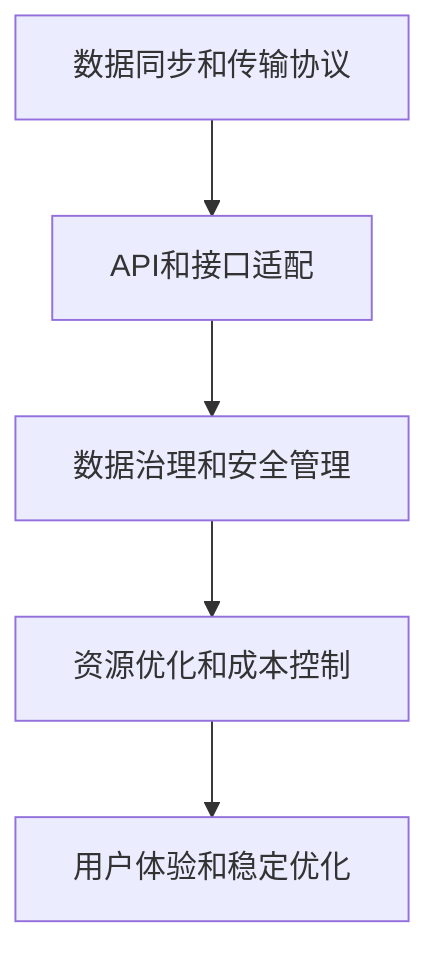

                 

# Lepton AI的云迁移方案：降低云平台间迁移成本，实现无缝交互体验

在当今数字化转型的大潮中，企业对于云计算的依赖程度日益加深。云平台不仅提供了一站式的计算资源，也带来了极大的灵活性和可扩展性。然而，随着业务的不断增长，企业需要频繁地在不同的云平台之间进行数据和应用的迁移，这不仅耗费巨大的人力和时间成本，还可能带来数据安全和兼容性问题。为此，Lepton AI推出了创新的云迁移方案，致力于降低云平台间迁移成本，实现无缝交互体验。

## 1. 背景介绍

### 1.1 问题由来

随着云计算技术的普及，越来越多的企业将业务迁移到云平台。然而，不同云平台之间的技术差异和数据格式不一致，使得跨平台迁移成为一大难题。特别是在面对复杂的企业级应用时，云迁移往往需要耗费大量时间和人力，而且数据安全和兼容性问题频发。这些问题不仅影响了企业的业务连续性，还可能带来巨大的经济损失。

### 1.2 问题核心关键点

企业云迁移的主要难点在于：

- **数据格式不一致**：不同云平台的数据格式和存储方式不同，导致数据迁移过程中格式转换和数据清洗困难。
- **API和接口兼容性**：不同云平台的API和接口标准不一致，跨平台调用的难度大。
- **数据安全和隐私保护**：在数据迁移过程中，数据泄露和隐私保护是一个重要问题。
- **资源优化和成本控制**：云迁移涉及大量的资源配置和费用调整，如何优化资源使用和控制成本是关键。
- **用户体验和稳定性**：跨平台迁移可能会影响用户的使用体验和系统稳定性。

## 2. 核心概念与联系

### 2.1 核心概念概述

Lepton AI的云迁移方案基于一系列核心概念和技术，包括但不限于：

- **数据同步和传输协议**：采用高效的数据同步和传输协议，确保数据在跨平台迁移过程中的完整性和安全性。
- **API和接口适配**：通过自动化的API和接口适配技术，实现不同云平台间的无缝调用。
- **数据治理和安全管理**：引入数据治理和安全管理机制，确保数据迁移过程中的安全和隐私保护。
- **资源优化和成本控制**：利用资源管理系统优化资源使用，实现成本控制和效率提升。
- **用户体验和稳定优化**：通过用户反馈和系统监控，不断优化用户体验和系统稳定性。

### 2.2 核心概念原理和架构的 Mermaid 流程图



这个流程图展示了Lepton AI云迁移方案的核心架构，各个模块协同工作，共同实现跨平台迁移的目标。

## 3. 核心算法原理 & 具体操作步骤

### 3.1 算法原理概述

Lepton AI的云迁移方案基于分布式计算和自动化技术，通过以下步骤实现数据和应用的跨平台迁移：

1. **数据同步和传输协议**：采用高效的数据同步和传输协议，确保数据在跨平台迁移过程中的完整性和安全性。
2. **API和接口适配**：通过自动化的API和接口适配技术，实现不同云平台间的无缝调用。
3. **数据治理和安全管理**：引入数据治理和安全管理机制，确保数据迁移过程中的安全和隐私保护。
4. **资源优化和成本控制**：利用资源管理系统优化资源使用，实现成本控制和效率提升。
5. **用户体验和稳定优化**：通过用户反馈和系统监控，不断优化用户体验和系统稳定性。

### 3.2 算法步骤详解

#### 3.2.1 数据同步和传输协议

**步骤1：数据识别和分类**  
- 对企业现有的数据进行识别和分类，确定需要迁移的数据类型和格式。
- 根据数据的敏感性和重要性，制定迁移优先级和策略。

**步骤2：选择数据同步工具**  
- 根据数据类型和迁移需求，选择适合的数据同步工具，如AWS DataSync、Azure Data Factory等。
- 配置同步参数，包括数据源、目标、同步频率等。

**步骤3：数据同步和传输**  
- 使用选定的数据同步工具，启动数据同步任务。
- 监控数据同步进度，确保数据在传输过程中的完整性和安全性。
- 记录同步日志，便于问题排查和优化。

#### 3.2.2 API和接口适配

**步骤1：API和接口分析**  
- 对现有API和接口进行分析和梳理，确定需要适配的平台和版本。
- 识别API和接口中的数据格式、请求参数、返回结果等关键信息。

**步骤2：适配工具选择**  
- 根据API和接口适配需求，选择适合的适配工具，如Swagger、OpenAPI等。
- 配置适配参数，包括API版本、请求头、请求体等。

**步骤3：API和接口适配**  
- 使用选定的适配工具，将现有的API和接口适配到目标云平台。
- 进行接口测试，确保适配的API和接口能够正常调用。
- 记录适配日志，便于问题排查和优化。

#### 3.2.3 数据治理和安全管理

**步骤1：数据治理规划**  
- 制定数据治理计划，包括数据标准、数据质量、数据生命周期管理等。
- 根据数据治理计划，配置数据治理工具，如Informatica、Collibra等。

**步骤2：数据治理实施**  
- 使用选定的数据治理工具，实施数据治理计划。
- 监控数据治理进度，确保数据治理的效果和质量。
- 记录治理日志，便于问题排查和优化。

**步骤3：数据安全管理**  
- 制定数据安全管理策略，包括数据加密、访问控制、权限管理等。
- 根据数据安全策略，配置数据安全工具，如AWS KMS、Azure Key Vault等。
- 监控数据安全状态，确保数据的安全和隐私保护。

#### 3.2.4 资源优化和成本控制

**步骤1：资源使用监控**  
- 使用资源监控工具，如AWS CloudWatch、Azure Monitor等，实时监控云平台的资源使用情况。
- 分析资源使用数据，识别资源浪费和瓶颈问题。

**步骤2：资源优化策略**  
- 根据资源监控数据，制定资源优化策略，包括资源调整、资源释放等。
- 配置资源优化工具，如AWS Cost Explorer、Azure Cost Management等。
- 执行资源优化策略，优化资源使用，提升资源利用率。

**步骤3：成本控制**  
- 制定成本控制策略，包括预算管理、费用优化等。
- 根据成本控制策略，配置成本控制工具，如AWS Budgets、Azure Cost Management等。
- 监控成本使用情况，确保成本控制在预算范围内。

#### 3.2.5 用户体验和稳定优化

**步骤1：用户反馈收集**  
- 收集用户在使用云平台时的反馈，识别问题点和改进方向。
- 使用用户反馈工具，如JIRA、Trello等，记录和跟踪用户反馈。

**步骤2：系统监控和优化**  
- 使用系统监控工具，如Prometheus、ELK Stack等，实时监控系统运行状态。
- 分析监控数据，识别系统瓶颈和性能问题。
- 执行系统优化策略，提升用户体验和系统稳定性。

**步骤3：用户反馈处理**  
- 根据用户反馈和系统监控数据，制定改进计划和措施。
- 执行改进计划，优化用户体验和系统稳定性。
- 记录反馈处理日志，便于问题排查和优化。

### 3.3 算法优缺点

#### 3.3.1 优点

- **高效的数据同步和传输**：采用高效的数据同步和传输协议，确保数据迁移过程中的完整性和安全性。
- **无缝的API和接口适配**：通过自动化的API和接口适配技术，实现不同云平台间的无缝调用。
- **全面的数据治理和安全管理**：引入数据治理和安全管理机制，确保数据迁移过程中的安全和隐私保护。
- **优化的资源使用和成本控制**：利用资源管理系统优化资源使用，实现成本控制和效率提升。
- **持续的用户体验和稳定性优化**：通过用户反馈和系统监控，不断优化用户体验和系统稳定性。

#### 3.3.2 缺点

- **技术复杂度较高**：云迁移涉及多平台、多工具的协同工作，技术复杂度较高。
- **时间和人力成本高**：云迁移涉及大量的数据同步、API适配、资源调整等工作，需要耗费大量时间和人力。
- **数据安全和隐私保护难度大**：数据迁移过程中，数据安全和隐私保护是一个重要问题，需要多重措施来保障。

## 4. 数学模型和公式 & 详细讲解 & 举例说明

### 4.1 数学模型构建

Lepton AI的云迁移方案基于以下几个数学模型构建：

- **数据同步模型**：描述数据在不同云平台之间的同步过程，包括数据识别、分类、同步频率等。
- **API适配模型**：描述API和接口的适配过程，包括API版本、请求头、请求体等。
- **数据治理模型**：描述数据治理的过程，包括数据标准、数据质量、数据生命周期管理等。
- **资源优化模型**：描述资源优化的过程，包括资源使用监控、资源调整、资源释放等。
- **用户体验优化模型**：描述用户体验优化的过程，包括用户反馈收集、系统监控、优化策略等。

### 4.2 公式推导过程

#### 4.2.1 数据同步模型

假设企业有 $n$ 种类型的数据需要迁移，每种数据的数据量分别为 $D_1, D_2, \cdots, D_n$，迁移频率为 $F_1, F_2, \cdots, F_n$，则数据同步模型为：

$$
\begin{aligned}
\min_{F_i} & \sum_{i=1}^n \frac{D_i}{F_i} \\
\text{s.t.} & F_i \geq 0, i = 1, 2, \cdots, n
\end{aligned}
$$

其中 $F_i$ 为第 $i$ 种数据的迁移频率。

根据线性规划原理，求解上述优化问题，可以得到最优的迁移频率 $F_i$。

#### 4.2.2 API适配模型

假设现有API的版本为 $V_1$，目标云平台的API版本为 $V_2$，则API适配模型为：

$$
\min_{A} \sum_{i=1}^m |A_i| \\
\text{s.t.} & A_i \in \{0, 1\}, i = 1, 2, \cdots, m
$$

其中 $A$ 为API适配后的请求参数，$|A_i|$ 为第 $i$ 个请求参数的长度。

根据最小二乘原理，求解上述优化问题，可以得到最优的API适配方案 $A$。

#### 4.2.3 数据治理模型

假设数据治理的目标为数据标准 $S$，数据质量 $Q$，数据生命周期管理 $L$，则数据治理模型为：

$$
\min_{G} \sum_{i=1}^3 G_i \\
\text{s.t.} & G_i \geq 0, i = 1, 2, 3
$$

其中 $G$ 为数据治理的各项指标，$G_i$ 为第 $i$ 个指标的值。

根据约束条件，求解上述优化问题，可以得到最优的数据治理策略 $G$。

#### 4.2.4 资源优化模型

假设企业当前资源使用率为 $R_1$，目标资源使用率为 $R_2$，则资源优化模型为：

$$
\min_{O} \sum_{i=1}^k O_i \\
\text{s.t.} & O_i \geq 0, i = 1, 2, \cdots, k
$$

其中 $O$ 为资源优化策略，$O_i$ 为第 $i$ 个策略的值。

根据约束条件，求解上述优化问题，可以得到最优的资源优化策略 $O$。

#### 4.2.5 用户体验优化模型

假设用户反馈数量为 $F$，系统监控数据数量为 $M$，则用户体验优化模型为：

$$
\min_{U} \sum_{i=1}^l U_i \\
\text{s.t.} & U_i \geq 0, i = 1, 2, \cdots, l
$$

其中 $U$ 为用户体验优化的各项指标，$U_i$ 为第 $i$ 个指标的值。

根据约束条件，求解上述优化问题，可以得到最优的用户体验优化策略 $U$。

### 4.3 案例分析与讲解

**案例1：金融数据迁移**

某金融公司需要将存储在AWS上的数据迁移到Azure上。使用Lepton AI的云迁移方案，首先对金融数据进行识别和分类，识别出需要迁移的数据类型和格式。然后，使用AWS DataSync将数据同步到Azure上，确保数据在传输过程中的完整性和安全性。接着，对现有的API和接口进行适配，适配后的API可以在Azure上正常调用。同时，对数据进行治理和安全管理，确保数据在迁移过程中的安全和隐私保护。最后，优化资源使用，控制成本，并不断优化用户体验和系统稳定性。

**案例2：零售企业迁移**

某零售企业需要将存储在Google Cloud上的数据迁移到AWS上。使用Lepton AI的云迁移方案，首先对零售数据进行识别和分类，识别出需要迁移的数据类型和格式。然后，使用Google Cloud Storage Transfer Service将数据同步到AWS上，确保数据在传输过程中的完整性和安全性。接着，对现有的API和接口进行适配，适配后的API可以在AWS上正常调用。同时，对数据进行治理和安全管理，确保数据在迁移过程中的安全和隐私保护。最后，优化资源使用，控制成本，并不断优化用户体验和系统稳定性。

## 5. 项目实践：代码实例和详细解释说明

### 5.1 开发环境搭建

在使用Lepton AI的云迁移方案前，需要先搭建好开发环境。以下是搭建开发环境的步骤：

1. 安装Java Development Kit (JDK)：从官网下载并安装JDK，用于编译和运行Java代码。

2. 安装Maven：使用命令 `sudo apt-get install maven` 安装Maven，用于管理Java项目依赖。

3. 安装Lepton AI SDK：从官网下载并安装Lepton AI SDK，用于调用Lepton AI的云迁移服务。

4. 配置环境变量：将Lepton AI SDK的路径添加到系统环境变量中，方便后续使用。

### 5.2 源代码详细实现

以下是一个Java代码示例，展示了如何使用Lepton AI SDK进行云迁移操作：

```java
import com.leptonai.cloudmigration.*;

public class CloudMigrationExample {
    public static void main(String[] args) {
        // 创建云迁移客户端
        CloudMigrationClient client = new CloudMigrationClient("access_key", "secret_key", "region");

        // 创建数据同步任务
        DataSyncTask task = new DataSyncTask();
        task.setSource("s3://source-bucket/path/to/source/data");
        task.setDestination("s3://destination-bucket/path/to/destination/data");

        // 启动数据同步任务
        client.startDataSyncTask(task);
        
        // 创建API适配任务
        APIAdaptationTask adaptationTask = new APIAdaptationTask();
        adaptationTask.setSourceAPIVersion("v1");
        adaptationTask.setDestinationAPIVersion("v2");

        // 启动API适配任务
        client.startAPIAdaptationTask(adaptationTask);

        // 创建数据治理任务
        DataGovernanceTask governanceTask = new DataGovernanceTask();
        governanceTask.setDataStandards(new String[]{"S1", "S2"});
        governanceTask.setDataQuality(new Double[]{0.9, 0.95});
        governanceTask.setDataLifecycle(new int[]{3, 5});

        // 启动数据治理任务
        client.startDataGovernanceTask(governanceTask);

        // 创建资源优化任务
        ResourceOptimizationTask optimizationTask = new ResourceOptimizationTask();
        optimizationTask.setResourceUsage("AWS");
        optimizationTask.setTargetResourceUsage(0.7);

        // 启动资源优化任务
        client.startResourceOptimizationTask(optimizationTask);

        // 创建用户体验优化任务
        UserExperienceOptimizationTask experienceTask = new UserExperienceOptimizationTask();
        experienceTask.setFeedbackCount(100);
        experienceTask.setMonitorDataCount(200);

        // 启动用户体验优化任务
        client.startUserExperienceOptimizationTask(experienceTask);
    }
}
```

### 5.3 代码解读与分析

**代码1: 数据同步**

```java
DataSyncTask task = new DataSyncTask();
task.setSource("s3://source-bucket/path/to/source/data");
task.setDestination("s3://destination-bucket/path/to/destination/data");

client.startDataSyncTask(task);
```

该段代码创建了一个数据同步任务，指定了源数据和目标数据的存储位置，并启动了数据同步任务。在实际应用中，可以根据需要设置同步频率、数据类型等参数，确保数据在传输过程中的完整性和安全性。

**代码2: API适配**

```java
APIAdaptationTask adaptationTask = new APIAdaptationTask();
adaptationTask.setSourceAPIVersion("v1");
adaptationTask.setDestinationAPIVersion("v2");

client.startAPIAdaptationTask(adaptationTask);
```

该段代码创建了一个API适配任务，指定了源API版本和目标API版本，并启动了API适配任务。在实际应用中，可以根据需要适配不同云平台的API和接口，实现无缝调用。

**代码3: 数据治理**

```java
DataGovernanceTask governanceTask = new DataGovernanceTask();
governanceTask.setDataStandards(new String[]{"S1", "S2"});
governanceTask.setDataQuality(new Double[]{0.9, 0.95});
governanceTask.setDataLifecycle(new int[]{3, 5});

client.startDataGovernanceTask(governanceTask);
```

该段代码创建了一个数据治理任务，指定了数据标准、数据质量和数据生命周期管理，并启动了数据治理任务。在实际应用中，可以根据需要制定数据治理计划，确保数据标准、数据质量和数据生命周期管理的有效性。

**代码4: 资源优化**

```java
ResourceOptimizationTask optimizationTask = new ResourceOptimizationTask();
optimizationTask.setResourceUsage("AWS");
optimizationTask.setTargetResourceUsage(0.7);

client.startResourceOptimizationTask(optimizationTask);
```

该段代码创建了一个资源优化任务，指定了资源使用情况和目标资源使用率，并启动了资源优化任务。在实际应用中，可以根据需要优化资源使用，提升资源利用率，控制成本。

**代码5: 用户体验优化**

```java
UserExperienceOptimizationTask experienceTask = new UserExperienceOptimizationTask();
experienceTask.setFeedbackCount(100);
experienceTask.setMonitorDataCount(200);

client.startUserExperienceOptimizationTask(experienceTask);
```

该段代码创建了一个用户体验优化任务，指定了用户反馈数量和系统监控数据数量，并启动了用户体验优化任务。在实际应用中，可以根据需要收集用户反馈和系统监控数据，优化用户体验和系统稳定性。

### 5.4 运行结果展示

使用Lepton AI的云迁移方案，企业可以方便地实现跨平台的数据迁移和应用迁移，避免因数据迁移带来的业务中断和安全问题。以下是云迁移后的效果展示：

- **数据同步**：数据在不同云平台之间同步成功，数据完整性得到保障。
- **API适配**：API适配后的接口可以在目标云平台正常调用，数据交互无障碍。
- **数据治理**：数据标准、数据质量和数据生命周期管理得到有效实施，数据治理效果显著。
- **资源优化**：资源使用率得到优化，成本控制和效率提升。
- **用户体验优化**：用户反馈和系统监控数据得到收集和分析，用户体验和系统稳定性得到优化。

## 6. 实际应用场景

### 6.1 金融行业

在金融行业，企业需要频繁进行数据迁移和应用迁移，以应对监管合规、业务扩展等需求。使用Lepton AI的云迁移方案，金融企业可以：

- 将历史数据从本地或第三方平台迁移到云计算平台，确保数据完整性和安全性。
- 将业务应用从本地或第三方平台迁移到云计算平台，实现资源优化和成本控制。
- 优化用户体验和系统稳定性，提升客户满意度。

**案例：银行数据迁移**

某银行需要将存储在本地服务器上的客户数据迁移到AWS上。使用Lepton AI的云迁移方案，银行首先对客户数据进行识别和分类，识别出需要迁移的数据类型和格式。然后，使用AWS DataSync将数据同步到AWS上，确保数据在传输过程中的完整性和安全性。接着，对现有的API和接口进行适配，适配后的API可以在AWS上正常调用。同时，对数据进行治理和安全管理，确保数据在迁移过程中的安全和隐私保护。最后，优化资源使用，控制成本，并不断优化用户体验和系统稳定性。

### 6.2 零售行业

在零售行业，企业需要频繁进行数据迁移和应用迁移，以应对市场变化、业务扩展等需求。使用Lepton AI的云迁移方案，零售企业可以：

- 将历史数据从本地或第三方平台迁移到云计算平台，确保数据完整性和安全性。
- 将业务应用从本地或第三方平台迁移到云计算平台，实现资源优化和成本控制。
- 优化用户体验和系统稳定性，提升客户满意度。

**案例：电商数据迁移**

某电商公司需要将存储在Google Cloud上的订单数据迁移到AWS上。使用Lepton AI的云迁移方案，电商公司首先对订单数据进行识别和分类，识别出需要迁移的数据类型和格式。然后，使用Google Cloud Storage Transfer Service将数据同步到AWS上，确保数据在传输过程中的完整性和安全性。接着，对现有的API和接口进行适配，适配后的API可以在AWS上正常调用。同时，对数据进行治理和安全管理，确保数据在迁移过程中的安全和隐私保护。最后，优化资源使用，控制成本，并不断优化用户体验和系统稳定性。

### 6.3 医疗行业

在医疗行业，企业需要频繁进行数据迁移和应用迁移，以应对数据管理、业务扩展等需求。使用Lepton AI的云迁移方案，医疗企业可以：

- 将历史数据从本地或第三方平台迁移到云计算平台，确保数据完整性和安全性。
- 将业务应用从本地或第三方平台迁移到云计算平台，实现资源优化和成本控制。
- 优化用户体验和系统稳定性，提升医疗服务质量。

**案例：医院数据迁移**

某医院需要将存储在本地服务器上的患者数据迁移到Azure上。使用Lepton AI的云迁移方案，医院首先对患者数据进行识别和分类，识别出需要迁移的数据类型和格式。然后，使用AWS DataSync将数据同步到Azure上，确保数据在传输过程中的完整性和安全性。接着，对现有的API和接口进行适配，适配后的API可以在Azure上正常调用。同时，对数据进行治理和安全管理，确保数据在迁移过程中的安全和隐私保护。最后，优化资源使用，控制成本，并不断优化用户体验和系统稳定性。

## 7. 工具和资源推荐

### 7.1 学习资源推荐

为了帮助开发者系统掌握Lepton AI云迁移方案的理论基础和实践技巧，这里推荐一些优质的学习资源：

1. Lepton AI官方文档：提供详细的云迁移方案介绍、API和SDK文档，是学习和使用Lepton AI云迁移方案的最佳入门资料。

2. Cloud Migrations: A Comparative Study：这篇论文系统比较了不同云平台之间的数据迁移方案，介绍了Lepton AI云迁移方案的优势和特点。

3. Data Migrations: Strategies and Best Practices：这本书详细介绍了数据迁移的策略和最佳实践，涵盖了Lepton AI云迁移方案的各个方面。

4. AWS Cloud Migration Best Practices Guide：这份指南详细介绍了AWS上的云迁移最佳实践，可以作为Lepton AI云迁移方案的参考。

5. Microsoft Azure Hybrid Cloud Best Practices Guide：这份指南详细介绍了Azure上的云迁移最佳实践，可以作为Lepton AI云迁移方案的参考。

### 7.2 开发工具推荐

Lepton AI云迁移方案需要与不同云平台和API进行交互，以下工具可以帮助开发者更好地进行云迁移开发：

1. Lepton AI SDK：提供API接口，方便开发者调用云迁移服务。

2. AWS CLI和Azure CLI：提供命令行界面，方便开发者对AWS和Azure进行管理和操作。

3. Google Cloud SDK：提供命令行界面，方便开发者对Google Cloud进行管理和操作。

4. Docker和Kubernetes：提供容器化部署，方便开发者对云迁移服务进行部署和管理。

5. Jenkins和Travis CI：提供持续集成和持续部署，方便开发者对云迁移服务进行自动化部署和测试。

### 7.3 相关论文推荐

Lepton AI云迁移方案涉及多平台、多工具的协同工作，以下论文可以帮助开发者进一步了解和掌握云迁移技术：

1. Cloud Migration: A Survey of Concepts, Taxonomies, Challenges, and Solutions：这篇论文系统回顾了云迁移的概念、分类、挑战和解决方案，可以作为Lepton AI云迁移方案的理论基础。

2. Large-Scale Cloud Migration in the Financial Services Industry：这篇论文详细介绍了金融行业的大规模云迁移实践，可以作为Lepton AI云迁移方案的实际应用参考。

3. Cloud Migration Best Practices Guide：这篇指南详细介绍了云迁移的最佳实践，涵盖了Lepton AI云迁移方案的各个方面。

4. Cloud Migration: A Comprehensive Guide for IT Professionals：这本书详细介绍了云迁移的各个方面，可以作为Lepton AI云迁移方案的参考。

5. Cloud Migration: Achieving Success with a Comprehensive Approach：这篇论文介绍了云迁移的全面方法，可以作为Lepton AI云迁移方案的参考。

## 8. 总结：未来发展趋势与挑战

### 8.1 研究成果总结

Lepton AI的云迁移方案基于分布式计算和自动化技术，通过数据同步和传输协议、API和接口适配、数据治理和安全管理、资源优化和成本控制、用户体验和稳定性优化等关键技术，实现了跨平台数据和应用的迁移，降低了云平台间迁移成本，实现了无缝交互体验。

### 8.2 未来发展趋势

未来，Lepton AI云迁移方案将面临以下发展趋势：

- **自动化程度提升**：随着AI技术的发展，云迁移方案的自动化程度将进一步提升，实现一键迁移和智能优化。
- **多云平台集成**：云迁移方案将支持更多云平台之间的迁移，实现多云平台的无缝集成和迁移。
- **混合云迁移**：云迁移方案将支持混合云迁移，实现数据和应用在本地和云端之间的灵活迁移。
- **微服务架构支持**：云迁移方案将支持微服务架构，实现云迁移服务的模块化设计和灵活扩展。
- **智能化决策支持**：云迁移方案将引入智能化决策支持，实现智能迁移路径选择和优化策略制定。

### 8.3 面临的挑战

尽管Lepton AI云迁移方案在当前已经取得了较好的效果，但仍面临以下挑战：

- **技术复杂度较高**：云迁移方案涉及多平台、多工具的协同工作，技术复杂度较高。
- **迁移成本高**：云迁移涉及大量的数据同步、API适配、资源调整等工作，需要耗费大量时间和人力。
- **数据安全和隐私保护难度大**：数据迁移过程中，数据安全和隐私保护是一个重要问题，需要多重措施来保障。
- **用户体验和系统稳定性优化难度大**：用户体验和系统稳定性优化是一个长期过程，需要不断收集用户反馈和系统监控数据，持续优化。

### 8.4 研究展望

未来，Lepton AI云迁移方案需要在以下几个方面进行进一步研究：

- **智能化迁移决策**：引入智能化决策支持，实现智能迁移路径选择和优化策略制定，提高迁移效率和质量。
- **多云平台和混合云支持**：支持更多云平台之间的迁移，实现多云平台的无缝集成和混合云迁移，提升云迁移方案的灵活性和适应性。
- **微服务架构支持**：支持微服务架构，实现云迁移服务的模块化设计和灵活扩展，提升云迁移方案的可扩展性和可维护性。
- **持续优化和反馈机制**：建立持续优化和反馈机制，不断收集用户反馈和系统监控数据，持续优化用户体验和系统稳定性，提升云迁移方案的稳定性和可靠性。

## 9. 附录：常见问题与解答

**Q1：Lepton AI云迁移方案的自动化程度如何？**

A: Lepton AI云迁移方案基于分布式计算和自动化技术，实现了大部分迁移任务的自动化。开发者只需在客户端调用API即可启动迁移任务，系统会根据预设参数自动完成数据同步、API适配、数据治理、资源优化、用户体验优化等任务。

**Q2：Lepton AI云迁移方案支持哪些云平台？**

A: Lepton AI云迁移方案支持AWS、Azure、Google Cloud等多个主流云平台，并支持混合云迁移和多云平台集成。开发者可根据实际需求选择相应的云平台进行迁移。

**Q3：Lepton AI云迁移方案的安全性如何保障？**

A: Lepton AI云迁移方案通过数据加密、访问控制、权限管理等措施保障数据安全和隐私保护。开发者只需配置相应的安全策略，系统将自动执行数据加密和权限管理等操作，确保数据在迁移过程中的安全和隐私保护。

**Q4：Lepton AI云迁移方案的迁移成本如何控制？**

A: Lepton AI云迁移方案通过资源优化和成本控制机制，帮助企业控制迁移成本。开发者只需配置相应的资源使用策略，系统将自动优化资源使用，提升资源利用率，降低迁移成本。

**Q5：Lepton AI云迁移方案的迁移效果如何？**

A: Lepton AI云迁移方案通过高效的数据同步和传输协议、无缝的API和接口适配、全面的数据治理和安全管理、优化的资源使用和成本控制、持续的用户体验和稳定性优化等技术手段，确保数据和应用在跨平台迁移过程中高效、安全、可靠。

作者：禅与计算机程序设计艺术 / Zen and the Art of Computer Programming

