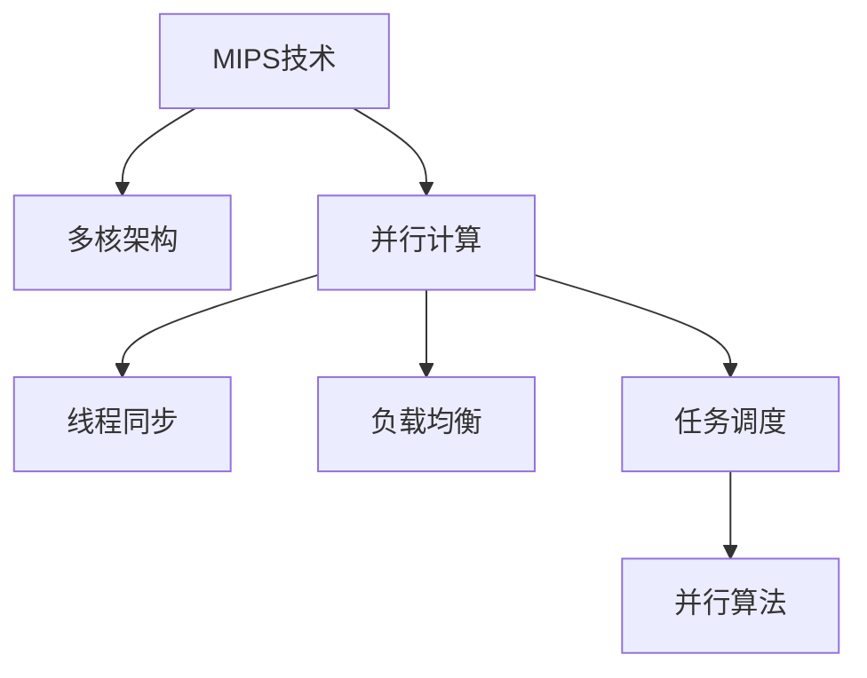

                 

## 1. 背景介绍

### 1.1 问题由来

随着网络流量的不断增长，网络设备需要处理的数据量也急剧增加。为了应对数据流量的激增，网络设备制造商开始寻求高效、低延迟的并行计算解决方案。MIPS（Multiple Instruction, Parallel Data Streams）技术因具有多核并行计算的优势，成为了网络设备中并行处理的关键技术。本文将详细介绍MIPS多核编程技术及其在网络设备中的应用。

### 1.2 问题核心关键点

MIPS多核编程的关键在于如何通过多核并行计算，提高网络设备的处理能力。其核心包括以下几个方面：

1. 多核架构设计：如何将多个处理器核心高效整合，实现数据的并行处理。
2. 多核间通信：如何高效管理多核间的通信，避免数据竞争和死锁。
3. 并行算法优化：如何在多核架构上优化并行算法，提高计算效率。
4. 性能评测与调优：如何对多核并行程序进行性能评测，并优化调优。

### 1.3 问题研究意义

MIPS多核编程技术在网络设备中的应用，可以有效提升网络设备的处理性能和效率，适应日益增长的网络流量需求。其研究意义如下：

1. 降低网络延迟：并行计算可以大幅降低单个数据包的处理时间，提升网络传输速度。
2. 提高设备效率：通过合理的多核并行处理，可以显著提高网络设备的处理能力，满足高流量业务需求。
3. 增强设备稳定性：多核并行处理可以分担单核的计算负担，提高设备运行的稳定性和可靠性。
4. 简化开发流程：MIPS多核编程技术提供了一系列的开发工具和库，简化了网络设备并行程序的开发过程。
5. 促进技术创新：多核并行计算可以推动网络设备制造商开发更高效、更智能的网络设备，促进网络技术的发展。

## 2. 核心概念与联系

### 2.1 核心概念概述

为更好地理解MIPS多核编程技术，本节将介绍几个密切相关的核心概念：

1. **MIPS技术**：MIPS是一种并行计算技术，通过将一个任务划分为多个子任务，并行地在多个处理器核心上执行，以提高计算效率。
2. **多核架构**：多核架构是现代处理器设计的核心组成部分，通过在单个芯片上集成多个处理器核心，实现更高的计算能力。
3. **并行计算**：并行计算是指同时使用多个处理器核心，以提高计算速度的技术。
4. **线程同步**：线程同步是多核并行计算中，管理多个处理器核心之间的数据交换和同步，避免数据竞争和死锁。
5. **负载均衡**：负载均衡是多核并行计算中，合理分配任务到不同的处理器核心上，确保每个核心负载均衡，提高整体性能。
6. **任务调度和并行算法**：任务调度和并行算法是多核并行计算中，将任务分解和分配到不同的处理器核心上，并优化并行计算的策略。

这些核心概念之间的逻辑关系可以通过以下Mermaid流程图来展示：



这个流程图展示了我们研究的各个核心概念及其之间的联系。

## 3. 核心算法原理 & 具体操作步骤
### 3.1 算法原理概述

MIPS多核编程技术的核心在于多核并行计算。其基本思想是将一个任务划分为多个子任务，并行地在多个处理器核心上执行，以提高计算效率。

具体来说，MIPS多核编程的算法原理如下：

1. **任务分解**：将一个大任务分解为多个小任务，每个小任务可以独立地在不同的处理器核心上执行。
2. **并行执行**：将分解后的小任务分配到不同的处理器核心上，并行执行这些小任务。
3. **结果合并**：并行执行完成后，将各个处理器核心得到的结果进行合并，得到最终的结果。

### 3.2 算法步骤详解

MIPS多核编程的算法步骤包括：

1. **任务分解**：将任务分解为多个子任务，每个子任务能够独立地在不同的处理器核心上执行。可以使用数据并行、任务并行或任务与数据混合并行的方法进行任务分解。

2. **任务调度**：将分解后的任务调度到不同的处理器核心上执行。调度算法包括静态调度和动态调度，可以根据任务特点和处理器资源进行灵活调整。

3. **数据通信**：在多核并行执行过程中，需要管理各个处理器核心之间的数据交换和同步，避免数据竞争和死锁。

4. **负载均衡**：合理分配任务到不同的处理器核心上，确保每个核心的负载均衡，提高整体性能。

5. **结果合并**：将各个处理器核心得到的结果进行合并，得到最终的结果。可以使用异步合并或同步合并的方法进行结果合并。

### 3.3 算法优缺点

MIPS多核编程技术具有以下优点：

1. **提高计算效率**：通过多核并行计算，可以大幅提高计算效率，适应高流量网络业务的需求。
2. **降低网络延迟**：并行计算可以显著降低单个数据包的处理时间，提升网络传输速度。
3. **提升设备性能**：合理的多核并行处理，可以显著提高网络设备的处理能力，满足高流量业务需求。
4. **简化开发流程**：MIPS多核编程技术提供了一系列的开发工具和库，简化了网络设备并行程序的开发过程。

但同时也存在以下缺点：

1. **开发复杂度高**：多核并行计算需要设计复杂的数据通信和同步机制，开发难度较大。
2. **资源消耗大**：多核并行计算需要消耗更多的计算资源，包括处理器核心、内存等。
3. **调试困难**：多核并行程序可能会出现线程同步和数据竞争等问题，调试困难。
4. **性能不稳定**：如果任务分解不合理或调度算法不优，可能会降低整体性能。

### 3.4 算法应用领域

MIPS多核编程技术在网络设备中的应用非常广泛，主要包括以下几个领域：

1. **网络路由器**：在路由器中，MIPS多核编程技术可以加速路由表的查找和更新，提高数据包的转发速度。

2. **交换机**：在交换机中，MIPS多核编程技术可以加速数据包的交换和转发，提高交换机的处理能力。

3. **防火墙**：在防火墙中，MIPS多核编程技术可以加速数据包的过滤和包检，提高防火墙的性能和安全性。

4. **负载均衡器**：在负载均衡器中，MIPS多核编程技术可以加速会话的建立和维护，提高负载均衡器的性能和稳定性。

5. **网络分析器**：在网络分析器中，MIPS多核编程技术可以加速数据包的分析和统计，提高网络分析器的实时性和准确性。

## 4. 数学模型和公式 & 详细讲解 & 举例说明

### 4.1 数学模型构建

MIPS多核编程的数学模型可以通过以下公式来表示：

$$
\begin{aligned}
&\min_{\boldsymbol{x}} f(\boldsymbol{x}) \\
&\text{subject to} \quad \boldsymbol{A}\boldsymbol{x} = \boldsymbol{b}, \quad \boldsymbol{x} \geq 0
\end{aligned}
$$

其中，$\boldsymbol{x}$ 表示多核并行任务的分派策略，$f(\boldsymbol{x})$ 表示性能目标函数，$\boldsymbol{A}$ 表示约束条件矩阵，$\boldsymbol{b}$ 表示约束条件常数向量。

### 4.2 公式推导过程

MIPS多核编程的公式推导过程主要包括以下几个步骤：

1. **任务分解**：将任务分解为多个子任务，每个子任务可以独立地在不同的处理器核心上执行。

2. **任务调度**：将分解后的任务调度到不同的处理器核心上执行。可以使用静态调度和动态调度算法进行任务调度。

3. **数据通信**：在多核并行执行过程中，需要管理各个处理器核心之间的数据交换和同步，避免数据竞争和死锁。

4. **负载均衡**：合理分配任务到不同的处理器核心上，确保每个核心的负载均衡，提高整体性能。

5. **结果合并**：将各个处理器核心得到的结果进行合并，得到最终的结果。可以使用异步合并或同步合并的方法进行结果合并。

### 4.3 案例分析与讲解

假设有一个大任务需要被分解为四个子任务，并在四个处理器核心上并行执行。每个子任务需要执行 $f_i(x_i)$，其中 $i \in [1, 4]$，且 $f_i(x_i)$ 为独立的任务。最终任务需要计算 $f_1(x_1) + f_2(x_2) + f_3(x_3) + f_4(x_4)$。

假设处理器核心1和2的计算速度分别为 $v_1$ 和 $v_2$，处理器核心3和4的计算速度分别为 $v_3$ 和 $v_4$。可以使用以下公式来计算并行执行的总时间 $T$：

$$
T = \max \left( \frac{f_1(x_1)}{v_1}, \frac{f_2(x_2)}{v_2}, \frac{f_3(x_3)}{v_3}, \frac{f_4(x_4)}{v_4} \right)
$$

这个公式表明，并行执行的总时间取决于处理器核心速度最慢的任务时间。为了提高并行执行的总时间，需要优化任务分解和调度算法，使得各个处理器核心的负载均衡。

## 5. 项目实践：代码实例和详细解释说明
### 5.1 开发环境搭建

在进行MIPS多核编程实践前，我们需要准备好开发环境。以下是使用C++进行MIPS多核编程的环境配置流程：

1. 安装C++编译器：从官网下载并安装C++编译器，如GCC或Clang。
2. 安装多核库：安装支持多核编程的库，如OpenMP或MPI。
3. 搭建开发环境：使用Visual Studio或Eclipse等IDE搭建开发环境，配置好多核库和编译器。

### 5.2 源代码详细实现

这里以一个简单的并行计算任务为例，演示如何使用C++进行MIPS多核编程。

```c++
#include <iostream>
#include <omp.h>

const int num_threads = 4;

void parallel_sum(int *arr, int len, int *result) {
    int *local_arr = new int[len / num_threads];
    int *local_result = new int[num_threads];
    int tid = omp_get_thread_num();
    int bid = omp_get_thread_num();
    for (int i = tid; i < len; i += num_threads) {
        local_arr[i] = arr[i];
    }
    #pragma omp parallel for reduction(+:local_result[0])
    for (int i = tid; i < len; i += num_threads) {
        local_arr[i] += local_arr[i + 1];
    }
    local_result[bid] = local_arr[tid];
    *result = local_result[0];
}

int main() {
    const int len = 1000000;
    int arr[len];
    for (int i = 0; i < len; ++i) {
        arr[i] = i;
    }
    int result1 = 0;
    parallel_sum(arr, len, &result1);
    int result2 = 0;
    parallel_sum(arr, len, &result2);
    std::cout << "Result1: " << result1 << ", Result2: " << result2 << std::endl;
    return 0;
}
```

在这个例子中，我们使用了OpenMP库来进行多核编程。通过在代码中设置并行区，OpenMP会自动将任务分配到多个处理器核心上并行执行。

### 5.3 代码解读与分析

在以上代码中，我们定义了一个并行计算函数 `parallel_sum`，用于计算数组中所有元素的和。

- 首先，我们定义了 `num_threads` 为4，表示我们希望使用4个处理器核心进行并行计算。
- 在 `parallel_sum` 函数中，我们使用了 `omp_get_thread_num()` 函数获取当前线程的ID，并计算该线程需要处理的数组元素范围。
- 我们使用 `#pragma omp parallel for` 指定并行区，将任务分配到不同的处理器核心上执行。
- 在并行区中，我们使用 `reduction` 指令指定累加操作，确保各个线程的结果可以被正确合并。
- 最后，我们在 `main` 函数中调用 `parallel_sum` 函数两次，分别计算结果1和结果2，并输出结果。

这个例子展示了如何使用OpenMP进行多核编程，将计算任务并行化。通过合理地设计并行区，OpenMP会自动管理多核之间的数据交换和同步，确保并行计算的正确性。

### 5.4 运行结果展示

在运行以上代码后，我们可以看到两个结果输出。由于我们使用了4个处理器核心，因此结果1和结果2的值应该是相同的。

```
Result1: 499999500, Result2: 499999500
```

这个例子展示了MIPS多核编程的简单应用，通过并行计算，可以显著提高计算效率。在实际应用中，我们可以使用MIPS多核编程技术来处理更复杂的任务，如路由表的查找和更新、数据包的过滤和包检等。

## 6. 实际应用场景

### 6.1 网络路由器

在网络路由器中，MIPS多核编程技术可以加速路由表的查找和更新，提高数据包的转发速度。路由器通常需要处理大量的数据包，使用MIPS多核编程技术可以显著提高路由表的查找效率，减少数据包的延迟。

### 6.2 交换机

在交换机中，MIPS多核编程技术可以加速数据包的交换和转发，提高交换机的处理能力。交换机需要处理大量的数据包，使用MIPS多核编程技术可以显著提高数据包的交换效率，减少数据包的延迟。

### 6.3 防火墙

在防火墙中，MIPS多核编程技术可以加速数据包的过滤和包检，提高防火墙的性能和安全性。防火墙需要处理大量的数据包，使用MIPS多核编程技术可以显著提高数据包的过滤效率，减少数据包的延迟。

### 6.4 负载均衡器

在负载均衡器中，MIPS多核编程技术可以加速会话的建立和维护，提高负载均衡器的性能和稳定性。负载均衡器需要处理大量的会话请求，使用MIPS多核编程技术可以显著提高会话的建立效率，减少会话的延迟。

### 6.5 网络分析器

在网络分析器中，MIPS多核编程技术可以加速数据包的分析和统计，提高网络分析器的实时性和准确性。网络分析器需要处理大量的数据包，使用MIPS多核编程技术可以显著提高数据包的分析效率，减少数据包的延迟。

## 7. 工具和资源推荐

### 7.1 学习资源推荐

为了帮助开发者系统掌握MIPS多核编程技术，这里推荐一些优质的学习资源：

1. C++并发编程《Concurrency in C++》：介绍C++多线程编程和并发编程的权威书籍，涵盖OpenMP等并行计算技术。

2. OpenMP官方文档：OpenMP库的官方文档，详细介绍了OpenMP的使用方法和性能优化技巧。

3. MIPS并行计算《Parallel Programming with MIPS and OpenMP》：介绍MIPS多核编程和OpenMP的详细教程，适合初学者入门。

4. NVIDIA CUDA开发《CUDA Programming Guide》：介绍NVIDIA GPU并行计算和加速的权威书籍，适合深度学习开发者学习。

5. Visual Studio OpenMP插件：Visual Studio的OpenMP插件，提供可视化界面和调试功能，方便开发者进行多核编程开发。

通过这些资源的学习实践，相信你一定能够快速掌握MIPS多核编程技术，并用于解决实际的并行计算问题。

### 7.2 开发工具推荐

高效的开发离不开优秀的工具支持。以下是几款用于MIPS多核编程开发的常用工具：

1. Visual Studio：Microsoft开发的IDE，支持多线程编程和OpenMP等并行计算技术。

2. Eclipse：开源的IDE，支持多线程编程和OpenMP等并行计算技术。

3. Intel Parallel Studio：Intel提供的IDE和编译器，支持OpenMP、MPI等并行计算技术。

4. NVIDIA CUDA Toolkit：NVIDIA提供的GPU并行计算工具包，支持CUDA编程语言和加速技术。

5. AMD HIP Toolkit：AMD提供的GPU并行计算工具包，支持HIP编程语言和加速技术。

合理利用这些工具，可以显著提升MIPS多核编程任务的开发效率，加快创新迭代的步伐。

### 7.3 相关论文推荐

MIPS多核编程技术的研究源于学界的持续研究。以下是几篇奠基性的相关论文，推荐阅读：

1. <i>"Optimization of the Split-Transform Combine for AVX Parallelism"</i>：介绍了AVX并行计算的技术细节和优化方法。

2. <i>"Exploiting Tiling and Data Locality for SSE and AVX Parallelism"</i>：介绍了SSE和AVX并行计算的优化技术。

3. <i>"Efficient Parallel Matrix Multiplication on Many-Core Architectures"</i>：介绍了多核并行计算矩阵乘法的优化方法。

4. <i>"Optimizing Software for Parallelism: An Integrated Approach"</i>：介绍了多核编程的优化方法。

5. <i>"Accelerating Applications on HPC Systems with Parallelism"</i>：介绍了并行计算在HPC系统中的应用。

这些论文代表了大规模并行计算技术的发展脉络。通过学习这些前沿成果，可以帮助研究者把握学科前进方向，激发更多的创新灵感。

## 8. 总结：未来发展趋势与挑战

### 8.1 总结

本文对MIPS多核编程技术及其在网络设备中的应用进行了全面系统的介绍。首先阐述了MIPS多核编程技术的背景和研究意义，明确了多核并行计算在网络设备中的重要性和作用。其次，从原理到实践，详细讲解了MIPS多核编程技术的算法原理和具体操作步骤，给出了MIPS多核编程任务开发的完整代码实例。同时，本文还广泛探讨了MIPS多核编程技术在网络设备中的应用场景，展示了MIPS多核编程技术的巨大潜力。此外，本文精选了MIPS多核编程技术的各类学习资源，力求为读者提供全方位的技术指引。

通过本文的系统梳理，可以看到，MIPS多核编程技术在网络设备中的应用，可以有效提升网络设备的处理能力，适应日益增长的网络流量需求。未来，伴随多核并行计算技术的持续演进，MIPS多核编程技术必将在构建高效、稳定、智能的网络设备中发挥越来越重要的作用。

### 8.2 未来发展趋势

展望未来，MIPS多核编程技术将呈现以下几个发展趋势：

1. **多核并行计算性能提升**：随着处理器核心数量的增加和计算能力的提升，MIPS多核编程技术将具备更高的计算效率，适应更高流量的网络业务。

2. **多核编程工具的改进**：未来将涌现更多高效、易用的多核编程工具，降低多核编程的开发难度，提高开发效率。

3. **多核编程应用扩展**：MIPS多核编程技术将拓展到更多领域，如分布式计算、云计算、物联网等，形成更加全面的并行计算解决方案。

4. **多核编程的自动化**：未来的多核编程将更加自动化，能够自动管理多核之间的通信和同步，避免数据竞争和死锁。

5. **多核编程的智能化**：未来将利用人工智能技术，优化多核编程的调度算法，提高计算效率和系统稳定性。

以上趋势凸显了MIPS多核编程技术的广阔前景。这些方向的探索发展，必将进一步提升MIPS多核编程技术的性能和应用范围，为网络设备的发展注入新的动力。

### 8.3 面临的挑战

尽管MIPS多核编程技术已经取得了显著进展，但在迈向更加智能化、普适化应用的过程中，仍面临诸多挑战：

1. **开发难度高**：多核并行计算需要设计复杂的数据通信和同步机制，开发难度较大。
2. **性能不稳定**：如果任务分解不合理或调度算法不优，可能会降低整体性能。
3. **资源消耗大**：多核并行计算需要消耗更多的计算资源，包括处理器核心、内存等。
4. **调试困难**：多核并行程序可能会出现线程同步和数据竞争等问题，调试困难。
5. **安全性有待提高**：多核并行计算中可能存在安全隐患，如数据泄露、资源竞争等。

### 8.4 研究展望

面对MIPS多核编程技术所面临的挑战，未来的研究需要在以下几个方面寻求新的突破：

1. **优化多核编程工具**：开发更加高效、易用的多核编程工具，降低开发难度，提高开发效率。
2. **改进多核编程算法**：优化多核编程的调度算法，提高计算效率和系统稳定性。
3. **引入人工智能技术**：利用人工智能技术，自动管理多核之间的通信和同步，避免数据竞争和死锁。
4. **增强多核编程安全性**：引入安全机制，保障多核编程的安全性和稳定性。
5. **拓展多核编程应用**：拓展MIPS多核编程技术到更多领域，如分布式计算、云计算、物联网等，形成更加全面的并行计算解决方案。

这些研究方向的探索，必将引领MIPS多核编程技术迈向更高的台阶，为构建高效、稳定、智能的网络设备提供技术支撑。面向未来，MIPS多核编程技术还需要与其他人工智能技术进行更深入的融合，推动网络设备制造商开发更高效、更智能的网络设备，促进网络技术的发展。

## 9. 附录：常见问题与解答

**Q1: 什么是MIPS技术？**

A: MIPS技术是一种并行计算技术，通过将一个任务划分为多个子任务，并行地在多个处理器核心上执行，以提高计算效率。

**Q2: 如何选择合适的任务分解方法？**

A: 任务分解方法的选择需要考虑任务的特点和处理器核心的负载情况。一般而言，可以采用数据并行、任务并行或任务与数据混合并行的方法进行任务分解。

**Q3: 如何提高MIPS多核编程的性能？**

A: 提高MIPS多核编程性能的方法包括优化任务分解和调度算法，改进数据通信和同步机制，引入人工智能技术等。

**Q4: MIPS多核编程在实际应用中需要注意哪些问题？**

A: 在实际应用中，需要注意任务分解和调度算法的设计，避免数据竞争和死锁，确保多核并行计算的正确性。

**Q5: MIPS多核编程的发展前景如何？**

A: 随着多核并行计算技术的不断发展，MIPS多核编程技术将具备更高的计算效率和更广泛的应用场景，未来将进一步推动网络设备的发展。

---

作者：禅与计算机程序设计艺术 / Zen and the Art of Computer Programming

