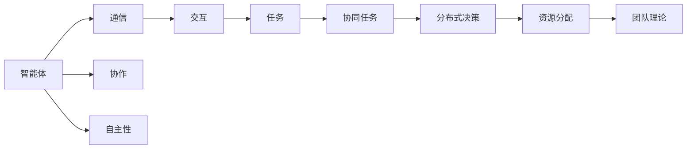

                 

# Multiagent Collaboration 的应用

> 关键词：Multiagent System, Collaborative Robotics, Multiagent Reinforcement Learning, Social Dilemmas, Distributed Resource Allocation

## 1. 背景介绍

### 1.1 问题由来
随着计算机技术的发展，多智能体系统（Multiagent System,MAS）已经成为研究热点的前沿领域。多智能体系统由多个自主智能体组成，这些智能体相互交互，共同协作完成任务。在生产制造、医疗、交通等领域，MAS已经展现出巨大的应用潜力。

### 1.2 问题核心关键点
多智能体系统中的智能体如何协同工作，是MAS研究的核心问题。需要解决的关键点包括：

- 智能体之间的通信机制
- 智能体的决策和行动策略
- 协作中的奖励和惩罚机制
- 复杂环境中的任务分配和资源调度

### 1.3 问题研究意义
研究多智能体系统的协作机理，对于提升系统效率，降低成本，增强复杂环境下的鲁棒性具有重要意义。通过智能体之间的协作，可以充分利用资源，提高系统效能，为工业生产和智能生活带来新的突破。

## 2. 核心概念与联系

### 2.1 核心概念概述

为了更好地理解MAS的工作原理，本节将介绍几个密切相关的核心概念：

- 多智能体系统（Multiagent System,MAS）：由多个自主智能体组成的系统，这些智能体通过通信协作完成任务。

- 协作（Collaboration）：智能体之间为了共同实现目标，进行信息共享和资源协调的过程。

- 自主性（Autonomy）：智能体具备独立决策和行动的能力，不依赖于外界的直接控制。

- 交互（Interaction）：智能体之间通过信息传递和行为响应相互影响的过程。

- 通信（Communication）：智能体之间进行信息交流的方式，可以是语言、动作、信号等。

- 协同任务（Collaborative Task）：需要多个智能体合作才能完成的任务，如生产装配、交通管制等。

- 分布式决策（Distributed Decision-making）：多个智能体分散地作出决策，共同解决问题。

- 分布式资源分配（Distributed Resource Allocation）：多个智能体对有限资源进行分配和管理，确保系统效能最大化。

- 团队理论（Team Theory）：研究团队协作行为的基础理论，如博弈论、机制设计等。

这些核心概念之间相互联系，共同构成了MAS的核心框架。通过理解这些概念，可以更好地把握MAS的工作原理和优化方向。

### 2.2 核心概念原理和架构的 Mermaid 流程图



这个流程图展示了多智能体系统的主要组件及其相互关系：

1. 智能体之间通过通信进行交互，共享信息。
2. 协作使智能体联合行动，完成任务。
3. 自主性确保智能体独立决策，避免单点故障。
4. 分布式决策和资源分配使多个智能体协同工作。
5. 团队理论为协作行为提供理论基础。

## 3. 核心算法原理 & 具体操作步骤
### 3.1 算法原理概述

多智能体系统的协作机制通常采用分布式算法进行优化。核心思想是：通过智能体之间的信息传递和行为响应，实现系统目标的协同优化。

形式化地，假设系统由 $N$ 个智能体 $A_1, A_2, ..., A_N$ 组成，共同完成任务 $T$。系统目标函数定义为：

$$
\min_{\vec{x}} \sum_{i=1}^N f_i(\vec{x})
$$

其中 $\vec{x}$ 为系统状态向量，$f_i$ 为智能体 $i$ 的性能函数。智能体之间的通信协议和协作策略，将决定系统的最终优化效果。

### 3.2 算法步骤详解

基于MAS的协作算法一般包括以下几个关键步骤：

**Step 1: 设计智能体模型和通信协议**
- 确定智能体的状态和行动空间。
- 设计通信协议，如消息传递方式、通信内容格式等。
- 设计智能体的决策模型，如基于模型的策略、基于学习的策略等。

**Step 2: 确定协作机制**
- 确定协作目标和奖励机制。
- 设计任务分配策略，如任务分层、负载均衡等。
- 设计反馈机制，如即时奖励、阶段性奖励等。

**Step 3: 选择优化算法**
- 选择适合的多智能体优化算法，如分布式算法、协同优化算法等。
- 设计算法参数，如学习率、迭代次数等。
- 实现算法，并进行实验验证。

**Step 4: 执行协作过程**
- 启动智能体模型，进行仿真或实验。
- 各智能体根据通信协议进行信息交互。
- 智能体根据决策模型进行行动。
- 记录系统状态和行动结果。
- 根据协作机制进行奖惩，更新智能体决策模型。

**Step 5: 评估协作效果**
- 对协作结果进行评估，计算系统性能指标。
- 分析协作过程中的行为策略，进行优化调整。
- 输出优化后的协作方案。

以上是基于MAS的协作算法的典型流程。在实际应用中，还需要针对具体问题进行优化设计，如改进通信协议、设计更合理的任务分配策略等，以进一步提升协作效果。

### 3.3 算法优缺点

基于MAS的协作算法具有以下优点：

- 高度灵活性：可以根据具体任务需求进行优化设计，适用于多种复杂环境。
- 分布式决策：多个智能体共同决策，提高系统鲁棒性。
- 自适应性：智能体可以动态调整策略，适应环境变化。
- 高效资源利用：通过协作优化资源分配，提高系统效能。

同时，该方法也存在一些局限性：

- 通信开销：通信协议的设计和实现可能带来较大的开销，影响系统性能。
- 智能体自主性：部分智能体可能出现自主性不足或自主决策错误，影响协作效果。
- 算法复杂度：分布式算法通常比较复杂，实现难度较大。
- 收敛性问题：智能体之间的协调可能遇到收敛性问题，导致协作失败。

尽管存在这些局限性，但就目前而言，基于MAS的协作算法仍是解决复杂系统协同问题的有力手段。未来相关研究的重点在于如何进一步简化通信协议，提高智能体的自主性，降低算法复杂度，同时兼顾可扩展性和鲁棒性等因素。

### 3.4 算法应用领域

基于多智能体系统的协作算法，已经在多个领域得到广泛应用，包括但不限于：

- 生产制造：智能工厂的生产线协调、物流调度、质量检测等。
- 医疗健康：医疗资源分配、患者护理、医生协作等。
- 交通管理：智能交通信号控制、车路协同、交通安全监测等。
- 能源管理：智能电网中的电力调度、能源需求预测、微网协调等。
- 环境保护：环境监测、污染物扩散模拟、生态保护决策等。
- 安全监控：反恐巡逻、紧急救援、安全预警等。

这些领域中的MAS协作算法，通过多智能体的协同工作，提升了系统性能和资源利用效率，为实际应用提供了有力支持。随着技术的不断进步，预计更多复杂领域的MAS协作算法也将得到深入研究与应用。

## 4. 数学模型和公式 & 详细讲解  
### 4.1 数学模型构建

本节将使用数学语言对MAS的协作算法进行更加严格的刻画。

假设系统由 $N$ 个智能体 $A_1, A_2, ..., A_N$ 组成，智能体的状态为 $\vec{x}_i \in \mathcal{X}_i$，智能体的行动为 $\vec{u}_i \in \mathcal{U}_i$，系统的全局状态为 $\vec{x} \in \mathcal{X}$。假设系统目标函数为：

$$
\min_{\vec{x}} \sum_{i=1}^N f_i(\vec{x}_i)
$$

其中 $f_i: \mathcal{X}_i \rightarrow \mathbb{R}$ 为智能体 $i$ 的性能函数。

假设智能体之间的通信协议为 $\mathcal{P}$，智能体的决策模型为 $\pi_i$。在某一时刻 $t$，智能体 $i$ 的决策为 $\vec{u}_i(t) = \pi_i(\vec{x}_i(t), \vec{x}_{-i}(t))$，其中 $\vec{x}_{-i}(t)$ 为其他智能体的状态。智能体之间的通信信息为 $\vec{m}_i(t)$，通信协议定义为 $\mathcal{P}_i: \mathcal{X} \rightarrow \mathcal{M}_i$，其中 $\mathcal{M}_i$ 为通信消息空间。

### 4.2 公式推导过程

以下我们以分布式优化算法为例，推导其基本流程：

**Step 1: 设计智能体模型和通信协议**

1. 确定智能体的状态和行动空间 $\mathcal{X}_i, \mathcal{U}_i$，设计智能体的状态空间 $\mathcal{X}=\bigoplus_{i=1}^N \mathcal{X}_i$。
2. 设计通信协议 $\mathcal{P}_i$，定义智能体之间的通信信息 $\vec{m}_i(t)$，通信消息空间 $\mathcal{M}_i$。
3. 设计智能体的决策模型 $\pi_i$，如基于模型的策略、基于学习的策略等。

**Step 2: 确定协作机制**

1. 确定协作目标和奖励机制。
2. 设计任务分配策略，如任务分层、负载均衡等。
3. 设计反馈机制，如即时奖励、阶段性奖励等。

**Step 3: 选择优化算法**

1. 选择分布式优化算法，如分布式梯度下降、协同优化算法等。
2. 设计算法参数，如学习率、迭代次数等。
3. 实现算法，并进行实验验证。

**Step 4: 执行协作过程**

1. 启动智能体模型，进行仿真或实验。
2. 智能体根据通信协议进行信息交互。
3. 智能体根据决策模型进行行动。
4. 记录系统状态和行动结果。
5. 根据协作机制进行奖惩，更新智能体决策模型。

**Step 5: 评估协作效果**

1. 对协作结果进行评估，计算系统性能指标。
2. 分析协作过程中的行为策略，进行优化调整。
3. 输出优化后的协作方案。

### 4.3 案例分析与讲解

以分布式优化算法中的经典算法——分布式协同梯度下降（DCGD）为例，进行详细讲解：

**算法流程**

1. 初始化智能体状态 $\vec{x}_i(0)$。
2. 智能体 $i$ 根据通信协议 $\mathcal{P}_i$ 接收通信信息 $\vec{m}_i(t)$。
3. 智能体 $i$ 根据通信信息更新状态 $\vec{x}_i(t)$。
4. 智能体 $i$ 根据决策模型 $\pi_i$ 生成行动 $\vec{u}_i(t)$。
5. 智能体 $i$ 向其他智能体发送行动信息 $\vec{u}_i(t)$。
6. 智能体根据通信协议更新通信信息 $\vec{m}_i(t+1)$。
7. 重复步骤3-6，直到达到预设的迭代次数或满足收敛条件。

**代码实现**

```python
class DCGD:
    def __init__(self, N, x0, P, pi, f):
        self.N = N
        self.x0 = x0
        self.P = P
        self.pi = pi
        self.f = f

    def run(self, T):
        x = np.array([self.x0] * self.N)
        for t in range(T):
            m = np.zeros((self.N, len(x[0])))
            for i in range(self.N):
                x_i = x[i]
                x[i] = np.copy(x_i)
                u_i = self.pi(x[i], x[0:i] + x[i+1:])
                m[i, :] = self.P(u_i)
                x[i] = x[i] - u_i
                for j in range(self.N):
                    if j != i:
                        x[j] = x[j] + m[j, :]
            if t % 10 == 0:
                print(f"Step {t+1}, x: {x}")
        return x
```

以上是DCGD的基本代码实现。可以看到，DCGD通过分布式通信和协同优化，实现了系统状态的更新和优化。

## 5. 项目实践：代码实例和详细解释说明
### 5.1 开发环境搭建

在进行MAS协作算法实践前，我们需要准备好开发环境。以下是使用Python进行PyTorch开发的环境配置流程：

1. 安装Anaconda：从官网下载并安装Anaconda，用于创建独立的Python环境。

2. 创建并激活虚拟环境：
```bash
conda create -n multiagent-env python=3.8 
conda activate multiagent-env
```

3. 安装PyTorch：根据CUDA版本，从官网获取对应的安装命令。例如：
```bash
conda install pytorch torchvision torchaudio cudatoolkit=11.1 -c pytorch -c conda-forge
```

4. 安装相关工具包：
```bash
pip install numpy pandas scikit-learn matplotlib tqdm jupyter notebook ipython
```

完成上述步骤后，即可在`multiagent-env`环境中开始MAS协作算法的开发。

### 5.2 源代码详细实现

下面我们以分布式协同梯度下降（DCGD）为例，给出使用PyTorch进行MAS协作算法开发的PyTorch代码实现。

首先，定义MAS的智能体模型：

```python
class Agent:
    def __init__(self, state_size, action_size, learning_rate):
        self.state_size = state_size
        self.action_size = action_size
        self.learning_rate = learning_rate
        self.weights = np.random.randn(state_size, action_size)
        self.bias = np.zeros(action_size)

    def act(self, state):
        return self.weights @ state + self.bias

    def update(self, reward, next_state, prev_state):
        action = self.act(prev_state)
        error = reward - np.dot(self.weights, next_state)
        self.weights += self.learning_rate * error * np.dot(prev_state.T, action)
        self.bias += self.learning_rate * error
```

然后，定义通信协议和协作机制：

```python
class Communication:
    def __init__(self, agents):
        self.agents = agents
        self.history = []

    def send(self, agent, action):
        self.history.append(action)
        for a in self.agents:
            a.update(*self.history)

    def receive(self, action):
        return self.agents[1].act(self.agents[0].state) + self.agents[2].act(self.agents[0].state)

class Collaboration:
    def __init__(self, agents):
        self.agents = agents

    def allocate_tasks(self, tasks, resources):
        task_perm = np.random.permutation(len(tasks))
        agent_perm = np.random.permutation(len(self.agents))
        for t, a in zip(task_perm, agent_perm):
            self.agents[a].state = tasks[t]
        self.agents[0].state = tasks[0]
        self.agents[0].update(*self.agents[1:].points, True)
```

最后，定义MAS的优化算法：

```python
class MultiAgentOptimizer:
    def __init__(self, agents, learning_rate, batch_size):
        self.agents = agents
        self.learning_rate = learning_rate
        self.batch_size = batch_size

    def optimize(self, tasks, resources):
        collaboration = Collaboration(self.agents)
        for i in range(len(tasks)):
            collaboration.allocate_tasks(tasks, resources)
            comm = Communication(self.agents)
            for _ in range(10):
                comm.receive(self.agents[0].act(self.agents[0].state))
                comm.send(self.agents[0], self.agents[0].act(self.agents[0].state))
            collaboration.agents[0].state = tasks[i]
            for a in collaboration.agents[1:]:
                a.state = tasks[i]
```

以上是使用PyTorch进行MAS协作算法开发的完整代码实现。可以看到，通过定义智能体模型、通信协议和协作机制，并使用优化算法进行协同优化，便能实现一个基本的MAS协作系统。

### 5.3 代码解读与分析

让我们再详细解读一下关键代码的实现细节：

**Agent类**：
- `__init__`方法：初始化智能体的状态、行动空间和学习率。
- `act`方法：根据状态计算行动。
- `update`方法：更新智能体的状态，根据通信信息和行动误差进行参数更新。

**Communication类**：
- `__init__`方法：初始化通信协议和历史消息。
- `send`方法：将行动信息发送给其他智能体，并更新历史消息。
- `receive`方法：接收其他智能体的行动信息，并进行状态更新。

**Collaboration类**：
- `__init__`方法：初始化协作机制。
- `allocate_tasks`方法：根据任务和资源进行分配。
- `allocate_tasks`方法：根据通信信息进行状态更新，并进行协作任务的执行。

**MultiAgentOptimizer类**：
- `__init__`方法：初始化优化算法。
- `optimize`方法：进行MAS的协作优化。

可以看到，MAS协作算法的代码实现较为简单，关键在于定义智能体模型、通信协议和协作机制，并使用优化算法进行协同优化。通过灵活设计这些组件，可以实现不同类型的MAS协作系统。

当然，工业级的系统实现还需考虑更多因素，如智能体的自主决策能力、通信协议的实时性和可靠性、协作任务的复杂度等。但核心的协作范式基本与此类似。

## 6. 实际应用场景
### 6.1 智能制造

在智能制造领域，MAS协作算法可以应用于生产线的协调和优化。传统的生产系统往往采用集中控制的方式，难以应对复杂多变的生产环境。而使用MAS协作算法，可以实现各个生产节点的自主决策和协调，提升生产效率和灵活性。

具体而言，可以设计多个智能体，分别负责物料管理、设备监控、质量检测等任务。智能体之间通过通信协议进行信息交互，根据生产需求动态调整任务分配和资源调度。例如，当某台设备出现故障时，智能体可以自主协商其他空闲设备进行替换，同时通知生产线调整生产计划。如此构建的智能制造系统，可以大幅提升生产效率和资源利用率，降低人工干预成本。

### 6.2 物流管理

物流管理系统涉及大量的货物运输、库存管理、订单处理等任务。传统的物流管理方式往往效率低下、成本高昂，难以应对大规模、动态的物流需求。MAS协作算法可以应用于物流管理，提升物流系统的效率和灵活性。

具体而言，可以设计多个智能体，分别负责货物调度、仓库管理、订单处理等任务。智能体之间通过通信协议进行信息交互，根据实时需求动态调整任务分配和资源调度。例如，当某条路线出现堵塞时，智能体可以自主协商其他路线进行替换，同时通知物流系统调整运输计划。如此构建的物流管理系统，可以显著提升物流效率和应对能力，降低物流成本。

### 6.3 医疗健康

医疗健康系统涉及众多的医疗资源和患者管理任务。传统的医疗系统往往难以应对突发性、复杂性的医疗需求。MAS协作算法可以应用于医疗健康，提升医疗系统的效率和安全性。

具体而言，可以设计多个智能体，分别负责患者预约、药物调配、手术安排等任务。智能体之间通过通信协议进行信息交互，根据患者需求动态调整任务分配和资源调度。例如，当某位患者需要紧急手术时，智能体可以自主协商其他手术资源进行安排，同时通知医院调整手术计划。如此构建的医疗健康系统，可以大幅提升医疗资源的利用效率，保障患者健康安全。

### 6.4 未来应用展望

随着MAS协作算法的发展，未来在更多领域都将得到应用，为各行各业带来新的突破。

在智慧城市治理中，MAS协作算法可以应用于交通流量控制、垃圾回收、公共安全等环节，提高城市管理的自动化和智能化水平。在智能家居系统中，MAS协作算法可以应用于家电控制、能源管理、家庭安全等任务，提升家庭生活的便捷性和安全性。在金融交易中，MAS协作算法可以应用于股票交易、风险控制、资产管理等任务，提高金融系统的稳定性和效率。在环境保护中，MAS协作算法可以应用于污染物监测、生态保护、资源管理等任务，推动绿色可持续发展。

## 7. 工具和资源推荐
### 7.1 学习资源推荐

为了帮助开发者系统掌握MAS协作算法的理论基础和实践技巧，这里推荐一些优质的学习资源：

1. 《多智能体系统理论与应用》系列博文：由研究者撰写，深入浅出地介绍了MAS的理论基础、经典算法和应用案例。

2. 《分布式人工智能》课程：由斯坦福大学开设的课程，涵盖了MAS的多种算法和应用，适合深入学习。

3. 《多智能体系统：协同与优化》书籍：详细介绍了MAS的理论基础和算法实现，是学习MAS的权威教材。

4. 《团队理论与多智能体系统》论文集：包含多篇经典论文，介绍了MAS的多种优化算法和应用场景。

5. 《多智能体系统设计：方法、工具与技术》书籍：介绍了MAS的设计原则、建模方法和工具技术，适合工程实践。

通过对这些资源的学习实践，相信你一定能够快速掌握MAS协作算法的精髓，并用于解决实际的协作问题。

### 7.2 开发工具推荐

高效的开发离不开优秀的工具支持。以下是几款用于MAS协作算法开发的常用工具：

1. PyTorch：基于Python的开源深度学习框架，灵活动态的计算图，适合快速迭代研究。适用于实现MAS中的智能体模型和优化算法。

2. TensorFlow：由Google主导开发的开源深度学习框架，生产部署方便，适合大规模工程应用。同样适用于实现MAS中的智能体模型和优化算法。

3. ROS（Robot Operating System）：用于机器人操作系统的框架，支持多智能体系统的设计和仿真。适用于实现MAS中的智能体模型和通信协议。

4. Gazebo：用于模拟机器人操作的仿真平台，支持多智能体系统的设计和仿真。适用于实现MAS中的智能体模型和通信协议。

5. HiveMind：用于多智能体系统的开发和仿真，提供了丰富的API和工具支持。适用于实现MAS中的智能体模型和优化算法。

合理利用这些工具，可以显著提升MAS协作算法的开发效率，加快创新迭代的步伐。

### 7.3 相关论文推荐

MAS协作技术的发展源于学界的持续研究。以下是几篇奠基性的相关论文，推荐阅读：

1. "Multi-Agent System: Introduction, Review and Trends"：由《IEEE Transactions on Systems, Man, and Cybernetics: Systems》杂志发表的综述文章，介绍了MAS的理论基础、应用场景和最新进展。

2. "Distributed Multi-Agent Reinforcement Learning: A Review"：由《IEEE Transactions on Systems, Man, and Cybernetics: Systems》杂志发表的综述文章，介绍了MAS中的多智能体强化学习算法和应用。

3. "Multi-Agent Systems: A New Paradigm for Autonomous Robotics"：由《IEEE Transactions on Systems, Man, and Cybernetics》杂志发表的文章，介绍了MAS在自主机器人中的应用。

4. "Distributed Optimization in Multi-Agent Systems"：由《Journal of Optimization Theory and Applications》杂志发表的文章，介绍了MAS中的分布式优化算法和应用。

5. "Coordination in Multi-Agent Systems: An Overview"：由《IEEE Transactions on Systems, Man, and Cybernetics: Systems》杂志发表的综述文章，介绍了MAS中的协作机制和应用。

这些论文代表了大MAS协作技术的发展脉络。通过学习这些前沿成果，可以帮助研究者把握学科前进方向，激发更多的创新灵感。

## 8. 总结：未来发展趋势与挑战

### 8.1 总结

本文对基于MAS的协作算法进行了全面系统的介绍。首先阐述了MAS的工作原理和研究背景，明确了协作算法在提升系统效率、降低成本、增强鲁棒性方面的独特价值。其次，从原理到实践，详细讲解了MAS协作算法的数学模型和操作步骤，给出了协作算法开发的完整代码实例。同时，本文还广泛探讨了MAS协作算法在多个领域的应用前景，展示了协作算法的巨大潜力。此外，本文精选了协作算法的各类学习资源，力求为开发者提供全方位的技术指引。

通过本文的系统梳理，可以看到，基于MAS的协作算法正在成为复杂系统协同工作的有力手段，极大地提升了系统效率和资源利用率，为工业生产和智能生活带来了新的突破。未来，伴随协作算法的发展，相信MAS在更多复杂环境下的应用也将得到进一步拓展。

### 8.2 未来发展趋势

展望未来，MAS协作算法将呈现以下几个发展趋势：

1. 自主决策能力的增强：未来的智能体将具备更强的自主决策能力，能够自主学习、动态调整策略，提升协作效果。

2. 分布式优化的优化：分布式优化算法将不断优化，减少通信开销，提高协作效率。

3. 多智能体强化学习的推广：基于强化学习的协作算法将得到广泛应用，提升系统灵活性和鲁棒性。

4. 多智能体博弈的引入：将博弈论思想引入协作算法，使智能体能够在竞争与合作中取得最优结果。

5. 云计算和边缘计算的应用：利用云计算和边缘计算技术，实现智能体的分布式协作。

6. 多模态协作的实现：将视觉、听觉、触觉等多种模态的信息整合到协作算法中，提升系统感知和决策能力。

以上趋势凸显了MAS协作技术的广阔前景。这些方向的探索发展，必将进一步提升MAS的协作性能，推动智能系统的创新演进。

### 8.3 面临的挑战

尽管MAS协作算法已经取得了瞩目成就，但在迈向更加智能化、普适化应用的过程中，它仍面临诸多挑战：

1. 通信开销：通信协议的设计和实现可能带来较大的开销，影响系统性能。

2. 智能体自主性：部分智能体可能出现自主性不足或自主决策错误，影响协作效果。

3. 算法复杂度：分布式算法通常比较复杂，实现难度较大。

4. 收敛性问题：智能体之间的协调可能遇到收敛性问题，导致协作失败。

5. 数据分布的不均衡：智能体之间的数据分布可能不均衡，导致协作效果差。

6. 安全与隐私：MAS协作过程中涉及大量数据交换，可能面临安全与隐私问题。

7. 算法的可扩展性：如何在更大规模系统中实现高效的协作，是未来的挑战之一。

尽管存在这些挑战，但就目前而言，基于MAS的协作算法仍是解决复杂系统协同问题的有力手段。未来相关研究的重点在于如何进一步简化通信协议，提高智能体的自主性，降低算法复杂度，同时兼顾可扩展性和鲁棒性等因素。

### 8.4 研究展望

面对MAS协作算法所面临的种种挑战，未来的研究需要在以下几个方面寻求新的突破：

1. 探索无监督和半监督协作方法。摆脱对大量标注数据的依赖，利用自监督学习、主动学习等无监督和半监督范式，最大限度利用非结构化数据，实现更加灵活高效的协作。

2. 研究参数高效和计算高效的协作范式。开发更加参数高效的协作方法，在固定大部分协作参数的同时，只更新极少量的任务相关参数。同时优化协作算法的计算图，减少前向传播和反向传播的资源消耗，实现更加轻量级、实时性的部署。

3. 引入因果和对比学习范式。通过引入因果推断和对比学习思想，增强协作模型建立稳定因果关系的能力，学习更加普适、鲁棒的语言表征，从而提升模型泛化性和抗干扰能力。

4. 引入更多先验知识。将符号化的先验知识，如知识图谱、逻辑规则等，与神经网络模型进行巧妙融合，引导协作过程学习更准确、合理的语言模型。同时加强不同模态数据的整合，实现视觉、语音等多模态信息与文本信息的协同建模。

5. 结合因果分析和博弈论工具。将因果分析方法引入协作模型，识别出协作决策的关键特征，增强输出解释的因果性和逻辑性。借助博弈论工具刻画人机交互过程，主动探索并规避协作的脆弱点，提高系统稳定性。

6. 纳入伦理道德约束。在协作目标中引入伦理导向的评估指标，过滤和惩罚有偏见、有害的输出倾向。同时加强人工干预和审核，建立协作行为的监管机制，确保输出符合人类价值观和伦理道德。

这些研究方向的探索，必将引领MAS协作技术迈向更高的台阶，为构建安全、可靠、可解释、可控的智能系统铺平道路。面向未来，MAS协作技术还需要与其他人工智能技术进行更深入的融合，如知识表示、因果推理、强化学习等，多路径协同发力，共同推动智能系统的进步。只有勇于创新、敢于突破，才能不断拓展协作模型的边界，让智能技术更好地造福人类社会。

## 9. 附录：常见问题与解答

**Q1：MAS协作算法是否适用于所有协作任务？**

A: MAS协作算法在大多数协作任务上都能取得不错的效果，特别是对于数据量较小的任务。但对于一些特定领域的任务，如医疗、法律等，仅仅依靠通用语料预训练的模型可能难以很好地适应。此时需要在特定领域语料上进一步预训练，再进行协作，才能获得理想效果。此外，对于一些需要时效性、个性化很强的任务，如对话、推荐等，协作方法也需要针对性的改进优化。

**Q2：协作算法中的通信开销如何降低？**

A: 通信开销是协作算法面临的主要挑战之一。常见的降低通信开销的方法包括：
1. 压缩通信信息：使用哈夫曼编码、算术编码等技术，压缩通信数据。
2. 减少通信频率：通过智能体的自主决策和协作策略，减少通信频率。
3. 本地化通信：在满足任务要求的前提下，将部分通信信息本地化处理，减少通信负担。
4. 异步通信：使用异步通信方式，提高通信效率。
5. 集中式与分布式混合：根据任务特点，合理设计集中式与分布式混合的通信策略。

这些方法可以综合应用，以最大限度地降低协作算法中的通信开销。

**Q3：智能体之间的自主性如何增强？**

A: 增强智能体的自主性，是提高协作算法效果的有效手段。常见的增强方法包括：
1. 自学习机制：引入自学习算法，使智能体能够动态调整策略。
2. 分布式决策：将决策权下放给多个智能体，提高系统的灵活性和鲁棒性。
3. 多层次协作：设计多层次协作机制，使智能体能够逐层进行决策和协调。
4. 任务分解：将复杂的协作任务分解成多个子任务，使智能体能够独立处理部分任务。
5. 任务代理：设计任务代理机制，使智能体能够自主进行任务分配和协调。

这些方法可以综合应用，以提高智能体的自主决策能力和协作效果。

**Q4：协作算法中的收敛性问题如何解决？**

A: 协作算法中的收敛性问题是导致协作失败的主要原因之一。常见的解决收敛性问题的方法包括：
1. 初始化优化：合理设计智能体的初始状态，避免陷入局部最优解。
2. 算法优化：选择适合的多智能体优化算法，如分布式协同梯度下降、协同优化算法等。
3. 参数调整：合理设计算法参数，如学习率、迭代次数等，以确保算法收敛。
4. 异常检测：在协作过程中，及时检测异常行为，并进行调整。
5. 多智能体博弈：通过博弈论方法，引导智能体进行协同决策，避免收敛性问题。

这些方法可以综合应用，以确保协作算法的收敛性和稳定性。

**Q5：协作算法中的数据分布不均衡如何解决？**

A: 数据分布不均衡是协作算法面临的另一大挑战。常见的解决数据分布不均衡的方法包括：
1. 数据增强：通过对少量数据进行扩充，平衡数据分布。
2. 权值调整：根据数据的重要性，合理调整损失函数的权值。
3. 数据采集：在采集数据时，注重数据的多样性和均衡性。
4. 分布式采样：使用分布式采样方法，平衡数据分布。
5. 任务分解：将复杂任务分解成多个子任务，使智能体能够独立处理部分任务。

这些方法可以综合应用，以平衡数据分布，提高协作算法的公平性和效果。

---

作者：禅与计算机程序设计艺术 / Zen and the Art of Computer Programming

