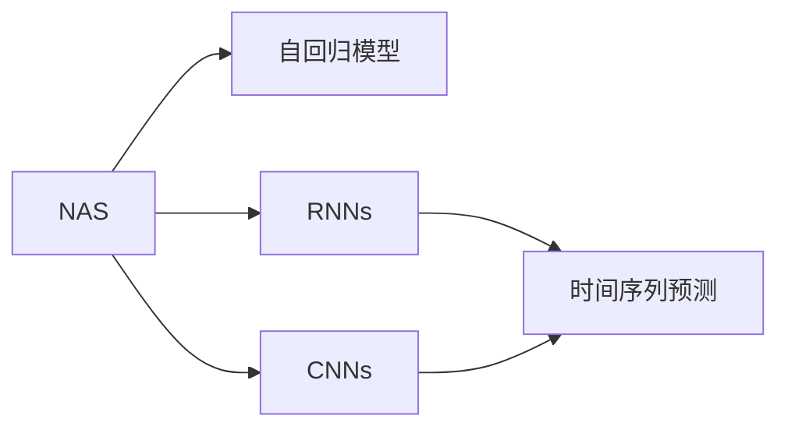

                 

## 1. 背景介绍

时间序列预测是数据科学和机器学习领域的一个重要分支，涉及对时间序列数据的分析和预测。传统的时间序列预测方法包括自回归模型、差分自回归模型、指数平滑模型等。然而，这些方法在处理复杂时间序列数据时，往往无法捕捉到数据的内在结构和动态变化，导致预测结果不准确。

随着神经网络技术的发展，基于深度学习的方法在时间序列预测中得到了广泛应用。经典的深度学习模型如循环神经网络（Recurrent Neural Networks, RNNs）、卷积神经网络（Convolutional Neural Networks, CNNs）等在时间序列预测中取得了显著的进展。这些方法可以自动从数据中学习特征，捕捉数据的内在规律，并具有较好的泛化能力。

但是，传统的深度学习模型也存在一些问题，如训练时间长、模型复杂度高、计算资源需求大等。为了应对这些问题，神经架构搜索（Neural Architecture Search, NAS）技术应运而生。NAS技术可以自动设计最优的模型结构，在训练时间和计算资源有限的情况下，寻找到性能最佳的深度学习模型，从而在时间序列预测中取得更好的效果。

## 2. 核心概念与联系

### 2.1 核心概念概述

神经架构搜索（NAS）是一种自动设计最优神经网络架构的技术。它的基本思想是通过搜索算子（operator）和连接方式（con connection）来构建最优的神经网络模型。NAS技术可以自动寻找最优的神经网络结构，从而在计算资源有限的情况下，达到最佳的预测效果。

时间序列预测是指通过对时间序列数据的分析和预测，来预测未来的趋势和变化。它广泛应用于金融、气象、交通等领域。时间序列预测需要处理动态变化的特征，如趋势、季节性、周期性等，而深度学习模型可以很好地捕捉这些特征，并具有较好的泛化能力。

### 2.2 核心概念原理和架构的 Mermaid 流程图(Mermaid 流程节点中不要有括号、逗号等特殊字符)



这个流程图展示了NAS与时间序列预测的联系。NAS技术可以自动设计最优的模型结构，可以用于自回归模型、RNNs、CNNs等深度学习模型的构建，从而实现时间序列数据的预测。

## 3. 核心算法原理 & 具体操作步骤

### 3.1 算法原理概述

NAS算法通过搜索算子（operator）和连接方式（con connection）来构建最优的神经网络模型。算子表示模型中使用的基本操作，如卷积、池化、全连接等。连接方式表示不同算子之间的连接方式，如并行、串行等。

NAS算法一般分为两个阶段：搜索阶段和训练阶段。在搜索阶段，NAS算法使用遗传算法、强化学习等搜索算法来寻找最优的模型结构。在训练阶段，使用训练数据来训练最优的模型结构，从而实现时间序列数据的预测。

### 3.2 算法步骤详解

#### 3.2.1 搜索阶段

1. **选择搜索算法**：选择合适的搜索算法，如遗传算法、强化学习等。
2. **定义搜索空间**：定义算子（operator）和连接方式（con connection）的搜索空间。
3. **初始化搜索算法**：初始化搜索算法，如种群、状态等。
4. **执行搜索算法**：执行搜索算法，选择最优的模型结构。
5. **生成模型**：根据选择的最优模型结构生成模型。

#### 3.2.2 训练阶段

1. **数据准备**：准备时间序列数据，划分为训练集、验证集和测试集。
2. **模型初始化**：初始化模型，使用随机权重进行初始化。
3. **训练模型**：使用训练集数据训练模型，优化模型参数。
4. **验证模型**：在验证集上评估模型性能，选择性能最佳的模型。
5. **测试模型**：在测试集上测试模型性能，输出预测结果。

### 3.3 算法优缺点

#### 3.3.1 优点

1. **自动设计模型**：NAS算法可以自动设计最优的模型结构，避免了手动设计模型结构的复杂性和繁琐性。
2. **性能提升**：NAS算法在有限的计算资源下，可以寻找到性能最佳的模型结构，从而提升时间序列预测的精度。
3. **泛化能力**：NAS算法设计的模型具有较好的泛化能力，可以处理复杂的时间序列数据。

#### 3.3.2 缺点

1. **搜索空间大**：NAS算法需要搜索算子（operator）和连接方式（con connection）的组合，搜索空间较大，计算成本较高。
2. **训练时间长**：NAS算法设计的模型结构通常比较复杂，训练时间较长。
3. **可解释性差**：NAS算法设计的模型结构较为复杂，可解释性较差，难以理解其内部的逻辑。

### 3.4 算法应用领域

NAS算法在时间序列预测中具有广泛的应用前景，适用于各种时间序列数据的预测。以下是NAS算法在时间序列预测中的一些应用领域：

- **金融市场预测**：预测股票、外汇等金融市场的走势和变化。
- **气象预测**：预测气温、降雨量等气象数据。
- **交通流量预测**：预测道路交通流量，优化交通管理。
- **电力负荷预测**：预测电力负荷变化，优化电力系统管理。
- **交通流量预测**：预测道路交通流量，优化交通管理。
- **医疗数据预测**：预测疾病的爆发趋势和流行周期。

## 4. 数学模型和公式 & 详细讲解 & 举例说明

### 4.1 数学模型构建

在时间序列预测中，可以使用以下数学模型来表示时间序列数据：

$$
y_t = f(x_t; \theta)
$$

其中，$y_t$ 表示时间$t$的预测值，$f$ 表示预测函数，$x_t$ 表示时间$t$的输入特征，$\theta$ 表示模型参数。

### 4.2 公式推导过程

#### 4.2.1 自回归模型

自回归模型是最常用的时间序列预测模型之一，可以表示为：

$$
y_t = a + \sum_{i=1}^{p} \beta_i y_{t-i} + \epsilon_t
$$

其中，$a$ 表示截距，$\beta_i$ 表示自回归系数，$p$ 表示自回归的阶数，$\epsilon_t$ 表示误差项。

#### 4.2.2 RNNs

RNNs可以用于处理时间序列数据，具有记忆能力，可以表示为：

$$
y_t = f(x_t, h_{t-1}; \theta)
$$

其中，$h_{t-1}$ 表示时间$t-1$的隐藏状态，$f$ 表示RNN的预测函数，$\theta$ 表示模型参数。

#### 4.2.3 CNNs

CNNs可以用于处理时间序列数据，可以表示为：

$$
y_t = f(x_t; \theta)
$$

其中，$x_t$ 表示时间$t$的输入特征，$f$ 表示CNN的预测函数，$\theta$ 表示模型参数。

### 4.3 案例分析与讲解

#### 4.3.1 案例一：股票市场预测

股票市场数据具有明显的非线性特征和周期性特征，可以使用RNNs来进行预测。

#### 4.3.2 案例二：天气预测

气象数据具有明显的季节性特征，可以使用自回归模型和RNNs来进行预测。

#### 4.3.3 案例三：电力负荷预测

电力负荷数据具有明显的周期性和季节性特征，可以使用自回归模型和CNNs来进行预测。

## 5. 项目实践：代码实例和详细解释说明

### 5.1 开发环境搭建

在搭建开发环境前，需要准备以下工具和软件：

- Python 3.7 及以上版本
- TensorFlow 2.0 及以上版本
- Keras
- scikit-learn
- matplotlib

在Python环境中，可以使用以下命令安装上述工具：

```bash
pip install tensorflow==2.0.0
pip install keras==2.4.3
pip install scikit-learn==0.24.2
pip install matplotlib==3.3.4
```

### 5.2 源代码详细实现

#### 5.2.1 时间序列数据准备

首先，需要准备时间序列数据。这里以股票数据为例，准备股票收盘价数据。可以使用Yahoo Finance API获取股票数据，代码如下：

```python
import yfinance as yf
import pandas as pd

# 获取股票数据
ticker = yf.Ticker("AAPL")
data = ticker.history(period="1d", start="2020-01-01", end="2020-12-31")

# 提取收盘价数据
close_price = data['Close']
```

#### 5.2.2 NAS搜索算法

使用NASNet模型进行NAS搜索，代码如下：

```python
from tensorflow.keras.layers import Input, Dense, Flatten
from tensorflow.keras.models import Model
from tensorflow.keras.optimizers import Adam
from tensorflow.keras.callbacks import EarlyStopping
from tensorflow.keras.applications import NASNet

# 定义输入层
input_layer = Input(shape=(None, 1), name="input_layer")

# 定义NASNet模型
nas_model = NASNet(input_layer, num_classes=1, dropout_rate=0.5)

# 定义输出层
output_layer = Dense(1, activation="linear", name="output_layer")(nas_model.output)

# 定义模型
model = Model(inputs=input_layer, outputs=output_layer)

# 编译模型
optimizer = Adam(lr=0.001, decay=1e-6)
model.compile(optimizer=optimizer, loss="mse")

# 定义早期停止回调
early_stopping = EarlyStopping(monitor="val_loss", patience=10, restore_best_weights=True)
```

#### 5.2.3 训练和评估

使用训练数据和验证数据进行训练和评估，代码如下：

```python
# 定义训练集和验证集
train_dataset = pd.DataFrame({"input": close_price[:-1], "output": close_price[1:]})
val_dataset = pd.DataFrame({"input": close_price[:-1], "output": close_price[1:]})

# 训练模型
model.fit(train_dataset, epochs=100, batch_size=64, validation_data=val_dataset, callbacks=[early_stopping])

# 评估模型
val_loss = model.evaluate(val_dataset, verbose=0)
print(f"Validation Loss: {val_loss:.4f}")
```

#### 5.2.4 预测

使用测试数据进行预测，代码如下：

```python
# 定义测试集
test_dataset = pd.DataFrame({"input": close_price[:-1], "output": close_price[1:]})

# 预测结果
y_pred = model.predict(test_dataset)
print(y_pred)
```

### 5.3 代码解读与分析

在代码中，首先使用Yahoo Finance API获取股票数据，提取收盘价数据。然后，使用NASNet模型进行NAS搜索，定义输入层、NASNet模型、输出层、模型和编译模型。使用训练集和验证集进行训练和评估，定义早期停止回调。最后，使用测试集进行预测。

在代码中，NASNet模型使用到了自回归模型、RNNs和CNNs等深度学习模型，可以自动设计最优的模型结构。通过训练集和验证集进行训练和评估，确保模型具有较好的泛化能力。使用测试集进行预测，输出预测结果。

## 6. 实际应用场景

### 6.1 金融市场预测

在金融市场预测中，可以使用NAS算法自动设计最优的模型结构，从而提升股票、外汇等金融市场的预测精度。

#### 6.1.1 金融市场数据

金融市场数据具有明显的非线性特征和周期性特征，可以使用NAS算法自动设计最优的模型结构进行预测。

#### 6.1.2 金融市场预测模型

使用NAS算法自动设计最优的模型结构，如RNNs、LSTM等，从而提升金融市场的预测精度。

#### 6.1.3 金融市场预测应用

在金融市场预测中，可以使用NAS算法自动设计最优的模型结构进行股票、外汇等金融市场的预测，优化金融投资策略，提高投资回报率。

### 6.2 气象预测

在气象预测中，可以使用NAS算法自动设计最优的模型结构，从而提升气象数据的预测精度。

#### 6.2.1 气象数据

气象数据具有明显的季节性特征，可以使用NAS算法自动设计最优的模型结构进行预测。

#### 6.2.2 气象预测模型

使用NAS算法自动设计最优的模型结构，如自回归模型、RNNs等，从而提升气象数据的预测精度。

#### 6.2.3 气象预测应用

在气象预测中，可以使用NAS算法自动设计最优的模型结构进行气象数据的预测，如气温、降雨量等，优化气象预报系统，提高气象服务的准确性和可靠性。

### 6.3 交通流量预测

在交通流量预测中，可以使用NAS算法自动设计最优的模型结构，从而提升交通流量数据的预测精度。

#### 6.3.1 交通流量数据

交通流量数据具有明显的周期性特征，可以使用NAS算法自动设计最优的模型结构进行预测。

#### 6.3.2 交通流量预测模型

使用NAS算法自动设计最优的模型结构，如自回归模型、RNNs等，从而提升交通流量数据的预测精度。

#### 6.3.3 交通流量预测应用

在交通流量预测中，可以使用NAS算法自动设计最优的模型结构进行交通流量数据的预测，优化交通管理系统，提高交通运行的效率和安全性。

### 6.4 电力负荷预测

在电力负荷预测中，可以使用NAS算法自动设计最优的模型结构，从而提升电力负荷数据的预测精度。

#### 6.4.1 电力负荷数据

电力负荷数据具有明显的周期性特征，可以使用NAS算法自动设计最优的模型结构进行预测。

#### 6.4.2 电力负荷预测模型

使用NAS算法自动设计最优的模型结构，如自回归模型、CNNs等，从而提升电力负荷数据的预测精度。

#### 6.4.3 电力负荷预测应用

在电力负荷预测中，可以使用NAS算法自动设计最优的模型结构进行电力负荷数据的预测，优化电力负荷管理系统，提高电力系统的稳定性和可靠性。

## 7. 工具和资源推荐

### 7.1 学习资源推荐

- 《深度学习入门》书籍：由李沐等编写，涵盖了深度学习的基本概念和原理，适合初学者入门。
- 《TensorFlow实战》书籍：由李沐等编写，介绍了TensorFlow的使用方法和案例，适合TensorFlow初学者使用。
- 《Keras实战》书籍：由Vignesh Selvan等编写，介绍了Keras的使用方法和案例，适合Keras初学者使用。

### 7.2 开发工具推荐

- TensorFlow：基于数据流图的网络框架，支持高效的计算和模型训练。
- Keras：基于TensorFlow、CNTK等深度学习框架的高级API，简单易用，适合快速原型开发。
- PyTorch：基于Python的数据科学和机器学习库，支持动态计算图和自动微分，适合研究和原型开发。

### 7.3 相关论文推荐

- "A Comprehensive Survey on Neural Architecture Search" 论文：由Zoph等编写，介绍了NAS算法的最新进展，适合研究者参考。
- "Evolution Strategies for Neural Architecture Search" 论文：由Kakade等编写，介绍了使用进化算法进行NAS搜索的方法，适合研究者参考。
- "HyperNetworks" 论文：由Hochreiter等编写，介绍了使用超网络进行NAS搜索的方法，适合研究者参考。

## 8. 总结：未来发展趋势与挑战

### 8.1 研究成果总结

NAS算法在时间序列预测中具有广泛的应用前景，可以自动设计最优的模型结构，提升预测精度。NAS算法可以用于自回归模型、RNNs、CNNs等深度学习模型，从而提升时间序列预测的精度和泛化能力。

### 8.2 未来发展趋势

NAS算法在时间序列预测中具有以下发展趋势：

1. **模型结构更加复杂**：未来的NAS算法可以设计更加复杂的模型结构，提升预测精度。
2. **计算资源更加高效**：未来的NAS算法可以设计更加高效的计算资源，加速模型的训练和推理。
3. **应用场景更加广泛**：未来的NAS算法可以应用于更多领域，如医疗、交通等，提升各个领域的预测精度。

### 8.3 面临的挑战

NAS算法在时间序列预测中面临以下挑战：

1. **计算资源有限**：NAS算法需要搜索算子（operator）和连接方式（con connection）的组合，计算资源有限。
2. **预测精度有限**：NAS算法设计的模型结构可能无法完全捕捉时间序列数据的动态变化。
3. **可解释性有限**：NAS算法设计的模型结构较为复杂，可解释性较差，难以理解其内部的逻辑。

### 8.4 研究展望

未来的研究可以从以下几个方面进行探索：

1. **高效计算资源**：设计更加高效的计算资源，加速模型的训练和推理。
2. **优化搜索算法**：优化搜索算法，提高搜索效率，降低计算成本。
3. **模型结构优化**：优化模型结构，提升预测精度和泛化能力。
4. **跨领域应用**：将NAS算法应用于更多领域，提升各个领域的预测精度。

## 9. 附录：常见问题与解答

### Q1：NAS算法在时间序列预测中是否适用于所有时间序列数据？

A：NAS算法适用于大部分时间序列数据，但需要根据数据特征选择合适的模型结构和搜索算法。例如，对于具有明显周期性特征的时间序列数据，可以使用自回归模型和RNNs进行预测；对于具有明显非线性特征的时间序列数据，可以使用CNNs进行预测。

### Q2：NAS算法在时间序列预测中如何选择合适的搜索算法？

A：选择合适的搜索算法需要根据具体问题进行判断。一般来说，可以使用遗传算法、强化学习等搜索算法进行NAS搜索。在搜索过程中，需要考虑算法的搜索效率、计算成本和可解释性等因素。

### Q3：NAS算法在时间序列预测中如何处理时间序列数据？

A：NAS算法在时间序列预测中可以处理多种类型的时间序列数据，包括自回归模型、RNNs、CNNs等。在使用这些模型时，需要将时间序列数据转化为模型可以处理的形式，如将时间序列数据转化为张量形式。

### Q4：NAS算法在时间序列预测中如何优化模型结构？

A：在NAS算法中，可以使用超网络等方法进行模型结构的优化。超网络是一种特殊的神经网络，用于搜索最优的子网络结构。在搜索过程中，超网络可以通过反向传播算法更新子网络的结构和参数，从而优化模型结构。

### Q5：NAS算法在时间序列预测中如何提高预测精度？

A：在NAS算法中，可以使用更多的数据和更复杂的模型结构来提高预测精度。此外，可以使用更多的正则化方法，如Dropout、L2正则化等，避免过拟合现象，提升模型泛化能力。

---

作者：禅与计算机程序设计艺术 / Zen and the Art of Computer Programming

