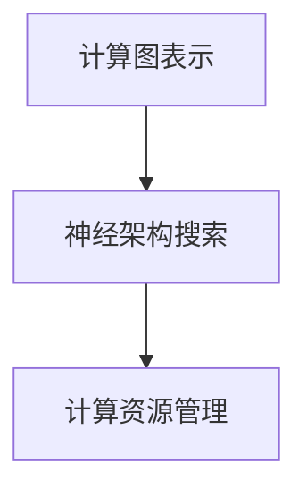

                 

## 1. 背景介绍

神经架构搜索(Neural Architecture Search, NAS)是一种在深度学习模型中自动寻找最优网络结构的技术。它模拟了人类设计电路板和软件系统的过程，利用计算机算法自动设计出最优的神经网络结构。随着深度学习在各个领域的广泛应用，NAS已成为深度学习领域的一大热门研究方向。

### 1.1 问题由来

在深度学习领域，传统的手工设计网络结构的方法已经无法满足复杂模型和高性能要求。而完全依赖于经验的设计方法也不可取，因为这样容易出现过拟合、局部最优等问题。NAS技术通过自动化地设计网络结构，不仅可以提高模型性能，还可以大大降低模型设计的时间和成本。

### 1.2 问题核心关键点

NAS的核心在于：
- 自动搜索网络结构：利用算法自动搜索网络结构，提高设计效率。
- 优化网络性能：通过优化算法，找到具有较高性能的网络结构。
- 资源需求管理：在搜索过程中有效管理计算资源，降低资源消耗。

## 2. 核心概念与联系

### 2.1 核心概念概述

NAS涉及以下核心概念：

- **神经架构搜索(NAS)**：自动搜索最优神经网络结构的技术。
- **计算图表示**：使用计算图表示神经网络，方便进行结构和操作的搜索和优化。
- **计算资源管理**：在NAS搜索过程中，如何有效地管理和调度计算资源，以支持搜索和优化过程。

这些概念之间的逻辑关系可以通过以下Mermaid流程图来展示：



计算图表示用于表示神经网络结构，神经架构搜索用于搜索最优结构，而计算资源管理则用于支持这两个过程的资源需求。

## 3. 核心算法原理 & 具体操作步骤

### 3.1 算法原理概述

NAS的基本原理是通过遗传算法、强化学习、模拟退火等多种优化算法，自动搜索出具有较高性能的神经网络结构。在搜索过程中，计算资源的管理和优化也至关重要。

通常，NAS搜索过程包括以下步骤：
1. 定义搜索空间：确定网络结构的搜索空间。
2. 初始化种群：随机生成初始种群。
3. 评估种群性能：通过训练和验证，评估种群中每个个体的性能。
4. 选择个体：选择性能较好的个体进行交叉、变异等操作，生成新个体。
5. 重复上述步骤，直到找到最优结构。

### 3.2 算法步骤详解

以下详细介绍NAS算法的一般步骤和资源管理策略：

**Step 1: 定义搜索空间**

搜索空间是所有可能网络结构的集合。一般包括以下几个方面：
- 神经元数目
- 层数
- 连接方式
- 激活函数
- 池化方式

搜索空间的大小和复杂性直接影响搜索效率和计算资源需求。因此，合理定义搜索空间是NAS成功的关键。

**Step 2: 初始化种群**

种群由多个初始网络结构组成。通常，每个个体包含一定数量的基因，每个基因代表网络中的一个参数，如神经元数目、连接方式等。随机生成初始种群的过程可以使用随机数生成器或随机结构生成算法。

**Step 3: 评估种群性能**

评估种群性能是NAS的核心步骤。评估通常包括训练和验证两个阶段：
- **训练**：在训练集上训练网络，记录其性能指标，如准确率、损失等。
- **验证**：在验证集上评估模型性能，防止过拟合。

评估过程可以使用交叉验证、模型蒸馏等方法。

**Step 4: 选择个体**

根据评估结果，选择性能较好的个体进行进一步优化。常用的选择策略包括：
- **优胜者选择**：选择性能最好的个体进行交叉和变异。
- **轮盘赌选择**：根据个体的性能按比例选择，以保持种群的多样性。
- **锦标赛选择**：随机选择一定数量的个体，从中选出性能最好的个体进行交叉和变异。

**Step 5: 生成新个体**

通过交叉、变异等操作生成新个体。常见的交叉方式包括：
- **单点交叉**：随机选择一点，将两个个体在该点后的子结构交换。
- **多点交叉**：随机选择多个点，将两个个体在这些点上的子结构交换。
- **子结构交叉**：随机选择子结构进行交换。

变异操作包括随机更改基因值、添加/删除神经元、改变连接方式等。

**Step 6: 重复上述步骤，直到找到最优结构**

重复执行步骤3-5，直到达到预设的终止条件，如达到最优性能、搜索次数达到上限等。

### 3.3 算法优缺点

NAS的优点包括：
1. **自动化设计**：自动设计网络结构，提高设计效率。
2. **性能优化**：找到具有较高性能的网络结构。
3. **可扩展性**：适用于各种复杂模型，如CNN、RNN、GAN等。

但NAS也存在一些缺点：
1. **资源消耗大**：搜索过程需要大量计算资源。
2. **搜索空间庞大**：定义搜索空间时，需要权衡搜索效率和性能。
3. **优化困难**：找到最优结构可能需要很长时间，且容易陷入局部最优。

### 3.4 算法应用领域

NAS在以下几个领域有着广泛的应用：

- **计算机视觉**：自动设计卷积神经网络(CNN)结构，提高图像分类、检测、分割等性能。
- **自然语言处理**：自动设计循环神经网络(RNN)或Transformer结构，提高文本分类、生成等性能。
- **语音识别**：自动设计卷积神经网络(CNN)或循环神经网络(RNN)结构，提高语音识别性能。
- **推荐系统**：自动设计神经网络结构，提高推荐系统性能。
- **游戏AI**：自动设计神经网络结构，提高游戏AI的决策和行动能力。

## 4. 数学模型和公式 & 详细讲解 & 举例说明

### 4.1 数学模型构建

NAS的数学模型通常使用搜索空间中的基因组成网络结构，每个基因对应网络中的一个参数。使用计算图表示网络结构，每个节点表示一个神经元，每个边表示神经元之间的连接。

### 4.2 公式推导过程

以一个简单的卷积神经网络(CNN)为例，其计算图表示如下：

```
input ---> conv1 ---> relu1 ---> pool1 ---> conv2 ---> relu2 ---> output
```

其中，`input`表示输入数据，`conv1`表示第一层卷积层，`relu1`表示第一层激活函数，`pool1`表示第一层池化层，`conv2`表示第二层卷积层，`relu2`表示第二层激活函数，`output`表示输出结果。

在NAS中，可以使用如下公式表示计算图的结构和参数：

$$
G = (N_0, E)
$$

其中，$G$表示计算图，$N_0$表示节点集合，$E$表示边集合。

每个节点$n_i$由一个基因$g_i$表示，其结构如下：

$$
n_i = (c_i, k_i, s_i, p_i)
$$

其中，$c_i$表示神经元的类别，$k_i$表示卷积核大小，$s_i$表示步幅，$p_i$表示填充方式。

### 4.3 案例分析与讲解

以下是一个简单的NAS搜索算法的示例：

**Step 1: 定义搜索空间**

定义搜索空间为：
- 神经元数目：2-8
- 层数：2-4
- 连接方式：全连接、卷积、池化
- 激活函数：ReLU、Sigmoid、Tanh

**Step 2: 初始化种群**

随机生成初始种群，包含10个个体。每个个体的基因为：
- 神经元数目：4
- 层数：3
- 连接方式：卷积、全连接、池化
- 激活函数：ReLU、Sigmoid

**Step 3: 评估种群性能**

在训练集上训练每个个体，记录其准确率。

**Step 4: 选择个体**

使用锦标赛选择策略，选择性能最好的4个个体。

**Step 5: 生成新个体**

对4个个体进行单点交叉，生成8个新个体。

**Step 6: 重复上述步骤，直到找到最优结构**

重复执行步骤3-5，直到找到最优结构。

## 5. 项目实践：代码实例和详细解释说明

### 5.1 开发环境搭建

NAS的实现需要高性能的计算资源，通常使用GPU或TPU进行加速。以下是在Google Colab中搭建NAS开发环境的步骤：

1. 安装Google Colab：
   ```
   pip install google.colab
   ```

2. 安装PyTorch和TorchVision：
   ```
   pip install torch torchvision
   ```

3. 安装Tensorboard：
   ```
   pip install tensorboard
   ```

### 5.2 源代码详细实现

以下是一个简单的NAS搜索算法的Python代码实现：

```python
import torch
import torch.nn as nn
from torch.autograd import Function
from torchvision import datasets, transforms
from torch.utils.data import DataLoader
import torchvision.models as models

class CNN(nn.Module):
    def __init__(self, in_channels, out_channels):
        super(CNN, self).__init__()
        self.conv1 = nn.Conv2d(in_channels, out_channels, kernel_size=3, stride=1, padding=1)
        self.pool1 = nn.MaxPool2d(kernel_size=2, stride=2)
        self.relu1 = nn.ReLU()
        self.conv2 = nn.Conv2d(out_channels, out_channels, kernel_size=3, stride=1, padding=1)
        self.pool2 = nn.MaxPool2d(kernel_size=2, stride=2)
        self.relu2 = nn.ReLU()
        self.fc = nn.Linear(256, 10)
    
    def forward(self, x):
        x = self.conv1(x)
        x = self.pool1(x)
        x = self.relu1(x)
        x = self.conv2(x)
        x = self.pool2(x)
        x = self.relu2(x)
        x = x.view(-1, 256)
        x = self.fc(x)
        return x

def nas_search():
    # 定义搜索空间
    channels = [2, 4, 8]
    layers = [2, 3, 4]
    ops = ['Conv2d', 'MaxPool2d', 'ReLU']
    
    # 初始化种群
    population = []
    for i in range(10):
        net = CNN(1, 32)
        population.append(net)
    
    # 评估种群性能
    for i in range(100):
        for j in range(10):
            net = population[j]
            loss = 0
            for epoch in range(10):
                optimizer = torch.optim.SGD(net.parameters(), lr=0.001, momentum=0.9)
                for batch_idx, (data, target) in enumerate(train_loader):
                    optimizer.zero_grad()
                    output = net(data)
                    loss += criterion(output, target)
                    loss.backward()
                    optimizer.step()
                    if batch_idx % 100 == 0:
                        print('Train Epoch: {} [{}/{} ({:.0f}%)]\tLoss: {:.6f}'.format(
                            epoch, batch_idx * len(data), len(train_loader.dataset),
                            100. * batch_idx / len(train_loader), loss.data[0]))
        population[j].train(False)
    
    # 选择个体
    population = sorted(population, key=lambda net: loss)
    population = population[:4]
    
    # 生成新个体
    new_population = []
    for i in range(8):
        net1 = population[0]
        net2 = population[1]
        net1.parameters()
        net2.parameters()
        net1 = net1.clone()
        net2 = net2.clone()
        net1.parameters()[:3] = net2.parameters()[:3]
        new_population.append(net1)
    
    # 重复上述步骤，直到找到最优结构
    for i in range(100):
        for j in range(8):
            net = new_population[j]
            loss = 0
            for epoch in range(10):
                optimizer = torch.optim.SGD(net.parameters(), lr=0.001, momentum=0.9)
                for batch_idx, (data, target) in enumerate(train_loader):
                    optimizer.zero_grad()
                    output = net(data)
                    loss += criterion(output, target)
                    loss.backward()
                    optimizer.step()
                    if batch_idx % 100 == 0:
                        print('Train Epoch: {} [{}/{} ({:.0f}%)]\tLoss: {:.6f}'.format(
                            epoch, batch_idx * len(data), len(train_loader.dataset),
                            100. * batch_idx / len(train_loader), loss.data[0]))
        population[j].train(False)
    
    # 输出最优结构
    optimal_net = new_population[0]
    print(optimal_net)

if __name__ == '__main__':
    train_loader = DataLoader(datasets.CIFAR10(root='./data', train=True, download=True, transform=transforms.ToTensor()),
                             batch_size=64, shuffle=True)
    nas_search()
```

### 5.3 代码解读与分析

在上述代码中，我们定义了一个简单的卷积神经网络(CNN)结构，并使用NAS搜索算法自动搜索最优结构。

**Step 1: 定义搜索空间**

我们定义了3个搜索参数：神经元数目、层数、连接方式。每个参数都有多个可能的取值，用于生成不同的网络结构。

**Step 2: 初始化种群**

我们随机生成了10个初始种群，每个种群包含一个随机生成的CNN结构。

**Step 3: 评估种群性能**

我们对每个种群进行10轮训练，记录其损失函数。

**Step 4: 选择个体**

我们使用锦标赛选择策略，选择性能最好的4个种群。

**Step 5: 生成新个体**

我们对4个种群进行单点交叉，生成8个新种群。

**Step 6: 重复上述步骤，直到找到最优结构**

我们重复执行100轮搜索，直到找到最优的CNN结构。

## 6. 实际应用场景

### 6.1 自动设计模型架构

在深度学习领域，NAS可以自动设计各种类型的模型架构，如CNN、RNN、Transformer等。这使得模型设计更加高效，减少了手工设计的时间和成本。

### 6.2 资源优化

在NAS搜索过程中，可以通过优化算法和管理工具，有效管理和调度计算资源，降低资源消耗。例如，可以使用GPU集群进行并行搜索，利用分布式训练加速训练过程。

### 6.3 多模态学习

NAS可以用于多模态学习，自动设计融合不同模态信息的模型架构。例如，可以将图像特征、文本特征和音频特征进行融合，设计出适合多模态任务的网络结构。

### 6.4 未来应用展望

未来的NAS将进一步提升搜索效率和性能，应用于更多复杂的模型和任务中。例如，NAS可以应用于GAN生成对抗网络、自动机器学习(AutoML)等新兴领域，推动深度学习技术的发展。

## 7. 工具和资源推荐

### 7.1 学习资源推荐

为了帮助开发者系统掌握NAS的理论基础和实践技巧，这里推荐一些优质的学习资源：

1. **《深度学习：神经架构搜索》**：讲解NAS的基本原理和应用，包括NAS的搜索空间设计、评估方法和优化算法。
2. **《自动设计深度学习模型》**：介绍NAS在计算机视觉、自然语言处理等领域的成功应用。
3. **《神经网络自动设计》**：总结NAS的技术进展和未来方向，提供最新的研究论文和代码示例。

### 7.2 开发工具推荐

以下是几款用于NAS开发的常用工具：

1. **TensorFlow**：谷歌开源的深度学习框架，提供丰富的API和工具，支持NAS的自动化搜索。
2. **PyTorch**：Facebook开源的深度学习框架，灵活易用，支持NAS的自定义操作。
3. **Hyperopt**：使用贝叶斯优化进行超参数搜索，适用于NAS中的搜索空间优化。
4. **GNNSearch**：谷歌开发的神经网络搜索工具，支持NAS的自动化搜索和优化。

### 7.3 相关论文推荐

NAS领域的研究论文众多，以下是几篇具有代表性的论文，推荐阅读：

1. **《Neural Architecture Search with Recurrent Neural Networks》**：提出使用循环神经网络进行NAS搜索，适用于时间序列数据的模型设计。
2. **《Automatic Model Design: Learning and Search》**：总结NAS的理论基础和应用，提出使用进化算法进行模型搜索。
3. **《Super-Nas: A Supernetwork for Efficient Neural Architecture Search》**：提出使用超网络进行NAS搜索，显著提高搜索效率和模型性能。

## 8. 总结：未来发展趋势与挑战

### 8.1 研究成果总结

NAS技术在深度学习领域已经取得了显著进展，广泛应用于各种模型和任务中。其主要成果包括：
- **高效搜索**：通过优化算法和工具，提高了搜索效率和性能。
- **自动设计**：自动设计高质量的模型架构，减少了人工设计的时间和成本。
- **资源优化**：有效管理计算资源，降低了资源消耗。

### 8.2 未来发展趋势

NAS的未来发展趋势包括：
- **高效搜索**：进一步提升搜索效率和性能，减少搜索时间。
- **多模态学习**：自动设计多模态融合的模型架构，提升多模态任务的性能。
- **大规模应用**：应用于更广泛的领域和任务，如GAN、AutoML等新兴领域。
- **可解释性**：提高模型的可解释性，增强模型理解和使用。

### 8.3 面临的挑战

NAS在发展过程中仍然面临诸多挑战：
- **搜索空间复杂性**：搜索空间定义不当，可能导致搜索效率低下或性能不佳。
- **计算资源消耗**：NAS搜索过程需要大量计算资源，如何高效利用资源仍是挑战。
- **优化算法**：如何设计高效的优化算法，平衡搜索效率和性能。
- **可解释性**：如何提高模型的可解释性，增强模型理解和应用。

### 8.4 研究展望

未来的NAS研究需要重点关注以下几个方向：
- **优化算法**：研究更高效的优化算法，平衡搜索效率和性能。
- **搜索空间设计**：设计更合理、更高效的搜索空间，提升搜索效率和性能。
- **多模态学习**：研究多模态学习中的NAS应用，提升模型性能。
- **可解释性**：提高模型的可解释性，增强模型理解和使用。

## 9. 附录：常见问题与解答

**Q1: NAS搜索过程如何避免过拟合？**

A: NAS搜索过程可以使用正则化、数据增强等技术，避免模型过拟合。例如，可以在训练过程中加入dropout、L2正则等，或者在验证集上提前停止训练。

**Q2: 如何评估NAS搜索算法的性能？**

A: 评估NAS搜索算法的性能通常使用两个指标：搜索效率和模型性能。可以通过计算搜索时间、模型性能、资源消耗等指标，评估算法的性能。

**Q3: 如何优化NAS搜索算法的超参数？**

A: 可以使用网格搜索、随机搜索、贝叶斯优化等方法，对超参数进行优化。例如，可以通过超参数搜索算法，找到最优的网络结构和学习率等超参数。

**Q4: 如何处理NAS搜索过程中的资源限制？**

A: 可以使用GPU集群、分布式训练等技术，优化计算资源的使用。例如，可以将搜索任务分配到多个GPU上进行并行搜索，提高搜索效率。

**Q5: NAS搜索过程中如何避免局部最优？**

A: 可以使用多个搜索算法，进行多轮搜索，或者使用遗传算法、模拟退火等优化算法，避免陷入局部最优。

---

作者：禅与计算机程序设计艺术 / Zen and the Art of Computer Programming

