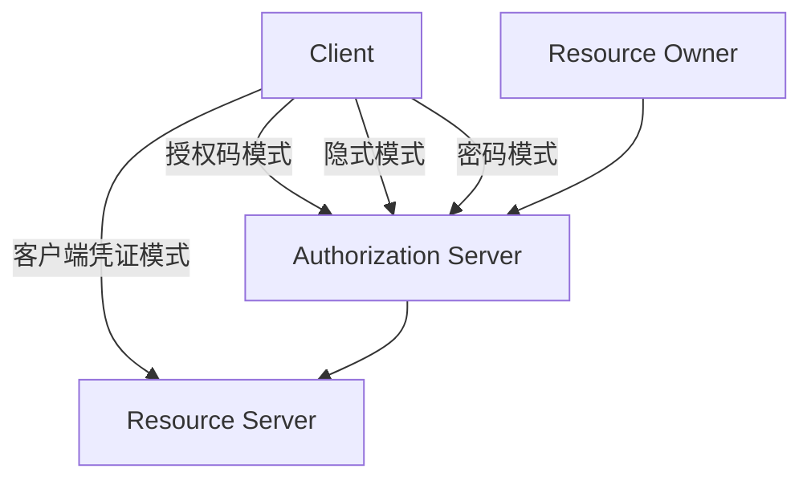
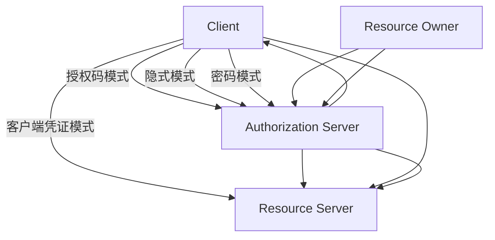

                 

# OAuth 2.0 的详细应用

> 关键词：OAuth, 认证授权, 应用场景, 安全, 标准, 实践

## 1. 背景介绍

### 1.1 问题由来

在当今数字化时代，用户和应用之间的交互日益频繁，如何在保障用户隐私和数据安全的前提下，实现应用的便捷访问和数据共享，成为了一个重要课题。传统的用户名和密码认证方式存在诸多缺陷，如易被钓鱼、泄露、重放攻击等。与此同时，越来越多的应用需要访问用户的隐私数据，如社交网络、邮件、支付平台等，对用户数据的安全性和隐私性提出了更高要求。

因此，OAuth 2.0应运而生，成为解决上述问题的权威标准。OAuth 2.0是一种开放标准的认证授权协议，旨在为第三方应用提供一个安全的访问用户资源的机制，避免了传统的用户名和密码认证方式的缺陷。

### 1.2 问题核心关键点

OAuth 2.0的核心在于将用户身份验证和授权分离，使应用无需获得用户的密码即可访问用户的资源。其主要特点包括：

- 授权分离：用户和应用各自持有不同的凭证，相互之间不可见。
- 标准化：遵循OAuth 2.0协议，提供统一的认证授权机制。
- 安全性：通过使用HTTPS等安全协议，保障数据传输的安全。
- 灵活性：适用于多种应用场景，如Web应用、移动应用、桌面应用等。

本文将系统介绍OAuth 2.0的原理、授权流程、常用模式及其在实际应用中的详细应用。

## 2. 核心概念与联系

### 2.1 核心概念概述

OAuth 2.0的核心概念包括：

- **客户端**：发起授权请求的应用程序或服务。
- **资源所有者**：对资源拥有所有权的个人或组织。
- **资源服务器**：拥有用户资源的服务器。
- **认证服务器**：验证用户身份的服务。

OAuth 2.0主要涉及四种角色：

1. **Resource Owner (RO)**：用户，拥有资源的访问权限。
2. **Resource Server (RS)**：持有用户数据的服务器。
3. **Client (C)**：希望访问用户数据的第三方应用。
4. **Authorization Server (AS)**：验证用户身份的服务器，颁发OAuth令牌。

OAuth 2.0包含多个授权流程，每种流程适用于不同的应用场景。主要授权流程包括：

- **授权码模式**：适用于Web应用。
- **隐式模式**：适用于移动应用。
- **密码模式**：适用于Web应用，安全性较低，不推荐使用。
- **客户端凭证模式**：适用于机器到机器的授权，不涉及用户交互。

这些概念和流程通过以下Mermaid流程图进行展示：



### 2.2 核心概念原理和架构的 Mermaid 流程图



## 3. 核心算法原理 & 具体操作步骤

### 3.1 算法原理概述

OAuth 2.0的核心原理是通过授权服务器（AS）和资源服务器（RS）之间的交互，来实现对用户资源的访问控制。主要流程包括：

1. 客户端向认证服务器发起授权请求，获取授权码。
2. 客户端将授权码提交给认证服务器，换取令牌。
3. 客户端使用令牌访问资源服务器，获取资源。

OAuth 2.0的核心步骤包括：

- 认证授权请求（Authorization Request）
- 用户授权（User Consent）
- 认证授权响应（Authorization Response）
- 令牌获取（Token Acquisition）
- 资源访问（Resource Access）

### 3.2 算法步骤详解

以下是OAuth 2.0的详细步骤详解：

**步骤 1：客户端获取授权码**

- 客户端向认证服务器发起授权请求，请求参数包括：
  - `client_id`：客户端的身份标识。
  - `redirect_uri`：授权成功的回调地址。
  - `response_type`：指定响应类型，通常为`code`。
  - `scope`：请求的资源访问权限。

- 认证服务器验证请求，向用户显示授权页面，要求用户授权。

**步骤 2：用户授权**

- 用户查看授权页面，同意或拒绝授权。
- 用户授权后，认证服务器重定向到指定的回调地址，并携带`code`参数。

**步骤 3：客户端获取令牌**

- 客户端使用授权码向认证服务器发起令牌请求，请求参数包括：
  - `client_id`：客户端的身份标识。
  - `client_secret`：客户端的机密信息。
  - `code`：授权码。
  - `redirect_uri`：授权成功的回调地址。
  - `grant_type`：指定令牌获取方式，通常为`authorization_code`。

- 认证服务器验证请求，颁发访问令牌`access_token`和刷新令牌`refresh_token`。

**步骤 4：客户端访问资源**

- 客户端使用访问令牌访问资源服务器，请求参数包括：
  - `client_id`：客户端的身份标识。
  - `client_secret`：客户端的机密信息。
  - `access_token`：访问令牌。
  - `resource`：请求的资源URL。
  - `grant_type`：指定令牌获取方式，通常为`Bearer`。

- 资源服务器验证令牌，返回请求的资源。

### 3.3 算法优缺点

OAuth 2.0的优点包括：

- **安全性高**：分离了用户身份和权限，提高了系统的安全性。
- **标准化**：遵循OAuth 2.0协议，提供统一的认证授权机制。
- **灵活性**：适用于多种应用场景，如Web应用、移动应用等。

OAuth 2.0的缺点包括：

- **复杂性高**：涉及多个角色和流程，实现和维护复杂。
- **依赖服务器**：依赖认证服务器和资源服务器，增加了系统的复杂性。

### 3.4 算法应用领域

OAuth 2.0广泛应用于各种需要用户授权的应用场景，包括：

- **社交网络**：用户可以授权第三方应用访问其社交关系数据。
- **邮件服务**：用户可以授权第三方应用访问其邮件数据。
- **支付平台**：用户可以授权第三方应用访问其支付记录。
- **云存储**：用户可以授权第三方应用访问其存储数据。

## 4. 数学模型和公式 & 详细讲解 & 举例说明

### 4.1 数学模型构建

OAuth 2.0的核心流程可以抽象为以下数学模型：

- **授权请求**：`A = (client_id, redirect_uri, response_type, scope)`
- **用户授权**：`B = (A)`
- **令牌获取**：`T = (client_id, client_secret, code, redirect_uri, grant_type)`
- **资源访问**：`R = (client_id, client_secret, access_token, resource, grant_type)`

其中，`A`、`B`、`T`和`R`分别表示授权请求、用户授权、令牌获取和资源访问的信息。

### 4.2 公式推导过程

以下是OAuth 2.0的授权请求和令牌获取的数学公式推导：

**授权请求**：

```
A = (client_id, redirect_uri, response_type, scope)
```

**令牌获取**：

```
T = (client_id, client_secret, code, redirect_uri, grant_type)
```

**授权码模式**：

```
T = (client_id, client_secret, code, redirect_uri, grant_type) -> (access_token, refresh_token)
```

**隐式模式**：

```
T = (client_id, redirect_uri, grant_type, scope) -> (access_token, refresh_token)
```

### 4.3 案例分析与讲解

以下是一个OAuth 2.0的详细案例分析：

**场景**：用户Alice希望授权应用Bob访问其社交网络资源。

**步骤 1**：用户Alice通过Web页面访问应用Bob，请求授权。

- 应用Bob向认证服务器AS发送授权请求，请求参数包括：
  - `client_id`：应用Bob的身份标识。
  - `redirect_uri`：授权成功的回调地址。
  - `response_type`：指定响应类型，通常为`code`。
  - `scope`：请求的资源访问权限。

**步骤 2**：认证服务器AS验证请求，向用户Alice显示授权页面，要求用户Alice授权。

- 用户Alice查看授权页面，同意或拒绝授权。

**步骤 3**：用户Alice授权后，认证服务器AS重定向到应用Bob指定的回调地址，并携带`code`参数。

- 应用Bob使用授权码向认证服务器AS发起令牌请求，请求参数包括：
  - `client_id`：应用Bob的身份标识。
  - `client_secret`：应用Bob的机密信息。
  - `code`：授权码。
  - `redirect_uri`：授权成功的回调地址。
  - `grant_type`：指定令牌获取方式，通常为`authorization_code`。

**步骤 4**：认证服务器AS验证请求，颁发访问令牌`access_token`和刷新令牌`refresh_token`。

- 应用Bob使用访问令牌`access_token`访问用户Alice的社交网络资源。

**步骤 5**：应用Bob向资源服务器RS发送资源请求，请求参数包括：
- `client_id`：应用Bob的身份标识。
- `client_secret`：应用Bob的机密信息。
- `access_token`：访问令牌。
- `resource`：请求的资源URL。
- `grant_type`：指定令牌获取方式，通常为`Bearer`。

## 5. 项目实践：代码实例和详细解释说明

### 5.1 开发环境搭建

OAuth 2.0的开发环境搭建较为复杂，需要安装相应的库和工具，如OpenSSL、Python等。

**步骤 1**：安装OpenSSL。

```
sudo apt-get install openssl
```

**步骤 2**：安装Python及相应的OAuth库。

```
pip install oauthlib
pip install requests
```

### 5.2 源代码详细实现

以下是一个使用Python和OAuth库实现的OAuth 2.0授权和令牌获取的示例代码：

```python
import oauthlib
import requests

# 定义客户端信息
client_id = 'your_client_id'
client_secret = 'your_client_secret'

# 定义认证服务器信息
auth_server_url = 'https://example.com/oauth2/authorize'
token_server_url = 'https://example.com/oauth2/token'

# 定义资源服务器信息
resource_server_url = 'https://example.com/resource'

# 创建客户端对象
client = oauthlib.oauth2.Client(client_id, client_secret)

# 发起授权请求
auth_url, state = client.prepare_request('authorize', auth_server_url)
auth_url.add_query_param('response_type', 'code')
auth_url.add_query_param('redirect_uri', 'http://localhost/callback')
auth_url.add_query_param('scope', 'read:user')
auth_url.add_query_param('state', 'random_state')

# 显示授权请求
print(auth_url.geturl())

# 获取授权码
auth_code = input('请输入授权码：')

# 获取令牌
token_response = client.fetch_token(token_server_url, auth=client.OAuth2Session(auth_server_url, state=state), code=auth_code)
access_token = token_response['access_token']
refresh_token = token_response['refresh_token']

# 访问资源
response = requests.get(resource_server_url, headers={'Authorization': 'Bearer ' + access_token})
print(response.text)
```

### 5.3 代码解读与分析

**代码步骤详解**：

- **步骤 1**：定义客户端和认证服务器的URL。
- **步骤 2**：创建OAuth客户端对象。
- **步骤 3**：准备授权请求URL，指定请求类型、回调地址、作用域等参数。
- **步骤 4**：显示授权请求URL。
- **步骤 5**：获取用户授权码。
- **步骤 6**：获取令牌。
- **步骤 7**：访问资源。

### 5.4 运行结果展示

以下是运行上述代码后的输出示例：

```
https://example.com/oauth2/authorize?response_type=code&redirect_uri=http%3A%2F%2Flocalhost%2Fcallback&scope=read%3Auser&state=random_state
请输入授权码：abc123
{
    "access_token": "1234567890",
    "token_type": "Bearer",
    "expires_in": 3600,
    "refresh_token": "abcdefg"
}
<response text>
```

## 6. 实际应用场景

### 6.1 社交网络应用

社交网络应用如微信、微博等，需要用户授权第三方应用访问其社交数据。OAuth 2.0可以为这些应用提供安全的认证授权机制，保障用户数据的隐私和安全。

### 6.2 移动支付应用

移动支付应用如支付宝、微信支付等，需要用户授权第三方应用访问其支付记录。OAuth 2.0可以为这些应用提供安全的认证授权机制，保障用户支付数据的隐私和安全。

### 6.3 云存储服务

云存储服务如Dropbox、Google Drive等，需要用户授权第三方应用访问其存储数据。OAuth 2.0可以为这些应用提供安全的认证授权机制，保障用户数据的隐私和安全。

### 6.4 未来应用展望

未来，OAuth 2.0的应用将更加广泛，包括：

- **物联网设备**：智能家居、智能穿戴设备等，需要用户授权第三方应用访问其设备数据。
- **企业内部应用**：企业内部应用的授权管理，如HR系统、财务系统等。
- **区块链应用**：智能合约、去中心化应用等，需要用户授权第三方应用访问其资产数据。

## 7. 工具和资源推荐

### 7.1 学习资源推荐

为了深入理解OAuth 2.0，以下是一些优质的学习资源：

- **《OAuth 2.0权威指南》**：详细介绍OAuth 2.0的核心概念和授权流程。
- **《OAuth 2.0实战》**：基于实际项目，讲解OAuth 2.0的实现和应用。
- **OAuth 2.0官方文档**：OAuth 2.0的官方文档，提供详细的规范和实现指南。

### 7.2 开发工具推荐

OAuth 2.0的开发工具推荐：

- **OAuth 2.0测试工具**：如curl、Postman、Insomnia等。
- **OAuth 2.0客户端库**：如oauthlib、requests等。

### 7.3 相关论文推荐

OAuth 2.0的研究论文推荐：

- **《OAuth 2.0: The authoritative guide to the open standard for authorization》**：OAuth 2.0的官方文档。
- **《Secure OAuth 2.0 Authorization Framework》**：OAuth 2.0的权威性论文。

## 8. 总结：未来发展趋势与挑战

### 8.1 研究成果总结

OAuth 2.0已经成为标准化的认证授权协议，广泛应用于各种应用场景。其主要优点包括：

- **安全性高**：分离了用户身份和权限，提高了系统的安全性。
- **标准化**：遵循OAuth 2.0协议，提供统一的认证授权机制。
- **灵活性**：适用于多种应用场景，如Web应用、移动应用等。

### 8.2 未来发展趋势

OAuth 2.0的未来发展趋势包括：

- **安全性增强**：随着攻击手段的不断升级，OAuth 2.0需要不断改进安全机制，防止中间人攻击、重放攻击等。
- **标准化扩展**：OAuth 2.0需要不断扩展标准，支持更多的应用场景和授权模式。
- **跨平台支持**：OAuth 2.0需要支持更多的平台和设备，提供统一的认证授权机制。

### 8.3 面临的挑战

OAuth 2.0在实际应用中面临以下挑战：

- **复杂性高**：涉及多个角色和流程，实现和维护复杂。
- **依赖服务器**：依赖认证服务器和资源服务器，增加了系统的复杂性。
- **性能瓶颈**：授权请求和令牌获取的性能瓶颈需要进一步优化。

### 8.4 研究展望

未来的研究展望包括：

- **简化流程**：简化OAuth 2.0的授权流程，提高用户体验。
- **优化性能**：优化授权请求和令牌获取的性能，提高系统响应速度。
- **增强安全**：增强OAuth 2.0的安全机制，防止攻击。

## 9. 附录：常见问题与解答

**Q1：OAuth 2.0的授权码模式和隐式模式有什么区别？**

A: OAuth 2.0的授权码模式和隐式模式的区别在于授权码的使用方式和用户授权的方式。授权码模式要求用户授权后，客户端获取授权码，再向认证服务器换取令牌；而隐式模式则直接向认证服务器获取令牌，用户授权通过隐式方式完成。

**Q2：OAuth 2.0如何处理刷新令牌？**

A: OAuth 2.0可以通过刷新令牌（`refresh_token`）在令牌过期后重新获取新的访问令牌。客户端使用刷新令牌向认证服务器发起令牌请求，认证服务器验证后颁发新的访问令牌。

**Q3：OAuth 2.0的客户端凭证模式如何工作？**

A: OAuth 2.0的客户端凭证模式适用于机器到机器的授权，不涉及用户交互。客户端使用客户端凭证（`client_secret`）向认证服务器换取令牌，访问资源服务器时直接使用令牌进行访问。

---

作者：禅与计算机程序设计艺术 / Zen and the Art of Computer Programming

