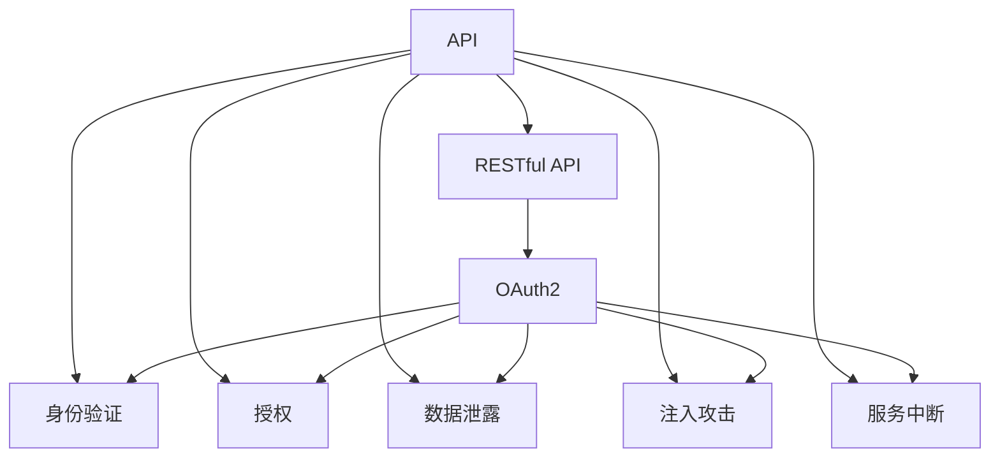

                 

# OWASP API 安全风险清单解读

> 关键词：API安全, OWASP, 安全风险清单, 应用编程接口, 安全评估, 威胁建模

## 1. 背景介绍

随着API（应用编程接口）在现代软件开发中的应用日益广泛，确保API的安全性变得愈发重要。API作为连接不同系统或服务的关键组件，其安全漏洞往往会导致严重的安全事件。据报道，超过50%的Web应用安全事件与API相关。这使得API安全成为安全社区和企业的重点关注领域。

### 1.1 API安全的重要性
API安全的重要性体现在以下几个方面：

- **广泛应用**：几乎所有的现代软件系统都依赖于API进行通信和数据交换，包括社交媒体、金融服务、电子商务等。
- **复杂性**：API设计和使用方式复杂多样，增加了安全漏洞出现的可能性。
- **高价值**：许多API直接访问敏感数据或执行关键操作，一旦被攻击，可能导致严重的安全后果。
- **潜在影响**：API安全漏洞可能影响大量用户，甚至导致企业声誉受损和重大经济损失。

### 1.2 安全威胁的多样性
API面临的安全威胁多种多样，包括但不限于以下几类：

- **身份验证与授权**：API用户身份未验证或授权不足，导致未授权访问。
- **数据泄露**：敏感数据在传输或存储过程中被窃取或泄露。
- **注入攻击**：如SQL注入、跨站脚本(XSS)等，利用API输入验证不严导致的攻击。
- **服务中断**：通过拒绝服务攻击(DoS)、分布式拒绝服务攻击(DDoS)等方式，使API无法正常工作。

## 2. 核心概念与联系

### 2.1 核心概念概述

为更深入地理解API安全风险，我们先梳理与API相关的几个核心概念：

- **API（应用编程接口）**：允许不同软件组件之间进行通信和数据交换。
- **RESTful API**：基于REST架构风格的API，强调无状态和资源的标识。
- **OAuth2**：用于授权API访问的标准，通过令牌交换机制实现安全的身份验证。
- **OWASP API Security Top 10**：由OWASP（开放网络应用安全项目）发布的安全风险清单，列出了API面临的前十大安全风险。

这些概念构成了API安全的基本框架，相互之间存在紧密联系，共同保障API的安全性。

### 2.2 核心概念之间的联系

通过一个简单的Mermaid流程图，我们可以更好地理解这些核心概念之间的联系：



从上图可以看出，RESTful API是API的主要实现形式，而OAuth2是常用的授权机制。API的安全性直接依赖于身份验证、授权、数据保护、注入防护和服务中断防御等多方面的设计和管理。

## 3. 核心算法原理 & 具体操作步骤
### 3.1 算法原理概述

OWASP API Security Top 10风险清单通过威胁建模和实际案例分析，系统地总结了API安全面临的十大威胁。这些威胁从身份验证与授权、数据泄露、注入攻击到服务中断，全面覆盖了API设计的各个方面。

### 3.2 算法步骤详解

下面是OWASP API Security Top 10风险清单的主要步骤：

1. **威胁建模**：通过对API的业务逻辑、架构设计和实现细节进行分析和建模，识别出潜在的威胁点。
2. **风险评估**：使用安全测试工具和方法，对API进行渗透测试和漏洞扫描，评估风险等级。
3. **风险治理**：根据威胁模型的结果，制定相应的安全策略和措施，降低或消除风险。
4. **风险监控**：实施持续的安全监控和异常检测，及时发现和应对新的安全威胁。

### 3.3 算法优缺点

 OWASP API Security Top 10的优点在于其系统性和全面性，涵盖了API设计的多个关键方面。其缺点主要体现在以下几个方面：

- **复杂性**：清单列出的风险复杂多样，可能使开发者难以全面理解和管理。
- **技术依赖**：依赖于特定的安全测试工具和方法，需要具备相应的技术能力。
- **适用性**：清单主要是基于Web API设计的，对其他类型的API可能不完全适用。

### 3.4 算法应用领域

 OWASP API Security Top 10适用于各类Web API的设计、开发和部署过程，特别是对那些涉及敏感数据和关键操作的API。该清单不仅对开发者和架构师有用，也对安全测试人员和管理员有重要参考价值。

## 4. 数学模型和公式 & 详细讲解 & 举例说明
### 4.1 数学模型构建

为了更精确地描述API安全风险，我们可以构建一些数学模型。假设我们有一个API系统，其安全风险可以用以下模型表示：

- **身份验证风险R1**：身份验证机制的脆弱性，可以用$R_1=R_1^{(1)}+R_1^{(2)}$表示，其中$R_1^{(1)}$为认证过程中的弱密码问题，$R_1^{(2)}$为认证过程中的中间人攻击问题。
- **授权风险R2**：授权机制的脆弱性，可以用$R_2=R_2^{(1)}+R_2^{(2)}$表示，其中$R_2^{(1)}$为授权过程中的未授权访问问题，$R_2^{(2)}$为授权过程中的授权过宽问题。
- **数据泄露风险R3$：数据在传输或存储过程中的泄露，可以用$R_3=R_3^{(1)}+R_3^{(2)}$表示，其中$R_3^{(1)}$为传输过程中的数据泄露问题，$R_3^{(2)}$为存储过程中的数据泄露问题。

### 4.2 公式推导过程

对于上述风险模型，我们可以通过以下公式进行推导：

- **身份验证风险**：
$$ R_1^{(1)} = P(\text{弱密码}) \times C(\text{弱密码}) $$
$$ R_1^{(2)} = P(\text{中间人攻击}) \times C(\text{中间人攻击}) $$
$$ R_1 = R_1^{(1)} + R_1^{(2)} $$

- **授权风险**：
$$ R_2^{(1)} = P(\text{未授权访问}) \times C(\text{未授权访问}) $$
$$ R_2^{(2)} = P(\text{授权过宽}) \times C(\text{授权过宽}) $$
$$ R_2 = R_2^{(1)} + R_2^{(2)} $$

- **数据泄露风险**：
$$ R_3^{(1)} = P(\text{传输数据泄露}) \times C(\text{传输数据泄露}) $$
$$ R_3^{(2)} = P(\text{存储数据泄露}) \times C(\text{存储数据泄露}) $$
$$ R_3 = R_3^{(1)} + R_3^{(2)} $$

其中$P$表示风险发生的概率，$C$表示风险造成的后果。

### 4.3 案例分析与讲解

以OAuth2授权机制为例，我们可以分析其可能存在的授权风险。假设一个Web应用使用OAuth2进行用户身份验证和授权，存在以下问题：

- **弱密码问题**：部分用户在设置密码时使用弱密码，导致账号容易被暴力破解。
- **中间人攻击**：OAuth2客户端在向身份提供者请求授权时，未使用HTTPS加密，导致中间人可能截获或篡改请求。
- **未授权访问**：OAuth2授权过程中未对客户端应用进行充分验证，导致未经授权的应用访问用户数据。
- **授权过宽**：OAuth2授权过程中未对应用访问范围进行细粒度控制，导致应用拥有超出其所需权限的访问能力。

通过上述案例，我们可以看到OAuth2授权机制在实际应用中存在的风险，及其对应的安全防护措施。

## 5. 项目实践：代码实例和详细解释说明
### 5.1 开发环境搭建

要实践OWASP API Security Top 10，首先需要搭建一个合适的开发环境。建议选择以下工具：

- **IDE**：如IntelliJ IDEA或Visual Studio Code。
- **数据库**：如MySQL或PostgreSQL。
- **Web框架**：如Spring Boot或Django。
- **安全测试工具**：如OWASP ZAP或Burp Suite。

### 5.2 源代码详细实现

下面是一个简单的RESTful API实现示例，涵盖了身份验证和授权的基本功能：

```java
@RestController
public class UserController {
    
    @Autowired
    private UserService userService;
    
    @PostMapping("/user/login")
    public ResponseEntity<User> login(@RequestBody UserRequest request) {
        // 身份验证逻辑
        User user = userService.findByUsername(request.getUsername());
        if (user.getPassword().equals(request.getPassword())) {
            // 生成OAuth2令牌
            OAuth2Token token = generateOAuth2Token(user);
            return ResponseEntity.ok(user);
        } else {
            return ResponseEntity.status(HttpStatus.UNAUTHORIZED).build();
        }
    }
    
    @GetMapping("/user/profile")
    @PreAuthorize("hasAuthority('USER:READ')")
    public ResponseEntity<UserProfile> getProfile(UserProfile userProfile) {
        return ResponseEntity.ok(userProfile);
    }
    
    private OAuth2Token generateOAuth2Token(User user) {
        // 生成OAuth2令牌
        return new OAuth2Token(user.getId(), "user:api", Instant.now(), Instant.now().plusSeconds(3600), "user:api");
    }
}
```

### 5.3 代码解读与分析

上述代码实现了基本的用户登录和授权功能，其中关键点包括：

- **身份验证**：通过用户名和密码验证用户身份，如果验证通过，生成OAuth2令牌。
- **授权**：使用Spring Security的`@PreAuthorize`注解，限制只有具有“USER:READ”权限的用户才能访问获取用户资料的接口。

### 5.4 运行结果展示

运行上述代码，并通过Postman或其他API测试工具进行测试，可以看到用户登录成功后的OAuth2令牌，以及获取用户资料的成功响应。

## 6. 实际应用场景
### 6.1 智能家居系统

智能家居系统中，各个组件通过API进行通信和数据交换。API的安全性直接关系到系统的稳定性和用户的隐私保护。

例如，一个智能锁API需要确保只有合法的用户才能通过API解锁门锁。如果API存在身份验证和授权漏洞，可能导致未授权访问和数据泄露，甚至遭受暴力破解攻击，使得家庭安全面临重大风险。

### 6.2 金融交易平台

金融交易平台API负责处理用户的交易请求，涉及大量的敏感数据和金融操作。API的安全性直接关系到用户的资产安全和平台信誉。

例如，一个支付API需要确保只有合法的用户和应用才能进行交易。如果API存在未授权访问和数据泄露问题，可能导致用户的资金被盗或账户信息泄露，严重影响用户的信任和平台声誉。

### 6.3 健康医疗平台

健康医疗平台API负责处理用户的健康数据和医疗咨询请求，涉及个人隐私和敏感信息。API的安全性直接关系到用户的隐私保护和平台合规性。

例如，一个医疗咨询API需要确保只有合法的用户和医疗机构才能访问和处理用户的健康数据。如果API存在数据泄露和注入攻击问题，可能导致用户的隐私信息被泄露或篡改，给用户的健康和安全带来严重威胁。

## 7. 工具和资源推荐
### 7.1 学习资源推荐

- **OWASP API Security Guide**：由OWASP发布，详细介绍了API安全的最佳实践和威胁建模方法。
- **RESTful API设计指南**：由Tomas Vesely编写，介绍了RESTful API设计的原则和实践。
- **Spring Security**：Spring Security官方文档，详细介绍了如何使用Spring Security进行API安全防护。
- **Django Rest Framework Security**：Django Rest Framework官方文档，介绍了如何使用Django Rest Framework进行API安全防护。

### 7.2 开发工具推荐

- **Postman**：API测试和开发工具，支持HTTP请求的模拟和测试，提供丰富的插件和脚本支持。
- **Swagger**：API文档和测试工具，支持自动生成API文档和测试用例，提供接口安全和监控功能。
- **OWASP ZAP**：网络应用安全测试工具，支持自动化扫描和手动渗透测试，提供丰富的安全检测功能。

### 7.3 相关论文推荐

- **OWASP API Security Top 10**：由OWASP发布的安全风险清单，列出了API面临的前十大安全风险。
- **RESTful API Security**：Tomas Vesely的研究论文，介绍了RESTful API安全的最佳实践和威胁建模方法。
- **Spring Security OAuth2**：Spring Security的OAuth2文档，详细介绍了如何使用OAuth2进行API授权和认证。

## 8. 总结：未来发展趋势与挑战
### 8.1 研究成果总结

OWASP API Security Top 10风险清单为API安全提供了全面的参考指南，帮助开发者识别和防范API安全威胁。该清单通过威胁建模和实际案例分析，系统地总结了API安全面临的主要问题。

### 8.2 未来发展趋势

API安全未来可能的发展趋势包括：

- **自动化安全测试**：利用自动化工具进行API安全测试，减少人为误操作，提高测试效率和覆盖率。
- **零信任架构**：采用零信任架构，对所有API请求进行严格的身份验证和授权，确保安全性。
- **API网关**：使用API网关集中管理API的安全性，提供统一的安全策略和监控。
- **区块链技术**：利用区块链技术提高API的透明性和不可篡改性，增强安全性。

### 8.3 面临的挑战

API安全面临的挑战包括：

- **复杂性高**：API设计和管理复杂多样，导致安全风险识别和防护难度大。
- **技术依赖强**：API安全依赖于安全测试工具和方法，需要具备相应的技术能力。
- **动态环境**：API环境动态变化，需要持续的安全监控和更新防护策略。

### 8.4 研究展望

未来API安全研究需要在以下几个方面寻求新的突破：

- **自动化安全测试**：开发更高效、更精确的自动化安全测试工具，降低人为误操作，提高测试效率和覆盖率。
- **智能安全分析**：利用机器学习和人工智能技术进行威胁识别和风险评估，提高安全防护的精准度。
- **动态安全管理**：开发动态安全管理工具，根据API环境的变化动态调整安全策略和防护措施。

## 9. 附录：常见问题与解答

**Q1：API安全有哪些主要威胁？**

A: API安全面临的主要威胁包括：身份验证与授权问题、数据泄露、注入攻击、服务中断等。这些问题可能导致未授权访问、数据泄露、应用拒绝服务等安全事件。

**Q2：如何保护API的认证和授权？**

A: 保护API认证和授权的关键在于采用强密码策略、使用HTTPS加密、实现双向认证等。具体措施包括：

- 使用强密码策略，确保密码复杂性和定期更换。
- 使用HTTPS加密，确保认证和授权请求的传输安全。
- 实现双向认证，确保客户端和服务器端都能验证对方身份。

**Q3：如何检测和防范注入攻击？**

A: 检测和防范注入攻击需要综合采用输入验证、参数化查询、白名单过滤等技术手段。具体措施包括：

- 对用户输入进行严格验证，避免注入攻击。
- 使用参数化查询，避免SQL注入和XSS攻击。
- 使用白名单过滤，只允许可信的输入数据。

**Q4：如何监控和响应API安全事件？**

A: 监控和响应API安全事件需要建立完善的安全监控机制，及时发现和应对安全事件。具体措施包括：

- 实时监控API请求和响应，识别异常行为和威胁。
- 建立安全事件响应流程，及时处理安全事件。
- 定期进行安全漏洞扫描和渗透测试，发现并修复安全漏洞。

通过以上对OWASP API Security Top 10风险清单的解读，希望能为API开发者和架构师提供有价值的参考，帮助他们更好地设计和实现安全、可靠、高效的API系统。

