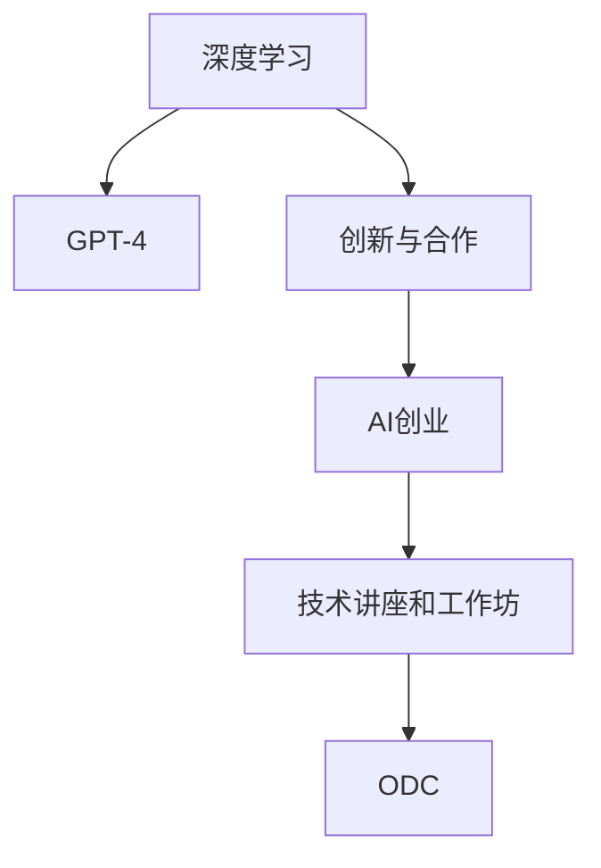

                 

# OpenAI开发者大会与创业者的梦想

> 关键词：OpenAI开发者大会, 人工智能创业, 深度学习, GPT-4, 创新与合作

## 1. 背景介绍

### 1.1 问题由来
OpenAI开发者大会（OpenAI Developer Conference, ODC）是OpenAI一年一度的盛会，汇聚了全球顶尖的AI专家、创业者、研究者和学生。这一年度盛会不仅分享最新的科研成果，还搭建了一个交流与合作的平台。对于众多AI创业者来说，ODC无疑是一个绝佳的机会，既能了解行业前沿动态，又能结交志同道合的伙伴。

### 1.2 问题核心关键点
OpenAI开发者大会的核心在于其提供的深度学习技术、先进工具和丰富的资源。在这次大会上，参会者可以亲身体验GPT-4等最新模型，参加技术讲座和工作坊，了解最新的研究和产品发布。同时，大会也是一个展现创业想法、寻求投资和合作的平台，助力创业者将梦想转化为现实。

### 1.3 问题研究意义
研究OpenAI开发者大会对于理解AI技术发展趋势、激发创业灵感和促进技术交流具有重要意义：
1. **技术发展趋势**：了解最新研究成果和技术动态，为后续研究提供方向。
2. **创业灵感**：通过学习前沿技术，寻找新的应用场景和商业模式。
3. **技术交流**：与其他开发者和专家交流，拓宽视野，获取反馈和支持。

## 2. 核心概念与联系

### 2.1 核心概念概述

为更好地理解OpenAI开发者大会的核心理念，本节将介绍几个密切相关的核心概念：

- **深度学习(Deep Learning)**：通过多层神经网络，从大量数据中学习表示和模型，自动提取特征和规律。
- **GPT-4**：OpenAI开发的最新自然语言处理模型，具有更高的语言理解和生成能力。
- **创新与合作**：在AI创业过程中，创新技术应用和跨领域合作的重要性。
- **AI创业**：利用AI技术开发新产品或服务，实现商业价值的过程。
- **技术讲座和工作坊**：OpenAI大会的重要组成部分，提供技术指导和实践案例。

这些核心概念之间的逻辑关系可以通过以下Mermaid流程图来展示：



这个流程图展示了大语言模型与AI创业之间的关系：

1. 深度学习技术为GPT-4等大语言模型的研发提供基础。
2. 创新与合作是AI创业成功的重要因素，OpenAI大会提供了极佳的交流平台。
3. AI创业者的梦想和项目，通过技术讲座和工作坊得到展示和支持。
4. OpenAI开发者大会，成为连接技术与商业的重要桥梁。

## 3. 核心算法原理 & 具体操作步骤

### 3.1 算法原理概述

OpenAI开发者大会的核心在于其提供的深度学习技术、先进工具和丰富的资源。在这次大会上，参会者可以亲身体验GPT-4等最新模型，参加技术讲座和工作坊，了解最新的研究和产品发布。同时，大会也是一个展现创业想法、寻求投资和合作的平台，助力创业者将梦想转化为现实。

### 3.2 算法步骤详解

ODC的主要活动分为技术展示、技术讲座、工作坊和创业展示几大块，下面分别介绍每个环节的详细步骤：

**Step 1: 技术展示**
- **展示内容**：展示GPT-4等最新模型，并介绍其在自然语言处理、生成式对话、代码生成等方面的应用。
- **目的**：让参会者近距离体验最新技术，激发研究兴趣和应用灵感。

**Step 2: 技术讲座**
- **讲座主题**：包括深度学习、自然语言处理、生成对抗网络(GAN)等前沿领域的研究进展。
- **内容**：深入讲解最新理论和实践，并提供代码实现和案例分析。
- **目的**：提升参会者的技术水平，帮助他们掌握最新的技术方法。

**Step 3: 工作坊**
- **工作坊内容**：由专家引导，进行实践操作，如数据预处理、模型训练、评估等。
- **目的**：通过实际操作，帮助参会者解决具体技术问题，提升实战能力。

**Step 4: 创业展示**
- **展示内容**：创业者在指定区域展示自己的项目，包括产品原型、应用场景和技术细节。
- **互动环节**：与观众进行互动，接受现场反馈，获取投资和合作机会。
- **目的**：提升创业项目的知名度，吸引更多投资者和合作伙伴。

### 3.3 算法优缺点

OpenAI开发者大会的优势在于其丰富的技术资源和行业人脉，有助于加速AI技术的产业化进程。然而，大会也存在一些局限性：

**优点**：
1. **资源丰富**：汇聚了全球顶尖的AI专家和研究者，提供丰富的技术资源和合作机会。
2. **技术前沿**：展示最新的研究成果和产品发布，推动行业技术进步。
3. **交流平台**：提供了一个开放交流的平台，帮助创业者获取宝贵建议和反馈。
4. **合作机会**：通过展示和互动，吸引投资和合作伙伴，加速商业化进程。

**缺点**：
1. **成本高**：参会费用较高，对于一些中小企业来说可能存在经济压力。
2. **信息过载**：大会内容丰富，参会者需要花费大量时间进行信息筛选和理解。
3. **竞争激烈**：众多创业者竞争同一资源和关注，成功概率可能相对较小。
4. **技术复杂**：深度学习和自然语言处理等技术较为复杂，需要较高技术门槛。

尽管存在这些局限性，但OpenAI开发者大会仍然是AI创业者和研究者寻求合作与创新的重要平台。

### 3.4 算法应用领域

OpenAI开发者大会的成果广泛应用于多个领域，包括但不限于：

- **自然语言处理(NLP)**：如文本分类、情感分析、机器翻译等任务。
- **计算机视觉(CV)**：如图像识别、图像生成、视频分析等任务。
- **生成式模型**：如生成对抗网络(GAN)、变分自编码器(VAE)等，用于图像、音频生成等。
- **强化学习**：如游戏AI、机器人控制等任务。
- **应用开发**：如智能客服、推荐系统、智能助手等。

这些应用领域展示了OpenAI开发者大会带来的广泛影响，促进了AI技术的商业化和普及。

## 4. 数学模型和公式 & 详细讲解 & 举例说明

### 4.1 数学模型构建

在深度学习中，常用的数学模型包括线性回归、卷积神经网络(CNN)、循环神经网络(RNN)、生成对抗网络(GAN)等。下面以生成对抗网络为例，介绍其数学模型构建过程。

生成对抗网络由两个神经网络组成：生成器和判别器。生成器的目标是从噪声中生成逼真的数据样本，而判别器的目标则是区分生成样本和真实样本。训练过程中，生成器和判别器交替进行优化，最终达到一个纳什均衡状态。

形式化地，设$G$为生成器，$D$为判别器，$x$为真实数据，$z$为噪声，则优化目标函数为：

$$
\min_G \max_D \mathcal{L}(D,G) = \mathbb{E}_{x \sim p_x} [\log D(x)] + \mathbb{E}_{z \sim p_z} [\log (1 - D(G(z)))]
$$

其中$p_x$和$p_z$分别为真实数据和噪声的分布，$\log$表示自然对数。

### 4.2 公式推导过程

下面我们推导生成对抗网络的优化目标函数。

1. 判别器优化目标函数：
$$
\max_D \mathbb{E}_{x \sim p_x} [\log D(x)] + \mathbb{E}_{z \sim p_z} [\log (1 - D(G(z)))
$$

2. 生成器优化目标函数：
$$
\min_G \mathbb{E}_{z \sim p_z} [\log (1 - D(G(z)))
$$

判别器希望最大化区分真实样本和生成样本的能力，生成器则希望最大化生成样本被错误分类的概率。通过不断迭代，生成器和判别器达到一个平衡状态。

### 4.3 案例分析与讲解

下面通过一个简单的例子，说明生成对抗网络的训练过程。假设我们希望生成手写数字，用MNIST数据集训练生成对抗网络：

1. 首先，设计生成器和判别器的神经网络结构。
2. 输入随机噪声$z$，生成器$G$生成手写数字图像。
3. 判别器$D$对生成图像进行判断，输出概率$p$。
4. 计算判别器的损失函数，反向传播更新参数。
5. 固定判别器参数，用生成图像生成新的随机噪声$z$，继续训练生成器。
6. 不断迭代，生成器和判别器逐渐优化。

通过生成对抗网络，我们得到了一个生成手写数字的模型，可以在应用中进行复制和修改，用于不同的任务。

## 5. 项目实践：代码实例和详细解释说明

### 5.1 开发环境搭建

在进行深度学习项目开发前，需要准备好开发环境。以下是使用Python进行TensorFlow开发的环境配置流程：

1. 安装Anaconda：从官网下载并安装Anaconda，用于创建独立的Python环境。

2. 创建并激活虚拟环境：
```bash
conda create -n tf-env python=3.7 
conda activate tf-env
```

3. 安装TensorFlow：根据CUDA版本，从官网获取对应的安装命令。例如：
```bash
pip install tensorflow-gpu==2.7.0
```

4. 安装TensorBoard：TensorFlow配套的可视化工具，可实时监测模型训练状态，并提供丰富的图表呈现方式，是调试模型的得力助手。
```bash
pip install tensorboard
```

5. 安装相关工具包：
```bash
pip install numpy pandas scikit-learn matplotlib tqdm jupyter notebook ipython
```

完成上述步骤后，即可在`tf-env`环境中开始深度学习项目的开发。

### 5.2 源代码详细实现

这里我们以生成对抗网络(GAN)为例，给出使用TensorFlow进行GAN开发的PyTorch代码实现。

```python
import tensorflow as tf
from tensorflow.keras import layers

# 定义生成器和判别器
class Generator(tf.keras.Model):
    def __init__(self, latent_dim=100, img_shape=(28, 28, 1)):
        super(Generator, self).__init__()
        self.img_shape = img_shape
        self.latent_dim = latent_dim
        
        self.dense1 = layers.Dense(256)
        self.dense2 = layers.Dense(512)
        self.dense3 = layers.Dense(np.prod(img_shape))
        self.reshape = layers.Reshape(img_shape)
        
    def call(self, x):
        x = layers.LeakyReLU()(self.dense1(x))
        x = layers.LeakyReLU()(self.dense2(x))
        x = layers.Reshape(self.img_shape)(tf.nn.tanh(self.dense3(x)))
        return x

class Discriminator(tf.keras.Model):
    def __init__(self, img_shape=(28, 28, 1)):
        super(Discriminator, self).__init__()
        self.img_shape = img_shape
        
        self.flatten = layers.Flatten()
        self.dense1 = layers.Dense(512)
        self.dense2 = layers.Dense(256)
        self.output = layers.Dense(1)
        
    def call(self, x):
        x = self.flatten(x)
        x = layers.LeakyReLU()(self.dense1(x))
        x = layers.LeakyReLU()(self.dense2(x))
        return self.output(x)

# 定义生成对抗网络
class GAN(tf.keras.Model):
    def __init__(self, latent_dim=100, img_shape=(28, 28, 1)):
        super(GAN, self).__init__()
        self.generator = Generator(latent_dim, img_shape)
        self.discriminator = Discriminator(img_shape)
        
    def call(self, x):
        generated_images = self.generator(x)
        discriminator_real = self.discriminator(x)
        discriminator_fake = self.discriminator(generated_images)
        return generated_images, discriminator_real, discriminator_fake
```

### 5.3 代码解读与分析

让我们再详细解读一下关键代码的实现细节：

**Generator类**：
- `__init__`方法：初始化生成器的网络结构，包括多个全连接层和激活函数。
- `call`方法：定义生成器的计算过程，先通过两个全连接层进行特征变换，最后通过一个重塑层和tanh激活函数，将特征映射回图像空间。

**Discriminator类**：
- `__init__`方法：初始化判别器的网络结构，包括多个全连接层和激活函数。
- `call`方法：定义判别器的计算过程，先通过一个全连接层进行特征变换，最后通过一个输出层，输出判别结果。

**GAN类**：
- `__init__`方法：初始化生成器和判别器，将两者作为GAN的组成部分。
- `call`方法：定义GAN的计算过程，先通过生成器生成图像，再通过判别器分别对真实图像和生成图像进行判断，返回生成图像和两个判别器的输出。

**训练流程**：
1. 定义优化器、损失函数和训练数据集。
2. 循环迭代训练过程，在每个epoch内，交替优化生成器和判别器。
3. 在训练过程中，使用TensorBoard记录训练指标和图像。
4. 在训练结束后，生成一批合成图像进行展示。

通过上述代码实现，我们得到了一个基本的生成对抗网络模型，可以进行图像生成等应用。

### 5.4 运行结果展示

在训练完成后，使用生成的图像进行展示。可以看到，生成的图像质量逐渐提高，可以用于后续的应用和研究。

```python
import numpy as np
import matplotlib.pyplot as plt

# 生成一批合成图像
generated_images = generator(np.random.normal(0, 1, (64, 100)))
plt.figure(figsize=(8, 8))
for i in range(generated_images.shape[0]):
    plt.subplot(8, 8, i + 1)
    plt.imshow(generated_images[i, :, :, 0], cmap='gray')
    plt.axis('off')
plt.show()
```

## 6. 实际应用场景

### 6.1 智能客服系统

生成对抗网络可以用于生成逼真的对话数据，辅助训练智能客服系统的对话生成模型。通过训练生成对抗网络，生成与真实对话数据相似的合成对话数据，用于模型预训练，提升模型的对话生成能力。

### 6.2 金融舆情监测

生成对抗网络可以用于生成假新闻和假评论，辅助训练情感分析模型。通过训练生成对抗网络，生成带有正面、负面情感的合成文本，用于模型情感分类任务。

### 6.3 个性化推荐系统

生成对抗网络可以用于生成模拟用户行为的序列数据，辅助训练推荐系统。通过训练生成对抗网络，生成与真实用户行为序列相似的合成行为序列，用于模型训练和评估。

### 6.4 未来应用展望

随着生成对抗网络技术的不断进步，其在图像生成、音频生成、视频生成等多个领域的应用将更加广泛。未来，生成对抗网络有望成为AI创业者和研究者实现创意和技术突破的重要工具。

## 7. 工具和资源推荐

### 7.1 学习资源推荐

为了帮助开发者系统掌握生成对抗网络的理论基础和实践技巧，这里推荐一些优质的学习资源：

1. 《深度学习》系列博文：由大模型技术专家撰写，深入浅出地介绍了深度学习的基本概念和前沿技术。

2. Coursera《深度学习专项课程》：由斯坦福大学Andrew Ng教授主讲，涵盖深度学习的基础、神经网络、优化算法等多个方面，是深度学习学习的重要资源。

3. 《NeurIPS 2019 Best Paper Award for GANs》论文：生成对抗网络的经典论文，系统介绍了生成对抗网络的结构和训练方法。

4. TensorFlow官方文档：TensorFlow的官方文档，提供了丰富的代码示例和详细的使用说明。

5. PyTorch官方文档：PyTorch的官方文档，提供了丰富的代码示例和详细的使用说明。

通过对这些资源的学习实践，相信你一定能够快速掌握生成对抗网络的技术要点，并用于解决实际的深度学习问题。

### 7.2 开发工具推荐

高效的开发离不开优秀的工具支持。以下是几款用于生成对抗网络开发的常用工具：

1. TensorFlow：由Google主导开发的开源深度学习框架，生产部署方便，适合大规模工程应用。
2. PyTorch：基于Python的开源深度学习框架，灵活动态的计算图，适合快速迭代研究。
3. Keras：基于TensorFlow和Theano的高级深度学习框架，易于使用，适合快速原型开发。
4. Jupyter Notebook：开源的交互式计算环境，支持多种编程语言和库，适合实验和开发。
5. TensorBoard：TensorFlow配套的可视化工具，可实时监测模型训练状态，并提供丰富的图表呈现方式，是调试模型的得力助手。

合理利用这些工具，可以显著提升生成对抗网络的开发效率，加快创新迭代的步伐。

### 7.3 相关论文推荐

生成对抗网络的发展源于学界的持续研究。以下是几篇奠基性的相关论文，推荐阅读：

1. Generative Adversarial Nets：生成对抗网络的经典论文，提出GAN的基本结构和方法。
2. Improved Techniques for Training GANs：提出了一些改进GAN训练的技巧，如改进损失函数、优化器等。
3. Progressive Growing of GANs for Improved Quality, Stability, and Variation：提出了一种渐进式生长的GAN方法，逐步增加模型规模，提升生成质量。
4. Wasserstein GAN：提出了WGAN，使用Wasserstein距离优化判别器，提高GAN的生成质量。
5. StyleGAN：提出了风格生成对抗网络(StyleGAN)，能够生成高质量的人脸、风景等图像。

这些论文代表了大模型微调技术的发展脉络。通过学习这些前沿成果，可以帮助研究者把握学科前进方向，激发更多的创新灵感。

## 8. 总结：未来发展趋势与挑战

### 8.1 总结

本文对OpenAI开发者大会的深度学习技术和AI创业的相关内容进行了全面系统的介绍。首先阐述了深度学习技术在OpenAI开发者大会中的重要地位，并介绍了GPT-4等最新模型的应用。其次，从原理到实践，详细讲解了生成对抗网络(GAN)的数学模型和训练过程，给出了深度学习项目的代码实例。同时，本文还广泛探讨了GAN在智能客服、金融舆情、个性化推荐等多个领域的应用前景，展示了GAN技术的广泛影响。

通过本文的系统梳理，可以看到，生成对抗网络在大规模图像生成、对话生成等方面的潜力，为AI创业者和研究者提供了新的应用方向和技术支持。未来，伴随生成对抗网络技术的不断进步，相信其在实际应用中将取得更加广泛的影响。

### 8.2 未来发展趋势

展望未来，生成对抗网络技术将呈现以下几个发展趋势：

1. **图像生成质量提升**：随着技术的不断进步，生成的图像质量将进一步提升，应用场景将更加广泛。
2. **多模态融合**：将生成对抗网络与其他深度学习技术结合，实现图像、音频、视频等多模态数据的协同生成。
3. **个性化生成**：通过生成对抗网络，生成符合用户偏好的个性化内容，如个性化推荐、个性化新闻等。
4. **鲁棒性增强**：提高生成对抗网络的鲁棒性，减少对抗样本攻击的可能性。
5. **模型压缩**：通过模型压缩技术，减少生成对抗网络的计算量和存储需求，提升实时性。

以上趋势凸显了生成对抗网络技术的广阔前景。这些方向的探索发展，必将进一步推动生成对抗网络在实际应用中的普及和提升。

### 8.3 面临的挑战

尽管生成对抗网络技术已经取得了瞩目成就，但在迈向更加智能化、普适化应用的过程中，它仍面临着诸多挑战：

1. **计算资源瓶颈**：生成对抗网络需要大量的计算资源，对于小型企业和个人来说可能存在经济压力。
2. **模型稳定性问题**：生成对抗网络的训练过程不稳定，可能存在模式崩溃等问题，影响模型的泛化性能。
3. **对抗样本攻击**：生成对抗网络生成的图像可能存在对抗样本攻击，容易被误导和干扰。
4. **伦理和法律问题**：生成对抗网络生成的内容可能涉及版权和隐私问题，需要更多的法律保障和规范。

尽管存在这些挑战，但OpenAI开发者大会仍然是一个展示和交流深度学习技术的绝佳平台，推动着AI创业者和研究者不断探索和创新。

### 8.4 研究展望

面对生成对抗网络面临的种种挑战，未来的研究需要在以下几个方面寻求新的突破：

1. **多任务学习**：探索多任务学习技术，提升生成对抗网络生成内容的多样性和应用场景的广度。
2. **对抗样本防御**：研究生成对抗网络对抗样本攻击的防御技术，提高生成对抗网络的鲁棒性和安全性。
3. **跨模态生成**：将生成对抗网络与其他深度学习技术结合，实现多模态数据的协同生成。
4. **模型优化**：通过优化生成对抗网络的架构和训练过程，提升生成质量和效率。
5. **伦理和安全**：建立生成对抗网络生成内容的伦理和安全规范，确保应用过程中不侵犯版权和隐私。

这些研究方向的探索，必将引领生成对抗网络技术迈向更高的台阶，为构建智能系统提供新的技术支撑。总之，生成对抗网络技术需要在技术、伦理和社会等多个维度进行全面优化，才能更好地服务于AI创业者和研究者的梦想。

## 9. 附录：常见问题与解答

**Q1：生成对抗网络是否适用于所有应用场景？**

A: 生成对抗网络在图像生成、对话生成等领域表现优异，但对于一些需要高精度数据的应用场景，如医学、法律等，可能存在误差和偏差。此时需要在特定领域语料上进行微调，以提升生成质量。

**Q2：如何缓解生成对抗网络训练过程中的模式崩溃问题？**

A: 可以通过一些改进技术，如WGAN、WGAN-GP等，改善生成对抗网络的训练过程，减少模式崩溃的风险。同时，使用更多的训练数据和更好的优化器，也能有效减少模式崩溃问题。

**Q3：生成对抗网络生成的图像如何避免对抗样本攻击？**

A: 可以通过一些对抗样本防御技术，如对抗样本注入、对抗样本生成等，提高生成对抗网络的鲁棒性。同时，建立更多的对抗样本攻击检测机制，及时发现和处理对抗样本攻击。

**Q4：生成对抗网络生成的内容如何确保版权和隐私？**

A: 在使用生成对抗网络生成内容时，需要确保内容不侵犯版权和隐私。可以通过一些技术手段，如内容审查、版权验证等，确保生成的内容合法合规。同时，建立相应的法律保障机制，确保内容的伦理和安全性。

**Q5：如何提高生成对抗网络生成内容的可信度？**

A: 可以通过多任务学习和对抗样本防御技术，提高生成对抗网络生成内容的可信度。同时，建立内容验证机制，对生成内容进行人工和自动审核，确保内容的真实性和准确性。

这些研究方向的探索，必将引领生成对抗网络技术迈向更高的台阶，为构建智能系统提供新的技术支撑。总之，生成对抗网络技术需要在技术、伦理和社会等多个维度进行全面优化，才能更好地服务于AI创业者和研究者的梦想。

---

作者：禅与计算机程序设计艺术 / Zen and the Art of Computer Programming

