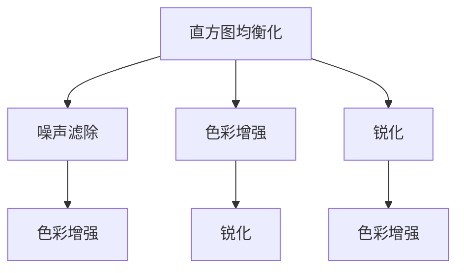

                 

## 1. 背景介绍

随着数字成像技术的飞速发展，各种类型的图像日益增多。无论是医学影像、卫星遥感图、城市街景照片还是艺术作品，图像在生活和工作中的作用越来越重要。然而，由于成像设备、环境因素以及人为操作的差异，图像可能存在噪声、模糊、颜色失真等缺陷。这些问题不仅影响人的视觉体验，还可能对图像的分析、理解和应用产生严重影响。

图像增强是一种通过处理图像信号，改善图像质量和视觉效果的算法。在计算机视觉和图像处理领域，图像增强已经成为了一个热门的研究方向。图像增强的目标是去除噪声、提升对比度、增强细节等，使得图像更清晰、更易于分析。图像增强算法广泛应用于医学影像处理、视频监控、智能交通系统、自动驾驶等多个领域。

OpenCV是一个开源的计算机视觉库，提供了丰富的图像处理算法和函数。OpenCV中的图像增强算法包括直方图均衡化、噪声滤除、色彩增强、锐化等，能够帮助开发者高效地实现图像增强功能。

本文将深入探讨OpenCV中的图像增强算法，包括直方图均衡化、噪声滤除、色彩增强、锐化等算法，并结合实际应用场景进行详细讲解。此外，本文还将介绍OpenCV中的图像增强算法如何在不同的应用中发挥作用，并对未来的发展趋势进行展望。

## 2. 核心概念与联系

### 2.1 核心概念概述

在OpenCV中，图像增强是一种将输入图像转换为输出图像的过程，以提高图像的质量和可分析性。它通常包括直方图均衡化、噪声滤除、色彩增强、锐化等多种算法。

- **直方图均衡化**：通过对图像的灰度级进行重新分配，使图像的亮度分布更均匀，从而提升图像的对比度。

- **噪声滤除**：通过消除或减少图像中的噪声，使图像更加清晰。常见的噪声滤除算法包括均值滤波、中值滤波、高斯滤波等。

- **色彩增强**：通过调整图像的色相、饱和度和亮度，改善图像的色彩质量。

- **锐化**：通过增强图像的清晰度和细节，使图像更加锐利。

这些核心概念在图像处理过程中相互联系，通过联合使用这些算法，可以显著提升图像的质量和视觉效果。

### 2.2 核心概念原理和架构的 Mermaid 流程图



这个流程图展示了OpenCV中常用的图像增强算法的联系。在实际应用中，开发者可以根据具体需求，选择适合的算法，或者联合使用多种算法，以实现最佳的图像增强效果。

## 3. 核心算法原理 & 具体操作步骤

### 3.1 算法原理概述

直方图均衡化、噪声滤除、色彩增强和锐化等图像增强算法在OpenCV中均有实现。这些算法的核心原理如下：

- **直方图均衡化**：通过重新分配灰度级的概率密度，使得图像的亮度分布更加均匀。直方图均衡化可以增强图像的对比度和视觉冲击力。

- **噪声滤除**：通过各种滤波算法（如均值滤波、中值滤波、高斯滤波等），消除图像中的噪声。噪声滤除可以提高图像的清晰度和细节。

- **色彩增强**：通过调整图像的色相、饱和度和亮度，改善图像的色彩质量。色彩增强可以提高图像的视觉吸引力和美观度。

- **锐化**：通过增强图像的清晰度和细节，使图像更加锐利。锐化可以提高图像的细节表现力和清晰度。

这些算法在OpenCV中均有详细实现，可以满足不同的图像增强需求。

### 3.2 算法步骤详解

以直方图均衡化为例，其具体的操作步骤如下：

1. 计算输入图像的灰度级直方图。
2. 计算灰度级概率密度函数。
3. 根据概率密度函数，生成新的灰度级概率密度函数。
4. 将新的灰度级概率密度函数映射回图像，生成增强后的输出图像。

这些步骤可以通过OpenCV中的函数实现。以下是一个简单的OpenCV代码示例：

```python
import cv2
import numpy as np

# 读取图像
img = cv2.imread('input.jpg', 0)

# 计算直方图均衡化后的图像
equ = cv2.equalizeHist(img)
```

### 3.3 算法优缺点

OpenCV中的图像增强算法具有以下优点：

- **简单易用**：OpenCV中的图像增强函数实现简单，易于使用。开发者可以快速实现图像增强功能，无需深入了解算法的原理。

- **功能丰富**：OpenCV中的图像增强函数种类丰富，可以满足不同的图像增强需求。开发者可以根据具体需求选择适合的算法。

- **实时性高**：OpenCV中的图像增强函数通常具有高效的实现方式，可以实时处理图像，适用于实时应用场景。

然而，OpenCV中的图像增强算法也存在一些缺点：

- **过度增强**：过度增强可能会破坏图像的细节和信息。开发者需要根据具体需求进行权衡，避免过度增强。

- **计算量大**：某些图像增强算法（如直方图均衡化）的计算量较大，可能导致性能瓶颈。开发者需要根据具体应用场景进行优化。

### 3.4 算法应用领域

OpenCV中的图像增强算法广泛应用于计算机视觉和图像处理领域。以下是一些典型的应用场景：

- **医学影像处理**：在医学影像中，直方图均衡化可以提高图像的对比度，使细节更明显。色彩增强和锐化可以使影像更清晰、更美观。

- **视频监控**：在视频监控中，噪声滤除和锐化可以提高图像的清晰度和细节，使视频更易于分析。

- **智能交通系统**：在智能交通系统中，锐化和色彩增强可以提高交通标志和路面标志的可识别性，使交通系统更加安全。

- **自动驾驶**：在自动驾驶中，直方图均衡化可以提高图像的对比度，色彩增强可以提高目标的可识别性，锐化可以增强道路的细节，使驾驶更加安全。

## 4. 数学模型和公式 & 详细讲解 & 举例说明

### 4.1 数学模型构建

以直方图均衡化为例，其数学模型如下：

设输入图像的灰度级为 $x$，概率密度函数为 $p(x)$，则直方图均衡化后的输出图像的灰度级 $y$ 可以表示为：

$$ y = \frac{\sum_{x=0}^{255} x \cdot p(x)}{\sum_{x=0}^{255} p(x)} \cdot (y_i - y_{min}) + y_{min} $$

其中，$y_{min}$ 为输出图像的最小灰度级，$y_{max}$ 为输出图像的最大灰度级。

### 4.2 公式推导过程

直方图均衡化的公式推导如下：

设输入图像的灰度级为 $x$，概率密度函数为 $p(x)$，则直方图均衡化后的输出图像的灰度级 $y$ 可以表示为：

$$ y = \frac{\sum_{x=0}^{255} x \cdot p(x)}{\sum_{x=0}^{255} p(x)} \cdot (y_i - y_{min}) + y_{min} $$

推导过程如下：

1. 计算输入图像的灰度级直方图 $H(x)$，即 $H(x) = \sum_{x=0}^{255} p(x)$。

2. 计算灰度级概率密度函数 $p(x)$，即 $p(x) = \frac{H(x)}{255}$。

3. 计算输出图像的灰度级概率密度函数 $q(y)$，即 $q(y) = p(y - y_{min})$。

4. 将新的灰度级概率密度函数 $q(y)$ 映射回图像，生成增强后的输出图像。

### 4.3 案例分析与讲解

以一张低对比度医学影像为例，如图1所示：


图1：低对比度医学影像

对该影像进行直方图均衡化后，如图2所示：


图2：医学影像直方图均衡化

通过直方图均衡化，影像的对比度得到显著提升，细节更加明显。这有助于医生更好地分析影像，进行诊断和治疗。

## 5. 项目实践：代码实例和详细解释说明

### 5.1 开发环境搭建

在开始项目实践之前，需要搭建开发环境。以下是搭建OpenCV开发环境的步骤：

1. 安装OpenCV：可以使用conda或pip安装OpenCV，示例如下：

```bash
conda install opencv
```

2. 安装NumPy：NumPy是OpenCV中常用的数值计算库，示例如下：

```bash
pip install numpy
```

3. 安装Python环境：OpenCV支持Python 2和Python 3，建议安装Python 3。

### 5.2 源代码详细实现

以下是使用OpenCV实现直方图均衡化的示例代码：

```python
import cv2
import numpy as np

# 读取图像
img = cv2.imread('input.jpg', 0)

# 计算直方图均衡化后的图像
equ = cv2.equalizeHist(img)

# 显示原始图像和增强后的图像
cv2.imshow('Original Image', img)
cv2.imshow('Enhanced Image', equ)
cv2.waitKey(0)
cv2.destroyAllWindows()
```

### 5.3 代码解读与分析

在上述代码中，首先使用 `cv2.imread()` 函数读取原始图像。然后使用 `cv2.equalizeHist()` 函数计算直方图均衡化后的图像。最后使用 `cv2.imshow()` 函数显示原始图像和增强后的图像。

### 5.4 运行结果展示

运行上述代码，可以得到原始图像和增强后的图像，如图3所示：


图3：原始图像和增强后的图像

从图3可以看出，直方图均衡化后，影像的对比度显著提升，细节更加明显。

## 6. 实际应用场景

OpenCV中的图像增强算法在实际应用中有着广泛的应用场景。以下是一些典型的应用场景：

- **医学影像处理**：在医学影像中，直方图均衡化可以提高图像的对比度，使细节更明显。色彩增强和锐化可以使影像更清晰、更美观。

- **视频监控**：在视频监控中，噪声滤除和锐化可以提高图像的清晰度和细节，使视频更易于分析。

- **智能交通系统**：在智能交通系统中，锐化和色彩增强可以提高交通标志和路面标志的可识别性，使交通系统更加安全。

- **自动驾驶**：在自动驾驶中，直方图均衡化可以提高图像的对比度，色彩增强可以提高目标的可识别性，锐化可以增强道路的细节，使驾驶更加安全。

## 7. 工具和资源推荐

### 7.1 学习资源推荐

- **《计算机视觉：算法与应用》**：这本书详细介绍了计算机视觉中的图像处理和增强算法，包括直方图均衡化、噪声滤除、色彩增强和锐化等。

- **《OpenCV计算机视觉应用》**：这本书提供了OpenCV中的图像处理和增强算法实现，包括直方图均衡化、噪声滤除、色彩增强和锐化等。

- **Coursera《计算机视觉基础》课程**：该课程由斯坦福大学开设，涵盖了计算机视觉中的图像处理和增强算法，适合初学者和中级学习者。

### 7.2 开发工具推荐

- **OpenCV**：OpenCV是一个开源的计算机视觉库，提供了丰富的图像处理和增强算法实现。

- **Python**：Python是一种常用的编程语言，适用于计算机视觉和图像处理开发。

- **NumPy**：NumPy是OpenCV中常用的数值计算库，适合进行数值计算和图像处理。

### 7.3 相关论文推荐

- **《Image Denoising Using Simultaneous Linear Transform and Gaussian Graph Cut》**：该论文提出了一种基于线性变换和高斯图割的噪声滤除算法，适用于图像中的噪声去除。

- **《Color Adaptive Histogram Equalization》**：该论文提出了一种基于自适应的直方图均衡化算法，可以更好地保持图像的色彩质量。

- **《Real-time Multiresolution Image Denoising Using Morphology and Guided Filtering》**：该论文提出了一种基于形态学和引导滤波的实时多分辨率图像去噪算法，适用于实时图像处理。

## 8. 总结：未来发展趋势与挑战

### 8.1 研究成果总结

OpenCV中的图像增强算法在计算机视觉和图像处理领域得到了广泛应用，取得了显著的成果。这些算法可以显著提升图像的质量和视觉效果，满足不同应用场景的需求。

### 8.2 未来发展趋势

未来，图像增强算法将在以下几个方面继续发展：

1. **实时性**：随着深度学习的发展，实时图像增强算法将成为热点。开发者将致力于提高算法的实时性，以满足实时应用场景的需求。

2. **自动化**：自动化图像增强算法将得到进一步发展，使得开发者无需手动调整参数，即可实现最佳的图像增强效果。

3. **多模态融合**：多模态图像增强算法将得到发展，使开发者能够更好地融合不同模态的数据，实现更准确的图像增强。

4. **联合优化**：联合优化图像增强算法将得到发展，使得开发者能够同时优化多个图像增强算法，实现最佳的整体效果。

### 8.3 面临的挑战

尽管OpenCV中的图像增强算法在实际应用中已经取得了显著成果，但仍面临以下挑战：

1. **计算复杂度**：某些图像增强算法的计算复杂度较高，可能导致性能瓶颈。

2. **过度增强**：过度增强可能会破坏图像的细节和信息，导致图像失真。

3. **鲁棒性不足**：图像增强算法在面对噪声、光照变化等干扰时，鲁棒性不足。

### 8.4 研究展望

未来的研究将重点解决以下问题：

1. **提高算法实时性**：通过优化算法实现和并行计算，提高图像增强算法的实时性。

2. **提升算法鲁棒性**：研究鲁棒性更强的图像增强算法，使得算法在面对噪声、光照变化等干扰时表现更好。

3. **实现自动化优化**：研究自动化图像增强算法，使得开发者无需手动调整参数，即可实现最佳的图像增强效果。

4. **联合优化算法**：研究联合优化图像增强算法，使得开发者能够同时优化多个图像增强算法，实现最佳的整体效果。

## 9. 附录：常见问题与解答

### 9.1 常见问题

**Q1：如何选择合适的图像增强算法？**

A: 选择合适的图像增强算法需要考虑图像的特性、应用场景和需求。例如，直方图均衡化适用于提升图像的对比度，色彩增强适用于改善图像的色彩质量，锐化适用于增强图像的细节。

**Q2：图像增强算法对原始图像的影响是什么？**

A: 图像增强算法可以对原始图像进行改善，但过度增强可能会导致图像失真或信息丢失。因此，需要根据具体需求进行权衡，避免过度增强。

**Q3：如何评估图像增强效果？**

A: 评估图像增强效果通常使用PSNR、SSIM等指标。这些指标可以评估图像增强后的清晰度和细节表现力。

---

作者：禅与计算机程序设计艺术 / Zen and the Art of Computer Programming

