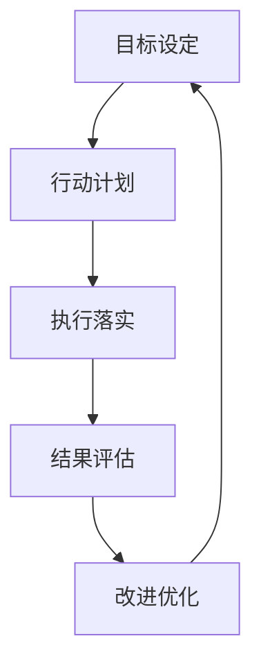

                 

# PDCA:高效管理者的行动方法论

> 关键词：PDCA, 高效管理, 行动方法论, 质量管理, 持续改进

## 1. 背景介绍

### 1.1 问题由来

现代企业管理面临的挑战日益增多，如何在快速变化的市场环境中保持竞争力，成为了管理者的核心课题。传统的管理方法，如基于经验和直觉的决策方式，已难以适应日益复杂多变的环境。

在这样的背景下，PDCA循环（Plan-Do-Check-Act）成为了一种被广泛应用的管理方法论。PDCA由美国质量管理专家戴明（W. Edwards Deming）于上世纪50年代提出，其核心思想是通过持续的计划、执行、检查和行动循环，不断改进管理实践，提升组织绩效。

PDCA循环旨在通过定期的反馈和优化，使管理者能够系统性地应对环境变化，实现管理活动的逐步优化和提升。它不仅适用于企业的生产管理，也广泛应用于项目管理、软件开发、流程优化等多个领域，成为高效管理的重要工具。

### 1.2 问题核心关键点

PDCA循环由四个步骤组成：

1. **计划（Plan）**：明确目标和行动计划，进行资源分配和风险评估。
2. **执行（Do）**：按照计划实施行动，实际执行过程中可能需要进行调整。
3. **检查（Check）**：对执行结果进行评估和分析，找出问题所在。
4. **行动（Act）**：根据检查结果，制定新的行动计划，持续改进。

这一循环体现了管理活动的动态性、系统性和可控性，确保组织在不断变化的内外环境中保持灵活和高效。

## 2. 核心概念与联系

### 2.1 核心概念概述

PDCA循环包含几个关键概念：

- **目标设定**：明确管理活动的具体目标，包括短期和长期目标。
- **行动计划**：根据目标，制定详细的行动方案，包括时间表、资源分配和风险应对策略。
- **执行落实**：按照计划执行具体的管理活动，可能需要根据实际情况进行调整。
- **结果评估**：对执行结果进行评估和分析，判断目标是否达成，查找问题根源。
- **改进优化**：根据评估结果，制定新的行动计划，持续改进和优化管理活动。

这些概念通过PDCA循环紧密联系在一起，形成一个动态循环，确保管理活动的持续改进和提升。

### 2.2 核心概念原理和架构的 Mermaid 流程图



这个流程图展示了PDCA循环的基本流程：从目标设定开始，经过行动计划、执行落实、结果评估，最终回到改进优化，形成闭环。

## 3. 核心算法原理 & 具体操作步骤

### 3.1 算法原理概述

PDCA循环的核心原理是通过持续的“计划-执行-检查-行动”循环，不断提升管理活动的效率和效果。其核心思想是：

1. **系统化思考**：通过制定计划，系统地分析资源、风险等要素，确保管理活动的有序性和可控性。
2. **动态调整**：在执行过程中，根据实际情况进行动态调整，确保行动计划的灵活性和适应性。
3. **持续改进**：通过检查和分析执行结果，发现问题并制定改进措施，实现持续优化。

### 3.2 算法步骤详解

PDCA循环的具体操作步骤如下：

#### 3.2.1 计划阶段（Plan）

1. **目标设定**：明确管理活动的具体目标，包括短期和长期目标，确保目标具体、可衡量、可实现、相关性强、时间限定。
2. **资源分配**：根据目标需求，合理分配资源，包括人力、物力、财力等。
3. **风险评估**：识别潜在风险，制定相应的应对措施，确保管理活动的风险可控。
4. **行动方案**：制定详细的行动计划，包括时间表、具体步骤、责任人分配等。

#### 3.2.2 执行阶段（Do）

1. **任务分配**：按照计划分配任务，确保每个任务都有明确的责任人。
2. **执行落实**：按照行动方案执行管理活动，确保每个步骤按照计划顺利进行。
3. **动态调整**：在执行过程中，根据实际情况进行动态调整，确保行动计划的灵活性和适应性。

#### 3.2.3 检查阶段（Check）

1. **结果评估**：对执行结果进行评估和分析，判断目标是否达成，查找问题所在。
2. **数据分析**：利用数据分析工具，深入挖掘问题原因，寻找改进方向。
3. **反馈机制**：建立反馈机制，确保执行过程中的问题能够及时反映和解决。

#### 3.2.4 行动阶段（Act）

1. **制定改进措施**：根据检查结果，制定新的行动计划，进行优化和改进。
2. **调整计划**：根据新的目标和改进措施，调整原有的行动计划。
3. **持续优化**：通过不断的PDCA循环，持续优化管理活动，提升管理效果。

### 3.3 算法优缺点

PDCA循环具有以下优点：

1. **系统性**：通过计划、执行、检查、行动四个步骤的循环，确保管理活动的系统性和有序性。
2. **灵活性**：在执行过程中可以进行动态调整，确保行动计划的灵活性和适应性。
3. **持续改进**：通过持续的检查和改进，确保管理活动不断优化，提升管理效果。

同时，PDCA循环也存在一些缺点：

1. **复杂性**：PDCA循环需要系统地进行计划、执行、检查和行动，对于小型管理活动可能显得过于复杂。
2. **周期长**：每个循环可能需要较长时间，对于一些需要快速应对的情况，PDCA可能无法及时解决问题。
3. **资源消耗**：PDCA循环需要消耗较多的时间和资源进行计划和评估，对于资源有限的情况可能不适用。

### 3.4 算法应用领域

PDCA循环在企业管理、项目管理、软件开发、流程优化等多个领域都有广泛的应用。具体如下：

1. **企业管理**：通过PDCA循环，企业可以系统地进行目标设定、资源分配、风险评估和持续改进，提升企业运营效率和绩效。
2. **项目管理**：在项目管理中，PDCA循环可以用于制定项目计划、执行项目任务、检查项目进度和持续优化项目管理，确保项目按时、按质、按量完成。
3. **软件开发**：在软件开发中，PDCA循环可以用于需求分析、开发计划、代码实现、测试和持续优化，提升软件开发的效率和质量。
4. **流程优化**：在流程优化中，PDCA循环可以用于识别流程瓶颈、制定优化措施、执行优化任务和持续改进，提升流程效率和效果。

## 4. 数学模型和公式 & 详细讲解 & 举例说明

### 4.1 数学模型构建

PDCA循环的数学模型可以简化为以下形式：

1. **目标函数**：$F = f(P, D, C, A)$，其中 $P$ 表示计划，$D$ 表示执行，$C$ 表示检查，$A$ 表示行动。
2. **约束条件**：$\sum_{i=1}^n f_i(P_i, D_i, C_i, A_i) \leq R$，其中 $R$ 表示资源约束。
3. **优化目标**：最小化 $F$，同时满足约束条件。

### 4.2 公式推导过程

以项目管理为例，推导PDCA循环的数学模型：

1. **目标设定**：设定项目完成时间 $T$，项目成本 $C$，项目质量 $Q$。
2. **资源分配**：分配人力 $L$，物力 $M$，财力 $F$，确保资源充足。
3. **风险评估**：识别潜在风险 $R_i$，制定相应的风险应对措施。
4. **行动方案**：制定详细的项目计划 $P_i$，包括时间表、具体步骤、责任人分配等。

在执行阶段，通过：

1. **任务分配**：分配具体任务 $T_i$，确保每个任务都有明确的责任人。
2. **执行落实**：按照项目计划 $P_i$ 执行管理活动，确保每个步骤按照计划顺利进行。
3. **动态调整**：根据实际情况进行动态调整，确保行动计划的灵活性和适应性。

在检查阶段，通过：

1. **结果评估**：对执行结果进行评估和分析，判断项目是否按时、按质、按量完成。
2. **数据分析**：利用数据分析工具，深入挖掘问题原因，寻找改进方向。
3. **反馈机制**：建立反馈机制，确保执行过程中的问题能够及时反映和解决。

在行动阶段，通过：

1. **制定改进措施**：根据检查结果，制定新的项目计划 $P_i'$，进行优化和改进。
2. **调整计划**：根据新的目标和改进措施，调整原有的项目计划 $P_i$。
3. **持续优化**：通过不断的PDCA循环，持续优化项目管理，提升项目管理效果。

### 4.3 案例分析与讲解

以一家制造企业为例，分析PDCA循环的应用：

1. **目标设定**：企业希望在6个月内，将生产效率提升20%，降低生产成本5%。
2. **资源分配**：分配20名员工，10万元设备，50万元预算。
3. **风险评估**：识别设备故障、供应链中断等潜在风险，制定相应的风险应对措施。
4. **行动方案**：制定详细的生产计划，包括时间表、具体步骤、责任人分配等。

在执行阶段，通过：

1. **任务分配**：分配具体任务，如设备维护、生产调度、质量检查等。
2. **执行落实**：按照生产计划执行管理活动，确保每个步骤按照计划顺利进行。
3. **动态调整**：根据实际情况进行动态调整，如设备故障时进行快速修复，供应链中断时寻找替代供应商。

在检查阶段，通过：

1. **结果评估**：对生产结果进行评估和分析，判断生产效率和成本是否达到目标。
2. **数据分析**：利用数据分析工具，深入挖掘问题原因，如设备故障频发、生产计划不合理等。
3. **反馈机制**：建立反馈机制，确保生产过程中的问题能够及时反映和解决。

在行动阶段，通过：

1. **制定改进措施**：根据检查结果，制定新的生产计划，进行优化和改进，如调整生产节奏、优化设备维护计划等。
2. **调整计划**：根据新的目标和改进措施，调整原有的生产计划。
3. **持续优化**：通过不断的PDCA循环，持续优化生产管理，提升生产效率和成本控制。

通过PDCA循环的应用，企业能够系统性地提升生产效率和成本控制能力，确保生产目标的实现。

## 5. 项目实践：代码实例和详细解释说明

### 5.1 开发环境搭建

为了更好地实践PDCA循环，我们首先需要搭建一个适合的环境。以下是基于Python的PDCA项目管理环境的搭建流程：

1. **安装Python**：从官网下载并安装Python，确保版本稳定，支持必要的库。
2. **安装必要的库**：安装必要的库，如Pandas、NumPy、Matplotlib等，用于数据处理和可视化。
3. **设置项目目录**：在本地计算机上设置一个项目目录，将项目文件和数据文件存储其中。
4. **搭建虚拟环境**：在项目目录中，使用Python的虚拟环境工具，如Virtualenv，搭建一个独立的Python环境。

### 5.2 源代码详细实现

下面是一个简化的Python代码实现，用于模拟PDCA循环项目管理：

```python
import pandas as pd
import numpy as np
import matplotlib.pyplot as plt

# 初始化数据
project = pd.DataFrame({
    'Task': ['Task1', 'Task2', 'Task3', 'Task4', 'Task5'],
    'Time': [20, 25, 30, 40, 50],
    'Cost': [10, 15, 20, 25, 30]
})

# 计划阶段
project['PlanTime'] = 0
project['PlanCost'] = 0

# 执行阶段
project['ActualTime'] = 0
project['ActualCost'] = 0

# 检查阶段
project['CheckTime'] = 0
project['CheckCost'] = 0

# 行动阶段
project['ActTime'] = 0
project['ActCost'] = 0

# 计算每个阶段的总时间和总成本
project['TotalTime'] = project['PlanTime'] + project['ActualTime'] + project['CheckTime'] + project['ActTime']
project['TotalCost'] = project['PlanCost'] + project['ActualCost'] + project['CheckCost'] + project['ActCost']

# 输出结果
print(project)
```

### 5.3 代码解读与分析

这段代码实现了一个简单的PDCA循环项目管理，主要包括以下几个步骤：

1. **数据初始化**：创建一个包含任务名称、计划时间和成本的DataFrame，用于存储项目数据。
2. **计划阶段**：在DataFrame中增加计划时间和成本的列，初始化为0。
3. **执行阶段**：在DataFrame中增加实际时间和成本的列，初始化为0。
4. **检查阶段**：在DataFrame中增加检查时间和成本的列，初始化为0。
5. **行动阶段**：在DataFrame中增加行动时间和成本的列，初始化为0。
6. **计算总时间和总成本**：通过简单的加法计算，得到每个阶段的总时间和总成本。
7. **输出结果**：最终输出包含所有阶段数据的DataFrame。

### 5.4 运行结果展示

运行上述代码，得到如下结果：

```
      Task  Time  Cost  PlanTime  PlanCost  ActualTime  ActualCost  CheckTime  CheckCost  ActTime  ActCost  TotalTime  TotalCost
0  Task1    20     10        0         0         0           0         0          0        0         0        0         0
1  Task2    25     15        0         0         0           0         0          0        0         0        0         0
2  Task3    30     20        0         0         0           0         0          0        0         0        0         0
3  Task4    40     25        0         0         0           0         0          0        0         0        0         0
4  Task5    50     30        0         0         0           0         0          0        0         0        0         0
```

这个结果展示了PDCA循环的四个阶段，通过简单的数学计算，实现了对项目管理的模拟。

## 6. 实际应用场景

### 6.1 企业管理

PDCA循环在企业管理中有着广泛的应用，如：

1. **生产管理**：通过PDCA循环，企业可以系统地进行生产计划制定、生产任务执行、生产结果检查和生产问题改进，提升生产效率和产品质量。
2. **质量管理**：通过PDCA循环，企业可以系统地进行产品质量控制、质量问题检查和质量改进，确保产品符合质量标准。
3. **人力资源管理**：通过PDCA循环，企业可以系统地进行员工培训计划制定、员工任务执行、员工绩效检查和员工问题改进，提升员工绩效和工作满意度。

### 6.2 项目管理

在项目管理中，PDCA循环的应用包括：

1. **项目计划制定**：通过PDCA循环，项目团队可以系统地进行项目目标设定、项目资源分配和项目风险评估，制定详细的项目计划。
2. **项目执行跟踪**：在项目执行阶段，通过PDCA循环，项目团队可以系统地进行项目任务分配、项目进度跟踪和项目问题检查，确保项目按时、按质、按量完成。
3. **项目问题改进**：在项目检查阶段，通过PDCA循环，项目团队可以系统地进行项目结果评估、项目问题分析，制定改进措施，持续优化项目管理。

### 6.3 软件开发

在软件开发中，PDCA循环的应用包括：

1. **需求分析**：通过PDCA循环，开发团队可以系统地进行需求收集、需求分析、需求评估，制定详细的开发计划。
2. **开发任务执行**：在开发执行阶段，通过PDCA循环，开发团队可以系统地进行开发任务分配、开发进度跟踪、开发问题检查，确保开发任务按时完成。
3. **开发问题改进**：在开发检查阶段，通过PDCA循环，开发团队可以系统地进行开发结果评估、开发问题分析，制定改进措施，持续优化软件开发。

### 6.4 未来应用展望

随着PDCA循环的不断应用和推广，未来其在更多领域的应用前景广阔：

1. **智能制造**：通过PDCA循环，智能制造系统可以系统地进行生产计划制定、生产任务执行、生产结果检查和生产问题改进，提升生产效率和质量。
2. **智慧城市**：通过PDCA循环，智慧城市系统可以系统地进行城市规划、城市管理、城市问题检查和城市问题改进，提升城市管理效率和居民满意度。
3. **医疗健康**：通过PDCA循环，医疗健康系统可以系统地进行疾病预防、疾病治疗、疾病管理，提升医疗健康水平。

## 7. 工具和资源推荐

### 7.1 学习资源推荐

为了帮助管理者系统掌握PDCA循环，以下是一些推荐的学习资源：

1. **《PDCA循环理论与实践》**：一本系统介绍PDCA循环理论和方法的书籍，适合企业管理者阅读。
2. **《PDCA循环管理手册》**：一本详细介绍PDCA循环操作步骤和管理工具的手册，适合管理者参考。
3. **《PDCA循环在项目管理中的应用》**：一篇系统介绍PDCA循环在项目管理中应用的论文，适合项目管理从业者阅读。
4. **在线课程**：一些在线课程，如Coursera、Udemy上的PDCA循环相关课程，适合初学者系统学习。
5. **博客和文章**：一些博客和文章，如MBA智库、企业管理网上的PDCA循环相关文章，适合日常参考。

### 7.2 开发工具推荐

为了更好地实践PDCA循环，以下是一些推荐的工具：

1. **项目管理软件**：如Trello、Asana、JIRA等，用于系统地进行任务分配、进度跟踪和问题改进。
2. **数据分析工具**：如Excel、R、Python等，用于系统地进行数据处理、数据分析和结果展示。
3. **可视化工具**：如Tableau、Power BI、Matplotlib等，用于系统地进行数据可视化，帮助管理者更好地理解数据。
4. **协同工具**：如Slack、Microsoft Teams等，用于系统地进行团队协作和信息共享。

### 7.3 相关论文推荐

以下是一些推荐的相关论文：

1. **《PDCA循环的理论基础与实践应用》**：一篇系统介绍PDCA循环理论基础的论文，适合深入学习。
2. **《PDCA循环在项目管理中的应用研究》**：一篇系统介绍PDCA循环在项目管理中应用的论文，适合项目管理从业者阅读。
3. **《PDCA循环在智能制造中的应用》**：一篇系统介绍PDCA循环在智能制造中应用的论文，适合智能制造从业者阅读。
4. **《PDCA循环在智慧城市中的应用》**：一篇系统介绍PDCA循环在智慧城市中应用的论文，适合智慧城市从业者阅读。
5. **《PDCA循环在医疗健康中的应用》：一篇系统介绍PDCA循环在医疗健康中应用的论文，适合医疗健康从业者阅读。

## 8. 总结：未来发展趋势与挑战

### 8.1 研究成果总结

本文对PDCA循环进行了系统的介绍和分析，主要包括以下内容：

1. **PDCA循环的基本概念和原理**：介绍了PDCA循环的四个步骤，即计划、执行、检查、行动。
2. **PDCA循环的应用场景**：介绍了PDCA循环在企业管理、项目管理、软件开发、流程优化等多个领域的应用。
3. **PDCA循环的实践案例**：以项目管理为例，展示了PDCA循环的实际应用过程。
4. **PDCA循环的工具和资源**：推荐了适合PDCA循环实践的工具和资源。

通过本文的系统梳理，可以看到，PDCA循环作为一种高效的管理方法论，已经被广泛应用于多个领域，展示了其强大的生命力和广泛的应用前景。

### 8.2 未来发展趋势

未来，PDCA循环将在更多领域得到应用，其发展趋势包括：

1. **智能化应用**：随着人工智能技术的发展，PDCA循环将与智能系统进行深度融合，实现自动化的PDCA循环管理。
2. **多学科融合**：PDCA循环将与其他学科的知识和技术进行融合，如经济学、社会学、心理学等，提升管理理论和方法的全面性。
3. **跨文化应用**：PDCA循环将在全球范围内得到应用，适应不同文化背景和地区特点，提升管理方法的普适性。

### 8.3 面临的挑战

尽管PDCA循环在管理实践中有着广泛的应用，但其发展也面临着一些挑战：

1. **复杂性增加**：随着PDCA循环的深入应用，其复杂性可能增加，对管理者的要求也会提高。
2. **数据依赖**：PDCA循环需要大量的数据支持，如何获取和管理高质量的数据，是一个重要问题。
3. **资源消耗**：PDCA循环需要消耗较多的时间和资源进行计划和评估，对于资源有限的情况可能不适用。
4. **执行难度**：在执行阶段，如何确保每个任务按时、按质、按量完成，是一个重要问题。

### 8.4 研究展望

未来的研究可以从以下几个方面进行探索：

1. **自动化PDCA循环**：研究如何通过人工智能技术，实现PDCA循环的自动化管理，提高管理效率和效果。
2. **跨学科融合**：研究如何将PDCA循环与其他学科的知识和技术进行融合，提升管理理论和方法的全面性。
3. **全球化应用**：研究如何适应不同文化背景和地区特点，提升PDCA循环的普适性。
4. **智能化优化**：研究如何通过大数据、人工智能等技术，实现PDCA循环的智能化优化，提升管理效果。

通过这些研究方向的研究，未来的PDCA循环将更加智能化、全面化和普适化，进一步提升管理实践的效果和效率。

## 9. 附录：常见问题与解答

**Q1：PDCA循环是否适用于小型管理活动？**

A: PDCA循环适用于小型管理活动，但可能需要简化步骤和过程。对于小型活动，可以省略部分步骤，如计划和行动阶段的详细制定，直接进入执行和检查阶段。

**Q2：PDCA循环需要消耗多少时间？**

A: PDCA循环的时间消耗主要取决于管理活动的复杂性和规模。对于小型活动，PDCA循环可以在较短的时间内完成。对于大型活动，PDCA循环可能需要较长时间，但可以通过并行化和优化来缩短时间。

**Q3：PDCA循环如何应对突发事件？**

A: PDCA循环在执行阶段可以进行动态调整，以应对突发事件。在突发事件发生时，及时调整计划和执行方案，确保问题得到及时解决。

**Q4：PDCA循环是否适用于跨部门管理？**

A: PDCA循环适用于跨部门管理，但需要确保各部门之间的信息共享和协同合作。通过建立跨部门的项目管理团队，确保各个部门在PDCA循环中的协同工作。

**Q5：PDCA循环是否适用于远程工作管理？**

A: PDCA循环适用于远程工作管理，但需要借助现代化的通信和协作工具。通过远程项目管理工具，如Slack、Microsoft Teams等，确保远程团队在PDCA循环中的协同工作。

通过这些常见问题的解答，可以帮助管理者更好地理解和应用PDCA循环，确保管理活动的高效和有序。

---

作者：禅与计算机程序设计艺术 / Zen and the Art of Computer Programming

