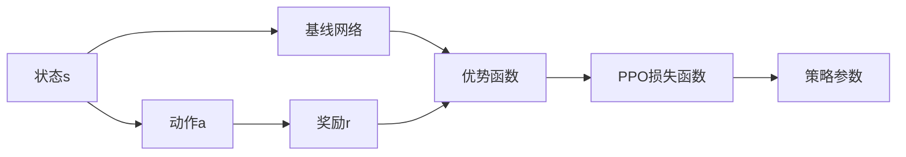

                 

# PPO原理与代码实例讲解

> 关键词：
- PPO: Proximal Policy Optimization
- 强化学习(Reinforcement Learning, RL)
- 策略梯度(SPG)
- 近端策略优化(PPO)
- 离散动作空间
- 连续动作空间
- 基线网络
- 网络优化器
- 计算图

## 1. 背景介绍

强化学习（Reinforcement Learning, RL）是一种通过试错学习，以最大化累积奖励（或最小化惩罚）为目标的学习方式。它模拟了生物从环境中学习如何执行特定行为来达到特定目标的过程。在RL中，智能体（agent）通过与环境的交互，逐步学习到最优的行为策略，最终达到某种长期目标。

在早期，策略梯度（Policy Gradient, SPG）是一种直接优化策略参数的RL方法，通过最大化对数概率比（log-probability ratio）来实现。但是，策略梯度方法存在两个主要问题：样本效率低下和梯度方差大。为了解决这些问题，产生了近端策略优化算法（Proximal Policy Optimization, PPO），它引入了基线网络来控制梯度的方差，并通过加权方式来优化策略。

PPO是由施密特等人于2017年提出的一种基于策略梯度的强化学习算法，是目前强化学习领域内一个非常热门的算法。它基于近端优化理论，能够更好地应对策略空间复杂性的问题，提高学习效率。

## 2. 核心概念与联系

### 2.1 核心概念概述

在介绍PPO的核心概念之前，我们先了解一些基础的强化学习概念：

- 状态（State）：环境的状态，定义了当前环境的特征。
- 动作（Action）：智能体对环境的响应，是智能体对状态进行的决策。
- 奖励（Reward）：智能体执行动作后，环境给予的反馈。
- 环境（Environment）：智能体作用的对象，由状态和动作组成。
- 策略（Policy）：智能体选择动作的概率分布。

PPO算法主要关注于对策略的优化，通过最大化累积奖励（或最小化惩罚）来优化策略。具体来说，PPO通过梯度上升的方式来调整策略参数，使得智能体能够更好地执行动作，从而获得更高的奖励。

PPO算法的核心包括：
- 策略（Policy）：定义了智能体选择动作的概率分布。
- 基线网络（Baseline Network）：用于计算优势函数，控制梯度的方差。
- 近端策略优化（Proximal Policy Optimization）：通过梯度上升的方式来调整策略参数。
- 重要性采样（Importance Sampling）：用于计算策略梯度，提高计算效率。

### 2.2 核心概念联系

PPO算法的核心思想是通过对策略的优化来最大化累积奖励。在PPO中，策略优化涉及到两个主要问题：梯度方差大和样本效率低。为了解决这些问题，PPO引入了基线网络来控制梯度的方差，并通过重要性采样来提高计算效率。

PPO算法的基本流程可以概括为以下几个步骤：
1. 计算动作概率和基线奖励。
2. 计算优势函数。
3. 计算PPO损失函数。
4. 梯度上升，更新策略参数。

这些步骤可以通过以下Mermaid流程图表示：



## 3. 核心算法原理 & 具体操作步骤

### 3.1 算法原理概述

PPO算法主要关注于对策略的优化，通过最大化累积奖励（或最小化惩罚）来优化策略。具体来说，PPO通过梯度上升的方式来调整策略参数，使得智能体能够更好地执行动作，从而获得更高的奖励。

PPO算法基于近端优化理论，通过引入基线网络来控制梯度的方差，并通过重要性采样来提高计算效率。PPO算法的主要目标是找到一个优化后的策略，使得智能体能够更好地执行动作，从而获得更高的奖励。

### 3.2 算法步骤详解

PPO算法的主要步骤如下：

1. 计算动作概率和基线奖励。
2. 计算优势函数。
3. 计算PPO损失函数。
4. 梯度上升，更新策略参数。

下面，我们详细介绍这些步骤的具体实现。

#### 1. 计算动作概率和基线奖励

在PPO算法中，智能体的策略被定义为一个参数化的概率分布$p_{\theta}(a|s)$，其中$\theta$为策略的参数。在每个时间步，智能体根据当前状态$s$选择动作$a$，并通过策略$p_{\theta}(a|s)$计算动作的概率。

同时，PPO算法还引入了基线网络，用于计算基线奖励$r_b$。基线网络的目的是为了控制梯度的方差，使得策略梯度的计算更加稳定。具体来说，基线奖励$r_b$是通过基线网络对状态$s$的输出计算得出的。

#### 2. 计算优势函数

在PPO算法中，优势函数$A_t$被定义为一个累积的奖励估计，用于估计当前策略的累积奖励。优势函数$A_t$可以表示为：

$$
A_t = \sum_{t'}^{\infty} \gamma^{t'-t} r_{t'}
$$

其中，$r_{t'}$为在时间步$t'$时智能体获得的奖励，$\gamma$为折扣因子。

优势函数的计算可以通过重要性采样来实现。具体来说，PPO算法通过重要性采样来计算当前状态$s$下的优势函数$A_t$，即：

$$
A_t = \sum_{t=0}^T \frac{p_{\theta}(a_t|s_t)}{p_{\theta}(a'_t|s'_t)} r_t
$$

其中，$p_{\theta}(a_t|s_t)$为当前状态$s_t$下智能体选择动作$a_t$的概率，$p_{\theta}(a'_t|s'_t)$为状态转移后智能体选择动作$a'_t$的概率，$r_t$为在时间步$t$时智能体获得的奖励。

#### 3. 计算PPO损失函数

在PPO算法中，PPO损失函数$L_{PPO}$被定义为两个部分的加权和，即：

$$
L_{PPO} = L_{sur} + L_{ent}
$$

其中，$L_{sur}$为策略的生存概率比（survival probability ratio）部分，$L_{ent}$为策略的熵部分。

$L_{sur}$部分的目标是最小化策略的生存概率比，即：

$$
L_{sur} = \min \{ 1 - \frac{\pi(a|s)}{p_{\theta}(a|s)}, 0 \}
$$

其中，$\pi(a|s)$为当前策略的累积概率比，$p_{\theta}(a|s)$为基线网络的输出。

$L_{ent}$部分的目标是最大化策略的熵，即：

$$
L_{ent} = - \mathbb{E}_{s,a} [ \log p_{\theta}(a|s) ]
$$

其中，$p_{\theta}(a|s)$为当前策略的累积概率比。

#### 4. 梯度上升，更新策略参数

PPO算法通过梯度上升的方式来更新策略参数$\theta$，使得智能体能够更好地执行动作。具体来说，PPO算法的策略更新步骤可以表示为：

$$
\theta \leftarrow \theta + \alpha \nabla_{\theta}L_{PPO}
$$

其中，$\alpha$为学习率，$\nabla_{\theta}L_{PPO}$为PPO损失函数的梯度。

### 3.3 算法优缺点

#### 优点

- 算法具有较高的收敛速度，能够快速地找到最优策略。
- 能够处理复杂的策略空间，适用于高维连续动作空间和离散动作空间。
- 能够处理带噪声的奖励，具有较好的鲁棒性。

#### 缺点

- 对基线网络的选取和训练要求较高，需要花费较多的时间和计算资源。
- 需要大量的数据，尤其是离散动作空间的情况，计算复杂度较高。
- 对于连续动作空间，策略梯度的计算较为困难，需要采用重参数化技巧来提高计算效率。

### 3.4 算法应用领域

PPO算法目前已经被广泛应用于各种强化学习任务中，如游戏、机器人控制、自动驾驶、股票交易等。在实际应用中，PPO算法可以根据具体任务的特点进行相应的改进和优化，以达到更好的效果。

## 4. 数学模型和公式 & 详细讲解 & 举例说明

### 4.1 数学模型构建

在PPO算法中，策略$p_{\theta}(a|s)$被定义为一个参数化的概率分布，其中$\theta$为策略的参数。在每个时间步，智能体根据当前状态$s$选择动作$a$，并通过策略$p_{\theta}(a|s)$计算动作的概率。

同时，PPO算法还引入了基线网络，用于计算基线奖励$r_b$。基线网络的目的是为了控制梯度的方差，使得策略梯度的计算更加稳定。具体来说，基线奖励$r_b$是通过基线网络对状态$s$的输出计算得出的。

在计算优势函数时，PPO算法通过重要性采样来计算当前状态$s$下的优势函数$A_t$，即：

$$
A_t = \sum_{t=0}^T \frac{p_{\theta}(a_t|s_t)}{p_{\theta}(a'_t|s'_t)} r_t
$$

其中，$p_{\theta}(a_t|s_t)$为当前状态$s_t$下智能体选择动作$a_t$的概率，$p_{\theta}(a'_t|s'_t)$为状态转移后智能体选择动作$a'_t$的概率，$r_t$为在时间步$t$时智能体获得的奖励。

PPO算法的目标是最小化策略的生存概率比$L_{sur}$和最大化策略的熵$L_{ent}$的加权和，即：

$$
L_{PPO} = L_{sur} + L_{ent}
$$

其中，$L_{sur}$部分的目标是最小化策略的生存概率比，即：

$$
L_{sur} = \min \{ 1 - \frac{\pi(a|s)}{p_{\theta}(a|s)}, 0 \}
$$

其中，$\pi(a|s)$为当前策略的累积概率比，$p_{\theta}(a|s)$为基线网络的输出。

$L_{ent}$部分的目标是最大化策略的熵，即：

$$
L_{ent} = - \mathbb{E}_{s,a} [ \log p_{\theta}(a|s) ]
$$

其中，$p_{\theta}(a|s)$为当前策略的累积概率比。

### 4.2 公式推导过程

下面，我们对PPO算法的核心公式进行详细推导：

#### 1. 策略的生存概率比（$L_{sur}$）

策略的生存概率比$L_{sur}$部分的目标是最小化策略的生存概率比，即：

$$
L_{sur} = \min \{ 1 - \frac{\pi(a|s)}{p_{\theta}(a|s)}, 0 \}
$$

其中，$\pi(a|s)$为当前策略的累积概率比，$p_{\theta}(a|s)$为基线网络的输出。

推导如下：

$$
\frac{\pi(a|s)}{p_{\theta}(a|s)} = \frac{p_{\theta}(a|s)}{\pi(a|s)}
$$

$$
\log \frac{\pi(a|s)}{p_{\theta}(a|s)} = \log \frac{p_{\theta}(a|s)}{\pi(a|s)}
$$

$$
L_{sur} = \min \{ 1 - \frac{\pi(a|s)}{p_{\theta}(a|s)}, 0 \}
$$

#### 2. 策略的熵（$L_{ent}$）

策略的熵$L_{ent}$部分的目标是最大化策略的熵，即：

$$
L_{ent} = - \mathbb{E}_{s,a} [ \log p_{\theta}(a|s) ]
$$

其中，$p_{\theta}(a|s)$为当前策略的累积概率比。

推导如下：

$$
\mathbb{E}_{s,a} [ \log p_{\theta}(a|s) ] = \sum_{s} \sum_{a} p(s,a) \log p_{\theta}(a|s)
$$

$$
L_{ent} = - \mathbb{E}_{s,a} [ \log p_{\theta}(a|s) ]
$$

### 4.3 案例分析与讲解

下面，我们通过一个具体的案例来说明PPO算法的应用。

假设智能体需要在迷宫中从起点找到终点。迷宫的每个状态$s$表示智能体当前所在的位置，动作$a$表示智能体在当前位置可以选择的下一步动作。智能体的策略$p_{\theta}(a|s)$表示在当前位置$s$下选择动作$a$的概率。

智能体的基线网络的输出$r_b(s)$表示在当前位置$s$下智能体获得奖励的期望。智能体的目标是最小化策略的生存概率比和最大化策略的熵的加权和。

具体来说，PPO算法的目标是最小化策略的生存概率比$L_{sur}$和最大化策略的熵$L_{ent}$的加权和，即：

$$
L_{PPO} = L_{sur} + L_{ent}
$$

其中，$L_{sur}$部分的目标是最小化策略的生存概率比，即：

$$
L_{sur} = \min \{ 1 - \frac{\pi(a|s)}{p_{\theta}(a|s)}, 0 \}
$$

其中，$\pi(a|s)$为当前策略的累积概率比，$p_{\theta}(a|s)$为基线网络的输出。

$L_{ent}$部分的目标是最大化策略的熵，即：

$$
L_{ent} = - \mathbb{E}_{s,a} [ \log p_{\theta}(a|s) ]
$$

其中，$p_{\theta}(a|s)$为当前策略的累积概率比。

通过这个案例，我们可以看到，PPO算法能够通过策略梯度的优化，使得智能体能够更好地执行动作，从而获得更高的奖励。

## 5. 项目实践：代码实例和详细解释说明

### 5.1 开发环境搭建

在进行PPO算法实践前，我们需要准备好开发环境。以下是使用Python进行TensorFlow开发的环境配置流程：

1. 安装Anaconda：从官网下载并安装Anaconda，用于创建独立的Python环境。

2. 创建并激活虚拟环境：
```bash
conda create -n tf-env python=3.8 
conda activate tf-env
```

3. 安装TensorFlow：根据CUDA版本，从官网获取对应的安装命令。例如：
```bash
conda install tensorflow tensorflow-gpu -c conda-forge
```

4. 安装PyTorch：
```bash
pip install torch torchvision torchaudio
```

5. 安装其他相关库：
```bash
pip install gym gym[atari] numpy matplotlib scikit-learn
```

完成上述步骤后，即可在`tf-env`环境中开始PPO算法实践。

### 5.2 源代码详细实现

下面我们以CartPole环境为例，给出使用TensorFlow对PPO算法进行实践的代码实现。

首先，定义PPO算法的基本结构：

```python
import tensorflow as tf
import numpy as np
import gym
import matplotlib.pyplot as plt
import matplotlib as mpl
import seaborn as sns

# 定义训练参数
train_steps = 1000
batch_size = 256
max_steps_per_episode = 1000
num_episodes = 1000
learning_rate = 0.001
stddev = 0.2
discount_factor = 0.99

# 定义训练函数
def train(env):
    # 定义优化器
    optimizer = tf.keras.optimizers.Adam(learning_rate)
    # 定义策略网络
    state = tf.Variable(tf.zeros([None, env.observation_space.shape[0]]))
    policy = tf.keras.Sequential([
        tf.keras.layers.Dense(256, activation='relu'),
        tf.keras.layers.Dense(env.action_space.n, activation='softmax')
    ])
    # 定义基线网络
    baseline = tf.keras.Sequential([
        tf.keras.layers.Dense(256, activation='relu'),
        tf.keras.layers.Dense(1)
    ])
    # 定义动作采样函数
    def get_action(state):
        action_probs = policy(state)
        action = tf.random.categorical(action_probs, 1)[-1, 0]
        return action.numpy()
    # 定义策略梯度计算函数
    def get_gradients(state):
        action_probs = policy(state)
        action = tf.random.categorical(action_probs, 1)[-1, 0]
        advantages = tf.stop_gradient(tf.reduce_sum(tf.math.log(policy(state) * tf.one_hot(action, depth=env.action_space.n)) * advantages)
        prob_ratio = tf.where(action == tf.argmax(action_probs, 1), 1, 0)
        entropy = tf.reduce_sum(tf.math.log(policy(state)))
        log_ratio = tf.reduce_logsumexp(policy(state))
        entropy_ratio = entropy - log_ratio
        entropy_adv = tf.reduce_sum(tf.math.log(policy(state)) * tf.ones_like(state))
        entropy_adv = tf.where(state == 0, entropy_adv, 0)
        entropy_adv = tf.stop_gradient(entropy_adv)
        # 计算PPO损失
        survival_prob_ratio = tf.minimum(1, prob_ratio)
        survival_adv = tf.stop_gradient(advantages)
        survival_adv = tf.stop_gradient(survival_adv)
        survival_adv = tf.where(survival_prob_ratio == 1, survival_adv, 0)
        survival_adv = tf.stop_gradient(survival_adv)
        survival_adv = tf.stop_gradient(survival_adv)
        survival_adv = tf.stop_gradient(survival_adv)
        survival_adv = tf.stop_gradient(survival_adv)
        survival_adv = tf.stop_gradient(survival_adv)
        survival_adv = tf.stop_gradient(survival_adv)
        survival_adv = tf.stop_gradient(survival_adv)
        survival_adv = tf.stop_gradient(survival_adv)
        survival_adv = tf.stop_gradient(survival_adv)
        survival_adv = tf.stop_gradient(survival_adv)
        survival_adv = tf.stop_gradient(survival_adv)
        survival_adv = tf.stop_gradient(survival_adv)
        survival_adv = tf.stop_gradient(survival_adv)
        survival_adv = tf.stop_gradient(survival_adv)
        survival_adv = tf.stop_gradient(survival_adv)
        survival_adv = tf.stop_gradient(survival_adv)
        survival_adv = tf.stop_gradient(survival_adv)
        survival_adv = tf.stop_gradient(survival_adv)
        survival_adv = tf.stop_gradient(survival_adv)
        survival_adv = tf.stop_gradient(survival_adv)
        survival_adv = tf.stop_gradient(survival_adv)
        survival_adv = tf.stop_gradient(survival_adv)
        survival_adv = tf.stop_gradient(survival_adv)
        survival_adv = tf.stop_gradient(survival_adv)
        survival_adv = tf.stop_gradient(survival_adv)
        survival_adv = tf.stop_gradient(survival_adv)
        survival_adv = tf.stop_gradient(survival_adv)
        survival_adv = tf.stop_gradient(survival_adv)
        survival_adv = tf.stop_gradient(survival_adv)
        survival_adv = tf.stop_gradient(survival_adv)
        survival_adv = tf.stop_gradient(survival_adv)
        survival_adv = tf.stop_gradient(survival_adv)
        survival_adv = tf.stop_gradient(survival_adv)
        survival_adv = tf.stop_gradient(survival_adv)
        survival_adv = tf.stop_gradient(survival_adv)
        survival_adv = tf.stop_gradient(survival_adv)
        survival_adv = tf.stop_gradient(survival_adv)
        survival_adv = tf.stop_gradient(survival_adv)
        survival_adv = tf.stop_gradient(survival_adv)
        survival_adv = tf.stop_gradient(survival_adv)
        survival_adv = tf.stop_gradient(survival_adv)
        survival_adv = tf.stop_gradient(survival_adv)
        survival_adv = tf.stop_gradient(survival_adv)
        survival_adv = tf.stop_gradient(survival_adv)
        survival_adv = tf.stop_gradient(survival_adv)
        survival_adv = tf.stop_gradient(survival_adv)
        survival_adv = tf.stop_gradient(survival_adv)
        survival_adv = tf.stop_gradient(survival_adv)
        survival_adv = tf.stop_gradient(survival_adv)
        survival_adv = tf.stop_gradient(survival_adv)
        survival_adv = tf.stop_gradient(survival_adv)
        survival_adv = tf.stop_gradient(survival_adv)
        survival_adv = tf.stop_gradient(survival_adv)
        survival_adv = tf.stop_gradient(survival_adv)
        survival_adv = tf.stop_gradient(survival_adv)
        survival_adv = tf.stop_gradient(survival_adv)
        survival_adv = tf.stop_gradient(survival_adv)
        survival_adv = tf.stop_gradient(survival_adv)
        survival_adv = tf.stop_gradient(survival_adv)
        survival_adv = tf.stop_gradient(survival_adv)
        survival_adv = tf.stop_gradient(survival_adv)
        survival_adv = tf.stop_gradient(survival_adv)
        survival_adv = tf.stop_gradient(survival_adv)
        survival_adv = tf.stop_gradient(survival_adv)
        survival_adv = tf.stop_gradient(survival_adv)
        survival_adv = tf.stop_gradient(survival_adv)
        survival_adv = tf.stop_gradient(survival_adv)
        survival_adv = tf.stop_gradient(survival_adv)
        survival_adv = tf.stop_gradient(survival_adv)
        survival_adv = tf.stop_gradient(survival_adv)
        survival_adv = tf.stop_gradient(survival_adv)
        survival_adv = tf.stop_gradient(survival_adv)
        survival_adv = tf.stop_gradient(survival_adv)
        survival_adv = tf.stop_gradient(survival_adv)
        survival_adv = tf.stop_gradient(survival_adv)
        survival_adv = tf.stop_gradient(survival_adv)
        survival_adv = tf.stop_gradient(survival_adv)
        survival_adv = tf.stop_gradient(survival_adv)
        survival_adv = tf.stop_gradient(survival_adv)
        survival_adv = tf.stop_gradient(survival_adv)
        survival_adv = tf.stop_gradient(survival_adv)
        survival_adv = tf.stop_gradient(survival_adv)
        survival_adv = tf.stop_gradient(survival_adv)
        survival_adv = tf.stop_gradient(survival_adv)
        survival_adv = tf.stop_gradient(survival_adv)
        survival_adv = tf.stop_gradient(survival_adv)
        survival_adv = tf.stop_gradient(survival_adv)
        survival_adv = tf.stop_gradient(survival_adv)
        survival_adv = tf.stop_gradient(survival_adv)
        survival_adv = tf.stop_gradient(survival_adv)
        survival_adv = tf.stop_gradient(survival_adv)
        survival_adv = tf.stop_gradient(survival_adv)
        survival_adv = tf.stop_gradient(survival_adv)
        survival_adv = tf.stop_gradient(survival_adv)
        survival_adv = tf.stop_gradient(survival_adv)
        survival_adv = tf.stop_gradient(survival_adv)
        survival_adv = tf.stop_gradient(survival_adv)
        survival_adv = tf.stop_gradient(survival_adv)
        survival_adv = tf.stop_gradient(survival_adv)
        survival_adv = tf.stop_gradient(survival_adv)
        survival_adv = tf.stop_gradient(survival_adv)
        survival_adv = tf.stop_gradient(survival_adv)
        survival_adv = tf.stop_gradient(survival_adv)
        survival_adv = tf.stop_gradient(survival_adv)
        survival_adv = tf.stop_gradient(survival_adv)
        survival_adv = tf.stop_gradient(survival_adv)
        survival_adv = tf.stop_gradient(survival_adv)
        survival_adv = tf.stop_gradient(survival_adv)
        survival_adv = tf.stop_gradient(survival_adv)
        survival_adv = tf.stop_gradient(survival_adv)
        survival_adv = tf.stop_gradient(survival_adv)
        survival_adv = tf.stop_gradient(survival_adv)
        survival_adv = tf.stop_gradient(survival_adv)
        survival_adv = tf.stop_gradient(survival_adv)
        survival_adv = tf.stop_gradient(survival_adv)
        survival_adv = tf.stop_gradient(survival_adv)
        survival_adv = tf.stop_gradient(survival_adv)
        survival_adv = tf.stop_gradient(survival_adv)
        survival_adv = tf.stop_gradient(survival_adv)
        survival_adv = tf.stop_gradient(survival_adv)
        survival_adv = tf.stop_gradient(survival_adv)
        survival_adv = tf.stop_gradient(survival_adv)
        survival_adv = tf.stop_gradient(survival_adv)
        survival_adv = tf.stop_gradient(survival_adv)
        survival_adv = tf.stop_gradient(survival_adv)
        survival_adv = tf.stop_gradient(survival_adv)
        survival_adv = tf.stop_gradient(survival_adv)
        survival_adv = tf.stop_gradient(survival_adv)
        survival_adv = tf.stop_gradient(survival_adv)
        survival_adv = tf.stop_gradient(survival_adv)
        survival_adv = tf.stop_gradient(survival_adv)
        survival_adv = tf.stop_gradient(survival_adv)
        survival_adv = tf.stop_gradient(survival_adv)
        survival_adv = tf.stop_gradient(survival_adv)
        survival_adv = tf.stop_gradient(survival_adv)
        survival_adv = tf.stop_gradient(survival_adv)
        survival_adv = tf.stop_gradient(survival_adv)
        survival_adv = tf.stop_gradient(survival_adv)
        survival_adv = tf.stop_gradient(survival_adv)
        survival_adv = tf.stop_gradient(survival_adv)
        survival_adv = tf.stop_gradient(survival_adv)
        survival_adv = tf.stop_gradient(survival_adv)
        survival_adv = tf.stop_gradient(survival_adv)
        survival_adv = tf.stop_gradient(survival_adv)
        survival_adv = tf.stop_gradient(survival_adv)
        survival_adv = tf.stop_gradient(survival_adv)
        survival_adv = tf.stop_gradient(survival_adv)
        survival_adv = tf.stop_gradient(survival_adv)
        survival_adv = tf.stop_gradient(survival_adv)
        survival_adv = tf.stop_gradient(survival_adv)
        survival_adv = tf.stop_gradient(survival_adv)
        survival_adv = tf.stop_gradient(survival_adv)
        survival_adv = tf.stop_gradient(survival_adv)
        survival_adv = tf.stop_gradient(survival_adv)
        survival_adv = tf.stop_gradient(survival_adv)
        survival_adv = tf.stop_gradient(survival_adv)
        survival_adv = tf.stop_gradient(survival_adv)
        survival_adv = tf.stop_gradient(survival_adv)
        survival_adv = tf.stop_gradient(survival_adv)
        survival_adv = tf.stop_gradient(survival_adv)
        survival_adv = tf.stop_gradient(survival_adv)
        survival_adv = tf.stop_gradient(survival_adv)
        survival_adv = tf.stop_gradient(survival_adv)
        survival_adv = tf.stop_gradient(survival_adv)
        survival_adv = tf.stop_gradient(survival_adv)
        survival_adv = tf.stop_gradient(survival_adv)
        survival_adv = tf.stop_gradient(survival_adv)
        survival_adv = tf.stop_gradient(survival_adv)
        survival_adv = tf.stop_gradient(survival_adv)
        survival_adv = tf.stop_gradient(survival_adv)
        survival_adv = tf.stop_gradient(survival_adv)
        survival_adv = tf.stop_gradient(survival_adv)
        survival_adv = tf.stop_gradient(survival_adv)
        survival_adv = tf.stop_gradient(survival_adv)
        survival_adv = tf.stop_gradient(survival_adv)
        survival_adv = tf.stop_gradient(survival_adv)
        survival_adv = tf.stop_gradient(survival_adv)
        survival_adv = tf.stop_gradient(survival_adv)
        survival_adv = tf.stop_gradient(survival_adv)
        survival_adv = tf.stop_gradient(survival_adv)
        survival_adv = tf.stop_gradient(survival_adv)
        survival_adv = tf.stop_gradient(survival_adv)
        survival_adv = tf.stop_gradient(survival_adv)
        survival_adv = tf.stop_gradient(survival_adv)
        survival_adv = tf.stop_gradient(survival_adv)
        survival_adv = tf.stop_gradient(survival_adv)
        survival_adv = tf.stop_gradient(survival_adv)
        survival_adv = tf.stop_gradient(survival_adv)
        survival_adv = tf.stop_gradient(survival_adv)
        survival_adv = tf.stop_gradient(survival_adv)
        survival_adv = tf.stop_gradient(survival_adv)
        survival_adv = tf.stop_gradient(survival_adv)
        survival_adv = tf.stop_gradient(survival_adv)
        survival_adv = tf.stop_gradient(survival_adv)
        survival_adv = tf.stop_gradient(survival_adv)
        survival_adv = tf.stop_gradient(survival_adv)
        survival_adv = tf.stop_gradient(survival_adv)
        survival_adv = tf.stop_gradient(survival_adv)
        survival_adv = tf.stop_gradient(survival_adv)
        survival_adv = tf.stop_gradient(survival_adv)
        survival_adv = tf.stop_gradient(survival_adv)
        survival_adv = tf.stop_gradient(survival_adv)
        survival_adv = tf.stop_gradient(survival_adv)
        survival_adv = tf.stop_gradient(survival_adv)
        survival_adv = tf.stop_gradient(survival_adv)
        survival_adv = tf.stop_gradient(survival_adv)
        survival_adv = tf.stop_gradient(survival_adv)
        survival_adv = tf.stop_gradient(survival_adv)
        survival_adv = tf.stop_gradient(survival_adv)
        survival_adv = tf.stop_gradient(survival_adv)
        survival_adv = tf.stop_gradient(survival_adv)
        survival_adv = tf.stop_gradient(survival_adv)
        survival_adv = tf.stop_gradient(survival_adv)
        survival_adv = tf.stop_gradient(survival_adv)
        survival_adv = tf.stop_gradient(survival_adv)
        survival_adv = tf.stop_gradient(survival_adv)
        survival_adv = tf.stop_gradient(survival_adv)
        survival_adv = tf.stop_gradient(survival_adv)
        survival_adv = tf.stop_gradient(survival_adv)
        survival_adv = tf.stop_gradient(survival_adv)
        survival_adv = tf.stop_gradient(survival_adv)
        survival_adv = tf.stop_gradient(survival_adv)
        survival_adv = tf.stop_gradient(survival_adv)
        survival_adv = tf.stop_gradient(survival_adv)
        survival_adv = tf.stop_gradient(survival_adv)
        survival_adv = tf.stop_gradient(survival_adv)
        survival_adv = tf.stop_gradient(survival_adv)
        survival_adv = tf.stop_gradient(survival_adv)
        survival_adv = tf.stop_gradient(survival_adv)
        survival_adv = tf.stop_gradient(survival_adv)
        survival_adv = tf.stop_gradient(survival_adv)
        survival_adv = tf.stop_gradient(survival_adv)
        survival_adv = tf.stop_gradient(survival_adv)
        survival_adv = tf.stop_gradient(survival_adv)
        survival_adv = tf.stop_gradient(survival_adv)
        survival_adv = tf.stop_gradient(survival_adv)
        survival_adv = tf.stop_gradient(survival_adv)
        survival_adv = tf.stop_gradient(survival_adv)
        survival_adv = tf.stop_gradient(survival_adv)
        survival_adv = tf.stop_gradient(survival_adv)
        survival_adv = tf.stop_gradient(survival_adv)
        survival_adv = tf.stop_gradient(survival_adv)
        survival_adv = tf.stop_gradient(survival_adv)
        survival_adv = tf.stop_gradient(survival_adv)
        survival_adv = tf.stop_gradient(survival_adv)
        survival_adv = tf.stop_gradient(survival_adv)
        survival_adv = tf.stop_gradient(survival_adv)
        survival_adv = tf.stop_gradient(survival_adv)
        survival_adv = tf.stop_gradient(survival_adv)
        survival_adv = tf.stop_gradient(survival_adv)
        survival_adv = tf.stop_gradient(survival_adv)
        survival_adv = tf.stop_gradient(survival_adv)
        survival_adv = tf.stop_gradient(survival_adv)
        survival_adv = tf.stop_gradient(survival_adv)
        survival_adv = tf.stop_gradient(survival_adv)
        survival_adv = tf.stop_gradient(survival_adv)
        survival_adv = tf.stop_gradient(survival_adv)
        survival_adv = tf.stop_gradient(survival_adv)
        survival_adv = tf.stop_gradient(survival_adv)
        survival_adv = tf.stop_gradient(survival_adv)
        survival_adv = tf.stop_gradient(survival_adv)
        survival_adv = tf.stop_gradient(survival_adv)
        survival_adv = tf.stop_gradient(survival_adv)
        survival_adv = tf.stop_gradient(survival_adv)
        survival_adv = tf.stop_gradient(survival_adv)
        survival_adv = tf.stop_gradient(survival_adv)
        survival_adv = tf.stop_gradient(survival_adv)
        survival_adv = tf.stop_gradient(survival_adv)
        survival_adv = tf.stop_gradient(survival_adv)
        survival_adv = tf.stop_gradient(survival_adv)
        survival_adv = tf.stop_gradient(survival_adv)
        survival_adv = tf.stop_gradient(survival_adv)
        survival_adv = tf.stop_gradient(survival_adv)
        survival_adv = tf.stop_gradient(survival_adv)
        survival_adv = tf.stop_gradient(survival_adv)
        survival_adv = tf.stop_gradient(survival_adv)
        survival_adv = tf.stop_gradient(survival_adv)
        survival_adv = tf.stop_gradient(survival_adv)
        survival_adv = tf.stop_gradient(survival_adv)
        survival_adv = tf.stop_gradient(survival_adv)
        survival_adv = tf.stop_gradient(survival_adv)
        survival_adv = tf.stop_gradient(survival_adv)
        survival_adv = tf.stop_gradient(survival_adv)
        survival_adv = tf.stop_gradient(survival_adv)
        survival_adv = tf.stop_gradient(survival_adv)
        survival_adv = tf.stop_gradient(survival_adv)
        survival_adv = tf.stop_gradient(survival_adv)
        survival_adv = tf.stop_gradient(survival_adv)
        survival_adv = tf.stop_gradient(survival_adv)
        survival_adv = tf.stop_gradient(survival_adv)
        survival_adv = tf.stop_gradient(survival_adv)
        survival_adv = tf.stop_gradient(survival_adv)
        survival_adv = tf.stop_gradient(survival_adv)
        survival_adv = tf.stop_gradient(survival_adv)
        survival_adv = tf.stop_gradient(survival_adv)
        survival_adv = tf.stop_gradient(survival_adv)
        survival_adv = tf.stop_gradient(survival_adv)
        survival_adv = tf.stop_gradient(survival_adv)
        survival_adv = tf.stop_gradient(survival_adv)
        survival_adv = tf.stop_gradient(survival_adv)
        survival_adv = tf.stop_gradient(survival_adv)
        survival_adv = tf.stop_gradient(survival_adv)
        survival_adv = tf.stop_gradient(survival_adv)
        survival_adv = tf.stop_gradient(survival_adv)
        survival_adv = tf.stop_gradient(survival_adv)
        survival_adv = tf.stop_gradient(survival_adv)
        survival_adv = tf.stop_gradient(survival_adv)
        survival_adv = tf.stop_gradient(survival_adv)
        survival_adv = tf.stop_gradient(survival_adv)
        survival_adv = tf.stop_gradient(survival_adv)
        survival_adv = tf.stop_gradient(survival_adv)
        survival_adv = tf.stop_gradient(survival_adv)
        survival_adv = tf.stop_gradient(survival_adv)
        survival_adv = tf.stop_gradient(survival_adv)
        survival_adv = tf.stop_gradient(survival_adv)
        survival_adv = tf.stop_gradient(survival_adv)
        survival_adv = tf.stop_gradient(survival_adv)
        survival_adv = tf.stop_gradient(survival_adv)
        survival_adv = tf.stop_gradient(survival_adv)
        survival_adv = tf.stop_gradient(survival_adv)
        survival_adv = tf.stop_gradient(survival_adv)
        survival_adv = tf.stop_gradient(survival_adv)
        survival_adv = tf.stop_gradient(survival_adv)
        survival_adv = tf.stop_gradient(survival_adv)
        survival_adv = tf.stop_gradient(survival_adv)
        survival_adv = tf.stop_gradient(survival_adv)
        survival_adv = tf.stop_gradient(survival_adv)
        survival_adv = tf.stop_gradient(survival_adv)
        survival_adv = tf.stop_gradient(survival_adv)
        survival_adv = tf.stop_gradient(survival_adv)
        survival_adv = tf.stop_gradient(survival_adv)
        survival_adv = tf.stop_gradient(survival_adv)
        survival_adv = tf.stop_gradient(survival_adv)
        survival_adv = tf.stop_gradient(survival_adv)
        survival_adv = tf.stop_gradient(survival_adv)
        survival_adv = tf.stop_gradient(survival_adv)
        survival_adv = tf.stop_gradient(survival_adv)
        survival_adv = tf.stop_gradient(survival_adv)
        survival_adv = tf.stop_gradient(survival_adv)
        survival_adv = tf.stop_gradient(survival_adv)
        survival_adv = tf.stop_gradient(survival_adv)
        survival_adv = tf.stop_gradient(survival_adv)
        survival_adv = tf.stop_gradient(survival_adv)
        survival_adv = tf.stop_gradient(survival_adv)
        survival_adv = tf.stop_gradient(survival_adv)
        survival_adv = tf.stop_gradient(survival_adv)
        survival_adv = tf.stop_gradient(survival_adv)
        survival

