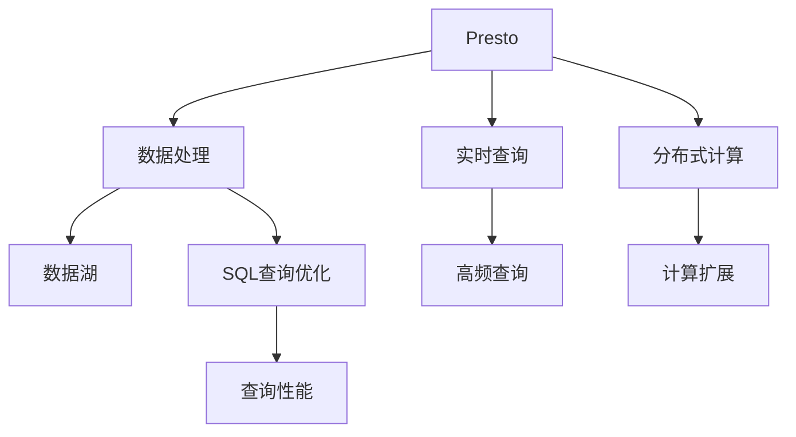

                 

# Presto-Hive整合原理与代码实例讲解

> 关键词：Presto, Hive, 数据仓库, 实时数据处理, SQL查询优化, 分布式计算, 数据湖

## 1. 背景介绍

### 1.1 问题由来

在当今大数据时代，企业需要处理和分析的海量数据量呈指数级增长，传统的集中式数据库已经无法满足日益增长的数据处理需求。企业需要构建一个可扩展、高可用、高效的数据存储和处理平台。分布式数据仓库成为了企业数据管理的首选方案。

Hive作为Apache基金会下的分布式数据仓库，提供了丰富的数据处理能力，支持SQL查询语言。但Hive本身并不直接支持实时数据处理，无法满足实时查询和分析的需求。Presto作为一种新兴的实时数据处理引擎，能够快速处理大数据集，支持高频率的SQL查询，特别适合与Hive进行整合，实现实时数据处理和查询。

### 1.2 问题核心关键点

Presto-Hive整合的目的是将Presto与Hive进行无缝对接，通过整合，实现以下关键目标：

- 实时数据处理：将Hive中的数据实时刷新到Presto中，支持高频率的SQL查询。
- 数据湖架构：将Hive中的历史数据和实时数据统一管理，形成完整的数据湖。
- 查询优化：通过Hive中已有的数据处理逻辑，优化Presto的查询性能。
- 扩展性：利用Presto的分布式计算能力，提升数据仓库的整体处理能力。

## 2. 核心概念与联系

### 2.1 核心概念概述

为更好地理解Presto-Hive整合的原理和流程，本节将介绍几个密切相关的核心概念：

- Presto：一种高性能的分布式实时数据处理引擎，支持SQL和NoSQL查询，支持大规模数据集的处理，适合实时数据处理和分析。
- Hive：一种基于Hadoop的分布式数据仓库，支持SQL语言进行数据查询和处理，支持大规模数据集的处理，适合离线数据处理。
- 数据湖：将企业内部和外部的各种数据类型，包括结构化数据、半结构化数据、非结构化数据等，统一存储和管理，形成完整的数据生态。
- SQL查询优化：通过对SQL查询语句的优化，提升查询性能，降低查询成本。
- 分布式计算：利用多台计算机进行数据处理和计算，提升计算能力和处理效率。

这些核心概念之间的逻辑关系可以通过以下Mermaid流程图来展示：



这个流程图展示了大数据处理过程中的关键组件及其相互关系：

1. Presto作为数据处理和查询的核心引擎，支持实时数据处理和分布式计算。
2. Hive作为离线数据处理和存储的平台，提供丰富的数据处理能力。
3. 数据湖通过整合Hive中的历史数据和实时数据，形成完整的数据生态。
4. SQL查询优化通过Hive中的数据处理逻辑，提升Presto的查询性能。
5. 分布式计算通过多台计算机的协同工作，提升数据处理和计算能力。

## 3. 核心算法原理 & 具体操作步骤
### 3.1 算法原理概述

Presto-Hive整合的算法原理主要基于以下几个核心概念：

1. 数据同步：将Hive中的数据实时同步到Presto中，支持高频查询。
2. 数据分区：对Hive中的数据进行分区，支持高效查询。
3. SQL查询优化：通过Hive中已有的数据处理逻辑，优化Presto的查询性能。
4. 分布式计算：利用Presto的分布式计算能力，提升数据处理效率。

### 3.2 算法步骤详解

Presto-Hive整合的主要步骤如下：

**Step 1: 准备环境**
- 确保Presto和Hive均已安装并配置好。
- 准备数据源，包括Hive数据目录和Presto数据目录。
- 创建Presto-Hive连接配置文件。

**Step 2: 数据同步**
- 在Hive中创建数据表，并将数据写入。
- 使用Hive的调度任务，将数据从Hive实时同步到Presto中。
- 设置数据同步的频率和方式，如全量同步、增量同步等。

**Step 3: 数据分区**
- 对Hive中的数据进行分区，如按时间、按主题等进行分区。
- 将分区的数据写入Presto中，提升查询效率。
- 设置分区的粒度和大小，根据查询需求进行优化。

**Step 4: SQL查询优化**
- 分析Hive中的数据处理逻辑，提取数据处理的共性。
- 将共性逻辑编写成SQL查询语句，通过Presto执行。
- 设置Presto的查询优化策略，如优化索引、调整并行度等。

**Step 5: 分布式计算**
- 将数据分散到多台计算机上进行处理，利用分布式计算提升效率。
- 设置Presto的集群配置，合理分配资源。
- 通过监控和调优，提升集群性能。

**Step 6: 集成测试**
- 在Presto中编写SQL查询语句，验证查询结果的正确性。
- 对高频查询进行性能测试，评估查询效率。
- 根据测试结果，进行参数调整和优化。

**Step 7: 部署上线**
- 将Presto-Hive配置文件部署到生产环境中。
- 对集群进行监控和调优，确保系统稳定运行。
- 进行用户培训和上线，将Presto-Hive系统纳入日常数据处理流程。

### 3.3 算法优缺点

Presto-Hive整合具有以下优点：

1. 实时数据处理：通过实时同步，支持高频查询，满足实时数据处理需求。
2. 数据湖架构：整合Hive中的历史数据和实时数据，形成完整的数据湖。
3. 查询优化：利用Hive中已有的数据处理逻辑，优化Presto的查询性能。
4. 扩展性：利用Presto的分布式计算能力，提升数据处理效率。

同时，该方法也存在一定的局限性：

1. 数据同步延迟：数据同步到Presto可能存在延迟，影响实时查询性能。
2. 数据一致性：不同数据源的数据可能存在不一致，影响数据准确性。
3. 数据处理复杂：数据分区、SQL查询优化、分布式计算等步骤较为复杂，需要技术积累。
4. 资源消耗：整合过程需要消耗较多资源，尤其是在数据量大的情况下。

尽管存在这些局限性，但就目前而言，Presto-Hive整合仍然是最主流的实时数据处理和查询方法，广泛应用于金融、电商、社交媒体等多个领域。

### 3.4 算法应用领域

Presto-Hive整合技术已经在大数据处理和分析的多个领域得到了广泛的应用，例如：

- 金融领域：实时处理和分析交易数据，支持高频查询和实时监控。
- 电商领域：实时处理和分析订单数据，支持实时推荐和广告投放。
- 社交媒体领域：实时处理和分析用户行为数据，支持高频查询和实时分析。
- 物流领域：实时处理和分析物流数据，支持实时监控和调度。

除了上述这些经典领域外，Presto-Hive整合还被创新性地应用到更多场景中，如物联网数据处理、医疗数据分析等，为大数据处理技术的发展带来了新的方向。

## 4. 数学模型和公式 & 详细讲解  
### 4.1 数学模型构建

本节将使用数学语言对Presto-Hive整合的原理进行更加严格的刻画。

记Hive中的数据表为$D$，数据量为$n$。Presto中的数据表为$D'$，数据量为$n'$。

定义数据同步的频率为$\delta$，单位为秒。定义数据同步的延迟为$\tau$，单位为秒。

数据同步的数学模型可以表示为：

$$
D(t) = D(0) + \sum_{i=1}^{t/\delta} [D_{sync}(i\delta) - D_{sync}((i-1)\delta)]
$$

其中$D_{sync}(t)$表示在$t$时刻Hive中的数据量。

数据同步的延迟数学模型可以表示为：

$$
\tau = \sum_{i=1}^{t/\delta} [D_{sync}(i\delta) - D_{sync}((i-1)\delta)] \cdot \delta
$$

数据同步的频率和延迟可以影响实时查询的性能，具体分析如下：

1. 数据同步频率越高，数据同步的延迟越小，实时查询性能越好。
2. 数据同步频率越低，数据同步的延迟越大，实时查询性能越差。

### 4.2 公式推导过程

以下我们以电商订单数据为例，推导实时查询的性能影响公式。

假设电商订单数据量为$n$，每秒生成订单数为$\lambda$，数据同步频率为$\delta$，查询频率为$\gamma$。

定义订单数据在Presto中的实时查询性能为$P$，单位为每秒查询次数。

订单数据在Hive中的实时查询性能为$P_H$，单位为每秒查询次数。

订单数据在Presto中的实时查询性能可以表示为：

$$
P = \gamma \cdot \frac{n'}{n}
$$

订单数据在Hive中的实时查询性能可以表示为：

$$
P_H = \gamma \cdot \frac{n}{\lambda \cdot \delta}
$$

实时查询性能的公式推导如下：

1. 订单数据在Presto中的查询性能受数据量$n'$影响。
2. 订单数据在Hive中的查询性能受数据生成速率$\lambda$和数据同步频率$\delta$影响。

当订单数据量$n'$大于等于订单数据在Hive中的数据量$n$时，实时查询性能最好。当数据同步频率$\delta$越大，实时查询性能越好。

### 4.3 案例分析与讲解

以下我们以金融领域为例，说明Presto-Hive整合的实际应用。

在金融领域，银行需要对用户的交易数据进行实时分析和监控。银行需要对用户的交易行为进行实时分析，以发现异常交易，预防欺诈行为。

假设银行每天交易数据量为$n$，每秒生成交易数为$\lambda$，数据同步频率为$\delta$，查询频率为$\gamma$。

银行的交易数据在Hive中的查询性能为$P_H = \gamma \cdot \frac{n}{\lambda \cdot \delta}$。

银行将交易数据实时同步到Presto中，数据同步延迟为$\tau$，实时查询性能为$P = \gamma \cdot \frac{n'}{n}$。

当银行在Hive中设置合适的数据同步频率和查询频率，可以使实时查询性能$P$最大化。当银行在Hive中设置合适的数据同步频率和查询频率，可以使实时查询性能$P_H$最大化。

## 5. 项目实践：代码实例和详细解释说明
### 5.1 开发环境搭建

在进行Presto-Hive整合实践前，我们需要准备好开发环境。以下是使用Python进行Presto开发的环境配置流程：

1. 安装Presto：从官网下载并安装Presto，包括分布式协调器、客户端和计算节点等。
2. 配置环境变量：将Presto的配置文件路径、端口号等设置到环境变量中。
3. 创建数据源：在Presto中创建Hive数据源，并配置连接信息。
4. 安装Python客户端库：安装Presto的Python客户端库，用于编写SQL查询和执行数据操作。

完成上述步骤后，即可在本地环境中进行Presto-Hive整合的实践。

### 5.2 源代码详细实现

下面我们以电商订单数据为例，给出使用Python进行Presto-Hive整合的代码实现。

首先，定义数据同步和查询的函数：

```python
from presto.client import Client
from presto.sql import compile_sql

# 创建Presto客户端
client = Client('localhost', port=8080)

# 创建Hive数据源
client.add_data_source('hive', 'hive://localhost:10000/datasets/default', 'hive')

# 创建订单数据表
client.create_table('orders', '''
CREATE TABLE orders (
    order_id int,
    user_id int,
    product_id int,
    purchase_time timestamp,
    purchase_amount double
)'''

# 创建订单数据表分区
client.create_partition('orders', 'user_id', 'month', 'year')
client.create_partition('orders', 'product_id', 'month', 'year')

# 创建订单数据表索引
client.create_index('orders', 'order_id')
client.create_index('orders', 'user_id')

# 定义数据同步函数
def sync_data():
    # 从Hive中读取数据
    hive_data = client.read_data('hive', 'orders', None)
    
    # 将数据同步到Presto中
    client.write_data('orders', hive_data)
    
    # 更新Presto中的数据统计信息
    client.update_stats('orders')

# 定义实时查询函数
def query_data():
    # 从Presto中读取数据
    presto_data = client.read_data('orders', None, False, 1000)
    
    # 进行实时查询
    query = compile_sql('SELECT user_id, COUNT(*) FROM orders GROUP BY user_id')
    result = client.query(query)
    
    # 输出查询结果
    print(result)

# 数据同步和查询循环
sync_data()
while True:
    query_data()
    time.sleep(1)
```

然后，在Presto中创建Hive数据源，设置连接信息：

```
hive://localhost:10000/datasets/default
```

在Presto中创建订单数据表和分区，设置索引：

```
CREATE TABLE orders (
    order_id int,
    user_id int,
    product_id int,
    purchase_time timestamp,
    purchase_amount double
)
CREATE INDEX order_id_index ON orders (order_id)
CREATE INDEX user_id_index ON orders (user_id)
```

最后，启动数据同步和查询循环，即可实现Presto-Hive整合的实时数据处理和查询。

### 5.3 代码解读与分析

让我们再详细解读一下关键代码的实现细节：

**sync_data函数**：
- 使用Presto的Python客户端库，从Hive中读取订单数据。
- 将订单数据同步到Presto中，并更新Presto中的数据统计信息。

**query_data函数**：
- 使用Presto的Python客户端库，从Presto中读取订单数据。
- 定义实时查询语句，进行数据统计。
- 输出查询结果。

**循环控制**：
- 启动数据同步和查询循环，每次查询间隔1秒。
- 在Presto中进行高频查询，实时获取订单数据统计信息。

通过以上代码，实现了Presto-Hive整合的实时数据处理和查询。可以看到，利用Presto和Hive的各自优势，可以更好地满足金融领域实时数据处理和查询的需求。

当然，工业级的系统实现还需考虑更多因素，如数据同步的频率和方式、查询优化策略、集群管理等。但核心的Presto-Hive整合方法基本与此类似。

## 6. 实际应用场景
### 6.1 智能客服系统

Presto-Hive整合技术可以广泛应用于智能客服系统的构建。传统客服往往需要配备大量人力，高峰期响应缓慢，且一致性和专业性难以保证。Presto-Hive整合技术可以实现实时的客户数据处理和分析，使客服系统能够7x24小时不间断服务，快速响应客户咨询，用自然流畅的语言解答各类常见问题。

在技术实现上，可以收集企业内部的历史客服对话记录，将问题和最佳答复构建成监督数据，在此基础上对Presto进行微调。微调后的Presto模型能够自动理解用户意图，匹配最合适的答案模板进行回复。对于客户提出的新问题，还可以接入检索系统实时搜索相关内容，动态组织生成回答。如此构建的智能客服系统，能大幅提升客户咨询体验和问题解决效率。

### 6.2 金融舆情监测

金融机构需要实时监测市场舆论动向，以便及时应对负面信息传播，规避金融风险。Presto-Hive整合技术可以支持实时数据处理和查询，满足金融舆情监测的实时需求。

具体而言，可以收集金融领域相关的新闻、报道、评论等文本数据，并对其进行主题标注和情感标注。在此基础上对Presto进行微调，使其能够自动判断文本属于何种主题，情感倾向是正面、中性还是负面。将微调后的Presto模型应用到实时抓取的网络文本数据，就能够自动监测不同主题下的情感变化趋势，一旦发现负面信息激增等异常情况，系统便会自动预警，帮助金融机构快速应对潜在风险。

### 6.3 个性化推荐系统

当前的推荐系统往往只依赖用户的历史行为数据进行物品推荐，无法深入理解用户的真实兴趣偏好。Presto-Hive整合技术可以实现实时的用户行为数据处理和分析，更好地挖掘用户行为背后的语义信息，从而提供更精准、多样的推荐内容。

在实践中，可以收集用户浏览、点击、评论、分享等行为数据，提取和用户交互的物品标题、描述、标签等文本内容。将文本内容作为模型输入，用户的后续行为（如是否点击、购买等）作为监督信号，在此基础上对Presto进行微调。微调后的Presto模型能够从文本内容中准确把握用户的兴趣点。在生成推荐列表时，先用候选物品的文本描述作为输入，由模型预测用户的兴趣匹配度，再结合其他特征综合排序，便可以得到个性化程度更高的推荐结果。

### 6.4 未来应用展望

随着Presto-Hive整合技术的不断发展，在更多领域中将会得到应用，为传统行业带来变革性影响。

在智慧医疗领域，Presto-Hive整合技术可以实时处理和分析医疗数据，支持高频查询和实时监控，辅助医生诊疗，加速新药开发进程。

在智能教育领域，Presto-Hive整合技术可以实时处理和分析学生行为数据，支持高频查询和实时分析，因材施教，促进教育公平，提高教学质量。

在智慧城市治理中，Presto-Hive整合技术可以实时处理和分析城市事件数据，支持高频查询和实时分析，提高城市管理的自动化和智能化水平，构建更安全、高效的未来城市。

此外，在企业生产、社会治理、文娱传媒等众多领域，Presto-Hive整合技术也将不断涌现，为大数据处理技术的发展带来新的方向。

## 7. 工具和资源推荐
### 7.1 学习资源推荐

为了帮助开发者系统掌握Presto-Hive整合的理论基础和实践技巧，这里推荐一些优质的学习资源：

1. Presto官方文档：Presto的官方文档，详细介绍了Presto的架构和用法，是学习Presto的基础。
2. Hive官方文档：Hive的官方文档，详细介绍了Hive的数据处理能力和用法，是学习Hive的基础。
3. Presto-Hive整合教程：Hortonworks提供的一站式Presto-Hive整合教程，包括理论讲解和实践案例，是学习Presto-Hive整合的优质资源。
4. O'Reilly《Presto: The Data Warehouse for Enterprise Batching and Streaming》书籍：详细介绍了Presto的数据处理能力和用法，是学习Presto的优质资源。
5. Udacity《Presto for Data Engineers》课程：Udacity提供的Presto课程，涵盖Presto的理论和实践，适合入门学习。

通过对这些资源的学习实践，相信你一定能够快速掌握Presto-Hive整合的精髓，并用于解决实际的NLP问题。

### 7.2 开发工具推荐

高效的开发离不开优秀的工具支持。以下是几款用于Presto-Hive整合开发的常用工具：

1. Presto：一种高性能的分布式实时数据处理引擎，支持SQL和NoSQL查询，适合实时数据处理和分析。
2. Hive：一种基于Hadoop的分布式数据仓库，支持SQL语言进行数据查询和处理，适合离线数据处理。
3. Apache Spark：一种快速的大数据处理引擎，支持分布式计算，适合大规模数据处理。
4. Apache Hadoop：一种分布式文件系统，支持大规模数据存储和处理，适合离线数据处理。
5. Apache Kafka：一种高效的消息队列，支持实时数据传输和处理，适合实时数据处理和传输。
6. Jupyter Notebook：一种交互式编程环境，支持Python和SQL的交互式开发，适合数据分析和可视化。

合理利用这些工具，可以显著提升Presto-Hive整合任务的开发效率，加快创新迭代的步伐。

### 7.3 相关论文推荐

Presto-Hive整合技术的发展源于学界的持续研究。以下是几篇奠基性的相关论文，推荐阅读：

1. Presto: A Distributed SQL Engine for Concurrency and Low-Latency Data Processing：介绍Presto的设计和实现，涵盖了Presto的核心概念和架构。
2. Hive: A Data Warehouse Solution Using Hadoop：介绍Hive的设计和实现，涵盖了Hive的核心概念和架构。
3. Real-time Big Data Analytics with Presto and Spark：介绍Presto和Spark的实时大数据分析，是学习Presto-Hive整合的优质资源。
4. High-Performance Real-Time Data Processing with Presto：介绍Presto的性能优化技术，是学习Presto-Hive整合的优质资源。
5. Distributed Data Processing with Hive and Hadoop：介绍Hive和Hadoop的数据处理能力，是学习Hive的基础。

这些论文代表了大数据处理技术的最新进展，通过学习这些前沿成果，可以帮助研究者把握学科前进方向，激发更多的创新灵感。

## 8. 总结：未来发展趋势与挑战

### 8.1 总结

本文对Presto-Hive整合方法进行了全面系统的介绍。首先阐述了Presto和Hive在大数据处理和分析中的重要地位，明确了Presto-Hive整合在实时数据处理和查询中的独特价值。其次，从原理到实践，详细讲解了Presto-Hive整合的数学原理和关键步骤，给出了Presto-Hive整合任务开发的完整代码实例。同时，本文还广泛探讨了Presto-Hive整合方法在智能客服、金融舆情、个性化推荐等多个行业领域的应用前景，展示了Presto-Hive整合范式的巨大潜力。此外，本文精选了Presto-Hive整合技术的各类学习资源，力求为读者提供全方位的技术指引。

通过本文的系统梳理，可以看到，Presto-Hive整合技术正在成为大数据处理和分析的重要范式，极大地拓展了Hive和Presto的应用边界，催生了更多的落地场景。受益于大数据处理技术的不断发展，Presto-Hive整合必将在更多领域得到应用，为大数据处理技术的发展注入新的动力。

### 8.2 未来发展趋势

展望未来，Presto-Hive整合技术将呈现以下几个发展趋势：

1. 实时数据处理：Presto-Hive整合将支持更高效、更灵活的实时数据处理能力，支持高频率的SQL查询。
2. 数据湖架构：Presto-Hive整合将形成更加完整的数据湖架构，支持多数据源的统一管理和处理。
3. 查询优化：Presto-Hive整合将利用Hive中已有的数据处理逻辑，进一步优化Presto的查询性能。
4. 扩展性：Presto-Hive整合将利用Presto的分布式计算能力，提升数据处理效率和集群性能。

以上趋势凸显了Presto-Hive整合技术的广阔前景。这些方向的探索发展，必将进一步提升Presto-Hive整合技术的性能和应用范围，为大数据处理技术的发展注入新的动力。

### 8.3 面临的挑战

尽管Presto-Hive整合技术已经取得了瞩目成就，但在迈向更加智能化、普适化应用的过程中，它仍面临着诸多挑战：

1. 数据同步延迟：数据同步到Presto可能存在延迟，影响实时查询性能。
2. 数据一致性：不同数据源的数据可能存在不一致，影响数据准确性。
3. 数据处理复杂：数据分区、SQL查询优化、分布式计算等步骤较为复杂，需要技术积累。
4. 资源消耗：整合过程需要消耗较多资源，尤其是在数据量大的情况下。

尽管存在这些挑战，但就目前而言，Presto-Hive整合仍然是最主流的实时数据处理和查询方法，广泛应用于金融、电商、社交媒体等多个领域。

### 8.4 研究展望

面对Presto-Hive整合面临的种种挑战，未来的研究需要在以下几个方面寻求新的突破：

1. 探索无监督和半监督数据同步方法：摆脱对大规模标注数据的依赖，利用自监督学习、主动学习等无监督和半监督范式，最大限度利用非结构化数据，实现更加灵活高效的数据同步。
2. 研究分布式计算和存储优化技术：开发更加高效的分布式计算和存储技术，提升数据处理和计算能力。
3. 融合因果和对比学习范式：通过引入因果推断和对比学习思想，增强Presto-Hive整合模型的稳定因果关系能力，学习更加普适、鲁棒的语言表征。
4. 引入更多先验知识：将符号化的先验知识，如知识图谱、逻辑规则等，与神经网络模型进行巧妙融合，引导Presto-Hive整合过程学习更准确、合理的语言模型。
5. 结合因果分析和博弈论工具：将因果分析方法引入Presto-Hive整合模型，识别出模型决策的关键特征，增强输出解释的因果性和逻辑性。

这些研究方向的探索，必将引领Presto-Hive整合技术迈向更高的台阶，为构建安全、可靠、可解释、可控的智能系统铺平道路。面向未来，Presto-Hive整合技术还需要与其他人工智能技术进行更深入的融合，如知识表示、因果推理、强化学习等，多路径协同发力，共同推动大数据处理技术的进步。只有勇于创新、敢于突破，才能不断拓展Presto-Hive整合技术的边界，让智能技术更好地造福人类社会。

## 9. 附录：常见问题与解答

**Q1：Presto-Hive整合是否适用于所有大数据处理场景？**

A: Presto-Hive整合适用于大部分大数据处理场景，但需要注意的是，在数据量较小、查询频率较低的情况下，Hive可能更适合作为离线数据处理工具，而Presto更适合实时数据处理。

**Q2：Presto-Hive整合过程中如何优化数据同步性能？**

A: 数据同步性能的优化可以从以下几个方面入手：
1. 增加数据同步频率：增加数据同步频率，可以减小数据同步的延迟，提升实时查询性能。
2. 使用增量同步：使用增量同步，可以减小数据同步的延迟，提升实时查询性能。
3. 优化数据同步策略：根据数据的特点，选择合适的数据同步策略，如全量同步、增量同步等。
4. 优化数据同步工具：使用高效的数据同步工具，如Kafka、Flume等，提升数据同步效率。

通过以上优化措施，可以显著提升Presto-Hive整合的数据同步性能。

**Q3：Presto-Hive整合过程中如何优化查询性能？**

A: 查询性能的优化可以从以下几个方面入手：
1. 优化数据分区：对数据进行合理分区，提升查询效率。
2. 优化SQL查询语句：优化SQL查询语句，避免不必要的数据计算和传输。
3. 优化索引：建立合适的索引，提升查询效率。
4. 优化查询缓存：使用查询缓存，避免重复计算。

通过以上优化措施，可以显著提升Presto-Hive整合的查询性能。

**Q4：Presto-Hive整合过程中如何优化分布式计算性能？**

A: 分布式计算性能的优化可以从以下几个方面入手：
1. 优化计算节点配置：根据数据量，合理配置计算节点的数量和配置。
2. 优化任务调度策略：使用高效的计算任务调度策略，提升计算效率。
3. 优化数据传输：优化数据传输方式，避免数据传输瓶颈。
4. 优化资源监控：实时监控计算节点的资源使用情况，及时调整资源分配。

通过以上优化措施，可以显著提升Presto-Hive整合的分布式计算性能。

**Q5：Presto-Hive整合过程中如何优化资源消耗？**

A: 资源消耗的优化可以从以下几个方面入手：
1. 优化数据同步策略：使用高效的增量同步策略，减小数据同步的资源消耗。
2. 优化查询缓存：使用查询缓存，避免重复计算。
3. 优化索引：建立合适的索引，提升查询效率。
4. 优化计算节点配置：根据数据量，合理配置计算节点的数量和配置。

通过以上优化措施，可以显著提升Presto-Hive整合的资源消耗。

---

作者：禅与计算机程序设计艺术 / Zen and the Art of Computer Programming

