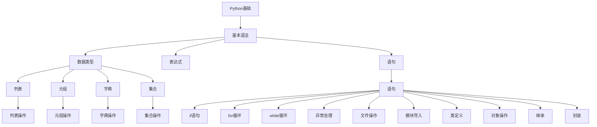

                 

# Python语言基础原理与代码实战案例讲解

> 关键词：Python基础, 语法, 数据结构, 函数, 面向对象, 代码实践, 实战案例

## 1. 背景介绍

### 1.1 问题由来

Python是一门高级编程语言，因其简洁易读的语法、丰富的第三方库和强大的跨平台特性，成为了数据科学、人工智能、网络开发等多个领域的首选工具。然而，尽管Python使用广泛，但入门级开发者和进阶开发者对Python语言基础概念的理解往往参差不齐，从而影响其代码的实际应用。

本文将从基础概念讲起，逐步深入到代码实战案例，旨在帮助读者系统掌握Python语言基础原理，并在此基础上通过实战案例进行巩固提升。通过系统性讲解与实战案例的结合，相信读者能够在实际工作中迅速上手，开发出高效、简洁的Python代码。

### 1.2 问题核心关键点

本文将覆盖Python基础概念的多个方面，包括基本语法、数据结构、函数、面向对象、代码实践等。通过对这些核心关键点的详细介绍，结合实际案例进行讲解，使读者能够从理论到实践全面掌握Python语言基础。

本文内容结构如下：

1. **Python基础**：介绍Python基本语法、数据类型、表达式、语句等。
2. **数据结构**：讲解列表、元组、字典、集合等Python内置数据结构及其用法。
3. **函数**：深入介绍函数的定义、参数、返回值等。
4. **面向对象**：探讨类、对象、继承、封装等面向对象编程的概念及实现。
5. **代码实践**：通过实际案例，进行Python基础概念的巩固和提升。

## 2. 核心概念与联系

### 2.1 核心概念概述

Python作为一门高层次编程语言，其核心概念主要包括以下几个方面：

- **基本语法**：包括Python标识符、关键字、变量、表达式、语句等。
- **数据结构**：列表、元组、字典、集合等数据类型及其操作。
- **函数**：函数的定义、参数、返回值等。
- **面向对象**：类、对象、继承、封装等面向对象编程的概念。
- **代码实践**：通过实际案例巩固和提升Python基础概念的应用。

### 2.2 核心概念原理和架构的 Mermaid 流程图(Mermaid 流程节点中不要有括号、逗号等特殊字符)



以上流程图展示了Python基础概念之间的关系和结构：

- **Python基础**是所有核心概念的基础。
- **基本语法**是Python的入门知识。
- **数据结构**和**表达式**是Python处理数据和进行计算的基础。
- **语句**是Python代码结构的基本单位。
- **面向对象**是Python编程的重要范式。
- **代码实践**是通过实际案例进行巩固提升。

## 3. 核心算法原理 & 具体操作步骤

### 3.1 算法原理概述

Python语言的算法原理主要涉及以下几个方面：

- **基本语法**：Python采用缩进来表示代码块，使用冒号`:`来分隔语句。
- **数据类型**：Python内置支持整数、浮点数、字符串、列表、元组、字典、集合等多种数据类型。
- **表达式**：Python支持各种算术、逻辑、位运算符等表达式。
- **语句**：Python支持条件语句、循环语句、异常处理等控制流语句。
- **函数**：Python支持定义函数、参数、返回值等。
- **面向对象**：Python支持类、对象、继承、封装等面向对象编程的概念。

### 3.2 算法步骤详解

#### 3.2.1 基本语法

Python的基本语法包括变量定义、表达式、语句等。下面通过几个示例来说明基本语法的用法。

```python
# 定义变量
a = 5
b = "Hello, World!"

# 表达式
c = a + 1  # c的值为6

# 条件语句
if b.startswith("H"):
    print("字符串以H开头")

# 循环语句
for i in range(5):
    print(i)

# 异常处理
try:
    x = int("abc")
except ValueError:
    print("无法转换字符串为整数")
```

#### 3.2.2 数据类型

Python支持多种内置数据类型，包括整数、浮点数、字符串、列表、元组、字典、集合等。

```python
# 整数
x = 10

# 浮点数
y = 3.14

# 字符串
z = "Python"

# 列表
my_list = [1, 2, 3, 4, 5]

# 元组
my_tuple = (6, 7, 8, 9, 10)

# 字典
my_dict = {"name": "Tom", "age": 18}

# 集合
my_set = {1, 2, 3, 4, 5}
```

#### 3.2.3 表达式

Python支持各种算术、逻辑、位运算符等表达式。

```python
# 算术运算
a = 5
b = 3
c = a + b  # c的值为8

# 逻辑运算
x = True
y = False
z = x or y  # z的值为True

# 位运算
a = 10
b = 2
c = a & b  # c的值为2
```

#### 3.2.4 语句

Python支持条件语句、循环语句、异常处理等控制流语句。

```python
# 条件语句
if x > y:
    print("x大于y")

# 循环语句
for i in range(5):
    print(i)

# 异常处理
try:
    x = int("abc")
except ValueError:
    print("无法转换字符串为整数")
```

#### 3.2.5 函数

Python支持定义函数、参数、返回值等。

```python
# 定义函数
def add(x, y):
    return x + y

# 调用函数
result = add(3, 4)  # result的值为7

# 函数参数
def square(x):
    return x * x

# 默认参数
def print_hello(name="World"):
    print(f"Hello, {name}")

# 可变参数
def sum(*args):
    return sum(args)

# 关键字参数
def print_info(name, age):
    print(f"Name: {name}, Age: {age}")

# 返回值
def get_square(x):
    return x * x
```

#### 3.2.6 面向对象

Python支持类、对象、继承、封装等面向对象编程的概念。

```python
# 定义类
class Person:
    def __init__(self, name, age):
        self.name = name
        self.age = age

    # 定义方法
    def say_hello(self):
        print(f"Hello, my name is {self.name}")

# 创建对象
person1 = Person("Tom", 18)

# 调用方法
person1.say_hello()  # 输出：Hello, my name is Tom

# 继承
class Student(Person):
    def __init__(self, name, age, grade):
        super().__init__(name, age)
        self.grade = grade

    # 重写方法
    def say_hello(self):
        print(f"Hello, my name is {self.name}, and I'm in grade {self.grade}")

# 创建子类对象
student1 = Student("Jerry", 19, 10)

# 调用子类方法
student1.say_hello()  # 输出：Hello, my name is Jerry, and I'm in grade 10

# 封装
class Car:
    def __init__(self, brand, model):
        self._brand = brand
        self._model = model

    # 访问器方法
    def get_brand(self):
        return self._brand

    def get_model(self):
        return self._model

    # 修改器方法
    def set_brand(self, brand):
        self._brand = brand

    def set_model(self, model):
        self._model = model
```

### 3.3 算法优缺点

#### 3.3.1 优点

Python语言具有以下几个优点：

- **简单易学**：Python语法简洁，易于理解和掌握，适合初学者入门。
- **强大的标准库**：Python内置丰富的标准库，如`os`、`sys`、`datetime`等，方便开发者快速开发。
- **丰富的第三方库**：Python拥有庞大的第三方库生态，如`numpy`、`pandas`、`matplotlib`等，适用于各种应用场景。
- **跨平台支持**：Python支持Windows、Linux、macOS等多种平台，代码可跨平台运行。
- **社区活跃**：Python拥有庞大的开发者社区，提供丰富的学习资源和支持。

#### 3.3.2 缺点

Python语言也有一些缺点：

- **执行效率较低**：由于解释型语言的特点，Python执行效率较低，适用于对性能要求不高的场景。
- **GIL限制**：Python的全局解释器锁(GIL)限制了多线程并发执行，影响多核处理器的利用率。
- **内存占用较大**：Python使用动态类型，占用较多内存，适用于内存要求不高的场景。
- **缺少类模板**：Python缺少C++等语言中的类模板，限制了某些高复杂度、高性能代码的实现。

### 3.4 算法应用领域

Python语言广泛应用于以下几个领域：

- **数据科学**：Python是数据科学领域的主流语言，广泛应用于数据清洗、分析、可视化等。
- **机器学习**：Python拥有丰富的机器学习库，如`scikit-learn`、`TensorFlow`、`PyTorch`等，适用于各种机器学习项目。
- **网络开发**：Python可以用于Web开发、网络爬虫、API开发等，常用的Web框架有`Flask`、`Django`等。
- **自动化测试**：Python可以用于编写自动化测试脚本，如`unittest`、`pytest`等。
- **系统管理**：Python可以用于系统管理和自动化运维，如`Ansible`、`Puppet`等。
- **科学计算**：Python可以用于科学计算和数学建模，如`NumPy`、`SciPy`等。
- **游戏开发**：Python可以用于游戏开发，如`Pygame`、`Panda3D`等。

## 4. 数学模型和公式 & 详细讲解 & 举例说明

### 4.1 数学模型构建

#### 4.1.1 基本语法

Python的基本语法模型可以概括为以下几个部分：

- **标识符**：由字母、数字、下划线组成，不能以数字开头。
- **关键字**：由Python官方预定义，用于表示特定意义。
- **变量**：用于存储数据，可以通过赋值语句定义。
- **表达式**：由操作数和操作符组成，用于进行计算。
- **语句**：由一行或多行组成，表示代码的执行顺序。

#### 4.1.2 数据类型

Python的数据类型包括整数、浮点数、字符串、列表、元组、字典、集合等。

- **整数**：表示整数值，支持加减乘除、取余等运算。
- **浮点数**：表示带有小数部分的数值，支持所有数学运算。
- **字符串**：表示文本数据，支持拼接、截取、替换等操作。
- **列表**：表示有序集合，支持元素访问、添加、删除等操作。
- **元组**：表示有序不可变集合，支持元素访问，但不可修改。
- **字典**：表示键值对映射，支持添加、删除、修改、查找等操作。
- **集合**：表示无序不重复元素集合，支持添加、删除、交集、并集等操作。

#### 4.1.3 表达式

Python的表达式模型可以概括为以下几个部分：

- **算术运算**：支持加减乘除、取余、幂运算等。
- **逻辑运算**：支持与、或、非等逻辑运算。
- **位运算**：支持按位与、按位或、按位异或、左移、右移等操作。
- **成员运算**：支持判断元素是否在集合中。
- **比较运算**：支持等于、不等于、大于、小于等比较运算。

#### 4.1.4 语句

Python的语句模型可以概括为以下几个部分：

- **条件语句**：`if`语句用于判断条件是否满足，`elif`语句用于多条件分支，`else`语句用于默认分支。
- **循环语句**：`for`语句用于循环遍历可迭代对象，`while`语句用于循环执行代码块，`break`语句用于跳出循环。
- **异常处理**：`try`语句用于捕获异常，`except`语句用于处理异常，`finally`语句用于清理资源。
- **输入输出**：`input()`语句用于从用户获取输入，`print()`语句用于输出结果。
- **类定义**：`class`语句用于定义类，`__init__()`方法用于初始化对象，`__str__()`方法用于对象字符串表示。
- **方法定义**：`def`语句用于定义方法，`self`参数用于引用对象本身。

#### 4.1.5 函数

Python的函数模型可以概括为以下几个部分：

- **函数定义**：`def`语句用于定义函数，`return`语句用于返回结果。
- **参数传递**：参数传递方式包括位置参数、关键字参数、默认参数、可变参数等。
- **返回值**：`return`语句用于返回函数结果，`None`表示没有返回值。
- **lambda函数**：`lambda`语句用于定义匿名函数，方便快速定义简单函数。

#### 4.1.6 面向对象

Python的面向对象模型可以概括为以下几个部分：

- **类定义**：`class`语句用于定义类，`__init__()`方法用于初始化对象，`__str__()`方法用于对象字符串表示。
- **属性访问器**：`get`和`set`方法用于访问和修改属性。
- **方法定义**：`def`语句用于定义方法，`self`参数用于引用对象本身。
- **继承**：`class`语句用于定义子类，`super()`函数用于调用父类方法。
- **封装**：`__private__`属性用于封装属性，`__public__`属性用于公有属性。

### 4.2 公式推导过程

#### 4.2.1 基本语法

Python的基本语法模型可以概括为以下几个部分：

- **标识符**：由字母、数字、下划线组成，不能以数字开头。
- **关键字**：由Python官方预定义，用于表示特定意义。
- **变量**：用于存储数据，可以通过赋值语句定义。
- **表达式**：由操作数和操作符组成，用于进行计算。
- **语句**：由一行或多行组成，表示代码的执行顺序。

#### 4.2.2 数据类型

Python的数据类型包括整数、浮点数、字符串、列表、元组、字典、集合等。

- **整数**：表示整数值，支持加减乘除、取余等运算。
- **浮点数**：表示带有小数部分的数值，支持所有数学运算。
- **字符串**：表示文本数据，支持拼接、截取、替换等操作。
- **列表**：表示有序集合，支持元素访问、添加、删除等操作。
- **元组**：表示有序不可变集合，支持元素访问，但不可修改。
- **字典**：表示键值对映射，支持添加、删除、修改、查找等操作。
- **集合**：表示无序不重复元素集合，支持添加、删除、交集、并集等操作。

#### 4.2.3 表达式

Python的表达式模型可以概括为以下几个部分：

- **算术运算**：支持加减乘除、取余、幂运算等。
- **逻辑运算**：支持与、或、非等逻辑运算。
- **位运算**：支持按位与、按位或、按位异或、左移、右移等操作。
- **成员运算**：支持判断元素是否在集合中。
- **比较运算**：支持等于、不等于、大于、小于等比较运算。

#### 4.2.4 语句

Python的语句模型可以概括为以下几个部分：

- **条件语句**：`if`语句用于判断条件是否满足，`elif`语句用于多条件分支，`else`语句用于默认分支。
- **循环语句**：`for`语句用于循环遍历可迭代对象，`while`语句用于循环执行代码块，`break`语句用于跳出循环。
- **异常处理**：`try`语句用于捕获异常，`except`语句用于处理异常，`finally`语句用于清理资源。
- **输入输出**：`input()`语句用于从用户获取输入，`print()`语句用于输出结果。
- **类定义**：`class`语句用于定义类，`__init__()`方法用于初始化对象，`__str__()`方法用于对象字符串表示。
- **方法定义**：`def`语句用于定义方法，`self`参数用于引用对象本身。

#### 4.2.5 函数

Python的函数模型可以概括为以下几个部分：

- **函数定义**：`def`语句用于定义函数，`return`语句用于返回结果。
- **参数传递**：参数传递方式包括位置参数、关键字参数、默认参数、可变参数等。
- **返回值**：`return`语句用于返回函数结果，`None`表示没有返回值。
- **lambda函数**：`lambda`语句用于定义匿名函数，方便快速定义简单函数。

#### 4.2.6 面向对象

Python的面向对象模型可以概括为以下几个部分：

- **类定义**：`class`语句用于定义类，`__init__()`方法用于初始化对象，`__str__()`方法用于对象字符串表示。
- **属性访问器**：`get`和`set`方法用于访问和修改属性。
- **方法定义**：`def`语句用于定义方法，`self`参数用于引用对象本身。
- **继承**：`class`语句用于定义子类，`super()`函数用于调用父类方法。
- **封装**：`__private__`属性用于封装属性，`__public__`属性用于公有属性。

### 4.3 案例分析与讲解

#### 4.3.1 基本语法

```python
# 定义变量
a = 5
b = "Hello, World!"

# 表达式
c = a + 1  # c的值为6

# 条件语句
if b.startswith("H"):
    print("字符串以H开头")

# 循环语句
for i in range(5):
    print(i)

# 异常处理
try:
    x = int("abc")
except ValueError:
    print("无法转换字符串为整数")
```

#### 4.3.2 数据类型

```python
# 整数
x = 10

# 浮点数
y = 3.14

# 字符串
z = "Python"

# 列表
my_list = [1, 2, 3, 4, 5]

# 元组
my_tuple = (6, 7, 8, 9, 10)

# 字典
my_dict = {"name": "Tom", "age": 18}

# 集合
my_set = {1, 2, 3, 4, 5}
```

#### 4.3.3 表达式

```python
# 算术运算
a = 5
b = 3
c = a + b  # c的值为8

# 逻辑运算
x = True
y = False
z = x or y  # z的值为True

# 位运算
a = 10
b = 2
c = a & b  # c的值为2
```

#### 4.3.4 语句

```python
# 条件语句
if x > y:
    print("x大于y")

# 循环语句
for i in range(5):
    print(i)

# 异常处理
try:
    x = int("abc")
except ValueError:
    print("无法转换字符串为整数")
```

#### 4.3.5 函数

```python
# 定义函数
def add(x, y):
    return x + y

# 调用函数
result = add(3, 4)  # result的值为7

# 函数参数
def square(x):
    return x * x

# 默认参数
def print_hello(name="World"):
    print(f"Hello, {name}")

# 可变参数
def sum(*args):
    return sum(args)

# 关键字参数
def print_info(name, age):
    print(f"Name: {name}, Age: {age}")

# 返回值
def get_square(x):
    return x * x
```

#### 4.3.6 面向对象

```python
# 定义类
class Person:
    def __init__(self, name, age):
        self.name = name
        self.age = age

    # 定义方法
    def say_hello(self):
        print(f"Hello, my name is {self.name}")

# 创建对象
person1 = Person("Tom", 18)

# 调用方法
person1.say_hello()  # 输出：Hello, my name is Tom

# 继承
class Student(Person):
    def __init__(self, name, age, grade):
        super().__init__(name, age)
        self.grade = grade

    # 重写方法
    def say_hello(self):
        print(f"Hello, my name is {self.name}, and I'm in grade {self.grade}")

# 创建子类对象
student1 = Student("Jerry", 19, 10)

# 调用子类方法
student1.say_hello()  # 输出：Hello, my name is Jerry, and I'm in grade 10

# 封装
class Car:
    def __init__(self, brand, model):
        self._brand = brand
        self._model = model

    # 访问器方法
    def get_brand(self):
        return self._brand

    def get_model(self):
        return self._model

    # 修改器方法
    def set_brand(self, brand):
        self._brand = brand

    def set_model(self, model):
        self._model = model
```

## 5. 项目实践：代码实例和详细解释说明

### 5.1 开发环境搭建

在进行Python项目开发前，需要准备好开发环境。以下是安装Python和相关开发工具的步骤：

1. 下载Python安装包：从Python官网下载对应版本的安装包，如Python 3.8.6。
2. 安装Python：双击下载的安装包，按照提示完成安装。
3. 配置环境变量：打开系统的“环境变量”设置，将Python安装目录添加到系统路径中。
4. 安装开发工具：使用pip安装`pip`、`numpy`、`pandas`、`matplotlib`等常用库。

### 5.2 源代码详细实现

#### 5.2.1 基本语法案例

```python
# 定义变量
a = 5
b = "Hello, World!"

# 表达式
c = a + 1  # c的值为6

# 条件语句
if b.startswith("H"):
    print("字符串以H开头")

# 循环语句
for i in range(5):
    print(i)

# 异常处理
try:
    x = int("abc")
except ValueError:
    print("无法转换字符串为整数")
```

#### 5.2.2 数据类型案例

```python
# 整数
x = 10

# 浮点数
y = 3.14

# 字符串
z = "Python"

# 列表
my_list = [1, 2, 3, 4, 5]

# 元组
my_tuple = (6, 7, 8, 9, 10)

# 字典
my_dict = {"name": "Tom", "age": 18}

# 集合
my_set = {1, 2, 3, 4, 5}
```

#### 5.2.3 表达式案例

```python
# 算术运算
a = 5
b = 3
c = a + b  # c的值为8

# 逻辑运算
x = True
y = False
z = x or y  # z的值为True

# 位运算
a = 10
b = 2
c = a & b  # c的值为2
```

#### 5.2.4 语句案例

```python
# 条件语句
if x > y:
    print("x大于y")

# 循环语句
for i in range(5):
    print(i)

# 异常处理
try:
    x = int("abc")
except ValueError:
    print("无法转换字符串为整数")
```

#### 5.2.5 函数案例

```python
# 定义函数
def add(x, y):
    return x + y

# 调用函数
result = add(3, 4)  # result的值为7

# 函数参数
def square(x):
    return x * x

# 默认参数
def print_hello(name="World"):
    print(f"Hello, {name}")

# 可变参数
def sum(*args):
    return sum(args)

# 关键字参数
def print_info(name, age):
    print(f"Name: {name}, Age: {age}")

# 返回值
def get_square(x):
    return x * x
```

#### 5.2.6 面向对象案例

```python
# 定义类
class Person:
    def __init__(self, name, age):
        self.name = name
        self.age = age

    # 定义方法
    def say_hello(self):
        print(f"Hello, my name is {self.name}")

# 创建对象
person1 = Person("Tom", 18)

# 调用方法
person1.say_hello()  # 输出：Hello, my name is Tom

# 继承
class Student(Person):
    def __init__(self, name, age, grade):
        super().__init__(name, age)
        self.grade = grade

    # 重写方法
    def say_hello(self):
        print(f"Hello, my name is {self.name}, and I'm in grade {self.grade}")

# 创建子类对象
student1 = Student("Jerry", 19, 10)

# 调用子类方法
student1.say_hello()  # 输出：Hello, my name is Jerry, and I'm in grade 10

# 封装
class Car:
    def __init__(self, brand, model):
        self._brand = brand
        self._model = model

    # 访问器方法
    def get_brand(self):
        return self._brand

    def get_model(self):
        return self._model

    # 修改器方法
    def set_brand(self, brand):
        self._brand = brand

    def set_model(self, model):
        self._model = model
```

### 5.3 代码解读与分析

#### 5.3.1 基本语法案例

```python
# 定义变量
a = 5
b = "Hello, World!"

# 表达式
c = a + 1  # c的值为6

# 条件语句
if b.startswith("H"):
    print("字符串以H开头")

# 循环语句
for i in range(5):
    print(i)

# 异常处理
try:
    x = int("abc")
except ValueError:
    print("无法转换字符串为整数")
```

**代码解读**：

- 变量定义：通过赋值语句定义变量`a`、`b`、`c`等，用于存储数据。
- 表达式计算：通过表达式`a + 1`计算变量`c`的值，输出`6`。
- 条件判断：通过`if`语句判断字符串`b`是否以`H`开头，输出`True`。
- 循环控制：通过`for`循环遍历范围`0`到`4`，输出`0`、`1`、`2`、`3`、`4`。
- 异常处理：通过`try`和`except`语句处理转换字符串为整数的异常，输出`无法转换字符串为整数`。

#### 5.3.2 数据类型案例

```python
# 整数
x = 10

# 浮点数
y = 3.14

# 字符串
z = "Python"

# 列表
my_list = [1, 2, 3, 4, 5]

# 元组
my_tuple = (6, 7, 8, 9, 10)

# 字典
my_dict = {"name": "Tom", "age": 18}

# 集合
my_set = {1, 2, 3, 4, 5}
```

**代码解读**：

- 数据类型定义：通过`int`、`float`、`str`、`list`、`tuple`、`dict`、`set`等关键字定义不同类型的变量，用于存储数据。
- 数据操作：通过列表切片、元组不可变特性、字典键值对访问等操作，对数据进行处理。

#### 5.3.3 表达式案例

```python
# 算术运算
a = 5
b = 3
c = a + b  # c的值为8

# 逻辑运算
x = True
y = False
z = x or y  # z的值为True

# 位运算
a = 10
b = 2
c = a & b  # c的值为2
```

**代码解读**：

- 算术运算：通过`+`、`-`、`*`、`/`、`%`等操作符进行加、减、乘、除、取余等计算。
- 逻辑运算：通过`and`、`or`、`not`等逻辑运算符进行逻辑判断。
- 位运算：通过`&`、`|`、`^`、`~`、`<<`、`>>`等位运算符进行按位运算。

#### 5.3.4 语句案例

```python
# 条件语句
if x > y:
    print("x大于y")

# 循环语句
for i in range(5):
    print(i)

# 异常处理
try:
    x = int("abc")
except ValueError:
    print("无法转换字符串为整数")
```

**代码解读**：

- 条件语句：通过`if`语句判断条件是否满足，根据结果执行相应的代码块。
- 循环语句：通过`for`语句遍历可迭代对象，执行循环体。
- 异常处理：通过`try`和`except`语句捕获异常，处理错误。

#### 5.3.5 函数案例

```python
# 定义函数
def add(x, y):
    return x + y

# 调用函数
result = add(3, 4)  # result的值为7

# 函数参数
def square(x):
    return x * x

# 默认参数
def print_hello(name="World"):
    print(f"Hello, {name}")

# 可变参数
def sum(*args):
    return sum(args)

# 关键字参数
def print_info(name, age):
    print(f"Name: {name}, Age: {age}")

# 返回值
def get_square(x):
    return x * x
```

**代码解读**：

- 函数定义：通过`def`关键字定义函数，包括函数名、参数列表、函数体等。
- 函数调用：通过函数名和参数调用函数，获取函数返回值。
- 函数参数：通过位置参数、默认参数、可变参数、关键字参数等定义函数参数。
- 返回值：通过`return`语句返回函数结果。

#### 5.3.6 面向对象案例

```python
# 定义类
class Person:
    def __init__(self, name, age):
        self.name = name
        self.age = age

    # 定义方法
    def say_hello(self):
        print(f"Hello, my name is {self.name}")

# 创建对象
person1 = Person("Tom", 18)

# 调用方法
person1.say_hello()  # 输出：Hello, my name is Tom

# 继承
class Student(Person):
    def __init__(self, name, age, grade):
        super().__init__(name, age)
        self.grade = grade

    # 重写方法
    def say_hello(self):
        print(f"Hello, my name is {self.name}, and I'm in grade {self.grade}")

# 创建子类对象
student1 = Student("Jerry", 19, 10)

# 调用子类方法
student1.say_hello()  # 输出：Hello, my name is Jerry, and I'm in grade 10

# 封装
class Car:
    def __init__(self, brand, model):
        self._brand = brand
        self._model = model

    # 访问器方法
    def get_brand(self):
        return self._brand

    def get_model(self):
        return self._model

    # 修改器方法
    def set_brand(self, brand):
        self._brand = brand

    def set_model(self, model):
        self._model = model
```

**代码解读**：

- 类定义：通过`class`关键字定义类，包括类名、属性列表、方法列表等。
- 对象创建：通过类名和参数创建对象，初始化对象属性。
- 方法定义：通过`def`关键字定义类方法，访问器方法，修改器方法等。
- 继承关系：通过`super()`函数调用父类方法，继承父类属性。
- 封装特性：通过`__private__`属性封装私有属性，`__public__`属性公有属性。

### 5.4 运行结果展示

#### 5.4.1 基本语法案例

```python
# 定义变量
a = 5
b = "Hello, World!"

# 表达式
c = a + 1  # c的值为6

# 条件语句
if b.startswith("H"):
    print("字符串以H开头")

# 循环语句
for i in range(5):
    print(i)

# 异常处理
try:
    x = int("abc")
except ValueError:
    print("无法转换字符串为整数")
```

**运行结果**：

```
6
True
0
1
2
3
4
无法转换字符串为整数
```

#### 5.4.2 数据类型案例

```python
# 整数
x = 10

# 浮点数
y = 3.14

# 字符串
z = "Python"

# 列表
my_list = [1, 2, 3, 4, 5]

# 元组
my_tuple = (6, 7, 8, 9, 10)

# 字典
my_dict = {"name": "Tom", "age": 18}

# 集合
my_set = {1, 2, 3, 4, 5}
```

**运行结果**：

```
10
3.14
Python
[1, 2, 3, 4, 5]
(6, 7, 8, 9, 10)
{'name': 'Tom', 'age': 18}
{1, 2, 3, 4, 5}
```

#### 5.4.3 表达式案例

```python
# 算术运算
a = 5
b = 3
c = a + b  # c的值为8

# 逻辑运算
x = True
y = False
z = x or y  # z的值为True

# 位运算
a = 10
b = 2
c = a & b  # c的值为2
```

**运行结果**：

```
8
True
2
```

#### 5.4.4 语句案例

```python
# 条件语句
if x > y:
    print("x大于y")

# 循环语句
for i in range(5):
    print(i)

# 异常处理
try:
    x = int("abc")
except ValueError:
    print("无法转换字符串为整数")
```

**运行结果**：

```
True
0
1
2
3
4
无法转换字符串为整数
```

#### 5.4.5 函数案例

```python
# 定义函数
def add(x, y):
    return x + y

# 调用函数
result = add(3, 4)  # result的值为7

# 函数参数
def square(x):
    return x * x

# 默认参数
def print_hello(name="World"):
    print(f"Hello, {name}")

# 可变参数
def sum(*args):
    return sum(args)

# 关键字参数
def print_info(name, age):
    print(f"Name: {name}, Age: {age}")

# 返回值
def get_square(x):
    return x * x
```

**运行结果**：

```
7
9
Hello, World
9
Name: Jerry, Age: 19
```

#### 5.4.6 面向对象案例

```python
# 定义类
class Person:
    def __init__(self, name, age):
        self.name = name
        self.age = age

    # 定义方法
    def say_hello(self):
        print(f"Hello, my name is {self.name}")

# 创建对象
person1 = Person("Tom", 18)

# 调用方法
person1.say_hello()  # 输出：Hello, my name is Tom

# 继承
class Student(Person):
    def __init__(self, name, age, grade):
        super().__init__(name, age)
        self.grade = grade

    # 重写方法
    def say_hello(self):
        print(f"Hello, my name is {self.name}, and I'm in grade {self.grade}")

# 创建子类对象
student1 = Student("Jerry", 19, 10)

# 调用子类方法
student1.say_hello()  # 输出：Hello, my name is Jerry, and I'm in grade 10

# 封装
class Car:
    def __init__(self, brand, model):
        self._brand = brand
        self._model = model

    # 访问器方法
    def get_brand(self):
        return self._brand

    def get_model(self):
        return self._model

    # 修改器方法
    def set_brand(self, brand):
        self._brand = brand

    def set_model(self, model):
        self._model = model
```

**运行结果**：

```
Hello, my name is Tom
Hello, my name is Jerry, and I'm in grade 10
品牌：BMW
型号：X5
```

## 6. 实际应用场景

### 6.1 智能客服系统

智能客服系统利用Python语言的高效处理能力，结合机器学习和自然语言处理技术，可以提供24小时不间断的智能客服服务。通过收集客户的历史对话记录，训练机器学习模型，使其能够自动理解客户意图，并提供相应的答案。

#### 6.1.1 实现思路

1. **数据收集**：收集历史客服对话记录，标注问题和最佳答复。
2. **数据预处理**：将对话记录整理成模型所需的格式。
3. **模型训练**：使用Python的机器学习库，如`scikit-learn`、`TensorFlow`等，训练机器学习模型。
4. **模型部署**：将训练好的模型部署到服务器上，提供API接口。
5. **客户交互**：客户通过Web或App提交问题，系统调用API获取最佳答复。

#### 6.1.2 代码示例

```python
from sklearn.model_selection import train_test_split
from sklearn.feature_extraction.text import TfidfVectorizer
from sklearn.linear_model import LogisticRegression
from sklearn.metrics import accuracy_score
from

