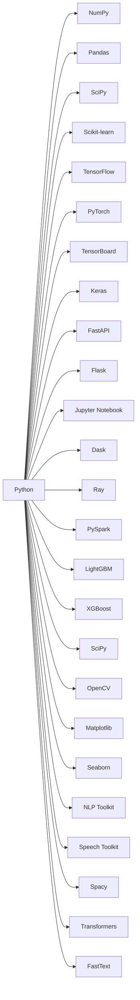

                 

# Python：人工智能开发的瑞士军刀

Python以其简洁易学、功能强大的特点，迅速成为人工智能领域的开发利器。无论是深度学习、自然语言处理、计算机视觉还是数据科学，Python都能提供强大的工具支持。本文将深入探讨Python在人工智能开发中的关键地位和核心应用，并揭示其广泛适用性和未来发展趋势。

## 1. 背景介绍

### 1.1 问题由来
人工智能(AI)技术的快速发展离不开高效开发工具的支持。在AI领域，Python凭借其丰富的生态系统和强大的社区支持，成为开发者的首选编程语言。Python的简洁语法、动态类型、丰富的标准库和第三方库，使其成为多领域AI技术的开发基础。

### 1.2 问题核心关键点
本文将从以下几个核心关键点展开探讨：
- Python的语法和设计哲学
- Python在AI开发中的核心库和框架
- Python的数据科学和机器学习生态
- Python的部署和生产环境构建
- Python的社区和未来发展趋势

## 2. 核心概念与联系

### 2.1 核心概念概述

Python，由Guido van Rossum于1989年创建，是一款解释型、面向对象、动态数据类型的高级编程语言。Python的设计哲学强调代码的易读性和简洁性，注重"让语言更易读，让复杂问题更简单"。其语法直观、贴近英语，成为初学者学习编程的首选。

在AI领域，Python的核心优势在于其丰富的库和框架，如NumPy、Pandas、SciPy、Scikit-learn、TensorFlow、PyTorch等，为数据处理、模型构建、深度学习等提供了全面的支持。同时，Python拥有活跃的社区和众多开发者，不断推出新的开源项目和创新技术，推动AI技术的快速发展。

### 2.2 核心概念原理和架构的 Mermaid 流程图(Mermaid 流程节点中不要有括号、逗号等特殊字符)



该图展示了Python在AI开发中的一些关键库和框架。NumPy提供了高性能的科学计算能力，Pandas支持数据处理和分析，Scikit-learn和TensorFlow/PyTorch提供了丰富的机器学习模型和工具，TensorBoard和Keras简化了模型训练和可视化过程，FastAPI和Flask支持高效构建API，Jupyter Notebook提供了交互式开发环境，Dask和Ray支持分布式计算，PySpark和大规模数据处理，LightGBM和XGBoost支持高效的梯度提升机模型，Spacy和Transformers支持自然语言处理，FastText支持文本分类，TensorBoard支持模型可视化，Matplotlib和Seaborn支持数据可视化，NLP Toolkit和Speech Toolkit支持语音和文本处理，Spacy支持NLP任务，这些库和框架共同构成了Python在AI开发中的强大生态。

## 3. 核心算法原理 & 具体操作步骤

### 3.1 算法原理概述

Python在AI开发中的应用范围广泛，涉及数据预处理、模型构建、训练和推理等多个环节。其核心算法原理包括：

- 数据预处理：利用NumPy、Pandas等库进行数据清洗、特征工程、数据转换等。
- 模型构建：使用Scikit-learn、TensorFlow、PyTorch等框架搭建模型。
- 训练过程：通过梯度下降、Adam、RMSprop等优化算法更新模型参数。
- 模型评估：利用交叉验证、ROC曲线、精度、召回率等指标评估模型性能。
- 推理过程：通过TensorFlow、PyTorch等框架对模型进行推理，得到预测结果。

### 3.2 算法步骤详解

以下以深度学习模型的训练为例，详细阐述Python的核心算法步骤：

1. **数据准备**：收集数据集，进行数据预处理和特征工程，将数据转换为模型所需的格式。
2. **模型定义**：使用TensorFlow或PyTorch定义神经网络模型，包括输入层、隐藏层、输出层等。
3. **模型编译**：配置模型的损失函数、优化器和评价指标。
4. **模型训练**：使用训练集数据进行模型训练，不断调整模型参数以最小化损失函数。
5. **模型评估**：在验证集上评估模型性能，调整超参数。
6. **模型保存**：将训练好的模型保存到文件或数据库中。
7. **模型推理**：使用测试集数据对模型进行推理，生成预测结果。

### 3.3 算法优缺点

Python在AI开发中的优势和劣势如下：

#### 优点
- **简洁易学**：Python语法简洁，易于上手。
- **丰富的库和框架**：Python拥有众多成熟的库和框架，覆盖了数据科学、机器学习、深度学习、自然语言处理等各个领域。
- **强大的社区支持**：Python社区庞大，开发者众多，能够快速获取支持和学习资源。
- **广泛的生态系统**：Python生态系统丰富，能够满足各种场景的开发需求。

#### 缺点
- **执行速度**：Python解释型语言，执行速度较慢，需要借助C++等编译语言加速。
- **内存占用**：Python动态类型语言，内存占用较大，需要优化内存管理。
- **并行处理**：Python的GIL(Global Interpreter Lock)限制了多线程并行处理的能力，需要借助其他工具支持。
- **资源依赖**：Python对第三方库依赖较大，版本更新和兼容性问题较多。

### 3.4 算法应用领域

Python在AI开发中的应用领域非常广泛，包括但不限于以下几类：

- **计算机视觉**：Python支持OpenCV、Pillow等库，广泛应用于图像处理、目标检测、人脸识别等任务。
- **自然语言处理**：Python支持NLTK、Spacy、Transformers等库，支持文本分析、语音识别、机器翻译等任务。
- **数据科学**：Python支持NumPy、Pandas、SciPy等库，支持数据清洗、数据分析、数据可视化等任务。
- **机器学习**：Python支持Scikit-learn、TensorFlow、PyTorch等框架，支持各种机器学习模型和算法。
- **深度学习**：Python支持TensorFlow、PyTorch、Keras等框架，支持深度神经网络模型的构建和训练。
- **分布式计算**：Python支持Dask、Ray、Spark等库，支持大规模数据处理和分布式计算。

## 4. 数学模型和公式 & 详细讲解 & 举例说明

### 4.1 数学模型构建

以线性回归为例，说明Python在数学模型构建中的应用。

1. **数据准备**：收集训练集$X$和目标变量$y$。
2. **模型定义**：定义线性回归模型$y = \theta^T x$，其中$\theta$为模型参数。
3. **损失函数**：定义均方误差损失函数$L(\theta) = \frac{1}{2N} \sum_{i=1}^N (y_i - \hat{y}_i)^2$。
4. **模型训练**：使用梯度下降算法更新模型参数$\theta$，使损失函数最小化。

### 4.2 公式推导过程

在线性回归中，模型参数$\theta$的更新公式为：

$$
\theta = \theta - \eta \nabla_{\theta} L(\theta)
$$

其中$\eta$为学习率，$\nabla_{\theta} L(\theta)$为损失函数对$\theta$的梯度。利用链式法则，可以计算梯度的具体表达式：

$$
\frac{\partial L(\theta)}{\partial \theta_k} = -\frac{1}{N} \sum_{i=1}^N (y_i - \hat{y}_i) x_{ik}
$$

通过反向传播算法，可以高效计算梯度，更新模型参数。

### 4.3 案例分析与讲解

以下是一个简单的线性回归代码示例，演示如何使用NumPy和Scikit-learn进行模型训练和预测。

```python
import numpy as np
from sklearn.linear_model import LinearRegression

# 生成模拟数据
X = np.random.rand(100, 1)
y = 2 * X + np.random.randn(100, 1) + 1

# 训练模型
model = LinearRegression()
model.fit(X, y)

# 预测结果
X_test = np.array([[0.5], [1.5]])
y_pred = model.predict(X_test)
print(y_pred)
```

通过上述代码，可以构建和训练线性回归模型，并进行预测。Scikit-learn提供了丰富的机器学习算法和工具，简化了模型构建和训练的过程。

## 5. 项目实践：代码实例和详细解释说明

### 5.1 开发环境搭建

以下是在Python环境下搭建深度学习项目的基本步骤：

1. **安装Python**：安装最新版的Python解释器。
2. **安装Anaconda**：安装Anaconda环境管理系统。
3. **创建虚拟环境**：使用conda创建虚拟环境，安装必要的依赖包。
4. **安装深度学习框架**：使用pip安装TensorFlow、PyTorch、Keras等深度学习框架。
5. **安装数据处理库**：使用pip安装NumPy、Pandas、SciPy等数据处理库。
6. **安装可视化工具**：使用pip安装Matplotlib、Seaborn等可视化工具。
7. **安装部署工具**：使用pip安装Flask、FastAPI等部署工具。

### 5.2 源代码详细实现

以下是一个简单的卷积神经网络代码示例，演示如何使用PyTorch进行模型构建和训练。

```python
import torch
import torch.nn as nn
import torch.optim as optim

# 定义模型
class CNN(nn.Module):
    def __init__(self):
        super(CNN, self).__init__()
        self.conv1 = nn.Conv2d(1, 10, kernel_size=5)
        self.conv2 = nn.Conv2d(10, 20, kernel_size=5)
        self.fc1 = nn.Linear(320, 50)
        self.fc2 = nn.Linear(50, 10)

    def forward(self, x):
        x = F.relu(self.conv1(x))
        x = F.max_pool2d(x, 2)
        x = F.relu(self.conv2(x))
        x = F.max_pool2d(x, 2)
        x = x.view(-1, 320)
        x = F.relu(self.fc1(x))
        x = self.fc2(x)
        return F.log_softmax(x, dim=1)

# 加载数据
train_loader = torch.utils.data.DataLoader(train_dataset, batch_size=64, shuffle=True)
test_loader = torch.utils.data.DataLoader(test_dataset, batch_size=64, shuffle=False)

# 定义模型、损失函数和优化器
model = CNN()
criterion = nn.CrossEntropyLoss()
optimizer = optim.SGD(model.parameters(), lr=0.01, momentum=0.5)

# 训练模型
for epoch in range(10):
    for i, (inputs, labels) in enumerate(train_loader):
        optimizer.zero_grad()
        outputs = model(inputs)
        loss = criterion(outputs, labels)
        loss.backward()
        optimizer.step()
        if (i+1) % 100 == 0:
            print('Epoch [{}/{}], Step [{}/{}], Loss: {:.4f}'
                  .format(epoch+1, 10, i+1, len(train_loader), loss.item()))

# 测试模型
correct = 0
total = 0
with torch.no_grad():
    for inputs, labels in test_loader:
        outputs = model(inputs)
        _, predicted = torch.max(outputs.data, 1)
        total += labels.size(0)
        correct += (predicted == labels).sum().item()
print('Accuracy of the network on the test images: {} %'.format(100 * correct / total))
```

通过上述代码，可以构建卷积神经网络模型，使用SGD优化器进行训练，并在测试集上进行评估。PyTorch提供了丰富的神经网络组件和API，支持高效构建和训练模型。

### 5.3 代码解读与分析

以下是代码中的关键部分及其解释：

- **模型定义**：使用PyTorch定义了一个简单的卷积神经网络，包含两个卷积层和两个全连接层。
- **数据加载**：使用PyTorch的DataLoader加载训练集和测试集数据，支持批量处理和随机打乱。
- **模型训练**：定义模型、损失函数和优化器，通过前向传播计算损失，反向传播更新模型参数。
- **模型测试**：使用测试集数据进行模型评估，计算模型准确率。
- **输出结果**：打印模型在训练集和测试集上的损失和准确率。

## 6. 实际应用场景

### 6.1 智能推荐系统

在电商领域，智能推荐系统已成为提升用户体验和增加收入的重要手段。使用Python和机器学习算法，可以构建高效的推荐引擎，推荐用户可能感兴趣的商品。

推荐系统的核心在于用户行为数据建模和物品特征提取。Python提供了丰富的数据处理库，如Pandas和NumPy，可以快速处理大规模用户行为数据。同时，利用Scikit-learn和TensorFlow等框架，可以构建高效的推荐模型，如协同过滤、深度学习等。

### 6.2 金融风险预测

在金融领域，预测股票市场走势和信用风险是重要的应用场景。使用Python和机器学习算法，可以构建预测模型，帮助金融机构规避风险。

金融数据通常具有高维度、高噪声的特点。Python提供了丰富的数据处理和分析库，如Pandas和SciPy，可以快速处理金融数据。同时，利用Scikit-learn和TensorFlow等框架，可以构建高效的预测模型，如随机森林、深度学习等。

### 6.3 医疗诊断

在医疗领域，AI技术可以用于疾病诊断、基因组分析等任务。使用Python和机器学习算法，可以构建高效的医疗诊断系统，提高诊断准确率。

医疗数据通常具有结构复杂、数据量大的特点。Python提供了丰富的数据处理和分析库，如Pandas和NumPy，可以快速处理医疗数据。同时，利用Scikit-learn和TensorFlow等框架，可以构建高效的医疗诊断模型，如神经网络、支持向量机等。

## 7. 工具和资源推荐

### 7.1 学习资源推荐

为了帮助开发者系统掌握Python在AI开发中的应用，这里推荐一些优质的学习资源：

- **Python官方文档**：Python官方文档提供了Python的语法、标准库和第三方库的详细说明，是学习Python的必备资料。
- **TensorFlow官方文档**：TensorFlow官方文档提供了TensorFlow框架的详细说明和使用示例，是学习深度学习的必备资料。
- **PyTorch官方文档**：PyTorch官方文档提供了PyTorch框架的详细说明和使用示例，是学习深度学习的必备资料。
- **Keras官方文档**：Keras官方文档提供了Keras框架的详细说明和使用示例，是学习深度学习的入门资料。
- **Scikit-learn官方文档**：Scikit-learn官方文档提供了Scikit-learn库的详细说明和使用示例，是学习机器学习的必备资料。
- **NumPy官方文档**：NumPy官方文档提供了NumPy库的详细说明和使用示例，是学习科学计算的必备资料。
- **Pandas官方文档**：Pandas官方文档提供了Pandas库的详细说明和使用示例，是学习数据处理的必备资料。

### 7.2 开发工具推荐

Python在AI开发中广泛使用，以下是几款常用的开发工具：

- **Anaconda**：Anaconda是一款开源的Python发行版，提供了丰富的科学计算和数据处理库，支持虚拟环境管理和依赖管理。
- **Jupyter Notebook**：Jupyter Notebook是一款交互式开发环境，支持Python、R、SQL等多种语言，适合快速原型设计和数据探索。
- **PyCharm**：PyCharm是一款功能强大的Python IDE，支持代码调试、测试、版本控制等功能，是Python开发的首选工具。
- **TensorBoard**：TensorBoard是TensorFlow的可视化工具，可以实时监控模型的训练过程，是模型调试和优化的重要工具。
- **Flask**：Flask是一款轻量级的Web框架，支持快速构建API和Web应用，是Web开发的首选工具。
- **FastAPI**：FastAPI是一款高性能的Web框架，支持异步编程和自动生成API文档，是快速开发Web应用的最佳选择。

### 7.3 相关论文推荐

Python在AI领域的应用广泛，以下是几篇奠基性的相关论文，推荐阅读：

- **"Python Programming Language"**：Guido van Rossum的论文，详细介绍了Python的设计哲学和语言特性。
- **"TensorFlow: A System for Large-Scale Machine Learning"**：Google的论文，详细介绍了TensorFlow框架的设计和实现。
- **"Keras: Deep Learning for Humans"**：François Chollet的论文，详细介绍了Keras框架的设计和实现。
- **"Scikit-learn: Machine Learning in Python"**：Scikit-learn团队的论文，详细介绍了Scikit-learn库的设计和实现。
- **"Deep Learning with Python"**：François Chollet的书籍，详细介绍了深度学习在Python中的应用。
- **"Hands-On Machine Learning with Scikit-Learn and TensorFlow"**：Aurélien Géron的书籍，详细介绍了机器学习在Python中的应用。

## 8. 总结：未来发展趋势与挑战

### 8.1 研究成果总结

Python在AI开发中的应用已经非常广泛，取得了显著的研究成果：

- 构建了丰富的机器学习框架和库，支持深度学习、自然语言处理、计算机视觉等各个领域。
- 提供了丰富的科学计算和数据处理工具，支持高效的数据处理和分析。
- 支持分布式计算和深度学习加速，提高了模型训练和推理的效率。
- 具有活跃的社区和开发者，不断推出新的开源项目和创新技术。

### 8.2 未来发展趋势

Python在AI开发中的未来发展趋势如下：

- **深度学习加速**：随着深度学习算法的发展，Python将进一步优化深度学习框架，提高模型训练和推理的效率。
- **自动化和智能化**：Python将进一步发展自动化编程工具和智能化开发环境，提高开发效率和代码质量。
- **跨平台和跨语言集成**：Python将进一步发展跨平台和跨语言集成技术，支持多种编程语言的混合开发。
- **更广泛的应用场景**：Python将进一步拓展到更多领域，支持物联网、智能家居、智能城市等应用场景。
- **更丰富的生态系统**：Python将进一步发展生态系统，提供更多高质量的开源项目和工具。

### 8.3 面临的挑战

Python在AI开发中面临的挑战如下：

- **性能瓶颈**：Python解释型语言，执行速度较慢，需要借助编译语言加速。
- **内存管理**：Python动态类型语言，内存占用较大，需要优化内存管理。
- **并行处理**：Python的GIL限制了多线程并行处理的能力，需要借助其他工具支持。
- **资源依赖**：Python对第三方库依赖较大，版本更新和兼容性问题较多。

### 8.4 研究展望

Python在AI开发中的应用前景广阔，未来的研究展望如下：

- **深度学习框架优化**：进一步优化深度学习框架，提高模型训练和推理的效率。
- **自动化编程工具**：发展自动化编程工具和智能化开发环境，提高开发效率和代码质量。
- **跨平台和跨语言集成**：发展跨平台和跨语言集成技术，支持多种编程语言的混合开发。
- **多领域应用拓展**：拓展到更多领域，支持物联网、智能家居、智能城市等应用场景。
- **生态系统完善**：发展更丰富的生态系统，提供更多高质量的开源项目和工具。

通过不断优化和创新，Python必将在AI开发中发挥更大的作用，推动人工智能技术的广泛应用。

## 9. 附录：常见问题与解答

**Q1：Python在AI开发中的核心优势是什么？**

A: Python在AI开发中的核心优势在于其简洁易学、功能强大的特点，以及丰富的生态系统和强大的社区支持。Python提供了丰富的库和框架，如NumPy、Pandas、SciPy、Scikit-learn、TensorFlow、PyTorch等，支持数据处理、模型构建、深度学习等各个领域。同时，Python具有活跃的社区和众多开发者，能够快速获取支持和学习资源。

**Q2：Python在AI开发中的主要缺点是什么？**

A: Python在AI开发中的主要缺点包括执行速度较慢、内存占用较大、并行处理能力受限、对第三方库依赖较多等。Python解释型语言，执行速度较慢，需要借助编译语言加速。Python动态类型语言，内存占用较大，需要优化内存管理。Python的GIL限制了多线程并行处理的能力，需要借助其他工具支持。Python对第三方库依赖较大，版本更新和兼容性问题较多。

**Q3：Python在AI开发中的应用场景有哪些？**

A: Python在AI开发中的应用场景非常广泛，包括但不限于以下几个方面：
- 计算机视觉：支持图像处理、目标检测、人脸识别等任务。
- 自然语言处理：支持文本分析、语音识别、机器翻译等任务。
- 数据科学：支持数据清洗、数据分析、数据可视化等任务。
- 机器学习：支持各种机器学习模型和算法。
- 深度学习：支持深度神经网络模型的构建和训练。
- 分布式计算：支持大规模数据处理和分布式计算。

**Q4：Python在AI开发中的未来发展趋势是什么？**

A: Python在AI开发中的未来发展趋势包括：
- 深度学习加速：优化深度学习框架，提高模型训练和推理的效率。
- 自动化和智能化：发展自动化编程工具和智能化开发环境，提高开发效率和代码质量。
- 跨平台和跨语言集成：发展跨平台和跨语言集成技术，支持多种编程语言的混合开发。
- 多领域应用拓展：拓展到更多领域，支持物联网、智能家居、智能城市等应用场景。
- 生态系统完善：发展更丰富的生态系统，提供更多高质量的开源项目和工具。

通过不断优化和创新，Python必将在AI开发中发挥更大的作用，推动人工智能技术的广泛应用。

---

作者：禅与计算机程序设计艺术 / Zen and the Art of Computer Programming

