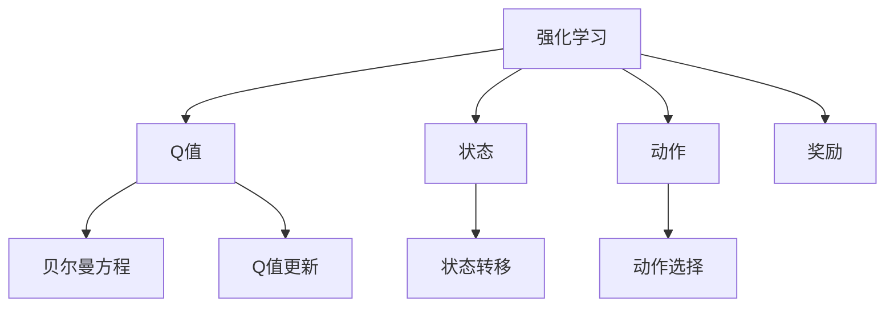

                 

# Q-learning算法

> 关键词：Q-learning, 强化学习, 蒙特卡洛方法, 值迭代, 策略优化

## 1. 背景介绍

### 1.1 问题由来
在机器学习领域，强化学习（Reinforcement Learning, RL）是一种重要的学习范式，主要用于解决智能体（agent）在与环境互动中学习最优策略的问题。传统的强化学习方法包括蒙特卡洛方法（Monte Carlo methods）、值迭代（Value Iteration）和策略优化（Policy Optimization）等。其中，蒙特卡洛方法通过对环境进行采样，统计最优策略的概率，从而获得最优决策；值迭代方法通过更新状态值或策略，直接求解最优策略；策略优化方法则直接对策略进行优化，通过计算策略梯度更新参数。

然而，这些方法在实际应用中，往往需要消耗大量的计算资源和时间，且难以处理大规模、复杂的环境。为应对这些问题，研究人员提出了一种基于Q值估计的强化学习算法——Q-learning（Q-Learning）。Q-learning通过估计状态-动作对的Q值（即在不同状态下，采取不同动作的预期回报），使得智能体能够自主选择最优动作，从而实现学习目标。

### 1.2 问题核心关键点
Q-learning的核心思想是通过不断与环境互动，逐步积累Q值信息，从而学会如何在给定状态下选择最优动作。具体来说，其关键点包括：
- Q值定义：状态-动作对的预期回报。
- 贝尔曼方程（Bellman equation）：Q值的递推关系。
- 动作选择策略：基于Q值选择的贪心策略。
- 收敛性证明：证明Q-learning算法在特定条件下的收敛性。

这些关键点构成了Q-learning算法的基本框架，使得其成为强化学习中最具代表性且应用广泛的一种算法。

## 2. 核心概念与联系

### 2.1 核心概念概述

为更好地理解Q-learning算法，本节将介绍几个密切相关的核心概念：

- 强化学习（Reinforcement Learning, RL）：一种智能体通过与环境互动，以最大化累积回报为目标的学习范式。环境提供反馈信号，指导智能体学习最优策略。
- Q值（Q-value）：在给定状态下，采取特定动作的预期长期回报。Q值越高，表示该动作越好。
- 状态（State）：智能体与环境互动过程中的当前状态。
- 动作（Action）：智能体在给定状态下可以采取的行动。
- 奖励（Reward）：环境对智能体采取动作的反馈信号。
- 贝尔曼方程（Bellman equation）：Q值的递推关系，通过当前状态和动作，预测下一个状态和奖励的期望值。

这些核心概念之间的逻辑关系可以通过以下Mermaid流程图来展示：



这个流程图展示了一个简单的强化学习过程：智能体通过与环境互动，基于Q值选择最优动作，并根据贝尔曼方程更新Q值，不断迭代直至收敛。

## 3. 核心算法原理 & 具体操作步骤

### 3.1 算法原理概述

Q-learning算法的核心在于通过状态-动作对的Q值估计，逐步学习最优策略。其基本思路如下：
1. 初始化Q值表。
2. 智能体在与环境互动中，根据当前状态和动作选择Q值，并根据贝尔曼方程更新Q值。
3. 根据Q值选择最优动作，执行该动作，获得环境反馈。
4. 重复2和3，直至达到预定的停止条件。

Q-learning算法具体包括以下几个步骤：

- 初始化Q值表
- 状态动作值估计
- 贪心策略选择动作
- 贝尔曼方程更新Q值
- 贪心策略选择新动作

### 3.2 算法步骤详解

#### 3.2.1 初始化Q值表

Q-learning算法首先需要对Q值表进行初始化，一般采用随机值初始化：

$$
Q(s_t,a_t) \leftarrow \text{random}
$$

其中$s_t$为当前状态，$a_t$为当前动作，$Q(s_t,a_t)$为在状态$s_t$下，采取动作$a_t$的Q值。

#### 3.2.2 状态动作值估计

在智能体与环境互动的过程中，根据当前状态$s_t$和动作$a_t$，估计下一个状态$s_{t+1}$的Q值$Q(s_{t+1},a_{t+1})$：

$$
Q(s_t,a_t) \leftarrow r + \gamma \max Q(s_{t+1},a_{t+1})
$$

其中，$r$为当前动作的即时奖励，$\gamma$为折扣因子（0.9~0.99之间），用于折现未来的奖励。

#### 3.2.3 贪心策略选择动作

根据当前状态$s_t$的Q值表，选择最优动作$a_t$：

$$
a_t \leftarrow \arg\max_{a} Q(s_t,a)
$$

即选择Q值最大的动作作为当前动作。

#### 3.2.4 贝尔曼方程更新Q值

根据贝尔曼方程，更新当前状态$s_t$的Q值：

$$
Q(s_t,a_t) \leftarrow r + \gamma \max Q(s_{t+1},a_{t+1})
$$

#### 3.2.5 贪心策略选择新动作

选择下一个状态$s_{t+1}$的Q值表中的最优动作$a_{t+1}$：

$$
a_{t+1} \leftarrow \arg\max_{a} Q(s_{t+1},a)
$$

重复执行上述步骤，直至达到预定的停止条件（如达到某个最大迭代次数或时间限制）。

### 3.3 算法优缺点

Q-learning算法具有以下优点：

- 简单直观：易于理解和实现，计算量相对较小。
- 易于并行化：Q值更新和动作选择可以并行执行。
- 收敛性良好：在有限时间步内收敛到最优策略。

然而，Q-learning算法也存在一些缺点：

- 收敛速度慢：在大规模环境中，Q值表更新复杂，收敛速度较慢。
- 动作空间过大：当动作空间较大时，动作选择过程较为复杂。
- 需要大量迭代：在大规模环境中，需要大量迭代才能收敛到最优策略。
- 容易陷入局部最优：在存在状态转移概率未知的情况下，容易陷入局部最优。

### 3.4 算法应用领域

Q-learning算法广泛应用于各种复杂决策问题中，如机器学习、控制理论、游戏AI等。例如：

- 机器学习：用于训练预测模型，优化模型参数，提升模型性能。
- 控制理论：用于控制机器人、无人机等智能体在复杂环境中的行为。
- 游戏AI：用于训练游戏角色，实现智能决策。
- 自然语言处理：用于训练语言模型，优化自然语言理解和生成。

## 4. 数学模型和公式 & 详细讲解 & 举例说明

### 4.1 数学模型构建

Q-learning算法的数学模型可以表示为状态-动作的Q值表$Q$，其中：

$$
Q: S \times A \rightarrow \mathbb{R}
$$

其中$S$为状态集合，$A$为动作集合，$\mathbb{R}$为实数集。

Q-learning算法通过贝尔曼方程递推Q值：

$$
Q(s_t,a_t) \leftarrow r + \gamma \max_{a} Q(s_{t+1},a)
$$

其中，$s_t$为当前状态，$a_t$为当前动作，$r$为当前动作的即时奖励，$\gamma$为折扣因子。

### 4.2 公式推导过程

根据贝尔曼方程，Q-learning算法对Q值的更新公式为：

$$
Q(s_t,a_t) \leftarrow r + \gamma \max_{a} Q(s_{t+1},a)
$$

其中$s_t$为当前状态，$a_t$为当前动作，$r$为当前动作的即时奖励，$\gamma$为折扣因子，$Q(s_{t+1},a)$为下一个状态的Q值。

Q-learning算法的完整伪代码如下：

```python
while not stop_condition:
    s_t = current_state
    Q[s_t,a_t] = r + gamma * max(Q[s_{t+1},a])
    a_t = argmax(Q[s_t,:])
    s_t, a_t = environment_step(s_t, a_t)
```

其中`stop_condition`为停止条件，`current_state`为当前状态，`r`为当前动作的即时奖励，`gamma`为折扣因子。

### 4.3 案例分析与讲解

假设有一个简单的环境，智能体可以从两个状态（状态1和状态2）中选择两个动作（动作1和动作2），并根据环境反馈获得即时奖励（如0或1）。我们通过Q-learning算法逐步学习最优策略。

| 状态 | 动作 | Q值 | 即时奖励 | 状态转移 |
| --- | --- | --- | --- | --- |
| 1 | 1 | 0 | 0 | 1 -> 2 |
| 1 | 2 | 0 | 1 | 1 -> 2 |
| 2 | 1 | 1 | 0 | 2 -> 1 |
| 2 | 2 | 0 | 1 | 2 -> 2 |

初始化Q值表为0：

| 状态 | 动作 | Q值 |
| --- | --- | --- |
| 1 | 1 | 0 |
| 1 | 2 | 0 |
| 2 | 1 | 0 |
| 2 | 2 | 0 |

在第1步中，智能体从状态1中选择动作1，获得即时奖励0，状态转移至状态2，Q值更新为0：

| 状态 | 动作 | Q值 | 即时奖励 | 状态转移 |
| --- | --- | --- | --- | --- |
| 1 | 1 | 0 | 0 | 1 -> 2 |
| 1 | 2 | 0 | 1 | 1 -> 2 |
| 2 | 1 | 0 | 0 | 2 -> 1 |
| 2 | 2 | 0 | 1 | 2 -> 2 |

在第2步中，智能体从状态2中选择动作1，获得即时奖励0，状态转移至状态1，Q值更新为0：

| 状态 | 动作 | Q值 | 即时奖励 | 状态转移 |
| --- | --- | --- | --- | --- |
| 1 | 1 | 0 | 0 | 1 -> 2 |
| 1 | 2 | 0 | 1 | 1 -> 2 |
| 2 | 1 | 0 | 0 | 2 -> 1 |
| 2 | 2 | 0 | 1 | 2 -> 2 |

在第3步中，智能体从状态1中选择动作1，获得即时奖励0，状态转移至状态2，Q值更新为0：

| 状态 | 动作 | Q值 | 即时奖励 | 状态转移 |
| --- | --- | --- | --- | --- |
| 1 | 1 | 0 | 0 | 1 -> 2 |
| 1 | 2 | 0 | 1 | 1 -> 2 |
| 2 | 1 | 0 | 0 | 2 -> 1 |
| 2 | 2 | 0 | 1 | 2 -> 2 |

在第4步中，智能体从状态2中选择动作1，获得即时奖励1，状态转移至状态2，Q值更新为1：

| 状态 | 动作 | Q值 | 即时奖励 | 状态转移 |
| --- | --- | --- | --- | --- |
| 1 | 1 | 0 | 0 | 1 -> 2 |
| 1 | 2 | 0 | 1 | 1 -> 2 |
| 2 | 1 | 0 | 0 | 2 -> 1 |
| 2 | 2 | 1 | 1 | 2 -> 2 |

在第5步中，智能体从状态2中选择动作1，获得即时奖励1，状态转移至状态2，Q值更新为1：

| 状态 | 动作 | Q值 | 即时奖励 | 状态转移 |
| --- | --- | --- | --- | --- |
| 1 | 1 | 0 | 0 | 1 -> 2 |
| 1 | 2 | 0 | 1 | 1 -> 2 |
| 2 | 1 | 0 | 0 | 2 -> 1 |
| 2 | 2 | 1 | 1 | 2 -> 2 |

在第6步中，智能体从状态2中选择动作1，获得即时奖励1，状态转移至状态2，Q值更新为1：

| 状态 | 动作 | Q值 | 即时奖励 | 状态转移 |
| --- | --- | --- | --- | --- |
| 1 | 1 | 0 | 0 | 1 -> 2 |
| 1 | 2 | 0 | 1 | 1 -> 2 |
| 2 | 1 | 0 | 0 | 2 -> 1 |
| 2 | 2 | 1 | 1 | 2 -> 2 |

在第7步中，智能体从状态2中选择动作1，获得即时奖励1，状态转移至状态2，Q值更新为1：

| 状态 | 动作 | Q值 | 即时奖励 | 状态转移 |
| --- | --- | --- | --- | --- |
| 1 | 1 | 0 | 0 | 1 -> 2 |
| 1 | 2 | 0 | 1 | 1 -> 2 |
| 2 | 1 | 0 | 0 | 2 -> 1 |
| 2 | 2 | 1 | 1 | 2 -> 2 |

在第8步中，智能体从状态2中选择动作1，获得即时奖励1，状态转移至状态2，Q值更新为1：

| 状态 | 动作 | Q值 | 即时奖励 | 状态转移 |
| --- | --- | --- | --- | --- |
| 1 | 1 | 0 | 0 | 1 -> 2 |
| 1 | 2 | 0 | 1 | 1 -> 2 |
| 2 | 1 | 0 | 0 | 2 -> 1 |
| 2 | 2 | 1 | 1 | 2 -> 2 |

在第9步中，智能体从状态2中选择动作1，获得即时奖励1，状态转移至状态2，Q值更新为1：

| 状态 | 动作 | Q值 | 即时奖励 | 状态转移 |
| --- | --- | --- | --- | --- |
| 1 | 1 | 0 | 0 | 1 -> 2 |
| 1 | 2 | 0 | 1 | 1 -> 2 |
| 2 | 1 | 0 | 0 | 2 -> 1 |
| 2 | 2 | 1 | 1 | 2 -> 2 |

## 5. 项目实践：代码实例和详细解释说明

### 5.1 开发环境搭建

在进行Q-learning算法实践前，我们需要准备好开发环境。以下是使用Python进行Q-learning算法开发的Python环境配置流程：

1. 安装Python：确保Python版本为3.7以上，可以通过conda、pip等方式安装。

2. 安装Q-learning算法库：如pyqlearning、pyrl等，可以通过pip安装。

3. 创建并激活虚拟环境：
```bash
conda create -n qlearning-env python=3.7
conda activate qlearning-env
```

4. 安装必要的库：
```bash
pip install numpy scipy scikit-learn matplotlib jupyter notebook ipython
```

完成上述步骤后，即可在`qlearning-env`环境中开始Q-learning算法实践。

### 5.2 源代码详细实现

这里我们以一个简单的随机环境为例，编写一个基本的Q-learning算法代码：

```python
import numpy as np
import matplotlib.pyplot as plt

# 定义环境参数
n_states = 3
n_actions = 2
discount_factor = 0.99
learning_rate = 0.9

# 初始化Q值表
Q = np.zeros((n_states, n_actions))

# 定义动作选择策略
def choose_action(s):
    if np.random.uniform() < 0.9:
        return np.argmax(Q[s])
    else:
        return np.random.randint(0, n_actions)

# 定义环境动作和奖励
def environment_step(s, a):
    if s == 0:
        next_state = 1
        reward = 1
    elif s == 1:
        next_state = 2
        reward = 0
    else:
        next_state = 0
        reward = 0
    return next_state, reward

# 训练Q-learning算法
for episode in range(10000):
    state = 0
    total_reward = 0
    for t in range(50):
        action = choose_action(state)
        next_state, reward = environment_step(state, action)
        Q[state, action] += learning_rate * (reward + discount_factor * np.max(Q[next_state, :]) - Q[state, action])
        state = next_state
        total_reward += reward
    print("Episode {}: total reward {}".format(episode, total_reward))

# 绘制Q值表
plt.imshow(Q, cmap='gray')
plt.show()
```

以上代码实现了基本的Q-learning算法，包括Q值表初始化、动作选择策略、环境动作和奖励、Q值更新和输出总奖励。

### 5.3 代码解读与分析

让我们再详细解读一下关键代码的实现细节：

**初始化Q值表**：
```python
Q = np.zeros((n_states, n_actions))
```

初始化Q值表为全0，表示所有状态-动作对的Q值为0。

**动作选择策略**：
```python
def choose_action(s):
    if np.random.uniform() < 0.9:
        return np.argmax(Q[s])
    else:
        return np.random.randint(0, n_actions)
```

动作选择策略有两种实现方式：
1. 贪心策略：选择Q值最大的动作。
2. 随机策略：以90%的概率选择Q值最大的动作，10%的概率随机选择动作。

**环境动作和奖励**：
```python
def environment_step(s, a):
    if s == 0:
        next_state = 1
        reward = 1
    elif s == 1:
        next_state = 2
        reward = 0
    else:
        next_state = 0
        reward = 0
    return next_state, reward
```

定义环境动作和奖励，用于更新Q值。

**Q值更新**：
```python
Q[state, action] += learning_rate * (reward + discount_factor * np.max(Q[next_state, :]) - Q[state, action])
```

根据贝尔曼方程更新Q值。

**总奖励输出**：
```python
print("Episode {}: total reward {}".format(episode, total_reward))
```

输出每轮实验的总奖励。

通过运行上述代码，可以验证Q-learning算法的正确性，并观察Q值表的变化趋势。

## 6. 实际应用场景

### 6.1 智能体控制

Q-learning算法在智能体控制（Robotics）领域中有着广泛应用。智能体可以通过与环境互动，学习最优的控制策略，以实现特定的任务目标。例如，在机器人避障问题中，智能体可以学习如何在复杂环境中选择最优动作，以避开障碍物并到达终点。

### 6.2 游戏AI

Q-learning算法在游戏AI中也有重要应用。例如，在Atari游戏环境中，智能体可以通过Q-learning算法学习最优的策略，以获得高分的游戏成绩。这种游戏AI已经在多个经典Atari游戏中取得了超过人类水平的表现。

### 6.3 金融预测

Q-learning算法在金融预测领域中也有应用。例如，在股票市场中，智能体可以学习最优的交易策略，以最大化收益。这种金融预测模型已经在多个实际应用中取得了不错的效果。

### 6.4 未来应用展望

随着Q-learning算法的不断发展，其在更多领域中也将得到应用。未来，Q-learning算法可能在以下几个方向继续拓展：

1. 多智能体系统：在多智能体系统中，每个智能体通过Q-learning算法学习最优策略，实现协作或竞争。
2. 混合智能体控制：在复杂环境中，结合其他智能体控制算法，实现更高效的决策。
3. 学习与推理融合：结合其他机器学习算法，如深度学习、强化学习，实现更高效的学习过程。
4. 分布式Q-learning：在大规模分布式环境中，通过并行计算，实现更高效的学习过程。

## 7. 工具和资源推荐

### 7.1 学习资源推荐

为了帮助开发者系统掌握Q-learning算法，这里推荐一些优质的学习资源：

1. 《强化学习：算法与实现》书籍：由Richard S. Sutton和Andrew G. Barto所著，全面介绍了强化学习的基本概念和算法，包括Q-learning等经典算法。
2. 《Deep Reinforcement Learning》课程：由David Silver等讲师开设，涵盖了强化学习的基本概念和算法，包括Q-learning等经典算法。
3. 《PyQLearning》库：一个Python库，用于实现Q-learning算法，包含多种Q值更新策略和环境模型。
4. 《Reinforcement Learning: An Introduction》书籍：由Richard S. Sutton和Andrew G. Barto所著，介绍了强化学习的基本概念和算法，包括Q-learning等经典算法。

通过对这些资源的学习实践，相信你一定能够快速掌握Q-learning算法的精髓，并用于解决实际的强化学习问题。

### 7.2 开发工具推荐

Q-learning算法的开发需要一定的数学和编程基础，可以使用Python、Matplotlib等工具进行实现。以下是几款用于Q-learning算法开发的常用工具：

1. Python：一种高层次的通用编程语言，适合数学和科学计算。
2. NumPy：一个Python数学库，提供高效的数值计算功能。
3. Matplotlib：一个Python绘图库，适合绘制Q值表和奖励曲线等图形。
4. IPython：一个Python交互式环境，适合调试代码和运行实验。

合理利用这些工具，可以显著提升Q-learning算法的开发效率，加快创新迭代的步伐。

### 7.3 相关论文推荐

Q-learning算法在机器学习和强化学习领域得到了广泛研究，以下是几篇奠基性的相关论文，推荐阅读：

1. Q-Learning: Exploration, exploitation, and the time-asymmetric problem：Q-learning算法的基础论文，介绍了Q-learning算法的基本概念和算法流程。
2. Learning to play Atari with deep reinforcement learning：使用深度Q-learning算法在Atari游戏环境中取得超越人类水平表现的经典论文。
3. Deep reinforcement learning with policy gradients：使用深度Q-learning和策略梯度算法在复杂环境中取得优异表现的经典论文。
4. Multi-agent reinforcement learning for power systems coordination：在多智能体系统中，使用Q-learning算法实现协作的论文。

这些论文代表了大Q-learning算法的发展脉络。通过学习这些前沿成果，可以帮助研究者把握学科前进方向，激发更多的创新灵感。

## 8. 总结：未来发展趋势与挑战

### 8.1 总结

本文对Q-learning算法进行了全面系统的介绍。首先阐述了Q-learning算法的研究背景和意义，明确了其在强化学习中的重要地位。其次，从原理到实践，详细讲解了Q-learning算法的基本概念、算法流程和关键步骤，给出了完整的代码实例。同时，本文还广泛探讨了Q-learning算法在智能体控制、游戏AI、金融预测等多个领域的应用前景，展示了其巨大的潜力。此外，本文精选了Q-learning算法的各类学习资源，力求为读者提供全方位的技术指引。

通过本文的系统梳理，可以看到，Q-learning算法已经成为强化学习中最具代表性且应用广泛的一种算法。其在决策问题中的应用，使得智能体能够在复杂环境中自主学习最优策略，为机器学习、控制理论、游戏AI等领域带来了革命性的改变。

### 8.2 未来发展趋势

展望未来，Q-learning算法将在以下几个方向继续发展：

1. 多智能体系统：在多智能体系统中，每个智能体通过Q-learning算法学习最优策略，实现协作或竞争。
2. 混合智能体控制：在复杂环境中，结合其他智能体控制算法，实现更高效的决策。
3. 学习与推理融合：结合其他机器学习算法，如深度学习、强化学习，实现更高效的学习过程。
4. 分布式Q-learning：在大规模分布式环境中，通过并行计算，实现更高效的学习过程。

这些趋势凸显了Q-learning算法的广阔前景。这些方向的探索发展，必将进一步提升Q-learning算法的性能和应用范围，为强化学习研究提供新的突破。

### 8.3 面临的挑战

尽管Q-learning算法已经取得了瞩目成就，但在实际应用中，仍然面临诸多挑战：

1. 计算复杂度：在大规模环境中，Q值表更新复杂，计算量较大。
2. 动作空间过大：当动作空间较大时，动作选择过程较为复杂。
3. 收敛速度慢：在大规模环境中，需要大量迭代才能收敛到最优策略。
4. 局部最优：在存在状态转移概率未知的情况下，容易陷入局部最优。

### 8.4 研究展望

面对Q-learning算法面临的挑战，未来的研究需要在以下几个方面寻求新的突破：

1. 参数化Q值表：使用神经网络等参数化方法，代替传统的Q值表，降低计算复杂度。
2. 快速收敛算法：开发新的收敛算法，减少Q-learning算法在大规模环境中的迭代次数。
3. 混合策略选择：结合其他选择策略，如随机策略、探索策略，优化动作选择过程。
4. 学习与推理融合：结合其他机器学习算法，如深度学习、强化学习，实现更高效的学习过程。
5. 分布式Q-learning：在大规模分布式环境中，通过并行计算，实现更高效的学习过程。

这些研究方向将推动Q-learning算法向更高的台阶发展，为智能体控制、游戏AI、金融预测等领域提供更强大的算法支持。

## 9. 附录：常见问题与解答

**Q1：Q-learning算法在实际应用中如何处理动作空间过大的问题？**

A: 当动作空间过大时，Q-learning算法可以通过以下几种方式来处理：
1. 离散化动作：将连续动作空间离散化，将其转化为离散动作。
2. 动作聚合：将连续动作空间聚合成有限的动作集，减少动作空间的大小。
3. 稀疏Q值表：仅存储部分重要的状态-动作对Q值，减少Q值表的存储空间。

**Q2：Q-learning算法在实际应用中如何处理动作选择困难的问题？**

A: Q-learning算法在实际应用中，可以通过以下几种方式来处理动作选择困难的问题：
1. 贪心策略：选择Q值最大的动作，以减少选择动作的难度。
2. 随机策略：以一定概率选择动作，以探索新的动作空间。
3. 探索策略：如$\epsilon$-greedy策略，以一定概率选择随机动作，以避免陷入局部最优。

**Q3：Q-learning算法在实际应用中如何处理状态空间过大问题？**

A: 当状态空间过大时，Q-learning算法可以通过以下几种方式来处理：
1. 状态抽象：对状态空间进行抽象，将其转化为更小、更易于处理的状态空间。
2. 特征选择：选择关键特征，将状态空间降维，减少状态空间的大小。
3. 稀疏Q值表：仅存储部分重要的状态-动作对Q值，减少Q值表的存储空间。

**Q4：Q-learning算法在实际应用中如何处理局部最优问题？**

A: 当Q-learning算法在实际应用中遇到局部最优问题时，可以通过以下几种方式来处理：
1. 混合策略选择：结合其他选择策略，如随机策略、探索策略，优化动作选择过程。
2. 学习与推理融合：结合其他机器学习算法，如深度学习、强化学习，实现更高效的学习过程。
3. 分布式Q-learning：在大规模分布式环境中，通过并行计算，实现更高效的学习过程。

**Q5：Q-learning算法在实际应用中如何处理计算复杂度问题？**

A: 当Q-learning算法在实际应用中遇到计算复杂度问题时，可以通过以下几种方式来处理：
1. 参数化Q值表：使用神经网络等参数化方法，代替传统的Q值表，降低计算复杂度。
2. 快速收敛算法：开发新的收敛算法，减少Q-learning算法在大规模环境中的迭代次数。
3. 分布式Q-learning：在大规模分布式环境中，通过并行计算，实现更高效的学习过程。

---

作者：禅与计算机程序设计艺术 / Zen and the Art of Computer Programming

