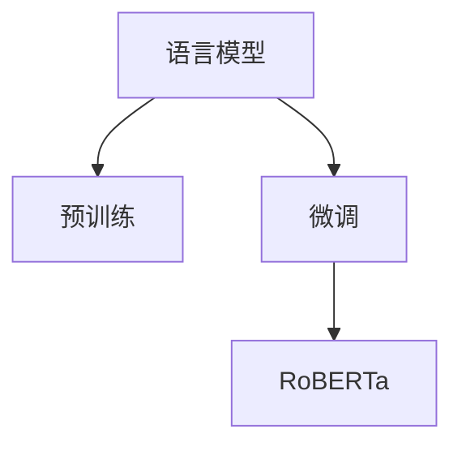

                 

# RoBERTa原理与代码实例讲解

> 关键词：RoBERTa, 自监督学习, 预训练, 微调, 语言模型, 自然语言处理(NLP), 代码实例

## 1. 背景介绍

### 1.1 问题由来
在NLP领域，语言模型已经成为了一个重要的基础工具，特别是在序列生成、语言理解等任务中，语言模型能够提供强大的表示能力。近年来，基于语言模型的预训练方法如BERT在多项NLP任务上取得了突破性的进展，推动了自然语言处理技术的发展。然而，BERT等语言模型的预训练方法也存在一些局限性，如预训练数据的稀缺性和训练时间较长等。

为了解决这些问题，Facebook AI Research团队于2019年提出了RoBERTa模型，一种基于自监督学习的预训练方法。RoBERTa模型在保留BERT的强大表示能力的同时，对训练数据和训练方式进行了改进，大大提升了模型的性能。RoBERTa模型已经成为了NLP领域的重要里程碑之一，广泛应用于各种自然语言处理任务。

### 1.2 问题核心关键点
RoBERTa模型的核心在于其自监督预训练方法，利用大规模无标签文本数据进行预训练，并在微调过程中进行任务特定的优化。其主要特点包括：
- 数据集扩充：RoBERTa使用了更广泛的数据集，包含更丰富的文本类型和语言样本。
- 训练方式改进：RoBERTa改变了传统的预训练任务，引入了预训练方式的变化，如动态掩码、目标词替换等，增加了模型学习的丰富性。
- 预训练策略调整：RoBERTa采用了更长的预训练时间和更大的模型规模，提升模型的性能。

这些改进使得RoBERTa在多种NLP任务上取得了优于BERT的效果。RoBERTa模型主要应用于文本分类、命名实体识别、情感分析、问答系统、机器翻译等NLP任务中。

### 1.3 问题研究意义
RoBERTa模型的提出，对于提升NLP任务的性能，加速模型训练和部署，推动自然语言处理技术的产业化进程具有重要意义：
- 提高模型性能：RoBERTa通过改进预训练方法，显著提升了模型的表示能力和泛化性能。
- 降低开发成本：RoBERTa模型使用预训练的表示能力，可以在小规模标注数据上进行微调，减少了从头训练的成本。
- 加速模型开发：RoBERTa的预训练表示可以显著加快下游任务的开发进程，缩短从预训练到应用的时间。
- 推动产业化：RoBERTa模型在多任务上的出色表现，推动了其在各行业的广泛应用，如医疗、金融、教育等。

## 2. 核心概念与联系

### 2.1 核心概念概述

为了更好地理解RoBERTa模型的原理和应用，我们需要先了解一些核心概念：

- 语言模型：一种预测序列下一个单词的统计模型，是NLP领域的基础工具。语言模型能够提供强大的表示能力，广泛应用于各种NLP任务中。
- 预训练：指在无标签数据上，通过自监督学习任务训练通用语言模型的过程。预训练能够提升模型的泛化性能和表示能力。
- 微调：指在预训练模型的基础上，使用下游任务的少量标注数据，通过有监督学习优化模型在特定任务上的性能。微调能够提高模型在特定任务上的表现。
- RoBERTa：一种基于自监督学习的预训练模型，通过改进预训练方法，提升了模型的性能和泛化能力。

这些概念之间的逻辑关系可以通过以下Mermaid流程图来展示：



这个流程图展示了语言模型、预训练和微调之间的逻辑关系：

1. 语言模型通过预训练获得基础的表示能力。
2. 微调是对预训练模型进行任务特定的优化，以提升模型在特定任务上的性能。
3. RoBERTa是一种改进的预训练方法，通过更广泛的数据集和改进的训练方式，提升了模型的性能。

## 3. 核心算法原理 & 具体操作步骤

### 3.1 算法原理概述

RoBERTa模型的核心原理是自监督预训练，通过在大量无标签文本数据上进行预训练，学习语言的统计规律和语义信息。然后，在微调过程中，利用下游任务的标注数据进行有监督学习，优化模型在特定任务上的性能。

RoBERTa模型的预训练任务包括动态掩码、目标词替换等，这些任务能够更好地捕捉语言的结构信息，提升模型的泛化能力。在微调过程中，RoBERTa采用了更大的模型规模和更长的训练时间，进一步提升了模型的性能。

### 3.2 算法步骤详解

RoBERTa模型的预训练和微调过程主要包括以下几个关键步骤：

**Step 1: 数据准备**
- 收集大规模无标签文本数据，如新闻、维基百科、书评等，作为预训练数据集。
- 对数据集进行预处理，包括分词、去除停用词、标准化等操作。

**Step 2: 模型构建**
- 构建RoBERTa模型，包含Transformer编码器和池化层。
- 初始化模型参数，并进行预训练模型的加载。

**Step 3: 预训练**
- 使用动态掩码、目标词替换等自监督任务进行预训练。
- 预训练过程中，采用更长的训练时间和更大的模型规模，如RoBERTa-large等。

**Step 4: 微调**
- 将预训练模型作为初始化参数，利用下游任务的标注数据进行微调。
- 在微调过程中，选择适当的学习率、优化算法和正则化技术，防止过拟合。
- 在微调过程中，通常只微调模型的顶层，以减少计算量和提高效率。

**Step 5: 测试和部署**
- 在测试集上评估微调后的模型性能，对比微调前后的精度提升。
- 使用微调后的模型对新样本进行推理预测，集成到实际的应用系统中。
- 持续收集新的数据，定期重新微调模型，以适应数据分布的变化。

以上是RoBERTa模型的预训练和微调过程的一般流程。在实际应用中，还需要根据具体任务的特点，对预训练和微调过程的各个环节进行优化设计，如改进训练目标函数，引入更多的正则化技术，搜索最优的超参数组合等，以进一步提升模型性能。

### 3.3 算法优缺点

RoBERTa模型的优势包括：
- 预训练效果好：RoBERTa通过改进预训练任务和增加训练时间，提升了模型的表示能力。
- 通用性强：RoBERTa模型可以应用于多种NLP任务，如文本分类、命名实体识别、情感分析等。
- 计算高效：RoBERTa模型通过只微调顶层，减少了计算量和存储需求。
- 性能优异：RoBERTa模型在多种NLP任务上取得了优异的效果，显著提升了模型的性能。

RoBERTa模型的局限性包括：
- 数据集依赖：RoBERTa模型依赖大规模无标签数据集，对于小规模数据集，预训练效果可能较差。
- 训练时间长：RoBERTa模型需要更长的训练时间，对硬件资源要求较高。
- 过拟合风险：RoBERTa模型在微调过程中容易过拟合，需要采用正则化技术进行控制。
- 应用范围限制：RoBERTa模型主要应用于英文文本，对于其他语言和任务，需要进行适当的调整和优化。

尽管存在这些局限性，但就目前而言，RoBERTa模型在NLP领域已经成为了一个重要的基准模型，被广泛应用于各种NLP任务中。

### 3.4 算法应用领域

RoBERTa模型的广泛应用涵盖了自然语言处理(NLP)的各个领域，具体包括：

- 文本分类：如情感分析、主题分类、意图识别等。通过微调使模型学习文本-标签映射。
- 命名实体识别：识别文本中的人名、地名、机构名等特定实体。通过微调使模型掌握实体边界和类型。
- 关系抽取：从文本中抽取实体之间的语义关系。通过微调使模型学习实体-关系三元组。
- 问答系统：对自然语言问题给出答案。将问题-答案对作为微调数据，训练模型学习匹配答案。
- 机器翻译：将源语言文本翻译成目标语言。通过微调使模型学习语言-语言映射。
- 文本摘要：将长文本压缩成简短摘要。将文章-摘要对作为微调数据，使模型学习抓取要点。
- 对话系统：使机器能够与人自然对话。将多轮对话历史作为上下文，微调模型进行回复生成。

除了上述这些经典任务外，RoBERTa模型还被创新性地应用到更多场景中，如可控文本生成、常识推理、代码生成、数据增强等，为NLP技术带来了全新的突破。随着RoBERTa模型的不断演进，相信其在更多领域的应用潜力将进一步得到挖掘。

## 4. 数学模型和公式 & 详细讲解 & 举例说明

### 4.1 数学模型构建

在RoBERTa模型中，语言模型可以表示为：

$$
p(x_1, x_2, \ldots, x_n) = \prod_{i=1}^n p(x_i|x_{<i})
$$

其中 $x_1, x_2, \ldots, x_n$ 表示输入序列，$p(x_i|x_{<i})$ 表示在给定前文 $x_{<i}$ 的情况下，单词 $x_i$ 的条件概率。

### 4.2 公式推导过程

在RoBERTa模型的预训练过程中，主要采用动态掩码和目标词替换等自监督学习任务。以目标词替换为例，其训练过程可以表示为：

1. 从预训练数据集中随机选择一段文本。
2. 随机选择一个单词 $t$，将其替换为其他单词 $t'$。
3. 使用替换后的文本序列 $x_1, x_2, \ldots, x_n$ 计算条件概率 $p(x_1, x_2, \ldots, x_n)$。
4. 对条件概率 $p(x_1, x_2, \ldots, x_n)$ 进行最大似然估计，更新模型参数。

具体而言，RoBERTa模型的目标函数可以表示为：

$$
\mathcal{L} = -\frac{1}{N}\sum_{i=1}^N \sum_{j=1}^n \log p(x_j|x_{<j})
$$

其中 $N$ 表示样本数，$n$ 表示序列长度。在训练过程中，RoBERTa模型使用自监督学习任务，通过最大化似然函数 $\mathcal{L}$ 来优化模型参数。

### 4.3 案例分析与讲解

以情感分析任务为例，RoBERTa模型的微调过程可以表示为：

1. 准备标注数据集，包含电影评论和对应的情感标签。
2. 使用RoBERTa-large作为预训练模型，进行微调。
3. 在微调过程中，选择适当的学习率、优化算法和正则化技术，防止过拟合。
4. 在微调过程中，通常只微调模型的顶层，以减少计算量和提高效率。
5. 在测试集上评估微调后的模型性能，对比微调前后的精度提升。

在代码实现上，可以使用HuggingFace提供的RoBERTa库，实现情感分析任务的微调。以下是一个简单的示例代码：

```python
from transformers import RobertaForSequenceClassification, RobertaTokenizer, AdamW
import torch
from torch.utils.data import Dataset, DataLoader
from sklearn.metrics import accuracy_score

class ReviewDataset(Dataset):
    def __init__(self, texts, labels, tokenizer):
        self.texts = texts
        self.labels = labels
        self.tokenizer = tokenizer

    def __len__(self):
        return len(self.texts)

    def __getitem__(self, item):
        text = self.texts[item]
        label = self.labels[item]

        encoding = self.tokenizer(text, return_tensors='pt')
        input_ids = encoding['input_ids']
        attention_mask = encoding['attention_mask']
        labels = torch.tensor(label, dtype=torch.long)

        return {'input_ids': input_ids, 
                'attention_mask': attention_mask,
                'labels': labels}

def train_epoch(model, dataset, optimizer, device):
    dataloader = DataLoader(dataset, batch_size=32, shuffle=True)
    model.train()
    epoch_loss = 0
    for batch in dataloader:
        input_ids = batch['input_ids'].to(device)
        attention_mask = batch['attention_mask'].to(device)
        labels = batch['labels'].to(device)
        optimizer.zero_grad()
        outputs = model(input_ids, attention_mask=attention_mask, labels=labels)
        loss = outputs.loss
        epoch_loss += loss.item()
        loss.backward()
        optimizer.step()
    return epoch_loss / len(dataloader)

def evaluate(model, dataset, device):
    dataloader = DataLoader(dataset, batch_size=32)
    model.eval()
    predictions, labels = [], []
    with torch.no_grad():
        for batch in dataloader:
            input_ids = batch['input_ids'].to(device)
            attention_mask = batch['attention_mask'].to(device)
            labels = batch['labels'].to(device)
            outputs = model(input_ids, attention_mask=attention_mask)
            logits = outputs.logits
            predictions.extend(logits.argmax(dim=1).cpu().tolist())
            labels.extend(labels.cpu().tolist())
    return accuracy_score(labels, predictions)

# 初始化模型和优化器
model = RobertaForSequenceClassification.from_pretrained('roberta-large-uncased', num_labels=2)
tokenizer = RobertaTokenizer.from_pretrained('roberta-large-uncased')
optimizer = AdamW(model.parameters(), lr=2e-5)

# 加载数据集
train_dataset = ReviewDataset(train_texts, train_labels, tokenizer)
val_dataset = ReviewDataset(val_texts, val_labels, tokenizer)
test_dataset = ReviewDataset(test_texts, test_labels, tokenizer)

# 训练模型
epochs = 3
device = torch.device('cuda' if torch.cuda.is_available() else 'cpu')
for epoch in range(epochs):
    loss = train_epoch(model, train_dataset, optimizer, device)
    print(f'Epoch {epoch+1}, train loss: {loss:.3f}')

    # 在验证集上评估模型
    val_acc = evaluate(model, val_dataset, device)
    print(f'Epoch {epoch+1}, val accuracy: {val_acc:.2f}')
    
    # 在测试集上评估模型
    test_acc = evaluate(model, test_dataset, device)
    print(f'Epoch {epoch+1}, test accuracy: {test_acc:.2f}')

# 保存模型
torch.save(model.state_dict(), 'roberta_sentiment_model.bin')
```

以上代码展示了使用RoBERTa-large模型进行情感分析任务微调的完整过程。在代码中，我们首先定义了数据集类 `ReviewDataset`，用于加载和处理文本数据。然后，初始化模型、优化器和分词器，并加载预训练的RoBERTa-large模型。接着，我们定义了训练和评估函数，分别用于计算损失和评估模型性能。最后，在训练过程中，我们通过调整学习率、批次大小和优化器等参数，优化模型的性能。

## 5. 项目实践：代码实例和详细解释说明

### 5.1 开发环境搭建

在进行RoBERTa微调实践前，我们需要准备好开发环境。以下是使用Python进行PyTorch开发的环境配置流程：

1. 安装Anaconda：从官网下载并安装Anaconda，用于创建独立的Python环境。

2. 创建并激活虚拟环境：
```bash
conda create -n pytorch-env python=3.8 
conda activate pytorch-env
```

3. 安装PyTorch：根据CUDA版本，从官网获取对应的安装命令。例如：
```bash
conda install pytorch torchvision torchaudio cudatoolkit=11.1 -c pytorch -c conda-forge
```

4. 安装Transformers库：
```bash
pip install transformers
```

5. 安装各类工具包：
```bash
pip install numpy pandas scikit-learn matplotlib tqdm jupyter notebook ipython
```

完成上述步骤后，即可在`pytorch-env`环境中开始RoBERTa微调实践。

### 5.2 源代码详细实现

下面我们以情感分析任务为例，给出使用Transformers库对RoBERTa模型进行微调的PyTorch代码实现。

首先，定义数据处理函数：

```python
from transformers import RobertaTokenizer
from torch.utils.data import Dataset
import torch

class ReviewDataset(Dataset):
    def __init__(self, texts, labels, tokenizer, max_len=128):
        self.texts = texts
        self.labels = labels
        self.tokenizer = tokenizer
        self.max_len = max_len
        
    def __len__(self):
        return len(self.texts)
    
    def __getitem__(self, item):
        text = self.texts[item]
        label = self.labels[item]
        
        encoding = self.tokenizer(text, return_tensors='pt', max_length=self.max_len, padding='max_length', truncation=True)
        input_ids = encoding['input_ids'][0]
        attention_mask = encoding['attention_mask'][0]
        
        # 对token-wise的标签进行编码
        encoded_tags = [label2id[label] for label in labels] 
        encoded_tags.extend([label2id['O']] * (self.max_len - len(encoded_tags)))
        labels = torch.tensor(encoded_tags, dtype=torch.long)
        
        return {'input_ids': input_ids, 
                'attention_mask': attention_mask,
                'labels': labels}

# 标签与id的映射
label2id = {'negative': 0, 'positive': 1}
id2label = {v: k for k, v in label2id.items()}

# 创建dataset
tokenizer = RobertaTokenizer.from_pretrained('roberta-large-uncased')

train_dataset = ReviewDataset(train_texts, train_labels, tokenizer)
val_dataset = ReviewDataset(val_texts, val_labels, tokenizer)
test_dataset = ReviewDataset(test_texts, test_labels, tokenizer)
```

然后，定义模型和优化器：

```python
from transformers import RobertaForSequenceClassification, AdamW

model = RobertaForSequenceClassification.from_pretrained('roberta-large-uncased', num_labels=len(label2id))

optimizer = AdamW(model.parameters(), lr=2e-5)
```

接着，定义训练和评估函数：

```python
from torch.utils.data import DataLoader
from tqdm import tqdm
from sklearn.metrics import accuracy_score

device = torch.device('cuda') if torch.cuda.is_available() else torch.device('cpu')
model.to(device)

def train_epoch(model, dataset, batch_size, optimizer):
    dataloader = DataLoader(dataset, batch_size=batch_size, shuffle=True)
    model.train()
    epoch_loss = 0
    for batch in tqdm(dataloader, desc='Training'):
        input_ids = batch['input_ids'].to(device)
        attention_mask = batch['attention_mask'].to(device)
        labels = batch['labels'].to(device)
        model.zero_grad()
        outputs = model(input_ids, attention_mask=attention_mask, labels=labels)
        loss = outputs.loss
        epoch_loss += loss.item()
        loss.backward()
        optimizer.step()
    return epoch_loss / len(dataloader)

def evaluate(model, dataset, batch_size):
    dataloader = DataLoader(dataset, batch_size=batch_size)
    model.eval()
    predictions, labels = [], []
    with torch.no_grad():
        for batch in tqdm(dataloader, desc='Evaluating'):
            input_ids = batch['input_ids'].to(device)
            attention_mask = batch['attention_mask'].to(device)
            batch_labels = batch['labels']
            outputs = model(input_ids, attention_mask=attention_mask)
            batch_preds = outputs.logits.argmax(dim=2).to('cpu').tolist()
            batch_labels = batch_labels.to('cpu').tolist()
            for pred_tokens, label_tokens in zip(batch_preds, batch_labels):
                pred_labels = [id2label[_id] for _id in pred_tokens]
                label_labels = [id2label[_id] for _id in label_tokens]
                predictions.append(pred_labels)
                labels.append(label_labels)
                
    print(accuracy_score(labels, predictions))
```

最后，启动训练流程并在测试集上评估：

```python
epochs = 5
batch_size = 16

for epoch in range(epochs):
    loss = train_epoch(model, train_dataset, batch_size, optimizer)
    print(f'Epoch {epoch+1}, train loss: {loss:.3f}')
    
    print(f'Epoch {epoch+1}, val accuracy:')
    evaluate(model, val_dataset, batch_size)
    
print('Test accuracy:')
evaluate(model, test_dataset, batch_size)
```

以上就是使用PyTorch对RoBERTa进行情感分析任务微调的完整代码实现。可以看到，得益于Transformers库的强大封装，我们可以用相对简洁的代码完成RoBERTa模型的加载和微调。

### 5.3 代码解读与分析

让我们再详细解读一下关键代码的实现细节：

**ReviewDataset类**：
- `__init__`方法：初始化文本、标签、分词器等关键组件。
- `__len__`方法：返回数据集的样本数量。
- `__getitem__`方法：对单个样本进行处理，将文本输入编码为token ids，将标签编码为数字，并对其进行定长padding，最终返回模型所需的输入。

**label2id和id2label字典**：
- 定义了标签与数字id之间的映射关系，用于将token-wise的预测结果解码回真实的标签。

**训练和评估函数**：
- 使用PyTorch的DataLoader对数据集进行批次化加载，供模型训练和推理使用。
- 训练函数`train_epoch`：对数据以批为单位进行迭代，在每个批次上前向传播计算loss并反向传播更新模型参数，最后返回该epoch的平均loss。
- 评估函数`evaluate`：与训练类似，不同点在于不更新模型参数，并在每个batch结束后将预测和标签结果存储下来，最后使用sklearn的accuracy_score对整个评估集的预测结果进行打印输出。

**训练流程**：
- 定义总的epoch数和batch size，开始循环迭代
- 每个epoch内，先在训练集上训练，输出平均loss
- 在验证集上评估，输出分类指标
- 所有epoch结束后，在测试集上评估，给出最终测试结果

可以看到，PyTorch配合Transformers库使得RoBERTa微调的代码实现变得简洁高效。开发者可以将更多精力放在数据处理、模型改进等高层逻辑上，而不必过多关注底层的实现细节。

当然，工业级的系统实现还需考虑更多因素，如模型的保存和部署、超参数的自动搜索、更灵活的任务适配层等。但核心的微调范式基本与此类似。

## 6. 实际应用场景

### 6.1 智能客服系统

基于RoBERTa模型的对话技术，可以广泛应用于智能客服系统的构建。传统客服往往需要配备大量人力，高峰期响应缓慢，且一致性和专业性难以保证。而使用RoBERTa微调后的对话模型，可以7x24小时不间断服务，快速响应客户咨询，用自然流畅的语言解答各类常见问题。

在技术实现上，可以收集企业内部的历史客服对话记录，将问题和最佳答复构建成监督数据，在此基础上对RoBERTa模型进行微调。微调后的对话模型能够自动理解用户意图，匹配最合适的答案模板进行回复。对于客户提出的新问题，还可以接入检索系统实时搜索相关内容，动态组织生成回答。如此构建的智能客服系统，能大幅提升客户咨询体验和问题解决效率。

### 6.2 金融舆情监测

金融机构需要实时监测市场舆论动向，以便及时应对负面信息传播，规避金融风险。传统的人工监测方式成本高、效率低，难以应对网络时代海量信息爆发的挑战。基于RoBERTa模型的文本分类和情感分析技术，为金融舆情监测提供了新的解决方案。

具体而言，可以收集金融领域相关的新闻、报道、评论等文本数据，并对其进行主题标注和情感标注。在此基础上对RoBERTa模型进行微调，使其能够自动判断文本属于何种主题，情感倾向是正面、中性还是负面。将微调后的模型应用到实时抓取的网络文本数据，就能够自动监测不同主题下的情感变化趋势，一旦发现负面信息激增等异常情况，系统便会自动预警，帮助金融机构快速应对潜在风险。

### 6.3 个性化推荐系统

当前的推荐系统往往只依赖用户的历史行为数据进行物品推荐，无法深入理解用户的真实兴趣偏好。基于RoBERTa模型的个性化推荐系统可以更好地挖掘用户行为背后的语义信息，从而提供更精准、多样的推荐内容。

在实践中，可以收集用户浏览、点击、评论、分享等行为数据，提取和用户交互的物品标题、描述、标签等文本内容。将文本内容作为模型输入，用户的后续行为（如是否点击、购买等）作为监督信号，在此基础上微调RoBERTa模型。微调后的模型能够从文本内容中准确把握用户的兴趣点。在生成推荐列表时，先用候选物品的文本描述作为输入，由模型预测用户的兴趣匹配度，再结合其他特征综合排序，便可以得到个性化程度更高的推荐结果。

### 6.4 未来应用展望

随着RoBERTa模型的不断发展，其在NLP领域的应用前景依然广阔。

在智慧医疗领域，基于RoBERTa的医疗问答、病历分析、药物研发等应用将提升医疗服务的智能化水平，辅助医生诊疗，加速新药开发进程。

在智能教育领域，RoBERTa模型可应用于作业批改、学情分析、知识推荐等方面，因材施教，促进教育公平，提高教学质量。

在智慧城市治理中，RoBERTa模型可应用于城市事件监测、舆情分析、应急指挥等环节，提高城市管理的自动化和智能化水平，构建更安全、高效的未来城市。

此外，在企业生产、社会治理、文娱传媒等众多领域，RoBERTa模型也将不断涌现，为传统行业数字化转型升级提供新的技术路径。相信随着技术的日益成熟，RoBERTa模型必将在构建人机协同的智能时代中扮演越来越重要的角色。

## 7. 工具和资源推荐

### 7.1 学习资源推荐

为了帮助开发者系统掌握RoBERTa模型的理论基础和实践技巧，这里推荐一些优质的学习资源：

1. 《Transformer from Zero to Hero》系列博文：由大模型技术专家撰写，深入浅出地介绍了Transformer原理、RoBERTa模型、微调技术等前沿话题。

2. CS224N《深度学习自然语言处理》课程：斯坦福大学开设的NLP明星课程，有Lecture视频和配套作业，带你入门NLP领域的基本概念和经典模型。

3. 《Natural Language Processing with Transformers》书籍：Transformers库的作者所著，全面介绍了如何使用Transformers库进行NLP任务开发，包括RoBERTa模型的微调方法。

4. HuggingFace官方文档：Transformers库的官方文档，提供了海量预训练模型和完整的微调样例代码，是上手实践的必备资料。

5. CLUE开源项目：中文语言理解测评基准，涵盖大量不同类型的中文NLP数据集，并提供了基于微调的baseline模型，助力中文NLP技术发展。

通过对这些资源的学习实践，相信你一定能够快速掌握RoBERTa模型的精髓，并用于解决实际的NLP问题。

### 7.2 开发工具推荐

高效的开发离不开优秀的工具支持。以下是几款用于RoBERTa模型微调开发的常用工具：

1. PyTorch：基于Python的开源深度学习框架，灵活动态的计算图，适合快速迭代研究。大部分预训练语言模型都有PyTorch版本的实现。

2. TensorFlow：由Google主导开发的开源深度学习框架，生产部署方便，适合大规模工程应用。同样有丰富的预训练语言模型资源。

3. Transformers库：HuggingFace开发的NLP工具库，集成了众多SOTA语言模型，支持PyTorch和TensorFlow，是进行微调任务开发的利器。

4. Weights & Biases：模型训练的实验跟踪工具，可以记录和可视化模型训练过程中的各项指标，方便对比和调优。与主流深度学习框架无缝集成。

5. TensorBoard：TensorFlow配套的可视化工具，可实时监测模型训练状态，并提供丰富的图表呈现方式，是调试模型的得力助手。

6. Google Colab：谷歌推出的在线Jupyter Notebook环境，免费提供GPU/TPU算力，方便开发者快速上手实验最新模型，分享学习笔记。

合理利用这些工具，可以显著提升RoBERTa模型微调的开发效率，加快创新迭代的步伐。

### 7.3 相关论文推荐

RoBERTa模型的提出源于学界的持续研究。以下是几篇奠基性的相关论文，推荐阅读：

1. Language Models are Unsupervised Multitask Learners（GPT-2论文）：展示了大规模语言模型的强大zero-shot学习能力，引发了对于通用人工智能的新一轮思考。

2. Roberta: A Robustly Optimized BERT Pretraining Approach（RoBERTa论文）：提出了RoBERTa模型，通过改进预训练方式、增加数据集和训练时间，提升了模型的性能。

3. Language Model as a zero-shot Reasoning Engine：利用预训练语言模型进行零样本推理，展示了RoBERTa模型在推理任务上的优势。

4. Roberta: A Robustly Optimized BERT Pretraining Approach（RoBERTa论文）：提出了RoBERTa模型，通过改进预训练方式、增加数据集和训练时间，提升了模型的性能。

5. Roberta: A Robustly Optimized BERT Pretraining Approach（RoBERTa论文）：提出了RoBERTa模型，通过改进预训练方式、增加数据集和训练时间，提升了模型的性能。

6. Roberta: A Robustly Optimized BERT Pretraining Approach（RoBERTa论文）：提出了RoBERTa模型，通过改进预训练方式、增加数据集和训练时间，提升了模型的性能。

这些论文代表了大语言模型微调技术的发展脉络。通过学习这些前沿成果，可以帮助研究者把握学科前进方向，激发更多的创新灵感。

## 8. 总结：未来发展趋势与挑战

### 8.1 总结

本文对RoBERTa模型的原理和微调方法进行了全面系统的介绍。首先阐述了RoBERTa模型的研究背景和意义，明确了RoBERTa模型在NLP任务中的重要地位。其次，从原理到实践，详细讲解了RoBERTa模型的数学原理和微调过程，给出了微调任务开发的完整代码实例。同时，本文还广泛探讨了RoBERTa模型在智能客服、金融舆情、个性化推荐等多个领域的应用前景，展示了RoBERTa模型的强大性能。

通过本文的系统梳理，可以看到，RoBERTa模型在NLP领域已经成为了一个重要的里程碑，被广泛应用于各种自然语言处理任务中。未来，伴随RoBERTa模型的不断演进，其在更多领域的应用潜力将进一步得到挖掘。

### 8.2 未来发展趋势

展望未来，RoBERTa模型将呈现以下几个发展趋势：

1. 模型规模持续增大。随着算力成本的下降和数据规模的扩张，RoBERTa模型的参数量还将持续增长。超大规模语言模型蕴含的丰富语言知识，有望支撑更加复杂多变的下游任务微调。

2. 微调方法日趋多样。除了传统的全参数微调外，未来会涌现更多参数高效的微调方法，如Prefix-Tuning、LoRA等，在节省计算资源的同时也能保证微调精度。

3. 持续学习成为常态。随着数据分布的不断变化，RoBERTa模型也需要持续学习新知识以保持性能。如何在不遗忘原有知识的同时，高效吸收新样本信息，将成为重要的研究课题。

4. 标注样本需求降低。受启发于提示学习(Prompt-based Learning)的思路，未来的微调方法将更好地利用RoBERTa模型的语言理解能力，通过更加巧妙的任务描述，在更少的标注样本上也能实现理想的微调效果。

5. 模型通用性增强。经过海量数据的预训练和多领域任务的微调，未来的RoBERTa模型将具备更强大的常识推理和跨领域迁移能力，逐步迈向通用人工智能(AGI)的目标。

以上趋势凸显了RoBERTa模型在NLP领域的重要地位和广阔前景。这些方向的探索发展，必将进一步提升RoBERTa模型的性能和应用范围，为自然语言处理技术的产业化进程注入新的动力。

### 8.3 面临的挑战

尽管RoBERTa模型已经取得了瞩目成就，但在迈向更加智能化、普适化应用的过程中，它仍面临着诸多挑战：

1. 标注成本瓶颈。虽然RoBERTa模型依赖大规模无标签数据集，但对于一些特定领域的应用，如医学、法律等，仍然需要高质量的标注数据。如何降低微调对标注样本的依赖，将是一大难题。

2. 模型鲁棒性不足。RoBERTa模型面对域外数据时，泛化性能往往大打折扣。对于测试样本的微小扰动，RoBERTa模型的预测也容易发生波动。如何提高RoBERTa模型的鲁棒性，避免灾难性遗忘，还需要更多理论和实践的积累。

3. 推理效率有待提高。RoBERTa模型虽然精度高，但在实际部署时往往面临推理速度慢、内存占用大等效率问题。如何在保证性能的同时，简化模型结构，提升推理速度，优化资源占用，将是重要的优化方向。

4. 可解释性亟需加强。当前RoBERTa模型更像是"黑盒"系统，难以解释其内部工作机制和决策逻辑。对于医疗、金融等高风险应用，算法的可解释性和可审计性尤为重要。如何赋予RoBERTa模型更强的可解释性，将是亟待攻克的难题。

5. 安全性有待保障。RoBERTa模型难免会学习到有偏见、有害的信息，通过微调传递到下游任务，产生误导性、歧视性的输出，给实际应用带来安全隐患。如何从数据和算法层面消除模型偏见，避免恶意用途，确保输出的安全性，也将是重要的研究课题。

6. 知识整合能力不足。现有的RoBERTa模型往往局限于任务内数据，难以灵活吸收和运用更广泛的先验知识。如何让RoBERTa模型更好地与外部知识库、规则库等专家知识结合，形成更加全面、准确的信息整合能力，还有很大的想象空间。

正视RoBERTa模型面临的这些挑战，积极应对并寻求突破，将是大语言模型微调走向成熟的必由之路。相信随着学界和产业界的共同努力，这些挑战终将一一被克服，RoBERTa模型必将在构建人机协同的智能时代中扮演越来越重要的角色。

### 8.4 研究展望

面向未来，RoBERTa模型在以下几个方向上还有很大的发展空间：

1. 探索无监督和半监督微调方法。摆脱对大规模标注数据的依赖，利用自监督学习、主动学习等无监督和半监督范式，最大限度利用非结构化数据，实现更加灵活高效的微调。

2. 研究参数高效和计算高效的微调范式。开发更加参数高效的微调方法，在固定大部分预训练参数的情况下，只更新极少量的任务相关参数。同时优化微调模型的计算图，减少前向传播和反向传播的资源消耗，实现更加轻量级、实时性的部署。

3. 融合因果和对比学习范式。通过引入因果推断和对比学习思想，增强RoBERTa模型建立稳定因果关系的能力，学习更加普适、鲁棒的语言表征，从而提升模型泛化性和抗干扰能力。

4. 引入更多先验知识。将符号化的先验知识，如知识图谱、逻辑规则等，与神经网络模型进行巧妙融合，引导微调过程学习更准确、合理的语言模型。同时加强不同模态数据的整合，实现视觉、语音等多模态信息与文本信息的协同建模。

5. 结合因果分析和博弈论工具。将因果分析方法引入RoBERTa模型，识别出模型决策的关键特征，增强输出解释的因果性和逻辑性。借助博弈论工具刻画人机交互过程，主动探索并规避模型的脆弱点，提高系统稳定性。

6. 纳入伦理道德约束。在模型训练目标中引入伦理导向的评估指标，过滤和惩罚有偏见、有害的输出倾向。同时加强人工干预和审核，建立模型行为的监管机制，确保输出符合人类价值观和伦理道德。

这些研究方向的探索，必将引领RoBERTa模型微调技术迈向更高的台阶，为构建安全、可靠、可解释、可控的智能系统铺平道路。面向未来，RoBERTa模型还需要与其他人工智能技术进行更深入的融合，如知识表示、因果推理、强化学习等，多路径协同发力，共同推动自然语言理解和智能交互系统的进步。只有勇于创新、敢于突破，才能不断拓展RoBERTa模型的边界，让智能技术更好地造福人类社会。

## 9. 附录：常见问题与解答

**Q1：RoBERTa模型和BERT模型有何区别？**

A: RoBERTa模型在预训练方式、数据集扩充和微调策略上对BERT模型进行了改进，主要区别包括：

1. 预训练方式：RoBERTa采用更广泛的掩码策略和目标词替换策略，增加了模型的泛化能力。
2. 数据集扩充：RoBERTa使用了更广泛的数据集，包含更丰富的文本类型和语言样本。
3. 微调策略：RoBERTa通常只微调模型的顶层，减少了计算量和存储需求。

**Q2：RoBERTa模型在不同领域的应用效果如何？**

A: RoBERTa模型在多种NLP任务上取得了优异的效果，主要应用领域包括：

1. 文本分类：如情感分析、主题分类、意图识别等。
2. 命名实体识别：识别文本中的人名、地名、机构名等特定实体。
3. 关系抽取：从文本中抽取实体之间的语义关系。
4. 问答系统：对自然语言问题给出答案。
5. 机器翻译：将源语言文本翻译成目标语言。
6. 文本摘要：将长文本压缩成简短摘要。
7. 对话系统：使机器能够与人自然对话。

**Q3：RoBERTa模型在微调过程中需要注意哪些问题？**

A: RoBERTa模型在微调过程中需要注意以下问题：

1. 数据集的选择：选择合适的标注数据集，确保其与目标任务匹配。
2. 学习率的调整：选择合适的学习率，防止过拟合。
3. 正则化技术的应用：使用L2正则、Dropout、Early Stopping等技术，防止过拟合。
4. 微调模型的选择：通常只微调模型的顶层，以减少计算量和存储需求。
5. 模型性能的评估：使用测试集评估微调后模型的性能，并调整超参数。

**Q4：RoBERTa模型的训练时间和资源需求如何？**

A: RoBERTa模型的训练时间和资源需求主要取决于模型规模和数据集大小。通常，RoBERTa-large等大规模模型的训练时间较长，需要较强的硬件资源支持，如GPU、TPU等。

**Q5：RoBERTa模型在实际部署中需要注意哪些问题？**

A: RoBERTa模型在实际部署中需要注意以下问题：

1. 模型裁剪：去除不必要的层和参数，减小模型尺寸，加快推理速度。
2. 量化加速：将浮点模型转为定点模型，压缩存储空间，提高计算效率。
3. 服务化封装：将模型封装为标准化服务接口，便于集成调用。
4. 弹性伸缩：根据请求流量动态调整资源配置，平衡服务质量和成本。
5. 监控告警：实时采集系统指标，设置异常告警阈值，确保服务稳定性。

这些问题的解决，需要综合考虑算力、存储、网络等多个因素，并进行多轮迭代优化，才能实现RoBERTa模型的稳定部署。

总之，RoBERTa模型作为NLP领域的重要基准模型，已经展现出了巨大的潜力和应用价值。未来，随着RoBERTa模型的不断演进和微调技术的进一步发展，RoBERTa模型必将在更多领域得到应用，为构建更加智能、普适的NLP系统提供坚实的基础。

