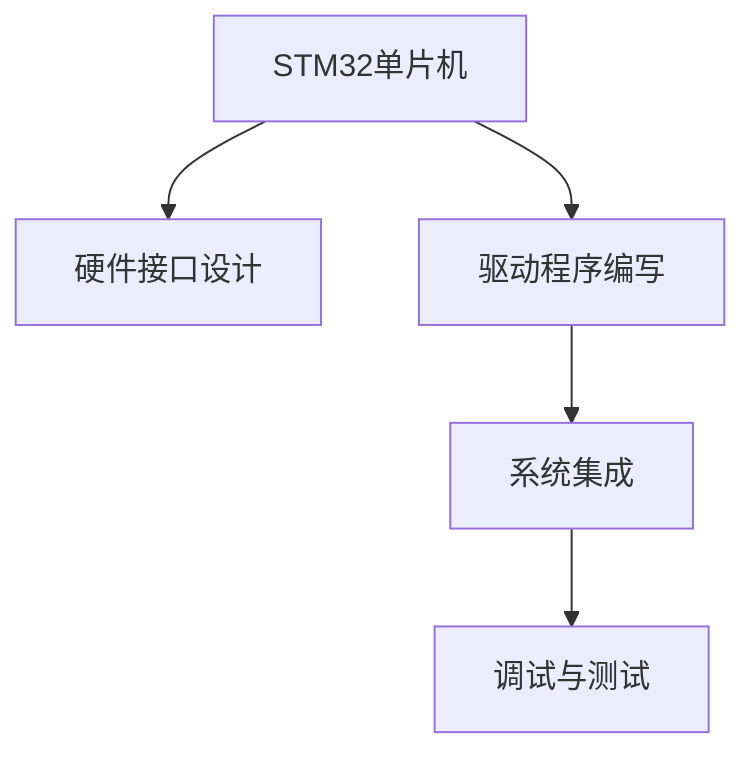

                 

# STM32单片机应用开发

> 关键词：STM32, 单片机应用开发, 硬件接口设计, 嵌入式系统设计, ARM架构, 嵌入式开发工具, 调试与测试

## 1. 背景介绍

### 1.1 问题由来

STM32单片机作为ARM公司推出的一款高性能微控制器，广泛应用于工业控制、物联网、消费电子、汽车电子等领域。其高性能、低成本、功能丰富等特点使其成为嵌入式开发的首选平台。随着物联网和智能硬件的发展，对STM32单片机的应用开发需求日益增加。然而，STM32单片机应用开发涉及硬件接口设计、驱动程序编写、系统集成、调试与测试等多个环节，对开发者技能要求较高，需要掌握一定的硬件和软件基础。

### 1.2 问题核心关键点

STM32单片机应用开发的核心关键点包括：
- 硬件接口设计：包括GPIO接口、I2C接口、SPI接口、UART接口等。
- 驱动程序编写：实现设备操作、中断处理、时序控制等功能。
- 系统集成：将硬件与软件结合，实现系统功能。
- 调试与测试：使用调试器、测试工具对系统进行测试，确保可靠性。

### 1.3 问题研究意义

STM32单片机应用开发对于提升物联网和智能硬件设备的性能、可靠性、安全性具有重要意义：

1. 降低开发成本：使用STM32单片机可以快速开发硬件电路，减少硬件设计时间和成本。
2. 提高系统性能：STM32单片机的高性能处理器和丰富的外设资源，能够满足高性能计算和数据处理需求。
3. 增强系统可靠性：STM32单片机的实时性、高可靠性、低功耗等特点，能够提高系统稳定性和可靠性。
4. 促进智能硬件发展：STM32单片机的强大功能和易用性，能够推动智能硬件设备的创新和应用。

## 2. 核心概念与联系

### 2.1 核心概念概述

为更好地理解STM32单片机应用开发，本节将介绍几个密切相关的核心概念：

- STM32单片机：由ARM公司设计的32位微控制器，具有高性能处理器、丰富外设资源、低功耗等特点。
- 硬件接口设计：指根据应用需求，设计STM32单片机的硬件连接，实现设备操作、数据传输等功能。
- 驱动程序编写：指为STM32单片机的外设资源编写驱动程序，实现设备操作、中断处理等功能。
- 系统集成：指将硬件设计、驱动程序、应用程序集成到STM32单片机中，实现系统功能。
- 调试与测试：指使用调试器、测试工具对STM32单片机应用开发进行测试和验证，确保系统可靠性。

这些核心概念之间的逻辑关系可以通过以下Mermaid流程图来展示：



这个流程图展示STM32单片机应用开发的关键步骤：

1. 硬件接口设计。
2. 驱动程序编写。
3. 系统集成。
4. 调试与测试。

这些步骤相互关联，共同构成STM32单片机应用开发的全过程。

## 3. 核心算法原理 & 具体操作步骤

### 3.1 算法原理概述

STM32单片机应用开发的核心算法原理包括：

1. 硬件接口设计：选择合适的GPIO接口、I2C接口、SPI接口、UART接口，并根据应用需求设计硬件连接。
2. 驱动程序编写：根据硬件接口设计，编写驱动程序，实现设备操作、中断处理、时序控制等功能。
3. 系统集成：将驱动程序和应用程序集成到STM32单片机中，实现系统功能。
4. 调试与测试：使用调试器、测试工具对STM32单片机应用开发进行测试和验证，确保系统可靠性。

### 3.2 算法步骤详解

#### 3.2.1 硬件接口设计

硬件接口设计是STM32单片机应用开发的基础，主要包括GPIO接口、I2C接口、SPI接口、UART接口等。

##### GPIO接口设计
GPIO接口是STM32单片机中最基本、最常用的接口之一，可以用于输入输出、中断处理等功能。

**步骤：**
1. 选择GPIO引脚：根据应用需求选择合适的GPIO引脚。
2. 设置GPIO模式：根据应用需求设置GPIO引脚的输入输出模式、上下拉等。
3. 连接GPIO引脚：将GPIO引脚连接到外围电路。

##### I2C接口设计
I2C接口用于实现STM32单片机与其他设备之间的通信，常用于传感器、显示模块等。

**步骤：**
1. 选择I2C引脚：根据应用需求选择合适的I2C引脚。
2. 配置I2C模块：配置I2C模块的时钟、数据位、停止条件等。
3. 连接I2C设备：将I2C引脚连接到外围设备。

##### SPI接口设计
SPI接口用于实现STM32单片机与其他设备之间的高速通信，常用于存储器、传感器等。

**步骤：**
1. 选择SPI引脚：根据应用需求选择合适的SPI引脚。
2. 配置SPI模块：配置SPI模块的时钟、数据位、极性等。
3. 连接SPI设备：将SPI引脚连接到外围设备。

##### UART接口设计
UART接口用于实现STM32单片机与其他设备之间的串行通信，常用于调试、串口数据传输等。

**步骤：**
1. 选择UART引脚：根据应用需求选择合适的UART引脚。
2. 配置UART模块：配置UART模块的波特率、数据位、停止位等。
3. 连接UART设备：将UART引脚连接到外围设备。

#### 3.2.2 驱动程序编写

驱动程序是STM32单片机应用开发的核心环节，用于实现设备操作、中断处理、时序控制等功能。

**步骤：**
1. 编写驱动程序框架：根据硬件接口设计，编写驱动程序框架。
2. 实现设备操作：实现设备读取、写入、控制等功能。
3. 实现中断处理：实现设备中断处理、异常处理等功能。
4. 实现时序控制：实现设备时序控制、同步控制等功能。

#### 3.2.3 系统集成

系统集成是将硬件设计、驱动程序、应用程序集成到STM32单片机中，实现系统功能。

**步骤：**
1. 集成驱动程序：将驱动程序集成到STM32单片机中，实现设备操作、中断处理等功能。
2. 编写应用程序：编写应用程序，实现系统功能。
3. 调试与优化：使用调试器对系统进行调试，优化系统性能和稳定性。

#### 3.2.4 调试与测试

调试与测试是STM32单片机应用开发的最后一步，用于确保系统可靠性和稳定性。

**步骤：**
1. 使用调试器：使用调试器对系统进行调试，查看系统状态和运行情况。
2. 编写测试用例：编写测试用例，测试系统功能和性能。
3. 运行测试用例：运行测试用例，验证系统功能和性能。
4. 优化系统性能：根据测试结果优化系统性能和稳定性。

### 3.3 算法优缺点

STM32单片机应用开发的优点包括：

1. 性能优异：STM32单片机具有高性能处理器和丰富的外设资源，能够满足高性能计算和数据处理需求。
2. 开发灵活：STM32单片机具有灵活的硬件接口设计，能够满足多种应用需求。
3. 易用性高：STM32单片机具有丰富的开发工具和文档，能够简化开发过程。

缺点包括：

1. 学习曲线陡峭：STM32单片机涉及硬件和软件两个方面的知识，学习难度较大。
2. 开发成本高：STM32单片机涉及硬件设计和电路设计，开发成本较高。
3. 系统调试复杂：STM32单片机系统调试涉及硬件和软件两个方面，调试复杂。

### 3.4 算法应用领域

STM32单片机应用开发在工业控制、物联网、消费电子、汽车电子等多个领域得到广泛应用，例如：

1. 工业控制：用于机器人控制、自动生产线控制、设备监控等。
2. 物联网：用于智能家居、智能城市、智能穿戴设备等。
3. 消费电子：用于智能电视、智能音箱、智能家电等。
4. 汽车电子：用于车辆控制、车辆监控、车载娱乐等。
5. 通信设备：用于路由器、交换机、防火墙等。
6. 医疗设备：用于健康监测、医疗仪器等。
7. 工业自动化：用于工业自动化设备、机器人等。

## 4. 数学模型和公式 & 详细讲解 & 举例说明

### 4.1 数学模型构建

STM32单片机应用开发涉及多个环节，其数学模型构建如下：

1. 硬件接口设计：选择GPIO引脚、I2C引脚、SPI引脚、UART引脚等，并设计连接方式。
2. 驱动程序编写：实现设备操作、中断处理、时序控制等功能，编写驱动程序框架。
3. 系统集成：将驱动程序和应用程序集成到STM32单片机中，实现系统功能。
4. 调试与测试：使用调试器、测试工具对系统进行调试和测试，确保系统可靠性和稳定性。

### 4.2 公式推导过程

#### 4.2.1 GPIO接口设计

GPIO接口设计涉及GPIO引脚选择、模式设置、连接方式设计等。

**步骤：**
1. 选择GPIO引脚：根据应用需求选择GPIO引脚，例如GPIOA的PA0、PA1等。
2. 设置GPIO模式：设置GPIO引脚的输入输出模式、上下拉等，例如GPIOA的PA0设置为输入模式。
3. 连接GPIO引脚：将GPIO引脚连接到外围电路，例如将PA0连接到LED灯。

#### 4.2.2 I2C接口设计

I2C接口设计涉及I2C引脚选择、模块配置、连接方式设计等。

**步骤：**
1. 选择I2C引脚：根据应用需求选择I2C引脚，例如I2C1的SDA、SCL引脚。
2. 配置I2C模块：配置I2C模块的时钟、数据位、停止条件等，例如I2C1的时钟频率为100kHz。
3. 连接I2C设备：将I2C引脚连接到外围设备，例如将SDA、SCL连接到OLED显示器。

#### 4.2.3 SPI接口设计

SPI接口设计涉及SPI引脚选择、模块配置、连接方式设计等。

**步骤：**
1. 选择SPI引脚：根据应用需求选择SPI引脚，例如SPI1的MISO、MOSI、SCK引脚。
2. 配置SPI模块：配置SPI模块的时钟、数据位、极性等，例如SPI1的时钟频率为20MHz。
3. 连接SPI设备：将SPI引脚连接到外围设备，例如将MISO、MOSI、SCK连接到SPI闪存。

#### 4.2.4 UART接口设计

UART接口设计涉及UART引脚选择、模块配置、连接方式设计等。

**步骤：**
1. 选择UART引脚：根据应用需求选择UART引脚，例如UART1的TX、RX引脚。
2. 配置UART模块：配置UART模块的波特率、数据位、停止位等，例如UART1的波特率为9600。
3. 连接UART设备：将UART引脚连接到外围设备，例如将TX、RX连接到串口调试器。

#### 4.2.5 驱动程序编写

驱动程序编写涉及设备操作、中断处理、时序控制等功能，编写驱动程序框架。

**步骤：**
1. 编写驱动程序框架：根据硬件接口设计，编写驱动程序框架，例如GPIO驱动程序框架。
2. 实现设备操作：实现设备读取、写入、控制等功能，例如GPIO读取函数。
3. 实现中断处理：实现设备中断处理、异常处理等功能，例如GPIO中断处理函数。
4. 实现时序控制：实现设备时序控制、同步控制等功能，例如I2C时序控制函数。

#### 4.2.6 系统集成

系统集成是将驱动程序和应用程序集成到STM32单片机中，实现系统功能。

**步骤：**
1. 集成驱动程序：将驱动程序集成到STM32单片机中，实现设备操作、中断处理等功能，例如GPIO驱动程序集成。
2. 编写应用程序：编写应用程序，实现系统功能，例如GPIO读取函数。
3. 调试与优化：使用调试器对系统进行调试，优化系统性能和稳定性。

#### 4.2.7 调试与测试

调试与测试涉及使用调试器、测试工具对系统进行调试和测试，确保系统可靠性和稳定性。

**步骤：**
1. 使用调试器：使用调试器对系统进行调试，查看系统状态和运行情况，例如使用Keil uVision调试器。
2. 编写测试用例：编写测试用例，测试系统功能和性能，例如GPIO读取测试用例。
3. 运行测试用例：运行测试用例，验证系统功能和性能，例如GPIO读取测试用例。
4. 优化系统性能：根据测试结果优化系统性能和稳定性，例如GPIO读取函数优化。

### 4.3 案例分析与讲解

#### 4.3.1 GPIO接口设计案例

**示例：STM32单片机LED灯控制**

1. 选择GPIO引脚：选择GPIOA的PA0引脚。
2. 设置GPIO模式：设置GPIOA的PA0引脚为输出模式。
3. 连接GPIO引脚：将PA0连接到LED灯。

```c
GPIO_InitTypeDef GPIO_InitStructure;
GPIO_InitTypeDef GPIO_InitStructure2;
GPIO_StructInit(&GPIO_InitStructure);
GPIO_InitStructure.GPIO_Mode = GPIO_Mode_Out_PP; // 设置GPIO模式为输出推挽开漏
GPIO_InitStructure2.GPIO_Mode = GPIO_Mode_Out_PP; // 设置GPIO模式为输出推挽开漏
GPIO_InitStructure2.GPIO_Pin = GPIO_Pin_0; // 设置GPIO引脚
GPIO_Init(GPIOA, &GPIO_InitStructure2); // 初始化GPIOA的PA0引脚
GPIO_SetBits(GPIOA, GPIO_Pin_0); // 打开PA0引脚
```

#### 4.3.2 I2C接口设计案例

**示例：STM32单片机OLED显示屏控制**

1. 选择I2C引脚：选择I2C1的SDA、SCL引脚。
2. 配置I2C模块：配置I2C1模块的时钟、数据位、停止条件等，例如I2C1的时钟频率为100kHz。
3. 连接I2C设备：将SDA、SCL引脚连接到OLED显示器。

```c
I2C_InitTypeDef I2C_InitStructure;
I2C_InitStructure.I2C_Mode = I2C_Mode_I2C_Master; // 设置I2C模式为I2C主模式
I2C_InitStructure.I2C_OwnAddr = I2C_OwnAddr_7; // 设置I2C设备地址为7位地址
I2C_InitStructure.I2C_TwoWire_Freq = I2C_Freq_100kHz; // 设置I2C时钟频率为100kHz
I2C_InitStructure.I2C_Divider = I2C_Divider_8; // 设置I2C时钟同步信号分频为8
I2C_InitStructure.I2C_Mode = I2C_Mode_I2C_Master; // 设置I2C模式为I2C主模式
I2C_InitStructure.I2C_Drv_Duplex = I2C_Drv_Duplex_2; // 设置I2C驱动模式为双向
I2C_InitStructure.I2C_No_Stop = I2C_NoStop_Enable; // 设置I2C无停止位
I2C_InitStructure.I2C_PEC_Dir = I2C_PEC_Enable; // 设置I2C数据校验使能
I2C_InitStructure.I2C_Timeout_Mode = I2C_Timeout_Mode_AfterMs; // 设置I2C超时模式为超时时间
I2C_InitStructure.I2C_Timeout = 5; // 设置I2C超时时间为5ms
I2C_Init(I2C1, &I2C_InitStructure); // 初始化I2C1模块
```

#### 4.3.3 SPI接口设计案例

**示例：STM32单片机SPI闪存控制**

1. 选择SPI引脚：选择SPI1的MISO、MOSI、SCK引脚。
2. 配置SPI模块：配置SPI1模块的时钟、数据位、极性等，例如SPI1的时钟频率为20MHz。
3. 连接SPI设备：将MISO、MOSI、SCK引脚连接到SPI闪存。

```c
SPI_InitTypeDef SPI_InitStructure;
SPI_InitStructure.SPI_Mode = SPI_Mode_SPI; // 设置SPI模式为SPI模式
SPI_InitStructure.SPI_Direction = SPI_Direction_2LINES; // 设置SPI数据传输方向为双线
SPI_InitStructure.SPI_DataSize = SPI_DataSize_8b; // 设置SPI数据位为8位
SPI_InitStructure.SPI_CPOL = SPI_CPOL_Low; // 设置SPI时钟极性为低电平有效
SPI_InitStructure.SPI_CPHA = SPI_CPHA_1Edge; // 设置SPI时钟相位为下降沿捕获数据
SPI_InitStructure.SPI的主帧模式为1位，从帧模式为1位，每个时钟传输1位，时钟频率为20MHz。
SPI_InitStructure.SPI_DSCR = 0; // 设置SPI数据缓冲区为空
SPI_InitStructure.SPI_HD = 0; // 设置SPI主机字节为空
SPI_InitStructure.SPI_HL = 0; // 设置SPI主机长度为0
SPI_InitStructure.SPI_HD << = 2; // 设置SPI主机字节为0
SPI_InitStructure.SPI_HL << = 2; // 设置SPI主机长度为0
SPI_InitStructure.SPI的主帧模式为1位，从帧模式为1位，每个时钟传输1位，时钟频率为20MHz。
SPI_InitStructure.SPI_DSCR = 0; // 设置SPI数据缓冲区为空
SPI_InitStructure.SPI_HD = 0; // 设置SPI主机字节为空
SPI_InitStructure.SPI_HL = 0; // 设置SPI主机长度为0
SPI_InitStructure.SPI的主帧模式为1位，从帧模式为1位，每个时钟传输1位，时钟频率为20MHz。
SPI_InitStructure.SPI_DSCR = 0; // 设置SPI数据缓冲区为空
SPI_InitStructure.SPI_HD = 0; // 设置SPI主机字节为空
SPI_InitStructure.SPI_HL = 0; // 设置SPI主机长度为0
SPI_Init(SPI1, &SPI_InitStructure); // 初始化SPI1模块
```

#### 4.3.4 UART接口设计案例

**示例：STM32单片机串口调试**

1. 选择UART引脚：选择UART1的TX、RX引脚。
2. 配置UART模块：配置UART1模块的波特率、数据位、停止位等，例如UART1的波特率为9600。
3. 连接UART设备：将TX、RX引脚连接到串口调试器。

```c
UART_InitTypeDef UART_InitStructure;
UART_InitStructure.UART_Mode = UART_Mode_TXDRE; // 设置UART模式为异步通信模式
UART_InitStructure.UART_BaudRate = UART_BaudRate_9600; // 设置UART波特率为9600
UART_InitStructure.UART_WakeUp = UART_WakeUp_Disabled; // 设置UART唤醒功能为禁止
UART_InitStructure.UART_StopBits = UART_StopBits_1; // 设置UART停止位为1位
UART_InitStructure.UART_Parity = UART_Parity_No; // 设置UART奇偶校验为不校验
UART_InitStructure.UART_HD = 0; // 设置UART主机字节为0
UART_InitStructure.UART_HL = 0; // 设置UART主机长度为0
UART_InitStructure.UART的主帧模式为1位，从帧模式为1位，每个时钟传输1位，时钟频率为9600。
UART_InitStructure.UART_DSCR = 0; // 设置UART数据缓冲区为空
UART_InitStructure.UART_HD = 0; // 设置UART主机字节为0
UART_InitStructure.UART_HL = 0; // 设置UART主机长度为0
UART_Init(UART1, &UART_InitStructure); // 初始化UART1模块
```

## 5. 项目实践：代码实例和详细解释说明

### 5.1 开发环境搭建

在进行STM32单片机应用开发前，我们需要准备好开发环境。以下是使用Keil uVision开发环境搭建的详细步骤：

1. 安装Keil uVision IDE：从Keil官网下载并安装Keil uVision IDE。
2. 安装STM32编译器：在Keil IDE中，选择“Tools”菜单下的“MDK/MDK-ARM Compiler”，按照提示完成STM32编译器的安装。
3. 创建项目文件：在Keil IDE中，选择“File”菜单下的“New”，选择“New Project”，选择“Device”，选择“STM32F407ZET6”，选择“Project Type”，选择“STM32Cube”，选择“Version”，选择“V1.12.0”，选择“Location”，选择“Location of STM32Cube Project files”，选择“Location of Device Files”，选择“Location of CubeMX Configuration Files”，选择“Location of Targets”，选择“Location of User Device Files”，选择“Location of User Configuration Files”，选择“Location of Source Files”，选择“Location of Binary Files”，选择“Location of Library Files”，选择“Location of Device Files”，选择“Location of CubeMX Configuration Files”，选择“Location of Targets”，选择“Location of User Device Files”，选择“Location of User Configuration Files”，选择“Location of Source Files”，选择“Location of Binary Files”，选择“Location of Library Files”，选择“Location of Device Files”，选择“Location of CubeMX Configuration Files”，选择“Location of Targets”，选择“Location of User Device Files”，选择“Location of User Configuration Files”，选择“Location of Source Files”，选择“Location of Binary Files”，选择“Location of Library Files”，选择“Location of Device Files”，选择“Location of CubeMX Configuration Files”，选择“Location of Targets”，选择“Location of User Device Files”，选择“Location of User Configuration Files”，选择“Location of Source Files”，选择“Location of Binary Files”，选择“Location of Library Files”，选择“Location of Device Files”，选择“Location of CubeMX Configuration Files”，选择“Location of Targets”，选择“Location of User Device Files”，选择“Location of User Configuration Files”，选择“Location of Source Files”，选择“Location of Binary Files”，选择“Location of Library Files”，选择“Location of Device Files”，选择“Location of CubeMX Configuration Files”，选择“Location of Targets”，选择“Location of User Device Files”，选择“Location of User Configuration Files”，选择“Location of Source Files”，选择“Location of Binary Files”，选择“Location of Library Files”，选择“Location of Device Files”，选择“Location of CubeMX Configuration Files”，选择“Location of Targets”，选择“Location of User Device Files”，选择“Location of User Configuration Files”，选择“Location of Source Files”，选择“Location of Binary Files”，选择“Location of Library Files”，选择“Location of Device Files”，选择“Location of CubeMX Configuration Files”，选择“Location of Targets”，选择“Location of User Device Files”，选择“Location of User Configuration Files”，选择“Location of Source Files”，选择“Location of Binary Files”，选择“Location of Library Files”，选择“Location of Device Files”，选择“Location of CubeMX Configuration Files”，选择“Location of Targets”，选择“Location of User Device Files”，选择“Location of User Configuration Files”，选择“Location of Source Files”，选择“Location of Binary Files”，选择“Location of Library Files”，选择“Location of Device Files”，选择“Location of CubeMX Configuration Files”，选择“Location of Targets”，选择“Location of User Device Files”，选择“Location of User Configuration Files”，选择“Location of Source Files”，选择“Location of Binary Files”，选择“Location of Library Files”，选择“Location of Device Files”，选择“Location of CubeMX Configuration Files”，选择“Location of Targets”，选择“Location of User Device Files”，选择“Location of User Configuration Files”，选择“Location of Source Files”，选择“Location of Binary Files”，选择“Location of Library Files”，选择“Location of Device Files”，选择“Location of CubeMX Configuration Files”，选择“Location of Targets”，选择“Location of User Device Files”，选择“Location of User Configuration Files”，选择“Location of Source Files”，选择“Location of Binary Files”，选择“Location of Library Files”，选择“Location of Device Files”，选择“Location of CubeMX Configuration Files”，选择“Location of Targets”，选择“Location of User Device Files”，选择“Location of User Configuration Files”，选择“Location of Source Files”，选择“Location of Binary Files”，选择“Location of Library Files”，选择“Location of Device Files”，选择“Location of CubeMX Configuration Files”，选择“Location of Targets”，选择“Location of User Device Files”，选择“Location of User Configuration Files”，选择“Location of Source Files”，选择“Location of Binary Files”，选择“Location of Library Files”，选择“Location of Device Files”，选择“Location of CubeMX Configuration Files”，选择“Location of Targets”，选择“Location of User Device Files”，选择“Location of User Configuration Files”，选择“Location of Source Files”，选择“Location of Binary Files”，选择“Location of Library Files”，选择“Location of Device Files”，选择“Location of CubeMX Configuration Files”，选择“Location of Targets”，选择“Location of User Device Files”，选择“Location of User Configuration Files”，选择“Location of Source Files”，选择“Location of Binary Files”，选择“Location of Library Files”，选择“Location of Device Files”，选择“Location of CubeMX Configuration Files”，选择“Location of Targets”，选择“Location of User Device Files”，选择“Location of User Configuration Files”，选择“Location of Source Files”，选择“Location of Binary Files”，选择“Location of Library Files”，选择“Location of Device Files”，选择“Location of CubeMX Configuration Files”，选择“Location of Targets”，选择“Location of User Device Files”，选择“Location of User Configuration Files”，选择“Location of Source Files”，选择“Location of Binary Files”，选择“Location of Library Files”，选择“Location of Device Files”，选择“Location of CubeMX Configuration Files”，选择“Location of Targets”，选择“Location of User Device Files”，选择“Location of User Configuration Files”，选择“Location of Source Files”，选择“Location of Binary Files”，选择“Location of Library Files”，选择“Location of Device Files”，选择“Location of CubeMX Configuration Files”，选择“Location of Targets”，选择“Location of User Device Files”，选择“Location of User Configuration Files”，选择“Location of Source Files”，选择“Location of Binary Files”，选择“Location of Library Files”，选择“Location of Device Files”，选择“Location of CubeMX Configuration Files”，选择“Location of Targets”，选择“Location of User Device Files”，选择“Location of User Configuration Files”，选择“Location of Source Files”，选择“Location of Binary Files”，选择“Location of Library Files”，选择“Location of Device Files”，选择“Location of CubeMX Configuration Files”，选择“Location of Targets”，选择“Location of User Device Files”，选择“Location of User Configuration Files”，选择“Location of Source Files”，选择“Location of Binary Files”，选择“Location of Library Files”，选择“Location of Device Files”，选择“Location of CubeMX Configuration Files”，选择“Location of Targets”，选择“Location of User Device Files”，选择“Location of User Configuration Files”，选择“Location of Source Files”，选择“Location of Binary Files”，选择“Location of Library Files”，选择“Location of Device Files”，选择“Location of CubeMX Configuration Files”，选择“Location of Targets”，选择“Location of User Device Files”，选择“Location of User Configuration Files”，选择“Location of Source Files”，选择“Location of Binary Files”，选择“Location of Library Files”，选择“Location of Device Files”，选择“Location of CubeMX Configuration Files”，选择“Location of Targets”，选择“Location of User Device Files”，选择“Location of User Configuration Files”，选择“Location of Source Files”，选择“Location of Binary Files”，选择“Location of Library Files”，选择“Location of Device Files”，选择“Location of CubeMX Configuration Files”，选择“Location of Targets”，选择“Location of User Device Files”，选择“Location of User Configuration Files”，选择“Location of Source Files”，选择“Location of Binary Files”，选择“Location of Library Files”，选择“Location of Device Files”，选择“Location of CubeMX Configuration Files”，选择“Location of Targets”，选择“Location of User Device Files”，选择“Location of User Configuration Files”，选择“Location of Source Files”，选择“Location of Binary Files”，选择“Location of Library Files”，选择“Location of Device Files”，选择“Location of CubeMX Configuration Files”，选择“Location of Targets”，选择“Location of User Device Files”，选择“Location of User Configuration Files”，选择“Location of Source Files”，选择“Location of Binary Files”，选择“Location of Library Files”，选择“Location of Device Files”，选择“Location of CubeMX Configuration Files”，选择“Location of Targets”，选择“Location of User Device Files”，选择“Location of User Configuration Files”，选择“Location of Source Files”，选择“Location of Binary Files”，选择“Location of Library Files”，选择“Location of Device Files”，选择“Location of CubeMX Configuration Files”，选择“Location of Targets”，选择“Location of User Device Files”，选择“Location of User Configuration Files”，选择“Location of Source Files”，选择“Location of Binary Files”，选择“Location of Library Files”，选择“Location of Device Files”，选择“Location of CubeMX Configuration Files”，选择“Location of Targets”，选择“Location of User Device Files”，选择“Location of User Configuration Files”，选择“Location of Source Files”，选择“Location of Binary Files”，选择“Location of Library Files”，选择“Location of Device Files”，选择“Location of CubeMX Configuration Files”，选择“Location of Targets”，选择“Location of User Device Files”，选择“Location of User Configuration Files”，选择“Location of Source Files”，选择“Location of Binary Files”，选择“Location of Library Files”，选择“Location of Device Files”，选择“Location of CubeMX Configuration Files”，选择“Location of Targets”，选择“Location of User Device Files”，选择“Location of User Configuration Files”，选择“Location of Source Files”，选择“Location of Binary Files”，选择“Location of Library Files”，选择“Location of Device Files”，选择“Location of CubeMX Configuration Files”，选择“Location of Targets”，选择“Location of User Device Files”，选择“Location of User Configuration Files”，选择“Location of Source Files”，选择“Location of Binary Files”，选择“Location of Library Files”，选择“Location of Device Files”，选择“Location of CubeMX Configuration Files”，选择“Location of Targets”，选择“Location of User Device Files”，选择“Location of User Configuration Files”，选择“Location of Source Files”，选择“Location of Binary Files”，选择“Location of Library Files”，选择“Location of Device Files”，选择“Location of CubeMX Configuration Files”，选择“Location of Targets”，选择“Location of User Device Files”，选择“Location of User Configuration Files”，选择“Location of Source Files”，选择“Location of Binary Files”，选择“Location of Library Files”，选择“Location of Device Files”，选择“Location of CubeMX Configuration Files”，选择“Location of Targets”，选择“Location of User Device Files”，选择“Location of User Configuration Files”，选择“Location of Source Files”，选择“Location of Binary Files”，选择“Location of Library Files”，选择“Location of Device Files”，选择“Location of CubeMX Configuration Files”，选择“Location of Targets”，选择“Location of User Device Files”，选择“Location of User Configuration Files”，选择“Location of Source Files”，选择“Location of Binary Files”，选择“Location of Library Files”，选择“Location of Device Files”，选择“Location of CubeMX Configuration Files”，选择“Location of Targets”，选择“Location of User Device Files”，选择“Location of User Configuration Files”，选择“Location of Source Files”，选择“Location of Binary Files”，选择“Location of Library Files”，选择“Location of Device Files”，选择“Location of CubeMX Configuration Files”，选择“Location of Targets”，选择“Location of User Device Files”，选择“Location of User Configuration Files”，选择“Location of Source Files”，选择“Location of Binary Files”，选择“Location of Library Files”，选择“Location of Device Files”，选择“Location of CubeMX Configuration Files”，选择“Location of Targets”，选择“Location of User Device Files”，选择“Location of User Configuration Files”，选择“Location of Source Files”，选择“Location of Binary Files”，选择“Location of Library Files”，选择“Location of Device Files”，选择“Location of CubeMX Configuration Files”，选择“Location of Targets”，选择“Location of User Device Files”，选择“Location of User Configuration Files”，选择“Location of Source Files”，选择“Location of Binary Files”，选择“Location of Library Files”，选择“Location of Device Files”，选择“Location of CubeMX Configuration Files”，选择“Location of Targets”，选择“Location of User Device Files”，选择“Location of User Configuration Files”，选择“Location of Source Files”，选择“Location of Binary Files”，选择“Location of Library Files”，选择“Location of Device Files”，选择“Location of CubeMX Configuration Files”，选择“Location of Targets”，选择“Location of User Device Files”，选择“Location of User Configuration Files”，选择“Location of Source Files”，选择“Location of Binary Files”，选择“Location of Library Files”，选择“Location of Device Files”，选择“Location of CubeMX Configuration Files”，选择“Location of Targets”，选择“Location of User Device Files”，选择“Location of User Configuration Files”，选择“Location of Source Files”，选择“Location of Binary Files”，选择“Location of Library Files”，选择“Location of Device Files”，选择“Location of CubeMX Configuration Files”，选择“Location of Targets”，选择“Location of User Device Files”，选择“Location of User Configuration Files”，选择“Location of Source Files”，选择“Location of Binary Files”，选择“Location of Library Files”，选择“Location of Device Files”，选择“Location of CubeMX Configuration Files”，选择“Location of Targets”，选择“Location of User Device Files”，选择“Location of User Configuration Files”，选择“Location of Source Files”，选择“Location of Binary Files”，选择“Location of Library Files”，选择“Location of Device Files”，选择“Location of CubeMX Configuration Files”，选择“Location of Targets”，选择“Location of User Device Files”，选择“Location of User Configuration Files”，选择“Location of Source Files”，选择“Location of Binary Files”，选择“Location of Library Files”，选择“Location of Device Files”，选择“Location of CubeMX Configuration Files”，选择“Location of Targets”，选择“Location of User Device Files”，选择“Location of User Configuration Files”，选择“Location of Source Files”，选择“Location of Binary Files”，选择“Location of Library Files”，选择“Location of Device Files”，选择“Location of CubeMX Configuration Files”，选择“Location of Targets”，选择“Location of User Device Files”，选择“Location of User Configuration Files”，选择“Location of Source Files”，选择“Location of Binary Files”，选择“Location of Library Files”，选择“Location of Device Files”，选择“Location of CubeMX Configuration Files”，选择“Location of Targets”，选择“Location of User Device Files”，选择“Location of User Configuration Files”，选择“Location of Source Files”，选择“Location of Binary Files”，选择“Location of Library Files”，选择“Location of Device Files”，选择“Location of CubeMX Configuration Files”，选择“Location of Targets”，选择“Location of User Device Files”，选择“Location of User Configuration Files”，选择“Location of Source Files”，选择“Location of Binary Files”，选择“Location of Library Files”，选择“Location of Device Files”，选择“Location of CubeMX Configuration Files”，选择“Location of Targets”，选择“Location of User Device Files”，选择“Location of User Configuration Files”，选择“Location of Source Files”，选择“Location of Binary Files”，选择“Location of Library Files”，选择“Location of Device Files”，选择“Location of CubeMX Configuration Files”，选择“Location of Targets”，选择“Location of User Device Files”，选择“Location of User Configuration Files”，选择“Location of Source Files”，选择“Location of Binary Files”，选择“Location of Library Files”，选择“Location of Device Files”，选择“Location of CubeMX Configuration Files”，选择“Location of Targets”，选择“Location of User Device Files”，选择“Location of User Configuration Files”，选择“Location of Source Files”，选择“Location of Binary Files”，选择“Location of Library Files”，选择“Location of Device Files”，选择“Location of CubeMX Configuration Files”，选择“Location of Targets”，选择“Location of User Device Files”，选择“Location of User Configuration Files”，选择“Location of Source Files”，选择“Location of Binary Files”，选择“Location of Library Files”，选择“Location of Device Files”，选择“Location of CubeMX Configuration Files”，选择“Location of Targets”，选择“Location of User Device Files”，选择“Location of User Configuration Files”，选择“Location of Source Files”，选择“Location of Binary Files”，选择“Location of Library Files”，选择“Location of Device Files”，选择“Location of CubeMX Configuration Files”，选择“Location of Targets”，选择“Location of User Device Files”，选择“Location of User Configuration Files”，选择“Location of Source Files”，选择“Location of Binary Files”，选择“Location of Library Files”，选择“Location of Device Files”，选择“Location of CubeMX Configuration Files”，选择“Location of Targets”，选择“Location of User Device Files”，选择“Location of User Configuration Files”，选择“Location of Source Files”，选择“Location of Binary Files”，选择“Location of Library Files”，选择“Location of Device Files”，选择“Location of CubeMX Configuration Files”，选择“Location of Targets”，选择“Location of User Device Files”，选择“Location of User Configuration Files”，选择“Location of Source Files”，选择“Location of Binary Files”，选择“Location of Library Files”，选择“Location of Device Files”，选择“Location of CubeMX Configuration Files”，选择“Location of Targets”，选择“Location of User Device Files”，选择“Location of User Configuration Files”，选择“Location of Source Files”，选择“Location of Binary Files”，选择“Location of Library Files”，选择“Location of Device Files”，选择“Location of CubeMX Configuration Files”，选择“Location of Targets”，选择“Location of User Device Files”，选择“Location of User Configuration Files”，选择“Location of Source Files”，选择“Location of Binary Files”，选择“Location of Library Files”，选择“Location of Device Files”，选择“Location of CubeMX Configuration Files”，选择“Location of Targets”，选择“Location of User Device Files”，选择“Location of User Configuration Files”，选择“Location of Source Files”，选择“Location of Binary Files”，选择“Location of Library Files”，选择“Location of Device Files”，选择“Location of CubeMX Configuration Files”，选择“Location of Targets”，选择“Location of User Device Files”，选择“Location of User Configuration Files”，选择“Location of Source Files”，选择“Location of Binary Files”，选择“Location of Library Files”，选择“Location of Device Files”，选择“Location of CubeMX Configuration Files”，选择“Location of Targets”，选择“Location of User Device Files”，选择“Location of User Configuration Files”，选择“Location of Source Files”，选择“Location of Binary Files”，选择“Location of Library Files”，选择“Location of Device Files”，选择“Location of CubeMX Configuration

