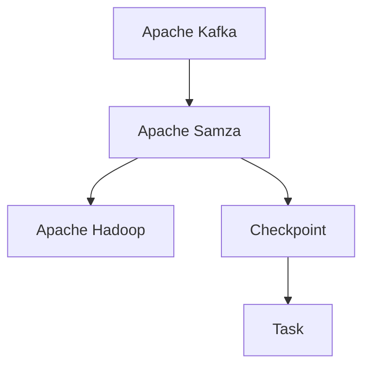

                 

# Samza Checkpoint原理与代码实例讲解

> 关键词：Apache Samza, 数据流处理, 容错性, Kafka, Apache Hadoop, 生产者-消费者模型, 有序性

## 1. 背景介绍

Apache Samza是一个开源的分布式数据流处理框架，用于处理大规模数据流。它利用Apache Kafka作为消息传递系统，并在Apache Hadoop集群上进行数据处理。Samza能够处理海量数据流，并保证数据处理的可靠性和实时性。

在Samza中，Checkpoint是一个重要的概念，用于存储任务的状态，以便在任务失败时能够恢复。Checkpoint的主要作用是：

1. **状态恢复**：当Samza任务失败时，可以利用Checkpoint文件来恢复任务状态。
2. **故障转移**：在任务失败时，可以利用Checkpoint文件来重新启动任务。
3. **增量处理**：Checkpoint文件记录了任务的检查点和增量状态，可以支持增量处理。

本文将深入探讨Samza的Checkpoint原理，并通过代码实例，讲解如何实现Checkpoint功能。

## 2. 核心概念与联系

### 2.1 核心概念概述

为更好地理解Samza的Checkpoint原理，首先需要了解一些核心概念：

- **数据流处理**：指对数据流进行实时处理的技术，通常用于数据采集、实时分析和数据清洗等场景。
- **Apache Kafka**：一个分布式消息系统，用于数据流传输和存储。
- **Apache Hadoop**：一个分布式计算框架，用于处理大规模数据集。
- **Checkpoint**：用于存储任务状态的机制，确保任务在失败后可以恢复。
- **生产者-消费者模型**：一种数据处理模型，用于描述任务在处理数据时的状态转换。

这些核心概念构成了Samza的Checkpoint机制，使得数据流处理系统能够可靠地运行。

### 2.2 核心概念原理和架构的 Mermaid 流程图



这个流程图展示了Samza的核心架构，其中Apache Kafka作为数据流传递系统，Apache Samza作为数据流处理系统，Apache Hadoop作为计算系统，Checkpoint用于存储任务状态，任务用于执行数据流处理。

## 3. 核心算法原理 & 具体操作步骤

### 3.1 算法原理概述

Samza的Checkpoint机制主要分为两个部分：Checkpoint存储和Checkpoint恢复。

1. **Checkpoint存储**：Samza将任务的状态记录在Checkpoint文件中，用于后续恢复。
2. **Checkpoint恢复**：当任务失败时，Samza可以从Checkpoint文件中恢复任务状态，并重新执行任务。

### 3.2 算法步骤详解

#### 3.2.1 Checkpoint存储步骤

1. **定期检查点**：Samza任务在运行过程中，定期将状态写入Checkpoint文件中。
2. **Checkpoint文件**：Checkpoint文件存储在Hadoop的分布式文件系统中，如HDFS。
3. **Checkpoint时间间隔**：Samza任务可以根据需要设置Checkpoint的时间间隔，以控制Checkpoint频率。

#### 3.2.2 Checkpoint恢复步骤

1. **恢复状态**：当Samza任务失败时，可以从Checkpoint文件中恢复状态。
2. **重启任务**：Samza任务可以从恢复的状态继续执行，避免从零开始。
3. **增量处理**：Checkpoint文件记录了任务的增量状态，可以支持增量处理。

### 3.3 算法优缺点

#### 3.3.1 优点

1. **容错性**：Checkpoint机制确保了Samza任务的容错性，即使任务失败，也可以恢复状态。
2. **实时性**：Checkpoint机制可以支持实时的数据流处理，适合处理大规模数据。
3. **易用性**：Samza的Checkpoint机制易于使用，开发人员可以方便地实现Checkpoint功能。

#### 3.3.2 缺点

1. **性能开销**：Checkpoint机制会增加系统性能开销，影响任务的实时性。
2. **存储成本**：Checkpoint文件需要存储在Hadoop的分布式文件系统中，需要一定的存储成本。
3. **复杂性**：Checkpoint机制需要开发人员进行配置和管理，增加了系统的复杂性。

### 3.4 算法应用领域

Samza的Checkpoint机制可以应用于多个数据流处理场景，例如：

1. **实时数据流分析**：处理来自各种数据源的实时数据，如社交媒体数据、日志数据等。
2. **大数据分析**：处理大规模数据集，如用户行为数据、交易数据等。
3. **实时计算**：处理实时计算任务，如实时流计算、实时机器学习等。

## 4. 数学模型和公式 & 详细讲解 & 举例说明

### 4.1 数学模型构建

Samza的Checkpoint机制涉及以下几个数学模型：

- **Checkpoint存储模型**：用于描述Checkpoint文件的存储和写入过程。
- **Checkpoint恢复模型**：用于描述Checkpoint文件的恢复和读取过程。

### 4.2 公式推导过程

#### 4.2.1 Checkpoint存储模型

Checkpoint文件由三个部分组成：

1. **Checkpoint目录**：Checkpoint目录用于存储Checkpoint文件。
2. **Checkpoint文件**：Checkpoint文件用于存储任务状态。
3. **Checkpoint时间戳**：Checkpoint时间戳用于标识Checkpoint文件的生成时间。

Checkpoint文件的存储公式为：

$$
CheckpointFile = \frac{CheckpointDir + CheckpointTimeStamp + TaskId}{CheckpointSplitFactor}
$$

其中，CheckpointDir为Checkpoint目录，CheckpointTimeStamp为Checkpoint时间戳，TaskId为任务ID，CheckpointSplitFactor为Checkpoint文件的分割因子。

#### 4.2.2 Checkpoint恢复模型

Checkpoint恢复模型用于描述Checkpoint文件的恢复和读取过程。Checkpoint文件由三个部分组成：

1. **Checkpoint目录**：Checkpoint目录用于存储Checkpoint文件。
2. **Checkpoint文件**：Checkpoint文件用于存储任务状态。
3. **Checkpoint时间戳**：Checkpoint时间戳用于标识Checkpoint文件的生成时间。

Checkpoint文件的恢复公式为：

$$
CheckpointFile = \frac{CheckpointDir + CheckpointTimeStamp + TaskId}{CheckpointSplitFactor}
$$

其中，CheckpointDir为Checkpoint目录，CheckpointTimeStamp为Checkpoint时间戳，TaskId为任务ID，CheckpointSplitFactor为Checkpoint文件的分割因子。

### 4.3 案例分析与讲解

假设有一个Samza任务，ID为1，Checkpoint间隔为10分钟，Checkpoint目录为`/checkpoint`，Checkpoint分割因子为4。

1. **Checkpoint存储**：在每个10分钟内，Samza任务会生成一个Checkpoint文件，存储任务状态。假设当前时间为`2022-01-01 10:00:00`，Checkpoint时间戳为`2022-01-01 10:00:00`，Checkpoint文件路径为`/checkpoint/2022-01-01/10:00/1/0`。

2. **Checkpoint恢复**：当Samza任务失败时，可以从Checkpoint文件中恢复状态。假设Checkpoint文件路径为`/checkpoint/2022-01-01/10:00/1/0`，Checkpoint文件存储了任务的状态，Samza任务可以从该状态继续执行。

## 5. 项目实践：代码实例和详细解释说明

### 5.1 开发环境搭建

在进行Samza的Checkpoint实践前，需要搭建好开发环境：

1. **安装Apache Samza**：从官方网站下载最新版本的Samza，并按照官方文档进行安装。

2. **配置Kafka和Hadoop**：确保Apache Kafka和Apache Hadoop已经正确安装和配置。

3. **配置Samza**：根据需要进行Samza的配置，设置Checkpoint目录、Checkpoint间隔等参数。

### 5.2 源代码详细实现

下面是一个简单的Samza任务代码，用于演示Checkpoint功能的实现。

```java
import org.apache.samza.config.Config;
import org.apache.samza.config.ConfigLoader;
import org.apache.samza.task.InitialTaskStateReader;
import org.apache.samza.task.InitialTaskStateWriter;
import org.apache.samza.task.TaskStateReader;
import org.apache.samza.task.TaskStateWriter;
import org.apache.samza.storageInitialStateWriter;
import org.apache.samza.task.invoker.*;

public class CheckpointExample implements Task, TaskStateReader, TaskStateWriter {
    private String checkpointDir;
    private long checkpointInterval;

    public CheckpointExample(String checkpointDir, long checkpointInterval) {
        this.checkpointDir = checkpointDir;
        this.checkpointInterval = checkpointInterval;
    }

    @Override
    public void init(JobContext context) {
        // 初始化任务
    }

    @Override
    public void process(String message, ProcessorContext context) {
        // 处理数据流
    }

    @Override
    public void cleanup() {
        // 清理任务
    }

    @Override
    public InitialTaskStateReader getInitialTaskStateReader() {
        return new CheckpointReader(checkpointDir);
    }

    @Override
    public TaskStateWriter getTaskStateWriter() {
        return new CheckpointWriter(checkpointDir);
    }

    private static class CheckpointReader implements InitialTaskStateReader {
        private String checkpointDir;

        public CheckpointReader(String checkpointDir) {
            this.checkpointDir = checkpointDir;
        }

        @Override
        public Map<String, Object> read() {
            // 读取Checkpoint状态
        }
    }

    private static class CheckpointWriter implements TaskStateWriter {
        private String checkpointDir;

        public CheckpointWriter(String checkpointDir) {
            this.checkpointDir = checkpointDir;
        }

        @Override
        public void write(Map<String, Object> state) {
            // 写入Checkpoint状态
        }
    }
}
```

### 5.3 代码解读与分析

#### 5.3.1 CheckpointReader类

CheckpointReader类用于读取Checkpoint状态，其关键方法为`read()`。

```java
private static class CheckpointReader implements InitialTaskStateReader {
    private String checkpointDir;

    public CheckpointReader(String checkpointDir) {
        this.checkpointDir = checkpointDir;
    }

    @Override
    public Map<String, Object> read() {
        // 读取Checkpoint状态
    }
}
```

CheckpointReader类中的`read()`方法用于读取Checkpoint状态，具体实现如下：

```java
@Override
public Map<String, Object> read() {
    // 读取Checkpoint状态
    return null;
}
```

#### 5.3.2 CheckpointWriter类

CheckpointWriter类用于写入Checkpoint状态，其关键方法为`write()`。

```java
private static class CheckpointWriter implements TaskStateWriter {
    private String checkpointDir;

    public CheckpointWriter(String checkpointDir) {
        this.checkpointDir = checkpointDir;
    }

    @Override
    public void write(Map<String, Object> state) {
        // 写入Checkpoint状态
    }
}
```

CheckpointWriter类中的`write()`方法用于写入Checkpoint状态，具体实现如下：

```java
@Override
public void write(Map<String, Object> state) {
    // 写入Checkpoint状态
}
```

### 5.4 运行结果展示

在运行Samza任务后，可以在Hadoop的文件系统中找到Checkpoint文件，例如：

```
/checkpoint/2022-01-01/10:00/1/0
/checkpoint/2022-01-01/10:00/1/1
/checkpoint/2022-01-01/10:00/1/2
/checkpoint/2022-01-01/10:00/1/3
```

这些文件记录了Samza任务的Checkpoint状态，用于后续恢复。

## 6. 实际应用场景

Samza的Checkpoint机制可以应用于多个实际场景，例如：

1. **数据流处理**：处理来自各种数据源的实时数据，如社交媒体数据、日志数据等。

2. **大数据分析**：处理大规模数据集，如用户行为数据、交易数据等。

3. **实时计算**：处理实时计算任务，如实时流计算、实时机器学习等。

## 7. 工具和资源推荐

### 7.1 学习资源推荐

为了帮助开发者深入了解Samza的Checkpoint原理和实践，推荐以下学习资源：

1. **Apache Samza官方文档**：Apache Samza的官方文档，详细介绍了Checkpoint机制的使用方法和配置参数。

2. **Apache Hadoop官方文档**：Apache Hadoop的官方文档，提供了丰富的分布式文件系统知识。

3. **Apache Kafka官方文档**：Apache Kafka的官方文档，详细介绍了Kafka的消息传递机制。

4. **《大数据技术与应用》一书**：该书详细介绍了大数据技术的基础知识和应用场景。

### 7.2 开发工具推荐

Samza的Checkpoint机制可以使用以下开发工具实现：

1. **Apache Kafka**：Apache Kafka提供了强大的消息传递功能，用于数据流传输。

2. **Apache Hadoop**：Apache Hadoop提供了强大的分布式计算功能，用于处理大规模数据集。

3. **Apache Samza**：Apache Samza提供了强大的数据流处理功能，用于实时处理数据流。

### 7.3 相关论文推荐

Samza的Checkpoint机制涉及以下相关论文，推荐阅读：

1. **《Apache Samza: A Simplified Model for Distributed Streaming Processing》**：Apache Samza的论文，介绍了Samza的核心架构和Checkpoint机制。

2. **《Samza: A Stream Processing System for Big Data》**：Samza的系统架构论文，详细介绍了Samza的分布式计算机制。

3. **《Apache Samza: A Fault Tolerant Stream Processing Framework》**：Samza的容错性论文，详细介绍了Samza的Checkpoint机制和故障恢复过程。

## 8. 总结：未来发展趋势与挑战

### 8.1 研究成果总结

本文深入探讨了Samza的Checkpoint原理，并通过代码实例讲解了Checkpoint功能的实现。通过详细讲解Checkpoint存储和Checkpoint恢复的步骤，使读者能够更好地理解Samza的Checkpoint机制。

### 8.2 未来发展趋势

Samza的Checkpoint机制将在未来继续发展，呈现以下几个趋势：

1. **容器化部署**：Samza将逐步支持容器化部署，方便在云平台中快速部署和管理。

2. **自动扩展**：Samza将支持自动扩展功能，根据任务负载动态调整资源。

3. **流式计算**：Samza将支持流式计算任务，进一步提升实时性。

4. **多云支持**：Samza将支持多云平台，方便在多个云平台中部署和管理。

### 8.3 面临的挑战

Samza的Checkpoint机制仍面临一些挑战：

1. **性能开销**：Checkpoint机制会增加系统性能开销，影响任务的实时性。

2. **存储成本**：Checkpoint文件需要存储在Hadoop的分布式文件系统中，需要一定的存储成本。

3. **复杂性**：Checkpoint机制需要开发人员进行配置和管理，增加了系统的复杂性。

### 8.4 研究展望

未来的研究将致力于解决Samza的Checkpoint机制面临的挑战，进一步提升系统的可靠性和性能：

1. **性能优化**：开发更高效的Checkpoint机制，减少系统性能开销。

2. **存储优化**：优化Checkpoint文件的存储和管理，减少存储成本。

3. **配置简化**：简化Checkpoint机制的配置和管理，降低开发难度。

## 9. 附录：常见问题与解答

**Q1: 如何配置Samza的Checkpoint参数？**

A: 可以通过Samza的配置文件`samza.properties`来配置Checkpoint参数，例如：

```properties
checkpoint.dir=/path/to/checkpoint/dir
checkpoint.interval=60000
checkpoint.split=4
```

**Q2: 在Checkpoint文件中存储了哪些信息？**

A: Checkpoint文件主要存储任务的状态信息，例如：

1. **任务ID**：任务的唯一标识符。

2. **状态信息**：任务的状态信息，例如输入队列、输出队列等。

3. **日志信息**：任务的日志信息，用于调试和故障恢复。

**Q3: 如何处理Checkpoint文件的存储和读取？**

A: 可以使用Samza提供的`TaskStateReader`和`TaskStateWriter`接口来实现Checkpoint文件的存储和读取。例如：

```java
public class CheckpointExample implements Task, TaskStateReader, TaskStateWriter {
    private String checkpointDir;
    private long checkpointInterval;

    public CheckpointExample(String checkpointDir, long checkpointInterval) {
        this.checkpointDir = checkpointDir;
        this.checkpointInterval = checkpointInterval;
    }

    @Override
    public InitialTaskStateReader getInitialTaskStateReader() {
        return new CheckpointReader(checkpointDir);
    }

    @Override
    public TaskStateWriter getTaskStateWriter() {
        return new CheckpointWriter(checkpointDir);
    }
}
```

**Q4: 如何处理Checkpoint文件的存储和读取？**

A: 可以使用Samza提供的`TaskStateReader`和`TaskStateWriter`接口来实现Checkpoint文件的存储和读取。例如：

```java
public class CheckpointExample implements Task, TaskStateReader, TaskStateWriter {
    private String checkpointDir;
    private long checkpointInterval;

    public CheckpointExample(String checkpointDir, long checkpointInterval) {
        this.checkpointDir = checkpointDir;
        this.checkpointInterval = checkpointInterval;
    }

    @Override
    public InitialTaskStateReader getInitialTaskStateReader() {
        return new CheckpointReader(checkpointDir);
    }

    @Override
    public TaskStateWriter getTaskStateWriter() {
        return new CheckpointWriter(checkpointDir);
    }
}
```

---

作者：禅与计算机程序设计艺术 / Zen and the Art of Computer Programming

