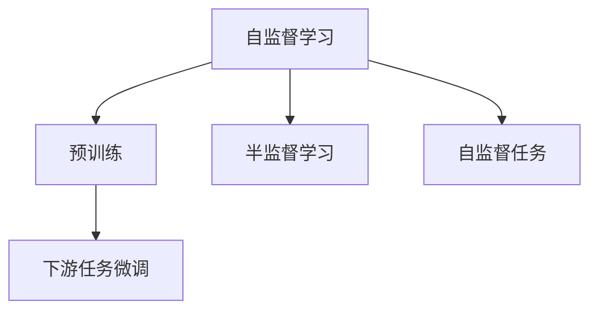

                 

# Self-Supervised Learning原理与代码实例讲解

> 关键词：Self-Supervised Learning, 预训练(Pre-training), 半监督学习(Semi-supervised Learning), 自监督学习(Self-supervised Learning), 语言模型, 代码实例, 深度学习

## 1. 背景介绍

### 1.1 问题由来
近年来，随着深度学习技术的飞速发展，大规模预训练语言模型在自然语言处理（NLP）领域取得了突破性的进展。这些模型通过在大规模无标签文本数据上进行预训练，能够学习到丰富的语言知识和常识，进而对各类下游任务进行微调（Fine-tuning），以获得优异的性能。其中，基于自监督学习任务的预训练方法尤为突出，其通过设计巧妙的预训练任务，使得模型能够从无标签数据中学习到有用的语言表示。

自监督学习是指在缺少标注数据的情况下，通过设计巧妙的任务（自监督任务），利用数据本身的结构和信息，自动生成监督信号，对模型进行训练。这种方法不仅能够减少对标注数据的需求，还能够有效利用大规模非标注数据，从而提升模型的泛化能力和性能。

### 1.2 问题核心关键点
自监督学习的核心思想在于：利用数据自身的特性，自动生成监督信号，使得模型能够在没有标注数据的情况下进行学习和优化。这种自监督任务通常包括文本的掩码预测、语言建模、句子模拟等。自监督学习广泛应用于各种NLP任务中，例如文本分类、命名实体识别、关系抽取等。

自监督学习与监督学习（Supervised Learning）的关键区别在于：监督学习需要大量的标注数据进行训练，而自监督学习则依赖于数据自身的结构和信息，能够从无标签数据中挖掘出监督信号。

### 1.3 问题研究意义
研究自监督学习方法，对于拓展大模型的应用范围，提升下游任务的性能，加速NLP技术的产业化进程，具有重要意义：

1. **降低应用开发成本**：自监督学习能够有效利用大规模非标注数据，减少了从头开发所需的数据、计算和人力等成本投入。
2. **提升模型效果**：自监督学习使得通用大模型更好地适应特定任务，在应用场景中取得更优表现。
3. **加速开发进度**：standing on the shoulders of giants，自监督学习使得开发者可以更快地完成任务适配，缩短开发周期。
4. **带来技术创新**：自监督学习范式促进了对预训练-微调的深入研究，催生了提示学习、少样本学习等新的研究方向。
5. **赋能产业升级**：自监督学习技术更容易被各行各业所采用，为传统行业数字化转型升级提供新的技术路径。

## 2. 核心概念与联系

### 2.1 核心概念概述

为更好地理解自监督学习的方法，本节将介绍几个密切相关的核心概念：

- **自监督学习（Self-Supervised Learning）**：利用数据自身的结构和信息，自动生成监督信号，对模型进行训练的方法。自监督学习的目标是最大化数据本身的潜在信息，提升模型的泛化能力和性能。
- **预训练（Pre-training）**：指在大规模无标签文本语料上，通过自监督学习任务训练通用语言模型的过程。预训练使得模型学习到语言的通用表示，为下游任务提供了强大的特征提取能力。
- **半监督学习（Semi-supervised Learning）**：结合标注数据和非标注数据进行训练，利用少量标注数据和大量非标注数据提升模型性能的方法。半监督学习能够在保持模型性能的同时，有效降低对标注数据的依赖。
- **自监督任务（Self-supervised Task）**：设计巧妙的任务，利用数据自身的特性，自动生成监督信号。常见的自监督任务包括掩码预测、语言建模、句子模拟等。

这些核心概念之间的逻辑关系可以通过以下Mermaid流程图来展示：



这个流程图展示出自监督学习与预训练、半监督学习、下游任务微调之间的联系：

1. 自监督学习通过预训练任务在无标签数据上训练模型。
2. 预训练后的模型可以作为特征提取器，应用于下游任务的微调中。
3. 半监督学习结合标注数据和非标注数据进行训练，进一步提升模型性能。
4. 自监督任务是自监督学习的基础，通过巧妙设计，使模型能够自动生成监督信号。

## 3. 核心算法原理 & 具体操作步骤
### 3.1 算法原理概述

自监督学习的核心在于设计合适的自监督任务，利用数据自身的结构和信息，自动生成监督信号，对模型进行训练。自监督学习通常包括以下几个关键步骤：

1. **数据准备**：收集大规模非标注文本数据，如维基百科、新闻文章、论坛帖子等。
2. **自监督任务设计**：设计巧妙的自监督任务，如掩码预测、语言建模、句子模拟等。
3. **预训练模型加载**：选择合适的预训练语言模型，如BERT、GPT等。
4. **模型训练**：在自监督任务上对预训练模型进行训练，最大化数据本身的潜在信息。
5. **下游任务微调**：将预训练后的模型作为特征提取器，应用于下游任务的微调中，进一步提升模型性能。

### 3.2 算法步骤详解

以下是使用自监督学习进行模型预训练和微调的一般步骤：

**Step 1: 数据准备**
- 收集大规模非标注文本数据，如维基百科、新闻文章、论坛帖子等。
- 对数据进行清洗、分词、归一化等预处理操作。

**Step 2: 自监督任务设计**
- 设计合适的自监督任务，如掩码预测、语言建模、句子模拟等。
- 选择任务的结构和参数，如掩码比例、预测位置等。

**Step 3: 预训练模型加载**
- 选择合适的预训练语言模型，如BERT、GPT等。
- 将预训练模型加载到内存中，进行后续的训练。

**Step 4: 模型训练**
- 在自监督任务上对预训练模型进行训练，最大化数据本身的潜在信息。
- 选择适当的优化器、学习率、训练轮数等超参数。
- 在训练过程中监控模型性能，如损失函数、准确率等指标。

**Step 5: 下游任务微调**
- 将预训练后的模型作为特征提取器，应用于下游任务的微调中。
- 选择适当的任务适配层和损失函数，如分类器、解码器等。
- 在微调过程中设置合适的超参数，如学习率、批大小等。
- 对微调后的模型进行评估，对比微调前后的性能提升。

### 3.3 算法优缺点

自监督学习的优点包括：
1. **降低对标注数据的依赖**：自监督学习可以利用大规模非标注数据进行训练，减少了标注数据的需求。
2. **提升模型的泛化能力**：自监督学习通过最大化数据本身的潜在信息，提升了模型的泛化能力和性能。
3. **训练效率高**：自监督学习能够在较短的时间内完成预训练，显著提升了模型训练的效率。

自监督学习的缺点包括：
1. **数据质量要求高**：自监督任务的设计需要考虑数据的质量和多样性，确保任务的难度适中。
2. **自监督任务设计复杂**：设计巧妙的自监督任务需要深入理解数据特性，具有一定的复杂性。
3. **预训练模型效果有限**：虽然自监督学习能够提升模型性能，但在特定领域的应用效果可能有限。

尽管存在这些局限性，但自监督学习仍是当前NLP领域的重要研究范式，具有广泛的应用前景。未来相关研究的重点在于如何进一步提高自监督任务的自动化设计能力，提升预训练模型的泛化能力，以及降低对标注数据的依赖。

### 3.4 算法应用领域

自监督学习在NLP领域已经得到了广泛的应用，覆盖了几乎所有常见任务，例如：

- 文本分类：如情感分析、主题分类、意图识别等。通过自监督学习使模型学习文本-标签映射。
- 命名实体识别：识别文本中的人名、地名、机构名等特定实体。通过自监督学习使模型掌握实体边界和类型。
- 关系抽取：从文本中抽取实体之间的语义关系。通过自监督学习使模型学习实体-关系三元组。
- 问答系统：对自然语言问题给出答案。将问题-答案对作为自监督任务进行预训练。
- 机器翻译：将源语言文本翻译成目标语言。通过自监督学习使模型学习语言-语言映射。
- 文本摘要：将长文本压缩成简短摘要。将文章-摘要对作为自监督任务进行预训练。
- 对话系统：使机器能够与人自然对话。将多轮对话历史作为上下文，自监督学习进行回复生成。

除了上述这些经典任务外，自监督学习还被创新性地应用到更多场景中，如可控文本生成、常识推理、代码生成、数据增强等，为NLP技术带来了全新的突破。随着预训练模型和自监督学习方法的不断进步，相信NLP技术将在更广阔的应用领域大放异彩。

## 4. 数学模型和公式 & 详细讲解  
### 4.1 数学模型构建

本节将使用数学语言对自监督学习的数学模型进行更加严格的刻画。

记自监督学习的模型为 $M_{\theta}:\mathcal{X} \rightarrow \mathcal{Y}$，其中 $\mathcal{X}$ 为输入空间，$\mathcal{Y}$ 为输出空间，$\theta \in \mathbb{R}^d$ 为模型参数。假设自监督任务为 $T$，其训练集为 $D=\{(x_i, y_i)\}_{i=1}^N, x_i \in \mathcal{X}, y_i \in \mathcal{Y}$。

定义模型 $M_{\theta}$ 在数据样本 $(x,y)$ 上的损失函数为 $\ell(M_{\theta}(x),y)$，则在数据集 $D$ 上的经验风险为：

$$
\mathcal{L}(\theta) = \frac{1}{N} \sum_{i=1}^N \ell(M_{\theta}(x_i),y_i)
$$

在自监督学习中，我们通常使用自监督任务的生成目标函数来训练模型。以语言建模任务为例，假设模型在输入 $x$ 上的输出为 $\hat{y}=M_{\theta}(x) \in [0,1]$，表示样本属于正类的概率。自监督任务的生成目标函数可以表示为：

$$
\mathcal{L}_{\text{generation}}(\theta) = -\frac{1}{N}\sum_{i=1}^N \log \hat{y_i}
$$

其中 $\hat{y_i}$ 为模型在输入 $x_i$ 上的生成概率，通常选择下一个单词或下一个子串的生成概率。

### 4.2 公式推导过程

以下我们以掩码预测任务为例，推导自监督学习目标函数及其梯度的计算公式。

假设模型 $M_{\theta}$ 在输入 $x$ 上的输出为 $\hat{y}=M_{\theta}(x) \in [0,1]$，表示样本属于正类的概率。自监督任务的掩码预测目标函数可以表示为：

$$
\mathcal{L}_{\text{mask}}(\theta) = -\frac{1}{N}\sum_{i=1}^N \log \hat{y_i}
$$

其中 $\hat{y_i}$ 为模型在输入 $x_i$ 上的生成概率，通常选择下一个单词或下一个子串的生成概率。

根据链式法则，损失函数对参数 $\theta_k$ 的梯度为：

$$
\frac{\partial \mathcal{L}_{\text{mask}}(\theta)}{\partial \theta_k} = -\frac{1}{N}\sum_{i=1}^N \frac{\partial \log \hat{y_i}}{\partial \theta_k}
$$

其中 $\frac{\partial \log \hat{y_i}}{\partial \theta_k}$ 可进一步递归展开，利用自动微分技术完成计算。

在得到自监督任务的梯度后，即可带入自监督学习的优化算法，完成模型的迭代优化。重复上述过程直至收敛，最终得到适应该自监督任务的模型参数 $\theta^*$。

## 5. 项目实践：代码实例和详细解释说明
### 5.1 开发环境搭建

在进行自监督学习实践前，我们需要准备好开发环境。以下是使用Python进行PyTorch开发的环境配置流程：

1. 安装Anaconda：从官网下载并安装Anaconda，用于创建独立的Python环境。

2. 创建并激活虚拟环境：
```bash
conda create -n pytorch-env python=3.8 
conda activate pytorch-env
```

3. 安装PyTorch：根据CUDA版本，从官网获取对应的安装命令。例如：
```bash
conda install pytorch torchvision torchaudio cudatoolkit=11.1 -c pytorch -c conda-forge
```

4. 安装TensorFlow：由Google主导开发的开源深度学习框架，生产部署方便，适合大规模工程应用。同样有丰富的预训练语言模型资源。

5. 安装Transformers库：HuggingFace开发的NLP工具库，集成了众多SOTA语言模型，支持PyTorch和TensorFlow，是进行自监督学习任务开发的利器。

6. 安装各类工具包：
```bash
pip install numpy pandas scikit-learn matplotlib tqdm jupyter notebook ipython
```

完成上述步骤后，即可在`pytorch-env`环境中开始自监督学习实践。

### 5.2 源代码详细实现

下面我们以BERT模型的掩码预测任务为例，给出使用Transformers库进行自监督学习的PyTorch代码实现。

首先，定义掩码预测任务的数据处理函数：

```python
from transformers import BertTokenizer
from torch.utils.data import Dataset
import torch

class MaskedPredictionDataset(Dataset):
    def __init__(self, texts, tokenizer, max_len=128):
        self.texts = texts
        self.tokenizer = tokenizer
        self.max_len = max_len
        
    def __len__(self):
        return len(self.texts)
    
    def __getitem__(self, item):
        text = self.texts[item]
        encoding = self.tokenizer(text, return_tensors='pt', max_length=self.max_len, padding='max_length', truncation=True)
        input_ids = encoding['input_ids'][0]
        attention_mask = encoding['attention_mask'][0]
        mask_pos = encoding['attention_mask'][0] == 0
        labels = input_ids.masked_fill(mask_pos, -100)
        
        return {'input_ids': input_ids, 
                'attention_mask': attention_mask,
                'mask_pos': mask_pos,
                'labels': labels}

# 创建dataset
tokenizer = BertTokenizer.from_pretrained('bert-base-cased')

train_dataset = MaskedPredictionDataset(train_texts, tokenizer)
dev_dataset = MaskedPredictionDataset(dev_texts, tokenizer)
test_dataset = MaskedPredictionDataset(test_texts, tokenizer)
```

然后，定义模型和优化器：

```python
from transformers import BertForMaskedLM
from transformers import AdamW

model = BertForMaskedLM.from_pretrained('bert-base-cased')
optimizer = AdamW(model.parameters(), lr=2e-5)
```

接着，定义训练和评估函数：

```python
from torch.utils.data import DataLoader
from tqdm import tqdm
from sklearn.metrics import accuracy_score

device = torch.device('cuda') if torch.cuda.is_available() else torch.device('cpu')
model.to(device)

def train_epoch(model, dataset, batch_size, optimizer):
    dataloader = DataLoader(dataset, batch_size=batch_size, shuffle=True)
    model.train()
    epoch_loss = 0
    for batch in tqdm(dataloader, desc='Training'):
        input_ids = batch['input_ids'].to(device)
        attention_mask = batch['attention_mask'].to(device)
        mask_pos = batch['mask_pos'].to(device)
        labels = batch['labels'].to(device)
        model.zero_grad()
        outputs = model(input_ids, attention_mask=attention_mask, labels=labels, masked_lm_labels=labels)
        loss = outputs.loss
        epoch_loss += loss.item()
        loss.backward()
        optimizer.step()
    return epoch_loss / len(dataloader)

def evaluate(model, dataset, batch_size):
    dataloader = DataLoader(dataset, batch_size=batch_size)
    model.eval()
    preds, labels = [], []
    with torch.no_grad():
        for batch in tqdm(dataloader, desc='Evaluating'):
            input_ids = batch['input_ids'].to(device)
            attention_mask = batch['attention_mask'].to(device)
            mask_pos = batch['mask_pos'].to(device)
            batch_labels = batch['labels']
            outputs = model(input_ids, attention_mask=attention_mask, labels=labels, masked_lm_labels=labels)
            batch_preds = outputs.logits.argmax(dim=2).to('cpu').tolist()
            batch_labels = batch_labels.to('cpu').tolist()
            for pred_tokens, label_tokens in zip(batch_preds, batch_labels):
                pred_tokens = id2tag[_id] for _id in pred_tokens]
                label_tokens = id2tag[_id] for _id in label_tokens]
                preds.append(pred_tokens[:len(label_tokens)])
                labels.append(label_tokens)
                
    return accuracy_score(labels, preds)
```

最后，启动训练流程并在测试集上评估：

```python
epochs = 5
batch_size = 16

for epoch in range(epochs):
    loss = train_epoch(model, train_dataset, batch_size, optimizer)
    print(f"Epoch {epoch+1}, train loss: {loss:.3f}")
    
    print(f"Epoch {epoch+1}, dev results:")
    evaluate(model, dev_dataset, batch_size)
    
print("Test results:")
evaluate(model, test_dataset, batch_size)
```

以上就是使用PyTorch对BERT模型进行掩码预测任务自监督学习的完整代码实现。可以看到，得益于Transformers库的强大封装，我们可以用相对简洁的代码完成BERT模型的加载和自监督学习。

### 5.3 代码解读与分析

让我们再详细解读一下关键代码的实现细节：

**MaskedPredictionDataset类**：
- `__init__`方法：初始化文本、分词器等关键组件。
- `__len__`方法：返回数据集的样本数量。
- `__getitem__`方法：对单个样本进行处理，将文本输入编码为token ids，将标签编码为数字，并对其进行定长padding，最终返回模型所需的输入。

**tokenizer**：
- 定义了文本和标签的编码方式，确保与模型兼容。

**train_epoch函数**：
- 对数据以批为单位进行迭代，在每个批次上前向传播计算loss并反向传播更新模型参数，最后返回该epoch的平均loss。

**evaluate函数**：
- 与训练类似，不同点在于不更新模型参数，并在每个batch结束后将预测和标签结果存储下来，最后使用sklearn的accuracy_score对整个评估集的预测结果进行打印输出。

**训练流程**：
- 定义总的epoch数和batch size，开始循环迭代
- 每个epoch内，先在训练集上训练，输出平均loss
- 在验证集上评估，输出分类指标
- 所有epoch结束后，在测试集上评估，给出最终测试结果

可以看到，PyTorch配合Transformers库使得BERT模型的自监督学习代码实现变得简洁高效。开发者可以将更多精力放在数据处理、模型改进等高层逻辑上，而不必过多关注底层的实现细节。

当然，工业级的系统实现还需考虑更多因素，如模型的保存和部署、超参数的自动搜索、更灵活的任务适配层等。但核心的自监督学习范式基本与此类似。

## 6. 实际应用场景
### 6.1 智能客服系统

基于自监督学习的对话技术，可以广泛应用于智能客服系统的构建。传统客服往往需要配备大量人力，高峰期响应缓慢，且一致性和专业性难以保证。而使用自监督学习对话模型，可以7x24小时不间断服务，快速响应客户咨询，用自然流畅的语言解答各类常见问题。

在技术实现上，可以收集企业内部的历史客服对话记录，将问题和最佳答复构建成监督数据，在此基础上对预训练对话模型进行微调。微调后的对话模型能够自动理解用户意图，匹配最合适的答案模板进行回复。对于客户提出的新问题，还可以接入检索系统实时搜索相关内容，动态组织生成回答。如此构建的智能客服系统，能大幅提升客户咨询体验和问题解决效率。

### 6.2 金融舆情监测

金融机构需要实时监测市场舆论动向，以便及时应对负面信息传播，规避金融风险。传统的人工监测方式成本高、效率低，难以应对网络时代海量信息爆发的挑战。基于自监督学习的文本分类和情感分析技术，为金融舆情监测提供了新的解决方案。

具体而言，可以收集金融领域相关的新闻、报道、评论等文本数据，并对其进行主题标注和情感标注。在此基础上对预训练语言模型进行微调，使其能够自动判断文本属于何种主题，情感倾向是正面、中性还是负面。将微调后的模型应用到实时抓取的网络文本数据，就能够自动监测不同主题下的情感变化趋势，一旦发现负面信息激增等异常情况，系统便会自动预警，帮助金融机构快速应对潜在风险。

### 6.3 个性化推荐系统

当前的推荐系统往往只依赖用户的历史行为数据进行物品推荐，无法深入理解用户的真实兴趣偏好。基于自监督学习的个性化推荐系统可以更好地挖掘用户行为背后的语义信息，从而提供更精准、多样的推荐内容。

在实践中，可以收集用户浏览、点击、评论、分享等行为数据，提取和用户交互的物品标题、描述、标签等文本内容。将文本内容作为模型输入，用户的后续行为（如是否点击、购买等）作为监督信号，在此基础上微调预训练语言模型。微调后的模型能够从文本内容中准确把握用户的兴趣点。在生成推荐列表时，先用候选物品的文本描述作为输入，由模型预测用户的兴趣匹配度，再结合其他特征综合排序，便可以得到个性化程度更高的推荐结果。

### 6.4 未来应用展望

随着自监督学习方法的不断发展，其在NLP领域的应用将更加广泛和深入。未来，自监督学习可能进一步应用于以下领域：

1. **文本生成**：自监督学习可以用于文本生成任务，如自动摘要、故事生成、诗歌创作等。通过自监督学习，模型能够从文本语料中学习到丰富的语言知识和结构，生成自然流畅的文本。

2. **多模态学习**：自监督学习可以与其他模态的数据（如图像、音频等）结合，实现跨模态的联合建模。多模态信息的融合，将显著提升语言模型对现实世界的理解和建模能力。

3. **信息检索**：自监督学习可以用于信息检索任务，提升搜索结果的相关性和多样性。通过自监督学习，模型能够从文本语料中学习到更为精准的语义表示，提升检索效果。

4. **知识图谱**：自监督学习可以用于知识图谱的构建和更新。通过自监督学习，模型能够从文本语料中学习到实体之间的关系和属性，构建更为全面和准确的知识图谱。

5. **对话系统**：自监督学习可以用于对话系统的构建，提升系统的自然性和智能性。通过自监督学习，模型能够从对话数据中学习到对话策略和语义理解能力，提升对话系统的性能。

6. **异常检测**：自监督学习可以用于异常检测任务，检测数据中的异常模式和噪声。通过自监督学习，模型能够从数据中学习到正常的模式，检测出异常数据。

这些方向的探索发展，将进一步提升自监督学习的应用范围和深度，为自然语言处理和人工智能技术带来新的突破。

## 7. 工具和资源推荐
### 7.1 学习资源推荐

为了帮助开发者系统掌握自监督学习的基本原理和实践技巧，这里推荐一些优质的学习资源：

1. 《深度学习理论与实践》系列博文：由大模型技术专家撰写，深入浅出地介绍了深度学习的基本原理和实践技巧。

2. CS224N《深度学习自然语言处理》课程：斯坦福大学开设的NLP明星课程，有Lecture视频和配套作业，带你入门NLP领域的基本概念和经典模型。

3. 《Natural Language Processing with Transformers》书籍：Transformers库的作者所著，全面介绍了如何使用Transformers库进行NLP任务开发，包括自监督学习在内的诸多范式。

4. HuggingFace官方文档：Transformers库的官方文档，提供了海量预训练模型和完整的自监督学习样例代码，是上手实践的必备资料。

5. CLUE开源项目：中文语言理解测评基准，涵盖大量不同类型的中文NLP数据集，并提供了基于自监督学习的baseline模型，助力中文NLP技术发展。

通过对这些资源的学习实践，相信你一定能够快速掌握自监督学习的基本原理和实践技巧，并用于解决实际的NLP问题。
###  7.2 开发工具推荐

高效的开发离不开优秀的工具支持。以下是几款用于自监督学习开发的常用工具：

1. PyTorch：基于Python的开源深度学习框架，灵活动态的计算图，适合快速迭代研究。大部分预训练语言模型都有PyTorch版本的实现。

2. TensorFlow：由Google主导开发的开源深度学习框架，生产部署方便，适合大规模工程应用。同样有丰富的预训练语言模型资源。

3. Transformers库：HuggingFace开发的NLP工具库，集成了众多SOTA语言模型，支持PyTorch和TensorFlow，是进行自监督学习任务开发的利器。

4. Weights & Biases：模型训练的实验跟踪工具，可以记录和可视化模型训练过程中的各项指标，方便对比和调优。与主流深度学习框架无缝集成。

5. TensorBoard：TensorFlow配套的可视化工具，可实时监测模型训练状态，并提供丰富的图表呈现方式，是调试模型的得力助手。

6. Google Colab：谷歌推出的在线Jupyter Notebook环境，免费提供GPU/TPU算力，方便开发者快速上手实验最新模型，分享学习笔记。

合理利用这些工具，可以显著提升自监督学习任务的开发效率，加快创新迭代的步伐。

### 7.3 相关论文推荐

自监督学习在NLP领域已经得到了广泛的应用，以下是几篇奠基性的相关论文，推荐阅读：

1. Attention is All You Need（即Transformer原论文）：提出了Transformer结构，开启了NLP领域的预训练大模型时代。

2. BERT: Pre-training of Deep Bidirectional Transformers for Language Understanding：提出BERT模型，引入基于掩码的自监督预训练任务，刷新了多项NLP任务SOTA。

3. Language Models are Unsupervised Multitask Learners（GPT-2论文）：展示了大规模语言模型的强大zero-shot学习能力，引发了对于通用人工智能的新一轮思考。

4. Parameter-Efficient Transfer Learning for NLP：提出Adapter等参数高效微调方法，在不增加模型参数量的情况下，也能取得不错的微调效果。

5. Self-Supervised Learning via Masked Language Modeling（BERT论文）：介绍了BERT模型，通过掩码预测任务进行自监督预训练，提升了语言模型的性能。

6. Advanced Self-Supervised Learning for Semantic Representation（ALBERT论文）：提出ALBERT模型，通过优化自监督任务的设计，提升了模型的训练效率和泛化能力。

这些论文代表了大自监督学习技术的发展脉络。通过学习这些前沿成果，可以帮助研究者把握学科前进方向，激发更多的创新灵感。

## 8. 总结：未来发展趋势与挑战
### 8.1 总结

本文对自监督学习的基本原理和实践技巧进行了全面系统的介绍。首先阐述了自监督学习的核心思想和应用场景，明确了自监督学习在NLP领域的重要地位和广泛应用。其次，从原理到实践，详细讲解了自监督学习的数学模型和关键步骤，给出了自监督学习任务开发的完整代码实例。同时，本文还广泛探讨了自监督学习方法在智能客服、金融舆情、个性化推荐等多个行业领域的应用前景，展示了自监督学习技术的巨大潜力。此外，本文精选了自监督学习技术的各类学习资源，力求为读者提供全方位的技术指引。

通过本文的系统梳理，可以看到，自监督学习已经成为NLP领域的重要研究范式，极大地拓展了预训练语言模型的应用边界，催生了更多的落地场景。得益于大规模语料的预训练，自监督学习能够在无标注数据上进行有效的学习，提升了模型的泛化能力和性能。未来，随着自监督学习方法的不断进步，自监督学习技术必将在构建人机协同的智能系统中扮演越来越重要的角色。

### 8.2 未来发展趋势

展望未来，自监督学习技术将呈现以下几个发展趋势：

1. **模型规模持续增大**：随着算力成本的下降和数据规模的扩张，预训练语言模型的参数量还将持续增长。超大规模语言模型蕴含的丰富语言知识，有望支撑更加复杂多变的下游任务。

2. **自监督任务设计自动化**：随着深度学习技术的发展，自监督任务的设计将更加自动化，无需依赖人类专家，通过算法生成合适的自监督任务。

3. **自监督学习与迁移学习结合**：自监督学习可以与迁移学习结合，提升模型的泛化能力和迁移能力，减少对标注数据的依赖。

4. **多模态自监督学习**：自监督学习可以与其他模态的数据（如图像、音频等）结合，实现跨模态的联合建模，提升语言模型对现实世界的理解和建模能力。

5. **自监督学习与强化学习结合**：自监督学习可以与强化学习结合，提升模型的智能性和适应性，实现更灵活的训练和优化。

6. **自监督学习与知识图谱结合**：自监督学习可以用于知识图谱的构建和更新，提升知识表示的全面性和准确性。

这些趋势凸显了自监督学习技术的广阔前景。这些方向的探索发展，必将进一步提升自监督学习的应用范围和深度，为自然语言处理和人工智能技术带来新的突破。

### 8.3 面临的挑战

尽管自监督学习技术已经取得了瞩目成就，但在迈向更加智能化、普适化应用的过程中，它仍面临诸多挑战：

1. **数据质量要求高**：自监督任务的设计需要考虑数据的质量和多样性，确保任务的难度适中。
2. **自监督任务设计复杂**：设计巧妙的自监督任务需要深入理解数据特性，具有一定的复杂性。
3. **预训练模型效果有限**：虽然自监督学习能够提升模型性能，但在特定领域的应用效果可能有限。
4. **资源消耗高**：自监督学习通常在计算资源密集型设备上进行训练，如GPU/TPU等，需要较高的硬件成本。

尽管存在这些局限性，但自监督学习仍是当前NLP领域的重要研究范式，具有广泛的应用前景。未来相关研究的重点在于如何进一步提高自监督任务的自动化设计能力，提升预训练模型的泛化能力，以及降低对标注数据的依赖。

### 8.4 研究展望

面对自监督学习所面临的种种挑战，未来的研究需要在以下几个方面寻求新的突破：

1. **探索无监督和半监督自监督学习方法**：摆脱对大规模标注数据的依赖，利用自监督学习范式，最大化利用非结构化数据，实现更加灵活高效的训练。

2. **研究参数高效和计算高效的自监督范式**：开发更加参数高效的自监督方法，在固定大部分预训练参数的同时，只更新极少量的任务相关参数。同时优化自监督学习的计算图，减少前向传播和反向传播的资源消耗，实现更加轻量级、实时性的部署。

3. **融合因果和对比学习范式**：通过引入因果推断和对比学习思想，增强自监督学习模型建立稳定因果关系的能力，学习更加普适、鲁棒的语言表征，从而提升模型泛化性和抗干扰能力。

4. **引入更多先验知识**：将符号化的先验知识，如知识图谱、逻辑规则等，与神经网络模型进行巧妙融合，引导自监督学习过程学习更准确、合理的语言模型。同时加强不同模态数据的整合，实现视觉、语音等多模态信息与文本信息的协同建模。

5. **结合因果分析和博弈论工具**：将因果分析方法引入自监督学习模型，识别出模型决策的关键特征，增强输出解释的因果性和逻辑性。借助博弈论工具刻画人机交互过程，主动探索并规避模型的脆弱点，提高系统稳定性。

6. **纳入伦理道德约束**：在模型训练目标中引入伦理导向的评估指标，过滤和惩罚有偏见、有害的输出倾向。同时加强人工干预和审核，建立模型行为的监管机制，确保输出符合人类价值观和伦理道德。

这些研究方向的探索，必将引领自监督学习技术迈向更高的台阶，为构建安全、可靠、可解释、可控的智能系统铺平道路。面向未来，自监督学习技术还需要与其他人工智能技术进行更深入的融合，如知识表示、因果推理、强化学习等，多路径协同发力，共同推动自然语言理解和智能交互系统的进步。只有勇于创新、敢于突破，才能不断拓展自监督学习模型的边界，让智能技术更好地造福人类社会。

## 9. 附录：常见问题与解答

**Q1：自监督学习和监督学习有何区别？**

A: 自监督学习和监督学习的主要区别在于：
1. 监督学习需要大量的标注数据进行训练，而自监督学习则依赖于数据自身的结构和信息，能够从无标签数据中挖掘出监督信号。
2. 监督学习通过标注数据提供明确的监督信号，自监督学习则通过数据自身的特性自动生成监督信号。
3. 监督学习通常用于分类、回归等任务，自监督学习可以应用于掩码预测、语言建模、句子模拟等自监督任务。

**Q2：如何选择合适的自监督任务？**

A: 选择自监督任务需要考虑以下因素：
1. 任务的难度适中，避免过于简单或复杂，确保模型能够从中学习到有用的信息。
2. 任务具有丰富的多样性，覆盖多种语言现象，如词性标注、实体识别、关系抽取等。
3. 任务与目标任务相关，能够提升模型在目标任务上的性能。
4. 任务的设计应考虑数据的质量和多样性，确保任务的难度适中。

**Q3：自监督学习模型的训练效率如何？**

A: 自监督学习模型的训练效率通常较高，特别是在大规模数据集上进行预训练时。自监督学习能够最大化数据本身的潜在信息，提升模型的泛化能力和性能。但在大规模数据集上进行自监督学习，仍然需要较高的计算资源，如GPU/TPU等。

**Q4：自监督学习模型在特定领域的应用效果如何？**

A: 自监督学习模型在特定领域的应用效果取决于数据的质量和任务的复杂性。对于数据丰富、任务多样化的领域，自监督学习能够取得不错的效果。但对于某些特定领域，如医学、法律等，仅仅依靠通用语料预训练的模型可能难以很好地适应。此时需要在特定领域语料上进一步预训练，再进行微调，才能获得理想效果。

**Q5：自监督学习模型在训练过程中如何避免过拟合？**

A: 避免过拟合可以采取以下策略：
1. 数据增强：通过回译、近义替换等方式扩充训练集。
2. 正则化：使用L2正则、Dropout、Early Stopping等避免过拟合。
3. 对抗训练：加入对抗样本，提高模型鲁棒性。
4. 参数高效微调：只调整少量参数，减少需优化的参数量。
5. 模型裁剪：去除不必要的层和参数，减小模型尺寸，加快推理速度。

这些策略往往需要根据具体任务和数据特点进行灵活组合。只有在数据、模型、训练、推理等各环节进行全面优化，才能最大限度地发挥自监督学习模型的威力。

**Q6：自监督学习模型在实际部署中需要注意哪些问题？**

A: 将自监督学习模型转化为实际应用，还需要考虑以下因素：
1. 模型裁剪：去除不必要的层和参数，减小模型尺寸，加快推理速度。
2. 量化加速：将浮点模型转为定点模型，压缩存储空间，提高计算效率。
3. 服务化封装：将模型封装为标准化服务接口，便于集成调用。
4. 弹性伸缩：根据请求流量动态调整资源配置，平衡服务质量和成本。
5. 监控告警：实时采集系统指标，设置异常告警阈值，确保服务稳定性。
6. 安全防护：采用访问鉴权、数据脱敏等措施，保障数据和模型安全。

自监督学习模型在实际部署中，还需要考虑模型的优化、部署、监控等多个方面，才能真正实现高效的智能应用。

---

作者：禅与计算机程序设计艺术 / Zen and the Art of Computer Programming

