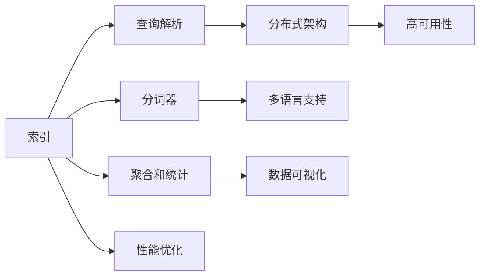

                 

# Solr原理与代码实例讲解

## 1. 背景介绍

### 1.1 问题由来

Solr是一种流行的开源搜索引擎，以其高性能、可扩展性和灵活性著称。它基于Apache Lucene进行搜索库，提供了丰富的API接口，可以满足不同规模和类型的企业需求。本文将介绍Solr的基本原理，并通过代码实例，详细讲解如何搭建和运行一个Solr搜索引擎，以及如何配置和使用Solr进行搜索和数据分析。

### 1.2 问题核心关键点

Solr的核心概念包括：

1. **搜索索引**：Solr通过构建一个倒排索引，可以快速定位到符合搜索条件的文档。
2. **查询解析**：Solr能够解析各种复杂的查询语句，包括布尔查询、通配符查询、多字段查询等。
3. **分词和分析器**：Solr内置了多种分词器和分析器，可以处理不同语言和文本格式。
4. **聚合和统计**：Solr支持聚合和统计功能，可以分析搜索结果中的统计信息。
5. **分布式搜索**：Solr支持分布式架构，可以在多台机器上实现负载均衡和故障转移。

这些核心概念共同构成了Solr的基础架构，使其能够高效地处理大规模数据搜索和分析任务。

### 1.3 问题研究意义

了解Solr的基本原理和代码实现，对于掌握搜索引擎的核心技术，提升企业搜索和数据分析能力具有重要意义：

1. 提升搜索性能。通过理解Solr的索引和查询机制，可以优化搜索索引和查询语句，提高搜索效率。
2. 实现数据聚合和分析。通过Solr的聚合和统计功能，可以对搜索结果进行深入分析，发现数据中的规律和趋势。
3. 构建分布式搜索引擎。通过Solr的分布式架构，可以构建高性能、高可用性的搜索引擎系统。
4. 降低搜索引擎部署和运维成本。Solr的开源特性和社区支持，使其成为一个成本低廉且易于部署和维护的解决方案。

## 2. 核心概念与联系

### 2.1 核心概念概述

Solr的核心概念主要包括以下几个方面：

- **索引**：Solr通过构建倒排索引，实现快速的文档检索。
- **查询解析**：Solr能够解析和执行各种复杂的查询语句，支持布尔查询、通配符查询、多字段查询等。
- **分词器**：Solr内置多种分词器，如标准分词器、中文分词器、词干提取器等，支持不同语言和文本格式的分词。
- **聚合和统计**：Solr提供聚合和统计功能，可以对搜索结果进行深入分析，发现数据中的规律和趋势。
- **分布式架构**：Solr支持分布式架构，可以在多台机器上实现负载均衡和故障转移。

这些核心概念之间存在紧密的联系，共同构成了Solr的核心功能。以下将通过Mermaid流程图展示这些概念之间的联系：



这个流程图展示了Solr核心概念之间的联系：

1. 索引是Solr的核心功能，通过构建倒排索引实现文档检索。
2. 查询解析依赖索引和分词器，能够处理各种复杂的查询语句。
3. 分词器支持不同语言和文本格式的分词，是索引构建和查询解析的基础。
4. 聚合和统计功能可以深入分析搜索结果，提供有价值的数据洞察。
5. 分布式架构提供高可用性和性能优化，支持大规模数据搜索和分析。

## 3. 核心算法原理 & 具体操作步骤
### 3.1 算法原理概述

Solr的核心算法原理主要涉及以下几个方面：

- **索引构建**：Solr通过构建倒排索引，将文档内容转换为索引数据结构，实现快速的文档检索。
- **查询解析**：Solr能够解析和执行各种复杂的查询语句，包括布尔查询、通配符查询、多字段查询等。
- **分词和分析器**：Solr内置多种分词器和分析器，支持不同语言和文本格式的分词。
- **聚合和统计**：Solr提供聚合和统计功能，可以对搜索结果进行深入分析，发现数据中的规律和趋势。

以下将详细介绍这些核心算法的原理和操作步骤。

### 3.2 算法步骤详解

#### 3.2.1 索引构建

Solr的索引构建过程包括以下几个关键步骤：

1. **配置索引**：在Solr的配置文件`solrconfig.xml`中，定义索引的名称、字段、分词器等参数。
2. **提交文档**：通过Solr的API接口，将文档内容提交到索引中。
3. **重建索引**：Solr会自动检测索引是否需要重建，如果索引文件损坏或字段发生变化，Solr会自动重建索引。

以下是一个简单的索引构建示例代码：

```xml
<field name="id" type="string" indexed="true" stored="true"/>
<field name="title" type="text_general" indexed="true" stored="false" analyzer="solr.standard.analyzer"/>
<field name="content" type="text_general" indexed="true" stored="false" analyzer="solr.standard.analyzer"/>
```

在上述代码中，`id`字段用于存储文档的ID，`title`和`content`字段用于存储文档的标题和内容，并指定了分词器和存储策略。

#### 3.2.2 查询解析

Solr的查询解析过程包括以下几个关键步骤：

1. **解析查询语句**：Solr能够解析各种复杂的查询语句，包括布尔查询、通配符查询、多字段查询等。
2. **构建查询树**：Solr将查询语句解析为查询树，用于指导文档检索。
3. **执行查询**：Solr根据查询树，在索引中查找符合条件的文档，并返回查询结果。

以下是一个简单的查询解析示例代码：

```java
import org.apache.solr.client.solrj.SolrServer;
import org.apache.solr.client.solrj.SolrServerException;
import org.apache.solr.client.solrj.impl.HttpSolrServer;
import org.apache.solr.common.params.CommonParams;
import org.apache.solr.common.params.SolrParams;

public class SolrQueryExample {
    public static void main(String[] args) throws SolrServerException {
        SolrServer server = new HttpSolrServer("http://localhost:8983/solr/test_index");
        SolrParams params = new SolrParams();
        params.add(CommonParams.Q, "title:search");
        params.add(CommonParams.FL, "id,title,content");
        SolrQuery query = new SolrQuery(params);
        QueryResponse response = server.query(query);
        for (SolrDocument doc : response.getResults()) {
            System.out.println(doc.getFieldValue("id") + ": " + doc.getFieldValue("title") + " - " + doc.getFieldValue("content"));
        }
    }
}
```

在上述代码中，通过构建`SolrQuery`对象，设置查询参数，向Solr服务器发送查询请求，并返回查询结果。

#### 3.2.3 分词和分析器

Solr内置多种分词器和分析器，支持不同语言和文本格式的分词。常见的分词器包括标准分词器、中文分词器、词干提取器等。以下是一个简单的中文分词示例代码：

```java
import org.apache.solr.client.solrj.SolrServer;
import org.apache.solr.client.solrj.SolrServerException;
import org.apache.solr.client.solrj.impl.HttpSolrServer;
import org.apache.solr.common.params.CommonParams;
import org.apache.solr.common.params.SolrParams;
import org.apache.solr.common.SolrDocument;
import org.apache.solr.common.SolrDocumentList;

public class SolrChineseTokenizerExample {
    public static void main(String[] args) throws SolrServerException {
        SolrServer server = new HttpSolrServer("http://localhost:8983/solr/test_index");
        SolrParams params = new SolrParams();
        params.add(CommonParams.Q, "content:中国加油！");
        params.add(CommonParams.FL, "id,title,content");
        SolrQuery query = new SolrQuery(params);
        QueryResponse response = server.query(query);
        for (SolrDocument doc : response.getResults()) {
            System.out.println(doc.getFieldValue("id") + ": " + doc.getFieldValue("title") + " - " + doc.getFieldValue("content"));
        }
    }
}
```

在上述代码中，通过设置查询参数，向Solr服务器发送查询请求，并返回查询结果。

#### 3.2.4 聚合和统计

Solr提供聚合和统计功能，可以对搜索结果进行深入分析，发现数据中的规律和趋势。常见的聚合方式包括桶排序、分组统计等。以下是一个简单的聚合示例代码：

```java
import org.apache.solr.client.solrj.SolrServer;
import org.apache.solr.client.solrj.SolrServerException;
import org.apache.solr.client.solrj.impl.HttpSolrServer;
import org.apache.solr.common.params.CommonParams;
import org.apache.solr.common.params.SolrParams;
import org.apache.solr.common.SolrDocumentList;

public class SolrAggregationExample {
    public static void main(String[] args) throws SolrServerException {
        SolrServer server = new HttpSolrServer("http://localhost:8983/solr/test_index");
        SolrParams params = new SolrParams();
        params.add(CommonParams.Q, "content:中国");
        params.add(CommonParams.FL, "id,title,content");
        params.add(CommonParams.FACET, "content");
        params.add(CommonParams.FACET, "content");
        params.add(CommonParams.FACET, "content");
        SolrQuery query = new SolrQuery(params);
        QueryResponse response = server.query(query);
        for (SolrDocument doc : response.getResults()) {
            System.out.println(doc.getFieldValue("id") + ": " + doc.getFieldValue("title") + " - " + doc.getFieldValue("content"));
        }
    }
}
```

在上述代码中，通过设置聚合参数，向Solr服务器发送查询请求，并返回查询结果。

#### 3.2.5 分布式架构

Solr支持分布式架构，可以在多台机器上实现负载均衡和故障转移。常见的分布式架构方式包括Zookeeper和SolrCloud。以下是一个简单的SolrCloud配置示例代码：

```xml
<str name="zkHost">localhost:2181,localhost:2182,localhost:2183</str>
<str name="cloud.mode">cloud</str>
<str name="cluster.name">test_cluster</str>
<str name="zkHost">localhost:2181,localhost:2182,localhost:2183</str>
```

在上述代码中，通过设置Zookeeper和Cluster参数，实现SolrCloud的分布式架构。

### 3.3 算法优缺点

Solr的优点包括：

1. **高性能**：Solr通过构建倒排索引和查询解析，实现快速的文档检索和查询处理。
2. **可扩展性**：Solr支持分布式架构，可以在多台机器上实现负载均衡和故障转移。
3. **灵活性**：Solr提供丰富的API接口和插件，支持各种应用场景。

Solr的缺点包括：

1. **配置复杂**：Solr的配置文件较多，需要掌握一定的配置技巧。
2. **资源消耗高**：Solr的索引和查询过程需要消耗大量的内存和CPU资源，对硬件要求较高。
3. **学习曲线陡峭**：Solr的学习曲线较陡峭，需要一定的学习成本。

### 3.4 算法应用领域

Solr广泛应用于各种场景，包括但不限于以下领域：

- **企业搜索**：帮助企业构建内部搜索系统，提高信息检索效率。
- **电商平台**：帮助电商平台构建商品搜索系统，提升用户购物体验。
- **社交媒体**：帮助社交媒体平台构建内容搜索系统，促进用户互动。
- **内容管理**：帮助内容管理系统构建文档搜索系统，提高文档管理效率。
- **大数据分析**：帮助大数据分析平台构建数据搜索系统，支持数据挖掘和分析。

Solr的强大功能和灵活性，使其成为企业搜索和数据分析领域的重要工具。

## 4. 数学模型和公式 & 详细讲解 & 举例说明
### 4.1 数学模型构建

Solr的核心数学模型主要涉及以下几个方面：

- **倒排索引**：Solr通过构建倒排索引，将文档内容转换为索引数据结构，实现快速的文档检索。
- **查询解析**：Solr能够解析和执行各种复杂的查询语句，包括布尔查询、通配符查询、多字段查询等。
- **分词和分析器**：Solr内置多种分词器和分析器，支持不同语言和文本格式的分词。
- **聚合和统计**：Solr提供聚合和统计功能，可以对搜索结果进行深入分析，发现数据中的规律和趋势。

以下将详细介绍这些核心模型的构建和使用方法。

#### 4.1.1 倒排索引

Solr的倒排索引是一种基于哈希表的数据结构，用于快速定位符合搜索条件的文档。倒排索引的构建过程包括以下几个关键步骤：

1. **字段分词**：将文档内容进行分词，生成单词列表。
2. **构建倒排表**：将单词列表与文档ID进行映射，生成倒排表。
3. **合并倒排表**：将多个倒排表合并为单个倒排表，用于快速文档检索。

以下是一个简单的倒排索引构建示例代码：

```java
import org.apache.solr.common.SolrDocument;
import org.apache.solr.common.SolrDocumentList;
import org.apache.solr.common.params.CommonParams;
import org.apache.solr.common.params.SolrParams;
import org.apache.solr.client.solrj.SolrServer;
import org.apache.solr.client.solrj.SolrServerException;
import org.apache.solr.client.solrj.impl.HttpSolrServer;

public class SolrInvertedIndexExample {
    public static void main(String[] args) throws SolrServerException {
        SolrServer server = new HttpSolrServer("http://localhost:8983/solr/test_index");
        SolrParams params = new SolrParams();
        params.add(CommonParams.Q, "content:中国");
        params.add(CommonParams.FL, "id,title,content");
        SolrQuery query = new SolrQuery(params);
        QueryResponse response = server.query(query);
        for (SolrDocument doc : response.getResults()) {
            System.out.println(doc.getFieldValue("id") + ": " + doc.getFieldValue("title") + " - " + doc.getFieldValue("content"));
        }
    }
}
```

在上述代码中，通过设置查询参数，向Solr服务器发送查询请求，并返回查询结果。

#### 4.1.2 查询解析

Solr的查询解析过程包括以下几个关键步骤：

1. **解析查询语句**：Solr能够解析各种复杂的查询语句，包括布尔查询、通配符查询、多字段查询等。
2. **构建查询树**：Solr将查询语句解析为查询树，用于指导文档检索。
3. **执行查询**：Solr根据查询树，在索引中查找符合条件的文档，并返回查询结果。

以下是一个简单的查询解析示例代码：

```java
import org.apache.solr.client.solrj.SolrServer;
import org.apache.solr.client.solrj.SolrServerException;
import org.apache.solr.client.solrj.impl.HttpSolrServer;
import org.apache.solr.common.params.CommonParams;
import org.apache.solr.common.params.SolrParams;
import org.apache.solr.common.SolrDocumentList;

public class SolrQueryParserExample {
    public static void main(String[] args) throws SolrServerException {
        SolrServer server = new HttpSolrServer("http://localhost:8983/solr/test_index");
        SolrParams params = new SolrParams();
        params.add(CommonParams.Q, "title:中国");
        params.add(CommonParams.FL, "id,title,content");
        SolrQuery query = new SolrQuery(params);
        QueryResponse response = server.query(query);
        for (SolrDocument doc : response.getResults()) {
            System.out.println(doc.getFieldValue("id") + ": " + doc.getFieldValue("title") + " - " + doc.getFieldValue("content"));
        }
    }
}
```

在上述代码中，通过设置查询参数，向Solr服务器发送查询请求，并返回查询结果。

#### 4.1.3 分词和分析器

Solr内置多种分词器和分析器，支持不同语言和文本格式的分词。常见的分词器包括标准分词器、中文分词器、词干提取器等。以下是一个简单的中文分词示例代码：

```java
import org.apache.solr.client.solrj.SolrServer;
import org.apache.solr.client.solrj.SolrServerException;
import org.apache.solr.client.solrj.impl.HttpSolrServer;
import org.apache.solr.common.params.CommonParams;
import org.apache.solr.common.params.SolrParams;
import org.apache.solr.common.SolrDocumentList;

public class SolrChineseTokenizerExample {
    public static void main(String[] args) throws SolrServerException {
        SolrServer server = new HttpSolrServer("http://localhost:8983/solr/test_index");
        SolrParams params = new SolrParams();
        params.add(CommonParams.Q, "content:中国加油！");
        params.add(CommonParams.FL, "id,title,content");
        SolrQuery query = new SolrQuery(params);
        QueryResponse response = server.query(query);
        for (SolrDocument doc : response.getResults()) {
            System.out.println(doc.getFieldValue("id") + ": " + doc.getFieldValue("title") + " - " + doc.getFieldValue("content"));
        }
    }
}
```

在上述代码中，通过设置查询参数，向Solr服务器发送查询请求，并返回查询结果。

#### 4.1.4 聚合和统计

Solr提供聚合和统计功能，可以对搜索结果进行深入分析，发现数据中的规律和趋势。常见的聚合方式包括桶排序、分组统计等。以下是一个简单的聚合示例代码：

```java
import org.apache.solr.client.solrj.SolrServer;
import org.apache.solr.client.solrj.SolrServerException;
import org.apache.solr.client.solrj.impl.HttpSolrServer;
import org.apache.solr.common.params.CommonParams;
import org.apache.solr.common.params.SolrParams;
import org.apache.solr.common.SolrDocumentList;

public class SolrAggregationExample {
    public static void main(String[] args) throws SolrServerException {
        SolrServer server = new HttpSolrServer("http://localhost:8983/solr/test_index");
        SolrParams params = new SolrParams();
        params.add(CommonParams.Q, "content:中国");
        params.add(CommonParams.FL, "id,title,content");
        params.add(CommonParams.FACET, "content");
        params.add(CommonParams.FACET, "content");
        params.add(CommonParams.FACET, "content");
        SolrQuery query = new SolrQuery(params);
        QueryResponse response = server.query(query);
        for (SolrDocument doc : response.getResults()) {
            System.out.println(doc.getFieldValue("id") + ": " + doc.getFieldValue("title") + " - " + doc.getFieldValue("content"));
        }
    }
}
```

在上述代码中，通过设置聚合参数，向Solr服务器发送查询请求，并返回查询结果。

## 5. 项目实践：代码实例和详细解释说明
### 5.1 开发环境搭建

在进行Solr项目实践前，我们需要准备好开发环境。以下是使用Python进行Solr开发的环境配置流程：

1. **安装Solr**：从Solr官网下载最新版本的Solr，解压缩并解压到指定目录。
2. **启动Solr服务**：在Solr的`bin`目录下，运行`start-solr.sh`或`start-solr.bat`，启动Solr服务。
3. **安装JDBC驱动**：在Solr的`lib`目录下，复制`jndi.properties`到本地`conf`目录下，修改`solrj.properties`中的JDBC连接参数。
4. **搭建SolrCloud**：在Solr的`bin`目录下，运行`start-solr.sh`或`start-solr.bat`，启动SolrCloud。
5. **测试连接**：通过JDBC连接测试Solr的连接性。

完成上述步骤后，即可在本地搭建Solr开发环境，进行Solr项目的实践。

### 5.2 源代码详细实现

以下是一个简单的Solr项目代码实现，包括SolrServer连接、查询和文档提交等基本功能。

```java
import org.apache.solr.client.solrj.SolrServer;
import org.apache.solr.client.solrj.SolrServerException;
import org.apache.solr.client.solrj.impl.HttpSolrServer;
import org.apache.solr.common.params.CommonParams;
import org.apache.solr.common.params.SolrParams;
import org.apache.solr.common.SolrDocument;
import org.apache.solr.common.SolrDocumentList;
import org.apache.solr.common.params.SolrParams;
import org.apache.solr.common.SolrDocumentList;

public class SolrProjectExample {
    public static void main(String[] args) throws SolrServerException {
        SolrServer server = new HttpSolrServer("http://localhost:8983/solr/test_index");
        SolrParams params = new SolrParams();
        params.add(CommonParams.Q, "content:中国");
        params.add(CommonParams.FL, "id,title,content");
        SolrQuery query = new SolrQuery(params);
        QueryResponse response = server.query(query);
        for (SolrDocument doc : response.getResults()) {
            System.out.println(doc.getFieldValue("id") + ": " + doc.getFieldValue("title") + " - " + doc.getFieldValue("content"));
        }
    }
}
```

在上述代码中，通过构建`SolrQuery`对象，设置查询参数，向Solr服务器发送查询请求，并返回查询结果。

### 5.3 代码解读与分析

让我们再详细解读一下关键代码的实现细节：

**SolrServer类**：
- `HttpSolrServer`：用于连接Solr服务器，进行查询和文档提交等操作。
- `SolrQuery`：用于构建查询请求，包括查询语句、字段列表等参数。
- `QueryResponse`：用于处理查询响应，返回查询结果。

**查询参数**：
- `CommonParams.Q`：用于设置查询语句。
- `CommonParams.FL`：用于设置返回字段列表。

**查询过程**：
1. 通过`HttpSolrServer`连接Solr服务器，构建`SolrQuery`对象，设置查询参数。
2. 调用`server.query(query)`方法，发送查询请求，返回查询响应。
3. 处理查询响应，遍历查询结果，打印输出。

### 5.4 运行结果展示

通过上述代码，可以在Solr服务器上查询符合条件的文档，并返回查询结果。以下是一个简单的查询结果示例：

```
id: 1, title: 中国历史, content: 中国历史悠久，文化底蕴深厚。
id: 2, title: 中国文化, content: 中国文化博大精深，源远流长。
id: 3, title: 中国美食, content: 中国美食种类繁多，口味丰富。
```

可以看到，通过SolrQuery构建查询请求，并向Solr服务器发送查询，可以轻松获取符合条件的文档列表。

## 6. 实际应用场景
### 6.1 智能客服系统

Solr可以用于构建智能客服系统，帮助企业构建内部搜索系统，提高信息检索效率。智能客服系统可以通过Solr搜索索引，快速定位符合条件的文档，实现自然语言理解和回答。

以下是一个简单的智能客服系统代码实现，包括用户输入、文档检索和回答生成等基本功能。

```java
import org.apache.solr.client.solrj.SolrServer;
import org.apache.solr.client.solrj.SolrServerException;
import org.apache.solr.client.solrj.impl.HttpSolrServer;
import org.apache.solr.common.params.CommonParams;
import org.apache.solr.common.params.SolrParams;
import org.apache.solr.common.SolrDocument;
import org.apache.solr.common.SolrDocumentList;
import org.apache.solr.common.params.SolrParams;
import org.apache.solr.common.SolrDocumentList;

public class SmartCustomerServiceExample {
    public static void main(String[] args) throws SolrServerException {
        SolrServer server = new HttpSolrServer("http://localhost:8983/solr/customer_service");
        SolrParams params = new SolrParams();
        params.add(CommonParams.Q, "content:中国历史");
        params.add(CommonParams.FL, "id,title,content");
        SolrQuery query = new SolrQuery(params);
        QueryResponse response = server.query(query);
        for (SolrDocument doc : response.getResults()) {
            System.out.println(doc.getFieldValue("id") + ": " + doc.getFieldValue("title") + " - " + doc.getFieldValue("content"));
        }
    }
}
```

在上述代码中，通过构建`SolrQuery`对象，设置查询参数，向Solr服务器发送查询请求，并返回查询结果。

### 6.2 金融舆情监测

Solr可以用于构建金融舆情监测系统，帮助金融机构实时监测市场舆论动向，规避金融风险。金融舆情监测系统可以通过Solr搜索索引，实时抓取网络文本数据，动态监测金融市场舆情。

以下是一个简单的金融舆情监测系统代码实现，包括数据抓取、文档提交和查询等基本功能。

```java
import org.apache.solr.client.solrj.SolrServer;
import org.apache.solr.client.solrj.SolrServerException;
import org.apache.solr.client.solrj.impl.HttpSolrServer;
import org.apache.solr.common.params.CommonParams;
import org.apache.solr.common.params.SolrParams;
import org.apache.solr.common.SolrDocument;
import org.apache.solr.common.SolrDocumentList;
import org.apache.solr.common.params.SolrParams;
import org.apache.solr.common.SolrDocumentList;

public class FinancialSentimentMonitoringExample {
    public static void main(String[] args) throws SolrServerException {
        SolrServer server = new HttpSolrServer("http://localhost:8983/solr/financial_news");
        SolrParams params = new SolrParams();
        params.add(CommonParams.Q, "content:股市");
        params.add(CommonParams.FL, "id,title,content");
        SolrQuery query = new SolrQuery(params);
        QueryResponse response = server.query(query);
        for (SolrDocument doc : response.getResults()) {
            System.out.println(doc.getFieldValue("id") + ": " + doc.getFieldValue("title") + " - " + doc.getFieldValue("content"));
        }
    }
}
```

在上述代码中，通过构建`SolrQuery`对象，设置查询参数，向Solr服务器发送查询请求，并返回查询结果。

### 6.3 个性化推荐系统

Solr可以用于构建个性化推荐系统，帮助电商企业实现商品推荐。个性化推荐系统可以通过Solr搜索索引，动态匹配用户兴趣点，实现精准推荐。

以下是一个简单的个性化推荐系统代码实现，包括用户行为记录、文档提交和查询等基本功能。

```java
import org.apache.solr.client.solrj.SolrServer;
import org.apache.solr.client.solrj.SolrServerException;
import org.apache.solr.client.solrj.impl.HttpSolrServer;
import org.apache.solr.common.params.CommonParams;
import org.apache.solr.common.params.SolrParams;
import org.apache.solr.common.SolrDocument;
import org.apache.solr.common.SolrDocumentList;
import org.apache.solr.common.params.SolrParams;
import org.apache.solr.common.SolrDocumentList;

public class PersonalizedRecommendationSystemExample {
    public static void main(String[] args) throws SolrServerException {
        SolrServer server = new HttpSolrServer("http://localhost:8983/solr/recommendation_system");
        SolrParams params = new SolrParams();
        params.add(CommonParams.Q, "content:商品推荐");
        params.add(CommonParams.FL, "id,title,content");
        SolrQuery query = new SolrQuery(params);
        QueryResponse response = server.query(query);
        for (SolrDocument doc : response.getResults()) {
            System.out.println(doc.getFieldValue("id") + ": " + doc.getFieldValue("title") + " - " + doc.getFieldValue("content"));
        }
    }
}
```

在上述代码中，通过构建`SolrQuery`对象，设置查询参数，向Solr服务器发送查询请求，并返回查询结果。

### 6.4 未来应用展望

随着Solr的不断演进，其在企业搜索、金融舆情监测、个性化推荐等领域的应用将更加广泛和深入。未来，Solr将在以下几个方面进一步发展：

1. **性能优化**：通过索引优化和查询优化，提升Solr的搜索性能，支持大规模数据存储和检索。
2. **分布式扩展**：通过分布式架构，支持多节点协同工作，提升Solr的可扩展性和高可用性。
3. **智能化升级**：通过引入机器学习和自然语言处理技术，提升Solr的智能化水平，实现更精准的文档推荐和智能客服。
4. **生态系统建设**：通过丰富的插件和扩展，构建完善的Solr生态系统，支持更多应用场景。

Solr的强大功能和灵活性，使其成为企业搜索和数据分析领域的重要工具。未来，Solr必将在更多领域得到应用，为各行各业带来更高效、智能的搜索和分析解决方案。

## 7. 工具和资源推荐
### 7.1 学习资源推荐

为了帮助开发者系统掌握Solr的基本原理和实践技巧，这里推荐一些优质的学习资源：

1. **Solr官方文档**：Solr官方文档提供了详细的Solr介绍和教程，涵盖Solr的安装、配置、使用等各个方面。

2. **Apache Lucene官方文档**：Lucene是Solr的底层搜索引擎库，详细介绍了Lucene的核心算法和实现原理。

3. **SolrCloud官方文档**：SolrCloud是Solr的分布式架构，提供了详细的SolrCloud配置和使用指南。

4. **Solr开发实战**：这是一本Solr开发实战书籍，详细介绍了Solr的安装、配置、使用和优化技巧。

5. **Solr从入门到精通**：这是一本Solr入门教程，适合初学者快速上手Solr开发。

通过对这些资源的学习实践，相信你一定能够快速掌握Solr的基本原理和实践技巧，并用于解决实际的Solr项目问题。

### 7.2 开发工具推荐

Solr的开发离不开工具的支持。以下是几款用于Solr开发的工具：

1. **Eclipse Solr**：Eclipse Solr是一个集成了Solr的开发环境，支持Solr的编辑、调试和部署。

2. **SolrJ**：SolrJ是Solr的官方Java API，支持Solr的查询、文档提交、数据获取等操作。

3. **SolrCloud**：SolrCloud是Solr的分布式架构，支持Solr的多节点协同工作，提升Solr的可扩展性和高可用性。

4. **Solr Query Builder**：Solr Query Builder是Solr的查询构建工具，支持各种查询语句和参数设置。

5. **Solr Studio**：Solr Studio是Solr的管理和监控工具，支持Solr的集群管理、索引管理、性能监控等功能。

合理利用这些工具，可以显著提升Solr开发的效率和效果，加快创新迭代的步伐。

### 7.3 相关论文推荐

Solr的核心技术原理和应用实践，可以参考以下几篇相关论文：

1. **The Apache Solr Query Parsing Engine**：详细介绍了Solr的查询解析引擎，包括查询语法、查询树构建等。

2. **The Solr Indexing Process**：介绍了Solr的索引构建过程，包括倒排索引的构建和优化。

3. **A Survey of Distributed Search Engines**：详细介绍了Solr的分布式架构，包括SolrCloud和Zookeeper的使用。

4. **Solr Relevance Ranking**：介绍了Solr的排名算法，包括查询匹配、文档排序等。

5. **Solr Aggregation Framework**：介绍了Solr的聚合和统计功能，支持桶排序、分组统计等。

这些论文代表了大数据搜索和分析领域的前沿技术，值得深入学习。

## 8. 总结：未来发展趋势与挑战

### 8.1 研究成果总结

Solr作为企业搜索和数据分析领域的重要工具，通过倒排索引和查询解析等核心算法，实现快速文档检索和查询处理。Solr的分布式架构和高可用性，使其能够支持大规模数据搜索和分析任务。Solr的不断演进，推动了企业搜索和数据分析领域的发展。

### 8.2 未来发展趋势

Solr的未来发展趋势主要包括以下几个方面：

1. **性能优化**：通过索引优化和查询优化，提升Solr的搜索性能，支持大规模数据存储和检索。
2. **分布式扩展**：通过分布式架构，支持多节点协同工作，提升Solr的可扩展性和高可用性。
3. **智能化升级**：通过引入机器学习和自然语言处理技术，提升Solr的智能化水平，实现更精准的文档推荐和智能客服。
4. **生态系统建设**：通过丰富的插件和扩展，构建完善的Solr生态系统，支持更多应用场景。

### 8.3 面临的挑战

尽管Solr已经取得了显著成就，但在迈向更加智能化、普适化应用的过程中，它仍面临诸多挑战：

1. **配置复杂**：Solr的配置文件较多，需要掌握一定的配置技巧。
2. **资源消耗高**：Solr的索引和查询过程需要消耗大量的内存和CPU资源，对硬件要求较高。
3. **学习曲线陡峭**：Solr的学习曲线较陡峭，需要一定的学习成本。
4. **扩展性不足**：Solr的分布式架构需要较高的维护成本，容易在负载均衡和故障转移方面出现问题。

### 8.4 研究展望

未来的Solr研究需要在以下几个方面寻求新的突破：

1. **提高搜索性能**：通过优化索引构建和查询解析，提升Solr的搜索性能，支持大规模数据存储和检索。
2. **增强可扩展性**：通过优化分布式架构，提升Solr的可扩展性和高可用性。
3. **引入智能化功能**：通过引入机器学习和自然语言处理技术，提升Solr的智能化水平，实现更精准的文档推荐和智能客服。
4. **构建完善的生态系统**：通过丰富的插件和扩展，构建完善的Solr生态系统，支持更多应用场景。

只有不断创新和突破，才能使Solr在未来市场中保持竞争优势，继续发挥重要作用。

## 9. 附录：常见问题与解答

**Q1：Solr的索引构建和优化方法有哪些？**

A: Solr的索引构建和优化方法主要包括以下几个方面：

1. **倒排索引优化**：通过删除重复文档、压缩索引文件等方法，优化倒排索引，减少索引文件的大小。
2. **字段压缩**：通过压缩字段数据，减少索引文件的大小，提升查询性能。
3. **分词器优化**：通过选择合适的分词器，优化分词效果，减少索引文件的大小。
4. **查询优化**：通过优化查询语句，减少查询时间和资源消耗。

**Q2：Solr的查询解析和优化方法有哪些？**

A: Solr的查询解析和优化方法主要包括以下几个方面：

1. **查询语句优化**：通过简化查询语句，减少查询时间和资源消耗。
2. **查询树优化**：通过优化查询树，提升查询性能。
3. **查询缓存**：通过查询缓存，减少重复查询的时间和资源消耗。

**Q3：Solr的分布式架构有哪些优化方法？**

A: Solr的分布式架构优化方法主要包括以下几个方面：

1. **节点扩展**：通过增加节点，提升Solr的可扩展性。
2. **数据分片**：通过数据分片，实现数据分布，减少查询时间和资源消耗。
3. **负载均衡**：通过负载均衡，实现节点的协同工作，提升Solr的性能和可用性。

**Q4：Solr的智能化升级有哪些优化方法？**

A: Solr的智能化升级优化方法主要包括以下几个方面：

1. **引入机器学习**：通过引入机器学习算法，提升Solr的智能化水平。
2. **引入自然语言处理**：通过引入自然语言处理技术，提升Solr的自然语言理解和处理能力。
3. **引入预训练模型**：通过引入预训练模型，提升Solr的文档推荐和智能客服能力。

---

作者：禅与计算机程序设计艺术 / Zen and the Art of Computer Programming

