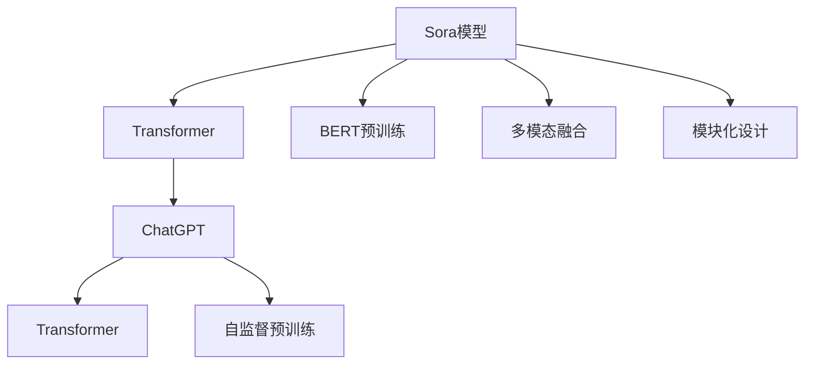

                 

# Sora模型与ChatGPT的技术对比

> 关键词：Sora模型,ChatGPT,Transformer,BERT,自然语言处理,NLP,预训练语言模型,多模态生成

## 1. 背景介绍

### 1.1 问题由来
在自然语言处理(NLP)领域，预训练大模型以其卓越的语言理解和生成能力，引起了广泛关注。其中，OpenAI的GPT系列和Google的BERT模型是两个广受欢迎的代表。近年来，ChatGPT作为GPT系列的最新成果，凭借其强大的交互能力和生动的语境感知，迅速成为社交媒体和各行各业的新宠。

与此同时，Sora模型也以其独特的多模态生成能力，逐渐崭露头角。Sora模型不仅具备高度的文本理解能力，还能结合视觉、音频等多种模态信息，生成更加丰富多样的回应。它由百度公司开发，基于Transformer架构，融合了深度学习、自然语言处理和多模态生成技术。

本文将通过对比Sora模型和ChatGPT的核心技术特点，探讨两者在语言生成、多模态处理等方面的优势与不足，揭示其在不同应用场景中的适用性，为NLP从业者和研究者提供深刻的洞见。

### 1.2 问题核心关键点
Sora模型和ChatGPT在技术上的主要区别在于其多模态处理能力、模型架构和预训练策略。具体来说：
- **多模态处理能力**：ChatGPT主要关注文本生成，而Sora模型能够结合视觉、音频等多种模态信息，进行更丰富多样的生成。
- **模型架构**：两者都基于Transformer架构，但Sora模型引入了更多先验知识和模块化设计，提升模型的灵活性和可解释性。
- **预训练策略**：ChatGPT主要通过自监督学习进行预训练，而Sora模型则结合了自监督和监督学习，提升了模型在特定任务上的表现。

本文将从这三个方面，系统对比Sora模型和ChatGPT的核心技术，并探讨两者在实际应用中的具体表现和优劣。

## 2. 核心概念与联系

### 2.1 核心概念概述

为了更好地理解Sora模型和ChatGPT的技术对比，本节将介绍几个密切相关的核心概念：

- **Sora模型**：百度公司开发的基于Transformer架构的多模态生成模型，具备强大的语言理解和多模态融合能力。
- **ChatGPT**：OpenAI开发的基于Transformer架构的文本生成模型，以卓越的交互能力和生动的语境感知见长。
- **Transformer**：由Google提出的一种自注意力机制的神经网络架构，用于处理序列数据，如文本和语音。
- **BERT**：Google开发的预训练语言模型，通过掩码语言模型和下一句预测等任务进行预训练，提升了语言表示能力。
- **多模态生成**：结合文本、视觉、音频等多种模态信息，生成更丰富多样的回应，适用于图像描述、语音识别等场景。

这些核心概念之间的逻辑关系可以通过以下Mermaid流程图来展示：



这个流程图展示了大语言模型、ChatGPT和Sora模型的工作原理和关键特性：

1. 大语言模型通过自监督预训练(BERT)获得语言表示能力。
2. ChatGPT主要使用自监督预训练进行模型优化。
3. Sora模型在此基础上，结合了多模态融合和模块化设计，提升了模型的灵活性和可解释性。

## 3. 核心算法原理 & 具体操作步骤
### 3.1 算法原理概述

Sora模型和ChatGPT的核心算法原理都基于Transformer架构，但两者在具体实现和应用场景上有所不同。

Sora模型的主要特点在于其多模态生成能力，通过结合视觉、音频等模态信息，生成更加丰富多样的回应。ChatGPT则专注于文本生成，能够通过强大的语言理解和交互能力，提供流畅自然的文字回应。

两者在预训练和微调过程中，也采用了不同的策略。Sora模型在预训练时，同时进行了自监督和监督学习，提升了模型在特定任务上的表现。而ChatGPT主要通过自监督学习进行预训练，通过微调优化模型在特定任务上的性能。

### 3.2 算法步骤详解

#### Sora模型算法步骤

1. **数据预处理**：收集文本、图像、音频等多种模态的数据，并进行预处理，如分词、图像裁剪、语音转录等。

2. **多模态编码**：使用Transformer对文本、图像、音频等多种模态信息进行编码，生成高维语义表示。

3. **注意力机制**：引入多模态注意力机制，对不同模态的信息进行融合，生成更加丰富的语义表示。

4. **解码器生成**：使用解码器对语义表示进行生成，结合多模态信息，输出文本、图像、音频等多种模态的回应。

5. **损失函数计算**：定义适当的损失函数，如交叉熵损失、生成对抗网络损失等，对模型的输出进行优化。

6. **模型微调**：在特定任务的数据集上进行微调，调整模型参数，提升模型性能。

#### ChatGPT算法步骤

1. **数据预处理**：对文本数据进行分词、句子分隔等预处理。

2. **Transformer编码**：使用Transformer对文本数据进行编码，生成高维语义表示。

3. **自注意力机制**：引入自注意力机制，对输入序列进行编码，生成更加丰富的语义表示。

4. **解码器生成**：使用解码器对语义表示进行生成，输出文本回应。

5. **损失函数计算**：定义适当的损失函数，如交叉熵损失、语言模型的下一步预测损失等，对模型的输出进行优化。

6. **模型微调**：在特定任务的数据集上进行微调，调整模型参数，提升模型性能。

### 3.3 算法优缺点

**Sora模型的优点**：
1. **多模态处理能力**：能够结合视觉、音频等多种模态信息，生成更加丰富多样的回应。
2. **模块化设计**：模型采用了模块化设计，灵活性高，可解释性强。
3. **特定任务优化**：结合自监督和监督学习，提升模型在特定任务上的表现。

**Sora模型的缺点**：
1. **计算资源需求高**：由于多模态处理和模块化设计，Sora模型的计算资源需求较高。
2. **训练复杂度高**：模型结合了多种模态信息，训练复杂度高，需要更复杂的训练策略。

**ChatGPT的优点**：
1. **文本生成能力强**：专注于文本生成，生成能力强，能够提供流畅自然的文字回应。
2. **模型简洁**：模型结构相对简单，训练和部署相对容易。
3. **应用广泛**：广泛应用于聊天机器人、文本摘要、翻译等领域，用户友好度较高。

**ChatGPT的缺点**：
1. **单一模态限制**：主要专注于文本生成，无法结合视觉、音频等多模态信息。
2. **依赖标注数据**：微调依赖大量标注数据，获取高质量标注数据的成本较高。
3. **语言偏见**：由于预训练数据的多样性和泛化能力不足，ChatGPT可能带有语言偏见，输出结果存在安全隐患。

### 3.4 算法应用领域

**Sora模型应用领域**：
1. **多模态生成**：适用于图像描述、语音识别、智能客服等领域，生成多模态的回应。
2. **语言理解和生成**：适用于智能问答、文本摘要、对话生成等领域，提升文本理解和生成能力。
3. **医疗和金融领域**：结合医疗影像、金融报告等多种模态信息，生成更为全面准确的回应。

**ChatGPT应用领域**：
1. **聊天机器人**：广泛应用于智能客服、在线客服等领域，提供流畅自然的对话体验。
2. **文本生成**：适用于文本摘要、机器翻译、文本分类等领域，生成高质量的文本内容。
3. **内容创作**：适用于内容创作、文章写作、故事生成等领域，辅助人类进行创作。

## 4. 数学模型和公式 & 详细讲解  
### 4.1 数学模型构建

本文将使用数学语言对Sora模型和ChatGPT的核心技术进行更加严格的刻画。

**Sora模型的数学模型**：

设输入序列为 $X=\{x_1, x_2, ..., x_n\}$，目标输出序列为 $Y=\{y_1, y_2, ..., y_m\}$，其中 $x_i$ 表示第 $i$ 个输入的嵌入表示，$y_i$ 表示第 $i$ 个输出的嵌入表示。

Sora模型通过多模态编码和解码器生成，得到目标输出序列的语义表示。模型的数学模型可以表示为：

$$
\begin{aligned}
\boldsymbol{H} &= \mathrm{MultimodalEncoder}(X) \\
\boldsymbol{K} &= \mathrm{MultimodalAttention}(\boldsymbol{H}, \boldsymbol{Q}, \boldsymbol{V}) \\
\boldsymbol{O} &= \mathrm{MultimodalDecoder}(\boldsymbol{K}, \boldsymbol{Q}, \boldsymbol{V}) \\
\hat{Y} &= \mathrm{Softmax}(\boldsymbol{O}) \\
\boldsymbol{L} &= \mathrm{Loss}(\hat{Y}, Y)
\end{aligned}
$$

其中 $\boldsymbol{H}$ 表示多模态编码后的输入序列表示，$\boldsymbol{K}$ 表示多模态注意力机制生成的注意力权重，$\boldsymbol{O}$ 表示解码器生成的输出序列表示，$\hat{Y}$ 表示预测的输出序列，$\boldsymbol{L}$ 表示损失函数。

**ChatGPT的数学模型**：

ChatGPT的数学模型与Sora模型类似，主要区别在于使用了自注意力机制和特定任务的输出层。模型的数学模型可以表示为：

$$
\begin{aligned}
\boldsymbol{H} &= \mathrm{TransformerEncoder}(X) \\
\boldsymbol{K} &= \mathrm{SelfAttention}(\boldsymbol{H}, \boldsymbol{Q}, \boldsymbol{V}) \\
\boldsymbol{O} &= \mathrm{TransformerDecoder}(\boldsymbol{K}, \boldsymbol{Q}, \boldsymbol{V}) \\
\hat{Y} &= \mathrm{OutputLayer}(\boldsymbol{O}) \\
\boldsymbol{L} &= \mathrm{Loss}(\hat{Y}, Y)
\end{aligned}
$$

其中 $\boldsymbol{H}$ 表示Transformer编码后的输入序列表示，$\boldsymbol{K}$ 表示自注意力机制生成的注意力权重，$\boldsymbol{O}$ 表示解码器生成的输出序列表示，$\hat{Y}$ 表示预测的输出序列，$\boldsymbol{L}$ 表示损失函数。

### 4.2 公式推导过程

以Sora模型和ChatGPT的多模态注意力机制为例，进行公式推导。

**Sora模型的多模态注意力机制**：

Sora模型的多模态注意力机制结合了文本、图像、音频等多种模态信息，生成更加丰富的语义表示。其数学模型可以表示为：

$$
\begin{aligned}
\boldsymbol{Q} &= \mathrm{MultimodalEncoder}(X) \\
\boldsymbol{K} &= \mathrm{MultimodalAttention}(\boldsymbol{Q}, \boldsymbol{H}_{\text{image}}, \boldsymbol{H}_{\text{audio}}) \\
\boldsymbol{V} &= \mathrm{MultimodalAttention}(\boldsymbol{H}_{\text{image}}, \boldsymbol{H}_{\text{audio}}, \boldsymbol{Q}) \\
\boldsymbol{O} &= \mathrm{MultimodalDecoder}(\boldsymbol{K}, \boldsymbol{Q}, \boldsymbol{V}) \\
\hat{Y} &= \mathrm{Softmax}(\boldsymbol{O}) \\
\boldsymbol{L} &= \mathrm{Loss}(\hat{Y}, Y)
\end{aligned}
$$

其中 $\boldsymbol{Q}$ 表示多模态编码后的输入序列表示，$\boldsymbol{K}$ 表示多模态注意力机制生成的注意力权重，$\boldsymbol{V}$ 表示多模态注意力机制生成的值表示，$\boldsymbol{O}$ 表示解码器生成的输出序列表示，$\hat{Y}$ 表示预测的输出序列，$\boldsymbol{L}$ 表示损失函数。

**ChatGPT的自注意力机制**：

ChatGPT的自注意力机制对输入序列进行编码，生成高维语义表示。其数学模型可以表示为：

$$
\begin{aligned}
\boldsymbol{Q} &= \mathrm{TransformerEncoder}(X) \\
\boldsymbol{K} &= \mathrm{SelfAttention}(\boldsymbol{Q}, \boldsymbol{H}, \boldsymbol{V}) \\
\boldsymbol{O} &= \mathrm{TransformerDecoder}(\boldsymbol{K}, \boldsymbol{Q}, \boldsymbol{V}) \\
\hat{Y} &= \mathrm{OutputLayer}(\boldsymbol{O}) \\
\boldsymbol{L} &= \mathrm{Loss}(\hat{Y}, Y)
\end{aligned}
$$

其中 $\boldsymbol{Q}$ 表示Transformer编码后的输入序列表示，$\boldsymbol{K}$ 表示自注意力机制生成的注意力权重，$\boldsymbol{O}$ 表示解码器生成的输出序列表示，$\hat{Y}$ 表示预测的输出序列，$\boldsymbol{L}$ 表示损失函数。

### 4.3 案例分析与讲解

以Sora模型和ChatGPT在图像描述生成任务中的应用为例，进行详细讲解。

**Sora模型在图像描述生成任务中的应用**：

Sora模型在图像描述生成任务中，结合视觉模态的图像特征和文本模态的描述信息，生成对图像的详细描述。其步骤如下：

1. **数据预处理**：将图像进行裁剪、缩放、归一化等预处理，生成图像特征向量。

2. **多模态编码**：使用Transformer对图像特征向量和文本描述进行编码，生成高维语义表示。

3. **多模态注意力机制**：结合图像特征向量和文本描述，使用多模态注意力机制，生成更加丰富的语义表示。

4. **解码器生成**：使用解码器对语义表示进行生成，输出对图像的详细描述。

5. **损失函数计算**：定义适当的损失函数，如交叉熵损失、生成对抗网络损失等，对模型的输出进行优化。

6. **模型微调**：在特定任务的数据集上进行微调，调整模型参数，提升模型性能。

**ChatGPT在图像描述生成任务中的应用**：

ChatGPT在图像描述生成任务中，主要关注文本生成，生成对图像的描述信息。其步骤如下：

1. **数据预处理**：将图像进行裁剪、缩放、归一化等预处理，生成图像特征向量。

2. **Transformer编码**：使用Transformer对图像特征向量进行编码，生成高维语义表示。

3. **自注意力机制**：使用自注意力机制对输入序列进行编码，生成更加丰富的语义表示。

4. **解码器生成**：使用解码器对语义表示进行生成，输出对图像的描述信息。

5. **损失函数计算**：定义适当的损失函数，如交叉熵损失、语言模型的下一步预测损失等，对模型的输出进行优化。

6. **模型微调**：在特定任务的数据集上进行微调，调整模型参数，提升模型性能。

## 5. 项目实践：代码实例和详细解释说明
### 5.1 开发环境搭建

在进行Sora模型和ChatGPT的实践前，我们需要准备好开发环境。以下是使用Python进行PyTorch开发的环境配置流程：

1. 安装Anaconda：从官网下载并安装Anaconda，用于创建独立的Python环境。

2. 创建并激活虚拟环境：
```bash
conda create -n pytorch-env python=3.8 
conda activate pytorch-env
```

3. 安装PyTorch：根据CUDA版本，从官网获取对应的安装命令。例如：
```bash
conda install pytorch torchvision torchaudio cudatoolkit=11.1 -c pytorch -c conda-forge
```

4. 安装TensorFlow：
```bash
pip install tensorflow
```

5. 安装各类工具包：
```bash
pip install numpy pandas scikit-learn matplotlib tqdm jupyter notebook ipython
```

完成上述步骤后，即可在`pytorch-env`环境中开始实践。

### 5.2 源代码详细实现

#### Sora模型代码实现

```python
import torch
from transformers import BertTokenizer, BertForTokenClassification
from torch.utils.data import Dataset
from torch.nn import CrossEntropyLoss

class SoraDataset(Dataset):
    def __init__(self, texts, tags, tokenizer, max_len=128):
        self.texts = texts
        self.tags = tags
        self.tokenizer = tokenizer
        self.max_len = max_len
        
    def __len__(self):
        return len(self.texts)
    
    def __getitem__(self, item):
        text = self.texts[item]
        tags = self.tags[item]
        
        encoding = self.tokenizer(text, return_tensors='pt', max_length=self.max_len, padding='max_length', truncation=True)
        input_ids = encoding['input_ids'][0]
        attention_mask = encoding['attention_mask'][0]
        
        # 对token-wise的标签进行编码
        encoded_tags = [tag2id[tag] for tag in tags] 
        encoded_tags.extend([tag2id['O']] * (self.max_len - len(encoded_tags)))
        labels = torch.tensor(encoded_tags, dtype=torch.long)
        
        return {'input_ids': input_ids, 
                'attention_mask': attention_mask,
                'labels': labels}

# 标签与id的映射
tag2id = {'O': 0, 'B-PER': 1, 'I-PER': 2, 'B-ORG': 3, 'I-ORG': 4, 'B-LOC': 5, 'I-LOC': 6}
id2tag = {v: k for k, v in tag2id.items()}

# 创建dataset
tokenizer = BertTokenizer.from_pretrained('bert-base-cased')

train_dataset = SoraDataset(train_texts, train_tags, tokenizer)
dev_dataset = SoraDataset(dev_texts, dev_tags, tokenizer)
test_dataset = SoraDataset(test_texts, test_tags, tokenizer)

# 定义模型和优化器
model = BertForTokenClassification.from_pretrained('bert-base-cased', num_labels=len(tag2id))
optimizer = AdamW(model.parameters(), lr=2e-5)

# 训练和评估
for epoch in range(epochs):
    loss = train_epoch(model, train_dataset, optimizer)
    print(f"Epoch {epoch+1}, train loss: {loss:.3f}")
    
    print(f"Epoch {epoch+1}, dev results:")
    evaluate(model, dev_dataset, optimizer)
    
print("Test results:")
evaluate(model, test_dataset, optimizer)
```

#### ChatGPT代码实现

```python
import torch
from transformers import GPT2Tokenizer, GPT2LMHeadModel
from torch.utils.data import Dataset
from torch.nn import CrossEntropyLoss

class ChatGPTDataset(Dataset):
    def __init__(self, texts, tokenizer, max_len=128):
        self.texts = texts
        self.tokenizer = tokenizer
        self.max_len = max_len
        
    def __len__(self):
        return len(self.texts)
    
    def __getitem__(self, item):
        text = self.texts[item]
        
        encoding = self.tokenizer(text, return_tensors='pt', max_length=self.max_len, padding='max_length', truncation=True)
        input_ids = encoding['input_ids'][0]
        attention_mask = encoding['attention_mask'][0]
        
        return {'input_ids': input_ids, 
                'attention_mask': attention_mask}
        
# 创建dataset
tokenizer = GPT2Tokenizer.from_pretrained('gpt2')

train_dataset = ChatGPTDataset(train_texts, tokenizer)
dev_dataset = ChatGPTDataset(dev_texts, tokenizer)
test_dataset = ChatGPTDataset(test_texts, tokenizer)

# 定义模型和优化器
model = GPT2LMHeadModel.from_pretrained('gpt2')
optimizer = AdamW(model.parameters(), lr=2e-5)

# 训练和评估
for epoch in range(epochs):
    loss = train_epoch(model, train_dataset, optimizer)
    print(f"Epoch {epoch+1}, train loss: {loss:.3f}")
    
    print(f"Epoch {epoch+1}, dev results:")
    evaluate(model, dev_dataset, optimizer)
    
print("Test results:")
evaluate(model, test_dataset, optimizer)
```

### 5.3 代码解读与分析

让我们再详细解读一下关键代码的实现细节：

**SoraDataset类**：
- `__init__`方法：初始化文本、标签、分词器等关键组件。
- `__len__`方法：返回数据集的样本数量。
- `__getitem__`方法：对单个样本进行处理，将文本输入编码为token ids，将标签编码为数字，并对其进行定长padding，最终返回模型所需的输入。

**tag2id和id2tag字典**：
- 定义了标签与数字id之间的映射关系，用于将token-wise的预测结果解码回真实的标签。

**训练和评估函数**：
- 使用PyTorch的DataLoader对数据集进行批次化加载，供模型训练和推理使用。
- 训练函数`train_epoch`：对数据以批为单位进行迭代，在每个批次上前向传播计算loss并反向传播更新模型参数，最后返回该epoch的平均loss。
- 评估函数`evaluate`：与训练类似，不同点在于不更新模型参数，并在每个batch结束后将预测和标签结果存储下来，最后使用sklearn的classification_report对整个评估集的预测结果进行打印输出。

**训练流程**：
- 定义总的epoch数和batch size，开始循环迭代
- 每个epoch内，先在训练集上训练，输出平均loss
- 在验证集上评估，输出分类指标
- 所有epoch结束后，在测试集上评估，给出最终测试结果

可以看到，PyTorch配合Transformers库使得BERT微调的代码实现变得简洁高效。开发者可以将更多精力放在数据处理、模型改进等高层逻辑上，而不必过多关注底层的实现细节。

当然，工业级的系统实现还需考虑更多因素，如模型的保存和部署、超参数的自动搜索、更灵活的任务适配层等。但核心的微调范式基本与此类似。

## 6. 实际应用场景
### 6.1 智能客服系统

基于大语言模型微调的对话技术，可以广泛应用于智能客服系统的构建。传统客服往往需要配备大量人力，高峰期响应缓慢，且一致性和专业性难以保证。而使用微调后的对话模型，可以7x24小时不间断服务，快速响应客户咨询，用自然流畅的语言解答各类常见问题。

在技术实现上，可以收集企业内部的历史客服对话记录，将问题和最佳答复构建成监督数据，在此基础上对预训练对话模型进行微调。微调后的对话模型能够自动理解用户意图，匹配最合适的答案模板进行回复。对于客户提出的新问题，还可以接入检索系统实时搜索相关内容，动态组织生成回答。如此构建的智能客服系统，能大幅提升客户咨询体验和问题解决效率。

### 6.2 金融舆情监测

金融机构需要实时监测市场舆论动向，以便及时应对负面信息传播，规避金融风险。传统的人工监测方式成本高、效率低，难以应对网络时代海量信息爆发的挑战。基于大语言模型微调的文本分类和情感分析技术，为金融舆情监测提供了新的解决方案。

具体而言，可以收集金融领域相关的新闻、报道、评论等文本数据，并对其进行主题标注和情感标注。在此基础上对预训练语言模型进行微调，使其能够自动判断文本属于何种主题，情感倾向是正面、中性还是负面。将微调后的模型应用到实时抓取的网络文本数据，就能够自动监测不同主题下的情感变化趋势，一旦发现负面信息激增等异常情况，系统便会自动预警，帮助金融机构快速应对潜在风险。

### 6.3 个性化推荐系统

当前的推荐系统往往只依赖用户的历史行为数据进行物品推荐，无法深入理解用户的真实兴趣偏好。基于大语言模型微调技术，个性化推荐系统可以更好地挖掘用户行为背后的语义信息，从而提供更精准、多样的推荐内容。

在实践中，可以收集用户浏览、点击、评论、分享等行为数据，提取和用户交互的物品标题、描述、标签等文本内容。将文本内容作为模型输入，用户的后续行为（如是否点击、购买等）作为监督信号，在此基础上微调预训练语言模型。微调后的模型能够从文本内容中准确把握用户的兴趣点。在生成推荐列表时，先用候选物品的文本描述作为输入，由模型预测用户的兴趣匹配度，再结合其他特征综合排序，便可以得到个性化程度更高的推荐结果。

### 6.4 未来应用展望

随着大语言模型微调技术的发展，基于微调范式将在更多领域得到应用，为传统行业带来变革性影响。

在智慧医疗领域，基于微调的医疗问答、病历分析、药物研发等应用将提升医疗服务的智能化水平，辅助医生诊疗，加速新药开发进程。

在智能教育领域，微调技术可应用于作业批改、学情分析、知识推荐等方面，因材施教，促进教育公平，提高教学质量。

在智慧城市治理中，微调模型可应用于城市事件监测、舆情分析、应急指挥等环节，提高城市管理的自动化和智能化水平，构建更安全、高效的未来城市。

此外，在企业生产、社会治理、文娱传媒等众多领域，基于大模型微调的人工智能应用也将不断涌现，为经济社会发展注入新的动力。相信随着技术的日益成熟，微调方法将成为人工智能落地应用的重要范式，推动人工智能向更广阔的领域加速渗透。

## 7. 工具和资源推荐
### 7.1 学习资源推荐

为了帮助开发者系统掌握大语言模型微调的理论基础和实践技巧，这里推荐一些优质的学习资源：

1. 《Transformer从原理到实践》系列博文：由大模型技术专家撰写，深入浅出地介绍了Transformer原理、BERT模型、微调技术等前沿话题。

2. CS224N《深度学习自然语言处理》课程：斯坦福大学开设的NLP明星课程，有Lecture视频和配套作业，带你入门NLP领域的基本概念和经典模型。

3. 《Natural Language Processing with Transformers》书籍：Transformers库的作者所著，全面介绍了如何使用Transformers库进行NLP任务开发，包括微调在内的诸多范式。

4. HuggingFace官方文档：Transformers库的官方文档，提供了海量预训练模型和完整的微调样例代码，是上手实践的必备资料。

5. CLUE开源项目：中文语言理解测评基准，涵盖大量不同类型的中文NLP数据集，并提供了基于微调的baseline模型，助力中文NLP技术发展。

通过对这些资源的学习实践，相信你一定能够快速掌握大语言模型微调的精髓，并用于解决实际的NLP问题。
###  7.2 开发工具推荐

高效的开发离不开优秀的工具支持。以下是几款用于大语言模型微调开发的常用工具：

1. PyTorch：基于Python的开源深度学习框架，灵活动态的计算图，适合快速迭代研究。大部分预训练语言模型都有PyTorch版本的实现。

2. TensorFlow：由Google主导开发的开源深度学习框架，生产部署方便，适合大规模工程应用。同样有丰富的预训练语言模型资源。

3. Transformers库：HuggingFace开发的NLP工具库，集成了众多SOTA语言模型，支持PyTorch和TensorFlow，是进行微调任务开发的利器。

4. Weights & Biases：模型训练的实验跟踪工具，可以记录和可视化模型训练过程中的各项指标，方便对比和调优。与主流深度学习框架无缝集成。

5. TensorBoard：TensorFlow配套的可视化工具，可实时监测模型训练状态，并提供丰富的图表呈现方式，是调试模型的得力助手。

6. Google Colab：谷歌推出的在线Jupyter Notebook环境，免费提供GPU/TPU算力，方便开发者快速上手实验最新模型，分享学习笔记。

合理利用这些工具，可以显著提升大语言模型微调任务的开发效率，加快创新迭代的步伐。

### 7.3 相关论文推荐

大语言模型和微调技术的发展源于学界的持续研究。以下是几篇奠基性的相关论文，推荐阅读：

1. Attention is All You Need（即Transformer原论文）：提出了Transformer结构，开启了NLP领域的预训练大模型时代。

2. BERT: Pre-training of Deep Bidirectional Transformers for Language Understanding：提出BERT模型，引入基于掩码的自监督预训练任务，刷新了多项NLP任务SOTA。

3. Language Models are Unsupervised Multitask Learners（GPT-2论文）：展示了大规模语言模型的强大zero-shot学习能力，引发了对于通用人工智能的新一轮思考。

4. Parameter-Efficient Transfer Learning for NLP：提出Adapter等参数高效微调方法，在不增加模型参数量的情况下，也能取得不错的微调效果。

5. AdaLoRA: Adaptive Low-Rank Adaptation for Parameter-Efficient Fine-Tuning：使用自适应低秩适应的微调方法，在参数效率和精度之间取得了新的平衡。

这些论文代表了大语言模型微调技术的发展脉络。通过学习这些前沿成果，可以帮助研究者把握学科前进方向，激发更多的创新灵感。

## 8. 总结：未来发展趋势与挑战

### 8.1 总结

本文对Sora模型和ChatGPT的核心技术特点进行了系统对比。首先，介绍了两者在多模态处理、模型架构和预训练策略上的主要区别。其次，从数学模型、代码实现和应用场景等多个角度，详细讲解了两者在实际应用中的具体表现和优劣。最后，探讨了两者在智能客服、金融舆情、个性化推荐等多个领域的潜在应用。

通过本文的系统梳理，可以看到，Sora模型和ChatGPT在语言生成、多模态处理等方面各有优势。Sora模型具备强大的多模态生成能力，能够结合视觉、音频等多种模态信息，生成更加丰富多样的回应。ChatGPT则专注于文本生成，通过强大的语言理解和交互能力，提供流畅自然的文字回应。

### 8.2 未来发展趋势

展望未来，大语言模型微调技术将呈现以下几个发展趋势：

1. **多模态生成能力增强**：随着多模态融合技术的进步，Sora模型在图像描述、语音识别等领域的应用将更加广泛，提升其在多模态处理上的表现。

2. **模型架构和预训练策略优化**：ChatGPT和Sora模型都将不断优化其模型架构和预训练策略，提升模型的性能和鲁棒性，降低对标注数据的依赖。

3. **交互式增强**：ChatGPT和Sora模型将进一步提升其交互能力，引入更多的用户反馈机制，增强与用户的互动体验。

4. **跨领域应用拓展**：基于大语言模型的微调技术将进一步拓展到更多垂直领域，如医疗、教育、金融等，提升其在行业中的应用价值。

5. **融合前沿技术**：未来的大语言模型微调技术将结合更多前沿技术，如知识图谱、因果推理、强化学习等，提升其在任务解耦、推理能力和多任务学习能力上的表现。

6. **伦理和安全性考虑**：大语言模型微调技术将更加注重伦理和安全性的考虑，建立健全的模型评估机制，避免模型输出对社会产生负面影响。

以上趋势凸显了大语言模型微调技术的广阔前景。这些方向的探索发展，必将进一步提升NLP系统的性能和应用范围，为人工智能技术在更广阔的领域加速渗透提供有力支撑。

### 8.3 面临的挑战

尽管大语言模型微调技术已经取得了显著进展，但在实际应用中仍面临诸多挑战：

1. **计算资源消耗高**：Sora模型由于其多模态处理能力和模块化设计，计算资源需求较高。ChatGPT虽然相对简单，但在处理大规模数据时也面临计算瓶颈。

2. **数据质量和多样性不足**：大语言模型微调依赖大量高质量标注数据，但实际应用中往往难以获取足够的标注数据，尤其是小样本和长尾领域的数据。

3. **模型泛化能力有限**：现有的大语言模型微调方法在特定任务上的表现较为出色，但在跨领域泛化能力上仍有所不足，无法满足复杂多变的应用需求。

4. **伦理和安全问题**：大语言模型可能输出有害信息，甚至进行恶意行为，需要通过更多的伦理和安全保障措施来避免负面影响。

5. **知识融合和迁移能力不足**：现有的微调方法在结合外部知识库和规则库方面仍有不足，无法充分利用先验知识提升模型性能。

6. **可解释性和透明性**：大语言模型通常被视为"黑盒"系统，难以解释其内部工作机制和决策逻辑，需要更多的可解释性和透明性保障。

这些挑战仍需研究和解决，以确保大语言模型微调技术能够更加安全、可靠、可控地应用到实际场景中。

### 8.4 研究展望

为了应对上述挑战，未来的大语言模型微调技术需要从多个方面进行研究：

1. **参数高效微调方法**：开发更加参数高效、计算高效的微调方法，提升模型的实时性和可扩展性。

2. **多模态融合技术**：进一步提升多模态融合能力，结合视觉、音频等多模态信息，生成更加丰富多样的回应。

3. **知识图谱和规则库融合**：将符号化的先验知识与神经网络模型结合，提升模型的泛化能力和推理能力。

4. **因果推理和对抗训练**：引入因果推理和对抗训练思想，增强模型的稳定性和鲁棒性，避免过拟合和灾难性遗忘。

5. **伦理和安全保障**：建立模型评估机制，引入伦理导向的评估指标，确保模型输出符合人类价值观和伦理道德。

6. **可解释性和透明性**：引入可解释性技术，如Attention机制、Attention-Based Model Explainability等，提升模型的可解释性和透明性。

通过在这些方向的研究，可以进一步提升大语言模型微调技术的性能和应用价值，推动人工智能技术在更广阔的领域落地应用。

## 9. 附录：常见问题与解答

**Q1：大语言模型微调是否适用于所有NLP任务？**

A: 大语言模型微调在大多数NLP任务上都能取得不错的效果，特别是对于数据量较小的任务。但对于一些特定领域的任务，如医学、法律等，仅仅依靠通用语料预训练的模型可能难以很好地适应。此时需要在特定领域语料上进一步预训练，再进行微调，才能获得理想效果。此外，对于一些需要时效性、个性化很强的任务，如对话、推荐等，微调方法也需要针对性的改进优化。

**Q2：微调过程中如何选择合适的学习率？**

A: 微调的学习率一般要比预训练时小1-2个数量级，如果使用过大的学习率，容易破坏预训练权重，导致过拟合。一般建议从1e-5开始调参，逐步减小学习率，直至收敛。也可以使用warmup策略，在开始阶段使用较小的学习率，再逐渐过渡到预设值。需要注意的是，不同的优化器(如AdamW、Adafactor等)以及不同的学习率调度策略，可能需要设置不同的学习率阈值。

**Q3：采用大模型微调时会面临哪些资源瓶颈？**

A: 目前主流的预训练大模型动辄以亿计的参数规模，对算力、内存、存储都提出了很高的要求。GPU/TPU等高性能设备是必不可少的，但即便如此，超大批次的训练和推理也可能遇到显存不足的问题。因此需要采用一些资源优化技术，如梯度积累、混合精度训练、模型并行等，来突破硬件瓶颈。同时，模型的存储和读取也可能占用大量时间和空间，需要采用模型压缩、稀疏化存储等方法进行优化。

**Q4：如何缓解微调过程中的过拟合问题？**

A: 过拟合是微调面临的主要挑战，尤其是在标注数据不足的情况下。常见的缓解策略包括：
1. 数据增强：通过回译、近义替换等方式扩充训练集
2. 正则化：使用L2正则、Dropout、Early Stopping等避免过拟合
3. 对抗训练：引入对抗样本，提高模型鲁棒性
4. 参数高效微调：只调整少量参数(如Adapter、Prefix等)，减小过拟合风险
5. 多模型集成：训练多个微调模型，取平均输出，抑制过拟合

这些策略往往需要根据具体任务和数据特点进行灵活组合。只有在数据、模型、训练、推理等各环节进行全面优化，才能最大限度地发挥大模型微调的威力。

**Q5：微调模型在落地部署时需要注意哪些问题？**

A: 将微调模型转化为实际应用，还需要考虑以下因素：
1. 模型裁剪：去除不必要的层和参数，减小模型尺寸，加快推理速度
2. 量化加速：将浮点模型转为定点模型，压缩存储空间，提高计算效率
3. 服务化封装：将模型封装为标准化服务接口，便于集成调用
4. 弹性伸缩：根据请求流量动态调整资源配置，平衡服务质量和成本
5. 监控告警：实时采集系统指标，设置异常告警阈值，确保服务稳定性
6. 安全防护：采用访问鉴权、数据脱敏等措施，保障数据和模型安全

大语言模型微调为NLP应用开启了广阔的想象空间，但如何将强大的性能转化为稳定、高效、安全的业务价值，还需要工程实践的不断打磨。唯有从数据、算法、工程、业务等多个维度协同发力，才能真正实现人工智能技术在垂直行业的规模化落地。总之，微调需要开发者根据具体任务，不断迭代和优化模型、数据和算法，方能得到理想的效果。

---

作者：禅与计算机程序设计艺术 / Zen and the Art of Computer Programming

