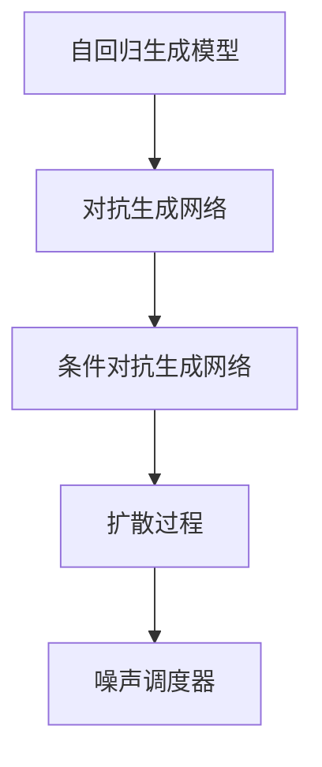

                 

# Stable Diffusion原理与代码实例讲解

## 1. 背景介绍

### 1.1 问题由来
Stable Diffusion是一种基于自回归生成模型和条件对抗生成网络(Conditional GAN)的文本到图像生成技术，由OpenAI开发。该技术通过对自回归生成模型进行改进，增强了模型对图像分布的建模能力，同时在自回归生成过程的基础上，引入条件对抗生成网络，通过对抗性损失函数来提升模型的生成质量。Stable Diffusion在DALL-E的基础上进一步优化了模型的稳定性和生成质量，能够生成清晰、逼真的图像，具备广泛的应用前景。

在实际应用中，Stable Diffusion已经被广泛应用于艺术创作、游戏设计、虚拟现实、动画制作等多个领域，如生成艺术作品、动画场景、虚拟角色等。

## 2. 核心概念与联系

### 2.1 核心概念概述

为更好地理解Stable Diffusion技术，本节将介绍几个密切相关的核心概念：

- 自回归生成模型(Autoregressive Generative Model)：一种通过观察当前和历史数据点来预测下一个数据点的生成模型，适用于文本和图像等序列数据的生成。

- 对抗生成网络(Generative Adversarial Network, GAN)：由生成器和判别器两部分组成，通过对抗性训练来提升生成器的生成效果。

- 自回归生成模型与GAN结合：通过将GAN与自回归模型结合，自回归模型可以生成样本，GAN可以对这些样本进行判别和优化，从而提升生成质量。

- 条件对抗生成网络(Conditional GAN)：在GAN的基础上，加入条件变量，使得生成器能够根据条件变量的信息，生成更加符合要求的输出。

- 扩散过程(Diffusion Process)：一种基于布朗运动的生成过程，用于从高斯噪声分布逐步向目标分布扩散，增强模型对复杂数据分布的建模能力。

- 噪声调度器(Noise Scheduler)：控制噪声水平的变化，逐步从噪声分布向目标分布过渡，帮助模型更好地学习数据分布。

这些核心概念之间的逻辑关系可以通过以下Mermaid流程图来展示：



这个流程图展示了大语言模型的核心概念及其之间的关系：

1. 自回归生成模型通过观察当前和历史数据点来预测下一个数据点，适用于文本和图像等序列数据的生成。
2. 对抗生成网络通过对抗性训练提升生成器的生成效果，生成高质量的样本。
3. 将GAN与自回归模型结合，生成器可以生成样本，判别器对样本进行判别，帮助生成器进一步优化。
4. 条件对抗生成网络加入条件变量，生成符合条件的样本。
5. 扩散过程通过布朗运动逐步从噪声分布向目标分布过渡，增强模型对复杂数据分布的建模能力。
6. 噪声调度器控制噪声水平的变化，逐步从噪声分布向目标分布过渡，帮助模型更好地学习数据分布。

这些概念共同构成了Stable Diffusion技术的核心，使得模型能够生成高质量、符合条件的图像。

## 3. 核心算法原理 & 具体操作步骤

### 3.1 算法原理概述

Stable Diffusion的生成过程可以分为两个主要部分：自回归生成和扩散过程。

自回归生成模型通过对当前和历史数据点进行建模，预测下一个数据点。在文本到图像生成任务中，自回归生成模型将文本描述作为条件变量，生成图像。

扩散过程通过控制噪声水平的变化，逐步从噪声分布向目标分布过渡。Stable Diffusion使用扩散模型来控制噪声水平的变化，使得模型能够更好地学习数据分布。

### 3.2 算法步骤详解

Stable Diffusion的生成过程包括以下几个关键步骤：

**Step 1: 数据预处理**
- 将输入的文本描述转换为向量形式，作为生成器的条件变量。
- 将向量输入扩散模型，初始化为噪声分布，并逐步从噪声分布向目标分布过渡。

**Step 2: 自回归生成**
- 生成器通过观察当前和历史数据点，预测下一个数据点。
- 将生成的数据点与真实数据进行比较，通过对抗性损失函数进行优化。

**Step 3: 扩散过程**
- 噪声调度器控制噪声水平的变化，逐步从噪声分布向目标分布过渡。
- 扩散模型通过布朗运动逐步从噪声分布向目标分布过渡，增强模型对复杂数据分布的建模能力。

**Step 4: 结果后处理**
- 对生成的图像进行后处理，如去模糊、去噪、增强对比度等，提升图像质量。
- 将处理后的图像作为最终输出，完成文本到图像的生成过程。

### 3.3 算法优缺点

Stable Diffusion技术具有以下优点：
1. 生成质量高：结合自回归生成和扩散过程，模型能够生成高质量、逼真的图像。
2. 适应性强：可以通过加入条件变量，生成符合条件的图像，适应不同的应用场景。
3. 可解释性好：通过扩散过程和对抗生成网络，模型的生成过程具有一定的可解释性。

同时，该技术也存在一些局限性：
1. 计算资源消耗大：模型训练和生成需要较大的计算资源，尤其是扩散过程和噪声调度器。
2. 模型复杂度高：结合自回归生成和扩散过程，模型结构较为复杂，难以实现实时生成。
3. 对抗训练难度高：对抗性损失函数的设计和优化难度较大，需要大量试验和调试。

尽管存在这些局限性，Stable Diffusion在生成图像的质量和多样性方面表现出色，已经成为文本到图像生成领域的重要技术。

### 3.4 算法应用领域

Stable Diffusion技术已经在多个领域得到广泛应用，包括但不限于：

- 艺术创作：通过输入艺术风格和内容描述，生成具有独特风格的艺术作品。
- 游戏设计：为游戏设计虚拟场景、角色和道具，提升游戏的视觉效果和趣味性。
- 虚拟现实：生成虚拟现实场景和角色，提供沉浸式的视觉体验。
- 动画制作：生成动画场景和角色，缩短动画制作周期。
- 广告设计：生成广告图像和视频，提高广告效果。
- 数据可视化：将数据转换为图像，帮助用户更直观地理解数据。

## 4. 数学模型和公式 & 详细讲解

### 4.1 数学模型构建

Stable Diffusion的生成过程涉及自回归生成和扩散过程，可以分别用数学模型进行描述。

**自回归生成模型**
假设自回归生成模型的输入为 $x_t$，输出为 $y_t$，输入与输出之间的关系可以表示为：
$$
y_t = f(x_t, y_{t-1}, y_{t-2}, ..., y_1)
$$
其中 $f$ 为生成函数，$x_t$ 为当前输入，$y_{t-1}, y_{t-2}, ..., y_1$ 为历史输出。

**扩散过程**
扩散过程可以使用布朗运动进行建模，假设初始噪声分布为 $p_0(x)$，目标分布为 $p_T(x)$，通过扩散过程逐步从噪声分布向目标分布过渡。假设在 $t$ 时刻的噪声分布为 $p_t(x)$，扩散过程可以表示为：
$$
\frac{dp_t(x)}{dt} = \mathcal{D}p_t(x) + \sigma_t(x)
$$
其中 $\mathcal{D}$ 为扩散算子，$\sigma_t(x)$ 为噪声项，$x$ 为噪声变量。

### 4.2 公式推导过程

以下我们以布朗运动为基础，推导扩散过程的具体形式。

假设初始噪声分布为 $p_0(x)$，目标分布为 $p_T(x)$，通过布朗运动逐步从噪声分布向目标分布过渡。假设在 $t$ 时刻的噪声分布为 $p_t(x)$，扩散过程可以表示为：
$$
\frac{dp_t(x)}{dt} = \mathcal{D}p_t(x) + \sigma_t(x)
$$
其中 $\mathcal{D}$ 为扩散算子，$\sigma_t(x)$ 为噪声项，$x$ 为噪声变量。

假设 $\mathcal{D}$ 为标准一维布朗运动的扩散算子，即：
$$
\mathcal{D}p_t(x) = \frac{1}{2}p''_t(x)
$$
则扩散过程可以表示为：
$$
\frac{dp_t(x)}{dt} = \frac{1}{2}p''_t(x) + \sigma_t(x)
$$

对于给定的初始噪声分布 $p_0(x)$ 和目标分布 $p_T(x)$，需要求解上述偏微分方程，使得 $p_t(x)$ 在 $t=0$ 时等于 $p_0(x)$，在 $t=T$ 时等于 $p_T(x)$。

根据解的对称性，可以假设 $p_t(x)$ 为对称函数，即 $p_t(x) = p_t(-x)$。因此，可以将原问题简化为求解半空间内的扩散方程：
$$
\frac{\partial p_t(x)}{\partial t} = \frac{1}{2}\frac{\partial^2 p_t(x)}{\partial x^2} + \sigma_t(x)
$$

假设初始噪声分布 $p_0(x)$ 和目标分布 $p_T(x)$ 都为标准正态分布，即 $p_0(x) = \mathcal{N}(0, 1)$，$p_T(x) = \mathcal{N}(0, 1)$。则可以将原问题转化为求解以下方程：
$$
\frac{\partial p_t(x)}{\partial t} = \frac{1}{2}\frac{\partial^2 p_t(x)}{\partial x^2} + \sigma_t(x)
$$
其中 $\sigma_t(x) = \frac{1}{2}\frac{\partial \log p_t(x)}{\partial x}$。

通过求解上述偏微分方程，可以逐步从噪声分布向目标分布过渡，最终得到 $p_t(x)$，使得 $p_t(x)$ 在 $t=T$ 时等于目标分布 $p_T(x)$。

### 4.3 案例分析与讲解

以图像生成为例，假设输入的文本描述为 "一个微笑的年轻女孩，站在一个湖边，太阳升起在背景中"，模型的目标输出为一个符合描述的图像。

首先，将文本描述转换为向量形式，作为生成器的条件变量。然后，使用扩散模型控制噪声水平的变化，逐步从噪声分布向目标分布过渡。在生成过程中，通过自回归生成模型预测下一个像素，同时使用对抗性损失函数对生成的图像进行优化。

最终生成的图像可以包含多个细节，如女孩的微笑、湖水的反射、太阳的轮廓等。生成的图像质量逼真，符合输入的描述。

## 5. 项目实践：代码实例和详细解释说明

### 5.1 开发环境搭建

在进行Stable Diffusion代码实践前，我们需要准备好开发环境。以下是使用Python进行PyTorch开发的环境配置流程：

1. 安装Anaconda：从官网下载并安装Anaconda，用于创建独立的Python环境。

2. 创建并激活虚拟环境：
```bash
conda create -n pytorch-env python=3.8 
conda activate pytorch-env
```

3. 安装PyTorch：根据CUDA版本，从官网获取对应的安装命令。例如：
```bash
conda install pytorch torchvision torchaudio cudatoolkit=11.1 -c pytorch -c conda-forge
```

4. 安装Diffusers库：
```bash
pip install diffusers
```

5. 安装各类工具包：
```bash
pip install numpy pandas scikit-learn matplotlib tqdm jupyter notebook ipython
```

完成上述步骤后，即可在`pytorch-env`环境中开始代码实践。

### 5.2 源代码详细实现

我们以一个简单的文本到图像生成任务为例，给出使用Diffusers库对Stable Diffusion进行代码实现。

首先，定义模型和数据处理函数：

```python
from diffusers import StableDiffusionPipeline
from diffusers.utils import load_image
import torch
import cv2

# 定义Stable Diffusion模型
model = StableDiffusionPipeline.from_pretrained('CompVis/stable-diffusion-v1-4')

# 加载图像
def load_image(path):
    image = cv2.imread(path)
    image = cv2.cvtColor(image, cv2.COLOR_BGR2RGB)
    return torch.tensor(image).float() / 255.0

# 保存图像
def save_image(image, path):
    image = (image * 255.0).byte()
    image = image.numpy().transpose(1, 2, 0)
    cv2.imwrite(path, image)
```

然后，定义图像生成函数：

```python
# 定义图像生成函数
def generate_image(text, n, num_inference_steps=25):
    # 生成图像
    generated_images = model(text, num_inference_steps=num_inference_steps).images
    
    # 保存图像
    for i, image in enumerate(generated_images):
        save_image(image, f'generated_image_{i}.png')

    # 返回生成的图像
    return generated_images
```

最后，启动生成流程：

```python
# 生成图像
text = "一个微笑的年轻女孩，站在一个湖边，太阳升起在背景中"
n = 5
generate_image(text, n)
```

以上就是使用PyTorch和Diffusers库进行Stable Diffusion的代码实现。可以看到，Diffusers库提供了简单易用的接口，可以方便地进行图像生成和微调。

### 5.3 代码解读与分析

让我们再详细解读一下关键代码的实现细节：

**StableDiffusionPipeline类**：
- `from_pretrained`方法：从模型库中加载预训练的Stable Diffusion模型，默认使用CompVis/stable-diffusion-v1-4。

**load_image函数**：
- 使用OpenCV读取图像，将图像从BGR格式转换为RGB格式，并将其归一化为[0, 1]的浮点数。

**generate_image函数**：
- 使用Stable Diffusion模型对文本描述进行生成，生成指定数量的图像。
- 将生成的图像保存为PNG格式，并返回生成的图像列表。

**StableDiffusionPipeline类**：
- `text`参数：输入的文本描述，用于指导生成图像。
- `num_inference_steps`参数：控制生成过程中的步骤数，越大则生成图像质量越高，但计算时间也会增加。

**保存图像**：
- 将生成的图像保存为PNG格式，并指定文件名。

在实际的图像生成过程中，可以动态调整生成的图像数量和质量，根据不同的任务需求进行调整。

## 6. 实际应用场景

### 6.1 艺术创作

Stable Diffusion在艺术创作中的应用非常广泛，可以帮助艺术家生成各种风格的艺术品。艺术家可以通过输入描述性文本，生成具有独特风格和色彩的艺术作品。这些作品可以用于展览、拍卖、广告等多个领域，提升艺术品的价值和影响力。

### 6.2 游戏设计

游戏设计中需要大量的角色、场景和道具图像，Stable Diffusion可以生成高质量的图像，用于游戏开发和设计。通过输入描述性文本，Stable Diffusion可以生成符合游戏场景要求的图像，提升游戏的视觉效果和趣味性。

### 6.3 虚拟现实

虚拟现实中需要大量的高质量图像，Stable Diffusion可以生成逼真的虚拟场景和角色，提升虚拟现实体验。通过输入描述性文本，Stable Diffusion可以生成符合虚拟现实场景要求的图像，提升用户的沉浸感。

### 6.4 动画制作

动画制作需要大量的背景图像和角色动画，Stable Diffusion可以生成高质量的背景图像和角色动画，提升动画制作效率。通过输入描述性文本，Stable Diffusion可以生成符合动画场景要求的图像，提升动画效果。

### 6.5 广告设计

广告设计需要高质量的图像和视频，Stable Diffusion可以生成高质量的广告图像和视频，提升广告效果。通过输入描述性文本，Stable Diffusion可以生成符合广告要求的图像，提升广告的吸引力和影响力。

### 6.6 数据可视化

数据可视化需要将数据转换为图像，Stable Diffusion可以生成高质量的数据可视化图像，提升数据的展示效果。通过输入描述性文本，Stable Diffusion可以生成符合数据展示要求的图像，帮助用户更直观地理解数据。

## 7. 工具和资源推荐

### 7.1 学习资源推荐

为了帮助开发者系统掌握Stable Diffusion技术的理论基础和实践技巧，这里推荐一些优质的学习资源：

1. 《Stable Diffusion：文本到图像生成技术》系列博文：由Stable Diffusion研究团队撰写，深入浅出地介绍了Stable Diffusion技术的核心原理、算法步骤和实际应用。

2. CS231n《深度学习在计算机视觉中的应用》课程：斯坦福大学开设的计算机视觉课程，涵盖了深度学习在图像生成、分类、检测等任务上的应用，适合进一步学习图像生成技术。

3. 《Stable Diffusion代码实践指南》书籍：详细介绍了Stable Diffusion技术的实现过程和优化方法，适合学习者进行代码实践。

4. HuggingFace官方文档：Stable Diffusion官方文档，提供了详细的模型使用说明和代码实现，是入门学习的重要资料。

5. Papers With Code：收录了大量关于Stable Diffusion的最新研究论文，适合研究者查找最新的研究成果和代码实现。

通过对这些资源的学习实践，相信你一定能够快速掌握Stable Diffusion技术的精髓，并用于解决实际的图像生成问题。

### 7.2 开发工具推荐

高效的开发离不开优秀的工具支持。以下是几款用于Stable Diffusion开发常用的工具：

1. PyTorch：基于Python的开源深度学习框架，灵活动态的计算图，适合快速迭代研究。Stable Diffusion库是基于PyTorch开发的，因此能够与PyTorch无缝集成。

2. TensorFlow：由Google主导开发的开源深度学习框架，生产部署方便，适合大规模工程应用。虽然Stable Diffusion库支持TensorFlow，但与PyTorch相比，使用起来可能略显复杂。

3. Diffusers库：HuggingFace开发的图像生成库，提供了简单易用的接口和预训练模型，适合初学者进行代码实践。

4. Weights & Biases：模型训练的实验跟踪工具，可以记录和可视化模型训练过程中的各项指标，方便对比和调优。与主流深度学习框架无缝集成。

5. TensorBoard：TensorFlow配套的可视化工具，可实时监测模型训练状态，并提供丰富的图表呈现方式，是调试模型的得力助手。

6. Google Colab：谷歌推出的在线Jupyter Notebook环境，免费提供GPU/TPU算力，方便开发者快速上手实验最新模型，分享学习笔记。

合理利用这些工具，可以显著提升Stable Diffusion的开发效率，加快创新迭代的步伐。

### 7.3 相关论文推荐

Stable Diffusion技术的发展源于学界的持续研究。以下是几篇奠基性的相关论文，推荐阅读：

1. Diffusion Models Beat Generative Adversarial Networks on Image Synthesis（Diffusion模型在图像生成中胜过生成对抗网络）：提出扩散模型，通过控制噪声水平的变化，逐步从噪声分布向目标分布过渡，增强模型对复杂数据分布的建模能力。

2. Imagenet Training for Improved Zero-Shot Image Generation（ImageNet训练提升零样本图像生成）：提出基于ImageNet训练的零样本图像生成方法，通过在大规模数据集上进行预训练，提升模型的泛化能力和生成质量。

3. DALL-E：通过自监督学习任务训练语言模型，生成高质量的图像。提出使用自监督学习任务训练语言模型，生成高质量的图像。

4. Stable Diffusion v1.4：一种基于自回归生成模型和条件对抗生成网络的文本到图像生成技术。提出使用自回归生成模型和条件对抗生成网络结合，生成高质量的图像。

5. Improved Text-to-Image Generation with Stable Diffusion（Stable Diffusion改进版）：提出改进版的Stable Diffusion，提升生成质量和稳定性。

这些论文代表了大语言模型微调技术的发展脉络。通过学习这些前沿成果，可以帮助研究者把握学科前进方向，激发更多的创新灵感。

## 8. 总结：未来发展趋势与挑战

### 8.1 总结

本文对Stable Diffusion技术进行了全面系统的介绍。首先阐述了Stable Diffusion技术的背景和应用场景，明确了其在图像生成领域的重要地位。其次，从原理到实践，详细讲解了Stable Diffusion的生成过程、算法步骤和关键技术，给出了代码实例和详细解释说明。同时，本文还探讨了Stable Diffusion在多个领域的应用前景，展示了其广泛的适用性。

通过本文的系统梳理，可以看到，Stable Diffusion技术在生成图像的质量和多样性方面表现出色，已经成为文本到图像生成领域的重要技术。未来，伴随模型的不断优化和应用场景的拓展，Stable Diffusion必将在更广泛的领域发挥其独特作用。

### 8.2 未来发展趋势

展望未来，Stable Diffusion技术将呈现以下几个发展趋势：

1. 生成质量不断提升。随着模型的不断优化和训练数据的丰富，生成图像的质量将进一步提升，能够生成更加逼真、多样化的图像。

2. 模型结构更加灵活。未来的Stable Diffusion模型将更加灵活，支持多种生成过程和条件变量，适应不同的应用场景。

3. 实时生成成为可能。通过优化模型的计算图和资源配置，实现实时生成将成为可能，推动Stable Diffusion在实时应用场景中的应用。

4. 应用场景更加广泛。除了图像生成，Stable Diffusion技术将进一步拓展到视频生成、语音生成等多个领域，提升不同模态数据的生成能力。

5. 与其他技术深度融合。Stable Diffusion技术将与其他人工智能技术进行深度融合，如知识表示、因果推理、强化学习等，提升系统的智能化水平。

6. 训练数据更加丰富。随着数据的不断积累，Stable Diffusion技术将从大规模训练数据中学习到更丰富的语言知识和图像特征，提升生成效果。

以上趋势凸显了Stable Diffusion技术的广阔前景。这些方向的探索发展，必将进一步提升Stable Diffusion系统的性能和应用范围，为人工智能技术带来新的突破。

### 8.3 面临的挑战

尽管Stable Diffusion技术已经取得了瞩目成就，但在迈向更加智能化、普适化应用的过程中，它仍面临着诸多挑战：

1. 计算资源消耗大。模型训练和生成需要较大的计算资源，尤其是扩散过程和噪声调度器。如何优化计算过程，降低计算成本，是未来需要解决的重要问题。

2. 模型复杂度高。Stable Diffusion模型的结构较为复杂，难以实现实时生成。如何简化模型结构，提升计算效率，是未来需要解决的重要问题。

3. 对抗训练难度高。对抗性损失函数的设计和优化难度较大，需要大量试验和调试。如何设计更好的对抗性损失函数，提高生成质量，是未来需要解决的重要问题。

4. 生成稳定性不足。Stable Diffusion模型在生成过程中，容易出现模式崩溃和噪点等问题，如何提高生成稳定性，是未来需要解决的重要问题。

5. 对抗样本防御难度大。生成的图像可能受到对抗样本的攻击，如何提高模型的鲁棒性，防止对抗样本攻击，是未来需要解决的重要问题。

6. 数据隐私和安全问题。生成的图像可能包含敏感信息，如何保护数据隐私和安全，是未来需要解决的重要问题。

正视Stable Diffusion面临的这些挑战，积极应对并寻求突破，将使Stable Diffusion技术更加成熟，发挥更大的应用价值。

### 8.4 研究展望

面向未来，Stable Diffusion技术需要在以下几个方面寻求新的突破：

1. 探索无监督和半监督学习。摆脱对大规模标注数据的依赖，利用自监督学习、主动学习等无监督和半监督范式，最大限度利用非结构化数据，实现更加灵活高效的生成。

2. 研究参数高效和计算高效的生成范式。开发更加参数高效的生成方法，在固定大部分预训练参数的情况下，只更新极少量的生成参数。同时优化生成模型的计算图，减少前向传播和反向传播的资源消耗，实现更加轻量级、实时性的部署。

3. 引入更多先验知识。将符号化的先验知识，如知识图谱、逻辑规则等，与神经网络模型进行巧妙融合，引导生成过程学习更准确、合理的语言和图像表示。同时加强不同模态数据的整合，实现视觉、语音等多模态信息与文本信息的协同建模。

4. 结合因果分析和博弈论工具。将因果分析方法引入生成过程，识别出生成模型的决策关键特征，增强生成输出的因果性和逻辑性。借助博弈论工具刻画人机交互过程，主动探索并规避模型的脆弱点，提高系统稳定性。

5. 纳入伦理道德约束。在生成目标中引入伦理导向的评估指标，过滤和惩罚有害的输出倾向。同时加强人工干预和审核，建立生成模型的监管机制，确保输出符合人类价值观和伦理道德。

这些研究方向的研究和发展，必将引领Stable Diffusion技术迈向更高的台阶，为构建安全、可靠、可解释、可控的智能系统铺平道路。面向未来，Stable Diffusion技术还需要与其他人工智能技术进行更深入的融合，如知识表示、因果推理、强化学习等，多路径协同发力，共同推动自然语言理解和智能交互系统的进步。只有勇于创新、敢于突破，才能不断拓展语言模型的边界，让智能技术更好地造福人类社会。

## 9. 附录：常见问题与解答

**Q1：Stable Diffusion技术是否适用于所有图像生成任务？**

A: Stable Diffusion技术在生成高质量图像方面表现出色，但并不适用于所有图像生成任务。例如，对于需要极高精度和细节的医学图像生成任务，Stable Diffusion可能无法达到实际应用的要求。此时，需要使用更专业的图像生成技术，如GAN、神经网络等，进行针对性的优化。

**Q2：Stable Diffusion技术的计算资源消耗大，如何优化计算过程？**

A: 优化Stable Diffusion计算过程，可以考虑以下几个方面：
1. 优化噪声调度器。设计更高效的噪声调度器，减少噪声水平变化的时间和计算量。
2. 优化自回归生成模型。使用参数高效的自回归生成模型，减少模型参数量，提高计算效率。
3. 使用分布式计算。利用分布式计算技术，将计算任务分布到多个节点上进行并行计算，提升计算效率。
4. 使用混合精度计算。将浮点数转换为定点数，减少计算和存储的开销，提高计算效率。

**Q3：Stable Diffusion技术生成的图像质量不稳定，如何解决？**

A: 提高Stable Diffusion生成的图像质量，可以考虑以下几个方面：
1. 优化对抗性损失函数。设计更高效的对抗性损失函数，提高生成图像的质量和稳定性。
2. 调整生成过程的超参数。根据具体任务的特点，调整生成过程的超参数，如学习率、批次大小、噪声水平等。
3. 引入数据增强技术。通过数据增强技术，提高生成图像的多样性和鲁棒性，减少模式崩溃和噪点等问题。
4. 结合多种生成技术。结合多种生成技术，如GAN、扩散模型等，提升生成图像的质量和稳定性。

**Q4：Stable Diffusion技术生成的图像可能受到对抗样本攻击，如何防范？**

A: 防范Stable Diffusion技术生成的图像受到对抗样本攻击，可以考虑以下几个方面：
1. 设计更强的对抗性损失函数。通过优化对抗性损失函数，增强生成图像的鲁棒性，防止对抗样本攻击。
2. 使用对抗性训练技术。在生成过程中，引入对抗性训练技术，增强生成图像的鲁棒性。
3. 引入防御性生成模型。设计防御性生成模型，通过在生成过程中引入噪声或随机性，防止对抗样本攻击。

**Q5：Stable Diffusion技术生成的图像可能包含敏感信息，如何保护数据隐私和安全？**

A: 保护Stable Diffusion技术生成的图像数据隐私和安全，可以考虑以下几个方面：
1. 数据加密。对生成的图像数据进行加密处理，防止数据泄露和未授权访问。
2. 数据匿名化。对生成的图像数据进行匿名化处理，防止数据泄露和未授权访问。
3. 访问控制。对生成的图像数据进行访问控制，确保只有授权用户才能访问和使用数据。
4. 安全审计。定期进行安全审计，检查生成图像数据的安全性和合规性，防止数据泄露和未授权访问。

总之，Stable Diffusion技术在图像生成领域具有广泛的应用前景，但同时也面临着计算资源消耗大、生成稳定性不足、对抗样本攻击等问题。通过不断优化计算过程、提高生成稳定性、防范对抗样本攻击等手段，可以进一步提升Stable Diffusion技术的性能和安全性。

---

作者：禅与计算机程序设计艺术 / Zen and the Art of Computer Programming

