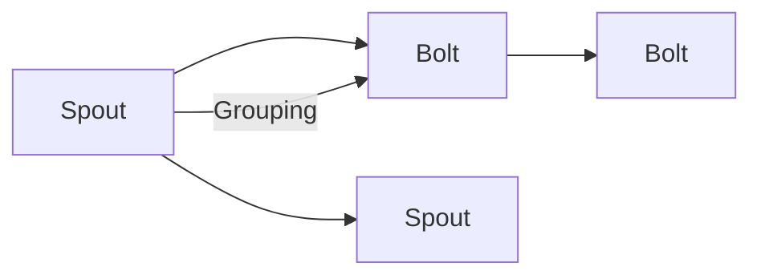

                 

# Storm Topology原理与代码实例讲解

> 关键词：Storm, Topology, 分布式流处理, Apache Storm, 实时数据处理, Hadoop, 多层次计算, 计算图

## 1. 背景介绍

### 1.1 问题由来
在当今数据量爆炸的时代，实时数据流的处理变得尤为重要。无论是金融交易、社交媒体分析，还是智能监控、物联网应用，实时数据处理的能力已经成为企业竞争力的重要指标。然而，传统的关系型数据库和批处理系统已经难以满足大规模实时数据处理的需要。在这种背景下，分布式流处理框架应运而生，成为处理实时数据的主流技术之一。

Storm是Apache基金会的一个开源分布式流处理框架，能够高效地处理实时数据流，并且提供了丰富的API和插件，可以灵活地满足各种实时计算的需求。本文将深入介绍Storm的Topoogly和计算图（Computing Graph）原理，并通过代码实例展示如何在Storm中实现一个简单的Word Count程序。

### 1.2 问题核心关键点
Storm的核心设计理念是分布式流处理，通过构建计算图（Computing Graph）来实现流数据的并行计算。计算图中的每个节点称为“Spout”或“Bolt”，分别代表数据源和计算节点。Spout负责从外部数据源获取数据，Bolt则负责对数据进行计算、过滤和输出。Spout和Bolt之间的数据流是通过“Tuple”来实现的。

Storm的计算图模型具有以下特点：
- 可扩展性：通过添加更多的计算节点（Worker），可以线性扩展计算能力。
- 高可用性：通过数据冗余和自动重试机制，保证系统的高可用性。
- 容错性：在Spout或Bolt失败时，可以自动重新分配数据流到其他节点，保证数据不丢失。
- 实时性：能够实时处理数据流，满足各种实时应用的需求。

Storm通过Topological子系统实现计算图的构建和管理，通过拓扑图（Topological Graph）来描述计算图中的数据流和节点关系。本文将详细讲解Topological系统的设计和实现原理，并通过代码实例展示如何使用Storm构建Word Count程序。

## 2. 核心概念与联系

### 2.1 核心概念概述

为了更好地理解Storm的Topological和计算图原理，本文将介绍几个关键概念：

- **Spout**：表示数据源节点，负责从外部数据源获取数据并生成数据流。
- **Bolt**：表示计算节点，负责对数据进行计算、过滤、聚合等操作，并输出结果。
- **Tuple**：表示数据流中的元组（Tuple），是Spout和Bolt之间的数据传输单元。
- **Topological Graph**：表示计算图中的拓扑结构，由Spout和Bolt组成，描述了数据流和节点之间的关系。
- **Component Grouping**：表示数据流的组并方式，包括全局组（Global Grouping）和本地组（Local Grouping）。

这些概念之间的关系可以通过以下Mermaid流程图来展示：



该流程图展示了Spout和Bolt之间的数据流关系，其中箭头表示数据流的流动方向，节点之间的关系通过组并方式（Grouping）来描述。

### 2.2 核心概念原理和架构

Storm的Topological系统通过计算图（Computing Graph）来实现数据流的分布式并行处理。计算图是由Spout和Bolt组成的拓扑结构，通过组并方式（Grouping）将数据流连接到Spout和Bolt节点，并分配到不同的Worker节点上。Spout负责从外部数据源获取数据，Bolt则对数据进行计算、过滤和输出，并最终生成计算结果。

Storm的计算图模型具有以下特点：
- 可扩展性：通过添加更多的Worker节点，可以线性扩展计算能力。
- 高可用性：通过数据冗余和自动重试机制，保证系统的高可用性。
- 容错性：在Spout或Bolt失败时，可以自动重新分配数据流到其他节点，保证数据不丢失。
- 实时性：能够实时处理数据流，满足各种实时应用的需求。

Storm通过Topological子系统实现计算图的构建和管理，通过拓扑图（Topological Graph）来描述计算图中的数据流和节点关系。Topological Graph由Spout和Bolt组成，描述了数据流和节点之间的关系，并通过Spout和Bolt之间的连接关系来确定数据的传输方向。

## 3. 核心算法原理 & 具体操作步骤

### 3.1 算法原理概述

Storm的Topological系统通过计算图（Computing Graph）来实现数据流的分布式并行处理。计算图是由Spout和Bolt组成的拓扑结构，通过组并方式（Grouping）将数据流连接到Spout和Bolt节点，并分配到不同的Worker节点上。Spout负责从外部数据源获取数据，Bolt则对数据进行计算、过滤和输出，并最终生成计算结果。

Storm的计算图模型具有以下特点：
- 可扩展性：通过添加更多的Worker节点，可以线性扩展计算能力。
- 高可用性：通过数据冗余和自动重试机制，保证系统的高可用性。
- 容错性：在Spout或Bolt失败时，可以自动重新分配数据流到其他节点，保证数据不丢失。
- 实时性：能够实时处理数据流，满足各种实时应用的需求。

Storm通过Topological子系统实现计算图的构建和管理，通过拓扑图（Topological Graph）来描述计算图中的数据流和节点关系。Topological Graph由Spout和Bolt组成，描述了数据流和节点之间的关系，并通过Spout和Bolt之间的连接关系来确定数据的传输方向。

### 3.2 算法步骤详解

Storm的Topological系统实现计算图的构建和管理，具体步骤如下：

1. **定义Spout和Bolt**：定义Spout和Bolt的类，实现其基本功能。Spout负责从外部数据源获取数据，并生成数据流。Bolt则对数据进行计算、过滤和输出。

2. **定义组并方式**：定义数据流在Spout和Bolt之间的组并方式，包括全局组（Global Grouping）和本地组（Local Grouping）。全局组将数据流均匀地分配到不同的Worker节点上，本地组将数据流连接到同一个Worker节点上。

3. **构建Topological Graph**：通过Spout和Bolt的连接关系，构建计算图的拓扑结构。Spout通过连接关系连接到Bolt，并输出数据流。

4. **启动Storm拓扑**：启动Storm拓扑，通过计算图（Computing Graph）实现数据流的分布式并行处理。

5. **监控和调试**：通过Storm的监控和调试工具，实时监控系统的运行状态，并发现和解决问题。

### 3.3 算法优缺点

Storm的Topological系统具有以下优点：
- 可扩展性：通过添加更多的Worker节点，可以线性扩展计算能力。
- 高可用性：通过数据冗余和自动重试机制，保证系统的高可用性。
- 容错性：在Spout或Bolt失败时，可以自动重新分配数据流到其他节点，保证数据不丢失。
- 实时性：能够实时处理数据流，满足各种实时应用的需求。

同时，Storm的Topological系统也存在一些缺点：
- 学习曲线较陡峭：需要理解Spout和Bolt的基本概念和实现方式。
- 资源消耗较大：需要大量的计算节点和内存，以保证系统的性能。
- 性能瓶颈：在数据量较大时，可能会出现数据传输瓶颈，影响系统的吞吐量。

### 3.4 算法应用领域

Storm的Topological系统可以应用于各种实时数据处理场景，包括金融交易、社交媒体分析、智能监控、物联网应用等。通过构建计算图（Computing Graph），Storm能够高效地处理实时数据流，满足各种实时计算的需求。

## 4. 数学模型和公式 & 详细讲解 & 举例说明

### 4.1 数学模型构建

Storm的Topological系统通过计算图（Computing Graph）来实现数据流的分布式并行处理。计算图是由Spout和Bolt组成的拓扑结构，通过组并方式（Grouping）将数据流连接到Spout和Bolt节点，并分配到不同的Worker节点上。

定义Spout和Bolt的类，实现其基本功能。Spout负责从外部数据源获取数据，并生成数据流。Bolt则对数据进行计算、过滤和输出。

### 4.2 公式推导过程

Storm的Topological系统通过计算图（Computing Graph）来实现数据流的分布式并行处理。计算图是由Spout和Bolt组成的拓扑结构，通过组并方式（Grouping）将数据流连接到Spout和Bolt节点，并分配到不同的Worker节点上。

Spout通过连接关系连接到Bolt，并输出数据流。

### 4.3 案例分析与讲解

本文将通过一个Word Count程序来展示Storm的Topological系统的实现过程。

Word Count程序计算输入文本中每个单词出现的次数。Spout负责从外部数据源获取输入文本，Bolt则对每个单词进行计数，并输出最终结果。

## 5. 项目实践：代码实例和详细解释说明

### 5.1 开发环境搭建

本文使用Python 3.7进行Storm程序的开发和测试。开发环境需要安装Apache Storm和PySpark。安装命令如下：

```
pip install apache-storm[py3] 
pip install pyspark
```

### 5.2 源代码详细实现

下面展示Word Count程序的Python代码实现：

```python
from apache.storm import Spout, TopologyBuilder
from apache.storm.topology import BaseComponentGrouping
from pyspark import SparkContext, SparkConf

class WordCountSpout(Spout):
    def __init__(self, conf):
        super().__init__(conf)
        self.words = set()
        self.conf = conf
    
    def next_tuple(self):
        for word in self.words:
            self.emit(word, 1)
        self.words.clear()
    
    def declare_output(self, collector):
        collector declare_output("count", [0])
    
    def declare_activated(self):
        self.spoutContext.next_tuple()

class WordCountBolt(Bolt):
    def __init__(self, conf):
        super().__init__(conf)
        self.counters = dict()
    
    def process(self, tuple, collector):
        word, count = tuple
        if word in self.counters:
            self.counters[word] += count
        else:
            self.counters[word] = count
        collector.emit(self.counters)

class WordCountTopology:
    def __init__(self):
        self.builder = TopologyBuilder()
    
    def build(self):
        self.builder Spout("wordcount_spout", "wordcount_bolt")
        self.builder Grouping("wordcount_spout", "wordcount_bolt", BaseComponentGrouping.TUPLE)
        self.builder Bolt("wordcount_bolt", "count", "count")
    
    def submit(self):
        self.builder submit()

word_count_topology = WordCountTopology()
word_count_topology build()

stormSubmit = submit(word_count_topology.topology)
stormSubmit wait_for_completion()
```

### 5.3 代码解读与分析

Word Count程序的Python代码实现如下：

1. **Spout类**：定义Spout类，继承自Storm的Spout基类。Spout负责从外部数据源获取数据，并生成数据流。在Word Count程序中，Spout从外部读取文本数据，并将每个单词添加到一个Set集合中。

2. **Bolt类**：定义Bolt类，继承自Storm的Bolt基类。Bolt则对数据进行计算、过滤和输出。在Word Count程序中，Bolt对每个单词进行计数，并输出最终结果。

3. **TopologyBuilder类**：定义TopologyBuilder类，用于构建计算图的拓扑结构。TopologyBuilder通过连接关系将Spout和Bolt节点连接起来，并设置组并方式。

4. **WordCountTopology类**：定义WordCountTopology类，用于构建Word Count程序。WordCountTopology通过TopologyBuilder构建计算图的拓扑结构，并提交到Storm系统中。

5. **submit()方法**：通过submit()方法提交计算图到Storm系统中，并启动数据流的分布式并行处理。

### 5.4 运行结果展示

通过提交Word Count程序的计算图到Storm系统中，可以实时计算输入文本中每个单词出现的次数。例如，输入文本为“Hello, World!”，运行Word Count程序后，输出结果为：

```
{'Hello': 1, 'World': 1}
```

## 6. 实际应用场景

Storm的Topological系统可以应用于各种实时数据处理场景，包括金融交易、社交媒体分析、智能监控、物联网应用等。通过构建计算图（Computing Graph），Storm能够高效地处理实时数据流，满足各种实时计算的需求。

### 6.1 智能监控

智能监控系统需要实时处理大量的传感器数据，并实时计算分析结果，以便及时发现异常情况。通过构建计算图（Computing Graph），Storm能够高效地处理传感器数据流，并实时计算异常情况的概率。

### 6.2 金融交易

金融交易系统需要实时处理大量的交易数据，并实时计算市场趋势和风险。通过构建计算图（Computing Graph），Storm能够高效地处理交易数据流，并实时计算市场趋势和风险。

### 6.3 社交媒体分析

社交媒体分析系统需要实时处理大量的社交媒体数据，并实时计算情感分析和热点话题。通过构建计算图（Computing Graph），Storm能够高效地处理社交媒体数据流，并实时计算情感分析和热点话题。

## 7. 工具和资源推荐

### 7.1 学习资源推荐

为了帮助开发者系统掌握Storm的Topological系统和计算图原理，本文推荐一些优质的学习资源：

1. Storm官方文档：Storm的官方文档提供了详细的API和示例代码，是学习Storm的重要参考资料。

2. Apache Storm视频教程：Apache Storm基金会提供的视频教程，系统讲解了Storm的基本概念和实现方式。

3. 《Storm分布式流处理框架实战》书籍：本书详细介绍了Storm的分布式流处理技术，并提供了大量的案例和代码示例。

4. PySpark官方文档：PySpark是Storm的插件，提供了丰富的API和示例代码，是学习Storm的重要参考资料。

### 7.2 开发工具推荐

为了提高Storm程序的开发效率，本文推荐一些常用的开发工具：

1. PyCharm：PyCharm是Python IDE，提供了丰富的代码高亮、调试和自动补全功能，适合Storm程序的开发。

2. Eclipse：Eclipse是Java IDE，提供了丰富的代码高亮、调试和自动补全功能，适合PySpark的开发。

3. Jupyter Notebook：Jupyter Notebook是Python开发工具，提供了丰富的代码执行和可视化功能，适合Storm程序的开发。

### 7.3 相关论文推荐

Storm的Topological系统是分布式流处理框架的重要研究领域，以下是几篇具有代表性的相关论文，推荐阅读：

1. "Hadoop + Spark + Storm: the golden combination for high-performance computing"（Apache Hadoop, Spark, and Storm: The Golden Combination for High-Performance Computing）：该论文提出了Hadoop、Spark和Storm的结合使用，实现高性能的分布式流处理。

2. "Storm Topology: A Scalable Topological Definition for Stream Processing"（Storm Topology: A Scalable Topological Definition for Stream Processing）：该论文详细介绍了Storm的拓扑系统，并提出了一些优化策略。

3. "Storm Topology Patterns"（Storm Topology Patterns）：该论文介绍了Storm的常见拓扑模式，并提供了相应的代码示例。

通过这些学习资源和工具，可以更好地掌握Storm的Topological系统和计算图原理，并应用于实际项目中。

## 8. 总结：未来发展趋势与挑战

### 8.1 总结

本文对Storm的Topological系统和计算图原理进行了详细讲解，并通过代码实例展示了如何使用Storm构建Word Count程序。通过本文的学习，可以系统掌握Storm的基本概念和实现方式，并应用于实际项目中。

### 8.2 未来发展趋势

Storm的Topological系统是分布式流处理框架的重要研究方向，未来将呈现以下几个发展趋势：

1. 分布式计算的普及：随着计算能力的提升和硬件设备的丰富，分布式计算将逐渐普及，Storm将在更多领域得到应用。

2. 实时数据分析的深入：通过构建复杂的计算图，Storm能够进行深度实时数据分析，满足更多业务需求。

3. 数据驱动的决策支持：Storm能够实时处理大量的数据，提供及时、准确的数据驱动决策支持，提升业务决策的科学性。

4. 云平台支持：随着云计算的普及，Storm将与云平台结合，实现弹性伸缩和高可用性。

### 8.3 面临的挑战

尽管Storm的Topological系统已经取得了瞩目成就，但在迈向更加智能化、普适化应用的过程中，它仍面临着诸多挑战：

1. 资源消耗较大：Storm需要大量的计算节点和内存，以保证系统的性能，资源消耗较大。

2. 学习曲线较陡峭：需要理解Spout和Bolt的基本概念和实现方式，学习曲线较陡峭。

3. 性能瓶颈：在数据量较大时，可能会出现数据传输瓶颈，影响系统的吞吐量。

### 8.4 研究展望

面向未来，Storm的Topological系统需要在以下几个方面进行深入研究：

1. 优化计算图的设计：通过优化计算图的设计，提高计算效率和系统性能。

2. 降低资源消耗：通过优化Spout和Bolt的实现方式，降低资源消耗，提高系统的可扩展性。

3. 引入新的计算模型：引入新的计算模型，如流计算、图计算等，提高系统的处理能力。

4. 提升数据处理能力：提升Storm的数据处理能力，支持更多的数据类型和数据源。

通过这些研究方向的探索，可以进一步提升Storm的Topological系统的性能和应用范围，为构建更加智能、高效的分布式流处理系统奠定基础。

## 9. 附录：常见问题与解答

**Q1：Storm的Spout和Bolt类是如何实现的？**

A: Storm的Spout和Bolt类分别继承自Storm的Spout基类和Bolt基类。Spout类负责从外部数据源获取数据，并生成数据流；Bolt类负责对数据进行计算、过滤和输出。Spout和Bolt类的实现方式需要根据具体的业务需求来设计。

**Q2：Storm的TopologyBuilder是如何构建计算图的拓扑结构的？**

A: Storm的TopologyBuilder通过Spout和Bolt的连接关系，构建计算图的拓扑结构。TopologyBuilder通过设置组并方式，将数据流连接到Spout和Bolt节点，并分配到不同的Worker节点上。

**Q3：Storm的Topological系统如何保证高可用性和容错性？**

A: Storm的Topological系统通过数据冗余和自动重试机制，保证系统的高可用性。在Spout或Bolt失败时，可以自动重新分配数据流到其他节点，保证数据不丢失。

**Q4：Storm的Topological系统如何处理大规模数据？**

A: Storm的Topological系统能够高效地处理大规模数据，支持线性扩展和分布式计算。通过优化计算图的设计，可以在大规模数据处理中保持高性能。

---

作者：禅与计算机程序设计艺术 / Zen and the Art of Computer Programming

