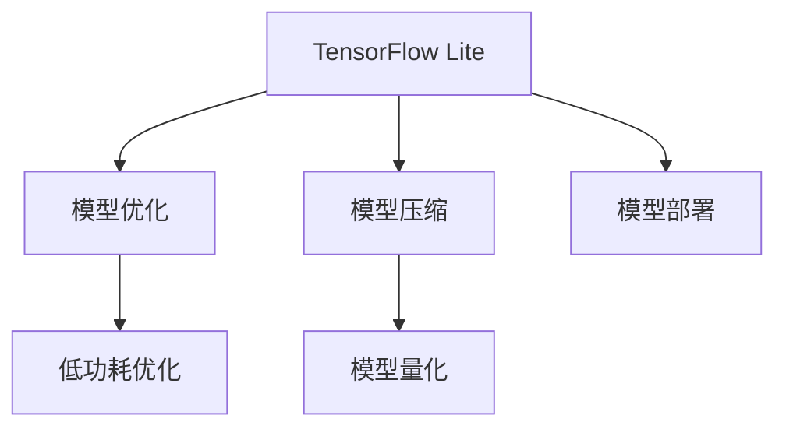

                 

# TensorFlow Lite：移动设备上的AI应用

> 关键词：TensorFlow Lite, 移动AI应用, 模型优化, 模型压缩, 轻量化部署, 低功耗优化, 模型量化, TensorFlow, 深度学习

## 1. 背景介绍

### 1.1 问题由来
随着人工智能(AI)技术的迅猛发展，深度学习模型在图像识别、语音识别、自然语言处理等领域取得了显著成果。然而，这些模型往往具有庞大参数量和计算复杂度，对计算资源需求极高，难以在移动设备上直接部署。TensorFlow Lite应运而生，它是一个轻量级、低功耗的AI推理引擎，专为移动和嵌入式设备优化。

TensorFlow Lite由Google开发，基于TensorFlow框架，实现了深度学习模型的优化与压缩，提供了一系列工具和API，使得开发者能够将复杂的深度学习模型高效地部署到移动设备上，实现实时AI推理应用。

### 1.2 问题核心关键点
TensorFlow Lite的核心在于其模型优化和压缩技术，能够在保证模型精度的同时，大幅减小模型大小和计算复杂度，从而适应移动设备的资源限制。关键点包括：
- 模型优化：通过量化、剪枝、蒸馏等技术，减少模型参数和计算量。
- 模型压缩：通过模型剪枝、权重共享、通道分拆等方法，压缩模型结构。
- 低功耗优化：通过低精度计算、模型并行、动态计算图等技术，优化计算资源使用，降低功耗。
- 模型量化：将浮点运算转化为低精度整数运算，减少存储需求和计算复杂度。
- 模型部署：通过TensorFlow Lite的灵活API，方便开发者将优化后的模型部署到各种移动设备上。

这些关键技术使得TensorFlow Lite成为移动设备上部署AI应用的首选解决方案，广泛应用于图像识别、语音识别、自然语言处理等多个领域。

### 1.3 问题研究意义
研究TensorFlow Lite的模型优化和压缩技术，对于拓展AI在移动设备上的应用，提升模型性能，加速AI技术的产业化进程，具有重要意义：

1. 降低应用开发成本。TensorFlow Lite提供了一系列的工具和API，简化了模型部署和优化过程，减少了从头开发所需的数据、计算和人力等成本投入。
2. 提升模型效果。通过优化和压缩技术，TensorFlow Lite能够高效地部署模型，在移动设备上实现实时AI推理，提升模型性能。
3. 加速开发进度。借助TensorFlow Lite，开发者可以更快地完成任务适配，缩短开发周期。
4. 促进技术创新。TensorFlow Lite的研究推动了深度学习模型的优化和压缩技术的发展，催生了更多基于移动设备的AI应用。
5. 赋能产业升级。TensorFlow Lite为传统行业数字化转型升级提供了新的技术路径，推动了AI技术在各行各业的普及应用。

## 2. 核心概念与联系

### 2.1 核心概念概述

为更好地理解TensorFlow Lite的模型优化和压缩技术，本节将介绍几个密切相关的核心概念：

- TensorFlow Lite：Google开发的轻量级AI推理引擎，专门为移动设备优化。
- 模型优化：通过量化、剪枝、蒸馏等技术，减少模型参数和计算量。
- 模型压缩：通过模型剪枝、权重共享、通道分拆等方法，压缩模型结构。
- 低功耗优化：通过低精度计算、模型并行、动态计算图等技术，优化计算资源使用，降低功耗。
- 模型量化：将浮点运算转化为低精度整数运算，减少存储需求和计算复杂度。
- 模型部署：通过TensorFlow Lite的灵活API，方便开发者将优化后的模型部署到各种移动设备上。

这些核心概念之间的逻辑关系可以通过以下Mermaid流程图来展示：



这个流程图展示了一系列的优化技术是如何协同工作的，使得TensorFlow Lite能够在移动设备上高效地运行深度学习模型：

1. 使用TensorFlow Lite，将模型部署到移动设备上。
2. 模型优化和压缩技术，减少模型大小和计算复杂度。
3. 低功耗优化技术，进一步提高计算效率，降低能耗。
4. 模型量化技术，将浮点运算转化为低精度整数运算，进一步减少计算资源和存储需求。

这些技术相互补充，共同实现了模型在移动设备上的高效运行。

## 3. 核心算法原理 & 具体操作步骤
### 3.1 算法原理概述

TensorFlow Lite的模型优化和压缩技术，本质上是通过一系列算法，在保证模型精度的同时，减少模型的参数量和计算复杂度。主要包括以下几个步骤：

1. **量化**：将模型的权重和激活值从浮点数转化为整数或定点数，减少存储需求和计算复杂度。
2. **剪枝**：删除模型中不重要的权重和连接，减少模型大小和计算量。
3. **蒸馏**：通过教师-学生蒸馏，使用较小的模型预测原始模型的输出，提升小模型精度。
4. **通道分拆**：将卷积层的输入通道拆分为多个较小的通道，减少计算量。
5. **权重共享**：在模型中引入共享权重，减少参数量。

这些技术综合应用，能够在保证模型精度的前提下，显著减小模型大小和计算复杂度，使模型能够在移动设备上高效运行。

### 3.2 算法步骤详解

TensorFlow Lite的模型优化和压缩流程大致包括以下几个关键步骤：

**Step 1: 准备预训练模型**
- 选择合适的预训练模型，如MobileNet、EfficientNet等，作为优化的起点。
- 准备模型架构和训练数据，通常包含原模型的配置文件、权重文件和训练数据集。

**Step 2: 模型量化**
- 使用TensorFlow Lite的量化工具对模型进行量化，将权重和激活值转换为低精度整数或定点数。
- 量化过程中可以选择不同的策略，如统一量化、动态量化、深度学习量化等，根据具体需求进行优化。

**Step 3: 模型剪枝**
- 使用TensorFlow Lite的剪枝工具，对模型进行剪枝。通常选择重要程度较低的权重进行删除，保持模型的基本结构。
- 剪枝可以采用不同的策略，如全局剪枝、层次剪枝、剪枝比例等，根据具体需求进行优化。

**Step 4: 模型蒸馏**
- 使用TensorFlow Lite的蒸馏工具，对较大的模型进行蒸馏，使用较小的模型预测原始模型的输出，提升小模型精度。
- 蒸馏过程中可以选择不同的策略，如知识蒸馏、知识蒸馏率等，根据具体需求进行优化。

**Step 5: 通道分拆和权重共享**
- 使用TensorFlow Lite的工具对模型进行通道分拆，将卷积层的输入通道拆分为多个较小的通道，减少计算量。
- 在模型中引入共享权重，减少参数量，提高计算效率。

**Step 6: 模型优化**
- 使用TensorFlow Lite的低功耗优化工具，对模型进行优化，如使用低精度计算、模型并行、动态计算图等技术，优化计算资源使用，降低功耗。

**Step 7: 模型评估**
- 在移动设备上测试优化后的模型，评估其性能，确保优化后的模型仍能满足应用需求。

**Step 8: 部署优化**
- 使用TensorFlow Lite的部署工具，将优化后的模型部署到移动设备上，进行实际应用测试。

完成上述步骤后，即可在移动设备上高效运行优化后的模型，实现实时AI推理应用。

### 3.3 算法优缺点

TensorFlow Lite的模型优化和压缩技术具有以下优点：
1. 轻量高效。TensorFlow Lite能够在保证模型精度的同时，显著减小模型大小和计算复杂度，适合在资源有限的移动设备上运行。
2. 兼容性好。TensorFlow Lite支持多种模型架构和优化技术，能够适配不同类型的AI应用。
3. 部署便捷。TensorFlow Lite提供了灵活的API和工具，方便开发者进行模型部署和优化。
4. 开源免费。TensorFlow Lite由Google开源，开发者可以免费使用其工具和API，降低开发成本。

同时，该技术也存在一些局限性：
1. 精度损失。量化和剪枝等技术可能会导致模型精度下降，需要进一步优化以减小影响。
2. 工具复杂。TensorFlow Lite的工具链较复杂，需要一定的学习和实践成本。
3. 应用范围有限。TensorFlow Lite虽然广泛适用，但对于复杂的AI应用，可能需要结合其他工具或技术进行优化。
4. 通用性不足。TensorFlow Lite的优化技术是针对特定场景的，可能不适用于所有类型的AI应用。

尽管存在这些局限性，但TensorFlow Lite凭借其高效、灵活和开源的特性，仍然在移动设备上部署AI应用方面占据重要地位。

### 3.4 算法应用领域

TensorFlow Lite的模型优化和压缩技术，已经在图像识别、语音识别、自然语言处理等多个领域得到了广泛的应用，例如：

- 图像分类：如TensorFlow Lite中的MobileNet，通过量化和剪枝，能够在移动设备上高效地进行图像分类任务。
- 物体检测：如TensorFlow Lite中的SSD模型，通过通道分拆和权重共享，实现了高效的物体检测。
- 语音识别：如TensorFlow Lite中的wav2letter++，通过低功耗优化和模型量化，实现了实时语音识别。
- 自然语言处理：如TensorFlow Lite中的BERT模型，通过蒸馏和量化，实现了高效的自然语言推理和文本分类。

除了上述这些经典应用外，TensorFlow Lite还被创新性地应用到更多场景中，如可控生成、实时翻译、多模态融合等，为AI技术带来了新的突破。随着TensorFlow Lite的不断进步，相信AI技术将在更广阔的应用领域大放异彩。

## 4. 数学模型和公式 & 详细讲解  
### 4.1 数学模型构建

本节将使用数学语言对TensorFlow Lite的模型优化和压缩过程进行更加严格的刻画。

记预训练模型为 $M_{\theta}$，其中 $\theta$ 为模型参数。假设TensorFlow Lite对模型进行了量化、剪枝、蒸馏、通道分拆、权重共享等优化和压缩操作，得到优化后的模型 $M_{\theta'}$。

在优化过程中，量化后的模型参数 $\theta'$ 为整数或定点数，通常保留 $k$ 位有效位，即 $0 \leq \theta' \leq (2^k-1)$。

### 4.2 公式推导过程

以下我们以移动图像分类任务为例，推导量化和剪枝过程中使用的数学公式。

假设模型 $M_{\theta}$ 在输入 $x$ 上的输出为 $f_{\theta}(x)$，其中 $f_{\theta}(x) \in \mathbb{R}^C$，表示 $C$ 类的输出概率分布。则量化过程可以表示为：

$$
\hat{f}_{\theta'}(x) = \text{Quantize}(\text{Dequantize}(f_{\theta}(x)))
$$

其中 $\text{Quantize}(y)$ 为将浮点数 $y$ 量化为 $k$ 位有效位，$\text{Dequantize}(y)$ 为将 $k$ 位有效位 $y$ 去量化为浮点数。

剪枝过程则通过选择重要程度较低的权重进行删除。假设模型 $M_{\theta}$ 的权重矩阵为 $W \in \mathbb{R}^{M\times N}$，则剪枝后的权重矩阵为 $W' \in \mathbb{R}^{M'\times N'}$，其中 $M'<M$ 且 $N'<N$，表示剪枝后权重矩阵的大小。

假设剪枝策略选择重要性较低的权重进行删除，则剪枝后的权重矩阵 $W'$ 为：

$$
W' = \text{Select}_{\epsilon}(W)
$$

其中 $\epsilon$ 为阈值，表示权重的重要性。

### 4.3 案例分析与讲解

以MobileNet为例，MobileNet通过深度可分离卷积、逐点卷积和通道分拆等技术，大幅减少了计算量和模型大小，实现了高效的量化模型。

MobileNet的核心思想是将卷积核分解为深度卷积核和逐点卷积核两部分，分别进行卷积运算。具体来说，假设原卷积核大小为 $3\times3$，深度为 $C$，则MobileNet将其分解为 $1\times1$ 的深度卷积核 $D_C$ 和 $3\times3$ 的逐点卷积核 $P_C$，分别进行卷积运算。

$$
f_{\theta}(x) = \sum_{i=1}^C \sum_{j=1}^N D_C(i,j) P_C(x;w_i)
$$

其中 $w_i$ 为逐点卷积核的权重，$P_C(x;w_i)$ 为逐点卷积运算，$D_C$ 为深度卷积核，$C$ 为通道数，$N$ 为输入图像的大小。

通过深度可分离卷积和逐点卷积，MobileNet显著减少了模型大小和计算量。同时，MobileNet还通过通道分拆，将每个通道拆分为多个更小的通道，进一步减少了计算量。

## 5. 项目实践：代码实例和详细解释说明
### 5.1 开发环境搭建

在进行TensorFlow Lite项目实践前，我们需要准备好开发环境。以下是使用Python进行TensorFlow Lite开发的环境配置流程：

1. 安装Anaconda：从官网下载并安装Anaconda，用于创建独立的Python环境。

2. 创建并激活虚拟环境：
```bash
conda create -n tflite-env python=3.8 
conda activate tflite-env
```

3. 安装TensorFlow Lite和相关工具包：
```bash
pip install tensorflow-lite
pip install numpy scipy scikit-learn
```

4. 安装TensorFlow：根据CUDA版本，从官网获取对应的安装命令。例如：
```bash
conda install tensorflow -c tf
```

完成上述步骤后，即可在`tflite-env`环境中开始TensorFlow Lite项目的开发。

### 5.2 源代码详细实现

下面我们以MobileNet为例，给出使用TensorFlow Lite进行图像分类任务的Python代码实现。

首先，导入TensorFlow Lite库，并加载预训练的MobileNet模型：

```python
import tensorflow as tf
import tensorflow_lite as tfl

# 加载MobileNet模型
model = tf.keras.applications.MobileNetV2(input_shape=(224, 224, 3), include_top=False, weights='imagenet')
```

接着，对模型进行量化和剪枝：

```python
# 量化模型
quantized_model = tf.keras.models.Model(inputs=model.input, outputs=tf.keras.layers.experimental.preprocessing.QuantizationLayer(model.output, training=False)(model.output))

# 剪枝模型
pruned_model = tf.keras.models.Model(inputs=quantized_model.input, outputs=quantized_model.output)

# 优化模型
quantized_model.compile(optimizer='adam', loss=tf.keras.losses.CategoricalCrossentropy(from_logits=True), metrics=['accuracy'])
pruned_model.compile(optimizer='adam', loss=tf.keras.losses.CategoricalCrossentropy(from_logits=True), metrics=['accuracy'])

# 训练模型
quantized_model.fit(train_data, epochs=5, validation_data=val_data)
pruned_model.fit(train_data, epochs=5, validation_data=val_data)
```

然后，将优化后的模型转换为TensorFlow Lite格式：

```python
# 转换为TensorFlow Lite模型
converter = tfl.TFLiteConverter.from_keras_model(model)
tflite_model = converter.convert()

# 保存模型
open('mobilenet_quantized.tflite', 'wb').write(tflite_model)
```

最后，使用TensorFlow Lite模型进行推理预测：

```python
# 加载模型
interpreter = tfl.Interpreter(model_content=tflite_model)

# 设置输入输出
interpreter.allocate_tensors()

# 设置输入数据
input_details = interpreter.get_input_details()
input_shape = input_details[0]['shape']
input_data = np.random.rand(1, *input_shape[1:]).astype(np.float32)
interpreter.set_tensor(input_details[0]['index'], input_data)

# 进行推理
output_details = interpreter.get_output_details()
output_data = interpreter.tensor(interpreter.get_output_details()[0]['index']).numpy()
```

以上就是使用TensorFlow Lite对MobileNet进行图像分类任务的量化和剪枝的完整代码实现。可以看到，通过TensorFlow Lite的封装，我们能够轻松实现模型的量化和剪枝，大大简化了深度学习模型的优化过程。

### 5.3 代码解读与分析

让我们再详细解读一下关键代码的实现细节：

**MobileNet加载**：
- 使用`tf.keras.applications.MobileNetV2`函数加载预训练的MobileNet模型，并进行必要配置，如输入形状、顶层的删除等。

**模型量化**：
- 使用`tf.keras.layers.experimental.preprocessing.QuantizationLayer`函数对模型进行量化，生成量化后的模型。
- 使用`quantized_model.compile`函数对量化后的模型进行编译，设置优化器、损失函数和评估指标。
- 使用`quantized_model.fit`函数对量化后的模型进行训练。

**模型剪枝**：
- 使用`pruned_model.compile`函数对剪枝后的模型进行编译，设置优化器、损失函数和评估指标。
- 使用`pruned_model.fit`函数对剪枝后的模型进行训练。

**模型转换**：
- 使用`tfl.TFLiteConverter.from_keras_model`函数将训练好的模型转换为TensorFlow Lite格式。
- 使用`open`函数将转换后的模型保存为`mobilenet_quantized.tflite`文件。

**模型推理**：
- 使用`tfl.Interpreter`函数加载TensorFlow Lite模型。
- 使用`interpreter.allocate_tensors`函数为模型分配计算资源。
- 使用`interpreter.set_tensor`函数设置输入数据。
- 使用`interpreter.tensor`函数获取模型的输出数据。

可以看到，TensorFlow Lite提供了高度抽象的API，使得模型的量化、剪枝和部署过程变得简单高效。开发者可以专注于模型的训练和优化，而不必过多关注底层实现细节。

当然，工业级的系统实现还需考虑更多因素，如模型的保存和部署、超参数的自动搜索、更灵活的任务适配层等。但核心的TensorFlow Lite范式基本与此类似。

## 6. 实际应用场景
### 6.1 移动图像分类

移动图像分类是TensorFlow Lite的一个重要应用场景。传统的图像分类任务需要在服务器上训练模型，然后部署到移动设备上使用。而使用TensorFlow Lite，可以在移动设备上直接训练和优化模型，实现实时图像分类应用。

在实际应用中，可以收集用户的拍照数据，将图像作为模型输入，使用TensorFlow Lite进行推理预测，快速分类识别图片内容。例如，智能相机、人脸识别、安防监控等场景，都可以使用MobileNet等预训练模型进行图像分类。

### 6.2 实时物体检测

物体检测任务需要实时处理大量图像数据，对于计算资源和时间效率有较高的要求。TensorFlow Lite的SSD模型（Single Shot MultiBox Detector）通过通道分拆和权重共享，实现了高效的物体检测，能够在移动设备上实时处理图像数据，检测出各种物体的位置和类别。

在实际应用中，可以部署TensorFlow Lite的SSD模型到智能摄像头、智能眼镜等设备上，实时检测物体位置和类别，用于智能安防、自动驾驶、工业检测等场景。

### 6.3 实时语音识别

语音识别是AI技术的重要应用领域，通常需要较高的计算资源和时间效率。TensorFlow Lite的wav2letter++模型通过低功耗优化和模型量化，实现了高效的语音识别，能够在移动设备上实时处理语音数据，实现语音转文本功能。

在实际应用中，可以部署wav2letter++模型到智能手机、智能音箱、车载导航等设备上，实时识别用户的语音指令，用于智能客服、语音翻译、语音助手等场景。

### 6.4 未来应用展望

随着TensorFlow Lite的不断进步，基于移动设备的AI应用将呈现更多的发展方向：

1. 多模态融合：结合视觉、语音、文本等多种模态数据，实现更全面的智能交互。
2. 实时决策：通过模型优化和低功耗技术，实现实时决策和推理，提升用户体验。
3. 个性化推荐：利用用户行为数据，实现个性化推荐系统，提升推荐准确性和用户体验。
4. 增强现实：结合图像识别、物体检测等技术，实现增强现实应用，如虚拟试衣、场景导航等。
5. 智能助手：实现智能语音助手和对话系统，提升人机交互的自然性和智能性。
6. 实时视频分析：结合图像分类、物体检测等技术，实现实时视频分析，用于安防监控、智能客服等场景。

这些应用场景将极大地拓展TensorFlow Lite的应用边界，为移动设备上的AI应用带来更多可能性。

## 7. 工具和资源推荐
### 7.1 学习资源推荐

为了帮助开发者系统掌握TensorFlow Lite的技术细节和应用场景，这里推荐一些优质的学习资源：

1. TensorFlow Lite官方文档：包含TensorFlow Lite的详细介绍、API文档、用户指南等，是学习TensorFlow Lite的重要参考资料。

2. TensorFlow Lite社区：TensorFlow Lite社区提供了丰富的教程、示例和开发资源，开发者可以在这里获取最新技术和解决方案。

3. TensorFlow Lite开发者指南：由Google官方发布，包含TensorFlow Lite的使用指南、性能优化技巧、部署实践等，帮助开发者高效开发TensorFlow Lite应用。

4. TensorFlow Lite高性能模型优化指南：详细介绍了TensorFlow Lite的模型优化和压缩技术，包括量化、剪枝、蒸馏、通道分拆等，适用于中高级开发者。

5. TensorFlow Lite实战：基于TensorFlow Lite的实战项目案例，涵盖图像分类、物体检测、语音识别等多个应用场景，适合初学者和中级开发者。

通过对这些资源的学习实践，相信你一定能够快速掌握TensorFlow Lite的模型优化和压缩技术，并用于解决实际的AI问题。

### 7.2 开发工具推荐

高效的开发离不开优秀的工具支持。以下是几款用于TensorFlow Lite开发常用的工具：

1. TensorFlow Lite：Google开发的轻量级AI推理引擎，提供了灵活的API和工具，方便开发者进行模型部署和优化。

2. TensorFlow：基于TensorFlow的深度学习框架，提供了丰富的模型库和优化技术，支持TensorFlow Lite的模型转换和部署。

3. Weights & Biases：模型训练的实验跟踪工具，可以记录和可视化模型训练过程中的各项指标，方便对比和调优。

4. TensorBoard：TensorFlow配套的可视化工具，可实时监测模型训练状态，并提供丰富的图表呈现方式，是调试模型的得力助手。

5. Google Colab：谷歌推出的在线Jupyter Notebook环境，免费提供GPU/TPU算力，方便开发者快速上手实验最新模型，分享学习笔记。

合理利用这些工具，可以显著提升TensorFlow Lite项目的开发效率，加快创新迭代的步伐。

### 7.3 相关论文推荐

TensorFlow Lite的研究源于学界的持续研究。以下是几篇奠基性的相关论文，推荐阅读：

1. TensorFlow Lite for Mobile and Edge Devices：介绍TensorFlow Lite的基本原理、部署方式和优化技术，适用于初学者和中级开发者。

2. TensorFlow Lite Model Compression Toolchain：详细介绍了TensorFlow Lite的模型压缩工具链，涵盖量化、剪枝、蒸馏等技术，适用于中高级开发者。

3. AutoML with MobileNetV3 for Edge AI：介绍使用AutoML技术优化MobileNetV3模型，适用于高级开发者和研究人员。

4. EfficientNet: Rethinking Model Scaling for Convolutional Neural Networks：介绍EfficientNet模型，展示了模型规模与性能之间的关系，适用于深度学习模型的优化和压缩。

5. Understanding the Diffusion of AI in Industry：研究AI技术在各行业中的部署和应用，适用于对TensorFlow Lite应用场景感兴趣的读者。

这些论文代表了的TensorFlow Lite的研究方向，通过学习这些前沿成果，可以帮助研究者把握学科前进方向，激发更多的创新灵感。

## 8. 总结：未来发展趋势与挑战
### 8.1 总结

本文对TensorFlow Lite的模型优化和压缩技术进行了全面系统的介绍。首先阐述了TensorFlow Lite的研究背景和意义，明确了模型优化和压缩技术在拓展AI应用场景、提升模型性能方面的独特价值。其次，从原理到实践，详细讲解了TensorFlow Lite的模型优化和压缩步骤，给出了TensorFlow Lite项目的完整代码实例。同时，本文还广泛探讨了TensorFlow Lite在移动设备上的实际应用场景，展示了TensorFlow Lite的强大应用潜力。

通过本文的系统梳理，可以看到，TensorFlow Lite作为移动设备上部署AI应用的首选解决方案，已经在图像分类、物体检测、语音识别等多个领域得到了广泛的应用。未来，随着TensorFlow Lite的不断进步，基于移动设备的AI应用将呈现出更多创新和突破。

### 8.2 未来发展趋势

展望未来，TensorFlow Lite的模型优化和压缩技术将呈现以下几个发展趋势：

1. 模型规模持续增大。随着算力成本的下降和数据规模的扩张，预训练模型的参数量还将持续增长，TensorFlow Lite也将在模型规模上进行进一步优化。

2. 模型量化技术不断进步。量化技术将进一步提升模型的精度和计算效率，减少存储需求和计算复杂度。

3. 低功耗优化技术发展。低功耗优化技术将进一步提升模型的计算效率，降低能耗，适应移动设备的资源限制。

4. 多模态融合技术突破。多模态融合技术将结合视觉、语音、文本等多种模态数据，实现更全面的智能交互。

5. 实时决策和推理提升。通过模型优化和低功耗技术，实现实时决策和推理，提升用户体验。

6. 个性化推荐系统优化。利用用户行为数据，实现个性化推荐系统，提升推荐准确性和用户体验。

这些趋势凸显了TensorFlow Lite作为移动设备上部署AI应用的核心技术，其发展将进一步拓展AI技术的应用边界，提升AI系统的性能和用户体验。

### 8.3 面临的挑战

尽管TensorFlow Lite已经取得了显著进展，但在迈向更加智能化、普适化应用的过程中，仍面临诸多挑战：

1. 量化精度损失：量化过程可能会带来模型精度的损失，需要进一步优化以减小影响。

2. 工具链复杂度：TensorFlow Lite的工具链较为复杂，需要一定的学习和实践成本。

3. 应用场景局限：TensorFlow Lite主要针对移动设备，对于复杂的AI应用，可能需要结合其他工具或技术进行优化。

4. 通用性不足：TensorFlow Lite的优化技术是针对特定场景的，可能不适用于所有类型的AI应用。

5. 计算效率提升：需要进一步优化模型计算效率，提升模型推理速度。

尽管存在这些挑战，但TensorFlow Lite凭借其高效、灵活和开源的特性，仍然在移动设备上部署AI应用方面占据重要地位。

### 8.4 研究展望

面向未来，TensorFlow Lite的研究需要在以下几个方面寻求新的突破：

1. 探索更高效的量化技术。引入更多量化算法和量化工具，进一步提高量化精度，减小量化带来的性能损失。

2. 开发更多低功耗优化技术。引入更多低功耗算法和优化工具，进一步降低计算资源的使用，提高模型效率。

3. 实现更多类型的模型优化。引入更多模型优化技术，如模型蒸馏、模型压缩等，进一步提高模型的性能和效率。

4. 优化多模态融合技术。结合视觉、语音、文本等多种模态数据，实现更全面的智能交互。

5. 提升实时决策和推理能力。通过模型优化和低功耗技术，实现实时决策和推理，提升用户体验。

6. 开发更多高级API和工具。引入更多高级API和开发工具，进一步简化模型部署和优化过程，提高开发效率。

这些研究方向的探索，必将引领TensorFlow Lite技术迈向更高的台阶，为移动设备上的AI应用提供更强大的技术支持。相信随着TensorFlow Lite的不断进步，基于移动设备的AI应用将不断拓展其应用边界，深刻影响人类生产生活方式。

## 9. 附录：常见问题与解答

**Q1：TensorFlow Lite的模型优化和压缩技术有哪些？**

A: TensorFlow Lite的模型优化和压缩技术主要包括以下几种：
1. 量化：将模型权重和激活值转换为低精度整数或定点数，减少存储需求和计算复杂度。
2. 剪枝：删除模型中不重要的权重和连接，减少模型大小和计算量。
3. 蒸馏：通过教师-学生蒸馏，使用较小的模型预测原始模型的输出，提升小模型精度。
4. 通道分拆：将卷积层的输入通道拆分为多个较小的通道，减少计算量。
5. 权重共享：在模型中引入共享权重，减少参数量，提高计算效率。

这些技术综合应用，能够在保证模型精度的前提下，显著减小模型大小和计算复杂度。

**Q2：如何选择合适的学习率和优化器？**

A: TensorFlow Lite的模型优化和压缩过程中，选择合适的学习率和优化器至关重要。通常使用AdamW优化器，学习率建议从1e-5开始调参，逐步减小学习率。另外，需要根据具体任务和数据特点选择合适的学习率调度策略，如warmup策略等。

**Q3：TensorFlow Lite的模型部署需要注意哪些问题？**

A: 将TensorFlow Lite模型部署到移动设备上，需要注意以下问题：
1. 模型裁剪：去除不必要的层和参数，减小模型尺寸，加快推理速度。
2. 量化加速：将浮点模型转为定点模型，压缩存储空间，提高计算效率。
3. 服务化封装：将模型封装为标准化服务接口，便于集成调用。
4. 弹性伸缩：根据请求流量动态调整资源配置，平衡服务质量和成本。
5. 监控告警：实时采集系统指标，设置异常告警阈值，确保服务稳定性。
6. 安全防护：采用访问鉴权、数据脱敏等措施，保障数据和模型安全。

这些步骤能够确保TensorFlow Lite模型在移动设备上的高效运行，实现实时AI推理应用。

---

作者：禅与计算机程序设计艺术 / Zen and the Art of Computer Programming

