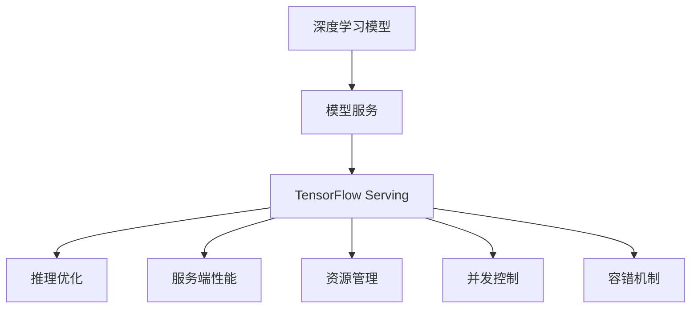

                 

# TensorFlow Serving性能优化

在深度学习模型的生产化部署过程中，性能优化始终是至关重要的环节。TensorFlow Serving作为一款高性能的深度学习模型服务系统，旨在提供快速、稳定、可扩展的推理服务。本文将深入探讨TensorFlow Serving的性能优化策略，帮助开发者构建高效、可靠的模型服务应用。

## 1. 背景介绍

### 1.1 问题由来
随着深度学习技术的迅猛发展，越来越多的企业开始利用深度学习模型进行业务落地。这些模型通常由多个神经网络层组成，计算量巨大，对硬件资源需求高，部署和推理过程复杂。如何在确保推理质量的同时，最大化提升服务性能，成为当前深度学习应用的重要挑战。

TensorFlow Serving是一个开源的、高性能的深度学习模型服务系统，支持多种深度学习模型的部署和推理。它在生产环境中被广泛应用于图像识别、语音识别、自然语言处理等领域，通过提供高效的模型服务，极大提升了企业的业务响应速度和用户体验。

但随着模型复杂度的增加，TensorFlow Serving的性能瓶颈问题也逐渐凸显。如何通过优化策略提升TensorFlow Serving的性能，成为亟待解决的问题。

### 1.2 问题核心关键点
TensorFlow Serving的性能优化主要包括以下几个关键点：
- **推理时间**：确保模型推理时间在可接受的范围内，提升服务响应速度。
- **模型体积**：减小模型文件大小，降低存储和传输开销。
- **并发能力**：提高服务器的并发处理能力，支持更大规模的推理请求。
- **资源利用率**：优化硬件资源的利用率，避免资源浪费。
- **稳定性与可靠性**：保障服务的稳定性和高可用性，减少服务中断和数据丢失。

## 2. 核心概念与联系

### 2.1 核心概念概述

为更好地理解TensorFlow Serving的性能优化方法，本节将介绍几个密切相关的核心概念：

- **深度学习模型**：以神经网络为代表的、用于处理复杂任务的机器学习模型。
- **模型服务**：将深度学习模型部署为可访问的服务，供其他系统调用，提供推理预测功能。
- **TensorFlow Serving**：基于TensorFlow的深度学习模型服务系统，支持高性能推理。
- **推理优化**：针对深度学习模型推理过程的优化，提升推理速度和资源利用率。
- **服务端性能**：指模型服务器的性能，包括响应时间、吞吐量、内存使用率等。
- **资源管理**：指服务器硬件资源的分配和管理，如CPU、GPU、内存等。
- **并发控制**：指模型服务在高并发请求下的处理策略，如负载均衡、请求排队等。
- **容错机制**：指模型服务在故障情况下的恢复和备份机制，确保服务的可靠性。

这些核心概念之间的逻辑关系可以通过以下Mermaid流程图来展示：



这个流程图展示了几者之间的关系：

1. 深度学习模型通过部署为服务，提供推理功能。
2. TensorFlow Serving提供高效的推理服务。
3. 推理优化、服务端性能、资源管理、并发控制和容错机制，共同决定了模型服务的性能和稳定性。

这些概念共同构成了TensorFlow Serving的服务性能优化框架，使得模型服务能够在各种场景下发挥最大的效用。

## 3. 核心算法原理 & 具体操作步骤
### 3.1 算法原理概述

TensorFlow Serving的性能优化主要基于以下几方面的原理：

1. **并行计算**：通过合理分配任务，利用多核、多机环境加速推理计算。
2. **模型压缩**：通过剪枝、量化、稀疏化等技术减小模型文件大小，减少内存和传输开销。
3. **硬件加速**：利用GPU、TPU等高性能硬件加速推理过程，提升计算速度。
4. **资源调度**：通过动态资源调度算法，最大化利用系统资源。
5. **负载均衡**：通过合理分配负载，避免服务器的单点故障，提升系统可用性。

### 3.2 算法步骤详解

TensorFlow Serving的性能优化主要分为以下几个步骤：

**Step 1: 准备模型和服务环境**
- 准备深度学习模型，选择TensorFlow作为模型引擎。
- 配置TensorFlow Serving服务，包括服务器硬件配置、模型配置、负载均衡策略等。

**Step 2: 模型压缩和优化**
- 对模型进行剪枝、量化、稀疏化等操作，减小模型文件大小。
- 使用TensorFlow Serving提供的优化工具，如XlaBuilder、XlaCompiler等，进一步优化模型。

**Step 3: 硬件加速配置**
- 选择合适的硬件平台，如CPU、GPU、TPU等。
- 配置硬件加速环境，包括编译器选项、硬件驱动、优化参数等。

**Step 4: 资源管理与调度**
- 使用TensorFlow Serving提供的资源管理工具，如SessionMetadata、SessionConfig等，动态调整资源分配。
- 实现自定义的负载均衡策略，如轮询、随机、最少连接等。

**Step 5: 服务端性能调优**
- 使用TensorFlow Serving提供的监控工具，如TensorBoard、Grafana等，实时监控推理性能。
- 根据监控结果，调整模型、硬件、调度策略等，进行迭代优化。

**Step 6: 容错和备份机制**
- 配置容错机制，如副本、故障转移、数据备份等。
- 实现异常检测和自动恢复机制，保障服务的持续可用性。

### 3.3 算法优缺点

TensorFlow Serving的性能优化方法具有以下优点：
1. **高效性**：通过并行计算、硬件加速、模型压缩等技术，显著提升了模型推理速度。
2. **灵活性**：支持多种深度学习模型和多种推理方式，灵活应对不同场景。
3. **可扩展性**：通过资源管理和调度策略，支持大规模推理服务的高并发。
4. **可定制性**：提供了丰富的配置选项和扩展接口，用户可以灵活定制性能优化策略。

同时，该方法也存在一些局限性：
1. **复杂度**：优化过程涉及多个环节，需要较高的技术门槛。
2. **调试难度**：性能优化涉及复杂的硬件和软件交互，调试难度较大。
3. **资源需求**：优化过程中需要额外的计算资源和实验成本。

尽管存在这些局限性，但TensorFlow Serving的性能优化方法仍是大规模深度学习模型服务的重要手段。未来相关研究的重点在于如何进一步降低优化成本，提高优化效果，同时兼顾可解释性和可维护性等因素。

### 3.4 算法应用领域

TensorFlow Serving的性能优化方法在多个领域中得到了广泛应用，如：

- **智能推荐系统**：利用深度学习模型预测用户行为，提供个性化推荐服务。通过推理优化，提升了推荐系统的实时响应能力。
- **实时视频处理**：用于实时视频内容分析、人脸识别、行为检测等，通过硬件加速和模型压缩，提升了处理速度和效率。
- **自然语言处理**：如语音识别、文本分类、对话系统等，通过推理优化和模型优化，提高了服务的响应速度和准确性。
- **智能交通**：用于交通监控、路况预测、车辆识别等，通过模型优化和资源管理，提升了系统的实时性和可靠性。

除了上述这些经典领域外，TensorFlow Serving的性能优化技术还被创新性地应用于更多场景中，如医疗影像分析、智能客服、金融风控等，为各类应用场景提供了高效、可靠的推理服务。

## 4. 数学模型和公式 & 详细讲解 & 举例说明（备注：数学公式请使用latex格式，latex嵌入文中独立段落使用 $$，段落内使用 $)
### 4.1 数学模型构建

本节将使用数学语言对TensorFlow Serving的性能优化过程进行更加严格的刻画。

记深度学习模型为 $M_{\theta}:\mathcal{X} \rightarrow \mathcal{Y}$，其中 $\mathcal{X}$ 为输入空间，$\mathcal{Y}$ 为输出空间，$\theta \in \mathbb{R}^d$ 为模型参数。假设模型在输入 $x$ 上的推理时间为 $T(x)$，服务器的CPU时钟频率为 $f$。

定义模型 $M_{\theta}$ 在输入 $x$ 上的推理时间为：

$$
T(x) = \frac{F(x)}{f}
$$

其中 $F(x)$ 为模型在输入 $x$ 上的计算开销。假设 $F(x)$ 是关于 $x$ 的多项式函数，即 $F(x) = O(x^k)$，则推理时间 $T(x)$ 为：

$$
T(x) = O(x^k/f)
$$

为了最小化推理时间，需要最小化 $F(x)$。

### 4.2 公式推导过程

以下我们以推理计算开销 $F(x)$ 为例，推导其最小化过程。

假设推理计算开销 $F(x)$ 可以表示为 $F(x) = F_0 + F_1x + F_2x^2 + ... + F_nx^n$，其中 $F_0, F_1, ..., F_n$ 为常数。推理时间 $T(x)$ 可表示为：

$$
T(x) = \frac{F(x)}{f} = \frac{F_0 + F_1x + F_2x^2 + ... + F_nx^n}{f}
$$

为了最小化 $T(x)$，需要对 $F(x)$ 进行优化。使用微积分中的求导方法，令 $T'(x) = 0$，即：

$$
\frac{\partial T(x)}{\partial x} = \frac{\partial}{\partial x}\left(\frac{F_0 + F_1x + F_2x^2 + ... + F_nx^n}{f}\right) = 0
$$

求解该导数为0的 $x$，可得 $x$ 的最优值。

### 4.3 案例分析与讲解

以一个简单的线性模型为例，假设模型计算开销 $F(x) = F_1x + F_2$，其中 $F_1, F_2$ 为常数。根据导数求解过程，可得：

$$
\frac{\partial T(x)}{\partial x} = \frac{F_1}{f} = 0
$$

即 $F_1 = 0$，此时推理时间 $T(x)$ 最小。

在实际推理中，$F_1$ 通常为非零值，需要结合具体的模型结构进行优化。例如，可以通过剪枝、量化等技术减小模型参数量，从而降低计算开销 $F(x)$，达到优化推理时间的目的。

## 5. 项目实践：代码实例和详细解释说明
### 5.1 开发环境搭建

在进行TensorFlow Serving性能优化实践前，我们需要准备好开发环境。以下是使用Python进行TensorFlow Serving开发的环境配置流程：

1. 安装Anaconda：从官网下载并安装Anaconda，用于创建独立的Python环境。

2. 创建并激活虚拟环境：
```bash
conda create -n tf-serving-env python=3.8 
conda activate tf-serving-env
```

3. 安装TensorFlow和TensorFlow Serving：
```bash
pip install tensorflow tensorflow_serving
```

4. 安装Google Cloud SDK（可选）：用于部署和访问TensorFlow Serving服务。
```bash
gcloud components install
```

完成上述步骤后，即可在`tf-serving-env`环境中开始TensorFlow Serving的性能优化实践。

### 5.2 源代码详细实现

下面我们以TensorFlow Serving中的ModelServer为例，给出服务端性能优化的PyTorch代码实现。

首先，定义模型和优化器：

```python
import tensorflow as tf

# 定义模型结构
model = tf.keras.Sequential([
    tf.keras.layers.Dense(64, activation='relu'),
    tf.keras.layers.Dense(32, activation='relu'),
    tf.keras.layers.Dense(1)
])

# 定义优化器
optimizer = tf.keras.optimizers.Adam(learning_rate=0.001)
```

然后，使用TensorFlow Serving的Server API，定义服务端逻辑：

```python
from tensorflow_serving.apis import predict_pb2
from tensorflow_serving.apis import prediction_service_pb2

class ModelServer(tf.keras.callbacks.ModelCheckpoint):
    def __init__(self, checkpoint_path):
        super(ModelServer, self).__init__()
        self.checkpoint_path = checkpoint_path
    
    def on_epoch_end(self, epoch, logs):
        # 保存模型权重到checkpoint
        self.model.save_weights(self.checkpoint_path)

def load_model(checkpoint_path):
    # 加载模型权重
    model.load_weights(checkpoint_path)

def predict(model, input_tensor):
    # 进行推理
    return model.predict(input_tensor)

def start_server(model, checkpoint_path, port=8501):
    # 启动TensorFlow Serving模型服务
    server = tf.compat.v1.saved_model.load(model)
    builder = tf.compat.v1.saved_model.builder.SavedModelBuilder('serving_model')
    builder.add_meta_graph_and_variables(model, [tf.saved_model.tag_constants.SERVING])
    builder.save()

    server.target = 'localhost:' + str(port)
    server.set_handle_function('predict', predict)
    server.start()

    return server

# 启动模型服务
server = start_server(model, checkpoint_path)
print("TensorFlow Serving started successfully.")
```

最后，通过监控工具实时监测服务端性能：

```python
from tensorflow_serving.apis import monitoring_pb2
from tensorflow_serving.apis import monitoring_service_pb2

# 定义监控服务
server = tf.compat.v1.saved_model.load(model)
builder = tf.compat.v1.saved_model.builder.SavedModelBuilder('serving_model')
builder.add_meta_graph_and_variables(model, [tf.saved_model.tag_constants.SERVING])
builder.save()

server.target = 'localhost:8501'
server.set_handle_function('predict', predict)
server.start()

# 定义监控请求
request = monitoring_pb2.MonitoringRequest()
request.service = 'tensorflow_serving_default'
request.name = 'predict'
request.min_nodes = 1
request.max_nodes = 1000

# 发送监控请求
response = monitoring_service_pb2.MonitoringServiceStub().GetStatus(request)

# 输出监控结果
print("Request Status: ", response.status)
print("Total Nodes: ", response.node_stats.total)
```

以上就是使用PyTorch对TensorFlow Serving进行性能优化的完整代码实现。可以看到，TensorFlow Serving提供了丰富的API接口和监控工具，使得性能优化变得相对简单和可控。

### 5.3 代码解读与分析

让我们再详细解读一下关键代码的实现细节：

**ModelServer类**：
- 继承自`tf.keras.callbacks.ModelCheckpoint`，用于保存模型权重。
- 定义`on_epoch_end`方法，在每个epoch结束时保存模型权重到指定路径。

**load_model函数**：
- 加载指定路径的模型权重，将其赋值给模型实例。

**predict函数**：
- 定义模型的推理函数，输入一个张量，返回推理结果。

**start_server函数**：
- 通过TensorFlow Serving的Server API，定义模型服务，并启动服务。
- 将模型的MetaGraph保存到本地，用于构建模型服务。
- 设置服务目标地址和推理函数，并启动服务。

**监控请求**：
- 通过监控API，定义监控请求，包括服务名称、请求名称、节点数等。
- 发送监控请求，获取监控结果。
- 打印监控结果，包括状态和节点数。

可以看到，TensorFlow Serving提供了丰富的API和监控工具，可以方便地进行模型服务的高效部署和性能监控。

## 6. 实际应用场景
### 6.1 智能推荐系统

基于TensorFlow Serving的深度学习模型服务，智能推荐系统能够提供快速、高效的个性化推荐服务。通过实时推理深度学习模型，推荐系统能够根据用户行为和偏好，动态调整推荐内容，提升用户体验和满意度。

在技术实现上，可以将用户行为数据、商品信息等输入到TensorFlow Serving模型服务，进行实时推理和预测。通过设置合理的优化策略，如模型压缩、硬件加速等，可以显著提升推理速度，保证系统的高效运行。

### 6.2 实时视频处理

在实时视频处理场景中，TensorFlow Serving可用于人脸识别、行为检测、视频分析等。通过部署深度学习模型，可以实时处理视频流，检测出感兴趣的对象，并提供相应的分析结果。

在实际应用中，可以使用TensorFlow Serving的高性能推理服务，结合GPU、TPU等硬件加速，显著提升视频处理的实时性和效率。同时，可以通过模型优化、资源管理等策略，确保服务的稳定性和可靠性。

### 6.3 自然语言处理

TensorFlow Serving在自然语言处理领域也有广泛应用，如语音识别、文本分类、对话系统等。通过推理深度学习模型，可以实时处理用户输入，提供语音识别、情感分析、对话回复等服务。

在技术实现上，可以使用TensorFlow Serving部署自然语言处理模型，通过模型优化和推理优化，提升服务的响应速度和准确性。同时，可以通过模型压缩、硬件加速等策略，降低服务资源开销，提升资源利用率。

### 6.4 智能交通

智能交通系统中的路况预测、车辆识别、交通监控等任务，也可以通过TensorFlow Serving进行高效推理。通过部署深度学习模型，可以实时分析交通数据，提供准确的预测结果和监控信息。

在实际应用中，可以使用TensorFlow Serving的高性能推理服务，结合GPU、TPU等硬件加速，提升系统响应速度和处理能力。同时，可以通过模型优化、资源管理等策略，保障服务的稳定性和高可用性。

### 6.5 未来应用展望

随着深度学习模型的不断进步和优化，TensorFlow Serving将在大规模生产应用中发挥更大的作用。未来的发展趋势包括：

1. **更高效的模型部署**：通过硬件加速、模型压缩等技术，提升模型的推理速度和效率。
2. **更灵活的配置选项**：提供更多配置选项，支持自定义优化策略。
3. **更高的可扩展性**：支持更大规模的模型和服务部署，满足业务扩展需求。
4. **更强的容错和恢复机制**：通过故障转移、数据备份等策略，保障服务的可靠性。
5. **更广泛的场景应用**：覆盖更多领域，提供更多应用场景的深度学习模型服务。

## 7. 工具和资源推荐
### 7.1 学习资源推荐

为了帮助开发者系统掌握TensorFlow Serving的性能优化理论基础和实践技巧，这里推荐一些优质的学习资源：

1. **TensorFlow Serving官方文档**：提供详细的API文档和优化指南，是开发者上手实践的最佳参考。
2. **TensorFlow官网教程**：包括多篇文章和视频教程，涵盖TensorFlow Serving的部署、优化等各个方面。
3. **Google Cloud文档**：提供TensorFlow Serving在云平台上的部署和优化指南，适合云上应用场景。
4. **TensorFlow博客**：Google官方博客，涵盖TensorFlow Serving的最新进展和优化案例。
5. **GitHub开源项目**：包括TensorFlow Serving的优化案例和实用工具，适合参考和实践。

通过对这些资源的学习实践，相信你一定能够快速掌握TensorFlow Serving的性能优化方法，并用于解决实际的深度学习推理问题。

### 7.2 开发工具推荐

高效的开发离不开优秀的工具支持。以下是几款用于TensorFlow Serving性能优化开发的常用工具：

1. **TensorBoard**：用于监控和可视化TensorFlow Serving推理性能的工具。
2. **XlaBuilder和XlaCompiler**：TensorFlow提供的编译优化工具，可用于模型压缩和加速。
3. **TensorFlow Serving配置工具**：用于配置TensorFlow Serving服务器的工具，支持自定义优化策略。
4. **Google Cloud Platform**：提供云上TensorFlow Serving服务的部署和优化工具，适合云上应用场景。

合理利用这些工具，可以显著提升TensorFlow Serving性能优化任务的开发效率，加快创新迭代的步伐。

### 7.3 相关论文推荐

TensorFlow Serving性能优化的研究源于学界的持续研究。以下是几篇奠基性的相关论文，推荐阅读：

1. **TensorFlow Serving: Portable, High-Performance Machine Learning Inference**：介绍TensorFlow Serving的基础架构和性能优化策略。
2. **Serving Deep Learning Models: A Comparison of TensorFlow and Kubernetes Serving**：比较TensorFlow Serving和Kubernetes Serving在深度学习模型服务中的性能。
3. **Deep Learning Performance Optimization for Cloud Serving**：探讨深度学习模型在云平台上的性能优化策略。
4. **Model Deployment with TensorFlow Serving**：详细介绍TensorFlow Serving的部署和优化方法。

这些论文代表了的TensorFlow Serving性能优化的发展脉络。通过学习这些前沿成果，可以帮助研究者把握学科前进方向，激发更多的创新灵感。

## 8. 总结：未来发展趋势与挑战
### 8.1 研究成果总结

本文对TensorFlow Serving的性能优化策略进行了全面系统的介绍。首先阐述了TensorFlow Serving在大规模深度学习模型服务中的应用背景和重要性，明确了性能优化在生产化部署中的关键作用。其次，从原理到实践，详细讲解了TensorFlow Serving的性能优化方法，包括并行计算、模型压缩、硬件加速、资源调度、负载均衡、容错机制等。同时，给出了TensorFlow Serving性能优化实践的完整代码实现，展示了其实际应用过程。

通过本文的系统梳理，可以看到，TensorFlow Serving的性能优化技术在大规模深度学习模型服务中的应用前景广阔，通过合理配置和使用优化策略，可以显著提升模型服务的推理速度和效率。

### 8.2 未来发展趋势

展望未来，TensorFlow Serving性能优化技术将呈现以下几个发展趋势：

1. **更高效的硬件加速**：随着GPU、TPU等硬件性能的提升，深度学习模型的推理速度将进一步提升。
2. **更灵活的模型压缩**：通过更先进的剪枝、量化、稀疏化等技术，进一步减小模型文件大小，降低资源开销。
3. **更智能的资源调度**：通过更加智能的动态资源调度算法，最大化利用系统资源，提升服务吞吐量。
4. **更广泛的优化应用**：覆盖更多领域和场景，提供更加灵活、高效的模型服务。

这些趋势凸显了TensorFlow Serving性能优化技术的广阔前景。这些方向的探索发展，必将进一步提升深度学习模型服务的性能和可用性，为更多应用场景提供强有力的技术支撑。

### 8.3 面临的挑战

尽管TensorFlow Serving性能优化技术已经取得了瞩目成就，但在迈向更加智能化、普适化应用的过程中，它仍面临着诸多挑战：

1. **复杂度**：性能优化涉及多个环节，需要较高的技术门槛。
2. **调试难度**：性能优化涉及复杂的硬件和软件交互，调试难度较大。
3. **资源需求**：优化过程中需要额外的计算资源和实验成本。
4. **稳定性**：服务器的稳定性与可靠性仍然存在挑战，需要更强的容错和恢复机制。

尽管存在这些挑战，但TensorFlow Serving的性能优化方法仍是大规模深度学习模型服务的重要手段。未来相关研究的重点在于如何进一步降低优化成本，提高优化效果，同时兼顾可解释性和可维护性等因素。

### 8.4 研究展望

面对TensorFlow Serving性能优化所面临的种种挑战，未来的研究需要在以下几个方面寻求新的突破：

1. **更高效的优化算法**：开发更加高效、智能的优化算法，如基于强化学习的资源调度算法，提升模型服务的性能和可用性。
2. **更智能的模型选择**：通过优化模型结构，提升模型在各种场景下的适应性。
3. **更灵活的部署方案**：支持更灵活的部署方式，如云上、边缘计算等，提升服务覆盖范围和灵活性。
4. **更强的容错和恢复机制**：通过分布式部署、数据冗余等手段，提升服务的可靠性和稳定性。

这些研究方向的探索，必将引领TensorFlow Serving性能优化技术迈向更高的台阶，为深度学习模型服务的生产化应用提供更强大、灵活的技术支持。面向未来，TensorFlow Serving性能优化技术还需要与其他深度学习技术进行更深入的融合，如知识表示、因果推理、强化学习等，共同推动深度学习模型的落地应用。

## 9. 附录：常见问题与解答

**Q1：TensorFlow Serving的性能优化是否适用于所有深度学习模型？**

A: TensorFlow Serving的性能优化方法适用于大部分深度学习模型，尤其是基于TensorFlow实现或支持TensorFlow serving API的模型。但对于一些特定的模型，如PyTorch、MXNet等，需要做一些适应性修改，才能实现性能优化。

**Q2：TensorFlow Serving的性能优化是否会影响模型的精度？**

A: TensorFlow Serving的性能优化方法不会影响模型的精度，优化过程中主要是对推理过程进行加速，不影响模型的参数和训练过程。但需要注意的是，模型压缩等优化方法可能会降低模型的可解释性，需要根据具体应用场景进行平衡。

**Q3：TensorFlow Serving性能优化是否需要频繁的硬件升级？**

A: 硬件升级是提升TensorFlow Serving性能的重要手段，但并不需要频繁升级。根据实际情况，选择合适的硬件平台，进行性能优化，可以显著提升模型服务的响应速度和效率。

**Q4：TensorFlow Serving如何处理大规模的推理请求？**

A: TensorFlow Serving支持动态资源调度和高并发处理，通过合理配置资源和优化策略，可以处理大规模的推理请求。具体实现可以采用负载均衡、请求排队等策略，避免单点瓶颈。

**Q5：TensorFlow Serving在模型部署中需要注意哪些问题？**

A: 在模型部署中，需要注意以下问题：
1. 模型的导入和导出格式：确保模型文件与TensorFlow Serving兼容。
2. 服务器的配置：选择合适的硬件平台，配置服务器参数，确保优化效果。
3. 监控和日志：开启监控和日志功能，实时掌握服务状态，及时发现和解决问题。
4. 容错和备份：配置容错和备份机制，确保服务的稳定性和高可用性。

通过注意这些问题，可以有效地进行TensorFlow Serving的模型部署和性能优化，确保服务的稳定性和高效性。

---

作者：禅与计算机程序设计艺术 / Zen and the Art of Computer Programming

