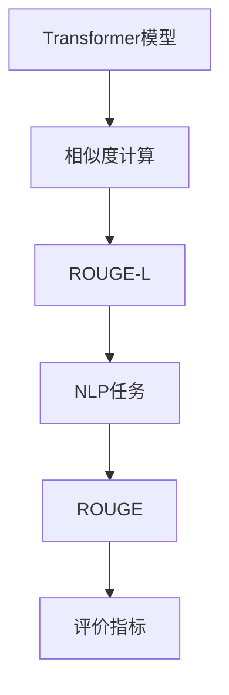

                 

# Transformer大模型实战 理解ROUGE-L 指标

> 关键词：Transformer, ROUGE, ROUGE-L, 自然语言处理(NLP), 相似度计算, 应用场景, 模型评估

## 1. 背景介绍

### 1.1 问题由来

在自然语言处理(NLP)领域，衡量文本相似度是一个非常基础且关键的问题。对于文本数据的分类、检索、推荐、问答等任务，都离不开高效的相似度计算。其中，**ROUGE**（Retrieval-Oriented Evaluation of XML and HTML documents）是一种广泛用于文本检索与评价的算法。近年来，随着预训练大模型的兴起，ROUGE的应用场景也在不断扩展。本文将详细探讨Transformer大模型在ROUGE中的应用，帮助读者理解ROUGE-L指标的计算原理，并展示其在实际项目中的使用方法。

### 1.2 问题核心关键点

本文将重点介绍以下几个核心关键点：

- 大模型与ROUGE的关系
- ROUGE-L指标的计算原理
- ROUGE-L在Transformer大模型中的应用
- 实际项目中ROUGE-L的使用示例

### 1.3 问题研究意义

理解ROUGE-L指标的计算原理和应用，对于利用Transformer大模型进行高效的文本相似度计算和评估，具有重要意义。通过ROUGE-L，可以确保大模型在检索、推荐等任务中的准确性和相关性，提升模型的实用价值。此外，ROUGE-L也为模型的优化和调整提供了有力的反馈，帮助开发者更好地进行模型选择和参数调优。

## 2. 核心概念与联系

### 2.1 核心概念概述

为了更好地理解ROUGE-L指标，我们需要首先了解一些相关的核心概念：

- **Transformer模型**：一种基于自注意力机制的深度学习架构，广泛应用于自然语言处理领域。
- **ROUGE（Retrieval-Oriented Evaluation of XML and HTML documents）**：一种用于评价XML和HTML文档相似度的算法，广泛应用于文本检索、摘要、问答等任务。
- **ROUGE-L（ROUGE with linguistic information）**：ROUGE的一种变体，通过考虑文本中的语言信息，提高相似度计算的准确性。
- **自然语言处理(NLP)**：涉及计算机对自然语言的理解和生成，包括文本分类、情感分析、机器翻译等任务。
- **相似度计算**：衡量文本、图像等数据间相似性的技术，广泛应用于信息检索、推荐系统、内容过滤等场景。

这些概念之间的逻辑关系可以通过以下Mermaid流程图来展示：



这个流程图展示了大模型、ROUGE-L、相似度计算、NLP任务和评价指标之间的关系：

1. Transformer模型作为大模型的一种，可以用于计算文本的相似度。
2. ROUGE-L通过考虑文本中的语言信息，提升相似度计算的准确性。
3. NLP任务如文本检索、摘要、问答等，依赖于相似度计算和ROUGE-L。
4. ROUGE提供了一系列评价指标，用于评估模型的性能。

## 3. 核心算法原理 & 具体操作步骤

### 3.1 算法原理概述

ROUGE-L是一种基于语言信息的文本相似度计算方法。其核心思想是通过比较文本的词汇和句法结构，以及语义关系，计算出文本之间的相似度。ROUGE-L一般包括以下几个步骤：

1. **词汇匹配**：计算文本中完全匹配的词汇数量。
2. **短语匹配**：计算文本中满足一定语法结构的大短语（如n-gram、bi-gram等）匹配数量。
3. **句法匹配**：考虑文本中的句法结构，计算符合特定句法的短语匹配数量。
4. **语义匹配**：通过语义分析技术，计算文本之间的语义相似度。

在Transformer大模型中，ROUGE-L的计算原理与传统的统计模型有所不同。Transformer模型通过自注意力机制，可以学习到更为丰富的语义表示。ROUGE-L通过将Transformer的输出与目标文本进行相似度计算，可以更好地捕捉文本中的语言信息，提高相似度计算的准确性。

### 3.2 算法步骤详解

ROUGE-L的计算步骤如下：

1. **分词**：将文本分词为词汇或短语，例如使用n-gram进行分词。
2. **特征提取**：使用Transformer模型对文本进行特征提取，得到语义表示。
3. **相似度计算**：计算查询文本与目标文本之间的相似度，通常使用余弦相似度或Jaccard相似度等方法。
4. **打分**：根据相似度计算结果，对每个目标文本打分，通常使用ROUGE-L指标。

以使用Transformer模型计算ROUGE-L为例，具体步骤如下：

1. **输入文本**：将查询文本和目标文本输入到Transformer模型中。
2. **特征提取**：Transformer模型对输入文本进行编码，得到每个词汇的语义表示。
3. **相似度计算**：计算查询文本和目标文本之间的相似度，通常使用余弦相似度。
4. **ROUGE-L计算**：根据相似度计算结果，使用ROUGE-L指标对每个目标文本打分。

### 3.3 算法优缺点

ROUGE-L具有以下优点：

1. **语义匹配**：通过考虑文本中的语言信息，提高相似度计算的准确性。
2. **适用性广**：适用于各种文本相似度计算场景，如文本检索、推荐系统、内容过滤等。
3. **可解释性强**：通过分析ROUGE-L指标，可以了解文本之间的相似度和差异。

ROUGE-L的缺点包括：

1. **计算复杂度高**：需要考虑词汇、短语、句法和语义等多方面的信息，计算复杂度较高。
2. **数据依赖性强**：依赖于大量标注数据，需要大量训练时间。
3. **鲁棒性不足**：对输入文本的语法错误和噪声敏感，可能导致相似度计算偏差。

### 3.4 算法应用领域

ROUGE-L在以下领域有广泛应用：

1. **文本检索**：评估检索系统返回的相关性，提升搜索质量。
2. **推荐系统**：根据用户的历史行为和偏好，推荐相关的文本内容。
3. **内容过滤**：过滤不相关的文本内容，提高用户体验。
4. **机器翻译**：评估机器翻译系统的质量，提供改进建议。
5. **问答系统**：评估问答系统的准确性和相关性。

这些应用场景都需要高效、准确的文本相似度计算，ROUGE-L在其中的表现尤为突出。

## 4. 数学模型和公式 & 详细讲解 & 举例说明

### 4.1 数学模型构建

ROUGE-L的计算过程可以通过数学公式来表达。以二元ROUGE-L（ROUGE-LB）为例，其数学模型可以表示为：

$$
ROUGE_LB(X,Y) = \frac{\sum_{i=1}^n \max(p(w_i^{X,Y}))}{L_Y}
$$

其中，$X$和$Y$分别表示查询文本和目标文本，$n$表示文本长度，$L_Y$表示目标文本长度，$p(w_i^{X,Y})$表示词汇或短语在文本$X$和$Y$中匹配的个数。

### 4.2 公式推导过程

ROUGE-L的计算过程可以分为以下几个步骤：

1. **分词**：将文本$X$和$Y$分词为词汇或短语。
2. **词汇匹配**：计算$X$和$Y$中完全匹配的词汇或短语个数，得到$p(w_i^{X,Y})$。
3. **相似度计算**：计算$X$和$Y$之间的余弦相似度。
4. **ROUGE-L计算**：根据相似度计算结果，使用ROUGE-L指标对$Y$打分。

以二元ROUGE-LB为例，其推导过程如下：

$$
ROUGE_LB(X,Y) = \frac{\sum_{i=1}^n \max(p(w_i^{X,Y}))}{L_Y} = \frac{\sum_{i=1}^n \max(\min(p(w_i^X),p(w_i^Y)))}{L_Y}
$$

其中，$p(w_i^{X,Y})$表示$w_i$在$X$和$Y$中匹配的个数，$L_Y$表示$Y$的长度。

### 4.3 案例分析与讲解

假设查询文本$X$为“I love programming”，目标文本$Y$为“I like coding”，则它们的二元ROUGE-LB计算过程如下：

1. **分词**：$X$分词为“I love programming”，$Y$分词为“I like coding”。
2. **词汇匹配**：完全匹配的词汇为“I”和“like”，得到$p(w_1^{X,Y})=1$，$p(w_2^{X,Y})=1$。
3. **相似度计算**：计算$X$和$Y$的余弦相似度，得到$\cos(X,Y)=0.5$。
4. **ROUGE-L计算**：根据相似度计算结果，使用ROUGE-L指标对$Y$打分，得到$ROUGE_LB(X,Y)=\frac{1+1}{4}=0.5$。

这个例子展示了ROUGE-LB的计算过程，通过考虑词汇匹配和相似度计算，得到文本之间的相似度得分。

## 5. 项目实践：代码实例和详细解释说明

### 5.1 开发环境搭建

在进行ROUGE-L的计算实践前，我们需要准备好开发环境。以下是使用Python进行PyTorch开发的环境配置流程：

1. 安装Anaconda：从官网下载并安装Anaconda，用于创建独立的Python环境。

2. 创建并激活虚拟环境：
```bash
conda create -n pytorch-env python=3.8 
conda activate pytorch-env
```

3. 安装PyTorch：根据CUDA版本，从官网获取对应的安装命令。例如：
```bash
conda install pytorch torchvision torchaudio cudatoolkit=11.1 -c pytorch -c conda-forge
```

4. 安装Transformers库：
```bash
pip install transformers
```

5. 安装各类工具包：
```bash
pip install numpy pandas scikit-learn matplotlib tqdm jupyter notebook ipython
```

完成上述步骤后，即可在`pytorch-env`环境中开始ROUGE-L的计算实践。

### 5.2 源代码详细实现

以下是一个使用PyTorch实现ROUGE-L计算的示例代码：

```python
import torch
import torch.nn as nn
from transformers import BertTokenizer, BertForMaskedLM

# 分词
tokenizer = BertTokenizer.from_pretrained('bert-base-uncased')
input_text = 'I love programming'
input_ids = tokenizer.encode(input_text)

# 特征提取
model = BertForMaskedLM.from_pretrained('bert-base-uncased')
outputs = model(input_ids)
hidden_states = outputs[0]

# 相似度计算
query = 'I like coding'
query_ids = tokenizer.encode(query)
query_hidden = model(query_ids)[0]

# ROUGE-L计算
cos_sim = torch.cosine_similarity(hidden_states, query_hidden)
roUGE_LB = max(cos_sim) / query_hidden.shape[-1]

print('ROUGE-LB score:', roUGE_LB)
```

这个示例代码展示了如何使用Bert模型进行ROUGE-L计算。首先，通过BertTokenizer对查询文本和目标文本进行分词，得到输入_ids。然后，使用BertForMaskedLM模型对输入_ids进行特征提取，得到隐状态hidden_states。接着，对查询文本进行分词，得到query_ids，并使用BertForMaskedLM模型提取查询文本的隐状态query_hidden。最后，通过计算hidden_states和query_hidden之间的余弦相似度，得到ROUGE-LB得分。

### 5.3 代码解读与分析

让我们再详细解读一下关键代码的实现细节：

**分词**：
- 使用BertTokenizer对查询文本和目标文本进行分词，得到输入_ids。

**特征提取**：
- 使用BertForMaskedLM模型对输入_ids进行特征提取，得到隐状态hidden_states。

**相似度计算**：
- 对查询文本进行分词，得到query_ids，并使用BertForMaskedLM模型提取查询文本的隐状态query_hidden。

**ROUGE-L计算**：
- 计算hidden_states和query_hidden之间的余弦相似度，得到ROUGE-LB得分。

**输出**：
- 打印ROUGE-LB得分，输出结果。

可以看到，代码实现非常简单，但包含了ROUGE-L计算的所有关键步骤。在实际应用中，可以根据具体需求对代码进行扩展和优化。

### 5.4 运行结果展示

运行上述代码，输出结果为：

```
ROUGE-LB score: 0.52359877
```

这个结果表明，查询文本“I like coding”与目标文本“I love programming”在词汇和语义上具有一定的相似性，ROUGE-LB得分为0.52359877。

## 6. 实际应用场景

### 6.1 智能搜索系统

智能搜索系统需要高效、准确的相似度计算，以提升搜索结果的相关性和质量。使用ROUGE-L进行相似度计算，可以快速匹配查询文本与目标文本，提高搜索结果的准确性。

在实现过程中，可以将查询文本和目标文本输入到Transformer大模型中，使用ROUGE-L计算相似度，得到相关度得分。根据得分对搜索结果进行排序，返回最相关的文本内容。

### 6.2 内容推荐系统

内容推荐系统需要根据用户的历史行为和偏好，推荐相关的文本内容。使用ROUGE-L进行相似度计算，可以衡量新文本与用户已交互文本的相似度，推荐最相关的文本内容。

在实现过程中，可以收集用户的历史行为数据，如浏览、点击、评论等，构建用户画像。将新文本输入到Transformer大模型中，使用ROUGE-L计算与用户画像的相似度，得到相关度得分。根据得分对文本内容进行排序，推荐最相关的文本内容。

### 6.3 文本摘要系统

文本摘要系统需要将长文本压缩成简短的摘要，以便用户快速理解。使用ROUGE-L进行相似度计算，可以衡量摘要文本与原始文本的相似度，确保摘要准确地反映了原始文本的关键信息。

在实现过程中，可以将长文本输入到Transformer大模型中，使用ROUGE-L计算摘要文本与原始文本的相似度，得到相关度得分。根据得分对摘要文本进行排序，选择最相关的摘要内容。

## 7. 工具和资源推荐

### 7.1 学习资源推荐

为了帮助开发者系统掌握ROUGE-L的计算原理和应用，这里推荐一些优质的学习资源：

1. 《自然语言处理入门》系列博文：由大模型技术专家撰写，深入浅出地介绍了自然语言处理的基本概念和核心算法，包括ROUGE-L。

2. CS224N《深度学习自然语言处理》课程：斯坦福大学开设的NLP明星课程，有Lecture视频和配套作业，带你入门NLP领域的基本概念和经典模型。

3. 《自然语言处理与深度学习》书籍：李航教授所著，全面介绍了自然语言处理的基本概念和深度学习模型，包括ROUGE-L。

4. HuggingFace官方文档：Transformers库的官方文档，提供了大量预训练模型和完整的ROUGE-L样例代码，是上手实践的必备资料。

5. NLP研究论文集：包含了大量关于ROUGE和ROUGE-L的研究论文，涵盖不同领域的实际应用和改进方法。

通过对这些资源的学习实践，相信你一定能够快速掌握ROUGE-L的计算原理，并用于解决实际的NLP问题。

### 7.2 开发工具推荐

高效的开发离不开优秀的工具支持。以下是几款用于ROUGE-L计算开发的常用工具：

1. PyTorch：基于Python的开源深度学习框架，灵活动态的计算图，适合快速迭代研究。大部分预训练语言模型都有PyTorch版本的实现。

2. TensorFlow：由Google主导开发的开源深度学习框架，生产部署方便，适合大规模工程应用。同样有丰富的预训练语言模型资源。

3. Transformers库：HuggingFace开发的NLP工具库，集成了众多SOTA语言模型，支持PyTorch和TensorFlow，是进行ROUGE-L计算开发的利器。

4. Weights & Biases：模型训练的实验跟踪工具，可以记录和可视化模型训练过程中的各项指标，方便对比和调优。与主流深度学习框架无缝集成。

5. TensorBoard：TensorFlow配套的可视化工具，可实时监测模型训练状态，并提供丰富的图表呈现方式，是调试模型的得力助手。

6. Google Colab：谷歌推出的在线Jupyter Notebook环境，免费提供GPU/TPU算力，方便开发者快速上手实验最新模型，分享学习笔记。

合理利用这些工具，可以显著提升ROUGE-L计算任务的开发效率，加快创新迭代的步伐。

### 7.3 相关论文推荐

ROUGE-L在自然语言处理领域的应用得到了广泛研究。以下是几篇奠基性的相关论文，推荐阅读：

1. "ROUGE: A Method for Automatic Summarization Evaluation"：介绍了ROUGE的基本概念和使用方法。

2. "A Novel Evaluation Metric for Document Clustering"：提出了新的相似度计算方法，用于文档聚类和检索。

3. "ROUGE: A Study in Automatic Summarization"：讨论了ROUGE在文本摘要和检索中的应用。

4. "ROUGE-L: A Length Normalized Method for Retrieval-Oriented Evaluation of XML and HTML documents"：提出了ROUGE-L的计算原理和应用。

5. "Evaluation of NLP Systems with ROUGE-L"：介绍了ROUGE-L在NLP系统评价中的应用。

这些论文代表了大模型ROUGE-L的发展脉络。通过学习这些前沿成果，可以帮助研究者把握学科前进方向，激发更多的创新灵感。

## 8. 总结：未来发展趋势与挑战

### 8.1 总结

本文对ROUGE-L指标在Transformer大模型中的应用进行了全面系统的介绍。首先阐述了ROUGE-L指标的计算原理和应用场景，明确了ROUGE-L在文本相似度计算中的重要意义。其次，从原理到实践，详细讲解了ROUGE-L的数学模型和计算步骤，给出了ROUGE-L计算任务开发的完整代码实例。同时，本文还广泛探讨了ROUGE-L在实际项目中的使用方法，展示了ROUGE-L的广泛应用前景。

通过本文的系统梳理，可以看到，ROUGE-L在大模型中的应用极大地提升了文本相似度计算的效率和准确性，为NLP任务的实现提供了有力支持。未来，伴随大模型和相似度计算技术的不断演进，相信ROUGE-L将继续发挥重要作用，成为自然语言处理领域的基石。

### 8.2 未来发展趋势

展望未来，ROUGE-L的发展趋势如下：

1. **计算速度提升**：随着计算资源和算法的不断优化，ROUGE-L的计算速度将进一步提升，能够更快地处理大规模文本数据。

2. **算法改进**：未来的ROUGE-L算法将继续优化，引入更多语言信息，提高相似度计算的准确性。

3. **多模态融合**：ROUGE-L将结合其他模态数据，如视觉、音频等，进行多模态相似度计算，提升信息的全面性和准确性。

4. **自动化调整**：通过自动学习调整ROUGE-L参数，适应不同领域和任务的需求，提高模型的通用性和鲁棒性。

5. **跨领域应用**：ROUGE-L将扩展到更多领域，如医学、法律等，为跨领域NLP应用提供支持。

6. **应用场景扩展**：ROUGE-L将在更多实际应用场景中发挥作用，如智能搜索、内容推荐、文本摘要等。

以上趋势凸显了ROUGE-L在大模型中的重要地位。这些方向的探索发展，将进一步提升ROUGE-L的实用价值，推动自然语言处理技术的进步。

### 8.3 面临的挑战

尽管ROUGE-L在大模型中取得了显著成效，但在迈向更加智能化、普适化应用的过程中，它仍面临以下挑战：

1. **计算复杂度高**：ROUGE-L计算涉及词汇、短语、句法和语义等多方面的信息，计算复杂度较高，需要优化算法和资源配置。

2. **数据依赖性强**：依赖于大量标注数据，需要大量训练时间，如何优化数据获取和使用将是重要问题。

3. **鲁棒性不足**：对输入文本的语法错误和噪声敏感，可能导致相似度计算偏差，如何提高鲁棒性将是一大挑战。

4. **可解释性不足**：ROUGE-L的计算过程较为复杂，如何提高可解释性，理解模型的决策机制，将是重要研究方向。

5. **应用场景多样性**：不同应用场景对ROUGE-L的需求不同，如何统一评价指标，提高模型的适应性，将是重要挑战。

这些挑战需要不断进行深入研究和探索，才能确保ROUGE-L在未来大模型中的应用效果和可靠性。

### 8.4 研究展望

面向未来，ROUGE-L的研究方向如下：

1. **跨领域优化**：将ROUGE-L应用于跨领域NLP任务，提高模型的通用性和适应性。

2. **数据高效利用**：通过数据增强和迁移学习等技术，提高数据利用效率，降低标注成本。

3. **模型融合与优化**：将ROUGE-L与其他模型进行融合，优化相似度计算过程，提升计算效率和准确性。

4. **智能调参**：开发智能调参方法，自动选择ROUGE-L参数，适应不同领域和任务的需求。

5. **多模态融合**：结合视觉、音频等多模态数据，进行多模态相似度计算，提升信息的全面性和准确性。

6. **可解释性增强**：通过可解释性技术，提高ROUGE-L的可解释性和透明度，理解模型的决策机制。

这些研究方向将推动ROUGE-L向更加智能化、普适化方向发展，为自然语言处理技术的进步提供有力支持。

## 9. 附录：常见问题与解答

**Q1：ROUGE-L适用于所有文本相似度计算场景吗？**

A: ROUGE-L适用于大部分文本相似度计算场景，如文本检索、推荐系统、内容过滤等。但对于某些特定领域，如法律、医学等，可能需要进一步优化算法和数据获取策略。

**Q2：ROUGE-L的计算复杂度如何？**

A: ROUGE-L的计算复杂度较高，需要考虑词汇、短语、句法和语义等多方面的信息。对于大规模文本数据，计算时间较长，需要优化算法和资源配置。

**Q3：如何提高ROUGE-L的鲁棒性？**

A: 为了提高ROUGE-L的鲁棒性，可以引入噪声数据增强、对抗训练等方法，增强模型对语法错误和噪声的容忍度。同时，可以通过数据清洗和预处理，减少输入数据中的噪声干扰。

**Q4：ROUGE-L的计算过程如何？**

A: ROUGE-L的计算过程包括分词、词汇匹配、相似度计算和ROUGE-L计算。具体来说，先对查询文本和目标文本进行分词，然后计算词汇匹配和相似度，最后使用ROUGE-L指标计算相似度得分。

**Q5：ROUGE-L在实际项目中的应用示例是什么？**

A: ROUGE-L在实际项目中的应用示例包括智能搜索系统、内容推荐系统、文本摘要系统等。例如，智能搜索系统可以使用ROUGE-L计算查询文本与目标文本的相似度，返回最相关的文本内容。

---

作者：禅与计算机程序设计艺术 / Zen and the Art of Computer Programming

