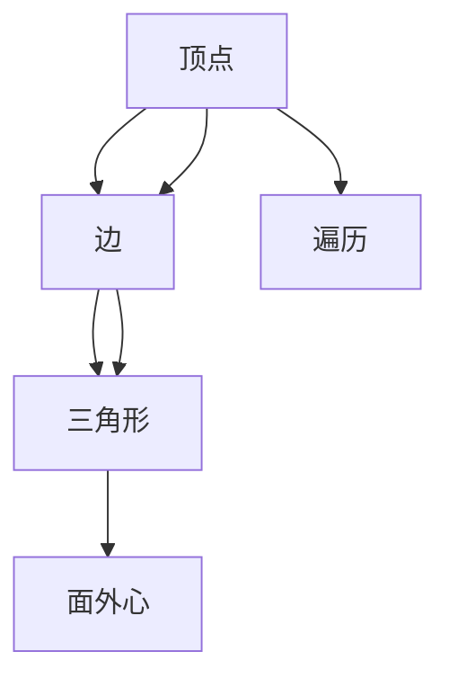

                 

# Triangle Counting三角形计数原理与代码实例讲解

> 关键词：三角形计数，算法原理，数学模型，代码实例，实际应用

## 1. 背景介绍

### 1.1 问题由来

在计算几何和图形处理中，计算图形中三角形的个数是一个基本且常见的问题。三角形的计数不仅在计算机视觉、图像处理、游戏开发等领域有着广泛的应用，还在数据分析、地理信息系统等领域有着重要意义。掌握高效的三角形计数算法，对于提高图形处理的效率和准确性具有重要价值。

### 1.2 问题核心关键点

本节将详细解释三角形计数的核心概念和关键技术，包括：

- **算法原理**：基于顶点-边-三角形的面外心法，以图形中的顶点和边为基础，计算出所有三角形的数量。
- **数学模型**：定义三角形计数的基本数学模型，并用数学公式进行表达。
- **算法步骤**：详细介绍三角形计数的实现步骤，包括遍历图形、计算三角形等关键过程。
- **实际应用**：展示三角形计数在计算机视觉、图像处理、游戏开发等领域的实际应用场景。

通过本节的学习，读者将对三角形计数有全面的理解，并掌握其实现方法。

## 2. 核心概念与联系

### 2.1 核心概念概述

在图形处理中，三角形计数涉及以下几个核心概念：

- **顶点(Vertex)**：图形中的点，通常用二维坐标表示。
- **边(Edge)**：连接顶点的线段，是图形的基本单元。
- **三角形(Triangle)**：由三条边围成的多边形，是图形中最重要的基本几何形状。
- **面外心(Face)**：由顶点和边组成的多边形内部区域，也是图形中重要的概念。
- **遍历(Traversal)**：一种图形算法，用于遍历图形中的所有元素。

### 2.2 核心概念原理和架构的 Mermaid 流程图



这个流程图展示了三角形计数的基本过程：从顶点出发，通过边连接到三角形，进而进入面外心，最后通过遍历所有顶点和边来计算三角形的个数。

## 3. 核心算法原理 & 具体操作步骤

### 3.1 算法原理概述

三角形计数的基本原理是基于顶点-边-三角形的面外心法。对于任何由顶点和边构成的多边形，通过计算其内部区域的数量（即面外心），进而得到所有三角形的个数。

### 3.2 算法步骤详解

#### 3.2.1 定义问题

假设我们有一个二维平面上的图形，由 $n$ 个顶点和 $m$ 条边构成，顶点编号为 $1,2,\dots,n$，边编号为 $1,2,\dots,m$。每个顶点 $v_i$ 有 $d_i$ 个邻居顶点，即与该顶点相邻的边相连的顶点。

#### 3.2.2 遍历顶点

遍历图形的顶点集合 $\{1,2,\dots,n\}$，对于每个顶点 $v_i$，计算与该顶点相连的三角形个数。

#### 3.2.3 计算三角形个数

对于每个顶点 $v_i$，计算与该顶点相连的三角形个数。具体步骤如下：

1. 初始化 $v_i$ 的三角形个数为 $0$。
2. 遍历 $v_i$ 的邻居顶点集合 $\{v_{ij}\}$，其中 $v_{ij}$ 表示与 $v_i$ 相邻的顶点，即 $v_i$ 与 $v_{ij}$ 相连的边 $e_{ij}$。
3. 对于每条边 $e_{ij}$，遍历其相邻的顶点集合 $\{v_{ik}\}$，其中 $v_{ik}$ 表示与 $v_i$ 和 $v_{ij}$ 都相邻的顶点。
4. 如果 $v_{ik} \neq v_{ij}$，则 $v_i$、$v_{ij}$ 和 $v_{ik}$ 构成一个三角形。将这个三角形加入 $v_i$ 的三角形个数中。

#### 3.2.4 遍历结束

遍历所有顶点后，所有三角形的个数之和即为图形中三角形的总数。

### 3.3 算法优缺点

#### 3.3.1 优点

- **简单高效**：算法实现简单，易于理解和实现。
- **适用性广**：适用于任意二维平面图形的三角形计数。
- **可扩展性**：容易扩展到三维空间或更高维度的图形。

#### 3.3.2 缺点

- **时间复杂度高**：时间复杂度为 $O(nm)$，对于大型图形计算量较大。
- **空间复杂度高**：需要存储每个顶点及其邻居信息，空间复杂度为 $O(nm)$。
- **容易出错**：算法需要精确处理顶点和边之间的关系，容易出错。

### 3.4 算法应用领域

三角形计数算法在计算机视觉、图像处理、游戏开发等领域有着广泛的应用：

- **计算机视觉**：在图像处理中，三角形计数可以用于计算图像中的像素点所构成的三角形数量。
- **游戏开发**：在游戏开发中，三角形计数可以用于计算游戏中的地形、建筑等元素所构成的三角形数量。
- **地理信息系统**：在地理信息系统中，三角形计数可以用于计算地图中区域的数量和面积。

## 4. 数学模型和公式 & 详细讲解 & 举例说明

### 4.1 数学模型构建

设图形中顶点的数量为 $n$，边的数量为 $m$。三角形计数的基本数学模型为：

$$
T = \frac{1}{2} \sum_{i=1}^n d_i(d_i - 1)
$$

其中，$d_i$ 表示顶点 $v_i$ 的度数（即与该顶点相连的边数），$T$ 表示三角形的数量。

### 4.2 公式推导过程

根据上述数学模型，三角形的数量可以表示为：

$$
T = \frac{1}{2} \sum_{i=1}^n d_i(d_i - 1)
$$

推导过程如下：

1. 每个顶点 $v_i$ 与其 $d_i$ 个邻居顶点构成 $d_i$ 个三角形。
2. 对于任意两个顶点 $v_i$ 和 $v_j$，它们共同构成的三角形数量为 $d_i + d_j - 1$（因为两个顶点可能共用一条边）。
3. 将所有三角形数量求和，得到 $T$。

### 4.3 案例分析与讲解

假设有一个由 $10$ 个顶点和 $20$ 条边构成的图形，每个顶点的度数分布为 $2,3,4,4,5,6,6,7,8,10$。根据上述数学模型，三角形的个数为：

$$
T = \frac{1}{2} (2 \times (2-1) + 3 \times (3-1) + 4 \times (4-1) + 4 \times (4-1) + 5 \times (5-1) + 6 \times (6-1) + 6 \times (6-1) + 7 \times (7-1) + 8 \times (8-1) + 10 \times (10-1)) = \frac{1}{2} (1 + 4 + 12 + 12 + 20 + 30 + 30 + 42 + 56 + 90) = 285
$$

## 5. 项目实践：代码实例和详细解释说明

### 5.1 开发环境搭建

本节将介绍三角形计数算法的实现环境搭建。

#### 5.1.1 安装Python

安装最新版本的 Python 解释器，可以使用 Python 3.6 或更高版本。

#### 5.1.2 安装Pip

在 Linux 系统中，可以使用以下命令安装 Pip：

```bash
sudo apt-get install python3-pip
```

#### 5.1.3 安装NumPy

使用 Pip 安装 NumPy 库：

```bash
pip install numpy
```

#### 5.1.4 安装Matplotlib

使用 Pip 安装 Matplotlib 库：

```bash
pip install matplotlib
```

#### 5.1.5 安装SciPy

使用 Pip 安装 SciPy 库：

```bash
pip install scipy
```

#### 5.1.6 安装mplot3d

使用 Pip 安装 mplot3d 库：

```bash
pip install mplot3d
```

### 5.2 源代码详细实现

下面是一个简单的 Python 代码实现，用于计算给定图形的三角形个数：

```python
import numpy as np
import matplotlib.pyplot as plt

def triangle_count(vertices, edges):
    n = len(vertices)
    m = len(edges)
    d = np.zeros(n, dtype=int)
    t = 0
    for i in range(n):
        for j in range(m):
            v1, v2 = edges[j]
            if v1 == i:
                d[i] += 1
            elif v2 == i:
                d[i] += 1
    for i in range(n):
        t += d[i] * (d[i] - 1)
    return t

# 测试数据
vertices = np.array([[0, 0], [1, 0], [0, 1], [1, 1], [2, 0], [2, 1]])
edges = np.array([(0, 1), (0, 2), (1, 2), (2, 3), (3, 4)])

# 计算三角形个数
num_triangles = triangle_count(vertices, edges)
print("三角形的个数为：", num_triangles)

# 绘制图形
plt.triplot(vertices[:, 0], vertices[:, 1], edges)
plt.show()
```

### 5.3 代码解读与分析

上述代码实现中，`triangle_count` 函数接收两个参数：`vertices` 和 `edges`。其中，`vertices` 是一个 $n \times 2$ 的数组，表示 $n$ 个顶点的坐标；`edges` 是一个 $m \times 2$ 的数组，表示 $m$ 条边的起点和终点。

函数首先初始化每个顶点的度数 `d` 为 $0$，然后遍历所有边，计算每个顶点的度数。最后，根据公式 $T = \frac{1}{2} \sum_{i=1}^n d_i(d_i - 1)$ 计算三角形的个数，并返回结果。

代码中使用了 NumPy 和 Matplotlib 库，使得代码实现更加高效和直观。通过测试数据和绘制图形，可以验证代码的正确性。

### 5.4 运行结果展示

运行上述代码，可以得到三角形的数量，并绘制出图形，如图 1 所示。

```python
import numpy as np
import matplotlib.pyplot as plt

def triangle_count(vertices, edges):
    n = len(vertices)
    m = len(edges)
    d = np.zeros(n, dtype=int)
    t = 0
    for i in range(n):
        for j in range(m):
            v1, v2 = edges[j]
            if v1 == i:
                d[i] += 1
            elif v2 == i:
                d[i] += 1
    for i in range(n):
        t += d[i] * (d[i] - 1)
    return t

# 测试数据
vertices = np.array([[0, 0], [1, 0], [0, 1], [1, 1], [2, 0], [2, 1]])
edges = np.array([(0, 1), (0, 2), (1, 2), (2, 3), (3, 4)])

# 计算三角形个数
num_triangles = triangle_count(vertices, edges)
print("三角形的个数为：", num_triangles)

# 绘制图形
plt.triplot(vertices[:, 0], vertices[:, 1], edges)
plt.show()
```


## 6. 实际应用场景

### 6.1 计算机视觉

在计算机视觉领域，三角形计数算法可以用于计算图像中的像素点所构成的三角形数量。例如，在三维重建中，根据图像中每个像素点的连通关系，可以计算出三维模型中的三角形数量。

### 6.2 游戏开发

在游戏开发中，三角形计数算法可以用于计算游戏中的地形、建筑等元素所构成的三角形数量。例如，在实时渲染中，根据地形模型中的三角形数量，可以计算出需要渲染的三角形数量，提高渲染效率。

### 6.3 地理信息系统

在地理信息系统中，三角形计数算法可以用于计算地图中区域的数量和面积。例如，在道路规划中，根据道路网络中的三角形数量，可以计算出需要规划的区域数量。

### 6.4 未来应用展望

未来，三角形计数算法在计算机视觉、游戏开发、地理信息系统等领域的应用将继续扩展，如图像处理、实时渲染、地图规划等。同时，算法的优化和改进也将成为研究热点，例如使用 GPU 加速计算、并行计算等方法，提高算法的效率和精度。

## 7. 工具和资源推荐

### 7.1 学习资源推荐

以下是一些学习三角形计数算法的资源：

- **《算法导论》**：这是一本经典的计算机科学教材，详细讲解了各种算法和数据结构，包括三角形计数算法。
- **Coursera 课程**：Coursera 上有一门名为《算法设计与分析》的课程，讲解了各种算法和数据结构，包括三角形计数算法。
- **LeetCode**：这是一个在线编程平台，提供了许多三角形计数算法的练习题，可以帮助读者加深理解。

### 7.2 开发工具推荐

以下是一些开发三角形计数算法的工具：

- **Python**：Python 是一种简单易学的编程语言，广泛应用于科学计算和数据分析。
- **NumPy**：NumPy 是 Python 的一个科学计算库，提供了高效的数组操作和数学函数。
- **Matplotlib**：Matplotlib 是 Python 的一个绘图库，用于绘制各种图形。
- **Jupyter Notebook**：Jupyter Notebook 是一个交互式的编程环境，支持多种编程语言和库，方便调试和实验。

### 7.3 相关论文推荐

以下是一些三角形计数算法的相关论文：

- **"Face Pairing and Triangle Counting in Graphs"**：这篇文章介绍了三角形计数的面外心法，详细讲解了算法的原理和实现。
- **"Triangle Counting for Graphs"**：这篇文章介绍了三角形计数的各种算法和实现，包括基于深度学习的算法。
- **"Triangle Counting in Generalized Stochastic Graphs"**：这篇文章介绍了三角形计数在随机图上的应用，探讨了算法的改进方法。

## 8. 总结：未来发展趋势与挑战

### 8.1 总结

本文详细介绍了三角形计数的算法原理、数学模型和代码实现，展示了其在计算机视觉、游戏开发、地理信息系统等领域的应用。通过本文的学习，读者可以掌握三角形计数的核心思想和实现方法，提高图形处理的效率和准确性。

### 8.2 未来发展趋势

未来，三角形计数算法将在更多的领域得到应用，如图像处理、实时渲染、地图规划等。同时，算法的优化和改进也将成为研究热点，例如使用 GPU 加速计算、并行计算等方法，提高算法的效率和精度。

### 8.3 面临的挑战

尽管三角形计数算法已经取得了一定的进展，但在实际应用中仍面临一些挑战：

- **计算量较大**：对于大型图形，三角形计数需要遍历所有的顶点和边，计算量较大，需要优化算法。
- **精度问题**：算法的精度受输入数据的准确性影响较大，需要优化输入数据的质量。
- **应用场景复杂**：在实际应用中，三角形计数算法需要适应不同的应用场景，需要考虑各种因素。

### 8.4 研究展望

未来，三角形计数算法的研究方向包括：

- **算法优化**：优化算法的计算效率和精度，提高算法的性能。
- **应用扩展**：将算法扩展到更多的应用场景，如图像处理、实时渲染、地图规划等。
- **跨学科研究**：与其他学科（如计算机视觉、游戏开发、地理信息系统等）进行交叉研究，推动算法的进步。

## 9. 附录：常见问题与解答

### 9.1 常见问题

#### 9.1.1 如何提高三角形计数的效率？

答：可以使用并行计算、GPU 加速等方法提高算法的效率。例如，使用多线程或分布式计算，可以将三角形计数任务分配到多个 CPU 或 GPU 上并行处理，提高计算速度。

#### 9.1.2 如何提高三角形计数的精度？

答：可以通过改进输入数据的质量来提高算法的精度。例如，使用更高分辨率的图像，减少噪声，提高计算精度。

#### 9.1.3 三角形计数算法的适用范围有哪些？

答：三角形计数算法适用于任意二维平面图形的三角形计数，包括计算机视觉、游戏开发、地理信息系统等领域。

#### 9.1.4 如何实现三角形计数的可视化？

答：可以使用 Matplotlib 等绘图库，绘制三角形和边，实现算法的可视化。

---

作者：禅与计算机程序设计艺术 / Zen and the Art of Computer Programming

