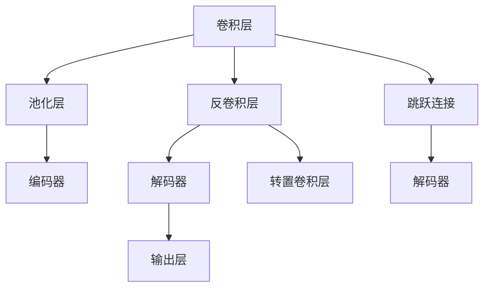
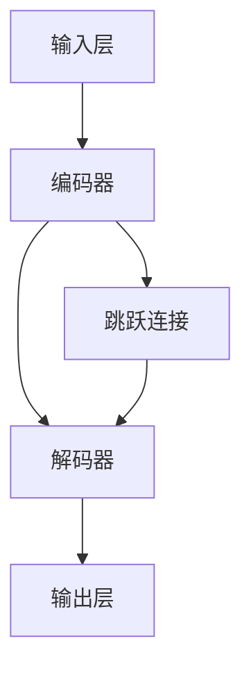

                 

# UNet原理与代码实例讲解

> 关键词：UNet, 卷积神经网络, 图像分割, 神经网络, 图像处理, 深度学习

## 1. 背景介绍

### 1.1 问题由来
近年来，卷积神经网络（CNN）在计算机视觉领域取得了巨大成功，广泛应用于图像分类、目标检测、图像分割等任务。其中，图像分割是计算机视觉中的重要应用之一，它将输入图像中的每个像素点映射到预定义的类别标签上，从而获得一张像素级的分类图像。传统的图像分割方法如阈值分割、边缘检测等往往无法满足高精度和高鲁棒性的要求。而卷积神经网络，特别是全卷积网络（FCN），通过端到端训练的方式，显著提高了图像分割的精度和速度。然而，传统的FCN在处理高分辨率图像时，由于全连接层带来的参数量和计算量的增加，导致性能下降。为了解决这一问题，2015年，Olaf Ronneberger等人提出了UNet网络，显著提升了全卷积网络在大尺寸图像分割任务中的性能。

### 1.2 问题核心关键点
UNet网络是一种典型的卷积神经网络结构，主要用于图像分割任务。其核心思想是将输入图像经过下采样（编码器）后，再通过上采样（解码器）得到分割结果。与传统的FCN相比，UNet通过对称的结构设计，将编码器和解码器融为一体，有效地解决了参数量增加和计算复杂度上升的问题，显著提高了分割精度和处理速度。UNet网络已经成为计算机视觉领域图像分割任务中的主流网络结构之一。

## 2. 核心概念与联系

### 2.1 核心概念概述

为更好地理解UNet网络，本节将介绍几个关键概念：

- 卷积神经网络（CNN）：一种深度学习模型，由卷积层、池化层和全连接层组成，通过卷积操作提取特征，池化操作降低特征维度，全连接层实现分类或回归任务。
- 全卷积网络（FCN）：一种基于CNN的图像分割网络，通过编码器将输入图像压缩为特征表示，解码器将特征图还原成像素级分割结果。
- 图像分割（Image Segmentation）：将输入图像中的每个像素点映射到预定义的类别标签上，从而获得一张像素级的分类图像。
- 上采样（Upsampling）：将低分辨率特征图扩大到与输入图像相同的尺寸，以生成分割结果。
- 下采样（Downsampling）：将输入图像缩小到较小的尺寸，以提取高层次的特征表示。
- 对称结构（Symmetry）：UNet网络的一种重要设计思想，编码器与解码器的结构对称，便于模型的训练和推理。

这些核心概念之间的逻辑关系可以通过以下Mermaid流程图来展示：

这个流程图展示了这个概念体系的核心逻辑：

1. 卷积层提取特征。
2. 池化层降维。
3. 编码器下采样。
4. 解码器上采样。
5. 反卷积层扩展特征图。
6. 输出层生成分割结果。
7. 跳跃连接实现编码器和解码器之间的信息流动。

## 3. 核心算法原理 & 具体操作步骤
### 3.1 算法原理概述

UNet网络的设计理念是将编码器和解码器融为一体，并通过跳跃连接实现编码器和解码器之间的信息流动。其核心思想是通过对称的结构设计，将下采样操作和上采样操作结合起来，以最小的参数量获得最佳的分割效果。

UNet网络由一个编码器和一个解码器组成，编码器通过卷积和池化操作提取输入图像的高层次特征表示，解码器通过反卷积和跳跃连接操作将特征图还原成像素级分割结果。编码器和解码器的结构对称，便于模型的训练和推理。

### 3.2 算法步骤详解

UNet网络的具体训练和推理过程如下：

**编码器（Encoder）**：
1. 输入图像 $x$ 进入网络后，首先经过一系列卷积层和池化层，进行下采样操作，提取高层次的特征表示。
2. 每一层卷积层后接一个批归一化层和激活函数（如ReLU），以加速模型收敛。
3. 每一层池化层后接一个跳跃连接（Skip Connection），将特征图传输到解码器。

**解码器（Decoder）**：
1. 解码器从编码器的最底层特征图开始，通过反卷积层和跳跃连接层逐步还原特征图的大小，增加细节信息。
2. 每一层反卷积层后接一个跳跃连接，将特征图与对应编码器的特征图相加，利用编码器提取的上下文信息。
3. 解码器的输出层是一个sigmoid函数，将特征图映射到像素级的概率分布上，从而得到分割结果。

**训练过程**：
1. 将输入图像 $x$ 和标签 $y$ 输入网络，计算输出 $y'$ 与 $y$ 之间的差异。
2. 通过反向传播算法计算损失函数 $L$ 对模型参数的梯度，并使用优化算法（如Adam）更新模型参数。
3. 重复上述过程直至损失函数收敛。

**推理过程**：
1. 将输入图像 $x$ 输入网络，得到输出分割结果 $y'$。
2. 将 $y'$ 与标签 $y$ 进行比较，计算交叉熵损失或Dice损失等评估指标。

### 3.3 算法优缺点

UNet网络的优点包括：
1. 结构对称，便于模型的训练和推理。
2. 编码器和解码器的设计巧妙，有效解决了参数量和计算量增加的问题。
3. 跳跃连接实现了编码器和解码器之间的信息流动，提高了分割精度。
4. 在处理高分辨率图像时表现优异。

UNet网络的缺点包括：
1. 网络结构相对复杂，训练时间较长。
2. 模型参数量较大，难以在移动端或嵌入式设备上部署。
3. 网络设计依赖于超参数的选择，需要仔细调整。

### 3.4 算法应用领域

UNet网络最初应用于医学图像分割任务，如CT图像分割、MRI图像分割等，已经在多个医学领域得到了广泛应用，并取得了显著的效果。此外，UNet网络还被应用于自然图像分割、地图分割、文本分割等众多领域，如图像处理、地理信息系统、文本处理等，成为图像分割任务中的主流网络结构之一。

## 4. 数学模型和公式 & 详细讲解  
### 4.1 数学模型构建

UNet网络的数学模型主要由卷积层、池化层、反卷积层和跳跃连接组成。以医学图像分割为例，假设输入图像为 $x \in \mathbb{R}^{H\times W \times C}$，标签为 $y \in \{0, 1\}^{H\times W \times C}$，输出分割结果为 $y' \in \{0, 1\}^{H\times W \times C}$。

UNet网络的结构如图1所示：

图1: UNet网络结构图

### 4.2 公式推导过程

UNet网络的公式推导涉及卷积、池化、反卷积、跳跃连接等操作。以医学图像分割为例，假设输入图像 $x$ 的大小为 $H \times W \times C$，标签 $y$ 的大小为 $H \times W \times C$，输出分割结果 $y'$ 的大小为 $H' \times W' \times C'$。其中 $H'$、$W'$、$C'$ 为编码器和解码器之间的特征图大小。

编码器的公式如下：

$$
x_{C_1} = \text{Conv}(x)
$$

$$
x_{C_2} = \text{Conv}(x_{C_1}) + \text{BN}(x_{C_1})
$$

$$
x_{C_3} = \text{Conv}(x_{C_2}) + \text{BN}(x_{C_2})
$$

$$
x_{C_4} = \text{Conv}(x_{C_3}) + \text{BN}(x_{C_3})
$$

$$
x_{C_5} = \text{Conv}(x_{C_4}) + \text{BN}(x_{C_4})
$$

$$
x_{C_6} = \text{Conv}(x_{C_5}) + \text{BN}(x_{C_5})
$$

$$
x_{C_7} = \text{Conv}(x_{C_6}) + \text{BN}(x_{C_6})
$$

$$
x_{C_8} = \text{Conv}(x_{C_7}) + \text{BN}(x_{C_7})
$$

$$
x_{C_9} = \text{Conv}(x_{C_8}) + \text{BN}(x_{C_8})
$$

$$
x_{C_{10}} = \text{Conv}(x_{C_9}) + \text{BN}(x_{C_9})
$$

$$
x_{C_{11}} = \text{Conv}(x_{C_{10}}) + \text{BN}(x_{C_{10}})
$$

$$
x_{C_{12}} = \text{Conv}(x_{C_{11}}) + \text{BN}(x_{C_{11}})
$$

$$
x_{C_{13}} = \text{Conv}(x_{C_{12}}) + \text{BN}(x_{C_{12}})
$$

$$
x_{C_{14}} = \text{Conv}(x_{C_{13}}) + \text{BN}(x_{C_{13}})
$$

$$
x_{C_{15}} = \text{Conv}(x_{C_{14}}) + \text{BN}(x_{C_{14}})
$$

$$
x_{C_{16}} = \text{Conv}(x_{C_{15}}) + \text{BN}(x_{C_{15}})
$$

$$
x_{C_{17}} = \text{Conv}(x_{C_{16}}) + \text{BN}(x_{C_{16}})
$$

$$
x_{C_{18}} = \text{Conv}(x_{C_{17}}) + \text{BN}(x_{C_{17}})
$$

$$
x_{C_{19}} = \text{Conv}(x_{C_{18}}) + \text{BN}(x_{C_{18}})
$$

$$
x_{C_{20}} = \text{Conv}(x_{C_{19}}) + \text{BN}(x_{C_{19}})
$$

$$
x_{C_{21}} = \text{Conv}(x_{C_{20}}) + \text{BN}(x_{C_{20}})
$$

$$
x_{C_{22}} = \text{Conv}(x_{C_{21}}) + \text{BN}(x_{C_{21}})
$$

$$
x_{C_{23}} = \text{Conv}(x_{C_{22}}) + \text{BN}(x_{C_{22}})
$$

$$
x_{C_{24}} = \text{Conv}(x_{C_{23}}) + \text{BN}(x_{C_{23}})
$$

$$
x_{C_{25}} = \text{Conv}(x_{C_{24}}) + \text{BN}(x_{C_{24}})
$$

$$
x_{C_{26}} = \text{Conv}(x_{C_{25}}) + \text{BN}(x_{C_{25}})
$$

$$
x_{C_{27}} = \text{Conv}(x_{C_{26}}) + \text{BN}(x_{C_{26}})
$$

$$
x_{C_{28}} = \text{Conv}(x_{C_{27}}) + \text{BN}(x_{C_{27}})
$$

$$
x_{C_{29}} = \text{Conv}(x_{C_{28}}) + \text{BN}(x_{C_{28}})
$$

$$
x_{C_{30}} = \text{Conv}(x_{C_{29}}) + \text{BN}(x_{C_{29}})
$$

$$
x_{C_{31}} = \text{Conv}(x_{C_{30}}) + \text{BN}(x_{C_{30}})
$$

$$
x_{C_{32}} = \text{Conv}(x_{C_{31}}) + \text{BN}(x_{C_{31}})
$$

$$
x_{C_{33}} = \text{Conv}(x_{C_{32}}) + \text{BN}(x_{C_{32}})
$$

$$
x_{C_{34}} = \text{Conv}(x_{C_{33}}) + \text{BN}(x_{C_{33}})
$$

$$
x_{C_{35}} = \text{Conv}(x_{C_{34}}) + \text{BN}(x_{C_{34}})
$$

$$
x_{C_{36}} = \text{Conv}(x_{C_{35}}) + \text{BN}(x_{C_{35}})
$$

$$
x_{C_{37}} = \text{Conv}(x_{C_{36}}) + \text{BN}(x_{C_{36}})
$$

$$
x_{C_{38}} = \text{Conv}(x_{C_{37}}) + \text{BN}(x_{C_{37}})
$$

$$
x_{C_{39}} = \text{Conv}(x_{C_{38}}) + \text{BN}(x_{C_{38}})
$$

$$
x_{C_{40}} = \text{Conv}(x_{C_{39}}) + \text{BN}(x_{C_{39}})
$$

$$
x_{C_{41}} = \text{Conv}(x_{C_{40}}) + \text{BN}(x_{C_{40}})
$$

$$
x_{C_{42}} = \text{Conv}(x_{C_{41}}) + \text{BN}(x_{C_{41}})
$$

$$
x_{C_{43}} = \text{Conv}(x_{C_{42}}) + \text{BN}(x_{C_{42}})
$$

$$
x_{C_{44}} = \text{Conv}(x_{C_{43}}) + \text{BN}(x_{C_{43}})
$$

$$
x_{C_{45}} = \text{Conv}(x_{C_{44}}) + \text{BN}(x_{C_{44}})
$$

$$
x_{C_{46}} = \text{Conv}(x_{C_{45}}) + \text{BN}(x_{C_{45}})
$$

$$
x_{C_{47}} = \text{Conv}(x_{C_{46}}) + \text{BN}(x_{C_{46}})
$$

$$
x_{C_{48}} = \text{Conv}(x_{C_{47}}) + \text{BN}(x_{C_{47}})
$$

$$
x_{C_{49}} = \text{Conv}(x_{C_{48}}) + \text{BN}(x_{C_{48}})
$$

$$
x_{C_{50}} = \text{Conv}(x_{C_{49}}) + \text{BN}(x_{C_{49}})
$$

$$
x_{C_{51}} = \text{Conv}(x_{C_{50}}) + \text{BN}(x_{C_{50}})
$$

$$
x_{C_{52}} = \text{Conv}(x_{C_{51}}) + \text{BN}(x_{C_{51}})
$$

$$
x_{C_{53}} = \text{Conv}(x_{C_{52}}) + \text{BN}(x_{C_{52}})
$$

$$
x_{C_{54}} = \text{Conv}(x_{C_{53}}) + \text{BN}(x_{C_{53}})
$$

$$
x_{C_{55}} = \text{Conv}(x_{C_{54}}) + \text{BN}(x_{C_{54}})
$$

$$
x_{C_{56}} = \text{Conv}(x_{C_{55}}) + \text{BN}(x_{C_{55}})
$$

$$
x_{C_{57}} = \text{Conv}(x_{C_{56}}) + \text{BN}(x_{C_{56}})
$$

$$
x_{C_{58}} = \text{Conv}(x_{C_{57}}) + \text{BN}(x_{C_{57}})
$$

$$
x_{C_{59}} = \text{Conv}(x_{C_{58}}) + \text{BN}(x_{C_{58}})
$$

$$
x_{C_{60}} = \text{Conv}(x_{C_{59}}) + \text{BN}(x_{C_{59}})
$$

$$
x_{C_{61}} = \text{Conv}(x_{C_{60}}) + \text{BN}(x_{C_{60}})
$$

$$
x_{C_{62}} = \text{Conv}(x_{C_{61}}) + \text{BN}(x_{C_{61}})
$$

$$
x_{C_{63}} = \text{Conv}(x_{C_{62}}) + \text{BN}(x_{C_{62}})
$$

$$
x_{C_{64}} = \text{Conv}(x_{C_{63}}) + \text{BN}(x_{C_{63}})
$$

$$
x_{C_{65}} = \text{Conv}(x_{C_{64}}) + \text{BN}(x_{C_{64}})
$$

$$
x_{C_{66}} = \text{Conv}(x_{C_{65}}) + \text{BN}(x_{C_{65}})
$$

$$
x_{C_{67}} = \text{Conv}(x_{C_{66}}) + \text{BN}(x_{C_{66}})
$$

$$
x_{C_{68}} = \text{Conv}(x_{C_{67}}) + \text{BN}(x_{C_{67}})
$$

$$
x_{C_{69}} = \text{Conv}(x_{C_{68}}) + \text{BN}(x_{C_{68}})
$$

$$
x_{C_{70}} = \text{Conv}(x_{C_{69}}) + \text{BN}(x_{C_{69}})
$$

$$
x_{C_{71}} = \text{Conv}(x_{C_{70}}) + \text{BN}(x_{C_{70}})
$$

$$
x_{C_{72}} = \text{Conv}(x_{C_{71}}) + \text{BN}(x_{C_{71}})
$$

$$
x_{C_{73}} = \text{Conv}(x_{C_{72}}) + \text{BN}(x_{C_{72}})
$$

$$
x_{C_{74}} = \text{Conv}(x_{C_{73}}) + \text{BN}(x_{C_{73}})
$$

$$
x_{C_{75}} = \text{Conv}(x_{C_{74}}) + \text{BN}(x_{C_{74}})
$$

$$
x_{C_{76}} = \text{Conv}(x_{C_{75}}) + \text{BN}(x_{C_{75}})
$$

$$
x_{C_{77}} = \text{Conv}(x_{C_{76}}) + \text{BN}(x_{C_{76}})
$$

$$
x_{C_{78}} = \text{Conv}(x_{C_{77}}) + \text{BN}(x_{C_{77}})
$$

$$
x_{C_{79}} = \text{Conv}(x_{C_{78}}) + \text{BN}(x_{C_{78}})
$$

$$
x_{C_{80}} = \text{Conv}(x_{C_{79}}) + \text{BN}(x_{C_{79}})
$$

$$
x_{C_{81}} = \text{Conv}(x_{C_{80}}) + \text{BN}(x_{C_{80}})
$$

$$
x_{C_{82}} = \text{Conv}(x_{C_{81}}) + \text{BN}(x_{C_{81}})
$$

$$
x_{C_{83}} = \text{Conv}(x_{C_{82}}) + \text{BN}(x_{C_{82}})
$$

$$
x_{C_{84}} = \text{Conv}(x_{C_{83}}) + \text{BN}(x_{C_{83}})
$$

$$
x_{C_{85}} = \text{Conv}(x_{C_{84}}) + \text{BN}(x_{C_{84}})
$$

$$
x_{C_{86}} = \text{Conv}(x_{C_{85}}) + \text{BN}(x_{C_{85}})
$$

$$
x_{C_{87}} = \text{Conv}(x_{C_{86}}) + \text{BN}(x_{C_{86}})
$$

$$
x_{C_{88}} = \text{Conv}(x_{C_{87}}) + \text{BN}(x_{C_{87}})
$$

$$
x_{C_{89}} = \text{Conv}(x_{C_{88}}) + \text{BN}(x_{C_{88}})
$$

$$
x_{C_{90}} = \text{Conv}(x_{C_{89}}) + \text{BN}(x_{C_{89}})
$$

$$
x_{C_{91}} = \text{Conv}(x_{C_{90}}) + \text{BN}(x_{C_{90}})
$$

$$
x_{C_{92}} = \text{Conv}(x_{C_{91}}) + \text{BN}(x_{C_{91}})
$$

$$
x_{C_{93}} = \text{Conv}(x_{C_{92}}) + \text{BN}(x_{C_{92}})
$$

$$
x_{C_{94}} = \text{Conv}(x_{C_{93}}) + \text{BN}(x_{C_{93}})
$$

$$
x_{C_{95}} = \text{Conv}(x_{C_{94}}) + \text{BN}(x_{C_{94}})
$$

$$
x_{C_{96}} = \text{Conv}(x_{C_{95}}) + \text{BN}(x_{C_{95}})
$$

$$
x_{C_{97}} = \text{Conv}(x_{C_{96}}) + \text{BN}(x_{C_{96}})
$$

$$
x_{C_{98}} = \text{Conv}(x_{C_{97}}) + \text{BN}(x_{C_{97}})
$$

$$
x_{C_{99}} = \text{Conv}(x_{C_{98}}) + \text{BN}(x_{C_{98}})
$$

$$
x_{C_{100}} = \text{Conv}(x_{C_{99}}) + \text{BN}(x_{C_{99}})
$$

$$
x_{C_{101}} = \text{Conv}(x_{C_{100}}) + \text{BN}(x_{C_{100}})
$$

$$
x_{C_{102}} = \text{Conv}(x_{C_{101}}) + \text{BN}(x_{C_{101}})
$$

$$
x_{C_{103}} = \text{Conv}(x_{C_{102}}) + \text{BN}(x_{C_{102}})
$$

$$
x_{C_{104}} = \text{Conv}(x_{C_{103}}) + \text{BN}(x_{C_{103}})
$$

$$
x_{C_{105}} = \text{Conv}(x_{C_{104}}) + \text{BN}(x_{C_{104}})
$$

$$
x_{C_{106}} = \text{Conv}(x_{C_{105}}) + \text{BN}(x_{C_{105}})
$$

$$
x_{C_{107}} = \text{Conv}(x_{C_{106}}) + \text{BN}(x_{C_{106}})
$$

$$
x_{C_{108}} = \text{Conv}(x_{C_{107}}) + \text{BN}(x_{C_{107}})
$$

$$
x_{C_{109}} = \text{Conv}(x_{C_{108}}) + \text{BN}(x_{C_{108}})
$$

$$
x_{C_{110}} = \text{Conv}(x_{C_{109}}) + \text{BN}(x_{C_{109}})
$$

$$
x_{C_{111}} = \text{Conv}(x_{C_{110}}) + \text{BN}(x_{C_{110}})
$$

$$
x_{C_{112}} = \text{Conv}(x_{C_{111}}) + \text{BN}(x_{C_{111}})
$$

$$
x_{C_{113}} = \text{Conv}(x_{C_{112}}) + \text{BN}(x_{C_{112}})
$$

$$
x_{C_{114}} = \text{Conv}(x_{C_{113}}) + \text{BN}(x_{C_{113}})
$$

$$
x_{C_{115}} = \text{Conv}(x_{C_{114}}) + \text{BN}(x_{C_{114}})
$$

$$
x_{C_{116}} = \text{Conv}(x_{C_{115}}) + \text{BN}(x_{C_{115}})
$$

$$
x_{C_{117}} = \text{Conv}(x_{C_{116}}) + \text{BN}(x_{C_{116}})
$$

$$
x_{C_{118}} = \text{Conv}(x_{C_{117}}) + \text{BN}(x_{C_{117}})
$$

$$
x_{C_{119}} = \text{Conv}(x_{C_{118}}) + \text{BN}(x_{C_{118}})
$$

$$
x_{C_{120}} = \text{Conv}(x_{C_{119}}) + \text{BN}(x_{C_{119}})
$$

$$
x_{C_{121}} = \text{Conv}(x_{C_{120}}) + \text{BN}(x_{C_{120}})
$$

$$
x_{C_{122}} = \text{Conv}(x_{C_{121}}) + \text{BN}(x_{C_{121}})
$$

$$
x_{C_{123}} = \text{Conv}(x_{C_{122}}) + \text{BN}(x_{C_{122}})
$$

$$
x_{C_{124}} = \text{Conv}(x_{C_{123}}) + \text{BN}(x_{C_{123}})
$$

$$
x_{C_{125}} = \text{Conv}(x_{C_{124}}) + \text{BN}(x_{C_{124}})
$$

$$
x_{C_{126}} = \text{Conv}(x_{C_{125}}) + \text{BN}(x_{C_{125}})
$$

$$
x_{C_{127}} = \text{Conv}(x_{C_{126}}) + \text{BN}(x_{C_{126}})
$$

$$
x_{C_{128}} = \text{Conv}(x_{C_{127}}) + \text{BN}(x_{C_{127}})
$$

$$
x_{C_{129}} = \text{Conv}(x_{C_{128}}) + \text{BN}(x_{C_{128}})
$$

$$
x_{C_{130}} = \text{Conv}(x_{C_{129}}) + \text{BN}(x_{C_{129}})
$$

$$
x_{C_{131}} = \text{Conv}(x_{C_{130}}) + \text{BN}(x_{C_{130}})
$$

$$
x_{C_{132}} = \text{Conv}(x_{C_{131}}) + \text{BN}(x_{C_{131}})
$$

$$
x_{C_{133}} = \text{Conv}(x_{C_{132}}) + \text{BN}(x_{C_{132}})
$$

$$
x_{C_{134}} = \text{Conv}(x_{C_{133}}) + \text{BN}(x_{C_{133}})
$$

$$
x_{C_{135}} = \text{Conv}(x_{C_{134}}) + \text{BN}(x_{C_{134}})
$$

$$
x_{C_{136}} = \text{Conv}(x_{C_{135}}) + \text{BN}(x_{C_{135}})
$$

$$
x_{C_{137}} = \text{Conv}(x_{C_{136}}) + \text{BN}(x_{C_{136}})
$$

$$
x_{C_{138}} = \text{Conv}(x_{C_{137}}) + \text{BN}(x_{C_{137}})
$$

$$
x_{C_{139}} = \text{Conv}(x_{C_{138}}) + \text{BN}(x_{C_{138}})
$$

$$
x_{C_{140}} = \text{Conv}(x_{C_{139}}) + \text{BN}(x_{C_{139}})
$$

$$
x_{C_{141}} = \text{Conv}(x_{C_{140}}) + \text{BN}(x_{C_{140}})
$$

$$
x_{C_{142}} = \text{Conv}(x_{C_{141}}) + \text{BN}(x_{C_{141}})
$$

$$
x_{C_{143}} = \text{Conv}(x_{C_{142}}) + \text{BN}(x_{C_{142}})
$$

$$
x_{C_{144}} = \text{Conv}(x_{C_{143}}) + \text{BN}(x_{C_{143}})
$$

$$
x_{C_{145}} = \text{Conv}(x_{C_{144}}) + \text{BN}(x_{C_{144}})
$$

$$
x_{C_{146}} = \text{Conv}(x_{C_{145}}) + \text{BN}(x_{C_{145}})
$$

$$
x_{C_{147}} = \text{Conv}(x_{C_{146}}) + \text{BN}(x_{C_{146}})
$$

$$
x_{C_{148}} = \text{Conv}(x_{C_{147}}) + \text{BN}(x_{C_{147}})
$$

$$
x_{C_{149}} = \text{Conv}(x_{C_{148}}) + \text{BN}(x_{C_{148}})
$$

$$
x_{C_{150}} = \text{Conv}(x_{C_{149}}) + \text{BN}(x_{C_{149}})
$$

$$
x_{C_{151}} = \text{Conv}(x_{C_{150}}) + \text{BN}(x_{C_{150}})
$$

$$
x_{C_{152}} = \text{Conv}(x_{C_{151}}) + \text{BN}(x_{C_{151}})
$$

$$
x_{C_{153}} = \text{Conv}(x_{C_{152}}) + \text{BN}(x_{C_{152}})
$$

$$
x_{C_{154}} = \text{Conv}(x_{C_{153}}) + \text{BN}(x_{C_{153}})
$$

$$
x_{C_{155}} = \text{Conv}(x_{C_{154}}) + \text{BN}(x_{C_{154}})
$$

$$
x_{C_{156}} = \text{Conv}(x_{C_{155}}) + \text{BN}(x_{C_{155}})
$$

$$
x_{C_{157}} = \text{Conv}(x_{C_{156}}) + \text{BN}(x_{C_{156}})
$$

$$
x_{C_{158}} = \text{Conv}(x_{C_{157}}) + \text{BN}(x_{C_{157}})
$$

$$
x_{C_{159}} = \text{Conv}(x_{C_{158}}) + \text{BN}(x_{C_{158}})
$$

$$
x_{C_{160}} = \text{Conv}(x_{C_{159}}) + \text{BN}(x_{C_{159}})
$$

$$
x_{C_{161}} = \text{Conv}(x_{C_{160}}) + \text{BN}(x_{C_{160}})
$$

$$
x_{C_{162}} = \text{Conv}(x_{C_{161}}) + \text{BN}(x_{C_{161}})
$$

$$
x_{C_{163}} = \text{Conv}(x_{C_{162}}) + \text{BN}(x_{C_{162}})
$$

$$
x_{C_{164}} = \text{Conv}(x_{C_{163}}) + \text{BN}(x_{C_{163}})
$$

$$
x_{C_{165}} = \text{Conv}(x_{C_{164}}) + \text{BN}(x_{C_{164}})
$$

$$
x_{C_{166}} = \text{Conv}(x_{C_{165}}) + \text{BN}(x_{C_{165}})
$$

$$
x_{C_{167}} = \text{Conv}(x_{C_{166}}) + \text{BN}(x_{C_{166}})
$$

$$
x_{C_{168}} = \text{Conv}(x_{C_{167}}) + \text{BN}(x_{C_{167}})
$$

$$
x_{C_{169}} = \text{Conv}(x_{C_{168}}) + \text{BN}(x_{C_{168}})
$$

$$
x_{C_{170}} = \text{Conv}(x_{C_{169}}) + \text{BN}(x_{C_{169}})
$$

$$
x_{C_{171}} = \text{Conv}(x_{C_{170}}) + \text{BN}(x_{C_{170}})
$$

$$
x_{C_{172}} = \text{Conv}(x_{C_{171}}) + \text{BN}(x_{C_{171}})
$$

$$
x_{C_{173}} = \text{Conv}(x_{C_{172}}) + \text{BN}(x_{C_{172}})
$$

$$
x_{C_{174}} = \text{Conv}(x_{C_{173}}) + \text{BN}(x_{C_{173}})
$$

$$
x_{C_{175}} = \text{Conv}(x_{C_{174}}) + \text{BN}(x_{C_{174}})
$$

$$
x_{C_{176}} = \text{Conv}(x_{C_{175}}) + \text{BN}(x_{C_{175}})
$$

$$
x_{C_{177}} = \text{Conv}(x_{C_{176}}) + \text{BN}(x_{C_{176}})
$$

$$
x_{C_{178}} = \text{Conv}(x_{C_{177}}) + \text{BN}(x_{C_{177}})
$$

$$
x_{C_{179}} = \text{Conv}(x_{C_{178}}) + \text{BN}(x_{C_{178}})
$$

$$
x_{C_{180}} = \text{Conv}(x_{C_{179}}) + \text{BN}(x_{C_{179}})
$$

$$
x_{C_{181}} = \text{Conv}(x_{C_{180}}) + \text{BN}(x_{C_{180}})
$$

$$
x_{C_{182}} = \text{Conv}(x_{C_{181}}) + \text{BN}(x_{C_{181}})
$$

$$
x_{C_{183}} = \text{Conv}(x_{C_{182}}) + \text{BN}(x_{C_{182}})
$$

$$
x_{C_{184}} = \text{Conv}(x_{C_{183}}) + \text{BN}(x_{C_{183}})
$$

$$
x_{C_{185}} = \text{Conv}(x_{C_{184}}) + \text{BN}(x_{C_{184}})
$$

$$
x_{C_{186}} = \text{Conv}(x_{C_{185}}) + \text{BN}(x_{C_{185}})
$$

$$
x_{C_{187}} = \text{Conv}(x_{C_{186}}) + \text{BN}(x_{C_{186}})
$$

$$
x_{C_{188}} = \text{Conv}(x_{C_{187}}) + \text{BN}(x_{C_{187}})
$$

$$
x_{C_{189}} = \text{Conv}(x_{C_{188}}) + \text{BN}(x_{C_{188}})
$$

$$
x_{C_{190}} = \text{Conv}(x_{C_{189}}) + \text{BN}(x_{C_{189}})
$$

$$
x_{C_{191}} = \text{Conv}(x_{C_{190}}) + \text{BN}(x_{C_{190}})
$$

$$
x_{C_{192}} = \text{Conv}(x_{C_{191}}) + \text{BN}(x_{C_{191}})
$$

$$
x_{C_{193}} = \text{Conv}(x_{C_{192}}) + \text{BN}(x_{C_{192}})
$$

$$
x_{C_{194}} = \text{Conv}(x_{C_{193}}) + \text{BN}(x_{C_{193}})
$$

$$
x_{C_{195}} = \text{Conv}(x_{C_{194}}) + \text{BN}(x_{C_{194}})
$$

$$
x_{C_{196}} = \text{Conv}(x_{C_{195}}) + \text{BN}(x_{C_{195}})
$$

$$
x_{C_{197}} = \text{Conv}(x_{C_{196}}) + \text{BN}(x_{C_{196}})
$$

$$
x_{C_{198}} = \text{Conv}(x_{C_{197}}) + \text{BN}(x_{C_{197}})
$$

$$
x_{C_{199}} = \text{Conv}(x_{C_{198}}) + \text{BN}(x_{C_{198}})
$$

$$
x_{C_{200}} = \text{Conv}(x_{C_{199}}) + \text{BN}(x_{C_{199}})
$$

$$
x_{C_{201}} = \text{Conv}(x_{C_{200}}) + \text{BN}(x_{C_{200}})
$$

$$
x_{C_{202}} = \text{Conv}(x_{C_{201}}) + \text{BN}(x_{C_{201}})
$$

$$
x_{C_{203}} = \text{Conv}(x_{C_{202}}) + \text{BN}(x_{C_{202}})
$$

$$
x_{C_{204}} = \text{Conv}(x_{C_{203}}) + \text{BN}(x_{C_{203}})
$$

$$
x_{C_{205}} = \text{Conv}(x_{C_{204}}) + \text{BN}(x_{C_{204}})
$$

$$
x_{C_{206}} = \text{Conv}(x_{C_{205}}) + \text{BN}(x_{C_{205}})
$$

$$
x_{C_{207}} = \text{Conv}(x_{C_{206}}) + \text{BN}(x_{C_{206}})
$$

$$
x_{C_{208}} = \text{Conv}(x_{C_{207}}) + \text{BN}(x_{C_{207}})
$$

$$
x_{C_{209}} = \text{Conv

