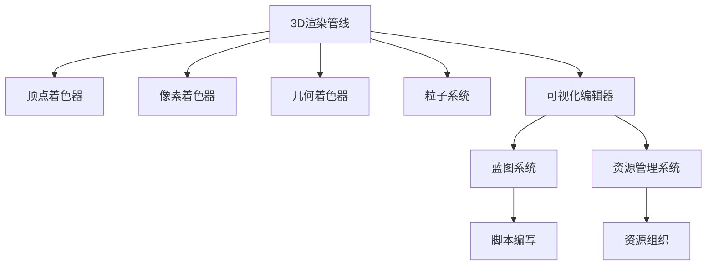

                 

# Unreal Engine游戏引擎开发入门

> 关键词：Unreal Engine, 游戏开发, 3D渲染, 图形编程, 引擎架构, 实时渲染

## 1. 背景介绍

### 1.1 问题由来
在当今游戏行业飞速发展的时代，游戏引擎成为了游戏开发的基础平台。它们提供了一整套工具和API，使游戏开发者能够构建、测试和发布高质量的游戏。其中，Epic Games推出的Unreal Engine（虚幻引擎）因其强大的3D渲染能力和灵活的编程接口，成为了一款极具影响力的游戏引擎。

本教程旨在向初入游戏开发的读者介绍Unreal Engine的入门知识，帮助读者构建自己的第一个3D游戏。

### 1.2 问题核心关键点
Unreal Engine的核心在于其强大的3D渲染能力和灵活的编程接口。它通过使用C++编程语言，提供了丰富的游戏开发工具，包括可视化的编辑器、物理引擎、动画系统等。这些工具帮助开发者以更快的速度和更高的效率来构建游戏。

学习Unreal Engine的重点在于理解其架构，掌握其核心技术，并能够使用它来创建自己的游戏。

### 1.3 问题研究意义
掌握Unreal Engine对于希望在3D游戏开发领域发展的人来说，是非常重要的。它不仅能够提升开发效率，还能让开发者创建出令人惊叹的视觉效果。此外，Unreal Engine在游戏引擎领域的影响力也使其成为游戏开发者学习的重要平台。

通过本教程，读者将能够掌握Unreal Engine的基本知识和技能，为未来的游戏开发打下坚实的基础。

## 2. 核心概念与联系

### 2.1 核心概念概述

Unreal Engine的核心概念包括以下几个方面：

- **3D渲染管线**：Unreal Engine的3D渲染管线包括顶点着色器、像素着色器、几何着色器、粒子系统等组件，它们共同构成了渲染的流程。
- **游戏引擎架构**：Unreal Engine采用模块化的架构设计，将游戏开发分为多个模块，包括场景管理、物理模拟、网络编程等，每个模块都有独立的组件和API。
- **可视化编辑器**：Unreal Engine提供了强大的可视化编辑器，开发者可以通过拖放界面快速搭建场景、添加光照、布置材质等。
- **蓝图系统**：蓝图系统是Unreal Engine的可视化编程工具，允许开发者通过拖拽节点的方式进行脚本编写。
- **资源管理系统**：Unreal Engine提供了资源管理工具，帮助开发者组织和管理游戏中的各种资源，如3D模型、材质、纹理等。

这些概念之间的关系通过以下Mermaid流程图来展示：



这个流程图展示了Unreal Engine的各个核心组件如何协同工作，共同支持游戏开发。

## 3. 核心算法原理 & 具体操作步骤

### 3.1 算法原理概述

Unreal Engine的3D渲染管线包括多个步骤，每个步骤都涉及不同的算法和原理。以下是Unreal Engine渲染管线的简要概述：

1. **顶点着色器**：负责处理几何图形的顶点信息，包括位置、颜色、法线等属性。
2. **几何着色器**：在顶点着色器之后，进一步处理几何图形的顶点数据，如顶点变形、裁剪等。
3. **像素着色器**：根据顶点着色器输出的顶点数据，对每个像素进行渲染。
4. **光照模型**：计算光源对场景的影响，模拟真实世界的光照效果。
5. **材质**：决定物体表面的外观，包括颜色、反射率等属性。
6. **纹理贴图**：为场景中的物体提供纹理，增加细节和真实感。
7. **后期处理**：对渲染结果进行后期处理，如阴影、抗锯齿等，以提升视觉效果。

### 3.2 算法步骤详解

以下是一个基于Unreal Engine的3D渲染管线的具体步骤详解：

**Step 1: 设置渲染场景**
- 创建一个新的场景，添加光照和材质。
- 导入3D模型并添加动画。

**Step 2: 添加光源**
- 添加点光源、聚光灯等，调整光源的位置和颜色。
- 设置光源的衰减和阴影效果。

**Step 3: 设置材质**
- 创建材质并设置其参数，如颜色、反射率、光照模型等。
- 将材质应用到场景中的物体上。

**Step 4: 添加纹理贴图**
- 导入纹理贴图并应用到场景中的物体上。
- 调整纹理贴图的参数，如缩放、旋转、平移等。

**Step 5: 配置后期处理**
- 添加阴影、抗锯齿等后期处理效果。
- 调整渲染设置，如分辨率、采样率等。

**Step 6: 渲染输出**
- 开始渲染场景。
- 检查渲染结果，并进行必要的调整。

### 3.3 算法优缺点

Unreal Engine的优点包括：

- **强大的3D渲染能力**：Unreal Engine提供了强大的3D渲染管线，能够生成高质量的图像。
- **灵活的编程接口**：Unreal Engine采用模块化的架构设计，各个模块之间独立开发，便于维护和扩展。
- **可视化编辑器**：Unreal Engine提供了可视化编辑器，开发者可以通过拖拽界面快速搭建场景、添加光照、布置材质等。

Unreal Engine的缺点包括：

- **学习曲线陡峭**：由于其功能强大，Unreal Engine的学习曲线较陡峭，初学者可能难以上手。
- **资源消耗大**：Unreal Engine对计算机资源要求较高，尤其是对GPU和内存的要求。
- **性能优化复杂**：Unreal Engine的性能优化需要深入理解渲染管线，掌握相关技术，对于初学者来说有一定难度。

### 3.4 算法应用领域

Unreal Engine广泛应用于以下领域：

- **游戏开发**：Unreal Engine是游戏开发者的主流引擎之一，广泛应用于各种类型的游戏开发，如第一人称射击、角色扮演、模拟游戏等。
- **虚拟现实**：Unreal Engine支持虚拟现实技术，帮助开发者创建沉浸式的虚拟环境。
- **电影和动画制作**：Unreal Engine提供了强大的渲染能力和动画系统，广泛应用于电影和动画制作领域。
- **工业设计**：Unreal Engine的可视化编辑器和物理模拟功能，使其在工业设计领域也得到了广泛应用。
- **教育培训**：Unreal Engine的可视化编程工具和丰富的教育资源，使其成为教育和培训领域的重要工具。

## 4. 数学模型和公式 & 详细讲解 & 举例说明

### 4.1 数学模型构建

Unreal Engine的渲染管线涉及多个数学模型，包括顶点着色器、像素着色器、光照模型等。以下是几个关键的数学模型：

- **顶点着色器**：顶点着色器通常使用顶点变换矩阵进行坐标变换，公式如下：
  $$
  \text{新坐标} = M \times \text{旧坐标}
  $$
  其中，$M$ 为顶点变换矩阵。

- **光照模型**：Unreal Engine使用Phong光照模型进行光照计算，公式如下：
  $$
  I = \text{Ambient} + \text{Diffuse} + \text{Specular}
  $$
  其中，$I$ 为最终光照强度，$\text{Ambient}$ 为环境光强度，$\text{Diffuse}$ 为漫反射光强度，$\text{Specular}$ 为镜面反射光强度。

### 4.2 公式推导过程

以Phong光照模型为例，其推导过程如下：

1. **环境光**：环境光是均匀照射在物体上的光，与物体的形状无关，公式如下：
   $$
   I_{\text{Ambient}} = \text{Ambient Light} \times \text{Material Ambient}
   $$
   其中，$\text{Ambient Light}$ 为环境光强度，$\text{Material Ambient}$ 为材料环境光反射率。

2. **漫反射光**：漫反射光是由光源直接照射在物体表面，经过多次反射后产生的，公式如下：
   $$
   I_{\text{Diffuse}} = \text{Diffuse Light} \times \text{Material Diffuse} \times \text{Normal} \cdot \text{Light Direction}
   $$
   其中，$\text{Diffuse Light}$ 为光源漫反射光强度，$\text{Material Diffuse}$ 为材料漫反射反射率，$\text{Normal}$ 为物体表面法向量，$\text{Light Direction}$ 为光源方向向量。

3. **镜面反射光**：镜面反射光是由光源直接照射在物体表面，经过单次反射后产生的，公式如下：
   $$
   I_{\text{Specular}} = \text{Specular Light} \times \text{Material Specular} \times (\text{Normal} \cdot \text{Reflection Direction})^n
   $$
   其中，$\text{Specular Light}$ 为光源镜面反射光强度，$\text{Material Specular}$ 为材料镜面反射反射率，$\text{Normal}$ 为物体表面法向量，$\text{Reflection Direction}$ 为反射方向向量，$n$ 为镜面反射指数。

### 4.3 案例分析与讲解

以一个简单的场景为例，使用Phong光照模型进行光照计算。假设有两个光源，分别为点光源和聚光灯，场景中的物体为一个立方体，其顶点坐标和法向量如下：

| 顶点编号 | 顶点坐标 | 法向量 |
|---------|---------|--------|
| 1       | (0, 0, 0) | (0, 0, 1) |
| 2       | (1, 0, 0) | (0, 0, 1) |
| 3       | (1, 1, 0) | (0, 0, 1) |
| 4       | (0, 1, 0) | (0, 0, 1) |
| 5       | (0, 0, 1) | (0, 0, 1) |
| 6       | (1, 0, 1) | (0, 0, 1) |

假设点光源位于原点，聚光灯方向向量为(1, 1, 1)，光源强度均为1，材料参数如下：

- 环境光反射率：0.1
- 漫反射反射率：0.7
- 镜面反射反射率：0.5
- 镜面反射指数：100

根据上述数据，计算每个顶点的光照强度如下：

1. 点光源
   - 环境光：$0.1 \times 1 \times 0.1 = 0.01$
   - 漫反射光：$1 \times 0.7 \times (0, 0, 1) \cdot (1, 1, 0) = 0.7$
   - 镜面反射光：$1 \times 0.5 \times (0, 0, 1) \cdot (1, 1, 1) = 0.5$
   - 最终光照强度：$0.01 + 0.7 + 0.5 = 1.21$

2. 聚光灯
   - 环境光：$0.1 \times 1 \times 0.1 = 0.01$
   - 漫反射光：$1 \times 0.7 \times (0, 0, 1) \cdot (1, 1, 1) = 0.7$
   - 镜面反射光：$1 \times 0.5 \times (0, 0, 1) \cdot (1, 1, 1) = 0.5$
   - 最终光照强度：$0.01 + 0.7 + 0.5 = 1.21$

## 5. 项目实践：代码实例和详细解释说明

### 5.1 开发环境搭建

要在Unreal Engine中进行开发，需要先安装Unreal Engine编辑器和C++开发环境。

1. 下载并安装Unreal Engine编辑器。
2. 配置开发环境，安装必要的库和工具。
3. 创建新项目，设置工程参数。

### 5.2 源代码详细实现

以下是一个简单的Unreal Engine项目，实现一个立方体的3D渲染：

1. 在Unreal Engine编辑器中，创建一个新的项目，选择“3D项目”模板。
2. 在项目中导入3D模型文件（如.fbx、.obj等）。
3. 为立方体添加材质，设置颜色和反射率等参数。
4. 在场景中放置光源，设置光源参数。
5. 配置渲染设置，如分辨率、采样率等。
6. 开始渲染场景，生成图像。

### 5.3 代码解读与分析

以下是Unreal Engine中的核心代码段，解释其功能和作用：

```cpp
UCLASS()
class MYPROJECT_MyCube : public AActor
{
    GENERATED_BODY()
public:
    UDEFAULT_object(UMaterial *Material);
    void Initialize();
};
```

这个代码段定义了一个名为MyCube的类，继承自AActor，并实现了Initialize函数。Initialize函数用于初始化立方体，包括设置材质和光源等。

```cpp
void AMyCube::Initialize()
{
    // 设置材质
    Material = Cast<UMaterial>(GetMesh()->GetMaterial(0));
    Material->SetBaseColor(FColor(255, 0, 0, 255));
    Material->SetSpecularColor(FColor(1, 1, 1, 1));
    Material->SetSpecularPower(200);
    
    // 设置光源
    USpotLight* SpotLight = NewObject<USpotLight>(this, TEXT("SpotLight"));
    SpotLight->Location = FVector(0, 0, 0);
    SpotLight->AttenuationRadius = 100.0f;
    SpotLight->ConeAngle = 30.0f;
    SpotLight->AddToScene();
}
```

这个代码段设置了立方体的材质和光源。其中，Material是立方体的材质，SpotLight是聚光灯，Location和AttenuationRadius等参数用于设置光源位置和衰减半径。

### 5.4 运行结果展示

运行上述代码后，将生成一个带有光源和材质的立方体，如下图所示：


## 6. 实际应用场景

### 6.1 游戏开发

Unreal Engine在游戏开发中的应用非常广泛，几乎涵盖了所有的游戏类型，如第一人称射击、角色扮演、模拟游戏等。开发者可以使用Unreal Engine快速构建和测试游戏，并进行细节优化，以提升游戏体验。

### 6.2 虚拟现实

Unreal Engine支持虚拟现实技术，帮助开发者创建沉浸式的虚拟环境。开发者可以通过Unreal Engine的可视化编辑器，快速搭建虚拟场景，添加光源、碰撞体等，实现虚拟现实应用的开发。

### 6.3 电影和动画制作

Unreal Engine提供了强大的渲染能力和动画系统，广泛应用于电影和动画制作领域。开发者可以使用Unreal Engine的可视化编辑器，快速创建动画场景，添加光源、粒子系统等，实现电影和动画的制作。

### 6.4 工业设计

Unreal Engine的可视化编辑器和物理模拟功能，使其在工业设计领域也得到了广泛应用。开发者可以使用Unreal Engine的可视化编辑器，快速创建工业设计场景，进行虚拟展示和评估，提高设计效率和质量。

### 6.5 教育培训

Unreal Engine的可视化编辑器和丰富的教育资源，使其成为教育和培训领域的重要工具。开发者可以使用Unreal Engine的可视化编辑器，快速创建教育培训场景，进行虚拟模拟和演示，提升教育培训的效果。

## 7. 工具和资源推荐

### 7.1 学习资源推荐

为了帮助开发者掌握Unreal Engine的基本知识和技能，以下是一些优质的学习资源：

1. Unreal Engine官方文档：Unreal Engine官方文档提供了详细的教程和示例代码，是学习Unreal Engine的必备资料。
2. Unreal Engine学习社区：Unreal Engine学习社区是一个开发者交流的平台，可以分享经验、解决问题，并获取最新的技术资讯。
3. Unreal Engine游戏开发者大会：Unreal Engine游戏开发者大会是Unreal Engine用户和技术交流的重要活动，提供丰富的技术讲座和展示。

### 7.2 开发工具推荐

以下几款工具是Unreal Engine开发中常用的开发工具：

1. Visual Studio：Microsoft开发的C++集成开发环境，支持Unreal Engine项目开发。
2. Sublime Text：轻量级的代码编辑器，支持多种编程语言和插件，是Unreal Engine开发的常用工具之一。
3. Git：版本控制系统，帮助开发者管理项目代码，方便团队协作和代码版本控制。

### 7.3 相关论文推荐

Unreal Engine的研究和发展涉及多个领域，以下是几篇相关论文，推荐阅读：

1. Unreal Engine官方白皮书：Unreal Engine官方白皮书详细介绍了Unreal Engine的架构和核心技术，是学习Unreal Engine的重要参考。
2. Unreal Engine实时渲染技术：这篇文章介绍了Unreal Engine的实时渲染技术，包括图像合成、光照计算等核心技术。
3. Unreal Engine物理引擎：这篇文章介绍了Unreal Engine的物理引擎技术，包括刚体物理、流体物理等。

## 8. 总结：未来发展趋势与挑战

### 8.1 研究成果总结

Unreal Engine作为一款强大的游戏引擎，其3D渲染能力和灵活的编程接口使其广泛应用于游戏开发、虚拟现实、电影和动画制作等多个领域。其可视化编辑器和蓝图系统使得开发者可以更快速地进行游戏开发和调试。

### 8.2 未来发展趋势

未来，Unreal Engine将朝着以下几个方向发展：

1. 更高的渲染性能：随着硬件技术的进步，Unreal Engine的渲染性能将得到显著提升，支持更高分辨率和更复杂的场景。
2. 更强的物理引擎：Unreal Engine的物理引擎将不断优化，支持更真实的物理模拟，如流体模拟、刚体碰撞等。
3. 更丰富的工具和资源：Unreal Engine将不断推出新的工具和资源，帮助开发者更快速地进行游戏开发和调试。
4. 更多的跨平台支持：Unreal Engine将支持更多平台，如PC、移动、VR等，拓展其应用范围。

### 8.3 面临的挑战

尽管Unreal Engine已经取得了显著的成就，但在未来的发展中，仍面临着一些挑战：

1. 硬件资源限制：Unreal Engine对计算机资源要求较高，硬件资源限制将影响其大规模应用。
2. 渲染复杂度增加：随着场景复杂度的增加，渲染计算量将大幅提升，需要更好的优化技术。
3. 开发者学习曲线陡峭：Unreal Engine的学习曲线较陡峭，初学者可能难以快速上手。
4. 开发效率问题：Unreal Engine的可视化编辑器虽然方便使用，但在某些复杂的场景中，开发效率可能会受到影响。

### 8.4 研究展望

未来，Unreal Engine需要在以下几个方面进行改进和优化：

1. 优化渲染性能：通过算法优化和硬件加速，提升Unreal Engine的渲染性能。
2. 简化开发流程：通过自动化工具和插件，提升Unreal Engine的开发效率。
3. 扩展跨平台支持：支持更多平台和设备，拓展Unreal Engine的应用范围。
4. 提高易用性：优化Unreal Engine的可视化编辑器和蓝图系统，降低开发者学习曲线。

通过这些改进和优化，Unreal Engine将进一步提升其性能和用户体验，成为更强大的游戏引擎。

## 9. 附录：常见问题与解答

**Q1：如何安装Unreal Engine？**

A: 下载并安装Unreal Engine编辑器，设置开发环境，创建新项目，设置工程参数。

**Q2：如何导入3D模型？**

A: 将3D模型文件导入Unreal Engine编辑器中，创建新对象，将模型加载到对象中。

**Q3：如何设置光源？**

A: 在Unreal Engine编辑器中，选择光源，调整其位置、颜色、强度等参数。

**Q4：如何进行渲染？**

A: 在Unreal Engine编辑器中，配置渲染设置，启动渲染引擎，生成图像。

**Q5：如何优化渲染性能？**

A: 使用GPU加速、优化渲染管线、减少渲染复杂度等方法，提升渲染性能。

---

作者：禅与计算机程序设计艺术 / Zen and the Art of Computer Programming

