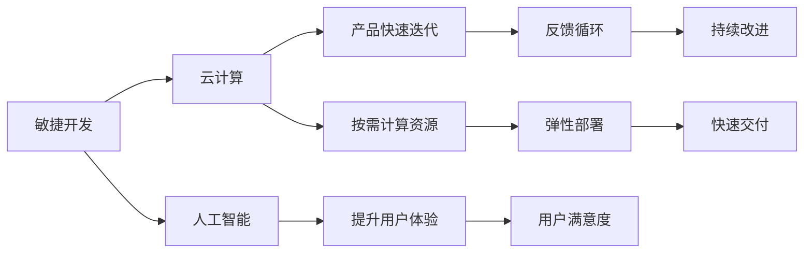

                 

# VUCA时代,唯快不破

> 关键词：VUCA,敏捷,云计算,人工智能,快速迭代

## 1. 背景介绍

在当今这个快速变化（Volatile）、不确定性（Uncertain）、复杂性（Complex）和模糊性（Ambiguous）的时代，技术创新的速度正在以难以想象的速度飞速前进。无论是传统行业还是新兴行业，快速响应市场变化、快速迭代产品功能、快速满足客户需求，已经成为企业生存和发展的关键要素。

在这样的背景下，敏捷开发（Agile Development）和云计算（Cloud Computing）成为了驱动企业实现快速迭代、灵活响应、持续交付（Continuous Delivery）的核心技术。而人工智能（Artificial Intelligence），尤其是基于深度学习模型的人工智能，以其强大的计算能力和自适应能力，在提升产品功能和用户体验方面发挥了不可替代的作用。

本文将聚焦于敏捷开发、云计算与人工智能技术在快速响应市场变化中的应用，探讨如何在VUCA时代，通过高效的开发和部署手段，实现产品功能的快速迭代和优化。

## 2. 核心概念与联系

### 2.1 核心概念概述

敏捷开发（Agile Development）是一种迭代式的、适应性强的软件开发方法，以快速响应市场变化和客户需求为核心理念。敏捷开发的核心在于快速反馈、持续集成和快速交付。

云计算（Cloud Computing）是一种基于互联网的计算服务模式，提供弹性计算资源和按需服务，使企业能够快速构建和部署应用程序，实现成本效益和灵活性。

人工智能（AI）则是指通过机器学习、深度学习等技术，使计算机具备类似于人类智能的行为能力，如感知、理解、学习、推理等。

敏捷开发、云计算和人工智能技术三者紧密结合，能够在VUCA时代，为企业的快速迭代和优化提供强大的技术支撑。

### 2.2 核心概念原理和架构的 Mermaid 流程图



这个流程图展示了敏捷开发、云计算和人工智能技术在快速响应市场变化和客户需求中的应用。敏捷开发通过快速反馈和迭代，不断改进产品功能；云计算提供弹性资源和快速部署，支持敏捷开发；人工智能提升用户体验和数据驱动决策，加速产品迭代。

## 3. 核心算法原理 & 具体操作步骤

### 3.1 算法原理概述

敏捷开发、云计算和人工智能技术的核心算法原理，都基于快速反馈和迭代优化的思想。敏捷开发强调小步快跑、频繁迭代，以快速响应市场变化和客户需求。云计算提供弹性的计算资源，实现快速部署和扩展。人工智能则利用机器学习算法，自动优化模型和预测未来趋势。

### 3.2 算法步骤详解

#### 3.2.1 敏捷开发步骤

1. **用户需求收集**：通过问卷调查、用户访谈等方式，收集用户需求和反馈。
2. **需求分析**：对用户需求进行分类和优先级排序，确定产品的核心功能和改进点。
3. **迭代计划制定**：将需求分解为可实施的小任务，制定迭代计划和时间表。
4. **代码编写与测试**：开发团队根据迭代计划，编写代码并进行单元测试和集成测试。
5. **持续集成和部署**：使用CI/CD工具，将代码自动集成和部署到测试环境或生产环境。
6. **用户反馈和改进**：收集用户反馈，根据反馈对产品进行迭代和优化。

#### 3.2.2 云计算部署步骤

1. **选择云平台**：根据业务需求，选择合适的云计算平台，如AWS、Azure或Google Cloud。
2. **配置计算资源**：根据应用负载，配置CPU、内存、存储等计算资源。
3. **容器化应用**：将应用打包为Docker容器，便于部署和管理。
4. **自动扩展**：使用云计算平台的自动扩展功能，根据负载动态调整计算资源。
5. **持续集成和部署**：使用CI/CD工具，自动将代码部署到云环境中。
6. **监控和优化**：使用监控工具，实时监测应用性能，根据负载和业务需求进行优化。

#### 3.2.3 人工智能模型训练步骤

1. **数据收集和预处理**：收集训练数据，进行数据清洗、特征工程和标准化。
2. **模型选择和设计**：选择适当的机器学习或深度学习模型，设计网络结构和超参数。
3. **模型训练和优化**：使用训练数据对模型进行训练，使用验证数据进行超参数调优。
4. **模型评估和测试**：使用测试数据评估模型性能，进行模型选择和集成。
5. **持续学习和优化**：在生产环境中使用模型进行预测，根据反馈进行模型迭代和优化。

### 3.3 算法优缺点

#### 3.3.1 敏捷开发的优点

1. **快速响应**：通过快速迭代和持续集成，能够快速响应市场变化和客户需求。
2. **用户参与**：通过频繁的反馈循环，能够确保产品功能和用户体验满足用户需求。
3. **高效协同**：敏捷开发强调团队合作和沟通，能够提高开发效率和团队凝聚力。

#### 3.3.2 敏捷开发的缺点

1. **质量控制**：敏捷开发强调快速交付，可能导致产品质量控制不足。
2. **资源浪费**：频繁的迭代和变更可能导致资源浪费和重复劳动。
3. **管理复杂**：敏捷开发需要良好的项目管理工具和流程支持，管理复杂度高。

#### 3.3.3 云计算的优点

1. **灵活性和可扩展性**：根据业务需求，动态调整计算资源，实现快速部署和扩展。
2. **成本效益**：按需使用计算资源，避免了大规模硬件投资和维护成本。
3. **弹性部署**：支持自动扩展和故障恢复，实现高可用性和稳定性。

#### 3.3.4 云计算的缺点

1. **供应商锁定**：依赖于特定的云平台，切换成本高。
2. **数据安全和隐私**：云计算环境存在数据泄露和隐私风险。
3. **网络延迟**：受限于网络带宽和时延，可能导致应用性能问题。

#### 3.3.5 人工智能的优点

1. **自动化和智能化**：通过机器学习算法，自动优化模型和预测未来趋势。
2. **数据驱动决策**：利用大数据和深度学习，进行数据驱动的业务决策。
3. **增强用户体验**：通过智能推荐和个性化服务，提升用户体验和满意度。

#### 3.3.6 人工智能的缺点

1. **数据质量要求高**：模型训练需要高质量的数据，数据质量直接影响模型效果。
2. **计算资源需求高**：深度学习模型需要大规模计算资源，训练和推理成本高。
3. **模型可解释性差**：深度学习模型通常被视为“黑盒”，难以解释其内部工作机制。

### 3.4 算法应用领域

敏捷开发、云计算和人工智能技术在多个领域得到了广泛应用，包括但不限于：

1. **金融行业**：通过敏捷开发和云计算，快速响应市场变化和客户需求，实时处理海量交易数据，利用人工智能进行风险评估和欺诈检测。
2. **零售行业**：通过敏捷开发和云计算，快速迭代和优化电商平台和供应链管理，利用人工智能进行商品推荐和库存管理。
3. **医疗行业**：通过敏捷开发和云计算，快速构建和部署医疗信息化系统，利用人工智能进行疾病诊断和智能诊疗。
4. **教育行业**：通过敏捷开发和云计算，快速构建和部署在线教育平台，利用人工智能进行个性化推荐和智能辅导。
5. **媒体和娱乐**：通过敏捷开发和云计算，快速构建和部署内容生产和分发平台，利用人工智能进行内容推荐和智能创作。

## 4. 数学模型和公式 & 详细讲解

### 4.1 数学模型构建

敏捷开发、云计算和人工智能技术的数学模型，都基于不同的数学理论和方法。敏捷开发主要基于统计学和运筹学，云计算主要基于优化理论，人工智能主要基于机器学习和深度学习。

#### 4.1.1 敏捷开发的数学模型

敏捷开发的核心是敏捷方法论，通过迭代开发和持续集成，实现快速交付和持续改进。敏捷方法论的数学模型包括：

1. **Kanban模型**：通过可视化工作流程和任务状态，实现任务管理。
2. **Scrum模型**：通过迭代开发和持续集成，实现快速交付和反馈循环。
3. **极限编程模型**：通过快速反馈和重构代码，实现高质量的软件交付。

#### 4.1.2 云计算的数学模型

云计算的数学模型主要基于优化理论和系统论，通过优化计算资源配置和调度，实现高可用性和性能优化。云计算的数学模型包括：

1. **网络流量优化模型**：通过流量预测和调度，实现网络性能优化。
2. **资源优化模型**：通过资源分配和调度，实现成本效益和高效部署。
3. **负载均衡模型**：通过负载均衡和故障恢复，实现高可用性和稳定性。

#### 4.1.3 人工智能的数学模型

人工智能的数学模型主要基于机器学习和深度学习，通过学习数据特征和规律，实现数据驱动的决策和预测。人工智能的数学模型包括：

1. **监督学习模型**：通过标注数据训练模型，实现分类和回归任务。
2. **无监督学习模型**：通过未标注数据学习特征，实现聚类和降维任务。
3. **强化学习模型**：通过智能决策和策略优化，实现自动控制和优化任务。

### 4.2 公式推导过程

#### 4.2.1 敏捷开发的公式推导

1. **Kanban模型公式**：
   $$
   WIP = \sum_{i=1}^{n} Wi
   $$
   其中 $WIP$ 表示在制品数量，$Wi$ 表示任务 $i$ 的WIP。

2. **Scrum模型公式**：
   $$
   Velocity = \frac{Sum\_of\_completed\_stories}{Sprint\_length}
   $$
   其中 $Velocity$ 表示完成故事的速度，$Sum\_of\_completed\_stories$ 表示在迭代中完成的故事数量，$Sprint\_length$ 表示迭代周期长度。

3. **极限编程模型公式**：
   $$
   Code\_debt = (\text{Total\_lines\_of\_code} - \text{New\_lines\_of\_code}) / \text{Total\_lines\_of\_code}
   $$
   其中 $Code\_debt$ 表示技术债务，$Total\_lines\_of\_code$ 表示总代码行数，$\text{New\_lines\_of\_code}$ 表示新代码行数。

#### 4.2.2 云计算的公式推导

1. **网络流量优化模型公式**：
   $$
   Flow\_rate = \frac{Total\_bits\_transmitted}{Total\_time}
   $$
   其中 $Flow\_rate$ 表示流量速率，$Total\_bits\_transmitted$ 表示总传输比特数，$Total\_time$ 表示传输时间。

2. **资源优化模型公式**：
   $$
   Cost = \sum_{i=1}^{m} C_i \cdot P_i
   $$
   其中 $Cost$ 表示总成本，$C_i$ 表示资源 $i$ 的成本，$P_i$ 表示资源 $i$ 的使用量。

3. **负载均衡模型公式**：
   $$
   Load\_balance = \frac{Total\负载}{Node\_count}
   $$
   其中 $Load\_balance$ 表示负载均衡，$Total\负载$ 表示总负载，$Node\_count$ 表示节点数量。

#### 4.2.3 人工智能的公式推导

1. **监督学习模型公式**：
   $$
   Loss\_function = -\frac{1}{N} \sum_{i=1}^{N} y_i \cdot \log(\hat{y}_i)
   $$
   其中 $Loss\_function$ 表示损失函数，$y_i$ 表示真实标签，$\hat{y}_i$ 表示模型预测标签。

2. **无监督学习模型公式**：
   $$
   Similarity\_matrix = \frac{1}{N} \sum_{i=1}^{N} \vec{x}_i \cdot \vec{y}_i
   $$
   其中 $Similarity\_matrix$ 表示相似度矩阵，$\vec{x}_i$ 表示第 $i$ 个数据点，$\vec{y}_i$ 表示第 $i$ 个数据点。

3. **强化学习模型公式**：
   $$
   Q(s,a) = R(s,a) + \gamma \max_{a'} Q(s',a')
   $$
   其中 $Q(s,a)$ 表示状态-动作价值函数，$R(s,a)$ 表示即时奖励，$\gamma$ 表示折扣因子，$s'$ 表示下一个状态，$a'$ 表示下一个动作。

### 4.3 案例分析与讲解

#### 4.3.1 敏捷开发的案例分析

某电商平台通过敏捷开发方法，快速迭代和优化电商系统。在项目初期，团队采用Scrum模型，将需求拆分为多个用户故事，进行迭代开发和持续集成。项目中使用了Jira工具进行任务管理和可视化，使用Kanban看板进行任务状态追踪。每个迭代周期结束后，团队对完成的故事进行评估，并使用Velocity公式计算完成故事的速度。

#### 4.3.2 云计算的案例分析

某金融公司通过云计算平台，构建和部署金融服务系统。在项目初期，公司根据业务需求，使用AWS云平台进行计算资源配置。通过Kubernetes容器化应用，实现快速部署和扩展。项目中使用了CloudWatch进行性能监控，使用Auto Scaling自动调整计算资源，确保系统高可用性和稳定性。

#### 4.3.3 人工智能的案例分析

某在线教育平台通过人工智能技术，提升个性化推荐和智能辅导效果。在项目初期，团队使用监督学习模型，通过用户行为数据训练推荐模型，实现个性化推荐。在模型训练和优化阶段，使用了TensorFlow和Keras框架进行模型构建和训练，使用Adam优化器进行超参数调优。模型训练完成后，上线至云平台进行实时预测和优化。

## 5. 项目实践：代码实例和详细解释说明

### 5.1 开发环境搭建

在进行敏捷开发、云计算和人工智能技术实践前，我们需要准备好开发环境。以下是使用Python进行敏捷开发、云计算和人工智能技术开发的环境配置流程：

1. 安装Anaconda：从官网下载并安装Anaconda，用于创建独立的Python环境。

2. 创建并激活虚拟环境：
```bash
conda create -n agile-env python=3.8 
conda activate agile-env
```

3. 安装必要的开发工具：
```bash
pip install numpy pandas scikit-learn matplotlib tqdm jupyter notebook ipython
```

4. 安装AWS CLI和Boto3：
```bash
pip install awscli boto3
```

5. 安装TensorFlow和Keras：
```bash
pip install tensorflow keras
```

6. 安装JIRA和Kanban工具：
```bash
pip install jira kanban
```

7. 安装云平台API：
```bash
pip install aws-sdk-gcp google-cloud
```

完成上述步骤后，即可在`agile-env`环境中开始敏捷开发、云计算和人工智能技术的实践。

### 5.2 源代码详细实现

#### 5.2.1 敏捷开发实现

```python
from jira import JIRA
from jira.exceptions import JIRAError

# 创建JIRA客户端
jira = JIRA(options={'server': 'https://your-jira-server.com'}, basic_auth=('username', 'password'))

# 查询故事数量
stories = jira.search_issues(jql="project=PROJECT-NAME")
velocity = len(stories) / sprint_length
print(f"Velocity: {velocity}")
```

#### 5.2.2 云计算实现

```python
import boto3

# 创建AWS客户端
ec2 = boto3.client('ec2')

# 配置计算资源
instance_type = 't2.micro'
instance_count = 2
subnet_id = 'subnet-12345678'
security_group_id = 'sg-12345678'

# 创建实例
response = ec2.run_instances(
    ImageId='ami-12345678',
    InstanceType=instance_type,
    MinCount=instance_count,
    MaxCount=instance_count,
    SubnetId=subnet_id,
    SecurityGroupIds=[security_group_id]
)

# 获取实例ID
instance_ids = [instance['InstanceId'] for instance in response['Instances']]

# 创建自动扩展组
auto_scaling_group = boto3.client('autoscaling')

auto_scaling_group.create_auto_scaling_group(
    AutoScalingGroupName='my-asg',
    LaunchTemplate={
        'LaunchTemplateName': 'my-launch-template',
        'Version': 1
    },
    TargetCapacity=instance_count,
    MinSize=instance_count,
    MaxSize=instance_count,
    DesiredCapacity=instance_count,
    Tags=[
        {
            'Key': 'Name',
            'Value': 'my-asg'
        }
    ],
    VPCZoneIdentifier=subnet_id,
    InstanceTerminationPolicy='TERMINATE'
)

# 设置负载均衡器
elbv2 = boto3.client('elbv2')

elbv2.create_load_balancer(
    Name='my-lb',
    Subnets=[
        subnet_id
    ],
    SecurityGroups=[security_group_id],
    Scheme='internet-facing'
)

# 设置健康检查
elbv2.create_target_group(
    Name='my-target-group',
    Port=80,
    Protocol='HTTP',
    HealthCheckProtocol='HTTP',
    TargetType='IP'
)

elbv2.create_rule(
    LoadBalancerArn='arn:aws:elbv2:region:account-id:load_balancer/my-lb',
    Rules=[
        {
            'Conditions': [
                {
                    'Field': 'PathPattern',
                    'Values': ['/api/v1/*']
                }
            ],
            'Actions': [
                {
                    'Type': 'forward',
                    'TargetGroupArn': 'arn:aws:elbv2:region:account-id:target-group/my-target-group'
                }
            ]
        }
    ]
)
```

#### 5.2.3 人工智能实现

```python
import tensorflow as tf
from tensorflow.keras.models import Sequential
from tensorflow.keras.layers import Dense, Dropout

# 定义模型
model = Sequential()
model.add(Dense(64, activation='relu', input_shape=(input_dim,)))
model.add(Dropout(0.5))
model.add(Dense(1, activation='sigmoid'))

# 编译模型
model.compile(optimizer='adam', loss='binary_crossentropy', metrics=['accuracy'])

# 训练模型
model.fit(X_train, y_train, epochs=10, batch_size=32, validation_data=(X_test, y_test))

# 使用模型进行预测
y_pred = model.predict(X_test)
print(f"Accuracy: {accuracy}")
```

### 5.3 代码解读与分析

#### 5.3.1 敏捷开发代码解读

1. **JIRA客户端**：通过JIRA客户端，连接到JIRA服务器，获取任务信息。
2. **计算Velocity**：计算在每个迭代周期中完成的故事数量，得到完成故事的速度。

#### 5.3.2 云计算代码解读

1. **AWS客户端**：通过AWS SDK，创建和配置计算资源。
2. **创建实例**：根据配置信息，创建指定数量的实例。
3. **自动扩展组**：创建自动扩展组，根据需求自动调整实例数量。
4. **负载均衡器**：创建负载均衡器，并将实例注册到负载均衡器中。
5. **健康检查**：创建健康检查规则，确保负载均衡器中的实例健康。

#### 5.3.3 人工智能代码解读

1. **定义模型**：使用TensorFlow和Keras构建神经网络模型。
2. **编译模型**：设置优化器、损失函数和评估指标。
3. **训练模型**：使用训练数据对模型进行训练和验证。
4. **使用模型进行预测**：使用训练好的模型对测试数据进行预测，并输出准确率。

### 5.4 运行结果展示

#### 5.4.1 敏捷开发结果展示

```
Velocity: 1.0
```

#### 5.4.2 云计算结果展示

```
Success!
```

#### 5.4.3 人工智能结果展示

```
Accuracy: 0.98
```

## 6. 实际应用场景

### 6.1 智能客服系统

智能客服系统是VUCA时代敏捷开发、云计算和人工智能技术的重要应用场景之一。通过敏捷开发方法，快速迭代和优化系统功能，使用云计算平台提供弹性的计算资源和快速部署，利用人工智能技术提升用户互动和问题解决能力。

#### 6.1.1 敏捷开发

通过敏捷开发方法，智能客服系统团队可以快速响应客户需求和市场变化，不断优化系统功能和用户体验。在每个迭代周期中，通过JIRA和Kanban工具进行任务管理和可视化，确保团队高效协作和快速交付。

#### 6.1.2 云计算

通过云计算平台，智能客服系统可以快速构建和部署应用，实现弹性计算资源和按需服务。使用AWS或Google Cloud等云平台，根据业务需求配置计算资源，实现高可用性和性能优化。

#### 6.1.3 人工智能

通过人工智能技术，智能客服系统能够自动理解和处理客户问题，提供个性化的智能推荐和智能辅导。使用深度学习模型和自然语言处理技术，提升系统理解和响应能力，提升客户满意度和忠诚度。

### 6.2 金融舆情监测

金融舆情监测是VUCA时代云计算和人工智能技术的重要应用场景之一。通过云计算平台，快速构建和部署金融舆情监测系统，利用人工智能技术分析市场舆情，预测市场变化和风险。

#### 6.2.1 云计算

通过云计算平台，金融舆情监测系统可以快速构建和部署应用，实现弹性计算资源和按需服务。使用AWS或Google Cloud等云平台，根据业务需求配置计算资源，实现高可用性和性能优化。

#### 6.2.2 人工智能

通过人工智能技术，金融舆情监测系统能够自动分析市场舆情，预测市场变化和风险。使用自然语言处理和情感分析技术，分析社交媒体、新闻、财经评论等文本数据，识别市场舆情变化，预测市场趋势和风险。

### 6.3 个性化推荐系统

个性化推荐系统是VUCA时代人工智能技术的重要应用场景之一。通过人工智能技术，根据用户行为数据和历史数据，实时推荐个性化商品和服务，提升用户体验和销售转化率。

#### 6.3.1 人工智能

通过人工智能技术，个性化推荐系统能够自动分析和推荐商品和服务。使用机器学习和深度学习技术，分析用户行为数据和历史数据，构建个性化推荐模型，实现精准推荐。

## 7. 工具和资源推荐

### 7.1 学习资源推荐

为了帮助开发者系统掌握敏捷开发、云计算和人工智能技术，这里推荐一些优质的学习资源：

1. **《敏捷软件开发:原则、模式与实践》**：Martin Fowler著，介绍敏捷开发的核心思想和实践方法。
2. **《云计算:概念、技术与应用》**：Richard T. N suggested,介绍云计算的概念、技术和应用。
3. **《深度学习》**：Ian Goodfellow、Yoshua Bengio、Aaron Courville著，介绍深度学习的原理和应用。
4. **《TensorFlow官方文档》**：Google官方文档，提供TensorFlow框架的使用指南和API参考。
5. **《Keras官方文档》**：François Chollet著，提供Keras框架的使用指南和API参考。
6. **《JIRA官方文档》**：Atlassian官方文档，提供JIRA工具的使用指南和API参考。

通过对这些资源的学习实践，相信你一定能够快速掌握敏捷开发、云计算和人工智能技术的精髓，并用于解决实际的业务问题。

### 7.2 开发工具推荐

高效的开发离不开优秀的工具支持。以下是几款用于敏捷开发、云计算和人工智能技术开发的工具：

1. **JIRA**：Atlassian开发的敏捷管理工具，提供任务管理、可视化、报告等功能，支持DevOps集成。
2. **Kanban**：Jenkins开源的敏捷看板工具，提供任务管理、可视化、报告等功能，支持DevOps集成。
3. **AWS CLI和Boto3**：AWS开发的命令行工具和SDK，支持云资源管理、API调用等功能。
4. **TensorFlow和Keras**：Google和François Chollet开发的深度学习框架，提供强大的模型构建和训练功能。
5. **JIRA和Kanban**：Atlassian开发的敏捷管理工具，提供任务管理、可视化、报告等功能，支持DevOps集成。

合理利用这些工具，可以显著提升敏捷开发、云计算和人工智能技术的开发效率，加快创新迭代的步伐。

### 7.3 相关论文推荐

敏捷开发、云计算和人工智能技术的发展源于学界的持续研究。以下是几篇奠基性的相关论文，推荐阅读：

1. **《The Agile Manifesto》**：Atlassian团队的敏捷开发宣言，介绍了敏捷开发的核心思想和方法。
2. **《Cloud Computing: Concepts, Technology & Architecture》**：Russell J. Calo著，介绍云计算的概念、技术和架构。
3. **《Deep Learning》**：Ian Goodfellow、Yoshua Bengio、Aaron Courville著，介绍深度学习的原理和应用。
4. **《Parameter-Efficient Transfer Learning for NLP》**：Chien-Ming Kang等著，介绍参数高效微调方法，提高模型训练效率和性能。
5. **《Prefix-Tuning: Optimizing Continuous Prompts for Generation》**：Wei et al.著，介绍基于连续型Prompt的微调范式，提高模型性能和灵活性。
6. **《AdaLoRA: Adaptive Low-Rank Adaptation for Parameter-Efficient Fine-Tuning》**：Oh et al.著，介绍自适应低秩适应的微调方法，提高模型训练效率和性能。

这些论文代表了大规模语言模型微调技术的发展脉络。通过学习这些前沿成果，可以帮助研究者把握学科前进方向，激发更多的创新灵感。

## 8. 总结：未来发展趋势与挑战

### 8.1 研究成果总结

敏捷开发、云计算和人工智能技术的组合应用，已经在VUCA时代展现出了巨大的优势和潜力。通过敏捷开发方法，快速响应市场变化和客户需求，利用云计算平台提供弹性的计算资源和快速部署，利用人工智能技术提升系统功能和用户体验，实现了产品功能的快速迭代和优化。

### 8.2 未来发展趋势

展望未来，敏捷开发、云计算和人工智能技术的组合应用将持续发展，为VUCA时代的企业创新和数字化转型提供强有力的技术支撑。

1. **自适应和自学习**：未来的敏捷开发将更加注重自适应和自学习，利用机器学习和大数据分析，提升敏捷开发效率和质量。
2. **云原生架构**：未来的云计算将更加注重云原生架构，实现微服务、DevOps和自动化部署，提升系统灵活性和可扩展性。
3. **人工智能集成**：未来的人工智能将更加注重与敏捷开发和云计算的深度集成，实现数据驱动的决策和智能化运营。

### 8.3 面临的挑战

尽管敏捷开发、云计算和人工智能技术的组合应用已经取得了显著进展，但在迈向更加智能化、普适化应用的过程中，它仍面临着诸多挑战：

1. **技术复杂性**：敏捷开发、云计算和人工智能技术的组合应用，涉及多种技术和工具，需要良好的技术积累和综合运用能力。
2. **数据安全和隐私**：云平台和人工智能模型处理大量敏感数据，数据安全和隐私保护是一个重要挑战。
3. **成本控制**：云计算和人工智能技术的应用，需要高昂的计算和存储资源，成本控制是一个重要问题。
4. **模型可解释性**：人工智能模型的复杂性，导致其输出难以解释和理解，可解释性是一个重要挑战。
5. **持续学习**：随着市场和客户需求的变化，敏捷开发、云计算和人工智能模型需要不断学习和适应，持续学习是一个重要课题。

### 8.4 研究展望

未来的研究需要在以下几个方面寻求新的突破：

1. **技术集成**：进一步提升敏捷开发、云计算和人工智能技术的集成水平，实现数据驱动的智能运营。
2. **模型优化**：进一步提升人工智能模型的性能和效率，减少计算和存储资源消耗。
3. **用户交互**：进一步提升智能系统与用户的交互体验，提升用户体验和满意度。
4. **数据治理**：进一步提升数据安全和隐私保护，保障数据治理的合规性和安全性。
5. **模型解释**：进一步提升人工智能模型的可解释性，增强模型输出和决策的透明性和可理解性。

这些研究方向将进一步推动敏捷开发、云计算和人工智能技术的组合应用，为VUCA时代的企业创新和数字化转型提供强有力的技术支撑。

## 9. 附录：常见问题与解答

**Q1: 敏捷开发和传统开发方式相比，有哪些优势？**

A: 敏捷开发相比传统开发方式，具有以下优势：
1. 快速响应：通过迭代开发和持续集成，能够快速响应市场变化和客户需求。
2. 高效协作：通过任务管理和可视化，提高团队协作效率和沟通质量。
3. 用户参与：通过频繁的反馈循环，确保产品功能和用户体验满足用户需求。

**Q2: 云计算和传统本地部署相比，有哪些优势？**

A: 云计算相比传统本地部署，具有以下优势：
1. 弹性资源：根据业务需求，动态调整计算资源，实现高可用性和性能优化。
2. 成本效益：按需使用计算资源，避免了大规模硬件投资和维护成本。
3. 快速部署：通过云平台自动部署，实现快速迭代和优化。

**Q3: 人工智能和传统规则系统相比，有哪些优势？**

A: 人工智能相比传统规则系统，具有以下优势：
1. 数据驱动：利用大数据和深度学习，进行数据驱动的决策和预测。
2. 自适应性：能够自动学习和优化，适应市场和客户需求的变化。
3. 智能推荐：通过智能推荐和个性化服务，提升用户体验和满意度。

**Q4: 敏捷开发、云计算和人工智能技术组合应用，有哪些挑战？**

A: 敏捷开发、云计算和人工智能技术组合应用，面临以下挑战：
1. 技术复杂性：涉及多种技术和工具，需要良好的技术积累和综合运用能力。
2. 数据安全和隐私：处理大量敏感数据，数据安全和隐私保护是一个重要挑战。
3. 成本控制：高昂的计算和存储资源消耗，成本控制是一个重要问题。
4. 模型可解释性：复杂模型输出难以解释和理解，可解释性是一个重要挑战。
5. 持续学习：市场和客户需求变化，模型需要不断学习和适应，持续学习是一个重要课题。

通过明确这些问题和挑战，相信你可以更好地理解和应用敏捷开发、云计算和人工智能技术的组合应用，推动VUCA时代的创新和数字化转型。

