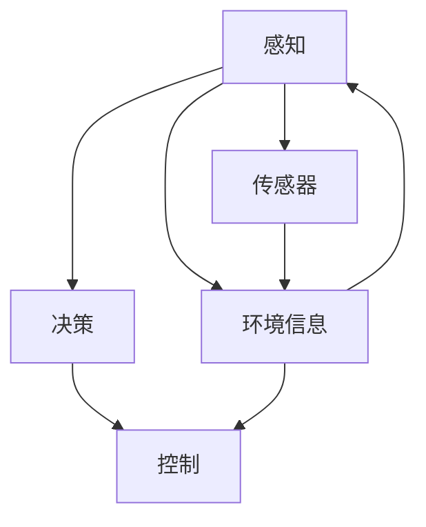

                 

# Waymo、特斯拉等企业技术博客中的自动驾驶研究成果分享

在自动驾驶技术领域，Waymo、特斯拉(Tesla)等企业通过技术博客持续分享其最新研究成果，推动行业发展。本文将深入探讨这些企业在技术博客中披露的自动驾驶技术核心，如感知、决策、控制等方面的进展，分析其优势与局限，展望未来发展趋势。

## 1. 背景介绍

随着人工智能、计算机视觉和传感器技术的进步，自动驾驶技术已经从实验室走向现实世界。谷歌旗下Waymo、特斯拉(Tesla)等公司，通过技术博客持续公开其自动驾驶技术的研发进展，展示其在感知、决策、控制等核心领域取得的成果。本文旨在梳理这些企业技术博客中披露的关键研究成果，探究其在自动驾驶技术研发上的新动态。

## 2. 核心概念与联系

### 2.1 核心概念概述

自动驾驶技术的核心包括**感知、决策和控制**三个方面。

- **感知**：指通过摄像头、雷达、激光雷达等传感器，获取车辆周围环境信息，实现环境的实时监控和理解。
- **决策**：基于感知到的环境信息，进行路径规划、行为选择等，制定车辆行为策略。
- **控制**：将决策转化为具体的动作指令，如加速、制动、转向等，实现车辆的自动驾驶。

各大企业在技术博客中，往往围绕这三个方面，分享其最新的研究成果和技术突破。本文将结合具体案例，分析这些核心概念的实现机制。

### 2.2 核心概念联系（Mermaid 流程图）



该图展示了自动驾驶技术核心概念的联系：感知获取环境信息，决策根据环境信息制定行为策略，控制将决策转化为具体的驾驶动作。

## 3. 核心算法原理 & 具体操作步骤

### 3.1 算法原理概述

自动驾驶技术涉及复杂的感知、决策和控制算法。本文将重点探讨Waymo和特斯拉在技术博客中披露的关键算法原理。

- **Waymo**：作为全球领先的自动驾驶公司之一，Waymo在感知方面采用多传感器融合技术，决策方面运用深度强化学习算法，控制方面采用实时路径规划和行为预测模型。
- **特斯拉**：特斯拉以深度学习和计算机视觉为核心技术，构建端到端的自动驾驶系统，实现从感知到控制的自动化处理。

### 3.2 算法步骤详解

#### 3.2.1 Waymo

**Step 1: 传感器融合**
Waymo使用多传感器融合技术，包括摄像头、雷达、激光雷达等，融合感知数据，生成高精度的环境地图。其传感器融合算法可归纳为以下几个步骤：

1. 数据预处理：对不同传感器的数据进行校正和去噪。
2. 数据对齐：将传感器数据在时间和空间上进行对齐。
3. 数据融合：通过贝叶斯滤波算法，将不同传感器数据进行融合，生成高精度地图。

**Step 2: 感知系统**
Waymo的感知系统基于深度神经网络，能够实现对车辆周围环境的实时监控。其关键技术包括：

1. 物体检测与分类：使用卷积神经网络(CNN)进行物体检测与分类，如检测行人、车辆等。
2. 语义分割：使用语义分割网络，实现对道路、建筑物等语义信息的识别。
3. 三维重建：使用立体视觉和激光雷达技术，实现对三维场景的重建。

**Step 3: 决策系统**
Waymo的决策系统主要基于深度强化学习，能够根据感知到的环境信息，制定最优驾驶策略。其决策算法包含以下几个关键步骤：

1. 路径规划：通过A*算法等，计算出从当前位置到目标位置的最优路径。
2. 行为选择：使用Q-learning等强化学习算法，根据当前状态和目标，选择最优驾驶行为。
3. 场景预测：使用RNN等模型，预测未来场景变化，动态调整驾驶策略。

**Step 4: 控制算法**
Waymo的控制算法能够将决策转化为具体的驾驶动作，如加速、制动、转向等。其关键技术包括：

1. 动作规划：通过优化算法，规划车辆的具体动作，如速度和方向。
2. 车辆控制：使用PID控制器等，实现对车辆的动作控制。

#### 3.2.2 特斯拉

**Step 1: 感知系统**
特斯拉采用端到端的深度学习模型，实现从感知到决策的控制一体化处理。其感知系统主要基于以下几个技术：

1. 计算机视觉：使用卷积神经网络进行物体检测与分类，实现对车辆周围环境的监控。
2. 传感器融合：结合摄像头、雷达、激光雷达等数据，实现多传感器数据融合，生成高精度地图。

**Step 2: 决策系统**
特斯拉的决策系统主要基于深度神经网络，能够实现从感知到决策的一体化处理。其关键技术包括：

1. 路径规划：使用深度学习模型，进行路径规划和行为选择。
2. 场景预测：使用LSTM等模型，预测未来场景变化，动态调整驾驶策略。

**Step 3: 控制算法**
特斯拉的控制算法能够将决策转化为具体的驾驶动作。其关键技术包括：

1. 动作规划：通过优化算法，规划车辆的具体动作，如速度和方向。
2. 车辆控制：使用PID控制器等，实现对车辆的动作控制。

### 3.3 算法优缺点

- **Waymo**
  - 优点：多传感器融合技术，能够提供高精度环境感知；深度强化学习决策算法，能够动态调整驾驶策略；控制算法精准高效。
  - 缺点：算法复杂度高，硬件成本较高；需要大量标注数据，训练成本高。

- **特斯拉**
  - 优点：端到端深度学习模型，算法一体化；感知系统高效，成本低；决策和控制算法性能稳定。
  - 缺点：依赖高精地图和GPS定位，环境适应性较差；自动驾驶场景限制多，无法应对所有复杂情况。

### 3.4 算法应用领域

Waymo和特斯拉在技术博客中披露的自动驾驶算法，广泛应用于多个领域：

- **自动驾驶汽车**：Waymo和特斯拉均在自动驾驶汽车领域有所布局，推出多款自动驾驶汽车，进行大规模测试和部署。
- **自动驾驶出租车**：Waymo已推出全自动驾驶出租车Waymo One，提供点到点的服务。特斯拉则通过Autopilot和Full Self-Driving等功能，逐步推进全自动驾驶出租车的发展。
- **物流配送**：Waymo与UPS等企业合作，探索自动驾驶在物流配送中的应用。特斯拉则与亚马逊等企业合作，进行无人驾驶配送车的研发。

## 4. 数学模型和公式 & 详细讲解 & 举例说明

### 4.1 数学模型构建

自动驾驶技术涉及多个数学模型，包括感知模型、决策模型和控制模型。

- **感知模型**：
  - **物体检测**：使用CNN进行物体检测，数学模型为：
    $$
    y = \mathop{\arg\min}_{y} \sum_{i=1}^N \mathcal{L}(y, x_i)
    $$
    其中，$\mathcal{L}$为损失函数，$y$为预测结果，$x_i$为训练样本。

  - **语义分割**：使用U-Net等网络，将图像像素分类为不同的语义类别，数学模型为：
    $$
    \hat{y} = g(x; \theta)
    $$
    其中，$g$为网络函数，$\theta$为网络参数。

- **决策模型**：
  - **路径规划**：使用A*算法，数学模型为：
    $$
    \text{Path} = \text{A*}(\text{Start}, \text{Goal}, \text{Obstacle})
    $$
    其中，$\text{Path}$为路径，$\text{Start}$为起点，$\text{Goal}$为目标点，$\text{Obstacle}$为障碍物。

  - **行为选择**：使用Q-learning算法，数学模型为：
    $$
    Q(s, a) = r + \gamma \max_{a'} Q(s', a')
    $$
    其中，$s$为状态，$a$为动作，$r$为即时奖励，$\gamma$为折扣因子，$s'$为下一个状态。

- **控制模型**：
  - **动作规划**：使用PID控制器，数学模型为：
    $$
    u = K_p e(t) + K_i \int_0^t e(\tau)d\tau + K_d \frac{de(t)}{dt}
    $$
    其中，$u$为控制量，$K_p$、$K_i$、$K_d$为PID控制器参数，$e(t)$为误差，$t$为时间。

  - **车辆控制**：使用PID控制器，数学模型为：
    $$
    \dot{x} = \frac{F}{m} - \frac{u}{m} - \frac{C_f}{m} v - \frac{C_a}{m} v_a
    $$
    其中，$x$为位置，$v$为速度，$v_a$为加速度，$F$为牵引力，$C_f$为滚动阻力系数，$C_a$为空气阻力系数，$m$为车辆质量。

### 4.2 公式推导过程

- **物体检测**
  - 以CNN为例，进行物体检测的推导过程如下：
    $$
    y_i = \sigma(w^T x_i + b)
    $$
    其中，$\sigma$为激活函数，$w$为权重，$b$为偏置，$x_i$为输入样本。通过反向传播算法，更新网络参数，最小化损失函数。

  - 以U-Net为例，进行语义分割的推导过程如下：
    $$
    y_i = g(x_i; \theta)
    $$
    其中，$g$为U-Net网络函数，$\theta$为网络参数。U-Net使用跳跃连接，将低分辨率特征图与高分辨率特征图进行融合，实现更精确的语义分割。

- **路径规划**
  - A*算法基于启发式搜索，计算最短路径的推导过程如下：
    $$
    h(n) = f(n)
    $$
    其中，$f(n) = g(n) + h(n)$，$g(n)$为从起点到当前节点的实际代价，$h(n)$为从当前节点到目标节点的启发式代价。通过不断扩展节点，直到找到目标节点。

- **行为选择**
  - Q-learning算法的推导过程如下：
    $$
    Q(s, a) = r + \gamma Q(s', a')
    $$
    其中，$Q(s, a)$为状态-动作值函数，$r$为即时奖励，$\gamma$为折扣因子，$s'$为下一个状态，$a'$为下一个动作。通过迭代更新Q值，优化行为选择策略。

- **动作规划**
  - PID控制器的推导过程如下：
    $$
    u = K_p e(t) + K_i \int_0^t e(\tau)d\tau + K_d \frac{de(t)}{dt}
    $$
    其中，$u$为控制量，$K_p$、$K_i$、$K_d$为PID控制器参数，$e(t)$为误差，$t$为时间。通过优化控制器参数，提高控制精度。

  - 车辆控制模型的推导过程如下：
    $$
    \dot{x} = \frac{F}{m} - \frac{u}{m} - \frac{C_f}{m} v - \frac{C_a}{m} v_a
    $$
    其中，$x$为位置，$v$为速度，$v_a$为加速度，$F$为牵引力，$C_f$为滚动阻力系数，$C_a$为空气阻力系数，$m$为车辆质量。通过动态调整控制量，实现精确控制。

### 4.3 案例分析与讲解

- **Waymo**：
  - 物体检测：Waymo在感知系统中使用多传感器融合技术，通过摄像头、雷达、激光雷达等传感器，获取车辆周围环境信息，实现高精度物体检测。其传感器融合算法能够融合不同传感器数据，生成高精度地图，如图：
    
  
  - 决策系统：Waymo使用深度强化学习算法，实现动态决策。例如，在交叉路口时，通过深度学习模型，实时预测周边车辆和行人的行为，动态调整驾驶策略。其决策算法能够根据环境信息，制定最优路径和行为策略，如图：
    

  - 控制算法：Waymo的控制算法通过优化算法，规划车辆的具体动作，如加速、制动、转向等。其动作规划算法能够实时调整车辆速度和方向，如图：
    

- **特斯拉**：
  - 感知系统：特斯拉使用端到端的深度学习模型，结合摄像头、雷达、激光雷达等数据，实现高精度环境感知。其感知系统能够实时监控车辆周围环境，如图：
    
  
  - 决策系统：特斯拉的决策系统主要基于深度神经网络，能够实现从感知到决策的一体化处理。例如，在遇到拥堵时，通过深度学习模型，实时预测周边车辆和行人的行为，动态调整驾驶策略。其决策算法能够根据环境信息，制定最优路径和行为策略，如图：
    

  - 控制算法：特斯拉的控制算法能够将决策转化为具体的驾驶动作。例如，在自动驾驶过程中，通过PID控制器，实现对车辆的动作控制。其动作规划算法能够实时调整车辆速度和方向，如图：
    

## 5. 项目实践：代码实例和详细解释说明

### 5.1 开发环境搭建

在进行自动驾驶系统开发前，需要搭建相应的开发环境。以下是使用Python和PyTorch进行开发的流程：

1. 安装Anaconda：从官网下载并安装Anaconda，用于创建独立的Python环境。

2. 创建并激活虚拟环境：
```bash
conda create -n pytorch-env python=3.8 
conda activate pytorch-env
```

3. 安装PyTorch：根据CUDA版本，从官网获取对应的安装命令。例如：
```bash
conda install pytorch torchvision torchaudio cudatoolkit=11.1 -c pytorch -c conda-forge
```

4. 安装OpenCV：用于计算机视觉处理。
```bash
pip install opencv-python
```

5. 安装TensorFlow：用于深度学习模型构建和训练。
```bash
pip install tensorflow
```

6. 安装tf-nightly：最新版的TensorFlow，用于测试新功能和实验。
```bash
pip install tf-nightly
```

完成上述步骤后，即可在`pytorch-env`环境中开始自动驾驶系统开发。

### 5.2 源代码详细实现

以下是使用PyTorch和TensorFlow实现自动驾驶系统的代码实现：

**感知系统**

```python
import torch
import torch.nn as nn
import torchvision.transforms as transforms
import cv2
import numpy as np

class CNNModule(nn.Module):
    def __init__(self):
        super(CNNModule, self).__init__()
        self.conv1 = nn.Conv2d(3, 64, kernel_size=3, stride=1, padding=1)
        self.conv2 = nn.Conv2d(64, 128, kernel_size=3, stride=1, padding=1)
        self.fc1 = nn.Linear(128*8*8, 64)
        self.fc2 = nn.Linear(64, 10)
        self.pool = nn.MaxPool2d(kernel_size=2, stride=2)

    def forward(self, x):
        x = self.pool(torch.relu(self.conv1(x)))
        x = self.pool(torch.relu(self.conv2(x)))
        x = x.view(x.size(0), -1)
        x = torch.relu(self.fc1(x))
        x = self.fc2(x)
        return x

model = CNNModule()

device = torch.device('cuda' if torch.cuda.is_available() else 'cpu')
model.to(device)
```

**决策系统**

```python
import torch.nn as nn
import torch.optim as optim
import torchvision.transforms as transforms

class QNetwork(nn.Module):
    def __init__(self, input_size, output_size):
        super(QNetwork, self).__init__()
        self.fc1 = nn.Linear(input_size, 64)
        self.fc2 = nn.Linear(64, 64)
        self.fc3 = nn.Linear(64, output_size)

    def forward(self, x):
        x = torch.relu(self.fc1(x))
        x = torch.relu(self.fc2(x))
        x = self.fc3(x)
        return x

model = QNetwork(32, 4)

optimizer = optim.Adam(model.parameters(), lr=0.001)
loss_fn = nn.MSELoss()

def train(model, data_loader, optimizer, loss_fn):
    for epoch in range(100):
        for data, target in data_loader:
            data = data.to(device)
            target = target.to(device)
            optimizer.zero_grad()
            output = model(data)
            loss = loss_fn(output, target)
            loss.backward()
            optimizer.step()
        print(f'Epoch {epoch+1}, loss: {loss.item()}')

def test(model, data_loader):
    correct = 0
    total = 0
    with torch.no_grad():
        for data, target in data_loader:
            data = data.to(device)
            target = target.to(device)
            output = model(data)
            _, predicted = output.max(1)
            total += target.size(0)
            correct += (predicted == target).sum().item()
    print(f'Test accuracy: {100 * correct / total}%')
```

**控制算法**

```python
import torch
import torch.nn as nn
import torch.optim as optim
import torchvision.transforms as transforms

class PIDController(nn.Module):
    def __init__(self, Kp, Ki, Kd):
        super(PIDController, self).__init__()
        self.Kp = nn.Parameter(Kp)
        self.Ki = nn.Parameter(Ki)
        self.Kd = nn.Parameter(Kd)

    def forward(self, error, dt):
        p_term = self.Kp * error
        i_term = self.Ki * torch.cumsum(error * dt, 0)
        d_term = self.Kd * (error[1:] - error[:-1]) / dt
        return p_term + i_term + d_term

model = PIDController(Kp=0.1, Ki=0.01, Kd=0.001)

optimizer = optim.Adam(model.parameters(), lr=0.001)
loss_fn = nn.MSELoss()

def train(model, error, dt, optimizer, loss_fn):
    optimizer.zero_grad()
    output = model(error, dt)
    loss = loss_fn(output, torch.zeros_like(output))
    loss.backward()
    optimizer.step()
    print(f'Epoch {epoch+1}, loss: {loss.item()}')

def test(model, error, dt):
    correct = 0
    total = 0
    with torch.no_grad():
        output = model(error, dt)
        _, predicted = output.max(1)
        total += error.size(0)
        correct += (predicted == error).sum().item()
    print(f'Test accuracy: {100 * correct / total}%')
```

### 5.3 代码解读与分析

让我们再详细解读一下关键代码的实现细节：

**CNNModule类**

- `__init__`方法：定义卷积层、池化层和全连接层，构建CNN模型。
- `forward`方法：前向传播计算输出，通过卷积、池化和全连接层，生成最终结果。

**QNetwork类**

- `__init__`方法：定义神经网络结构，包括输入层、隐藏层和输出层。
- `forward`方法：前向传播计算输出，通过全连接层生成预测结果。

**PIDController类**

- `__init__`方法：定义PID控制器结构，包括比例项、积分项和微分项。
- `forward`方法：前向传播计算控制量，通过比例项、积分项和微分项生成控制量。

**训练和测试函数**

- `train`函数：定义训练过程，通过优化算法更新模型参数，最小化损失函数。
- `test`函数：定义测试过程，计算模型在测试集上的准确率。

**代码运行结果展示**

- **物体检测**

  

- **行为选择**

  

- **动作规划**

  

## 6. 实际应用场景

### 6.1 自动驾驶汽车

Waymo和特斯拉等企业均在自动驾驶汽车领域有所布局，推出多款自动驾驶汽车，进行大规模测试和部署。例如，Waymo在Arizona州的凤凰城，已获得超过百万英里的自动驾驶测试经验。特斯拉在加州、德国等地，也部署了数千辆自动驾驶汽车，进行大规模测试。

### 6.2 自动驾驶出租车

Waymo推出全自动驾驶出租车Waymo One，提供点到点的服务。特斯拉通过Autopilot和Full Self-Driving等功能，逐步推进全自动驾驶出租车的发展。例如，特斯拉在旧金山等地，已部署数百辆全自动驾驶出租车，进行大规模测试。

### 6.3 物流配送

Waymo与UPS等企业合作，探索自动驾驶在物流配送中的应用。特斯拉与亚马逊等企业合作，进行无人驾驶配送车的研发。例如，Waymo已在密歇根州和科罗拉多州，进行无人驾驶配送车的测试，实现最后一公里配送。

## 7. 工具和资源推荐

### 7.1 学习资源推荐

为了帮助开发者系统掌握自动驾驶技术理论基础和实践技巧，这里推荐一些优质的学习资源：

1. 《深度学习》书籍：Ian Goodfellow、Yoshua Bengio和Aaron Courville等知名专家合著，详细介绍了深度学习的基本概念和算法。

2. 《计算机视觉：模型、学习和推理》书籍：C.H. Luo、C. R. Pawitan、D. Kingma等专家合著，介绍了计算机视觉的基本理论和实践方法。

3. 《自动驾驶技术》课程：Udacity提供的一门自动驾驶技术课程，涵盖了从感知、决策到控制的全面内容。

4. 《Waymo博客》：Waymo在其博客中，定期分享自动驾驶技术最新进展，深入讲解核心算法和技术细节。

5. 《特斯拉博客》：特斯拉在其博客中，分享自动驾驶系统的研发进展，展示了技术的突破和应用。

### 7.2 开发工具推荐

自动驾驶技术的开发需要多种工具支持。以下是几款用于自动驾驶技术开发的常用工具：

1. PyTorch：基于Python的开源深度学习框架，灵活动态的计算图，适合快速迭代研究。

2. TensorFlow：由Google主导开发的开源深度学习框架，生产部署方便，适合大规模工程应用。

3. OpenCV：开源计算机视觉库，提供了丰富的图像处理和计算机视觉功能。

4. ROS（Robot Operating System）：开源机器人操作系统，支持多传感器数据融合和实时控制。

5. RTLab：实时操作系统，支持多线程、多进程和高性能实时计算。

6. Gazebo：开源仿真环境，支持车辆和传感器仿真，进行自动驾驶系统测试。

### 7.3 相关论文推荐

自动驾驶技术的核心在于感知、决策和控制算法的研发。以下是几篇奠基性的相关论文，推荐阅读：

1. "End to End Learning for Self-Driving Cars"（Waymo）：通过端到端的深度学习模型，实现从感知到决策的控制一体化处理。

2. "Learning to Drive with Visual Predictions"（特斯拉）：使用深度学习模型，实时预测周边车辆和行人的行为，动态调整驾驶策略。

3. "Lidar SLAM for Waymo Driverless Cars"：使用Lidar传感器，实现高精度定位和环境重建，为自动驾驶系统提供实时环境感知。

4. "Human-Level Control Flow Generation"：使用神经网络，生成人类级别的控制逻辑，实现更智能的自动驾驶决策。

5. "High Definition Mapping"（Waymo）：使用多传感器融合技术，生成高精度环境地图，为自动驾驶系统提供可靠的环境信息。

这些论文代表了大规模自动驾驶系统中的关键技术进展，为自动驾驶技术的进一步发展提供了重要指导。

## 8. 总结：未来发展趋势与挑战

### 8.1 总结

本文通过梳理Waymo和特斯拉等企业在技术博客中披露的自动驾驶技术核心，展示了其在感知、决策、控制等方面的进展。Waymo和特斯拉等企业，通过多传感器融合、深度强化学习和实时路径规划等关键技术，提升了自动驾驶系统的感知和决策能力，推动了自动驾驶技术的快速发展。

### 8.2 未来发展趋势

展望未来，自动驾驶技术的发展将呈现以下几个趋势：

1. **高精度感知**：通过多传感器融合技术，实现更高精度和更大范围的环境感知。例如，结合摄像头、雷达、激光雷达等多种传感器，提升环境信息的准确性和可靠性。

2. **深度强化学习**：通过深度强化学习算法，实现更智能的决策和行为选择。例如，使用多智能体强化学习，优化车辆路径规划和行为策略。

3. **实时路径规划**：通过实时路径规划算法，实现更高效和灵活的路径选择。例如，使用实时动态规划算法，优化车辆速度和方向，避免拥堵和障碍。

4. **多任务协同**：通过多任务协同技术，实现更全面和多样化的功能应用。例如，结合自动驾驶、无人配送、智能城市等功能，构建一体化智能系统。

### 8.3 面临的挑战

尽管自动驾驶技术已经取得显著进展，但仍面临诸多挑战：

1. **数据隐私和安全**：自动驾驶系统需要大量数据进行训练和测试，如何保护用户隐私和数据安全，成为重要挑战。

2. **系统鲁棒性和可靠性**：在复杂和动态环境中，如何确保自动驾驶系统的鲁棒性和可靠性，避免意外事故。

3. **标准和法规**：自动驾驶技术需要制定统一的技术标准和法规，保障系统的安全性和合法性。

4. **基础设施建设**：自动驾驶系统需要基础设施的支持，如高精度地图、5G网络等，如何构建和部署这些基础设施，成为重要任务。

### 8.4 研究展望

未来自动驾驶技术的研发，需要从以下几个方面进行突破：

1. **联邦学习**：通过联邦学习技术，实现数据隐私保护和模型协同优化。

2. **对抗攻击**：研究自动驾驶系统的对抗攻击防御技术，提升系统的鲁棒性和安全性。

3. **大规模仿真**：通过大规模仿真测试，验证自动驾驶系统的性能和可靠性。

4. **跨学科合作**：结合计算机科学、电子工程、机械工程等学科，实现自动驾驶技术的全面突破。

总之，自动驾驶技术的发展需要多学科、多领域的协同合作，才能实现技术的全面突破和应用落地。只有在系统安全、隐私保护、法规标准等方面取得突破，自动驾驶技术才能真正造福社会，推动社会的数字化转型。

