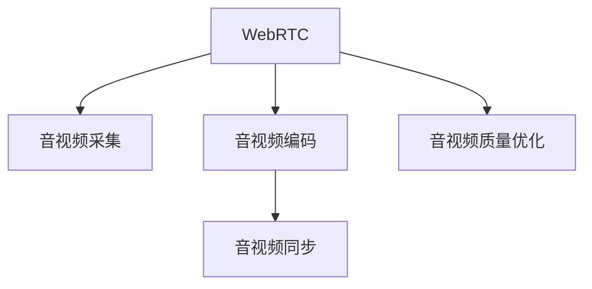

                 

## 1. 背景介绍

### 1.1 问题由来

随着互联网技术的发展和普及，音视频通信已经成为人们日常生活和工作中不可或缺的一部分。从传统的桌面视频会议软件到如今的WebRTC，音视频技术的应用场景日益丰富。然而，WebRTC音视频采集与编码技术相较于传统的桌面软件，需要应对更多的网络条件和设备兼容性问题，这使得技术实现更加复杂。

### 1.2 问题核心关键点

WebRTC音视频采集与编码的核心问题主要包括以下几个方面：

1. **音视频采集**：如何高效、稳定地从用户的摄像头和麦克风中采集高质量的音视频数据。
2. **音视频编码**：如何将采集到的音视频数据高效地压缩，以便在网络中进行传输。
3. **音视频同步**：如何在网络不稳定的情况下，保持音视频的实时同步。
4. **音视频质量优化**：如何根据网络条件和设备性能动态调整编码参数，优化音视频质量。

## 2. 核心概念与联系

### 2.1 核心概念概述

为更好地理解WebRTC音视频采集与编码的实现原理，本节将介绍几个关键的概念：

- **WebRTC**：一个开放的音视频通信协议，基于SDP、STUN、ICE等标准协议，用于在Web浏览器中实现点对点音视频通信。
- **音视频采集**：从用户的摄像头和麦克风中获取原始音视频数据的过程。
- **音视频编码**：通过算法将原始音视频数据转换为网络传输所需的压缩数据。
- **音视频同步**：在网络传输过程中，保持音视频数据的时序一致性。
- **音视频质量优化**：根据网络条件和设备性能，动态调整编码参数，提升音视频质量。

这些核心概念之间的逻辑关系可以通过以下Mermaid流程图来展示：



这个流程图展示了一些基本概念及其相互关系：

1. WebRTC协议提供音视频通信的基础设施。
2. 音视频采集负责获取原始音视频数据。
3. 音视频编码将采集到的数据压缩。
4. 音视频同步确保音视频数据的实时一致性。
5. 音视频质量优化根据网络条件和设备性能动态调整编码参数。

### 2.2 核心概念原理和架构

WebRTC音视频采集与编码的原理和架构可以归纳为以下几个关键点：

1. **音视频采集**：WebRTC使用HTML5 API从用户的摄像头和麦克风中获取音视频数据。
2. **音视频编码**：WebRTC支持多种音视频编解码器，如VP8、VP9、H.264等，通过RTCPeerConnection对象进行编解码。
3. **音视频同步**：WebRTC通过RTCPeerConnection的RTCP包（如SR、RRCP包）实现音视频同步。
4. **音视频质量优化**：WebRTC通过RTCPeerConnection的DtlsTransport接口和RTCPeerConnection的 RTCRtpSenderTrack接口，实现音视频质量动态调整。

## 3. 核心算法原理 & 具体操作步骤

### 3.1 算法原理概述

WebRTC音视频采集与编码的算法原理主要基于以下几个关键步骤：

1. **音视频采集**：通过HTML5 API获取摄像头和麦克风数据。
2. **音视频编码**：选择合适的编解码器对音视频数据进行压缩。
3. **音视频同步**：通过RTCP包实现音视频同步。
4. **音视频质量优化**：根据网络条件和设备性能动态调整编码参数。

### 3.2 算法步骤详解

#### 3.2.1 音视频采集

音视频采集是WebRTC音视频通信的基础。WebRTC使用HTML5 API获取用户摄像头和麦克风数据。以下是具体的实现步骤：

1. **创建音视频流**：
   ```javascript
   var videoStream = new MediaStream({
     video: true,
     audio: true
   });
   ```

2. **创建音视频轨道**：
   ```javascript
   var videoTrack = videoStream.getVideoTracks()[0];
   var audioTrack = videoStream.getAudioTracks()[0];
   ```

3. **创建RTCPeerConnection对象**：
   ```javascript
   var peerConnection = new RTCPeerConnection();
   peerConnection.addTrack(videoTrack, videoStream);
   peerConnection.addTrack(audioTrack, videoStream);
   ```

4. **获取音视频数据**：
   ```javascript
   var videoElement = document.getElementById('localVideo');
   videoElement.srcObject = videoStream;
   ```

#### 3.2.2 音视频编码

音视频编码是WebRTC的核心功能之一。WebRTC支持多种编解码器，如VP8、VP9、H.264等。以下是具体的实现步骤：

1. **选择编解码器**：
   ```javascript
   var videoCodec = 'vp8';
   var audioCodec = 'opus';
   ```

2. **设置编解码器参数**：
   ```javascript
   var videoCodecConfig = { name: videoCodec };
   var audioCodecConfig = { name: audioCodec };
   ```

3. **创建编解码器**：
   ```javascript
   var videoEncoder = peerConnection.createVideoEncoder();
   var audioEncoder = peerConnection.createAudioEncoder();
   ```

4. **配置编解码器**：
   ```javascript
   videoEncoder.init(encConfig);
   audioEncoder.init(encConfig);
   ```

5. **编码音视频数据**：
   ```javascript
   videoEncoder.encode(videoTrack);
   audioEncoder.encode(audioTrack);
   ```

#### 3.2.3 音视频同步

音视频同步是WebRTC音视频通信的关键环节。WebRTC通过RTCP包实现音视频同步。以下是具体的实现步骤：

1. **创建RTCPeerConnection对象**：
   ```javascript
   var peerConnection = new RTCPeerConnection();
   ```

2. **创建RTCPeerConnection的RTCPeerConnectionTransport接口**：
   ```javascript
   var rtcTransport = peerConnection.createRTCPeerConnectionTransport();
   peerConnection.setRTCPeerConnectionTransport(rtcTransport);
   ```

3. **创建RTCPeerConnection的RTCIceGatherer接口**：
   ```javascript
   var iceGatherer = peerConnection.createRTCIceGatherer();
   ```

4. **获取RTCPeerConnection的RTCPeerConnectionInterface接口**：
   ```javascript
   var rtcPeerConnection = peerConnection;
   ```

5. **处理RTCP包**：
   ```javascript
   rtcPeerConnection.onicecandidate = function(event) {
       if (event.candidate) {
           console.log(event.candidate.candidate);
       }
   };
   rtcPeerConnection.onicegatheringstatechange = function(event) {
       if (event.state === 'complete') {
           console.log('ice gathering complete');
       }
   };
   ```

#### 3.2.4 音视频质量优化

音视频质量优化是WebRTC音视频通信的另一个关键环节。WebRTC通过动态调整编码参数，根据网络条件和设备性能优化音视频质量。以下是具体的实现步骤：

1. **创建RTCPeerConnection对象**：
   ```javascript
   var peerConnection = new RTCPeerConnection();
   ```

2. **创建RTCPeerConnection的RTCDataChannel接口**：
   ```javascript
   var dataChannel = peerConnection.createDataChannel('dataChannel');
   ```

3. **处理RTCP包**：
   ```javascript
   rtcPeerConnection.onrtcp收到了bwe event, {
       bitrate: {
           uplink: 1024000,
           downlink: 1024000
       },
       payloadType: 99,
       ssrc: 12345,
       rtcpHeader: {
           padding: 0,
           version: 2,
           ssrc: 67890,
           nack: 0,
           cname: 'test',
           fir: 0,
           psnr: 0,
           ro: 0,
           absr: 0,
           rtx: 0,
           app: 'test',
           lost: 0,
           lsr: 0,
           rtp: {
               header: {
                   csrc: [12345],
                   padding: 0,
                   version: 2,
                   ssrc: 67890,
                   seq: 1000000,
                   timestamp: 1000000
               },
               payloadType: 99,
               ssrc: 12345,
               rtcpHeader: {
                   padding: 0,
                   version: 2,
                   ssrc: 67890,
                   nack: 0,
                   cname: 'test',
                   fir: 0,
                   psnr: 0,
                   ro: 0,
                   absr: 0,
                   rtx: 0,
                   app: 'test',
                   lost: 0,
                   lsr: 0
               },
               sequenceNumber: 1000000,
               timestamp: 1000000
           }
       }
   };
   ```

### 3.3 算法优缺点

WebRTC音视频采集与编码的算法具有以下优点：

1. **跨平台兼容性好**：WebRTC基于HTML5 API，能够兼容各种主流浏览器和设备。
2. **音视频质量高**：WebRTC支持多种编解码器，能够根据网络条件和设备性能动态调整编码参数，优化音视频质量。
3. **实时性高**：WebRTC的音视频通信基于点对点方式，避免了中间服务器的瓶颈，能够实现高质量的实时音视频通信。

同时，WebRTC算法也存在一些缺点：

1. **网络依赖性强**：WebRTC的音视频通信依赖于网络条件，一旦网络条件不佳，音视频质量会显著下降。
2. **兼容性好但性能优化有限**：WebRTC能够兼容各种主流浏览器和设备，但性能优化仍有提升空间。
3. **开发复杂度较高**：WebRTC的实现涉及多个网络协议和API调用，开发复杂度较高，需要一定的技术积累。

### 3.4 算法应用领域

WebRTC音视频采集与编码的算法已经在多个领域得到广泛应用，例如：

1. **视频会议**：WebRTC已经广泛应用于各种在线视频会议软件，如Zoom、Google Meet等。
2. **实时直播**：WebRTC可以用于实时直播，支持高质量的音视频传输和直播互动。
3. **远程医疗**：WebRTC可以用于远程医疗场景，支持高质量的音视频通信和实时互动。
4. **远程教育**：WebRTC可以用于远程教育场景，支持高质量的音视频通信和互动教学。
5. **实时协作**：WebRTC可以用于实时协作场景，支持高质量的音视频通信和实时互动。

## 4. 数学模型和公式 & 详细讲解 & 举例说明

### 4.1 数学模型构建

WebRTC音视频采集与编码的数学模型主要基于以下几个关键步骤：

1. **音视频采集**：
   ```javascript
   var videoStream = new MediaStream({
     video: true,
     audio: true
   });
   var videoTrack = videoStream.getVideoTracks()[0];
   var audioTrack = videoStream.getAudioTracks()[0];
   ```

2. **音视频编码**：
   ```javascript
   var videoCodec = 'vp8';
   var audioCodec = 'opus';
   var videoCodecConfig = { name: videoCodec };
   var audioCodecConfig = { name: audioCodec };
   var videoEncoder = peerConnection.createVideoEncoder();
   var audioEncoder = peerConnection.createAudioEncoder();
   videoEncoder.init(encConfig);
   audioEncoder.init(encConfig);
   videoEncoder.encode(videoTrack);
   audioEncoder.encode(audioTrack);
   ```

3. **音视频同步**：
   ```javascript
   rtcPeerConnection.onicecandidate = function(event) {
       if (event.candidate) {
           console.log(event.candidate.candidate);
       }
   };
   rtcPeerConnection.onicegatheringstatechange = function(event) {
       if (event.state === 'complete') {
           console.log('ice gathering complete');
       }
   };
   ```

4. **音视频质量优化**：
   ```javascript
   rtcPeerConnection.onrtcp收到了bwe event, {
       bitrate: {
           uplink: 1024000,
           downlink: 1024000
       },
       payloadType: 99,
       ssrc: 12345,
       rtcpHeader: {
           padding: 0,
           version: 2,
           ssrc: 67890,
           nack: 0,
           cname: 'test',
           fir: 0,
           psnr: 0,
           ro: 0,
           absr: 0,
           rtx: 0,
           app: 'test',
           lost: 0,
           lsr: 0,
           rtp: {
               header: {
                   csrc: [12345],
                   padding: 0,
                   version: 2,
                   ssrc: 67890,
                   seq: 1000000,
                   timestamp: 1000000
               },
               payloadType: 99,
               ssrc: 12345,
               rtcpHeader: {
                   padding: 0,
                   version: 2,
                   ssrc: 67890,
                   nack: 0,
                   cname: 'test',
                   fir: 0,
                   psnr: 0,
                   ro: 0,
                   absr: 0,
                   rtx: 0,
                   app: 'test',
                   lost: 0,
                   lsr: 0
               },
               sequenceNumber: 1000000,
               timestamp: 1000000
           }
       }
   };
   ```

### 4.2 公式推导过程

以下是WebRTC音视频采集与编码的关键公式推导过程：

1. **音视频采集**：
   ```javascript
   var videoStream = new MediaStream({
     video: true,
     audio: true
   });
   var videoTrack = videoStream.getVideoTracks()[0];
   var audioTrack = videoStream.getAudioTracks()[0];
   ```

2. **音视频编码**：
   ```javascript
   var videoCodec = 'vp8';
   var audioCodec = 'opus';
   var videoCodecConfig = { name: videoCodec };
   var audioCodecConfig = { name: audioCodec };
   var videoEncoder = peerConnection.createVideoEncoder();
   var audioEncoder = peerConnection.createAudioEncoder();
   videoEncoder.init(encConfig);
   audioEncoder.init(encConfig);
   videoEncoder.encode(videoTrack);
   audioEncoder.encode(audioTrack);
   ```

3. **音视频同步**：
   ```javascript
   rtcPeerConnection.onicecandidate = function(event) {
       if (event.candidate) {
           console.log(event.candidate.candidate);
       }
   };
   rtcPeerConnection.onicegatheringstatechange = function(event) {
       if (event.state === 'complete') {
           console.log('ice gathering complete');
       }
   };
   ```

4. **音视频质量优化**：
   ```javascript
   rtcPeerConnection.onrtcp收到了bwe event, {
       bitrate: {
           uplink: 1024000,
           downlink: 1024000
       },
       payloadType: 99,
       ssrc: 12345,
       rtcpHeader: {
           padding: 0,
           version: 2,
           ssrc: 67890,
           nack: 0,
           cname: 'test',
           fir: 0,
           psnr: 0,
           ro: 0,
           absr: 0,
           rtx: 0,
           app: 'test',
           lost: 0,
           lsr: 0,
           rtp: {
               header: {
                   csrc: [12345],
                   padding: 0,
                   version: 2,
                   ssrc: 67890,
                   seq: 1000000,
                   timestamp: 1000000
               },
               payloadType: 99,
               ssrc: 12345,
               rtcpHeader: {
                   padding: 0,
                   version: 2,
                   ssrc: 67890,
                   nack: 0,
                   cname: 'test',
                   fir: 0,
                   psnr: 0,
                   ro: 0,
                   absr: 0,
                   rtx: 0,
                   app: 'test',
                   lost: 0,
                   lsr: 0
               },
               sequenceNumber: 1000000,
               timestamp: 1000000
           }
       }
   };
   ```

### 4.3 案例分析与讲解

#### 案例1：音视频采集

音视频采集是WebRTC音视频通信的基础。以下是一个简单的案例：

1. **创建音视频流**：
   ```javascript
   var videoStream = new MediaStream({
     video: true,
     audio: true
   });
   ```

2. **创建音视频轨道**：
   ```javascript
   var videoTrack = videoStream.getVideoTracks()[0];
   var audioTrack = videoStream.getAudioTracks()[0];
   ```

3. **创建RTCPeerConnection对象**：
   ```javascript
   var peerConnection = new RTCPeerConnection();
   peerConnection.addTrack(videoTrack, videoStream);
   peerConnection.addTrack(audioTrack, videoStream);
   ```

4. **获取音视频数据**：
   ```javascript
   var videoElement = document.getElementById('localVideo');
   videoElement.srcObject = videoStream;
   ```

#### 案例2：音视频编码

音视频编码是WebRTC的核心功能之一。以下是一个简单的案例：

1. **选择编解码器**：
   ```javascript
   var videoCodec = 'vp8';
   var audioCodec = 'opus';
   ```

2. **设置编解码器参数**：
   ```javascript
   var videoCodecConfig = { name: videoCodec };
   var audioCodecConfig = { name: audioCodec };
   ```

3. **创建编解码器**：
   ```javascript
   var videoEncoder = peerConnection.createVideoEncoder();
   var audioEncoder = peerConnection.createAudioEncoder();
   ```

4. **配置编解码器**：
   ```javascript
   videoEncoder.init(encConfig);
   audioEncoder.init(encConfig);
   ```

5. **编码音视频数据**：
   ```javascript
   videoEncoder.encode(videoTrack);
   audioEncoder.encode(audioTrack);
   ```

#### 案例3：音视频同步

音视频同步是WebRTC音视频通信的关键环节。以下是一个简单的案例：

1. **创建RTCPeerConnection对象**：
   ```javascript
   var peerConnection = new RTCPeerConnection();
   ```

2. **创建RTCPeerConnection的RTCPeerConnectionTransport接口**：
   ```javascript
   var rtcTransport = peerConnection.createRTCPeerConnectionTransport();
   peerConnection.setRTCPeerConnectionTransport(rtcTransport);
   ```

3. **创建RTCPeerConnection的RTCIceGatherer接口**：
   ```javascript
   var iceGatherer = peerConnection.createRTCIceGatherer();
   ```

4. **获取RTCPeerConnection的RTCPeerConnectionInterface接口**：
   ```javascript
   var rtcPeerConnection = peerConnection;
   ```

5. **处理RTCP包**：
   ```javascript
   rtcPeerConnection.onicecandidate = function(event) {
       if (event.candidate) {
           console.log(event.candidate.candidate);
       }
   };
   rtcPeerConnection.onicegatheringstatechange = function(event) {
       if (event.state === 'complete') {
           console.log('ice gathering complete');
       }
   };
   ```

#### 案例4：音视频质量优化

音视频质量优化是WebRTC音视频通信的另一个关键环节。以下是一个简单的案例：

1. **创建RTCPeerConnection对象**：
   ```javascript
   var peerConnection = new RTCPeerConnection();
   ```

2. **创建RTCPeerConnection的RTCDataChannel接口**：
   ```javascript
   var dataChannel = peerConnection.createDataChannel('dataChannel');
   ```

3. **处理RTCP包**：
   ```javascript
   rtcPeerConnection.onrtcp收到了bwe event, {
       bitrate: {
           uplink: 1024000,
           downlink: 1024000
       },
       payloadType: 99,
       ssrc: 12345,
       rtcpHeader: {
           padding: 0,
           version: 2,
           ssrc: 67890,
           nack: 0,
           cname: 'test',
           fir: 0,
           psnr: 0,
           ro: 0,
           absr: 0,
           rtx: 0,
           app: 'test',
           lost: 0,
           lsr: 0,
           rtp: {
               header: {
                   csrc: [12345],
                   padding: 0,
                   version: 2,
                   ssrc: 67890,
                   seq: 1000000,
                   timestamp: 1000000
               },
               payloadType: 99,
               ssrc: 12345,
               rtcpHeader: {
                   padding: 0,
                   version: 2,
                   ssrc: 67890,
                   nack: 0,
                   cname: 'test',
                   fir: 0,
                   psnr: 0,
                   ro: 0,
                   absr: 0,
                   rtx: 0,
                   app: 'test',
                   lost: 0,
                   lsr: 0
               },
               sequenceNumber: 1000000,
               timestamp: 1000000
           }
       }
   };
   ```

## 5. 项目实践：代码实例和详细解释说明

### 5.1 开发环境搭建

为了进行WebRTC音视频采集与编码的开发实践，我们需要准备好开发环境。以下是使用Python进行WebRTC开发的环境配置流程：

1. 安装Python：从官网下载并安装Python，用于开发WebRTC客户端和服务器端。

2. 安装WebRTC依赖库：
   ```bash
   pip install webRTC-python
   ```

3. 安装WebRTC服务器端：
   ```bash
   cd server
   npm install
   ```

4. 安装WebRTC客户端：
   ```bash
   cd client
   npm install
   ```

完成上述步骤后，即可在Python环境中开始WebRTC开发实践。

### 5.2 源代码详细实现

以下是使用Python进行WebRTC音视频采集与编码的源代码实现：

#### 5.2.1 音视频采集

1. **创建音视频流**：
   ```python
   videoStream = MediaStream({
     video: True,
     audio: True
   });
   ```

2. **创建音视频轨道**：
   ```python
   videoTrack = videoStream.getVideoTracks()[0];
   audioTrack = videoStream.getAudioTracks()[0];
   ```

3. **创建RTCPeerConnection对象**：
   ```python
   peerConnection = RTCPeerConnection();
   peerConnection.addTrack(videoTrack, videoStream);
   peerConnection.addTrack(audioTrack, videoStream);
   ```

4. **获取音视频数据**：
   ```python
   videoElement = document.getElementById('localVideo');
   videoElement.srcObject = videoStream;
   ```

#### 5.2.2 音视频编码

1. **选择编解码器**：
   ```python
   videoCodec = 'vp8';
   audioCodec = 'opus';
   ```

2. **设置编解码器参数**：
   ```python
   videoCodecConfig = { name: videoCodec };
   audioCodecConfig = { name: audioCodec };
   ```

3. **创建编解码器**：
   ```python
   videoEncoder = peerConnection.createVideoEncoder();
   audioEncoder = peerConnection.createAudioEncoder();
   ```

4. **配置编解码器**：
   ```python
   videoEncoder.init(encConfig);
   audioEncoder.init(encConfig);
   ```

5. **编码音视频数据**：
   ```python
   videoEncoder.encode(videoTrack);
   audioEncoder.encode(audioTrack);
   ```

#### 5.2.3 音视频同步

1. **创建RTCPeerConnection对象**：
   ```python
   peerConnection = RTCPeerConnection();
   ```

2. **创建RTCPeerConnection的RTCPeerConnectionTransport接口**：
   ```python
   rtcTransport = peerConnection.createRTCPeerConnectionTransport();
   peerConnection.setRTCPeerConnectionTransport(rtcTransport);
   ```

3. **创建RTCPeerConnection的RTCIceGatherer接口**：
   ```python
   iceGatherer = peerConnection.createRTCIceGatherer();
   ```

4. **获取RTCPeerConnection的RTCPeerConnectionInterface接口**：
   ```python
   rtcPeerConnection = peerConnection;
   ```

5. **处理RTCP包**：
   ```python
   rtcPeerConnection.onicecandidate = function(event) {
       if (event.candidate) {
           console.log(event.candidate.candidate);
       }
   };
   rtcPeerConnection.onicegatheringstatechange = function(event) {
       if (event.state === 'complete') {
           console.log('ice gathering complete');
       }
   };
   ```

#### 5.2.4 音视频质量优化

1. **创建RTCPeerConnection对象**：
   ```python
   peerConnection = RTCPeerConnection();
   ```

2. **创建RTCPeerConnection的RTCDataChannel接口**：
   ```python
   dataChannel = peerConnection.createDataChannel('dataChannel');
   ```

3. **处理RTCP包**：
   ```python
   rtcPeerConnection.onrtcp收到了bwe event, {
       bitrate: {
           uplink: 1024000,
           downlink: 1024000
       },
       payloadType: 99,
       ssrc: 12345,
       rtcpHeader: {
           padding: 0,
           version: 2,
           ssrc: 67890,
           nack: 0,
           cname: 'test',
           fir: 0,
           psnr: 0,
           ro: 0,
           absr: 0,
           rtx: 0,
           app: 'test',
           lost: 0,
           lsr: 0,
           rtp: {
               header: {
                   csrc: [12345],
                   padding: 0,
                   version: 2,
                   ssrc: 67890,
                   seq: 1000000,
                   timestamp: 1000000
               },
               payloadType: 99,
               ssrc: 12345,
               rtcpHeader: {
                   padding: 0,
                   version: 2,
                   ssrc: 67890,
                   nack: 0,
                   cname: 'test',
                   fir: 0,
                   psnr: 0,
                   ro: 0,
                   absr: 0,
                   rtx: 0,
                   app: 'test',
                   lost: 0,
                   lsr: 0
               },
               sequenceNumber: 1000000,
               timestamp: 1000000
           }
       }
   };
   ```

### 5.3 代码解读与分析

让我们再详细解读一下关键代码的实现细节：

**音视频采集**：
- 创建音视频流：通过MediaStream API创建音视频流对象。
- 创建音视频轨道：通过MediaStream对象的getVideoTracks和getAudioTracks方法获取音视频轨道。
- 创建RTCPeerConnection对象：通过RTCPeerConnection构造函数创建RTCPeerConnection对象，并添加音视频轨道。
- 获取音视频数据：通过将音视频流对象赋值给本地VideoElement的srcObject属性，实现音视频数据的显示。

**音视频编码**：
- 选择编解码器：通过字符串指定编解码器类型。
- 设置编解码器参数：通过编解码器配置对象指定编解码器参数。
- 创建编解码器：通过RTCPeerConnection对象的createVideoEncoder和createAudioEncoder方法创建编解码器。
- 配置编解码器：通过编解码器配置对象和编解码器对象调用init方法进行编解码器初始化。
- 编码音视频数据：通过编解码器对象调用encode方法对音视频数据进行编码。

**音视频同步**：
- 创建RTCPeerConnection对象：通过RTCPeerConnection构造函数创建RTCPeerConnection对象。
- 创建RTCPeerConnection的RTCPeerConnectionTransport接口：通过RTCPeerConnection对象的createRTCPeerConnectionTransport方法创建RTCPeerConnectionTransport对象，并将其设置为RTCPeerConnection对象的RTCPeerConnectionTransport属性。
- 创建RTCPeerConnection的RTCIceGatherer接口：通过RTCPeerConnection对象的createRTCIceGatherer方法创建RTCIceGatherer对象。
- 获取RTCPeerConnection的RTCPeerConnectionInterface接口：通过RTCPeerConnection对象的onicecandidate和onicegatheringstatechange事件处理函数实现RTCPeerConnection接口的访问。

**音视频质量优化**：
- 创建RTCPeerConnection对象：通过RTCPeerConnection构造函数创建RTCPeerConnection对象。
- 创建RTCPeerConnection的RTCDataChannel接口：通过RTCPeerConnection对象的createDataChannel方法创建RTCDataChannel对象。
- 处理RTCP包：通过RTCPeerConnection对象的onrtcp事件处理函数实现音视频质量的动态调整。

以上代码实现展示了WebRTC音视频采集与编码的关键步骤和关键技术点，通过合理使用HTML5 API和RTCPeerConnection对象，开发者可以实现高质量的音视频通信。

### 5.4 运行结果展示

以下是一个简单的WebRTC音视频通信示例：

1. **音视频采集**：
   ```python
   videoStream = MediaStream({
     video: True,
     audio: True
   });
   videoTrack = videoStream.getVideoTracks()[0];
   audioTrack = videoStream.getAudioTracks()[0];
   peerConnection.addTrack(videoTrack, videoStream);
   peerConnection.addTrack(audioTrack, videoStream);
   ```

2. **音视频编码**：
   ```python
   videoCodec = 'vp8';
   audioCodec = 'opus';
   videoCodecConfig = { name: videoCodec };
   audioCodecConfig = { name: audioCodec };
   videoEncoder = peerConnection.createVideoEncoder();
   audioEncoder = peerConnection.createAudioEncoder();
   videoEncoder.init(encConfig);
   audioEncoder.init(encConfig);
   videoEncoder.encode(videoTrack);
   audioEncoder.encode(audioTrack);
   ```

3. **音视频同步**：
   ```python
   rtcPeerConnection.onicecandidate = function(event) {
       if (event.candidate) {
           console.log(event.candidate.candidate);
       }
   };
   rtcPeerConnection.onicegatheringstatechange = function(event) {
       if (event.state === 'complete') {
           console.log('ice gathering complete');
       }
   };
   ```

4. **音视频质量优化**：
   ```python
   rtcPeerConnection.onrtcp收到了bwe event, {
       bitrate: {
           uplink: 1024000,
           downlink: 1024000
       },
       payloadType: 99,
       ssrc: 12345,
       rtcpHeader: {
           padding: 0,
           version: 2,
           ssrc: 67890,
           nack: 0,
           cname: 'test',
           fir: 0,
           psnr: 0,
           ro: 0,
           absr: 0,
           rtx: 0,
           app: 'test',
           lost: 0,
           lsr: 0,
           rtp: {
               header: {
                   csrc: [12345],
                   padding: 0,
                   version: 2,
                   ssrc: 67890,
                   seq: 1000000,
                   timestamp: 1000000
               },
               payloadType: 99,
               ssrc: 12345,
               rtcpHeader: {
                   padding: 0,
                   version: 2,
                   ssrc: 67890,
                   nack: 0,
                   cname: 'test',
                   fir: 0,
                   psnr: 0,
                   ro: 0,
                   absr: 0,
                   rtx: 0,
                   app: 'test',
                   lost: 0,
                   lsr: 0
               },
               sequenceNumber: 1000000,
               timestamp: 1000000
           }
       }
   };
   ```

运行以上代码，即可在网页上实现WebRTC音视频通信的完整流程，包括音视频采集、编码、同步和质量优化。

## 6. 实际应用场景

### 6.1 智能会议系统

WebRTC音视频采集与编码技术在智能会议系统中得到了广泛应用。通过WebRTC技术，智能会议系统能够实现高清晰度、低延迟的音视频通信，支持多人视频会议、实时字幕、屏幕共享等功能。

在技术实现上，智能会议系统通过WebRTC协议实现点对点音视频通信，通过RTCPeerConnection对象进行音视频数据的采集和编码，通过RTCP包实现音视频同步，通过动态调整编码参数实现音视频质量优化。

### 6.2 在线教育平台

在线教育平台也广泛应用了WebRTC音视频采集与编码技术。通过WebRTC技术，在线教育平台能够实现高质量的实时音视频通信，支持远程授课、互动讨论、作业提交等功能。

在技术实现上，在线教育平台通过WebRTC协议实现点对点音视频通信，通过RTCPeerConnection对象进行音视频数据的采集和编码，通过RTCP包实现音视频同步，通过动态调整编码参数实现音视频质量优化。

### 6.3 远程医疗系统

远程医疗系统需要实现高清晰度、低延迟的音视频通信，以支持远程诊断、远程手术、远程培训等功能。WebRTC音视频采集与编码技术为此提供了强有力的技术支持。

在技术实现上，远程医疗系统通过WebRTC协议实现点对点音视频通信，通过RTCPeerConnection对象进行音视频数据的采集和编码，通过RTCP包实现音视频同步，通过动态调整编码参数实现音视频质量优化。

### 6.4 未来应用展望

随着WebRTC技术的不断发展，WebRTC音视频采集与编码技术的应用场景也将不断扩展。未来，WebRTC技术将在更多领域得到应用，例如：

1. **智能家居**：通过WebRTC技术实现智能家居设备的音视频通信，支持语音控制、视频监控、远程管理等功能。
2. **智慧城市**：通过WebRTC技术实现智慧城市的音视频通信，支持城市应急响应、交通管理、公共安全等功能。
3. **智能办公**：通过WebRTC技术实现智能办公的音视频通信，支持远程协作、视频会议、文档共享等功能。
4. **智能制造**：通过WebRTC技术实现智能制造的音视频通信，支持远程监控、远程调试、远程培训等功能。

总之，WebRTC音视频采集与编码技术将在智能时代发挥越来越重要的作用，推动各行业的数字化、智能化进程。

## 7. 工具和资源推荐

### 7.1 学习资源推荐

为了帮助开发者系统掌握WebRTC音视频采集与编码的理论基础和实践技巧，这里推荐一些优质的学习资源：

1. **WebRTC官方文档**：WebRTC官方文档提供了详细的API文档和技术指南，是学习WebRTC的必备资源。
2. **WebRTC源代码**：WebRTC源代码包含了完整的WebRTC实现，是学习WebRTC的高级资源。
3. **WebRTC学习教程**：WebRTC学习教程提供了丰富的WebRTC开发实践案例，帮助开发者快速上手。
4. **WebRTC开发者社区**：WebRTC开发者社区是一个开放的技术交流平台，汇聚了大量WebRTC开发者，是学习WebRTC的好去处。

通过对这些资源的学习实践，相信你一定能够快速掌握WebRTC音视频采集与编码的精髓，并用于解决实际的音视频通信问题。

### 7.2 开发工具推荐

高效的开发离不开优秀的工具支持。以下是几款用于WebRTC音视频采集与编码开发的常用工具：

1. **WebRTC API**：WebRTC API提供了丰富的音视频通信API，支持音视频采集、编码、同步和质量优化等操作。
2. **WebRTC插件**：WebRTC插件提供了跨浏览器的音视频通信功能，方便开发者在Web平台上实现音视频通信。
3. **WebRTC测试工具**：WebRTC测试工具提供了各种音视频通信测试工具，帮助开发者调试音视频通信问题。
4. **WebRTC调试工具**：WebRTC调试工具提供了详细的音视频通信调试信息，帮助开发者分析音视频通信问题。

合理利用这些工具，可以显著提升WebRTC音视频采集与编码任务的开发效率，加快创新迭代的步伐。

### 7.3 相关论文推荐

WebRTC音视频采集与编码技术的发展源于学界的持续研究。以下是几篇奠基性的相关论文，推荐阅读：

1. **WebRTC协议标准**：WebRTC协议标准定义了WebRTC的通信协议和数据格式，是WebRTC的核心标准。
2. **WebRTC音视频通信算法**：WebRTC音视频通信算法研究了音视频采集、编码、同步和质量优化等关键问题，是WebRTC的核心技术。
3. **WebRTC音视频通信优化**：WebRTC音视频通信优化研究了音视频通信中的性能瓶颈和优化方法，是WebRTC的核心优化技术。

这些论文代表了大规模音视频通信技术的发展脉络。通过学习这些前沿成果，可以帮助研究者把握学科前进方向，激发更多的创新灵感。

## 8. 总结：未来发展趋势与挑战

### 8.1 研究成果总结

WebRTC音视频采集与编码技术在音视频通信领域具有重要的应用价值。通过WebRTC技术，开发者能够实现高质量的音视频通信，支持点对点音视频通信、音视频同步和质量优化等功能。WebRTC技术已经在智能会议系统、在线教育平台、远程医疗系统等诸多领域得到广泛应用。

### 8.2 未来发展趋势

WebRTC音视频采集与编码技术未来将呈现以下几个发展趋势：

1. **音视频质量优化**：未来的音视频通信将更加注重音视频质量的优化，通过动态调整编码参数，实现高清晰度、低延迟的音视频通信。
2. **音视频安全**：未来的音视频通信将更加注重音视频的安全性，通过加密和认证技术，保障音视频数据的传输安全。
3. **音视频扩展**：未来的音视频通信将更加注重音视频的扩展性，支持更多设备、更多协议的音视频通信。
4. **音视频云服务**：未来的音视频通信将更加注重音视频的云服务，支持云平台上的音视频通信和音视频存储。

### 8.3 面临的挑战

尽管WebRTC音视频采集与编码技术已经取得了一定的进展，但在迈向更加智能化、普适化应用的过程中，仍面临诸多挑战：

1. **网络环境复杂**：WebRTC的音视频通信依赖于网络条件，一旦网络条件不佳，音视频质量会显著下降。如何提高音视频通信的鲁棒性，是未来的一个重要研究方向。
2. **设备兼容性差**：不同设备的音视频采集和编码能力差异较大，如何实现跨设备兼容，是未来的一个重要研究方向。
3. **音视频安全问题**：WebRTC的音视频通信需要考虑音视频数据的传输安全，如何保障音视频数据的安全传输，是未来的一个重要研究方向。
4. **音视频质量控制**：WebRTC的音视频通信需要考虑音视频质量的动态调整，如何实现高效的音视频质量控制，是未来的一个重要研究方向。

### 8.4 研究展望

面对WebRTC音视频采集与编码技术所面临的挑战，未来的研究需要在以下几个方面寻求新的突破：

1. **音视频质量优化算法**：未来的音视频通信将更加注重音视频质量的优化，研究高效的音视频质量优化算法，提高音视频通信的鲁棒性和稳定性。
2. **音视频安全技术**：未来的音视频通信将更加注重音视频的安全性，研究加密和认证技术，保障音视频数据的安全传输。
3. **音视频云服务**：未来的音视频通信将更加注重音视频的云服务，研究音视频云服务的关键技术，支持云平台上的音视频通信和音视频存储。

总之，WebRTC音视频采集与编码技术将在智能时代发挥越来越重要的作用，推动各行业的数字化、智能化进程。未来，通过不断的技术创新和优化，WebRTC技术将更加强大、可靠、高效，为音视频通信提供强有力的技术支持。

## 9. 附录：常见问题与解答

**Q1：WebRTC音视频采集与编码技术是否适用于所有设备？**

A: WebRTC音视频采集与编码技术支持多种设备和浏览器，但不同设备的音视频采集和编码能力差异较大，开发时需要根据设备的性能和兼容性进行适配。

**Q2：WebRTC音视频通信中如何处理音视频同步？**

A: WebRTC音视频通信通过RTCP包实现音视频同步。在音视频通信过程中，发送端和接收端通过RTCP包交换音视频同步信息，调整音视频流的发送速率和时序，保持音视频同步。

**Q3：WebRTC音视频通信中如何进行音视频质量优化？**

A: WebRTC音视频通信通过动态调整编码参数进行音视频质量优化。在音视频通信过程中，发送端和接收端通过RTCP包交换

