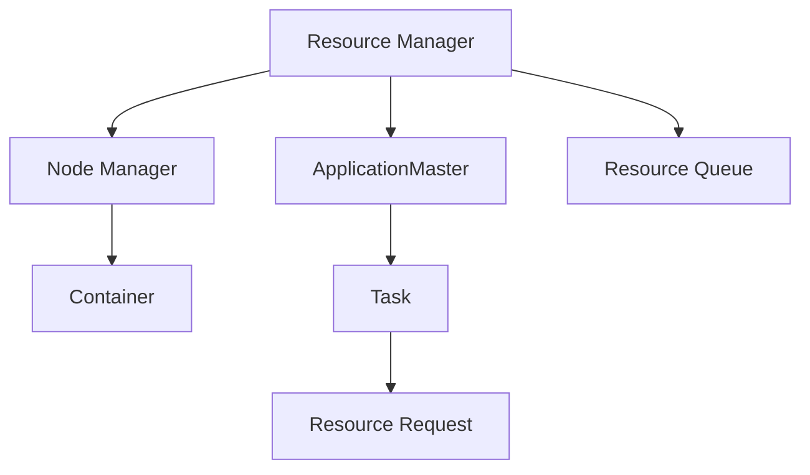

                 

# YARN Resource Manager原理与代码实例讲解

> 关键词：YARN, Resource Manager, Cluster Management, Hadoop, 分布式计算, 资源调度, 云计算, MapReduce

## 1. 背景介绍

在当今大数据时代，分布式计算和云计算已变得越来越重要。随着数据量的爆炸式增长和计算任务的复杂化，传统集中式计算模式已经无法满足需求。因此，分布式计算框架应运而生，其中最具代表性的是Apache Hadoop。然而，仅仅有计算框架还不足以应对大规模数据处理的挑战，还需要一个强大的资源管理器来管理集群资源。YARN（Yet Another Resource Negotiator）就是在这种背景下诞生的。

YARN是Apache Hadoop 2.x版本中的核心组件之一，主要负责集群资源的调度和管理。YARN引入了“主-从”架构，由Master节点和多个Worker节点组成。Master节点负责资源调度、应用跟踪和日志收集等任务，而Worker节点则负责实际任务的执行。YARN通过两个关键组件实现资源管理：Resource Manager（RM）和Node Manager（NM）。RM负责集群资源的分配和回收，NM负责监听RM调度指令并执行任务。

## 2. 核心概念与联系

### 2.1 核心概念概述

为更好地理解YARN Resource Manager的工作原理和架构，本节将介绍几个密切相关的核心概念：

- Resource Manager：YARN集群资源的分配和管理中心，负责全局资源调度和应用调度。
- Node Manager：集群中的每个节点上运行，负责接收RM分配的任务，并将计算资源分配给不同的容器。
- ApplicationMaster：负责调度管理单个应用的资源，包括任务提交、状态监控、资源申请等。
- 资源队列：根据不同需求将应用分组，例如按优先级、资源需求等。
- Container：YARN中最小计算单位，包含任务所需的所有资源，如CPU、内存、磁盘等。

这些核心概念之间的逻辑关系可以通过以下Mermaid流程图来展示：



这个流程图展示了这个系统中各个组件的角色和它们之间的联系：

1. Resource Manager是整个系统的中央调度器，负责集群资源的分配。
2. Node Manager是每个节点上的守护进程，负责接收RM的调度指令，并将任务分配给不同的Container。
3. ApplicationMaster是每个应用（如MapReduce任务）的局部调度器，负责管理单个应用的生命周期。
4. 资源队列根据不同的需求将应用分组，如优先级、资源需求等。
5. Container是YARN中的最小计算单位，包含任务所需的所有资源。

## 3. 核心算法原理 & 具体操作步骤

### 3.1 算法原理概述

YARN Resource Manager的资源调度算法基于资源请求和竞争。每个应用在运行前需要向RM申请所需的资源（如CPU、内存等），RM会基于资源队列和系统负载情况，决定是否分配资源。如果资源申请成功，RM会分配Container给该应用，并将任务提交给Node Manager执行。应用在运行过程中，根据实际需求向NM申请资源，NM会向RM申请新的Container。

YARN Resource Manager的资源调度算法主要包括以下几个步骤：

1. 资源请求：应用向RM申请所需的资源。
2. 资源分配：RM根据资源队列和系统负载情况，决定是否分配资源。
3. 任务提交：资源申请成功后，RM将Container分配给应用，并将任务提交给Node Manager执行。
4. 资源监控：应用在运行过程中，根据实际需求向NM申请资源，NM会向RM申请新的Container。

### 3.2 算法步骤详解

YARN Resource Manager的资源调度算法主要包括以下几个关键步骤：

#### 3.2.1 资源队列管理

YARN通过资源队列对应用进行分组，每个队列根据不同需求设置优先级和资源限制。资源队列由RM管理，负责将资源请求映射到合适的队列中。

1. 队列创建：管理员通过YARN命令行工具创建资源队列，设置队列的资源限制和优先级。
2. 队列绑定：将应用提交到指定的队列中，应用在运行前需要向RM申请所需的资源。
3. 队列调度：RM根据队列的优先级和资源限制，决定是否分配资源。

#### 3.2.2 资源分配算法

YARN采用基于时间片轮转（Round Robin）的资源分配算法，确保每个队列公平地获取资源。RM将可用资源按照时间片轮转到不同的队列，每个队列在轮转周期内获取一定比例的资源。

1. 时间片轮转：RM将可用资源按照时间片轮转到不同的队列，每个队列在轮转周期内获取一定比例的资源。
2. 资源分配：RM根据队列的优先级和资源限制，决定是否分配资源。优先级高的队列将优先获取资源，而低优先级的队列需要等待。
3. 资源调度：RM将分配的资源以Container的形式分配给应用，并将任务提交给Node Manager执行。

#### 3.2.3 资源监控与调整

YARN通过资源监控和调整机制，实时跟踪应用资源使用情况，并根据实际情况进行动态调整。

1. 资源监控：NM向RM定期汇报资源使用情况，RM根据监控数据进行资源调整。
2. 资源调整：RM根据监控数据和应用需求，调整资源的分配策略，确保系统资源的合理利用。

### 3.3 算法优缺点

YARN Resource Manager的资源调度算法具有以下优点：

1. 公平性：通过资源队列和轮转算法，确保每个队列公平地获取资源。
2. 灵活性：支持不同的资源队列和优先级设置，可以满足不同应用的需求。
3. 可扩展性：YARN支持大规模集群部署，可以轻松扩展到数千个节点。

同时，该算法也存在以下局限性：

1. 资源竞争：当多个应用同时申请资源时，可能会出现资源竞争的情况，影响系统的稳定性。
2. 资源浪费：如果某个应用在运行过程中只使用了部分资源，会造成资源浪费。
3. 调度延迟：当集群资源紧张时，调度延迟会增加，影响系统的响应速度。
4. 调度复杂性：资源队列和调度策略的设置复杂，需要管理员进行细致的配置。

### 3.4 算法应用领域

YARN Resource Manager的资源调度算法广泛应用于各种分布式计算和大数据处理场景，包括：

- 数据湖：大规模数据的存储、处理和分析，如Hadoop Distributed File System (HDFS)。
- 大规模数据处理：基于MapReduce和Spark等框架的分布式计算任务，如大数据报表、ETL等。
- 实时流处理：如Apache Storm、Apache Flink等流处理框架，用于实时数据处理和分析。
- 人工智能和机器学习：用于训练大规模机器学习模型，如TensorFlow分布式训练。

## 4. 数学模型和公式 & 详细讲解 & 举例说明

### 4.1 数学模型构建

YARN Resource Manager的资源调度算法基于资源请求和竞争，可以通过数学模型进行描述。设集群中共有 $n$ 个节点，每个节点有 $m$ 个CPU核心和 $k$ 个内存单元。应用 $A_i$ 需要 $c_i$ 个CPU核心和 $d_i$ 个内存单元。RM根据资源队列和系统负载情况，决定是否分配资源。假设资源队列中第 $j$ 个队列的应用数量、CPU核心需求和内存需求分别为 $N_{jc}$、$N_{jc}c_j$ 和 $N_{jd}$。则RM的资源调度算法可以表示为：

1. 资源请求：应用 $A_i$ 向RM申请 $c_i$ 个CPU核心和 $d_i$ 个内存单元。
2. 资源分配：RM根据资源队列和系统负载情况，决定是否分配资源。假设应用 $A_i$ 申请资源成功后，RM分配 $x_i$ 个CPU核心和 $y_i$ 个内存单元，其中 $x_i \leq c_i$ 和 $y_i \leq d_i$。
3. 任务提交：RM将分配的资源以Container的形式分配给应用 $A_i$，并将任务提交给Node Manager执行。

### 4.2 公式推导过程

假设每个节点有 $m$ 个CPU核心和 $k$ 个内存单元，应用 $A_i$ 需要 $c_i$ 个CPU核心和 $d_i$ 个内存单元。资源队列中第 $j$ 个队列的应用数量、CPU核心需求和内存需求分别为 $N_{jc}$、$N_{jc}c_j$ 和 $N_{jd}$。

**资源请求模型**

每个应用 $A_i$ 在运行前需要向RM申请所需的资源。假设应用 $A_i$ 申请 $c_i$ 个CPU核心和 $d_i$ 个内存单元，即：

$$
\begin{align*}
c_i &= \text{CPU需求} \\
d_i &= \text{内存需求}
\end{align*}
$$

**资源分配模型**

RM根据资源队列和系统负载情况，决定是否分配资源。假设应用 $A_i$ 申请资源成功后，RM分配 $x_i$ 个CPU核心和 $y_i$ 个内存单元，其中 $x_i \leq c_i$ 和 $y_i \leq d_i$，即：

$$
\begin{align*}
x_i &= \text{分配的CPU核心数} \\
y_i &= \text{分配的内存单元数}
\end{align*}
$$

**任务提交模型**

RM将分配的资源以Container的形式分配给应用 $A_i$，并将任务提交给Node Manager执行。假设应用 $A_i$ 申请的资源在节点上分配成功，则RM将分配 $x_i$ 个CPU核心和 $y_i$ 个内存单元给应用 $A_i$，即：

$$
\begin{align*}
c_i &= \text{申请的CPU核心数} \\
d_i &= \text{申请的内存单元数}
\end{align*}
$$

### 4.3 案例分析与讲解

以下以一个简单的案例来分析YARN Resource Manager的资源调度算法：

假设集群中共有5个节点，每个节点有2个CPU核心和1GB内存。有2个应用 $A_1$ 和 $A_2$，其中 $A_1$ 需要2个CPU核心和1GB内存，$A_2$ 需要1个CPU核心和0.5GB内存。

1. 资源请求：

   $A_1$ 申请2个CPU核心和1GB内存，$A_2$ 申请1个CPU核心和0.5GB内存。

2. 资源分配：

   由于每个节点有2个CPU核心和1GB内存，RM将分配2个CPU核心和1GB内存给 $A_1$，同时分配1个CPU核心和0.5GB内存给 $A_2$。

3. 任务提交：

   RM将分配的资源以Container的形式分配给 $A_1$ 和 $A_2$，并将任务提交给Node Manager执行。

通过这个简单的案例，可以看出YARN Resource Manager的资源调度算法的核心思想是通过资源队列和轮转算法，公平地分配集群资源，确保每个应用都能得到所需的资源。

## 5. 项目实践：代码实例和详细解释说明

### 5.1 开发环境搭建

在进行YARN Resource Manager项目开发前，需要先搭建好开发环境。以下是使用Python进行YARN开发的配置流程：

1. 安装Hadoop：从官网下载并安装Hadoop，将其添加到系统路径中。
2. 安装YARN：在Hadoop的基础上安装YARN，确保YARN正常启动。
3. 配置YARN资源队列：通过YARN命令行工具配置资源队列，设置队列的资源限制和优先级。
4. 编写应用代码：根据项目需求编写应用代码，并进行必要的调试。

完成上述步骤后，即可在Hadoop集群中启动YARN，并开始进行应用开发。

### 5.2 源代码详细实现

我们以一个简单的MapReduce任务为例，展示如何使用Python编写YARN应用，并使用YARN Resource Manager进行资源调度。

首先，定义Map函数：

```python
from mrjob.job import MRJob
from mrjob.step import MRStep

class MapReduce(MRJob):
    def mapper(self, _, line):
        word, count = line.split('\t')
        yield word, int(count)

    def reducer(self, word, counts):
        yield word, sum(counts)
```

然后，定义YARN应用的入口函数：

```python
def main():
    with MRJob() as mj:
        mj.run()
```

接下来，配置YARN资源队列：

```python
# 创建资源队列
yarn queue create -q myqueue -c 2,1

# 应用提交到资源队列
yarn queue add application -q myqueue -application_id myapp
```

最后，启动YARN应用：

```python
yarn jar myapp.jar
```

这样就可以通过YARN Resource Manager对应用进行资源调度，并启动MapReduce任务。

### 5.3 代码解读与分析

让我们再详细解读一下关键代码的实现细节：

**MapReduce代码**

MapReduce应用是基于mrjob库实现的，其核心函数包括`mapper`和`reducer`。`mapper`函数负责将输入数据分割成多个键值对，`reducer`函数负责合并相同的键值对。

**资源队列配置**

YARN资源队列通过YARN命令行工具进行配置，包括创建队列和添加应用。创建队列时，需要设置队列的资源限制和优先级。

**应用提交**

应用提交到YARN集群时，需要指定应用ID和资源队列。YARN Resource Manager会根据资源队列和系统负载情况，决定是否分配资源。

## 6. 实际应用场景

### 6.1 大数据处理

YARN Resource Manager在大数据处理领域得到了广泛应用，用于处理大规模数据存储、处理和分析任务。通过将数据分布式存储在HDFS中，并使用YARN Resource Manager进行资源调度，可以高效地进行大规模数据处理。YARN Resource Manager支持多种数据处理框架，如MapReduce、Spark等，可以灵活地满足不同的数据处理需求。

### 6.2 实时流处理

YARN Resource Manager在实时流处理领域也有广泛应用。通过将实时数据流分布式存储在HDFS中，并使用YARN Resource Manager进行资源调度，可以实现实时数据处理和分析。YARN支持多种实时流处理框架，如Apache Storm、Apache Flink等，可以高效地进行实时数据处理。

### 6.3 分布式机器学习

YARN Resource Manager在分布式机器学习领域也有广泛应用。通过将大规模机器学习任务分布式执行，并使用YARN Resource Manager进行资源调度，可以高效地进行大规模机器学习训练和推理。YARN支持多种分布式机器学习框架，如TensorFlow、PyTorch等，可以灵活地满足不同的机器学习需求。

### 6.4 未来应用展望

随着云计算和分布式计算技术的不断进步，YARN Resource Manager将在更多领域得到应用，为各行各业带来变革性影响。

在智慧医疗领域，YARN可以用于处理大规模医疗数据，支持医学图像处理、基因组学分析等任务，加速医疗科技的发展。

在智慧城市治理中，YARN可以用于处理城市事件监测、舆情分析、应急指挥等任务，提高城市管理的自动化和智能化水平。

在智能制造领域，YARN可以用于处理大规模制造数据，支持工业互联网、智能制造等任务，推动制造业的数字化转型。

此外，在金融、电信、能源、农业等多个领域，YARN Resource Manager也将得到广泛应用，为各行业带来新的发展机遇。

## 7. 工具和资源推荐

### 7.1 学习资源推荐

为了帮助开发者系统掌握YARN Resource Manager的理论基础和实践技巧，这里推荐一些优质的学习资源：

1. 《Hadoop YARN官方文档》：YARN的官方文档，提供详细的API参考和配置指南，是YARN学习的重要资源。
2. 《Hadoop实战》：一部面向开发者的Hadoop实战指南，涵盖YARN Resource Manager的配置和管理。
3. 《大数据技术与应用》：一本面向大数据领域从业者的基础教程，详细介绍了Hadoop和YARN的工作原理和应用场景。
4. 《云计算基础》：一本面向云计算领域从业者的基础教程，详细介绍了云计算和YARN的工作原理和应用场景。
5. 《Hadoop YARN实战》：一本面向开发者的实战指南，详细介绍了YARN Resource Manager的配置和管理。

通过对这些资源的学习实践，相信你一定能够快速掌握YARN Resource Manager的精髓，并用于解决实际问题。

### 7.2 开发工具推荐

高效的开发离不开优秀的工具支持。以下是几款用于YARN开发的常用工具：

1. Hadoop：开源的分布式计算框架，提供了YARN Resource Manager的底层支持。
2. YARN命令行工具：YARN自带的命令行工具，用于配置和管理YARN资源队列。
3. Cloudera Manager：Apache Hadoop的商业发行版，提供友好的Web界面和管理工具，方便YARN Resource Manager的部署和管理。
4. Ambari：Apache Hadoop的管理和监控工具，提供友好的Web界面和监控工具，方便YARN Resource Manager的部署和管理。
5. HDFS命令行工具：Hadoop自带的命令行工具，用于管理HDFS文件系统。

合理利用这些工具，可以显著提升YARN Resource Manager的开发效率，加快创新迭代的步伐。

### 7.3 相关论文推荐

YARN Resource Manager的发展源于学界的持续研究。以下是几篇奠基性的相关论文，推荐阅读：

1. "Yet Another Resource Negotiator: A Resource Management Protocol for Apache Hadoop"：YARN的原始论文，介绍YARN的架构和调度算法。
2. "A Framework for Distributed Storage and Compute: HDFS"：HDFS的原始论文，介绍Hadoop文件系统的基本原理和实现。
3. "MapReduce: Simplified Data Processing on Large Clusters"：MapReduce的原始论文，介绍MapReduce框架的基本原理和实现。
4. "Hadoop: The Next Generation Computing System Structure"：Hadoop的原始论文，介绍Hadoop框架的基本原理和实现。

这些论文代表了大数据处理技术的发展脉络。通过学习这些前沿成果，可以帮助研究者把握学科前进方向，激发更多的创新灵感。

## 8. 总结：未来发展趋势与挑战

### 8.1 总结

本文对YARN Resource Manager进行了全面系统的介绍。首先阐述了YARN Resource Manager的背景和意义，明确了其在集群资源管理中的重要地位。其次，从原理到实践，详细讲解了YARN Resource Manager的资源调度算法，提供了完整的代码实现和分析。同时，本文还广泛探讨了YARN Resource Manager在大数据处理、实时流处理、分布式机器学习等多个领域的应用前景，展示了其在云计算和大数据处理中的强大实力。

通过本文的系统梳理，可以看出YARN Resource Manager在大数据处理、实时流处理和分布式计算等领域的应用前景广阔，正在成为分布式计算框架中的重要组成部分。YARN Resource Manager通过资源队列和轮转算法，实现了公平、灵活、可扩展的资源调度，满足了大规模数据处理的需求。未来，伴随技术的不断进步，YARN Resource Manager必将在更多领域得到应用，为各行各业带来新的变革。

### 8.2 未来发展趋势

展望未来，YARN Resource Manager将呈现以下几个发展趋势：

1. 更加高效灵活的资源调度算法：未来YARN将引入更加高效的资源调度算法，如基于博弈论的调度算法，提升系统的响应速度和资源利用率。
2. 更加多样化的资源类型：未来YARN将支持更多类型的资源，如GPU、TPU等，适应不同应用场景的需求。
3. 更加广泛的生态系统：未来YARN将与其他云计算平台、大数据框架、人工智能框架等进行更深入的集成，提升系统的综合性能。
4. 更加智能化和自动化：未来YARN将引入更多的智能化和自动化技术，如自动调优、自动扩缩容等，提升系统的管理效率和可靠性。

以上趋势凸显了YARN Resource Manager在云计算和大数据处理领域的广阔前景。这些方向的探索发展，必将进一步提升YARN Resource Manager的性能和应用范围，为各行各业带来新的变革。

### 8.3 面临的挑战

尽管YARN Resource Manager已经取得了瞩目成就，但在迈向更加智能化、普适化应用的过程中，它仍面临着诸多挑战：

1. 资源竞争：当多个应用同时申请资源时，可能会出现资源竞争的情况，影响系统的稳定性。
2. 资源浪费：如果某个应用在运行过程中只使用了部分资源，会造成资源浪费。
3. 调度延迟：当集群资源紧张时，调度延迟会增加，影响系统的响应速度。
4. 调度复杂性：资源队列和调度策略的设置复杂，需要管理员进行细致的配置。
5. 性能瓶颈：当集群规模增大时，性能瓶颈会变得更加明显，影响系统的可扩展性。

### 8.4 研究展望

面对YARN Resource Manager所面临的挑战，未来的研究需要在以下几个方面寻求新的突破：

1. 引入更加高效的资源调度算法：如基于博弈论的调度算法，提升系统的响应速度和资源利用率。
2. 支持更多类型的资源：如GPU、TPU等，适应不同应用场景的需求。
3. 引入更多的智能化和自动化技术：如自动调优、自动扩缩容等，提升系统的管理效率和可靠性。
4. 引入更加灵活和多样化的资源队列：根据不同应用的需求，灵活设置资源队列的优先级和资源限制。

这些研究方向的探索，必将引领YARN Resource Manager技术迈向更高的台阶，为分布式计算和大数据处理带来新的突破。面向未来，YARN Resource Manager需要通过技术创新和实践优化，进一步提升系统的性能和可靠性，推动云计算和大数据技术的持续进步。

## 9. 附录：常见问题与解答

**Q1：YARN的资源调度算法有哪些优点和缺点？**

A: YARN的资源调度算法有以下优点：
1. 公平性：通过资源队列和轮转算法，确保每个队列公平地获取资源。
2. 灵活性：支持不同的资源队列和优先级设置，可以满足不同应用的需求。
3. 可扩展性：YARN支持大规模集群部署，可以轻松扩展到数千个节点。

同时，该算法也存在以下缺点：
1. 资源竞争：当多个应用同时申请资源时，可能会出现资源竞争的情况，影响系统的稳定性。
2. 资源浪费：如果某个应用在运行过程中只使用了部分资源，会造成资源浪费。
3. 调度延迟：当集群资源紧张时，调度延迟会增加，影响系统的响应速度。
4. 调度复杂性：资源队列和调度策略的设置复杂，需要管理员进行细致的配置。

**Q2：如何使用YARN进行资源队列管理？**

A: 使用YARN进行资源队列管理，需要经过以下步骤：
1. 创建资源队列：通过YARN命令行工具创建资源队列，设置队列的资源限制和优先级。
2. 绑定应用到队列：将应用提交到指定的队列中，应用在运行前需要向RM申请所需的资源。
3. 调度资源：RM根据队列的优先级和资源限制，决定是否分配资源。

**Q3：如何优化YARN的资源分配策略？**

A: 优化YARN的资源分配策略，可以通过以下方法：
1. 引入更加高效的资源调度算法：如基于博弈论的调度算法，提升系统的响应速度和资源利用率。
2. 支持更多类型的资源：如GPU、TPU等，适应不同应用场景的需求。
3. 引入更多的智能化和自动化技术：如自动调优、自动扩缩容等，提升系统的管理效率和可靠性。
4. 引入更加灵活和多样化的资源队列：根据不同应用的需求，灵活设置资源队列的优先级和资源限制。

**Q4：YARN Resource Manager有哪些实际应用场景？**

A: YARN Resource Manager在多个领域都有广泛应用，包括：
1. 大数据处理：如Hadoop Distributed File System (HDFS)、MapReduce、Spark等。
2. 实时流处理：如Apache Storm、Apache Flink等。
3. 分布式机器学习：如TensorFlow、PyTorch等。
4. 智慧医疗：处理大规模医疗数据，支持医学图像处理、基因组学分析等任务。
5. 智慧城市治理：处理城市事件监测、舆情分析、应急指挥等任务。
6. 智能制造：处理大规模制造数据，支持工业互联网、智能制造等任务。

**Q5：如何优化YARN Resource Manager的开发效率？**

A: 优化YARN Resource Manager的开发效率，可以通过以下方法：
1. 使用高效的工具：如Hadoop、YARN命令行工具、Cloudera Manager等，提升开发效率。
2. 采用模块化设计：将复杂的任务拆分为多个模块，方便调试和扩展。
3. 引入自动化的测试和部署工具：如Jenkins、Ansible等，提升开发效率和可靠性。
4. 引入更加智能化的管理工具：如自动调优、自动扩缩容等，提升系统的管理效率和可靠性。

通过这些优化措施，可以显著提升YARN Resource Manager的开发效率，加快创新迭代的步伐。

