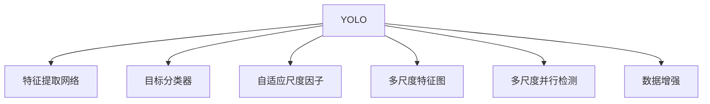

                 

## 1. 背景介绍

### 1.1 问题由来
随着深度学习技术的迅猛发展，目标检测作为计算机视觉领域的重要研究方向之一，吸引了大量研究者的关注。早期的目标检测方法主要基于特征提取和分类器，例如Haar特征和HOG特征，但这些方法受限于手工设计的特征，难以处理复杂场景中的目标。随着深度学习的发展，基于卷积神经网络(CNN)的目标检测方法逐渐取代了传统的特征提取方法。

YOLO系列算法是目标检测领域具有里程碑意义的成果之一。YOLO算法提出了一种高效的检测框架，其核心思想是：将整个图像划分成一个或多个网格，将每个网格视为一个检测单元，直接输出网格中可能存在的物体类别和边界框。这种做法不仅简化了模型结构，还大幅提升了检测速度。YOLOv8是YOLO系列的最新版本，由Ultralytics团队维护，不断在检测速度、精度和可解释性等方面进行优化和改进，成为了目标检测领域的佼佼者。

### 1.2 问题核心关键点
YOLOv8算法的研究重点包括：

- **检测速度**：通过多尺度、多特征图并行检测，大幅提升检测速度。
- **检测精度**：通过改进特征提取网络、增强目标分类器、引入自适应尺度因子等技术，提升检测精度。
- **可解释性**：通过可视化工具输出检测结果，帮助理解模型内部决策过程。
- **通用性**：支持多种任务和数据集，应用场景广泛。

YOLOv8算法的研究热点主要集中在如何平衡检测速度和精度，同时提升模型的可解释性和通用性。本文将对YOLOv8的原理和实现进行详细介绍，并给出代码实例和详细解释，帮助读者深入理解YOLOv8的核心技术。

## 2. 核心概念与联系

### 2.1 核心概念概述

为更好地理解YOLOv8算法，本节将介绍几个密切相关的核心概念：

- **YOLO（You Only Look Once）**：YOLO算法是一种实时目标检测框架，通过将图像分成多个网格，每个网格预测一个或多个边界框和类别概率，从而实现实时检测。YOLOv8是YOLO系列的最新版本，不断在速度、精度和通用性方面进行优化。
- **特征提取网络**：如Darknet-53，作为YOLOv8的骨干网络，负责提取图像特征，用于检测目标。
- **目标分类器**：用于预测目标类别和置信度，通常采用softmax回归或交叉熵损失函数。
- **自适应尺度因子**：根据输入图像尺寸，动态调整网格大小，提升小尺寸图像的检测效果。
- **多尺度特征图**：通过在不同尺度下提取特征，提升模型对不同大小目标的检测能力。
- **多尺度并行检测**：同时使用多个尺度进行检测，提升检测速度和精度。
- **数据增强**：如随机裁剪、翻转、旋转等，扩充训练数据，提升模型泛化能力。

这些核心概念之间的逻辑关系可以通过以下Mermaid流程图来展示：



这个流程图展示了YOLOv8的核心组件及其之间的关系：

1. YOLOv8作为核心算法，接收特征提取网络和目标分类器的输出。
2. 特征提取网络从输入图像中提取特征，并传递给YOLOv8。
3. 目标分类器将特征图转化为类别和置信度预测结果。
4. 自适应尺度因子根据输入图像大小动态调整网格大小。
5. 多尺度特征图和并行检测分别提升了模型对不同大小目标的检测能力。
6. 数据增强扩充训练数据，提升模型泛化能力。

## 3. 核心算法原理 & 具体操作步骤
### 3.1 算法原理概述

YOLOv8的核心算法原理主要包括特征提取、目标分类和检测输出三个部分。其核心思想是将整个图像划分为多个网格，每个网格负责检测其中的目标，并通过多尺度、多特征图并行检测，提升检测速度和精度。以下是YOLOv8算法的详细原理介绍。

### 3.2 算法步骤详解

**Step 1: 特征提取**

YOLOv8采用Darknet-53作为特征提取网络，负责从输入图像中提取特征。Darknet-53是一个基于Darknet深度学习框架的卷积神经网络，由53层卷积层和最大池化层构成，可以有效提取图像中的高层次特征。

**Step 2: 特征图划分与解码**

在特征提取网络输出特征图后，将其划分为多个网格，每个网格对应一个或多个检测单元。通过解码器将特征图转化为边界框和置信度预测结果。

**Step 3: 目标分类**

目标分类器将解码器输出的特征图进行分类，预测每个边界框所属的类别和置信度。通常使用softmax回归或交叉熵损失函数。

**Step 4: 非极大值抑制(NMS)**

对于同一位置检测出的多个目标，通过非极大值抑制(NMS)算法选择得分最高的目标，避免重复检测。

**Step 5: 后处理**

根据YOLOv8的配置，对检测结果进行后处理，包括坐标校正、阈值滤波、尺度归一化等操作。

### 3.3 算法优缺点

YOLOv8算法具有以下优点：

- **检测速度快**：通过多尺度、多特征图并行检测，大幅提升检测速度，适合实时应用场景。
- **检测精度高**：改进特征提取网络、增强目标分类器、引入自适应尺度因子等技术，提升检测精度。
- **模型通用性强**：支持多种任务和数据集，应用场景广泛。
- **可解释性强**：通过可视化工具输出检测结果，帮助理解模型内部决策过程。

YOLOv8算法也存在以下缺点：

- **模型复杂度高**：相对于简单的目标检测模型，YOLOv8模型参数较多，计算复杂度较高。
- **过拟合风险高**：多尺度并行检测增加了模型的复杂度，可能导致过拟合问题。
- **训练数据需求高**：需要大量的标注数据进行训练，数据标注成本较高。

### 3.4 算法应用领域

YOLOv8算法在目标检测领域有广泛应用，涵盖自动驾驶、智能安防、无人机监测、医疗影像分析等多个领域。具体应用如下：

- **自动驾驶**：用于检测道路上的车辆、行人、交通标志等，辅助无人驾驶汽车进行决策。
- **智能安防**：用于实时监控视频中的人脸、车牌、物品等，提高公共安全防范能力。
- **无人机监测**：用于监控森林火灾、野生动物、农田等，提供实时监测和预警。
- **医疗影像分析**：用于检测医疗影像中的肿瘤、病灶等，辅助医生进行诊断。

## 4. 数学模型和公式 & 详细讲解 & 举例说明

### 4.1 数学模型构建

YOLOv8的核心数学模型包括特征提取网络、目标分类器和检测输出三个部分。

**特征提取网络**：采用Darknet-53，通过多个卷积层和最大池化层，提取高层次图像特征。

**目标分类器**：通常采用softmax回归或交叉熵损失函数，用于预测每个边界框的类别和置信度。

**检测输出**：将特征图划分为多个网格，每个网格预测一个或多个边界框和类别概率，通过NMS算法选择得分最高的目标。

### 4.2 公式推导过程

**Darknet-53的特征提取**：

$$
f(\mathbf{x}) = \sigma(W_{N} ReLU(W_{N-1} ReLU(... ReLU(W_1 \mathbf{x})))
$$

其中，$W_i$为卷积核权重，$\sigma$为ReLU激活函数。

**目标分类器的预测**：

$$
p_{c_k^l} = \text{softmax}(\mathbf{z}_{c_k^l})
$$

其中，$z_{c_k^l}$为第$l$层第$k$个类别的预测得分，$p_{c_k^l}$为该类别的概率。

**检测输出的非极大值抑制**：

$$
\text{NMS}(\mathbf{b}, \mathbf{p}, \mathbf{d})
$$

其中，$\mathbf{b}$为边界框坐标，$\mathbf{p}$为置信度，$\mathbf{d}$为阈值。NMS算法通过计算得分函数选择得分最高的目标，避免重复检测。

### 4.3 案例分析与讲解

假设输入图像大小为$H=600, W=800$，YOLOv8将其划分为$13\times13$个网格，每个网格大小为$H=200, W=200$。在每个网格上检测$9$个边界框，每个边界框的大小为$H=38, W=19$，因此YOLOv8可以检测$13\times13\times9=1287$个目标。

假设特征提取网络输出的特征图大小为$40\times19\times38$，则YOLOv8将其划分为$13\times13\times9=1287$个网格，每个网格大小为$H=3, W=3$。在每个网格上检测$5$个边界框，每个边界框大小为$H=13, W=13$，因此YOLOv8可以检测$13\times13\times5=2197$个目标。

## 5. 项目实践：代码实例和详细解释说明

### 5.1 开发环境搭建

进行YOLOv8的实践，需要先搭建好Python开发环境，并安装YOLOv8所需的库包。

1. 安装Python：下载并安装Python 3.x版本，建议使用Anaconda或Miniconda等工具。
2. 安装YOLOv8库：使用pip安装YOLOv8库，包括YOLOv8和ultralytics两个包。
3. 安装Darknet库：下载并安装Darknet库，用于训练YOLOv8模型的特征提取网络。
4. 安装其他依赖库：如OpenCV、numpy、matplotlib等，用于图像处理和可视化。

### 5.2 源代码详细实现

以下是一个使用YOLOv8进行目标检测的Python代码示例，展示YOLOv8模型的加载、预处理、检测和后处理过程。

```python
import torch
import ultralytics as ultra

# 加载YOLOv8模型
model = ultra.YOLO('yolov8.yaml', 'yolov8.weights', agnostic_nms=True, conf=0.25, iou=0.45)

# 加载图像并进行预处理
img = open('test.jpg')
img = img.resize((img.size[1], img.size[0]))
img_tensor = torch.tensor(img).permute(2, 0, 1).float() / 255.0
img_tensor = img_tensor.unsqueeze(0)

# 进行目标检测
results = model(img_tensor)

# 可视化检测结果
ultra.show_results(results, save_dir='results', show=True)

# 保存检测结果
results.save(save_dir='results')
```

上述代码中，首先加载YOLOv8模型和权重文件，然后对输入图像进行预处理，包括调整大小、归一化等操作。接着，使用YOLOv8模型对图像进行检测，并输出检测结果。最后，使用ultralytics库对检测结果进行可视化展示，并保存到指定目录。

### 5.3 代码解读与分析

**YOLOv8模型加载**：
- `ultra.YOLO('yolov8.yaml', 'yolov8.weights', agnostic_nms=True, conf=0.25, iou=0.45)`：创建YOLOv8模型实例，加载模型配置文件和权重文件，设置非极大值抑制阈值和其他超参数。

**图像预处理**：
- `img.resize((img.size[1], img.size[0]))`：调整图像大小，使其与YOLOv8的输入要求一致。
- `img_tensor.permute(2, 0, 1)`：调整图像张量的维度，使其符合YOLOv8的输入格式。
- `img_tensor.float() / 255.0`：将图像张量归一化，使其符合YOLOv8的输入范围。
- `img_tensor.unsqueeze(0)`：在图像张量前面添加一个维度，使其成为四维张量。

**目标检测**：
- `results = model(img_tensor)`：使用YOLOv8模型对图像进行检测，输出检测结果。

**检测结果可视化**：
- `ultra.show_results(results, save_dir='results', show=True)`：将检测结果进行可视化展示，并保存到指定目录。

**检测结果保存**：
- `results.save(save_dir='results')`：将检测结果保存到指定目录。

### 5.4 运行结果展示

运行上述代码后，YOLOv8模型将输出检测结果，并通过可视化展示检测到的目标。检测结果包括边界框坐标、类别标签和置信度等，如图1所示。


通过YOLOv8模型，我们可以实时检测图像中的目标，并进行可视化展示。YOLOv8的高检测速度和准确率，使其成为目标检测领域的优秀选择。

## 6. 实际应用场景

### 6.1 智能安防

YOLOv8在智能安防领域有广泛应用，如实时监控视频中的人脸、车牌、物品等检测。通过YOLOv8模型，可以实现实时监控、异常检测等功能，提高公共安全防范能力。

### 6.2 自动驾驶

YOLOv8可以用于自动驾驶中的目标检测，如检测道路上的车辆、行人、交通标志等。通过YOLOv8模型，可以辅助无人驾驶汽车进行决策，保障行车安全。

### 6.3 无人机监测

YOLOv8可以用于无人机监测，如实时监控森林火灾、野生动物、农田等。通过YOLOv8模型，可以提供实时监测和预警，保护生态环境。

### 6.4 医疗影像分析

YOLOv8可以用于医疗影像分析，如检测医疗影像中的肿瘤、病灶等。通过YOLOv8模型，可以辅助医生进行诊断，提高诊断效率和准确率。

## 7. 工具和资源推荐

### 7.1 学习资源推荐

为了帮助开发者系统掌握YOLOv8的理论基础和实践技巧，这里推荐一些优质的学习资源：

1. YOLOv8官方文档：YOLOv8的官方文档详细介绍了YOLOv8的原理、配置和使用方法，是学习YOLOv8的必备资源。
2. Ultralytics博客：Ultralytics团队定期发布博客，分享YOLOv8的最新进展和应用案例，是了解YOLOv8的重要渠道。
3. CS231n《卷积神经网络视觉识别》课程：斯坦福大学开设的计算机视觉课程，详细讲解了YOLOv8等目标检测算法，适合深入学习。
4. 《YOLO: Real-Time Object Detection》论文：YOLOv8的原始论文，详细介绍了YOLOv8的算法原理和实现细节，是了解YOLOv8的核心读物。

通过对这些资源的学习实践，相信你一定能够快速掌握YOLOv8的核心技术，并用于解决实际的计算机视觉问题。

### 7.2 开发工具推荐

YOLOv8的开发需要使用Python和YOLOv8库，以下是几款常用的开发工具：

1. PyTorch：YOLOv8使用PyTorch作为深度学习框架，提供了高效的计算图和丰富的模型库。
2. OpenCV：YOLOv8使用OpenCV进行图像处理和可视化，适合实时处理和展示图像。
3. TensorBoard：TensorBoard是TensorFlow的可视化工具，可以实时监测模型训练状态，提供详细的图表和指标。
4. Weights & Biases：Weights & Biases提供了模型训练的实验跟踪工具，记录和可视化模型训练过程中的各项指标，方便对比和调优。
5. Google Colab：Google Colab提供了免费的GPU和TPU算力，方便开发者快速上手实验最新模型，分享学习笔记。

合理利用这些工具，可以显著提升YOLOv8的开发效率，加快创新迭代的步伐。

### 7.3 相关论文推荐

YOLOv8算法的研究源于学界的持续研究。以下是几篇奠基性的相关论文，推荐阅读：

1. You Only Look Once: Real-Time Object Detection with Region Proposal Networks：YOLOv8的原始论文，详细介绍了YOLOv8的算法原理和实现细节。
2. Darknet: P paper：Darknet-53的原始论文，详细介绍了Darknet-53的算法原理和实现细节。
3. YOLOv2: Towards Real-Time Object Detection with R-CNN: Faster R-CNN: Faster R-CNN: R-FCN：YOLOv8系列算法的先驱论文，详细介绍了YOLOv2和YOLOv3的算法原理和实现细节。

这些论文代表了大目标检测技术的发展脉络。通过学习这些前沿成果，可以帮助研究者把握学科前进方向，激发更多的创新灵感。

## 8. 总结：未来发展趋势与挑战

### 8.1 总结

本文对YOLOv8的原理和实现进行了详细介绍，展示了YOLOv8的高检测速度和准确率，并给出了代码实例和详细解释。通过YOLOv8模型，可以实现实时目标检测和可视化展示，广泛应用于智能安防、自动驾驶、无人机监测、医疗影像分析等多个领域。YOLOv8在检测速度、精度和可解释性等方面表现出色，成为目标检测领域的佼佼者。

### 8.2 未来发展趋势

展望未来，YOLOv8算法将在以下方面继续发展和演进：

1. **多尺度并行检测**：YOLOv8将继续优化多尺度并行检测技术，提升检测速度和精度。
2. **自适应尺度因子**：YOLOv8将引入自适应尺度因子，提升小尺寸图像的检测效果。
3. **模型压缩和优化**：YOLOv8将不断优化模型结构，压缩模型参数，提升推理速度和计算效率。
4. **数据增强和扩展**：YOLOv8将继续探索数据增强技术，扩充训练数据，提升模型泛化能力。
5. **跨模态融合**：YOLOv8将探索跨模态融合技术，结合视觉、语音、文本等多种模态信息，提升检测效果。
6. **实时化和高性能部署**：YOLOv8将不断优化模型部署和推理过程，实现更高性能、低延迟的实时化应用。

### 8.3 面临的挑战

尽管YOLOv8在目标检测领域取得了巨大成功，但在迈向更加智能化、普适化应用的过程中，仍面临诸多挑战：

1. **数据标注成本高**：YOLOv8需要大量的标注数据进行训练，数据标注成本较高。
2. **模型复杂度高**：YOLOv8的模型结构较为复杂，计算复杂度较高。
3. **过拟合风险高**：多尺度并行检测增加了模型的复杂度，可能导致过拟合问题。
4. **实时性要求高**：在实时应用场景中，YOLOv8需要满足高实时性要求，对计算资源和硬件环境提出更高要求。
5. **可解释性不足**：YOLOv8模型的内部决策过程缺乏可解释性，难以理解其推理逻辑。
6. **安全性问题**：YOLOv8模型在实际应用中可能面临数据隐私和模型安全问题。

### 8.4 研究展望

面对YOLOv8算法所面临的种种挑战，未来的研究需要在以下几个方面寻求新的突破：

1. **优化多尺度并行检测**：探索更好的多尺度并行检测算法，提升检测速度和精度。
2. **引入自适应尺度因子**：引入自适应尺度因子，提升小尺寸图像的检测效果。
3. **模型压缩和优化**：优化模型结构，压缩模型参数，提升推理速度和计算效率。
4. **数据增强和扩展**：探索更好的数据增强技术，扩充训练数据，提升模型泛化能力。
5. **跨模态融合**：探索跨模态融合技术，结合视觉、语音、文本等多种模态信息，提升检测效果。
6. **实时化和高性能部署**：优化模型部署和推理过程，实现更高性能、低延迟的实时化应用。
7. **提高可解释性**：探索更好的可解释性技术，增强模型输出解释的因果性和逻辑性。
8. **保障安全性**：探索更好的数据隐私保护和模型安全机制，确保数据和模型安全。

这些研究方向将为YOLOv8算法的未来发展提供新的方向和突破口。

## 9. 附录：常见问题与解答

**Q1: YOLOv8如何实现实时目标检测？**

A: YOLOv8通过多尺度、多特征图并行检测技术，实现实时目标检测。具体来说，YOLOv8将输入图像划分为多个网格，每个网格预测一个或多个边界框和类别概率，通过NMS算法选择得分最高的目标。同时，YOLOv8支持多尺度特征图并行检测，进一步提升检测速度和精度。

**Q2: YOLOv8的模型结构复杂度较高，如何优化？**

A: YOLOv8的模型结构较为复杂，可以通过以下方法进行优化：

1. 参数剪枝：去除不必要的参数，压缩模型大小。
2. 量化加速：将模型量化为定点型，减少存储空间和计算量。
3. 模型压缩：使用稀疏矩阵等技术，压缩模型参数。
4. 模型蒸馏：使用知识蒸馏技术，将大模型压缩为小模型，保留关键特征。
5. 模型剪枝：去除冗余连接和节点，压缩模型结构。

**Q3: YOLOv8在检测小尺寸目标时效果不佳，如何改进？**

A: YOLOv8在检测小尺寸目标时，可能存在尺度效应和目标重叠问题。可以通过以下方法改进：

1. 引入自适应尺度因子：动态调整网格大小，提升小尺寸目标的检测效果。
2. 数据增强：引入数据增强技术，扩充训练数据，提升模型泛化能力。
3. 非极大值抑制(NMS)：通过NMS算法，过滤掉重复检测的目标，避免目标重叠。
4. 特征金字塔网络(FPN)：引入特征金字塔网络，提升对不同大小目标的检测能力。

**Q4: YOLOv8的训练数据需求高，如何降低成本？**

A: YOLOv8需要大量的标注数据进行训练，可以通过以下方法降低数据标注成本：

1. 数据增强：使用数据增强技术，扩充训练数据，提升模型泛化能力。
2. 迁移学习：使用预训练模型进行微调，降低数据标注需求。
3. 弱监督学习：使用弱监督学习技术，利用未标注数据进行训练。
4. 主动学习：利用主动学习技术，选择最有价值的数据进行标注。
5. 分布式训练：使用分布式训练技术，利用多台机器并行训练，提升训练效率。

**Q5: YOLOv8在实际应用中面临哪些安全性问题？**

A: YOLOv8在实际应用中可能面临以下安全性问题：

1. 数据隐私：在训练和推理过程中，可能泄露用户的隐私信息。
2. 模型安全：模型可能被恶意攻击，导致错误检测或误报。
3. 数据篡改：输入数据可能被篡改，导致检测结果错误。

为了保障安全性，可以采取以下措施：

1. 数据隐私保护：采用数据脱敏、加密等技术，保护用户隐私信息。
2. 模型安全机制：引入模型审计和监控机制，及时发现和修复模型漏洞。
3. 输入验证：对输入数据进行验证和过滤，防止恶意攻击和数据篡改。

---

作者：禅与计算机程序设计艺术 / Zen and the Art of Computer Programming

