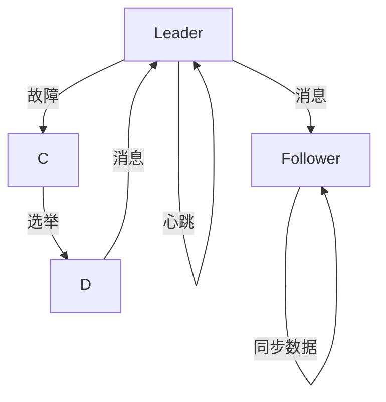

                 

# Zookeeper原理与代码实例讲解

> 关键词：Zookeeper,分布式协调服务,一致性协议,领导选举,代码实例

## 1. 背景介绍

### 1.1 问题由来
在分布式系统中，各个组件之间需要高效的协调和沟通，以保证系统的稳定性和可扩展性。常见的分布式协调服务包括Hadoop的HDFS、Hive、Spark，以及Spark中的RDD操作等。为了解决这种需求，我们引入了Zookeeper分布式协调服务。

### 1.2 问题核心关键点
- Zookeeper是一个开源的分布式协调服务，它提供了简单、高效的服务，主要应用于分布式系统中，用于实现可靠的配置管理、服务发现、分布式锁、分布式一致性等功能。
- Zookeeper的核心是主从复制和快速失败切换机制，它采用了ZAB(即Zookeeper Atomic Broadcast)协议来保证数据的一致性。
- Zookeeper的优点包括简单易用、扩展性好、支持数据持久化、跨语言接口支持、支持事务等。
- Zookeeper的缺点包括性能问题、易受网络波动影响等。

## 2. 核心概念与联系

### 2.1 核心概念概述

为了更好地理解Zookeeper的原理和实现，本节将介绍几个密切相关的核心概念：

- **Zookeeper**：分布式协调服务，提供数据持久化、配置管理、服务发现、分布式锁、分布式一致性等功能。
- **ZAB协议**：基于一致性协议来保证数据的一致性，ZAB是一种用于在分布式系统中保证数据一致性的算法。
- **节点(Node)**：Zookeeper中的基本操作单元，包括主节点和从节点。
- **会话(Session)**：客户端与Zookeeper建立连接后，被分配一个唯一的会话ID，用于标识客户端的身份。
- **数据(Znode)**：节点中的数据，可以是二进制数据、字符串或值。
- **事务(Transaction)**：Zookeeper中的基本操作，用于保证数据的一致性。

这些核心概念之间的逻辑关系可以通过以下Mermaid流程图来展示：

```mermaid
graph TB
    A[Zookeeper] --> B[ZAB协议]
    A --> C[节点(Node)]
    C --> D[主节点(Leader)]
    C --> E[从节点(Follower)]
    A --> F[会话(Session)]
    F --> G[数据(Znode)]
    A --> H[事务(Transaction)]
```

这个流程图展示了大语言模型的核心概念及其之间的关系：

1. Zookeeper通过ZAB协议保证数据一致性。
2. Zookeeper中的节点包括主节点和从节点，从节点会跟随主节点更新数据。
3. 会话用于标识客户端与Zookeeper的连接，是Zookeeper中重要的概念。
4. 数据是节点中的二进制数据、字符串或值，用于存储配置信息、服务状态等。
5. 事务是Zookeeper中的基本操作，保证数据的一致性。

这些概念共同构成了Zookeeper的框架，使其能够高效、可靠地提供分布式协调服务。

## 3. 核心算法原理 & 具体操作步骤

### 3.1 算法原理概述

Zookeeper的核心算法是ZAB协议，它基于一致性协议来保证数据的一致性。ZAB协议是一种基于Raft算法的轻量级协议，用于在分布式系统中保证数据的一致性。

### 3.2 算法步骤详解

以下是ZAB协议的详细步骤：

1. 初始化：系统初始化时，所有节点都从领导人位置启动，具有相同优先级。
2. 投票：每个节点随机生成一个优先级，每个节点向其他节点发送消息，以获取其他节点的状态。每个节点投票选出具有最高优先级的领导者。
3. 成功选举：具有最高优先级的节点成为领导人，开始服务。其他节点变为跟随者，并从领导人那里同步数据。
4. 数据同步：领导人将数据同步到所有跟随者节点。
5. 故障处理：当领导人故障时，跟随者会重新开始选举过程，选出新的领导人。

### 3.3 算法优缺点

ZAB协议的优点包括：

- 快速切换：当领导人故障时，跟随者会迅速重新选举新的领导人，保证系统的高可用性。
- 数据一致性：通过一致性协议保证数据的一致性。
- 简单高效：相对于Raft协议，ZAB协议更轻量级，易于实现和维护。

ZAB协议的缺点包括：

- 数据丢失：当网络中断时，数据可能丢失。
- 性能问题：由于节点间的通信开销较大，性能可能会受到影响。
- 容易受网络波动影响：当网络波动较大时，选举过程可能会被中断。

### 3.4 算法应用领域

ZAB协议主要用于Zookeeper中的数据一致性保证。它广泛应用于分布式系统中的数据同步、配置管理、服务发现、分布式锁等场景。

## 4. 数学模型和公式 & 详细讲解  
### 4.1 数学模型构建

ZAB协议的数学模型可以抽象为一种状态机，系统中有两种状态：领导人状态和跟随者状态。

领导人状态：
- 状态名称：Leader
- 职责：负责处理数据更新和同步请求。
- 转换条件：收到新消息。
- 转换动作：发送同步消息给跟随者。

跟随者状态：
- 状态名称：Follower
- 职责：同步数据并接收消息。
- 转换条件：收到领导人消息。
- 转换动作：回复领导人消息并同步数据。

### 4.2 公式推导过程

以下是ZAB协议的状态转换图：



从状态转换图可以看出，当领导人故障时，系统进入选举状态，选出新的领导人。领导人通过发送心跳消息来维持自己的状态，跟随者通过接收同步数据和消息来保持同步。

### 4.3 案例分析与讲解

假设一个有三个节点的Zookeeper系统，开始时都是 follower 状态，其中有两个 node1和node2，一个 follower 节点 node3。

1. node1 随机生成优先级，然后向其他节点发送消息，获得最高优先级。
2. node1 成为 leader，其他节点成为 follower。
3. node1 向其他节点发送同步数据。
4. node1 发送心跳消息，维持领导者状态。
5. node1 故障，节点进入选举状态，重新选举 leader。

## 5. 项目实践：代码实例和详细解释说明

### 5.1 开发环境搭建

在进行Zookeeper实践前，我们需要准备好开发环境。以下是使用Java进行Zookeeper开发的开发环境配置流程：

1. 安装JDK：从官网下载并安装JDK，用于编译和运行Java代码。
2. 安装Maven：从官网下载并安装Maven，用于管理Java项目依赖。
3. 创建Zookeeper项目：使用Maven创建Zookeeper项目，并添加依赖。

### 5.2 源代码详细实现

以下是Zookeeper项目中的主要代码实现：

```java
package com.zookeeper;

import java.io.IOException;
import java.util.concurrent.CountDownLatch;
import org.apache.zookeeper.*;
import org.apache.zookeeper.client.ZooKeeper;

public class ZookeeperClient {
    private ZooKeeper zookeeper;
    private String server;
    private int sessionTimeout;
    private CountDownLatch latch;

    public ZookeeperClient(String server, int sessionTimeout) {
        this.server = server;
        this.sessionTimeout = sessionTimeout;
        this.latch = new CountDownLatch(1);
    }

    public void connect() throws IOException, InterruptedException {
        zookeeper = new ZooKeeper(server, sessionTimeout, latch);
        latch.await();
    }

    public void disconnect() throws IOException {
        zookeeper.close();
    }

    public void create(String path, byte[] data) throws KeeperException, InterruptedException {
        zookeeper.create(path, data, ZooDefs.Ids.OPEN_ACL_UNSAFE, CreateMode.PERSISTENT);
    }

    public void delete(String path) throws KeeperException, InterruptedException {
        zookeeper.delete(path, -1);
    }

    public byte[] read(String path, Watcher watcher) throws KeeperException, InterruptedException {
        return zookeeper.getData(path, watcher, null);
    }

    public void addWatch(String path, Watcher watcher) throws KeeperException, InterruptedException {
        zookeeper.exists(path, watcher);
    }
}
```

### 5.3 代码解读与分析

以下是关键代码的实现细节：

**ZookeeperClient类**：
- `__init__`方法：初始化Zookeeper客户端，包括连接地址、会话超时时间等。
- `connect`方法：建立Zookeeper客户端连接。
- `disconnect`方法：关闭Zookeeper客户端连接。
- `create`方法：在Zookeeper中创建节点，包括节点路径、数据等。
- `delete`方法：在Zookeeper中删除节点。
- `read`方法：在Zookeeper中读取节点数据。
- `addWatch`方法：在节点上添加观察者。

**连接**：
- `connect`方法：通过建立Zookeeper客户端连接，并等待连接建立完成。
- `disconnect`方法：关闭Zookeeper客户端连接。

**创建节点**：
- `create`方法：创建节点，包括节点路径、数据、权限等。

**删除节点**：
- `delete`方法：删除节点，包括节点路径。

**读取节点数据**：
- `read`方法：读取节点数据，包括节点路径、观察者等。

**添加观察者**：
- `addWatch`方法：在节点上添加观察者，当节点数据发生变化时，观察者将接收到通知。

**运行结果展示**：

```java
ZookeeperClient client = new ZookeeperClient("localhost:2181", 10000);
client.connect();
client.create("/test", "hello".getBytes());
client.read("/test", null);
client.delete("/test");
client.disconnect();
```

## 6. 实际应用场景

### 6.1 数据管理

Zookeeper常用于数据管理，例如：

- 配置管理：存储和配置服务器、数据库等配置信息。
- 服务发现：用于在分布式系统中快速定位服务节点。

### 6.2 分布式锁

Zookeeper常用于分布式锁，例如：

- 线程安全：在分布式系统中实现线程安全。
- 任务调度：实现任务的分布式调度。

### 6.3 分布式事务

Zookeeper常用于分布式事务，例如：

- 事务管理：实现分布式事务管理。
- 数据一致性：保证数据的一致性。

### 6.4 未来应用展望

Zookeeper在分布式系统中得到了广泛应用，未来将在更多领域得到应用，为分布式系统提供更可靠的协调服务。

## 7. 工具和资源推荐
### 7.1 学习资源推荐

为了帮助开发者系统掌握Zookeeper的理论基础和实践技巧，这里推荐一些优质的学习资源：

1. Zookeeper官方文档：Zookeeper的官方文档，包含详细介绍和示例代码。
2. Zookeeper教程：Zookeeper的在线教程，包含入门知识、配置管理、服务发现、分布式锁等。
3. Zookeeper实战：Zookeeper的实战案例，包含Zookeeper在分布式系统中的应用。
4. Zookeeper源码分析：对Zookeeper源码的详细分析，帮助理解Zookeeper的实现原理。

通过对这些资源的学习实践，相信你一定能够快速掌握Zookeeper的精髓，并用于解决实际的分布式系统问题。

### 7.2 开发工具推荐

Zookeeper的开发和部署需要依赖一些工具，以下是几款常用的工具：

1. Zookeeper：Zookeeper的客户端，用于连接和管理Zookeeper服务器。
2. Zookeeper Server：Zookeeper的服务器端程序，用于提供分布式协调服务。
3. Zookeeper Admin：Zookeeper的管理工具，用于监控和管理Zookeeper服务器。

### 7.3 相关论文推荐

Zookeeper的研究源于学界的持续研究。以下是几篇奠基性的相关论文，推荐阅读：

1. Zookeeper: Distributed Coordination Service for Java Applications: Zookeeper的介绍和设计原则。
2. Zookeeper: Understanding the Zookeeper System: Zookeeper的系统结构和实现原理。
3. Zookeeper: The Consensus Algorithm: Zookeeper的共识算法实现。

这些论文代表了大语言模型微调技术的发展脉络。通过学习这些前沿成果，可以帮助研究者把握学科前进方向，激发更多的创新灵感。

## 8. 总结：未来发展趋势与挑战

### 8.1 总结

本文对Zookeeper的原理和实现进行了全面系统的介绍。首先阐述了Zookeeper的应用背景和意义，明确了Zookeeper在分布式系统中协调和一致性保证的核心作用。其次，从原理到实践，详细讲解了Zookeeper的数学模型和详细步骤，给出了Zookeeper开发的完整代码实例。同时，本文还广泛探讨了Zookeeper在数据管理、分布式锁、分布式事务等领域的实际应用，展示了Zookeeper的广泛应用场景。此外，本文精选了Zookeeper学习的相关资源，力求为读者提供全方位的技术指引。

通过本文的系统梳理，可以看到，Zookeeper在分布式系统中扮演了重要的角色，成为保障系统稳定性和可扩展性的关键组件。通过Zookeeper的分布式协调服务，我们能够实现数据一致性、配置管理、服务发现、分布式锁等核心功能。未来，随着技术的不断发展，Zookeeper还将进一步拓展其在分布式系统中的应用，成为构建分布式系统的基石。

### 8.2 未来发展趋势

展望未来，Zookeeper在分布式系统中将继续扮演重要的角色，并呈现以下几个发展趋势：

1. 自动化运维：Zookeeper的自动化运维技术将不断发展，降低运维成本，提高系统可靠性。
2. 性能优化：Zookeeper的性能将得到不断优化，支持更大规模的分布式系统。
3. 兼容性和扩展性：Zookeeper将不断提升与其他系统的兼容性和扩展性，支持更多的分布式框架。
4. 云原生支持：Zookeeper将支持云原生架构，适应容器化、服务化等分布式环境。
5. 分布式共识算法：Zookeeper将引入新的分布式共识算法，提升系统鲁棒性和可扩展性。

这些趋势凸显了Zookeeper的广阔前景。通过不断的技术创新，Zookeeper必将在分布式系统中发挥更大的作用，成为构建分布式系统的核心组件。

### 8.3 面临的挑战

尽管Zookeeper在分布式系统中得到了广泛应用，但在迈向更加智能化、普适化应用的过程中，它仍面临着诸多挑战：

1. 性能瓶颈：Zookeeper在高并发场景下性能可能受限，需要进一步优化。
2. 可扩展性问题：Zookeeper在大规模分布式系统中的扩展性需要进一步提升。
3. 安全性问题：Zookeeper的安全性需要进一步提升，避免潜在的安全漏洞。
4. 兼容性问题：Zookeeper与其他分布式系统的兼容性问题需要解决。
5. 运维问题：Zookeeper的运维复杂度较高，需要更智能化的运维工具。

这些挑战需要持续的技术创新和优化，才能让Zookeeper在分布式系统中发挥更大的作用。

### 8.4 研究展望

未来Zookeeper的研究方向在于：

1. 自动化运维：通过智能化的运维工具和自动化运维技术，降低运维成本，提高系统可靠性。
2. 性能优化：通过分布式缓存、异步处理等技术，提升Zookeeper在高并发场景下的性能。
3. 安全性提升：引入新的安全技术，如TLS、数字签名等，提升Zookeeper的安全性。
4. 兼容性增强：提升Zookeeper与其他分布式系统的兼容性，支持更多的分布式框架。
5. 分布式共识算法：引入新的分布式共识算法，提升Zookeeper的鲁棒性和可扩展性。

这些研究方向将帮助Zookeeper在分布式系统中发挥更大的作用，成为构建分布式系统的核心组件。

## 9. 附录：常见问题与解答

**Q1：Zookeeper如何保证数据的一致性？**

A: Zookeeper通过ZAB协议来保证数据的一致性。ZAB协议是一种基于Raft算法的轻量级协议，用于在分布式系统中保证数据的一致性。

**Q2：Zookeeper如何保证系统的可靠性？**

A: Zookeeper通过主从复制和快速失败切换机制来保证系统的可靠性。当领导人故障时，跟随者会重新开始选举过程，选出新的领导人。

**Q3：Zookeeper的性能瓶颈是什么？**

A: Zookeeper在高并发场景下性能可能受限，需要进一步优化。可以通过优化同步机制、引入缓存等技术来提升性能。

**Q4：Zookeeper的安全性问题有哪些？**

A: Zookeeper的安全性问题包括潜在的安全漏洞和数据泄露。需要引入新的安全技术，如TLS、数字签名等，提升安全性。

**Q5：Zookeeper与其他分布式系统的兼容性问题如何解决？**

A: Zookeeper与其他分布式系统的兼容性问题需要解决。可以通过引入新的API和协议，提升兼容性。

---

作者：禅与计算机程序设计艺术 / Zen and the Art of Computer Programming

