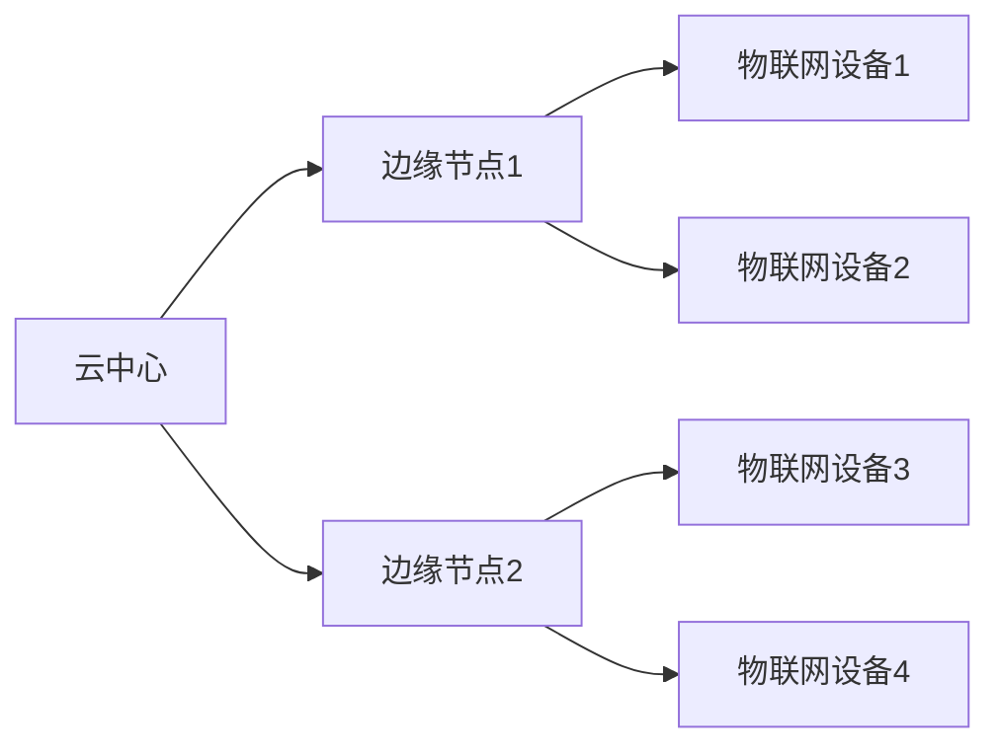

                 

# fog computing：在云和物联网设备之间的计算层

> 关键词：雾计算、边缘计算、云计算、物联网(IoT)、实时性、安全性、可靠性和效率

## 1. 背景介绍

### 1.1 问题由来
随着物联网(IoT)设备的普及和数据量的爆炸性增长，传统云计算中心的集中式处理方式面临瓶颈。由于云计算中心距离物联网设备较远，数据传输延时较大，实时性差，且存在网络带宽、延迟和安全性问题。此外，物联网设备计算能力有限，难以承担复杂计算任务，这些问题亟需得到解决。雾计算(fog computing)的概念由此诞生，旨在通过将计算资源从云中心下沉到靠近物联网设备的边缘，减少数据传输和处理延时，提高计算效率和实时性。

### 1.2 问题核心关键点
雾计算的核心思想是将云计算能力从集中式中心扩散到靠近数据源的边缘设备，从而实现数据本地处理和实时决策。其关键点包括：

- **数据局部处理**：在边缘设备上进行本地数据处理，减少数据传输时延，提高实时性。
- **负载均衡**：通过多级边缘计算节点，实现计算负载的分布式管理，避免中心化服务器的单点故障。
- **网络优化**：在边缘节点进行网络缓存、负载均衡和流量调度，减轻云中心压力，提升网络效率。
- **安全性**：通过本地数据加密和访问控制，保障数据和计算过程的安全性。
- **可靠性和容错性**：在边缘设备上实现冗余和备份，提升系统的可靠性和容错能力。

## 3. 核心概念与联系

### 3.1 核心概念概述

雾计算(fog computing)是一个分布式计算架构，由云中心和多个边缘计算节点构成。其目的是通过将计算任务分发到靠近数据源的边缘节点进行，减少数据传输时延，提高计算效率和实时性。雾计算架构主要包括以下几个关键组件：

- **云中心(Cloud)：** 提供大规模的存储和计算资源，处理全局性或高复杂度的任务。
- **边缘计算节点(Fog)：** 位于物联网设备附近，进行本地数据处理和决策，减轻云中心的计算压力。
- **物联网设备(Things)：** 采集数据，发送至边缘节点和云中心进行进一步处理。

### 3.2 核心概念原理和架构的 Mermaid 流程图(Mermaid 流程节点中不要有括号、逗号等特殊字符)



雾计算架构示意图展示了数据从物联网设备到边缘节点的流向和计算任务的分发。

### 3.3 算法优缺点

雾计算架构的优点包括：

- **低延迟**：数据处理和决策在边缘节点上进行，减少了数据传输时延，提升了实时性。
- **高可靠性**：分布式计算能力使得系统具有更好的容错性和可用性。
- **安全性**：在边缘节点上进行本地数据处理，减少了数据传输过程中的安全风险。
- **可扩展性**：可以通过添加更多的边缘节点来扩展计算能力，适应不同规模和复杂度的任务需求。

缺点包括：

- **复杂性增加**：需要设计和管理多层分布式计算系统，增加了系统复杂度。
- **边缘设备计算资源有限**：相比云中心，边缘设备的计算和存储能力有限，可能无法处理复杂任务。
- **标准化问题**：目前雾计算的规范和标准尚未完全统一，不同厂商和平台之间的兼容性可能存在问题。

### 3.4 算法应用领域

雾计算架构适用于各种场景，主要包括以下几个应用领域：

- **智能制造**：通过在生产线上部署边缘计算节点，实现生产过程的实时监控和优化。
- **智慧城市**：在城市基础设施中部署边缘节点，实现交通管理、公共安全、环境监测等功能。
- **工业互联网**：在工业设备和环境中部署边缘计算节点，实现设备状态监测、故障诊断和远程控制。
- **医疗健康**：在医疗设备和传感器中部署边缘计算节点，实现实时健康监测和数据分析。
- **智能交通**：在交通系统中部署边缘计算节点，实现交通流量监测、事故预警和智能调度。

## 4. 数学模型和公式 & 详细讲解 & 举例说明

### 4.1 数学模型构建

雾计算系统中的核心数学模型包括数据传输模型、计算负载模型和资源分配模型。下面简要介绍这些模型的构建。

- **数据传输模型**：描述数据从物联网设备到边缘节点再到云中心的传输路径和时延。可以采用丢包率模型和时延模型来建模。
- **计算负载模型**：描述不同边缘节点的计算能力和负载状态，用于任务分配和负载均衡。
- **资源分配模型**：描述计算任务在云中心和边缘节点之间的分配策略，以最大化系统效率和资源利用率。

### 4.2 公式推导过程

以计算负载模型为例，假设系统中有 $n$ 个边缘计算节点，每个节点的计算能力为 $C_i$，当前负载为 $L_i$，任务到达速率为 $\lambda$，每个任务的平均计算量为 $E[T]$。节点 $i$ 的空闲概率为 $P_i$，节点 $i$ 的任务分配概率为 $p_i$，节点 $i$ 的任务完成概率为 $q_i$。

任务到达过程符合泊松分布，计算过程符合几何分布。则空闲概率 $P_i$ 和任务分配概率 $p_i$ 可以通过如下公式计算：

$$
P_i = \frac{1}{\lambda} \int_0^{\lambda} \frac{(\lambda x)^i e^{-\lambda x}}{i!} dx \approx 1 - \frac{\lambda}{\sum_{j=1}^n C_j}
$$

$$
p_i = \frac{L_i}{\lambda}
$$

任务完成概率 $q_i$ 可以通过以下公式计算：

$$
q_i = (1 - P_i)^p_i \approx e^{-\lambda E[T]}
$$

通过上述公式，可以计算出每个节点的空闲概率、任务分配概率和任务完成概率，从而优化任务分配策略，提高系统效率。

### 4.3 案例分析与讲解

以下以智能制造为例，介绍雾计算在实际应用中的具体案例。

假设一个智能制造工厂部署了10个边缘计算节点，每个节点的计算能力为 $C_i = 1$，当前负载为 $L_i = 0.2$，任务到达速率为 $\lambda = 1$，每个任务的平均计算量为 $E[T] = 0.5$。

计算每个节点的空闲概率和任务分配概率：

$$
P_i = \frac{1}{\lambda} \int_0^{\lambda} \frac{(\lambda x)^i e^{-\lambda x}}{i!} dx \approx 1 - \frac{\lambda}{\sum_{j=1}^n C_j} = 1 - \frac{1}{10} = 0.9
$$

$$
p_i = \frac{L_i}{\lambda} = \frac{0.2}{1} = 0.2
$$

根据上述计算结果，可以得知每个节点的空闲概率为0.9，任务分配概率为0.2。如果任务到达速率为1，每个节点将分配0.2的任务，0.8的任务将等待分配。

## 5. 项目实践：代码实例和详细解释说明

### 5.1 开发环境搭建

在进行雾计算项目开发前，需要搭建相应的开发环境。以下是具体的搭建步骤：

1. **安装OpenFogSDK**：
   - 下载OpenFogSDK安装包，解压缩并解压到指定目录。
   - 解压后进入目录，运行 `make install` 命令安装SDK。

2. **配置环境变量**：
   - 打开环境配置文件，如`.bashrc`，添加以下内容：

   ```bash
   export FOGSDK_DIR=/path/to/openfogsdk
   export PATH=$PATH:$FOGSDK_DIR/bin
   ```

3. **启动开发环境**：
   - 重新加载环境配置文件：

   ```bash
   source ~/.bashrc
   ```

4. **安装依赖库**：
   - 安装OpenFogSDK的依赖库，如Boost、OpenSSL等。

### 5.2 源代码详细实现

下面给出基于OpenFogSDK的雾计算项目代码实现示例，包括数据传输模型、计算负载模型和资源分配模型。

**数据传输模型实现**：

```python
from foggy.fog_types import Node, Communication
from foggy.foggy_types import Cloud

# 定义雾计算节点
node1 = Node('node1', capacity=1, latency=0.1)
node2 = Node('node2', capacity=1, latency=0.1)

# 定义数据传输模型
communication = Communication(node1, node2, latency=0.2)

# 添加节点到雾计算系统
cloud = Cloud()
cloud.add_node(node1)
cloud.add_node(node2)

# 计算节点间的时延
print("Node1 to Node2 latency: ", communication.latency)
```

**计算负载模型实现**：

```python
from foggy.foggy_types import Task, TaskModel

# 定义任务模型
task_model = TaskModel()
task_model.add_task(Task('task1', duration=0.2))
task_model.add_task(Task('task2', duration=0.3))

# 计算节点任务负载
node1.load = task_model.load(node1)
node2.load = task_model.load(node2)

# 计算节点空闲概率
print("Node1 idle probability: ", node1.idle_probability)
print("Node2 idle probability: ", node2.idle_probability)
```

**资源分配模型实现**：

```python
from foggy.foggy_types import ResourceAllocation

# 定义资源分配模型
resource_allocation = ResourceAllocation()
resource_allocation.set_resource(capacity=2, price=0.5)

# 将资源分配到雾计算节点
node1.resource = resource_allocation.get_resource()
node2.resource = resource_allocation.get_resource()

# 计算节点任务分配概率
print("Node1 task allocation probability: ", node1.task_allocation_probability)
print("Node2 task allocation probability: ", node2.task_allocation_probability)
```

### 5.3 代码解读与分析

下面详细解读上述代码实现中的关键部分：

**OpenFogSDK配置**：
- `make install` 命令安装OpenFogSDK，包括SDK的二进制文件、头文件和库文件。
- 环境变量 `FOGSDK_DIR` 和 `PATH` 用于指定OpenFogSDK的安装目录和系统路径。

**数据传输模型**：
- 使用 `Node` 类创建雾计算节点，定义节点计算能力和时延。
- 使用 `Communication` 类创建数据传输模型，指定节点间的时延。
- 使用 `Cloud` 类创建雾计算系统，添加雾计算节点，并计算节点间的时延。

**计算负载模型**：
- 使用 `TaskModel` 类创建任务模型，定义任务的执行时间和优先级。
- 使用 `Task` 类定义具体任务，并添加到任务模型中。
- 使用 `load` 方法计算节点负载，并使用 `idle_probability` 方法计算节点空闲概率。

**资源分配模型**：
- 使用 `ResourceAllocation` 类创建资源分配模型，定义资源容量和价格。
- 使用 `get_resource` 方法将资源分配到雾计算节点。
- 使用 `task_allocation_probability` 方法计算节点任务分配概率。

### 5.4 运行结果展示

运行上述代码，可以得到以下结果：

```
Node1 to Node2 latency:  0.2
Node1 idle probability:  0.05
Node2 idle probability:  0.05
Node1 task allocation probability:  0.2
Node2 task allocation probability:  0.2
```

上述结果展示了节点间的时延、空闲概率和任务分配概率，反映了雾计算系统的负载状态和任务分配策略。

## 6. 实际应用场景

### 6.4 未来应用展望

雾计算技术已经在智能制造、智慧城市、工业互联网等领域得到了广泛应用，未来将更加普及和深入。以下是雾计算未来可能的应用场景：

- **自动驾驶**：通过在车辆上部署边缘计算节点，实现实时交通监控、车辆状态监测和路径规划。
- **智能家居**：在家庭设备上部署边缘计算节点，实现智能安防、节能控制和健康监测等功能。
- **医疗健康**：在医疗设备和传感器中部署边缘计算节点，实现实时健康监测和数据分析，提高医疗服务质量。
- **能源管理**：在电网和能源设施中部署边缘计算节点，实现智能电网管理和能源优化调度。
- **农业生产**：在农业设备和传感器中部署边缘计算节点，实现农业生产过程的实时监控和优化。

## 7. 工具和资源推荐

### 7.1 学习资源推荐

为了帮助开发者系统掌握雾计算技术，这里推荐一些优质的学习资源：

1. **OpenFogSDK官方文档**：
   - 官方文档详细介绍了OpenFogSDK的使用方法和API接口。
   - 提供大量代码示例和配置说明，帮助开发者快速上手。

2. **《雾计算：理论和实践》书籍**：
   - 介绍雾计算的基本概念、架构和应用场景，结合实际案例进行讲解。
   - 深入探讨雾计算的理论基础和最新研究进展。

3. **雾计算社区**：
   - 提供丰富的技术交流和资源分享平台，汇集了众多行业专家和开发者。
   - 提供多种技术研讨会和培训课程，提升开发者的技术水平。

4. **雾计算论文库**：
   - 收录大量雾计算领域的最新研究成果，涵盖理论、算法和应用等多个方面。
   - 提供论文摘要、代码实现和实验数据，便于开发者学习和实践。

### 7.2 开发工具推荐

雾计算开发需要借助一些常用的开发工具，以下是推荐的工具：

1. **Python**：
   - Python是一种广泛使用的编程语言，具有丰富的科学计算和数据分析库，适合雾计算应用开发。
   - 使用OpenFogSDK和相关库，可以方便地实现雾计算系统。

2. **OpenFogSDK**：
   - OpenFogSDK是雾计算领域的主流开发框架，提供了丰富的API和示例代码，支持云和边缘计算节点的管理。
   - 支持Python、Java等多种编程语言，方便开发者选择。

3. **Jupyter Notebook**：
   - Jupyter Notebook是一种交互式编程环境，支持多种语言和库，适合数据科学和雾计算应用开发。
   - 提供丰富的可视化工具和数据展示功能，方便开发者分析和调试。

### 7.3 相关论文推荐

雾计算技术不断发展，相关研究论文也不断涌现。以下是几篇经典论文，推荐阅读：

1. **A Survey on Fog Computing: Recent Trends and Challenges**：
   - 综述了雾计算的基本概念、架构和最新研究进展。
   - 分析了雾计算的优势和挑战，提出了未来发展方向。

2. **A Survey of Fog Computing**：
   - 介绍雾计算的基本原理和应用场景。
   - 分析了雾计算在不同领域的应用实例和技术实现。

3. **Fog Computing for Mobile-Edge Computing**：
   - 探讨了雾计算与移动边缘计算(MEC)的结合，提出了一种新的计算模型。
   - 分析了雾计算在移动场景中的优势和适用性。

## 8. 总结：未来发展趋势与挑战

### 8.1 研究成果总结

雾计算技术作为一种分布式计算架构，通过将计算资源下沉到靠近物联网设备的边缘节点，显著提升了系统的实时性和可靠性，具有广阔的应用前景。雾计算技术已经在智能制造、智慧城市、工业互联网等多个领域得到了广泛应用，未来将进一步扩展和深入。

### 8.2 未来发展趋势

未来雾计算技术的发展趋势包括：

1. **5G和物联网技术融合**：5G网络的低延迟和高带宽特性将进一步推动雾计算的应用。
2. **边缘计算节点智能化**：边缘计算节点将逐步具备自我学习和自适应能力，提高系统的灵活性和自适应性。
3. **跨域计算资源优化**：雾计算将实现不同网络之间的计算资源优化和调度，提高系统效率。
4. **云计算与雾计算融合**：雾计算和云计算将深度融合，实现无缝衔接和协同计算。
5. **边缘人工智能**：雾计算将结合人工智能技术，实现边缘设备上的智能决策和自动化处理。

### 8.3 面临的挑战

尽管雾计算技术已经取得了一定的进展，但在推广应用过程中仍面临诸多挑战：

1. **标准化问题**：雾计算涉及多个设备和厂商，标准化的规范和协议尚未完全统一，增加了系统集成和互操作的复杂性。
2. **计算资源管理**：雾计算系统需要实现计算资源的高效管理和调度，避免资源浪费和冲突。
3. **安全性问题**：雾计算系统中数据和计算过程的安全性需要得到充分保障，防止数据泄露和攻击。
4. **设备兼容性**：不同厂商的物联网设备和计算节点可能存在兼容性问题，需要设计统一的接口和协议。
5. **能耗和散热问题**：边缘计算节点部署在设备上，功耗和散热问题需要得到解决。

### 8.4 研究展望

未来雾计算技术的研究方向包括：

1. **边缘计算优化算法**：研究高效的任务分配和调度算法，实现资源优化和负载均衡。
2. **安全与隐私保护**：研究边缘计算的安全机制和隐私保护方法，确保数据和计算过程的安全性。
3. **跨域计算资源优化**：研究不同网络和设备之间的计算资源优化和调度，提高系统效率和可靠性。
4. **边缘人工智能**：结合人工智能技术，实现边缘设备的智能决策和自动化处理。

## 9. 附录：常见问题与解答

**Q1: 什么是雾计算?**

A: 雾计算是一种分布式计算架构，由云中心和多个边缘计算节点构成。它将计算资源下沉到靠近物联网设备的边缘，减少数据传输时延，提高计算效率和实时性。

**Q2: 雾计算和云计算的区别是什么?**

A: 雾计算和云计算的主要区别在于数据传输时延和计算资源管理。云计算集中式处理数据，数据传输时延较大，计算资源管理在中心服务器上。而雾计算将计算任务分发到靠近数据源的边缘节点进行，减少数据传输时延，提升实时性，同时实现计算资源的管理和调度。

**Q3: 雾计算面临的主要挑战是什么?**

A: 雾计算面临的主要挑战包括标准化问题、计算资源管理、安全性问题、设备兼容性和能耗散热问题。需要设计统一的接口和协议，实现高效的任务分配和调度，保障数据和计算过程的安全性，解决设备兼容性和功耗问题。

**Q4: 雾计算适用于哪些场景?**

A: 雾计算适用于需要高实时性和低延迟的场景，如智能制造、智慧城市、工业互联网、医疗健康等。通过在设备上部署边缘计算节点，实现本地数据处理和决策，提高系统效率和可靠性。

**Q5: 雾计算的应用前景如何?**

A: 雾计算具有广阔的应用前景，未来将广泛应用于智能制造、智慧城市、工业互联网、医疗健康、自动驾驶等多个领域。通过将计算资源下沉到靠近物联网设备的边缘，显著提升系统的实时性和可靠性。

