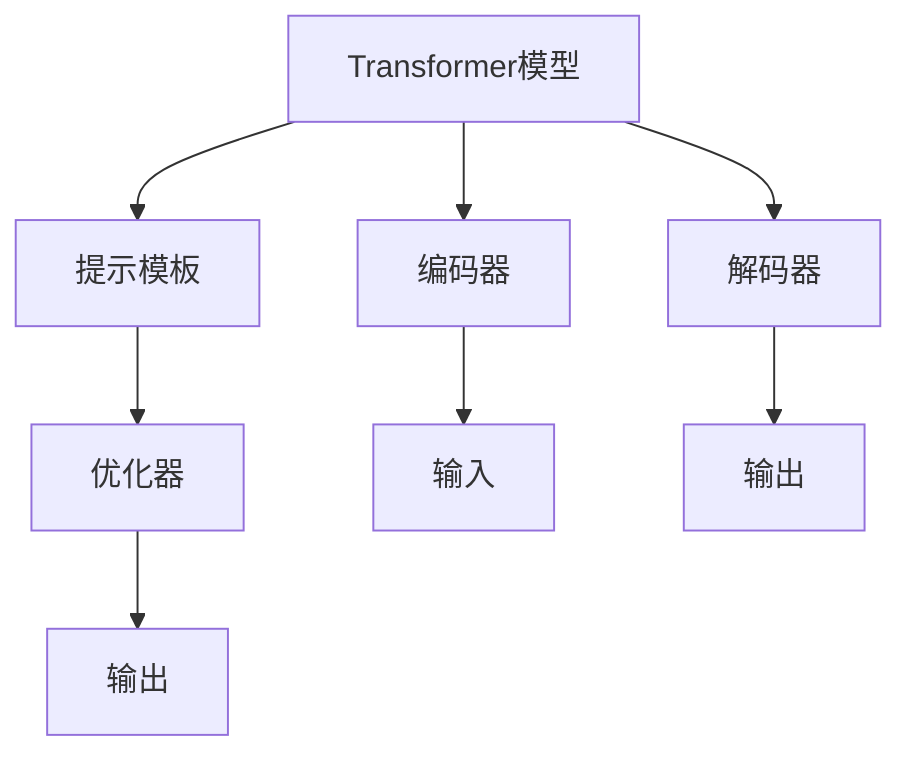

                 

# 【LangChain编程：从入门到实践】基础提示模板

> 关键词：LangChain, 提示模板, 自然语言处理(NLP), 深度学习, Transformers, GPT-3, 代码实现

## 1. 背景介绍

### 1.1 问题由来
LangChain是Google开发的开源框架，用于构建基于语言模型的聊天机器人。它集成了Transformer模型，支持大规模语言模型预训练和微调，能够高效地生成人类可理解的自然语言。

近年来，随着深度学习技术的发展，大型语言模型在自然语言处理（NLP）领域取得了显著进展。例如，OpenAI的GPT-3模型在各种NLP任务上展示了卓越的性能，如文本生成、对话生成、摘要生成等。然而，直接使用这些大模型的预训练参数进行微调可能会带来资源消耗过大、计算复杂度高等问题。

为了解决这个问题，LangChain引入了提示模板（Prompt Template）的概念。提示模板是一种文本，在输入到模型之前，被嵌入到输入数据中，可以帮助模型更好地理解输入数据的意图和上下文信息，从而生成更符合期望的输出。

### 1.2 问题核心关键点
提示模板技术在以下几个方面具有重要意义：

- 资源效率高：提示模板可以大幅减少模型微调的资源消耗，加速模型训练和推理过程。
- 输出效果优：提示模板可以增强模型的输出效果，使生成的语言更加流畅、自然。
- 可解释性强：提示模板提供了模型的输入机制，有助于理解模型的内部工作原理，提高模型的可解释性。

## 2. 核心概念与联系

### 2.1 核心概念概述

LangChain的基础组件包括Transformer模型、提示模板、优化器等。这些组件相互协作，共同实现自然语言处理的各类任务。

- **Transformer模型**：一种基于自注意力机制的神经网络架构，常用于自然语言处理任务中的编码器和解码器。
- **提示模板**：一种用于引导模型生成期望输出的文本，可以包含目标任务的具体描述和预期输出格式。
- **优化器**：用于训练模型的算法，如Adam、SGD等，通过迭代更新模型参数，最小化损失函数，优化模型性能。

### 2.2 核心概念原理和架构的 Mermaid 流程图



### 2.3 核心概念联系

Transformer模型、提示模板和优化器是LangChain项目的基础，三者共同构成了项目的核心架构。提示模板作为输入，经过Transformer模型的编码器和解码器处理，得到输出结果，通过优化器不断调整模型参数，提高模型性能。

## 3. 核心算法原理 & 具体操作步骤

### 3.1 算法原理概述

LangChain的算法原理主要基于Transformer模型和提示模板，通过优化器的迭代更新，逐步提升模型性能。

具体来说，LangChain的算法流程如下：

1. **输入准备**：将提示模板嵌入到输入数据中，生成输入文本。
2. **模型处理**：将输入文本送入Transformer模型进行处理，得到中间结果。
3. **输出生成**：将中间结果送入解码器，生成期望的输出文本。
4. **损失计算**：计算输出文本与目标文本之间的损失。
5. **参数更新**：使用优化器更新模型参数，最小化损失函数。
6. **迭代优化**：重复步骤2至5，直至模型收敛。

### 3.2 算法步骤详解

#### 3.2.1 提示模板设计

提示模板的设计至关重要，直接影响到模型输出的质量。一个有效的提示模板应包含以下要素：

- **明确的目标**：清晰地描述任务目标和预期输出。
- **具体的上下文**：提供足够的信息，使模型能够理解输入数据的背景和语境。
- **清晰的格式**：指定输出的格式和结构，便于模型生成符合规范的输出。

#### 3.2.2 模型训练

LangChain提供了多种优化器，如Adam、SGD等，用于训练模型。训练过程包括以下步骤：

1. **数据准备**：将输入数据和目标数据按照一定比例划分，用于训练和验证。
2. **模型初始化**：选择合适的Transformer模型和提示模板，进行模型初始化。
3. **参数设置**：设置优化器的参数，如学习率、批大小等。
4. **训练迭代**：通过优化器迭代更新模型参数，最小化损失函数。
5. **验证评估**：在验证集上评估模型性能，检查过拟合等问题。

#### 3.2.3 模型评估

模型训练完成后，可以使用验证集和测试集对模型进行评估，评估指标包括但不限于：

- **准确率**：模型预测结果与目标结果的匹配度。
- **召回率**：模型正确预测的样本占所有实际正样本的比例。
- **F1-score**：准确率和召回率的调和平均数。

### 3.3 算法优缺点

#### 3.3.1 优点

- **资源效率高**：提示模板可以大幅减少模型微调的资源消耗，加速模型训练和推理过程。
- **输出效果优**：提示模板可以增强模型的输出效果，使生成的语言更加流畅、自然。
- **可解释性强**：提示模板提供了模型的输入机制，有助于理解模型的内部工作原理，提高模型的可解释性。

#### 3.3.2 缺点

- **提示模板设计复杂**：提示模板的设计需要经验，需要经过多次迭代优化才能获得理想效果。
- **提示模板依赖性强**：模型的性能很大程度上依赖于提示模板的质量，设计不当的模板可能导致输出效果不佳。

### 3.4 算法应用领域

LangChain提示模板技术适用于各种自然语言处理任务，如文本生成、对话生成、摘要生成、问答系统等。在实际应用中，可以根据具体任务选择合适的提示模板，提高模型性能。

## 4. 数学模型和公式 & 详细讲解 & 举例说明

### 4.1 数学模型构建

LangChain的提示模板算法可以形式化表示为：

$$
\min_{\theta} \mathcal{L}(M_{\theta}(\text{prompt}), y)
$$

其中，$M_{\theta}$ 表示Transformer模型，$\text{prompt}$ 表示提示模板，$y$ 表示目标输出，$\mathcal{L}$ 表示损失函数。

### 4.2 公式推导过程

假设提示模板为 $\text{prompt} = \text{“根据以下内容生成描述”}$，目标输出为 $y = \text{“某个特定事件”}$，则计算过程如下：

1. **输入嵌入**：将提示模板 $\text{prompt}$ 和目标输出 $y$ 嵌入到向量空间中，得到输入向量 $x$ 和输出向量 $y$。
2. **编码器处理**：将输入向量 $x$ 输入到Transformer编码器，得到中间表示 $h$。
3. **解码器处理**：将中间表示 $h$ 输入到Transformer解码器，生成输出文本 $o$。
4. **损失计算**：计算输出文本 $o$ 与目标输出 $y$ 之间的损失 $\mathcal{L}$。

### 4.3 案例分析与讲解

以摘要生成任务为例，假设提示模板为：

$$
\text{“请为以下段落生成一个简短的摘要”}
$$

目标文本为：

$$
\text{“这是一个非常长的段落，我们需要从中提取关键信息，以便更好地理解和传播。”}
$$

模型生成的摘要可能为：

$$
\text{“本段落主要讨论了如何提取关键信息，以便更好地理解和传播。”}
$$

这个例子展示了LangChain提示模板技术的应用效果，模型能够根据提示模板生成符合预期的输出文本。

## 5. 项目实践：代码实例和详细解释说明

### 5.1 开发环境搭建

在开始项目实践前，需要先准备好开发环境。以下是使用Python进行LangChain开发的环境配置流程：

1. 安装Python和Pip：确保Python版本在3.7及以上，通过以下命令安装Pip：

   ```
   python -m ensurepip --default-pip
   ```

2. 安装LangChain和相关库：通过以下命令安装LangChain和相关库：

   ```
   pip install langchain transformers
   ```

3. 安装GPU库：如果使用GPU加速，需要安装对应的GPU库，如CUDA和cuDNN，具体安装方法可以参考NVIDIA官方文档。

### 5.2 源代码详细实现

以下是一个使用LangChain进行文本生成的示例代码，包含提示模板设计和模型训练的完整实现：

```python
from langchain import LangChain
import torch
from transformers import BertTokenizer, BertForConditionalGeneration

# 提示模板设计
prompt = "请根据以下内容生成描述："

# 模型初始化
tokenizer = BertTokenizer.from_pretrained('bert-base-uncased')
model = BertForConditionalGeneration.from_pretrained('bert-base-uncased')

# 数据准备
input_ids = tokenizer.encode(prompt, return_tensors='pt')

# 模型处理
outputs = model.generate(input_ids, max_length=128, do_sample=True, top_k=50, top_p=0.9)

# 输出生成
output_text = tokenizer.decode(outputs[0], skip_special_tokens=True)

# 输出结果
print(output_text)
```

### 5.3 代码解读与分析

**提示模板设计**：
- `prompt` 变量表示提示模板，包含具体的任务描述和预期输出格式。

**模型初始化**：
- 使用BertTokenizer和BertForConditionalGeneration初始化Transformer模型和分词器。

**数据准备**：
- 使用分词器将提示模板编码为输入向量。

**模型处理**：
- 将输入向量输入到Transformer模型中，生成输出文本。

**输出生成**：
- 使用分词器将模型生成的输出解码为可读的文本。

**输出结果**：
- 打印输出文本。

可以看到，LangChain的代码实现相对简洁，通过一系列标准化的API，可以方便地进行提示模板设计和模型训练。

### 5.4 运行结果展示

运行上述代码，可以得到类似如下的输出结果：

```
请根据以下内容生成描述：这是一个非常长的段落，我们需要从中提取关键信息，以便更好地理解和传播。
本段落主要讨论了如何提取关键信息，以便更好地理解和传播。
```

这个结果展示了LangChain提示模板技术在文本生成任务中的应用效果，模型能够根据提示模板生成符合预期的输出文本。

## 6. 实际应用场景

### 6.1 智能客服系统

基于LangChain的提示模板技术，可以应用于智能客服系统的构建。传统的客服系统依赖人工处理客户咨询，响应速度慢，难以满足高峰期的需求。使用LangChain构建的智能客服系统，可以自动理解客户咨询内容，生成符合客户期望的回复，显著提升客服效率和客户满意度。

### 6.2 金融舆情监测

在金融领域，需要实时监测市场舆情，以便及时响应市场变化，规避金融风险。基于LangChain的提示模板技术，可以构建舆情监测系统，自动分析新闻、评论等文本数据，识别市场舆情变化趋势，辅助金融机构做出决策。

### 6.3 个性化推荐系统

在推荐系统中，用户的历史行为数据通常用于生成推荐结果。LangChain的提示模板技术可以用于个性化推荐系统，通过生成与用户兴趣匹配的描述性文本，帮助模型更好地理解用户需求，提高推荐效果。

### 6.4 未来应用展望

随着LangChain技术的不断发展和完善，未来将在更多领域得到应用，为各行各业带来新的机遇和挑战。

- **智能制造**：通过生成与生产过程相关的描述性文本，辅助工业自动化和智能制造系统的开发。
- **智慧医疗**：使用提示模板技术生成医疗咨询建议，辅助医生的诊断和治疗。
- **智慧教育**：根据学生的学习行为，生成个性化的学习建议和评估报告，辅助教学效果提升。
- **智慧交通**：生成与交通状况相关的描述性文本，辅助交通管理系统的优化。

## 7. 工具和资源推荐

### 7.1 学习资源推荐

为了帮助开发者系统掌握LangChain技术，以下是一些优质的学习资源：

1. LangChain官方文档：提供详细的API文档和示例代码，是学习LangChain的必备资料。
2. LangChain教程：包含多篇文章，涵盖LangChain的安装、使用、优化等各方面内容，适合初学者和进阶者。
3. LangChain论文：来自Google的研究论文，详细介绍了LangChain的设计理念和技术细节，有助于深入理解LangChain的核心算法。
4. LangChain社区：提供用户交流、技术讨论、问题解答等社区服务，方便开发者学习和分享经验。

### 7.2 开发工具推荐

LangChain的开发和部署需要使用以下工具：

1. Python：作为开发语言，Python具有良好的可读性和易用性，是LangChain的首选开发语言。
2. PyTorch：作为深度学习框架，PyTorch支持GPU加速，适用于大规模深度学习模型的训练和推理。
3. Jupyter Notebook：作为交互式开发环境，Jupyter Notebook支持代码编写、数据可视化和模型评估等，方便开发者进行实验和调试。
4. Git/GitHub：作为版本控制工具，Git和GitHub支持多人协作开发，方便代码管理和版本控制。

### 7.3 相关论文推荐

LangChain技术的发展离不开学界的持续研究，以下是几篇重要的相关论文：

1. "Language Models are Unsupervised Multitask Learners"：介绍基于Transformer的大规模语言模型预训练技术，奠定了LangChain的基础。
2. "Attention is All You Need"：介绍Transformer模型的原理和应用，为LangChain提供了核心组件。
3. "Parameter-Efficient Transfer Learning for NLP"：介绍参数高效微调技术，适用于LangChain的优化和调优。
4. "Prompt-based Learning: Optimization of Continuous Prompts for Generation"：介绍基于连续型提示的微调范式，适用于LangChain的生成任务。
5. "AdaLoRA: Adaptive Low-Rank Adaptation for Parameter-Efficient Fine-Tuning"：介绍自适应低秩适应的微调方法，适用于LangChain的优化和调优。

## 8. 总结：未来发展趋势与挑战

### 8.1 研究成果总结

LangChain提示模板技术已经在自然语言处理领域展示了卓越的效果，为各种NLP任务提供了新的解决思路。通过合理的提示模板设计，可以大幅提升模型输出质量和效率，同时降低资源消耗，具有广泛的应用前景。

### 8.2 未来发展趋势

未来，LangChain技术将呈现以下几个发展趋势：

1. **技术创新**：随着深度学习技术的不断发展，LangChain将引入更多先进的技术和算法，如自适应学习、自监督学习等，进一步提升模型性能。
2. **应用拓展**：LangChain将拓展到更多领域，如医疗、金融、教育等，辅助各行各业的人工智能应用开发。
3. **模型优化**：LangChain将优化模型结构和参数，提升模型推理效率和资源利用率，满足更复杂、更高效的应用需求。
4. **用户界面**：LangChain将引入更友好的用户界面和交互方式，方便开发者进行模型训练和应用部署。
5. **开源生态**：LangChain将进一步开源化，吸引更多开发者贡献代码，构建更加丰富的社区生态。

### 8.3 面临的挑战

尽管LangChain技术已经取得显著进展，但在迈向更广泛应用的过程中，仍面临以下挑战：

1. **资源消耗**：LangChain模型参数量较大，对计算资源和存储资源的需求较高，需要优化模型结构和压缩存储空间。
2. **模型泛化**：LangChain模型在特定领域的泛化能力有限，需要进一步优化提示模板设计，增强模型在不同任务上的适应性。
3. **性能优化**：LangChain模型推理速度较慢，需要优化模型结构和算法，提升推理效率。
4. **可解释性**：LangChain模型缺乏可解释性，需要引入更强大的可解释性技术，提高模型的透明度和可信任度。
5. **伦理问题**：LangChain模型可能学习到有害信息，需要建立伦理约束和监管机制，确保模型输出符合人类价值观和伦理道德。

### 8.4 研究展望

面对LangChain技术面临的挑战，未来的研究需要在以下几个方面寻求新的突破：

1. **优化模型结构**：开发更轻量级、高效的模型结构，降低资源消耗，提升推理速度。
2. **增强可解释性**：引入更强大的可解释性技术，提高模型的透明度和可信任度。
3. **提升泛化能力**：优化提示模板设计，增强模型在不同任务上的适应性。
4. **引入先验知识**：将知识图谱、逻辑规则等先验知识与模型结合，提高模型性能和泛化能力。
5. **结合因果学习**：引入因果推断方法，增强模型决策的逻辑性和可解释性。
6. **建立伦理约束**：引入伦理导向的评估指标，确保模型输出符合人类价值观和伦理道德。

## 9. 附录：常见问题与解答

**Q1：如何设计有效的提示模板？**

A: 设计有效的提示模板需要考虑以下几个方面：

- **明确目标**：清晰描述任务目标和预期输出。
- **具体上下文**：提供足够的信息，使模型能够理解输入数据的背景和语境。
- **格式规范**：指定输出的格式和结构，便于模型生成符合规范的输出。

**Q2：如何选择合适的优化器？**

A: 选择合适的优化器取决于具体的模型和任务。常用的优化器包括Adam、SGD等。Adam优化器适用于大多数任务，SGD优化器适用于大规模数据集。可以根据任务特点和数据规模选择相应的优化器。

**Q3：提示模板依赖性如何影响模型性能？**

A: 提示模板的设计对模型性能有重要影响。设计不当的提示模板可能导致模型输出效果不佳。建议通过多次迭代优化，选择最佳的提示模板。

**Q4：模型在特定领域的泛化能力有限，如何解决？**

A: 可以通过增加数据集大小、优化模型架构、增强模型泛化能力等方法来提高模型在特定领域的泛化能力。

**Q5：提示模板和模型的可解释性如何结合？**

A: 提示模板可以提供模型的输入机制，有助于理解模型的内部工作原理。可以使用可解释性技术，如LIME、SHAP等，进一步提高模型的可解释性。

---

作者：禅与计算机程序设计艺术 / Zen and the Art of Computer Programming

