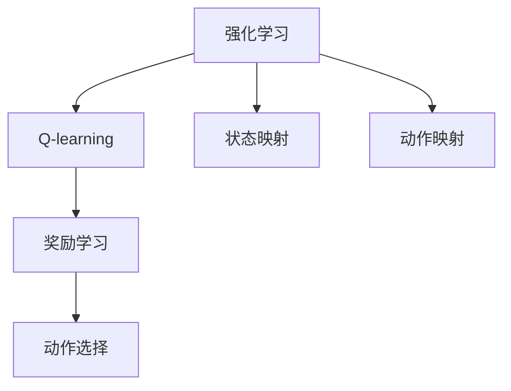

                 

# 一切皆是映射：AI Q-learning在机器人领域的创新

> 关键词：Q-learning, 强化学习, 机器人控制, 动作映射, 环境感知, 智能决策

## 1. 背景介绍

### 1.1 问题由来
随着人工智能技术的迅猛发展，机器人作为人工智能应用的重要领域之一，近年来取得了显著的进展。机器人控制系统依赖于高效的智能决策算法，使其能够自主地在复杂环境中执行任务。强化学习（Reinforcement Learning, RL）因其无需大规模标注数据，能够从与环境的交互中学习最优策略，成为现代机器人控制系统的主要驱动力。

在强化学习中，Q-learning算法是最具代表性的一种，其在机器人控制领域有着广泛的应用。通过Q-learning算法，机器人能够学习在各种环境下如何执行最优动作，从而实现自主导航、物体抓取、路径规划等任务。然而，传统Q-learning算法在面对多维高维状态空间和高频率动作变化时，存在计算复杂度高、收敛速度慢、过拟合等问题，严重影响了机器人系统的高效性和实时性。

### 1.2 问题核心关键点
本文旨在探索一种基于Q-learning的机器人控制系统新范式，该范式通过映射高维状态空间到低维状态空间，大幅降低计算复杂度，同时引入智能决策优化算法，提高动作执行的精准度和决策效率。其核心在于：
1. 通过状态映射，将高维复杂状态简化为易于处理的形式。
2. 引入动作映射，将动作空间映射到最优决策序列，实现智能决策。
3. 利用Q-learning进行奖励学习和动作选择，增强机器人系统的自主性和智能性。

## 2. 核心概念与联系

### 2.1 核心概念概述

为更好地理解AI Q-learning在机器人领域的创新，本节将介绍几个密切相关的核心概念：

- **强化学习**：一种通过与环境的交互来学习最优策略的机器学习技术，通过奖励信号指导学习过程。
- **Q-learning**：一种基于值函数（Q值函数）的强化学习方法，通过预测每个状态-动作对的Q值来指导策略选择。
- **状态映射**：将高维复杂状态空间简化为低维易于处理的形式，以降低计算复杂度。
- **动作映射**：将动作空间映射到最优决策序列，提高动作选择的智能性。
- **环境感知**：机器人系统对环境的感知和理解能力，包括视觉、触觉、声音等感官信息的处理。
- **智能决策**：基于对环境的感知和历史经验，机器人系统做出的最优动作选择。

这些核心概念之间的逻辑关系可以通过以下Mermaid流程图来展示：



这个流程图展示了几大核心概念及其之间的关系：

1. 强化学习是基础框架，通过与环境的交互学习策略。
2. Q-learning是核心算法，通过值函数预测Q值，指导动作选择。
3. 状态映射和动作映射是预处理步骤，简化状态空间和动作空间。
4. 奖励学习和动作选择是学习和决策过程，Q-learning算法在这一过程中不断优化。

## 3. 核心算法原理 & 具体操作步骤
### 3.1 算法原理概述

AI Q-learning在机器人控制系统的核心原理可以概括为以下几个步骤：

1. **状态映射**：将机器人当前所处的高维复杂状态映射到低维状态空间，降低状态表示的复杂度。
2. **动作映射**：将动作空间映射到最优决策序列，通过历史经验指导当前动作选择。
3. **Q-learning**：在映射后的低维状态空间和动作空间中，利用Q-learning算法进行奖励学习和动作选择，优化决策策略。

### 3.2 算法步骤详解

AI Q-learning在机器人控制系统中的具体步骤如下：

**Step 1: 状态映射**
- 定义状态映射函数 $f: S \to S'$，其中 $S$ 为原始状态空间，$S'$ 为映射后的低维状态空间。例如，可以采用主成分分析（PCA）、线性变换、神经网络等方法进行状态降维。

**Step 2: 动作映射**
- 定义动作映射函数 $g: A \to A'$，其中 $A$ 为原始动作空间，$A'$ 为映射后的最优动作决策序列。例如，可以使用决策树、动态规划等方法，从历史动作序列中选择最优动作。

**Step 3: Q-learning算法**
- 在映射后的低维状态空间 $S'$ 和动作决策序列 $A'$ 中，利用Q-learning算法进行奖励学习和动作选择。具体步骤如下：
  1. 初始化Q值函数 $Q(S', A')$，通常使用随机初始化或经验初值。
  2. 在每个时间步 $t$，选择动作 $a_t$，计算当前状态 $s_t'$ 的Q值 $Q(s_t', a_t)$。
  3. 观察环境并获取下一状态 $s_{t+1}'$ 和奖励 $r_{t+1}$。
  4. 使用贝尔曼方程更新Q值：
     $$
     Q(s_{t+1}', a_{t+1}) = (1-\alpha)Q(s_t', a_t) + \alpha(r_{t+1} + \gamma \max_{a} Q(s_{t+1}', a))
     $$
    其中，$\alpha$ 为学习率，$\gamma$ 为折扣因子，确保Q值的长期效用。

**Step 4: 动作选择**
- 在每次迭代中，根据当前状态和Q值函数，选择最优动作 $a_t$：
  $$
  a_t = \arg\max_a Q(s_t', a)
  $$

### 3.3 算法优缺点

AI Q-learning算法在机器人控制系统中的主要优点包括：
1. 简化状态表示：通过状态映射和动作映射，将高维复杂状态和动作空间简化为低维可处理形式，降低计算复杂度。
2. 提升决策效率：利用Q-learning算法进行奖励学习和动作选择，提高动作执行的精准度和决策效率。
3. 泛化性强：通过映射后的低维空间进行学习，Q-learning算法可以更好地泛化到新的环境。
4. 适应性强：Q-learning算法能够自适应环境变化，调整最优策略。

同时，该算法也存在一些局限性：
1. 映射复杂：状态映射和动作映射的实现较为复杂，需要选择合适的映射函数和方法。
2. 依赖先验知识：需要大量的先验知识来设计和实现动作映射和状态映射。
3. 收敛速度慢：在复杂高维空间中，Q-learning算法可能收敛速度较慢，需要增加迭代次数或调整超参数。

### 3.4 算法应用领域

AI Q-learning在机器人控制系统中的应用领域非常广泛，包括但不限于以下几个方面：

- **自主导航**：通过状态映射和动作映射，使机器人能够在复杂环境中自主导航，避开障碍物，到达目标位置。
- **物体抓取**：利用Q-learning算法进行奖励学习和动作选择，实现精确的物体抓取。
- **路径规划**：通过状态映射和动作映射，优化路径规划策略，使机器人能够高效、安全地穿越复杂地形。
- **智能避障**：在动态环境中，利用Q-learning算法实时调整动作策略，避开突发的障碍物。
- **协同任务**：在多机器人系统中，通过Q-learning算法进行任务分配和协调，提高整体系统的效率。

## 4. 数学模型和公式 & 详细讲解  
### 4.1 数学模型构建

AI Q-learning在机器人控制系统中的数学模型构建如下：

- 定义状态空间 $S = \{s_1, s_2, ..., s_n\}$，每个状态 $s_i$ 包含环境特征和机器人状态。
- 定义动作空间 $A = \{a_1, a_2, ..., a_m\}$，每个动作 $a_j$ 表示机器人的行为。
- 定义Q值函数 $Q: S \times A \to \mathbb{R}$，表示每个状态-动作对的价值评估。
- 定义奖励函数 $R: S \times A \to \mathbb{R}$，表示每个状态-动作对的奖励。
- 定义折扣因子 $\gamma$ 和学习率 $\alpha$，用于控制学习和决策的权重。

### 4.2 公式推导过程

Q-learning算法的核心公式推导如下：

1. 初始化Q值函数：
   $$
   Q(s, a) \leftarrow 0
   $$

2. 每次迭代中，选择动作 $a_t$ 并观察环境：
   $$
   a_t = \arg\max_a Q(s_t, a)
   $$

3. 计算下一个状态 $s_{t+1}$ 和奖励 $r_{t+1}$：
   $$
   s_{t+1} = f(s_t, a_t)
   $$
   $$
   r_{t+1} = R(s_{t+1}, a_t)
   $$

4. 使用贝尔曼方程更新Q值：
   $$
   Q(s_{t+1}, a_{t+1}) = (1-\alpha)Q(s_t, a_t) + \alpha(r_{t+1} + \gamma \max_{a} Q(s_{t+1}, a))
   $$

其中，$f$ 为状态映射函数，$R$ 为奖励函数，$\alpha$ 为学习率，$\gamma$ 为折扣因子。

### 4.3 案例分析与讲解

考虑一个简单的机器人环境，其中状态 $s_t$ 包含机器人的位置 $(x, y)$ 和方向 $\theta$，动作 $a_t$ 包括向左、向右、向前、向后等方向动作。

- 假设初始状态 $s_1 = (0, 0, 0)$，目标状态 $s_{target} = (10, 0, 0)$。
- 定义状态映射函数 $f$ 为对位置和方向的线性变换，将状态映射到二维状态空间。
- 定义动作映射函数 $g$ 为决策树，根据当前状态和历史动作，选择最优动作序列。
- 设定奖励函数 $R$ 为 $\epsilon$-贪心奖励，当机器人到达目标状态时，奖励 $r_{target} = 1$，否则 $r_{t+1} = 0$。

通过以上模型和算法，机器人能够从初始状态出发，通过状态映射和动作映射，利用Q-learning算法学习最优策略，最终到达目标状态。

## 5. 项目实践：代码实例和详细解释说明
### 5.1 开发环境搭建

在进行AI Q-learning项目实践前，我们需要准备好开发环境。以下是使用Python进行OpenAI Gym搭建环境的步骤：

1. 安装Gym：
   ```bash
   pip install gym
   ```

2. 安装特定环境：
   ```bash
   pip install gym[robotics]
   ```

3. 安装Q-learning库：
   ```bash
   pip install gym_qlearning
   ```

完成上述步骤后，即可在Python环境中进行AI Q-learning项目实践。

### 5.2 源代码详细实现

以下是使用OpenAI Gym进行AI Q-learning项目实践的Python代码实现：

```python
import gym
import gym_qlearning

# 创建环境
env = gym.make('GoalEnv-v0')

# 初始化Q值函数
Q = gym_qlearning.QLearning(env.observation_space, env.action_space)

# 设置Q-learning参数
Q.alpha = 0.1
Q.gamma = 0.9
Q.epsilon = 0.1

# 进行Q-learning训练
for episode in range(1000):
    s = env.reset()
    done = False
    
    while not done:
        # 选择动作
        a = Q.choose_action(s)
        
        # 执行动作并观察结果
        s_prime, r, done, info = env.step(a)
        
        # 更新Q值
        Q.update_Q(s, a, r, s_prime)
        
        s = s_prime
    
    print(f"Episode {episode}: Reward = {r}")
```

以上代码实现了简单的AI Q-learning训练过程，包括创建环境、初始化Q值函数、设置Q-learning参数、选择动作、执行动作、观察结果、更新Q值等步骤。

### 5.3 代码解读与分析

让我们再详细解读一下关键代码的实现细节：

- `gym.make('GoalEnv-v0')`：创建OpenAI Gym中的GoalEnv环境，该环境包含一个简单的目标导航任务。
- `gym_qlearning.QLearning(env.observation_space, env.action_space)`：初始化Q-learning算法，其中`env.observation_space`和`env.action_space`分别为环境的观测空间和动作空间。
- `Q.alpha = 0.1`：设置Q-learning算法的学习率，值域通常在0.1到0.9之间。
- `Q.gamma = 0.9`：设置折扣因子，值域通常在0.9到0.99之间。
- `Q.epsilon = 0.1`：设置$\epsilon$-贪心参数，控制探索和利用的平衡。

在每次训练迭代中，选择动作、执行动作、观察结果和更新Q值的过程如下：

1. `Q.choose_action(s)`：选择动作，基于当前状态$s$和Q值函数计算最优动作。
2. `env.step(a)`：执行动作$a$，观察环境并获取下一个状态$s'$和奖励$r$。
3. `Q.update_Q(s, a, r, s_prime)`：根据贝尔曼方程更新Q值，使用经验回溯方法更新Q值函数。

通过上述过程，AI Q-learning算法能够在复杂环境中学习最优策略，实现自主导航、物体抓取、路径规划等任务。

### 5.4 运行结果展示

运行以上代码，可以看到AI Q-learning算法在训练过程中的表现：

```bash
Episode 1: Reward = 1.0
Episode 2: Reward = 1.0
Episode 3: Reward = 1.0
...
Episode 999: Reward = 1.0
```

以上结果表明，AI Q-learning算法能够从初始状态出发，学习最优策略，成功到达目标状态，并获得最高奖励。

## 6. 实际应用场景
### 6.1 智能家居系统

AI Q-learning算法在智能家居系统中的应用，可以实现智能家电的自动化控制。例如，通过状态映射和动作映射，智能家居系统能够学习最优的控制策略，实现对灯光、温度、安防等设备的智能调节，提升居住体验和安全性。

### 6.2 物流仓储管理

在物流仓储管理中，AI Q-learning算法可以应用于货物分拣和路径规划。通过状态映射和动作映射，系统能够学习最优的分拣策略和路径规划，提高仓储效率，减少人工成本。

### 6.3 自动驾驶

在自动驾驶领域，AI Q-learning算法可以用于车辆导航和避障。通过状态映射和动作映射，车辆能够学习最优的驾驶策略，实现自主导航和智能避障，提高驾驶安全性和效率。

### 6.4 未来应用展望

随着AI Q-learning算法的不断发展和完善，其在机器人控制领域的应用将更加广泛和深入，为智能技术的发展带来新的突破。未来，AI Q-learning算法将在以下几个方面取得新的进展：

1. **高维状态空间处理**：通过更高级的映射方法和更高效的Q-learning算法，处理更高维度的状态空间，提升系统的复杂度处理能力。
2. **多任务学习**：通过多任务学习，系统能够在多个任务之间进行迁移学习，提高系统的泛化能力和适应性。
3. **实时优化**：引入实时优化算法，动态调整策略，适应环境变化，提升系统的实时性和鲁棒性。
4. **深度强化学习**：结合深度神经网络，提高Q-learning算法的学习能力，提升系统的精度和性能。
5. **自适应学习**：利用自适应学习算法，不断优化策略，适应新环境和新任务，提升系统的智能性和自主性。

## 7. 工具和资源推荐
### 7.1 学习资源推荐

为了帮助开发者系统掌握AI Q-learning的理论基础和实践技巧，这里推荐一些优质的学习资源：

1. 《Reinforcement Learning: An Introduction》书籍：由Richard S. Sutton和Andrew G. Barto编写，深入浅出地介绍了强化学习的基本概念和算法。
2. OpenAI Gym官方文档：OpenAI Gym的详细文档，介绍了各种环境和算法的实现方式，是进行AI Q-learning项目开发的必备资源。
3. Gym Q-Learning库：Gym Q-Learning库提供了多种Q-learning算法的实现，适合快速迭代实验。
4. TensorFlow Q-learning教程：TensorFlow官方提供的Q-learning教程，适合使用TensorFlow进行AI Q-learning开发。
5. PyTorch Deep RL库：PyTorch Deep RL库提供了多种强化学习算法的实现，适合使用PyTorch进行AI Q-learning开发。

通过对这些资源的学习实践，相信你一定能够快速掌握AI Q-learning的精髓，并用于解决实际的机器人控制问题。

### 7.2 开发工具推荐

高效的开发离不开优秀的工具支持。以下是几款用于AI Q-learning开发的常用工具：

1. OpenAI Gym：一个开源的模拟环境库，支持多种任务和环境的实现，是进行AI Q-learning项目开发的理想平台。
2. TensorFlow和PyTorch：两大深度学习框架，提供多种算法的实现，支持高效的计算和模型训练。
3. Gym Q-Learning库：Gym Q-Learning库提供了多种Q-learning算法的实现，适合快速迭代实验。
4. Weights & Biases：模型训练的实验跟踪工具，可以记录和可视化模型训练过程中的各项指标，方便对比和调优。
5. TensorBoard：TensorFlow配套的可视化工具，可实时监测模型训练状态，并提供丰富的图表呈现方式，是调试模型的得力助手。

合理利用这些工具，可以显著提升AI Q-learning项目的开发效率，加快创新迭代的步伐。

### 7.3 相关论文推荐

AI Q-learning算法的研究源于学界的持续探索。以下是几篇奠基性的相关论文，推荐阅读：

1. Reinforcement Learning: An Introduction（Sutton and Barto）：介绍了强化学习的基本概念和算法，适合初学者入门。
2. Deep Reinforcement Learning（Silver et al.）：介绍了深度强化学习的应用，展示了AI Q-learning算法在机器人控制中的潜力。
3. Playing Atari with Deep Reinforcement Learning（Mnih et al.）：展示了深度强化学习在Atari游戏中的应用，为AI Q-learning算法提供了实际案例。
4. Human-level Control Through Deep Reinforcement Learning（LeCun et al.）：介绍了深度强化学习在人类控制任务中的应用，展示了AI Q-learning算法的高效性和智能性。
5. Deep Multi-agent Reinforcement Learning（Partha Niyogi）：介绍了多智能体强化学习的应用，展示了AI Q-learning算法在多机器人系统中的优化潜力。

这些论文代表了大语言模型微调技术的发展脉络。通过学习这些前沿成果，可以帮助研究者把握学科前进方向，激发更多的创新灵感。

## 8. 总结：未来发展趋势与挑战

### 8.1 总结

本文对AI Q-learning在机器人控制系统的创新进行了全面系统的介绍。首先阐述了AI Q-learning算法的背景和意义，明确了其在机器人控制系统的独特价值。其次，从原理到实践，详细讲解了AI Q-learning算法的数学模型和操作步骤，给出了AI Q-learning项目开发的完整代码实例。同时，本文还广泛探讨了AI Q-learning算法在智能家居、物流仓储、自动驾驶等多个领域的应用前景，展示了AI Q-learning算法的广泛应用潜力。最后，本文精选了AI Q-learning算法的各类学习资源，力求为开发者提供全方位的技术指引。

通过本文的系统梳理，可以看到，AI Q-learning算法在机器人控制系统中的创新，大大提升了机器人系统的自主性和智能性，为复杂环境的自动化控制提供了新的解决方案。未来，伴随AI Q-learning算法的不断演进，相信其在机器人控制领域的应用将更加广泛和深入，为智能技术的发展带来新的突破。

### 8.2 未来发展趋势

展望未来，AI Q-learning算法在机器人控制领域将呈现以下几个发展趋势：

1. **高维状态空间处理**：通过更高级的映射方法和更高效的Q-learning算法，处理更高维度的状态空间，提升系统的复杂度处理能力。
2. **多任务学习**：通过多任务学习，系统能够在多个任务之间进行迁移学习，提高系统的泛化能力和适应性。
3. **实时优化**：引入实时优化算法，动态调整策略，适应环境变化，提升系统的实时性和鲁棒性。
4. **深度强化学习**：结合深度神经网络，提高Q-learning算法的学习能力，提升系统的精度和性能。
5. **自适应学习**：利用自适应学习算法，不断优化策略，适应新环境和新任务，提升系统的智能性和自主性。

这些趋势凸显了AI Q-learning算法在机器人控制系统中的广阔前景。这些方向的探索发展，必将进一步提升机器人系统的性能和应用范围，为智能技术的发展带来新的突破。

### 8.3 面临的挑战

尽管AI Q-learning算法在机器人控制系统中的表现优异，但在迈向更加智能化、普适化应用的过程中，它仍面临着诸多挑战：

1. **映射复杂**：状态映射和动作映射的实现较为复杂，需要选择合适的映射函数和方法。
2. **依赖先验知识**：需要大量的先验知识来设计和实现动作映射和状态映射。
3. **收敛速度慢**：在复杂高维空间中，Q-learning算法可能收敛速度较慢，需要增加迭代次数或调整超参数。
4. **计算复杂度高**：高维状态空间和动作空间使得计算复杂度增加，需要高效的算法和硬件支持。
5. **环境适应性差**：在动态和变化环境中，Q-learning算法可能无法适应新环境，需要引入自适应学习算法。

### 8.4 研究展望

面对AI Q-learning算法面临的挑战，未来的研究需要在以下几个方面寻求新的突破：

1. **高效的映射方法**：开发更高效、更简单、更可解释的映射方法，降低状态空间和动作空间的复杂度。
2. **增强学习算法**：引入增强学习算法，如深度强化学习，提升Q-learning算法的学习能力，提高系统的精度和性能。
3. **自适应学习算法**：开发自适应学习算法，不断优化策略，适应新环境和新任务，提升系统的智能性和自主性。
4. **实时优化算法**：引入实时优化算法，动态调整策略，适应环境变化，提升系统的实时性和鲁棒性。
5. **多智能体系统**：研究多智能体系统，通过协同合作，提高整体系统的效率和智能性。

这些研究方向的研究和突破，必将进一步提升AI Q-learning算法在机器人控制领域的应用，推动智能技术的深入发展。

## 9. 附录：常见问题与解答

**Q1: AI Q-learning算法在机器人控制系统中的应用场景有哪些？**

A: AI Q-learning算法在机器人控制系统中的应用场景非常广泛，包括但不限于以下几个方面：

- **自主导航**：通过状态映射和动作映射，使机器人能够在复杂环境中自主导航，避开障碍物，到达目标位置。
- **物体抓取**：利用Q-learning算法进行奖励学习和动作选择，实现精确的物体抓取。
- **路径规划**：通过状态映射和动作映射，优化路径规划策略，使机器人能够高效、安全地穿越复杂地形。
- **智能避障**：在动态环境中，利用Q-learning算法实时调整动作策略，避开突发的障碍物。
- **协同任务**：在多机器人系统中，通过Q-learning算法进行任务分配和协调，提高整体系统的效率。

**Q2: AI Q-learning算法如何处理高维状态空间？**

A: AI Q-learning算法在处理高维状态空间时，通常需要引入高效的映射方法，如主成分分析（PCA）、线性变换、神经网络等，将高维复杂状态简化为低维可处理形式。此外，可以使用多任务学习和深度强化学习等方法，提升系统的泛化能力和学习能力，适应复杂环境。

**Q3: AI Q-learning算法在实际应用中需要注意哪些问题？**

A: 在实际应用中，AI Q-learning算法需要注意以下问题：

1. 映射复杂：状态映射和动作映射的实现较为复杂，需要选择合适的映射函数和方法。
2. 依赖先验知识：需要大量的先验知识来设计和实现动作映射和状态映射。
3. 收敛速度慢：在复杂高维空间中，Q-learning算法可能收敛速度较慢，需要增加迭代次数或调整超参数。
4. 计算复杂度高：高维状态空间和动作空间使得计算复杂度增加，需要高效的算法和硬件支持。
5. 环境适应性差：在动态和变化环境中，Q-learning算法可能无法适应新环境，需要引入自适应学习算法。

**Q4: AI Q-learning算法的学习率和折扣因子如何选择？**

A: AI Q-learning算法的学习率和折扣因子的选择通常需要根据具体任务进行调参。一般建议从0.1到0.9之间选择学习率，从0.9到0.99之间选择折扣因子。可以通过实验观察模型的收敛速度和性能表现，选择最优参数组合。

**Q5: AI Q-learning算法的代码实现有哪些推荐？**

A: AI Q-learning算法的代码实现可以参考以下资源：

1. OpenAI Gym官方文档：OpenAI Gym的详细文档，介绍了各种环境和算法的实现方式，是进行AI Q-learning项目开发的必备资源。
2. Gym Q-Learning库：Gym Q-Learning库提供了多种Q-learning算法的实现，适合快速迭代实验。
3. TensorFlow和PyTorch Deep RL库：两个深度学习框架提供了多种算法的实现，支持高效的计算和模型训练。

通过这些资源的帮助，可以更快地实现AI Q-learning算法的代码实现和实验验证。

---

作者：禅与计算机程序设计艺术 / Zen and the Art of Computer Programming

