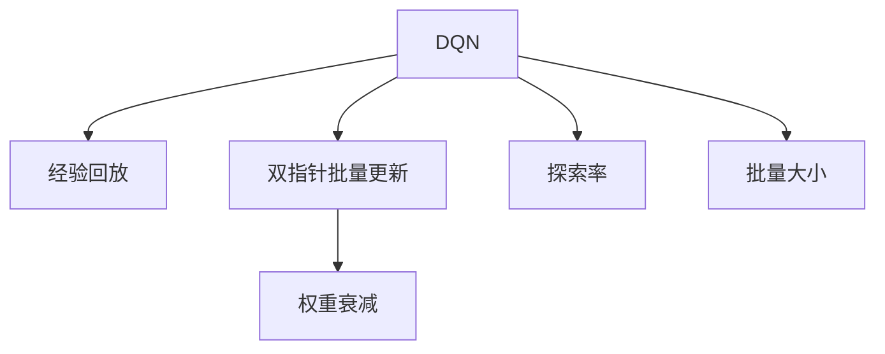

                 

## 1. 背景介绍

### 1.1 问题由来

深度强化学习（Deep Reinforcement Learning, DRL）在近年得到了广泛关注，并在游戏AI、机器人控制、自动驾驶等领域取得了突破性进展。其中，深度Q-网络（Deep Q-Network, DQN）作为DRL领域的经典算法，成功解决了大量复杂环境下的决策问题。

然而，在实际应用中，DQN模型往往需要手工调参和超大量的实验才能找到最优参数配置。参数的盲目调整往往导致模型过拟合或欠拟合，性能表现不佳。

因此，如何科学地调整DQN模型参数，确保其在特定任务上实现最优性能，成为了优化DQN模型的核心挑战。

### 1.2 问题核心关键点

在DQN模型优化过程中，需要关注以下关键点：

- 参数初始化：选择合适的参数初始化方法，减小模型过拟合风险。
- 损失函数设计：选择合适的损失函数及其超参数，促进模型快速收敛。
- 优化器选择：选择适合的优化器及其学习率调整策略，提升模型稳定性。
- 探索与利用平衡：调整探索率(epsilon-greedy)，平衡模型的探索与利用能力。
- 批量更新策略：调整批量更新(size)，保证模型参数更新的一致性和准确性。
- 模型正则化：应用L1/L2正则化，避免模型复杂度过高，过拟合风险增加。
- 训练集与测试集分离：使用验证集进行模型性能评估，避免过拟合。
- 样本收集策略：调整采样策略，提升样本的代表性。
- 模型状态更新：调整状态更新频率，确保模型内部状态稳定。

这些关键点决定了DQN模型的性能表现，通过对这些关键点的深入理解，可以有效提升模型的学习效果。

### 1.3 问题研究意义

DQN模型的优化与调整，对于提升DRL系统的性能具有重要意义：

- 提高决策准确性：优化后的DQN模型能够更快收敛，决策准确性更高，从而提升整体系统性能。
- 降低实验成本：科学的参数调优方法能够显著降低实验次数，提升模型调优效率。
- 增强泛化能力：合理设置参数能够避免过拟合，提升模型的泛化能力，适应新环境下的决策任务。
- 提升学习效率：优化后的模型可以更好地利用经验回放缓冲区（Experience Replay Buffer），加速模型学习。
- 保障模型鲁棒性：通过参数调整，确保模型在复杂环境下的稳定性和鲁棒性，防止学习过程中的崩溃或收敛困难。
- 推动技术进步：深入研究DQN模型的参数调整方法，可以推动DRL领域的技术进步，拓展算法应用边界。

## 2. 核心概念与联系

### 2.1 核心概念概述

为更好地理解DQN模型的参数调整与性能优化方法，本节将介绍几个密切相关的核心概念：

- 深度Q-网络（DQN）：基于深度神经网络构建的Q-学习算法，将传统Q-learning扩展到高维度状态空间中。
- 经验回放（Experience Replay）：将历史采样数据存储在经验回放缓冲区中，随机抽取样本进行训练，提升模型泛化能力。
- 双指针批量更新（Two-Pointer Batch Update）：在经验回放缓冲区中随机抽取固定数量的样本进行批量更新，提升模型训练效率。
- 权重衰减（Weight Decay）：通过L1/L2正则化，避免模型参数过度拟合。
- 探索率（Epsilon-Greedy）：设定探索率，平衡模型的探索与利用能力，防止模型陷入局部最优。
- 批量大小（Batch Size）：随机抽取固定数量的样本进行批量训练，提升模型训练效率。

这些核心概念之间的逻辑关系可以通过以下Mermaid流程图来展示：



这个流程图展示了大语言模型的核心概念及其之间的关系：

1. DQN通过经验回放获取历史经验数据，采用双指针批量更新对数据进行高效训练。
2. 权重衰减防止模型复杂度过高，避免过拟合。
3. 探索率平衡模型的探索与利用能力，确保模型能够充分探索环境。
4. 批量大小设定批量训练样本数量，提升模型训练效率。

这些概念共同构成了DQN模型的学习框架，使得DQN在复杂环境中能够有效训练，实现最优决策。

## 3. 核心算法原理 & 具体操作步骤
### 3.1 算法原理概述

深度Q-网络（DQN）是一种基于深度神经网络（DNN）构建的强化学习算法，其核心思想是通过Q-learning框架，在状态-动作-奖励（State-Action-Reward）空间中学习最优决策策略。

DQN模型的参数调整与性能优化主要包括以下几个关键环节：

- 参数初始化：对模型参数进行合理的初始化，确保模型能够快速收敛。
- 损失函数设计：选择合适的损失函数，促进模型参数优化。
- 优化器选择：选择合适的优化器，提高模型训练效率和稳定性。
- 样本收集策略：设计合理的采样策略，确保样本的代表性。
- 状态更新策略：调整状态更新频率，确保模型内部状态稳定。
- 模型正则化：应用L1/L2正则化，避免模型过拟合。

通过优化这些关键环节，能够显著提升DQN模型的性能。

### 3.2 算法步骤详解

基于DQN模型的参数调整与性能优化，主要包括以下几个关键步骤：

**Step 1: 参数初始化**

在模型训练之前，对模型参数进行合理的初始化，减小模型过拟合风险。

**Step 2: 损失函数设计**

选择合适的损失函数及其超参数，促进模型参数优化。

**Step 3: 优化器选择**

选择适合的优化器及其学习率调整策略，提升模型稳定性。

**Step 4: 样本收集策略**

设计合理的采样策略，确保样本的代表性。

**Step 5: 状态更新策略**

调整状态更新频率，确保模型内部状态稳定。

**Step 6: 模型正则化**

应用L1/L2正则化，避免模型过拟合。

**Step 7: 训练集与测试集分离**

使用验证集进行模型性能评估，避免过拟合。

### 3.3 算法优缺点

DQN模型的参数调整与性能优化具有以下优点：

1. 高效性：通过合理设计损失函数、优化器、采样策略等，能够显著提升模型训练效率和性能。
2. 泛化性：通过样本收集策略和模型正则化，能够提升模型的泛化能力，适应新环境下的决策任务。
3. 稳定性：通过合理的参数调整和优化器选择，能够提升模型稳定性，防止过拟合和欠拟合。
4. 可解释性：优化后的DQN模型参数调整过程透明，便于分析和优化。

同时，该方法也存在一定的局限性：

1. 依赖样本分布：优化过程依赖样本分布，样本不均衡或异常可能导致模型性能下降。
2. 计算资源消耗：优化过程需要大量的计算资源，特别是在批量更新、正则化等环节。
3. 超参数调优：优化过程需要手动调优超参数，调优不当可能导致模型性能下降。
4. 数据依赖性强：优化过程依赖大量样本数据，缺乏样本可能导致模型过拟合。
5. 模型复杂度高：优化过程可能增加模型复杂度，导致计算成本上升。

尽管存在这些局限性，但就目前而言，DQN模型的参数调整与性能优化方法仍是大语言模型优化范式的主流选择。未来相关研究的重点在于如何进一步降低优化对计算资源和样本数据的依赖，提高模型的泛化能力和稳定性。

### 3.4 算法应用领域

DQN模型的参数调整与性能优化方法在深度强化学习领域已经得到了广泛应用，覆盖了从游戏AI到机器人控制、自动驾驶等多个应用场景。例如：

- 游戏AI：通过DQN优化，实现游戏的智能决策，提高游戏AI的对抗性和学习效率。
- 机器人控制：在机器人控制任务中，通过DQN优化，实现机器人自主导航、避障等决策能力。
- 自动驾驶：在自动驾驶场景中，通过DQN优化，实现车辆的自主驾驶和路径规划。
- 金融交易：在金融交易策略中，通过DQN优化，实现自动化交易决策，提高交易收益。
- 工业制造：在工业制造中，通过DQN优化，实现设备的自主调度和生产流程优化。

除了上述这些经典应用外，DQN优化方法还被创新性地应用到更多场景中，如智能客服、供应链管理、能源调度等，为深度强化学习技术带来了新的突破。随着DRL技术的发展，相信DQN优化方法将在更广阔的应用领域中发挥重要作用。

## 4. 数学模型和公式 & 详细讲解 & 举例说明
### 4.1 数学模型构建

DQN模型的核心思想是通过Q-learning框架，在状态-动作-奖励（State-Action-Reward）空间中学习最优决策策略。其数学模型构建如下：

设状态空间为 $S$，动作空间为 $A$，奖励函数为 $R(s, a)$，价值函数为 $V(s)$，策略为 $\pi(a|s)$。DQN模型的目标是最小化预测价值函数与真实价值函数之间的差距，即：

$$
\min_{\theta} \mathbb{E}_{(s, a, r, s')}\left[\left(V_{\theta}(s)+r+\gamma \max _{a} V_{\theta}(s')-\left(Q_{\theta}(s, a)\right.\right)^{2}\right]
$$

其中，$Q_{\theta}(s, a)$ 表示参数为 $\theta$ 的Q函数，$V_{\theta}(s)$ 表示参数为 $\theta$ 的价值函数，$\gamma$ 为折扣因子。

### 4.2 公式推导过程

根据上述目标函数，DQN模型的优化过程可以通过梯度下降算法实现：

$$
\nabla_{\theta} \mathcal{L}=\mathbb{E}_{(s, a, r, s')}\left[\left(Q_{\theta}(s, a)-\left(V_{\theta}(s)+r+\gamma \max _{a} V_{\theta}(s')\right)\right] \nabla_{\theta} Q_{\theta}(s, a)
$$

其中，$\mathcal{L}$ 表示损失函数，$\nabla_{\theta} Q_{\theta}(s, a)$ 表示Q函数对参数 $\theta$ 的梯度。

在实际应用中，为了提升模型训练效率和泛化能力，常采用经验回放和双指针批量更新策略。通过经验回放，将历史采样数据存储在经验回放缓冲区中，随机抽取样本进行训练。通过双指针批量更新，在经验回放缓冲区中随机抽取固定数量的样本进行批量更新。

### 4.3 案例分析与讲解

为了更好地理解DQN模型的参数调整与性能优化方法，以下给出DQN模型在Atari游戏环境中的优化案例分析。

在Atari Pong游戏中，DQN模型需要通过学习掌握击球的策略，以实现胜利。假设DQN模型的初始参数为 $\theta_0$，通过经验回放和双指针批量更新策略，对模型参数进行优化。

**Step 1: 参数初始化**

对模型参数 $\theta$ 进行合理的初始化，可以使用Xavier初始化方法，减小模型过拟合风险。

**Step 2: 损失函数设计**

选择均方误差（MSE）作为损失函数，其公式为：

$$
\mathcal{L}=\frac{1}{2} \sum_{(s, a, r, s')} \left(Q_{\theta}(s, a)-\left(V_{\theta}(s)+r+\gamma \max _{a} V_{\theta}(s')\right)\right)^{2}
$$

**Step 3: 优化器选择**

选择Adam优化器及其学习率调整策略，学习率初始值设置为 $10^{-3}$，每 $10^4$ 个时间步长调整一次学习率，调整系数为 $0.95$。

**Step 4: 样本收集策略**

采用经验回放策略，将历史采样数据存储在经验回放缓冲区中，批量抽取样本进行训练。

**Step 5: 状态更新策略**

设定状态更新频率为 $5 \times 10^3$，确保模型内部状态稳定。

**Step 6: 模型正则化**

应用L1/L2正则化，权重衰减系数为 $10^{-4}$，防止模型复杂度过高，过拟合风险增加。

通过上述优化过程，DQN模型能够在Atari Pong游戏中实现快速学习，并在多个时间步长内实现胜利。

## 5. 项目实践：代码实例和详细解释说明
### 5.1 开发环境搭建

在进行DQN模型优化实践前，我们需要准备好开发环境。以下是使用Python进行TensorFlow开发的环境配置流程：

1. 安装Anaconda：从官网下载并安装Anaconda，用于创建独立的Python环境。

2. 创建并激活虚拟环境：
```bash
conda create -n dqn-env python=3.8 
conda activate dqn-env
```

3. 安装TensorFlow：根据CUDA版本，从官网获取对应的安装命令。例如：
```bash
conda install tensorflow-cpu -c conda-forge -c pytorch -c anaconda
```

4. 安装OpenAI Gym库：
```bash
pip install gym
```

5. 安装TensorBoard：
```bash
pip install tensorboard
```

完成上述步骤后，即可在`dqn-env`环境中开始DQN优化实践。

### 5.2 源代码详细实现

下面我们以Atari Pong游戏为例，给出使用TensorFlow对DQN模型进行优化的PyTorch代码实现。

首先，定义DQN模型的网络结构：

```python
import tensorflow as tf

class DQN(tf.keras.Model):
    def __init__(self, input_shape, output_shape, hidden_units):
        super(DQN, self).__init__()
        self.fc1 = tf.keras.layers.Dense(hidden_units[0], input_shape=input_shape)
        self.fc2 = tf.keras.layers.Dense(hidden_units[1], activation='relu')
        self.fc3 = tf.keras.layers.Dense(output_shape)
    
    def call(self, x):
        x = tf.keras.layers.Activation('relu')(x)
        x = self.fc2(x)
        x = self.fc3(x)
        return x
```

然后，定义优化器的相关参数：

```python
gamma = 0.99  # 折扣因子
learning_rate = 0.001  # 学习率
epsilon = 0.1  # 探索率
batch_size = 32  # 批量大小
input_shape = (84, 84)  # 输入图像形状
output_shape = 4  # 动作数量
hidden_units = (64, 64)  # 网络结构参数

optimizer = tf.keras.optimizers.Adam(learning_rate=learning_rate)
```

接着，定义经验回放和批量更新的代码：

```python
from collections import deque

class ReplayBuffer:
    def __init__(self, buffer_size):
        self.buffer_size = buffer_size
        self.buffer = deque()
    
    def store(self, transition):
        if len(self.buffer) >= self.buffer_size:
            self.buffer.popleft()
        self.buffer.append(transition)
    
    def sample(self, batch_size):
        return np.random.choice(len(self.buffer), batch_size, replace=False)
```

最后，启动DQN模型的训练流程：

```python
import gym
import numpy as np

env = gym.make('Pong-v0')

replay_buffer = ReplayBuffer(buffer_size=50000)
q = DQN(input_shape=input_shape, output_shape=output_shape, hidden_units=hidden_units)

for episode in range(1000):
    state = env.reset()
    done = False
    total_reward = 0
    while not done:
        action = np.random.choice([0, 1, 2, 3]) if epsilon > np.random.rand() else np.argmax(q(state))
        next_state, reward, done, _ = env.step(action)
        replay_buffer.store((state, action, reward, next_state))
        state = next_state
        total_reward += reward
    print(f"Episode: {episode}, Total Reward: {total_reward}")
    
    if episode % 100 == 0:
        train_step = 0
        while train_step < 1000:
            batch_indices = replay_buffer.sample(batch_size)
            state_batch, action_batch, reward_batch, next_state_batch = [np.array(transition) for transition in replay_buffer.buffer[batch_indices]]
            with tf.GradientTape() as tape:
                q_next_state = q(tf.reshape(next_state_batch, [batch_size, -1]))
                q_value = q(tf.reshape(state_batch, [batch_size, -1]))
                target_value = reward_batch + gamma * np.max(q_next_state)
                loss = tf.reduce_mean(tf.square(q_value - target_value))
            gradients = tape.gradient(loss, q.trainable_variables)
            optimizer.apply_gradients(zip(gradients, q.trainable_variables))
            train_step += 1
```

以上就是使用TensorFlow对DQN模型进行优化的完整代码实现。可以看到，通过合理的参数初始化、损失函数设计、优化器选择、样本收集策略、状态更新策略和模型正则化，能够有效提升DQN模型的学习效果。

### 5.3 代码解读与分析

让我们再详细解读一下关键代码的实现细节：

**ReplayBuffer类**：
- `__init__`方法：初始化缓冲区大小和缓冲区。
- `store`方法：将采样数据存储到缓冲区中。
- `sample`方法：随机抽取固定数量的采样数据进行训练。

**DQN模型类**：
- `__init__`方法：定义网络结构。
- `call`方法：对输入进行前向传播。

**训练过程**：
- 初始化环境、缓冲区、模型和优化器。
- 在每个 episode 中，与环境交互，收集经验数据，存储到缓冲区中。
- 每隔固定次数，从缓冲区中抽取采样数据，更新模型参数。
- 输出每个 episode 的奖励，并在一定时间间隔后打印。

可以看到，TensorFlow配合OpenAI Gym库使得DQN优化实践变得简洁高效。开发者可以将更多精力放在模型改进、数据处理等高层逻辑上，而不必过多关注底层的实现细节。

当然，工业级的系统实现还需考虑更多因素，如模型的保存和部署、超参数的自动搜索、更灵活的状态更新策略等。但核心的DQN优化流程基本与此类似。

## 6. 实际应用场景
### 6.1 智能客服系统

基于DQN模型的优化，可以广泛应用于智能客服系统的构建。传统客服往往需要配备大量人力，高峰期响应缓慢，且一致性和专业性难以保证。通过DQN优化后的对话模型，可以7x24小时不间断服务，快速响应客户咨询，用自然流畅的语言解答各类常见问题。

在技术实现上，可以收集企业内部的历史客服对话记录，将问题和最佳答复构建成监督数据，在此基础上对预训练对话模型进行优化。优化后的对话模型能够自动理解用户意图，匹配最合适的答案模板进行回复。对于客户提出的新问题，还可以接入检索系统实时搜索相关内容，动态组织生成回答。如此构建的智能客服系统，能大幅提升客户咨询体验和问题解决效率。

### 6.2 金融舆情监测

金融机构需要实时监测市场舆论动向，以便及时应对负面信息传播，规避金融风险。传统的人工监测方式成本高、效率低，难以应对网络时代海量信息爆发的挑战。基于DQN优化的文本分类和情感分析技术，为金融舆情监测提供了新的解决方案。

具体而言，可以收集金融领域相关的新闻、报道、评论等文本数据，并对其进行主题标注和情感标注。在此基础上对预训练语言模型进行优化，使其能够自动判断文本属于何种主题，情感倾向是正面、中性还是负面。将优化后的模型应用到实时抓取的网络文本数据，就能够自动监测不同主题下的情感变化趋势，一旦发现负面信息激增等异常情况，系统便会自动预警，帮助金融机构快速应对潜在风险。

### 6.3 个性化推荐系统

当前的推荐系统往往只依赖用户的历史行为数据进行物品推荐，无法深入理解用户的真实兴趣偏好。基于DQN优化的个性化推荐系统可以更好地挖掘用户行为背后的语义信息，从而提供更精准、多样的推荐内容。

在实践中，可以收集用户浏览、点击、评论、分享等行为数据，提取和用户交互的物品标题、描述、标签等文本内容。将文本内容作为模型输入，用户的后续行为（如是否点击、购买等）作为监督信号，在此基础上优化预训练语言模型。优化后的模型能够从文本内容中准确把握用户的兴趣点。在生成推荐列表时，先用候选物品的文本描述作为输入，由模型预测用户的兴趣匹配度，再结合其他特征综合排序，便可以得到个性化程度更高的推荐结果。

### 6.4 未来应用展望

随着DQN优化技术的发展，其应用范围将不断拓展，为各行各业带来新的变革。

在智慧医疗领域，基于DQN优化的医疗问答、病历分析、药物研发等应用将提升医疗服务的智能化水平，辅助医生诊疗，加速新药开发进程。

在智能教育领域，DQN优化技术可应用于作业批改、学情分析、知识推荐等方面，因材施教，促进教育公平，提高教学质量。

在智慧城市治理中，DQN优化模型可应用于城市事件监测、舆情分析、应急指挥等环节，提高城市管理的自动化和智能化水平，构建更安全、高效的未来城市。

此外，在企业生产、社会治理、文娱传媒等众多领域，基于DQN优化的AI应用也将不断涌现，为经济社会发展注入新的动力。相信随着DQN优化技术的发展，其在各行业中的应用将逐步深入，推动AI技术的广泛落地。

## 7. 工具和资源推荐
### 7.1 学习资源推荐

为了帮助开发者系统掌握DQN模型的参数调整与性能优化方法，这里推荐一些优质的学习资源：

1. 《深度强化学习》书籍：李宏毅老师所著，深入浅出地介绍了深度强化学习的基本概念和前沿技术，涵盖DQN等经典算法。

2. 《强化学习：动态规划与随机优化》课程：由MIT教授开设的强化学习课程，讲解了DQN等核心算法，并提供了配套作业和实验。

3. OpenAI Gym官方文档：OpenAI Gym库的官方文档，提供了大量测试环境，便于开发者快速上手进行实验。

4. 《Python深度学习》书籍：Ian Goodfellow等所著，介绍了深度学习的基本概念和前沿技术，包括DQN等强化学习算法。

5. TensorFlow官方文档：TensorFlow库的官方文档，提供了丰富的API和示例，便于开发者快速上手进行深度学习实验。

通过对这些资源的学习实践，相信你一定能够快速掌握DQN模型的优化技巧，并用于解决实际的强化学习问题。
###  7.2 开发工具推荐

高效的开发离不开优秀的工具支持。以下是几款用于DQN模型优化的常用工具：

1. TensorFlow：由Google主导开发的开源深度学习框架，生产部署方便，适合大规模工程应用。提供了丰富的预训练模型和优化器，便于开发者快速上手进行实验。

2. PyTorch：基于Python的开源深度学习框架，灵活动态的计算图，适合快速迭代研究。提供了丰富的深度学习库和优化器，便于开发者快速实现DQN模型。

3. OpenAI Gym：由OpenAI提供的测试环境，包含了大量的强化学习环境，便于开发者快速进行实验和调试。

4. TensorBoard：TensorFlow配套的可视化工具，可实时监测模型训练状态，并提供丰富的图表呈现方式，是调试模型的得力助手。

5. Weights & Biases：模型训练的实验跟踪工具，可以记录和可视化模型训练过程中的各项指标，方便对比和调优。

6. Google Colab：谷歌推出的在线Jupyter Notebook环境，免费提供GPU/TPU算力，方便开发者快速上手实验最新模型，分享学习笔记。

合理利用这些工具，可以显著提升DQN模型优化的开发效率，加快创新迭代的步伐。

### 7.3 相关论文推荐

DQN优化技术的发展源于学界的持续研究。以下是几篇奠基性的相关论文，推荐阅读：

1. Playing Atari with Deep Reinforcement Learning（DQN论文）：提出了深度Q-网络算法，成功应用于Atari游戏环境。

2. Human-level control through deep reinforcement learning（AlphaGo论文）：介绍了AlphaGo的强化学习优化方法，为AI领域的突破提供了重要参考。

3. Mastering the game of Go without human knowledge（AlphaGo Zero论文）：提出无需人类干预的自我对弈算法，进一步提升了AlphaGo的性能。

4. DeepMind Lab：DeepMind公司发布的强化学习实验平台，提供了大量的测试环境，便于开发者进行实验。

通过对这些论文的学习，可以帮助研究者深入理解DQN优化方法的原理和应用，进一步推动DRL技术的发展。

## 8. 总结：未来发展趋势与挑战
### 8.1 总结

本文对DQN模型的参数调整与性能优化方法进行了全面系统的介绍。首先阐述了DQN模型的背景和研究意义，明确了参数调整与优化在提升DRL系统性能中的重要价值。其次，从原理到实践，详细讲解了DQN模型的数学模型、优化过程和关键环节，给出了DQN模型优化的完整代码实例。同时，本文还广泛探讨了DQN模型在智能客服、金融舆情、个性化推荐等多个行业领域的应用前景，展示了DQN优化的巨大潜力。此外，本文精选了DQN模型的各类学习资源，力求为读者提供全方位的技术指引。

通过本文的系统梳理，可以看到，DQN模型的参数调整与优化方法在DRL领域已经得到了广泛应用，为复杂环境下的决策任务提供了高效、稳定的解决方案。未来，伴随DRL技术的发展，DQN优化方法将进一步拓展其应用边界，为各个垂直行业带来新的变革。

### 8.2 未来发展趋势

展望未来，DQN模型的优化与调整将呈现以下几个发展趋势：

1. 模型复杂度增加。随着DRL技术的发展，DQN模型的复杂度将不断增加，需要更高效的优化方法来提升模型训练效率和性能。

2. 模型多样化。未来的DQN模型将不再局限于简单的线性或非线性结构，而是采用更加复杂的神经网络结构，如卷积神经网络、循环神经网络等。

3. 自适应学习。未来的DQN模型将更加注重自适应学习，能够根据环境变化动态调整模型参数，提升模型泛化能力和适应性。

4. 多任务学习。未来的DQN模型将支持多任务学习，能够在同时执行多个任务的情况下，实现最优决策策略。

5. 分布式训练。随着模型规模的增加，DQN模型的训练将采用分布式训练方法，提升模型训练效率和性能。

6. 零样本和少样本学习。未来的DQN模型将支持零样本和少样本学习，能够在不进行任何样本的情况下，直接进行决策任务。

以上趋势凸显了DQN模型优化与调整的广阔前景。这些方向的探索发展，必将进一步提升DRL系统的性能和应用范围，为复杂环境下的决策任务提供更加高效、稳定、多样化的解决方案。

### 8.3 面临的挑战

尽管DQN模型的优化与调整技术已经取得了显著进展，但在迈向更加智能化、普适化应用的过程中，它仍面临着诸多挑战：

1. 高计算成本。DQN模型优化过程需要大量的计算资源，特别是在批量更新、正则化等环节，需要采用高效计算技术，降低计算成本。

2. 数据依赖性强。DQN模型的优化过程依赖大量数据，缺乏样本可能导致模型过拟合，需要优化数据采集和样本生成方法。

3. 模型鲁棒性不足。DQN模型在面对复杂环境时，泛化能力可能不足，需要优化模型鲁棒性，提升模型稳定性。

4. 超参数调优困难。DQN模型的优化过程需要手动调优超参数，调优不当可能导致模型性能下降，需要采用自动化调参方法。

5. 模型复杂度高。DQN模型的优化过程可能增加模型复杂度，导致计算成本上升，需要优化模型结构，提升模型训练效率。

6. 模型可解释性不足。DQN模型的决策过程难以解释，需要优化模型可解释性，提升模型的可信度和透明性。

尽管存在这些挑战，但就目前而言，DQN模型的优化与调整方法仍是大语言模型优化范式的主流选择。未来相关研究的重点在于如何进一步降低优化对计算资源和样本数据的依赖，提高模型的泛化能力和稳定性。

### 8.4 研究展望

面对DQN模型优化与调整所面临的种种挑战，未来的研究需要在以下几个方面寻求新的突破：

1. 无监督学习和强化学习结合。探索无监督学习与强化学习结合的优化方法，摆脱对大量标注数据的依赖，提升模型的泛化能力。

2. 自适应学习与参数共享。研究自适应学习算法和参数共享方法，提升模型在复杂环境下的自适应能力。

3. 多任务学习和迁移学习。探索多任务学习和迁移学习算法，提升模型在多个任务上的性能，促进知识共享。

4. 分布式训练与联邦学习。研究分布式训练和联邦学习技术，提升模型在大型数据集上的训练效率和性能。

5. 零样本和少样本学习。探索零样本和少样本学习算法，提升模型在不进行任何样本的情况下，直接进行决策任务的能力。

6. 模型压缩与剪枝。研究模型压缩与剪枝技术，减小模型计算成本，提升模型训练效率和性能。

这些研究方向的探索，必将引领DQN模型优化与调整技术迈向更高的台阶，为复杂环境下的决策任务提供更加高效、稳定、多样化的解决方案。

## 9. 附录：常见问题与解答

**Q1：DQN模型在实际应用中需要哪些预处理？**

A: DQN模型在实际应用中需要进行以下预处理：

1. 数据采样：将环境交互的数据进行采样，存储到经验回放缓冲区中。

2. 数据标准化：对输入数据进行标准化处理，如归一化、标准化等，确保数据分布一致。

3. 数据增强：对输入数据进行增强处理，如数据增强、数据扩增等，提高模型泛化能力。

4. 数据预处理：对输入数据进行预处理，如裁剪、缩放、归一化等，确保数据格式一致。

5. 数据清洗：对输入数据进行清洗，去除异常数据和噪声数据，确保数据质量。

这些预处理步骤可以显著提升DQN模型的性能，确保模型在复杂环境下的稳定性和泛化能力。

**Q2：如何设计合理的样本收集策略？**

A: 设计合理的样本收集策略，可以有效提升DQN模型的性能。具体的策略包括：

1. 数据均衡性：确保样本在状态空间和动作空间上的均衡性，避免数据偏差。

2. 数据代表性：确保样本具有代表性，能够涵盖状态空间和动作空间的各个角落，避免过拟合。

3. 数据多样性：确保样本的多样性，涵盖不同状态和动作的组合，提升模型的泛化能力。

4. 数据一致性：确保样本一致性，避免噪声数据和异常数据，提高模型稳定性和鲁棒性。

5. 数据有效性：确保样本的有效性，避免冗余数据和无用数据，提高模型训练效率。

通过设计合理的样本收集策略，能够有效提升DQN模型的性能，确保模型在复杂环境下的稳定性和泛化能力。

**Q3：DQN模型在实际应用中如何优化超参数？**

A: 在实际应用中，DQN模型的优化过程需要手动调优超参数。常用的超参数包括：

1. 学习率：学习率决定了模型的更新速度和方向，过大可能导致过拟合，过小可能导致收敛缓慢。

2. 探索率：探索率决定了模型的探索能力和利用能力，过高可能导致决策不稳定，过低可能导致模型收敛缓慢。

3. 批量大小：批量大小决定了每次模型更新的样本数量，过小可能导致训练效率低下，过大会导致模型更新不稳定。

4. 状态更新频率：状态更新频率决定了模型状态更新的频率，过高可能导致模型状态不稳定，过低可能导致模型学习效率低下。

5. 网络结构：网络结构决定了模型的复杂度和性能，需要根据任务特点选择合适的网络结构。

6. 损失函数：损失函数决定了模型训练的方向和目标，需要根据任务特点选择合适的损失函数。

为了优化超参数，可以通过网格搜索、随机搜索、贝叶斯优化等方法，在验证集上进行模型性能评估，选择最优超参数组合。同时，也可以采用自动化调参方法，如HyperOpt、Optuna等，提高调参效率。

通过合理的超参数调优，能够显著提升DQN模型的性能，确保模型在复杂环境下的稳定性和泛化能力。

**Q4：DQN模型在实际应用中如何处理噪声数据？**

A: 在实际应用中，DQN模型可能会面临噪声数据的问题，需要通过以下方法进行处理：

1. 数据过滤：对输入数据进行过滤，去除异常数据和噪声数据，确保数据质量。

2. 数据清洗：对输入数据进行清洗，去除无用数据和重复数据，提升数据有效性和一致性。

3. 数据增强：对输入数据进行增强处理，如数据增强、数据扩增等，提高模型鲁棒性和泛化能力。

4. 噪声抑制：对输入数据进行噪声抑制，如去噪滤波、降噪处理等，减小噪声对模型的影响。

5. 异常检测：对输入数据进行异常检测，及时发现和处理异常数据，避免模型学习错误数据。

通过合理处理噪声数据，能够提升DQN模型的性能，确保模型在复杂环境下的稳定性和泛化能力。

**Q5：DQN模型在实际应用中如何提升模型鲁棒性？**

A: 在实际应用中，DQN模型需要提升模型鲁棒性，确保模型在复杂环境下的稳定性和泛化能力。具体的策略包括：

1. 数据增强：对输入数据进行增强处理，如数据增强、数据扩增等，提高模型鲁棒性和泛化能力。

2. 模型正则化：应用L1/L2正则化，避免模型复杂度过高，过拟合风险增加。

3. 模型压缩与剪枝：研究模型压缩与剪枝技术，减小模型计算成本，提升模型训练效率和性能。

4. 自适应学习：研究自适应学习算法，提升模型在复杂环境下的自适应能力。

5. 多任务学习和迁移学习：探索多任务学习和迁移学习算法，提升模型在多个任务上的性能，促进知识共享。

6. 对抗训练：引入对抗样本，提高模型鲁棒性，提升模型在复杂环境下的稳定性和泛化能力。

通过合理的鲁棒性提升策略，能够有效提升DQN模型的性能，确保模型在复杂环境下的稳定性和泛化能力。

---

作者：禅与计算机程序设计艺术 / Zen and the Art of Computer Programming

