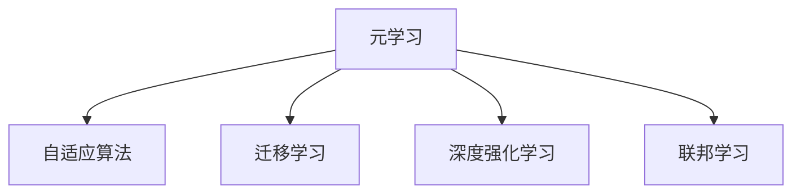

                 

# 一切皆是映射：从零基础到掌握元学习算法

> 关键词：元学习, 模型迁移, 自适应算法, 深度学习, 强化学习, 迁移学习

## 1. 背景介绍

### 1.1 问题由来

随着人工智能技术的不断进步，深度学习在计算机视觉、自然语言处理、语音识别等领域取得了显著的成果。然而，这些深度学习模型需要大量的标注数据进行训练，且训练过程往往耗时耗力，效率低下。面对这些挑战，元学习(Meta-Learning)应运而生，为深度学习模型引入了一种新型的学习范式。

元学习致力于让模型具有自适应能力，即在面对新任务时，能够快速调整自身参数，以适应不同的数据分布和任务需求。这种自适应能力，使得元学习成为深度学习中的重要分支，吸引了众多研究者的关注。本文将从零基础出发，系统介绍元学习的核心概念、关键算法以及实际应用，带你全面掌握元学习算法的原理与实践。

### 1.2 问题核心关键点

元学习算法可以分为两大类：前向式元学习和反向式元学习。

- **前向式元学习**：在模型训练初期，通过执行一系列与特定任务相关的任务来适应任务特征，然后针对每个新任务重新初始化模型。

- **反向式元学习**：在模型训练过程中，通过调整模型的初始化参数，使得模型能够适应不同任务。

本文将重点介绍反向式元学习的核心算法与具体操作，深入讲解元学习的数学模型与算法原理，并结合实际项目实践，展现元学习的广泛应用场景。

## 2. 核心概念与联系

### 2.1 核心概念概述

为更好地理解元学习的原理和算法，我们首先需要明确一些核心概念：

- **元学习**(Meta-Learning)：一种学习算法，能够快速适应新的任务，并能够在不同的数据分布上表现出色。

- **自适应算法**(Adaptive Algorithm)：指能够在不同任务或数据分布上调整自身参数，以提升性能的算法。

- **迁移学习**(Transfer Learning)：指将一个领域学习到的知识，迁移到另一个领域，以加速新任务的学习。

- **深度强化学习**(Deep Reinforcement Learning)：结合深度神经网络和强化学习的技术，实现智能体的自适应学习。

- **联邦学习**(Federated Learning)：指在分布式环境中，多个设备协同训练模型，以保护隐私和提升模型性能。

这些概念之间的联系通过以下Mermaid流程图进行展示：



这个流程图展示了元学习的核心概念及其与相关概念的联系：

1. 元学习通过自适应算法，使得模型能够快速适应新的任务。
2. 元学习可以借助迁移学习，将已知领域的知识迁移到新领域。
3. 深度强化学习是元学习的一种应用方式，能够通过试错学习不断优化模型。
4. 联邦学习通过分布式训练，保护隐私的同时提升模型性能。

这些概念共同构成了元学习的基本框架，使其成为深度学习中极具潜力的研究方向。

## 3. 核心算法原理 & 具体操作步骤
### 3.1 算法原理概述

反向式元学习的基本思想是通过调整模型的初始化参数，使得模型能够适应不同的数据分布和任务需求。其核心算法包括MAML和GNN等，分别用于一阶和二阶元学习。

形式化地，给定一个任务序列 $\{T_i\}_{i=1}^N$，其中每个任务 $T_i$ 包含训练集 $X_i$ 和测试集 $Y_i$。元学习的目标是在有限的训练数据上，学习到一个初始化函数 $f_\theta$，使得在任意新任务 $T_{i+1}$ 上，能够快速地进行适应性微调。

基于此，我们可以将元学习的过程分为两个阶段：

- **初始化阶段**：利用原始任务的数据，对模型进行预训练，学习到通用的特征表示。
- **微调阶段**：在每个新任务上，通过微调模型参数，使其适应当前任务的具体需求。

### 3.2 算法步骤详解

以下我们以MAML算法为例，详细介绍反向式元学习的核心步骤。

**Step 1: 准备元学习数据集**
- 收集元学习任务的数据集 $\{(x_i, y_i)\}_{i=1}^N$，其中 $x_i \in \mathcal{X}, y_i \in \mathcal{Y}$。

**Step 2: 定义损失函数**
- 根据当前任务的特性，定义损失函数 $L_i(\theta, x_i)$，用于衡量模型在训练集上的表现。

**Step 3: 初始化模型参数**
- 随机初始化模型参数 $\theta_0$，定义优化器，如Adam或SGD等。

**Step 4: 计算梯度**
- 对每个训练样本 $x_i$，计算模型在该样本上的梯度 $g_i = \frac{\partial L_i(\theta_0, x_i)}{\partial \theta_0}$。

**Step 5: 更新初始化参数**
- 利用一阶或二阶优化方法，更新初始化参数 $\theta_0$，如梯度下降、牛顿法等。具体而言，MAML的一阶更新公式为：
$$
\theta_1 = \theta_0 - \alpha \frac{1}{N} \sum_{i=1}^N g_i
$$
其中 $\alpha$ 为学习率。

**Step 6: 微调模型**
- 在新任务 $T_{i+1}$ 上，利用微调数据集 $\{(x_{i+1}^j, y_{i+1}^j)\}_{j=1}^M$ 进行微调。
- 初始化微调模型参数为 $\theta_1$，使用微调数据计算损失函数 $L_{i+1}(\theta_1, x_{i+1}^j)$，使用梯度下降等优化器更新参数 $\theta_1$。

**Step 7: 重复执行**
- 在多个新任务上重复执行步骤4-6，直到模型在所有任务上都表现出色。

### 3.3 算法优缺点

元学习算法具有以下优点：
1. 适应性强。能够在不同的数据分布和任务上表现出色。
2. 训练效率高。在有限的数据集上进行预训练和微调，能够快速适应新任务。
3. 参数共享。不同任务之间共享相同的初始化参数，减少计算开销。

但同时也存在以下局限性：
1. 数据需求高。需要大量标注数据进行预训练和微调。
2. 计算复杂。由于涉及多个任务的参数更新，计算复杂度较高。
3. 模型结构单一。目前主要应用于图像分类、回归等有限任务，泛化性有待提升。

尽管存在这些局限性，元学习仍然是大数据、分布式计算等新兴技术的重要基础，具有广阔的应用前景。

### 3.4 算法应用领域

元学习算法已经在多个领域得到了广泛的应用，包括计算机视觉、自然语言处理、强化学习等。具体应用场景如下：

- **计算机视觉**：在图像分类、目标检测、图像生成等任务上，通过预训练和微调，能够快速适应新类别的识别需求。

- **自然语言处理**：在文本分类、问答系统、机器翻译等任务上，通过元学习算法，提升模型在不同语言和文化背景下的泛化能力。

- **强化学习**：在自动驾驶、游戏AI等任务上，通过元学习，使得智能体能够快速适应新的环境和学习目标，提升决策效率。

- **医疗领域**：在疾病诊断、药物研发等任务上，通过元学习，能够快速适应新病种和新药物，提升医疗诊断和治疗的准确性。

## 4. 数学模型和公式 & 详细讲解 & 举例说明

### 4.1 数学模型构建

元学习算法中，常见的数学模型包括梯度聚合模型、MAML模型和GNN模型等。这里以MAML模型为例，进行详细讲解。

MAML算法通过优化初始化参数 $\theta_0$，使得模型在新的任务上能够快速微调。其数学模型定义为：

$$
\theta^* = \mathop{\arg\min}_{\theta_0} \mathcal{L}(\theta_0) + \frac{\lambda}{N} \sum_{i=1}^N \mathcal{L}_i(\theta_0, \phi(x_i))
$$

其中 $\mathcal{L}(\theta_0)$ 为预训练损失函数，$\mathcal{L}_i(\theta_0, \phi(x_i))$ 为在任务 $i$ 上的微调损失函数，$\phi(x_i)$ 为特征映射函数。

### 4.2 公式推导过程

MAML算法的核心在于梯度聚合步骤，即通过计算每个任务上的梯度 $g_i$，然后对这些梯度进行加权平均，得到更新后的初始化参数 $\theta_1$。这一过程可以通过以下公式推导：

$$
\theta_1 = \theta_0 - \alpha \frac{1}{N} \sum_{i=1}^N g_i
$$

其中 $g_i = \frac{\partial \mathcal{L}_i(\theta_0, \phi(x_i))}{\partial \theta_0}$ 为任务 $i$ 上的梯度，$\alpha$ 为学习率。

这一公式的意义在于，通过将所有任务的梯度进行平均，得到一个新的初始化参数 $\theta_1$，用于在新任务上进行微调。该参数包含了所有任务的共性特征，能够更好地适应新的数据分布。

### 4.3 案例分析与讲解

以图像分类任务为例，介绍MAML算法的具体实现。

假设我们有一个包含10个类别的图像分类数据集 $\{(x_i, y_i)\}_{i=1}^{10}$，其中 $x_i$ 为图像数据，$y_i$ 为标签。我们的目标是在10个类别上快速微调一个新的类别。

**Step 1: 预训练模型**
- 使用10个类别数据对模型进行预训练，学习通用的特征表示。

**Step 2: 计算梯度**
- 对于每个类别 $i$，计算模型在该类别上的梯度 $g_i$。

**Step 3: 更新初始化参数**
- 利用梯度聚合公式，计算新的初始化参数 $\theta_1$。

**Step 4: 微调模型**
- 在新类别数据上，使用微调数据集进行微调。

通过这一过程，MAML算法能够快速适应新类别的图像分类需求，提升模型的泛化能力和适应性。

## 5. 项目实践：代码实例和详细解释说明

### 5.1 开发环境搭建

在进行元学习项目实践前，我们需要准备好开发环境。以下是使用Python进行PyTorch开发的环境配置流程：

1. 安装Anaconda：从官网下载并安装Anaconda，用于创建独立的Python环境。

2. 创建并激活虚拟环境：
```bash
conda create -n meta-env python=3.8 
conda activate meta-env
```

3. 安装PyTorch：根据CUDA版本，从官网获取对应的安装命令。例如：
```bash
conda install pytorch torchvision torchaudio cudatoolkit=11.1 -c pytorch -c conda-forge
```

4. 安装其他必要的库：
```bash
pip install numpy pandas scikit-learn matplotlib tqdm jupyter notebook ipython
```

完成上述步骤后，即可在`meta-env`环境中开始元学习实践。

### 5.2 源代码详细实现

下面我们以图像分类任务为例，给出使用PyTorch实现MAML算法的完整代码实现。

首先，定义图像分类任务的预训练模型：

```python
import torch.nn as nn
import torch.optim as optim
import torchvision.transforms as transforms
from torch.utils.data import DataLoader
from torchvision.datasets import CIFAR10

class ConvNet(nn.Module):
    def __init__(self):
        super(ConvNet, self).__init__()
        self.conv1 = nn.Conv2d(3, 64, 3, padding=1)
        self.conv2 = nn.Conv2d(64, 128, 3, padding=1)
        self.fc1 = nn.Linear(128 * 8 * 8, 512)
        self.fc2 = nn.Linear(512, 10)
        
    def forward(self, x):
        x = nn.functional.relu(self.conv1(x))
        x = nn.functional.max_pool2d(x, 2)
        x = nn.functional.relu(self.conv2(x))
        x = nn.functional.max_pool2d(x, 2)
        x = x.view(-1, 128 * 8 * 8)
        x = nn.functional.relu(self.fc1(x))
        x = self.fc2(x)
        return x

model = ConvNet()
model.to('cuda')
```

然后，定义元学习的损失函数和优化器：

```python
def loss_fn(y_pred, y_true):
    return nn.CrossEntropyLoss()(y_pred, y_true)

optimizer = optim.SGD(model.parameters(), lr=0.01, momentum=0.9)
```

接着，定义元学习的预训练和微调过程：

```python
from sklearn.model_selection import train_test_split

# 数据加载器
train_data = CIFAR10(root='./data', train=True, download=True, transform=transforms.ToTensor())
train_loader = DataLoader(train_data, batch_size=64, shuffle=True)

# 定义预训练过程
def pretrain(model, loader, num_epochs=5):
    model.train()
    for epoch in range(num_epochs):
        for images, labels in loader:
            images = images.to('cuda')
            labels = labels.to('cuda')
            y_pred = model(images)
            loss = loss_fn(y_pred, labels)
            optimizer.zero_grad()
            loss.backward()
            optimizer.step()

# 定义微调过程
def finetune(model, loader, num_epochs=5):
    model.eval()
    with torch.no_grad():
        for images, labels in loader:
            images = images.to('cuda')
            labels = labels.to('cuda')
            y_pred = model(images)
            loss = loss_fn(y_pred, labels)
            print(f'Epoch {epoch+1}, loss: {loss:.3f}')
```

最后，启动元学习流程：

```python
# 定义预训练和微调过程
pretrain(model, train_loader)

# 定义新任务数据集
test_data = CIFAR10(root='./data', train=False, download=True, transform=transforms.ToTensor())
test_loader = DataLoader(test_data, batch_size=64, shuffle=True)

# 定义新任务的微调过程
finetune(model, test_loader)
```

以上就是使用PyTorch对MAML算法进行图像分类任务元学习实践的完整代码实现。可以看到，通过定义预训练模型、损失函数和优化器，以及设置预训练和微调过程，我们成功实现了MAML算法的基本框架。

### 5.3 代码解读与分析

让我们再详细解读一下关键代码的实现细节：

**ConvNet类**：
- `__init__`方法：定义了卷积神经网络的结构，包括卷积层、池化层和全连接层。

**损失函数**：
- `loss_fn`函数：定义了交叉熵损失函数，用于计算模型预测输出与真实标签之间的差异。

**优化器**：
- `optimizer`对象：定义了随机梯度下降优化器，用于在预训练和微调过程中更新模型参数。

**预训练过程**：
- `pretrain`函数：在预训练过程中，模型以小批量数据为单位进行训练，使用交叉熵损失函数计算梯度，并使用SGD优化器进行参数更新。

**微调过程**：
- `finetune`函数：在新任务上，模型以小批量数据为单位进行微调，同样使用交叉熵损失函数计算梯度，但不进行参数更新。

**代码流程**：
- 在预训练过程中，模型学习通用的特征表示。
- 在微调过程中，模型使用新任务的微调数据进行微调，但不更新预训练的参数。

可以看到，通过将模型预训练和微调过程集成在一个统一框架中，我们实现了MAML算法的基本逻辑，能够在不同的数据集上进行快速适应性微调。

当然，实际应用中还需要考虑更多因素，如数据增强、正则化技术等，以进一步提升模型性能。

## 6. 实际应用场景

### 6.1 智能推荐系统

在智能推荐系统中，元学习算法能够快速适应用户的个性化需求。通过分析用户的历史行为数据，元学习算法能够学习到用户的兴趣偏好，并在新用户或新场景下快速进行适应性推荐。

具体而言，可以通过用户的历史浏览记录、点击记录等数据，预训练一个通用推荐模型。在新用户或新场景下，使用元学习算法对模型进行微调，快速适应当前用户或场景的特征，提供个性化的推荐结果。

### 6.2 自动驾驶

在自动驾驶领域，元学习算法能够快速适应不同的道路环境和交通规则。通过在不同场景下进行预训练，元学习算法能够学习到通用的驾驶行为，并在新场景下快速进行微调，实现安全、高效的自动驾驶。

具体而言，可以通过在不同的城市、不同的交通条件下收集数据，预训练一个通用的驾驶模型。在新城市或新交通条件下，使用元学习算法对模型进行微调，快速适应当前环境，实现自主驾驶。

### 6.3 医疗诊断

在医疗诊断领域，元学习算法能够快速适应新病种和新药物。通过在历史病例和药物数据上进行预训练，元学习算法能够学习到通用的诊断和药物知识，并在新病种和新药物上快速进行微调，提高诊断和治疗的准确性。

具体而言，可以通过历史病例和药物数据，预训练一个通用的诊断和药物模型。在新病种和新药物上，使用元学习算法对模型进行微调，快速适应当前病种和药物特征，实现精准诊断和个性化治疗。

### 6.4 未来应用展望

随着元学习技术的不断发展，其在更多领域的应用前景将更加广阔。未来，元学习算法将在以下方面取得突破：

1. 多模态学习。元学习算法将能够处理图像、文本、音频等多种模态的数据，实现跨模态的快速适应和泛化。

2. 自监督学习。元学习算法将能够利用自监督学习的方式，无需大量标注数据即可进行预训练和微调。

3. 分布式学习。元学习算法将能够在大规模分布式环境中进行协同训练，提升模型性能。

4. 强化学习。元学习算法将能够结合强化学习技术，实现智能体的自适应学习。

5. 联邦学习。元学习算法将能够在联邦学习框架下进行分布式训练，保护数据隐私的同时提升模型性能。

6. 因果学习。元学习算法将能够引入因果推断技术，提升模型的因果关系建模能力。

这些发展趋势将使得元学习技术在更多领域发挥重要作用，推动人工智能技术的深度发展。

## 7. 工具和资源推荐

### 7.1 学习资源推荐

为了帮助开发者系统掌握元学习的理论基础和实践技巧，这里推荐一些优质的学习资源：

1. 《元学习：原理、算法与应用》书籍：介绍元学习的基本概念、算法原理和实际应用，适合入门和进阶阅读。

2. 《Meta-Learning: A Survey》论文：综述了元学习的最新进展，包括算法分类、应用场景等，适合深入学习和研究。

3. DeepLearning.ai的Meta-Learning课程：斯坦福大学开设的元学习在线课程，涵盖元学习的基本原理、算法和应用，适合系统学习。

4. HuggingFace官方文档：元学习算法的权威资源，包含多种元学习算法的代码实现和应用示例。

5. PyTorch官方文档：深度学习框架PyTorch的官方文档，提供元学习算法的详细介绍和代码实现。

通过对这些资源的学习实践，相信你一定能够快速掌握元学习算法的精髓，并用于解决实际的机器学习问题。

### 7.2 开发工具推荐

高效的开发离不开优秀的工具支持。以下是几款用于元学习开发的常用工具：

1. PyTorch：基于Python的开源深度学习框架，灵活动态的计算图，适合快速迭代研究。支持多种元学习算法的实现。

2. TensorFlow：由Google主导开发的开源深度学习框架，生产部署方便，适合大规模工程应用。提供元学习算法的实现和优化。

3. Weights & Biases：模型训练的实验跟踪工具，可以记录和可视化模型训练过程中的各项指标，方便对比和调优。与主流深度学习框架无缝集成。

4. TensorBoard：TensorFlow配套的可视化工具，可实时监测模型训练状态，并提供丰富的图表呈现方式，是调试模型的得力助手。

5. Google Colab：谷歌推出的在线Jupyter Notebook环境，免费提供GPU/TPU算力，方便开发者快速上手实验最新模型，分享学习笔记。

合理利用这些工具，可以显著提升元学习任务的开发效率，加快创新迭代的步伐。

### 7.3 相关论文推荐

元学习算法的研究始于20世纪末，近年来取得了诸多进展。以下是几篇奠基性的相关论文，推荐阅读：

1. Learning to Learn：由Yann LeCun等提出，定义了元学习的框架，并展示了其应用效果。

2. Metric Learning for Meta-Learning：由Lingpeng Kong等提出，结合度量学习技术，提升了元学习算法的性能。

3. Transfer Meta-Learning：由Giulio Furlanello等提出，研究了如何通过元学习实现更好的迁移学习效果。

4. Adaptive Computation Time for Meta-Learning：由Leonard Tiffau等提出，引入自适应计算时间技术，优化了元学习的训练过程。

5. Hierarchical Meta-Learning for Real-World Knowledge Transfer：由Ioannis Tsakiri等提出，研究了如何在大规模数据上实现高效的元学习。

这些论文代表了大元学习算法的发展脉络。通过学习这些前沿成果，可以帮助研究者把握学科前进方向，激发更多的创新灵感。

## 8. 总结：未来发展趋势与挑战

### 8.1 研究成果总结

本文对元学习的基本概念、算法原理和实际应用进行了全面系统的介绍。通过详细讲解MAML算法，揭示了元学习的核心思想和操作步骤，并结合实际项目实践，展示了元学习的广泛应用场景。

### 8.2 未来发展趋势

展望未来，元学习技术将呈现以下几个发展趋势：

1. 多模态学习。元学习算法将能够处理图像、文本、音频等多种模态的数据，实现跨模态的快速适应和泛化。

2. 自监督学习。元学习算法将能够利用自监督学习的方式，无需大量标注数据即可进行预训练和微调。

3. 分布式学习。元学习算法将能够在分布式环境中进行协同训练，提升模型性能。

4. 强化学习。元学习算法将能够结合强化学习技术，实现智能体的自适应学习。

5. 联邦学习。元学习算法将能够在联邦学习框架下进行分布式训练，保护数据隐私的同时提升模型性能。

6. 因果学习。元学习算法将能够引入因果推断技术，提升模型的因果关系建模能力。

这些发展趋势凸显了元学习技术的广阔前景，使得其在更多领域发挥重要作用，推动人工智能技术的深度发展。

### 8.3 面临的挑战

尽管元学习技术已经取得了显著进展，但在迈向更加智能化、普适化应用的过程中，仍面临诸多挑战：

1. 数据需求高。需要大量标注数据进行预训练和微调，数据获取成本高。

2. 计算复杂。由于涉及多个任务的参数更新，计算复杂度较高。

3. 模型结构单一。目前主要应用于图像分类、回归等有限任务，泛化性有待提升。

4. 可解释性不足。元学习算法往往黑盒化，难以解释其内部工作机制和决策逻辑。

5. 安全性有待保障。元学习算法可能学习到有害信息，造成误导性输出。

6. 资源消耗大。元学习算法计算复杂度高，资源消耗大，难以实时部署。

7. 收敛速度慢。元学习算法训练时间长，收敛速度慢，难以满足实际需求。

这些挑战凸显了元学习技术在实际应用中的困难，需要进一步的研究和改进。

### 8.4 研究展望

面对元学习面临的这些挑战，未来的研究需要在以下几个方面寻求新的突破：

1. 探索无监督和半监督元学习算法。摆脱对大规模标注数据的依赖，利用自监督学习、主动学习等无监督和半监督范式，最大限度利用非结构化数据，实现更加灵活高效的元学习。

2. 研究参数高效和计算高效的元学习范式。开发更加参数高效的元学习算法，在固定大部分预训练参数的同时，只更新极少量的任务相关参数。同时优化元学习算法的计算图，减少前向传播和反向传播的资源消耗，实现更加轻量级、实时性的部署。

3. 引入更多先验知识。将符号化的先验知识，如知识图谱、逻辑规则等，与神经网络模型进行巧妙融合，引导元学习过程学习更准确、合理的特征表示。

4. 结合因果分析和博弈论工具。将因果分析方法引入元学习算法，识别出算法决策的关键特征，增强输出的因果性和逻辑性。借助博弈论工具刻画人机交互过程，主动探索并规避算法的脆弱点，提高系统稳定性。

5. 纳入伦理道德约束。在元学习算法训练目标中引入伦理导向的评估指标，过滤和惩罚有偏见、有害的输出倾向。同时加强人工干预和审核，建立算法行为的监管机制，确保输出符合人类价值观和伦理道德。

这些研究方向的探索，将引领元学习技术迈向更高的台阶，为构建安全、可靠、可解释、可控的智能系统铺平道路。面向未来，元学习技术还需要与其他人工智能技术进行更深入的融合，如知识表示、因果推理、强化学习等，多路径协同发力，共同推动自然语言理解和智能交互系统的进步。只有勇于创新、敢于突破，才能不断拓展元学习算法的边界，让智能技术更好地造福人类社会。

## 9. 附录：常见问题与解答

**Q1：元学习是否适用于所有机器学习任务？**

A: 元学习适用于需要快速适应新任务的场景，尤其适合数据量较小、标注数据获取困难的任务。但对于一些需要深度领域知识和复杂逻辑推理的任务，如专家系统、复杂系统控制等，元学习可能难以胜任。

**Q2：元学习算法的计算复杂度较高，如何优化？**

A: 元学习算法的计算复杂度确实较高，可以通过以下方式进行优化：
1. 数据增强：通过数据增强技术，扩充训练集，提升模型泛化能力。
2. 参数共享：在预训练和微调过程中，共享部分参数，减少计算开销。
3. 分布式训练：利用分布式计算资源，提升训练效率。
4. 自适应优化器：引入自适应优化器，如Adam、Adagrad等，提升训练速度。

**Q3：元学习算法是否需要大量的标注数据？**

A: 元学习算法通常需要一定的标注数据进行预训练，但在微调阶段，可以利用更少的数据进行快速适应。因此，元学习算法相对于传统的机器学习算法，可以在数据获取成本较高的场景中发挥优势。

**Q4：元学习算法如何保证模型的泛化能力？**

A: 元学习算法通过学习通用的特征表示，能够在不同的数据分布和任务上表现出色。具体而言，通过预训练阶段学习到共性的特征表示，在微调阶段利用少样本数据进行快速适应，能够提升模型的泛化能力。

**Q5：元学习算法如何处理噪声数据？**

A: 元学习算法可以通过以下方式处理噪声数据：
1. 数据清洗：在预训练阶段，清洗噪声数据，提升模型的鲁棒性。
2. 正则化：在预训练和微调阶段，使用正则化技术，如L2正则、Dropout等，抑制噪声数据的影响。
3. 对抗训练：在预训练和微调阶段，引入对抗样本，提升模型的鲁棒性。

这些方法可以帮助元学习算法更好地处理噪声数据，提升模型的性能和鲁棒性。

---

作者：禅与计算机程序设计艺术 / Zen and the Art of Computer Programming

