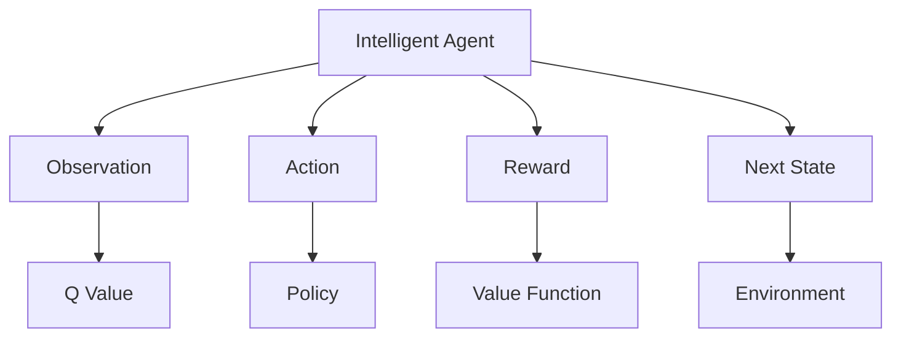

                 

# 一切皆是映射：强化学习在工业自动化中的应用：挑战与机遇

> 关键词：工业自动化,强化学习,机器人控制,制造工艺优化,智能生产调度,自动化决策系统,智能工厂

## 1. 背景介绍

### 1.1 问题由来
在过去几十年中，工业自动化经历了飞速的发展，逐步从简单的机械自动化过渡到智能自动化。随着新一轮工业革命（即工业4.0）的到来，工业自动化正在迎来一场新的变革，其核心是“智能”和“互联”。智能制造正在逐步取代传统制造，从以“机”为中心转向以“人”为中心，追求更高效、更智能的生产过程。

### 1.2 问题核心关键点
强化学习(Reinforcement Learning, RL)作为机器学习的一种，与传统的监督学习和无监督学习不同，其核心在于智能体（agent）通过不断与环境互动，获取奖励和惩罚信号，从而优化决策策略。强化学习的应用领域广泛，但其在工业自动化中的应用尚处于初步探索阶段。

在工业自动化领域，强化学习主要应用于机器人控制、制造工艺优化、智能生产调度、自动化决策系统等多个方面。其核心思想是通过智能体自主学习，不断优化操作策略，提高生产效率，降低生产成本，提升产品质量。

### 1.3 问题研究意义
研究强化学习在工业自动化中的应用，对推动智能制造的发展具有重要意义：

1. **提高生产效率**：通过优化生产工艺和操作策略，减少生产过程中的浪费和停机时间，从而提升生产效率。
2. **降低生产成本**：智能体的自主决策可以优化物料使用和能源消耗，减少生产过程中的原材料和能源浪费。
3. **提升产品质量**：通过不断调整工艺参数，智能体可以保证产品质量的稳定性和一致性。
4. **增强决策鲁棒性**：智能体的自主学习和优化过程，使其能够应对环境变化和突发情况，提高决策的鲁棒性。
5. **推动技术创新**：强化学习的应用为工业自动化带来了新的技术路径和方法，推动了技术创新和行业进步。
6. **助力企业转型**：智能化的生产过程和决策系统能够帮助企业更好地适应市场变化，提高竞争力。

## 2. 核心概念与联系

### 2.1 核心概念概述

为更好地理解强化学习在工业自动化中的应用，本节将介绍几个密切相关的核心概念：

- **强化学习**：一种通过智能体与环境互动，不断优化决策策略的机器学习方法。强化学习的应用涉及决策、控制、优化等领域。
- **智能体**：强化学习中的主体，通过感知环境状态，采取行动，并获得反馈（奖励和惩罚）。
- **环境**：智能体与之互动的外部系统或过程，提供状态和反馈，并影响智能体的行为。
- **状态**：环境中的变量，智能体通过感知状态来决策和行动。
- **动作**：智能体采取的具体行为或决策。
- **奖励**：智能体采取动作后获得的外部信号，用于指导其后续决策。
- **策略**：智能体采取动作的规则或模型，通常表示为策略函数。
- **Q值**：状态-动作对的价值，即从当前状态出发，采取该动作的长期收益。

这些核心概念之间的逻辑关系可以通过以下Mermaid流程图来展示：



这个流程图展示了一轮强化学习过程：

1. 智能体从环境中感知状态（B），并根据当前状态选择动作（C）。
2. 动作执行后，环境提供反馈（奖励D），并转移到新的状态（E）。
3. 通过奖励信号，智能体更新其Q值（F）和策略（G），并迭代学习最优策略。

## 3. 核心算法原理 & 具体操作步骤
### 3.1 算法原理概述

强化学习在工业自动化中的应用，核心在于通过智能体与环境的交互，不断优化操作策略。其核心思想可以概括为“感知-决策-执行-反馈”循环：

- **感知（Obs）**：智能体从环境中获取当前状态（Obs），并根据状态信息进行决策。
- **决策（Act）**：智能体根据当前状态选择动作（Act），可能涉及多维度的变量，如机器人关节位置、加工参数等。
- **执行（Eco）**：智能体执行所选择动作，在环境中产生效果。
- **反馈（Rew）**：环境向智能体提供奖励或惩罚，反馈其行为的效果。

强化学习算法通过不断迭代这一循环，逐步学习到最优决策策略。其关键在于如何设计状态表示、动作空间、奖励函数和策略更新规则，从而高效地学习最优策略。

### 3.2 算法步骤详解

强化学习在工业自动化中的应用步骤包括：

1. **环境建模**：将工业自动化系统建模为智能体可以感知和互动的环境。
2. **状态表示**：设计有效的状态表示方法，用于描述环境中的重要变量。
3. **动作空间**：确定智能体可采取的具体动作空间，如机器人的关节位置、加工参数等。
4. **奖励函数**：定义适当的奖励函数，指导智能体的决策方向。
5. **策略更新**：选择合适的强化学习算法，如Q-learning、SARSA、Deep Q Network（DQN）等，并设计策略更新规则。
6. **训练和测试**：在训练集上训练智能体，在测试集上评估其性能，并进行策略优化。
7. **部署和迭代**：将训练好的智能体部署到实际环境中，进行持续优化和迭代学习。

### 3.3 算法优缺点

强化学习在工业自动化中的应用，具有以下优点：

1. **适应性强**：强化学习能够适应复杂多变的环境，自适应地调整决策策略。
2. **动态优化**：通过实时反馈，智能体可以动态优化操作策略，提升生产效率。
3. **鲁棒性好**：智能体的自主学习过程，使其能够应对环境变化和突发情况。
4. **可扩展性**：强化学习框架适用于多种工业自动化场景，如机器人控制、工艺优化、智能调度等。

同时，也存在以下缺点：

1. **数据需求高**：强化学习需要大量的数据进行训练，尤其在工业环境数据采集难度较大的情况下，数据获取成本较高。
2. **模型复杂**：高维度的状态空间和动作空间，使得强化学习模型构建和训练过程较为复杂。
3. **策略稳定**：智能体的策略优化过程容易陷入局部最优，导致策略不收敛。
4. **奖励设计难**：设计合理的奖励函数是强化学习的关键，奖励设计不当可能导致策略学习偏差。
5. **计算资源需求大**：高维度的状态空间和动作空间，需要强大的计算资源支持。

### 3.4 算法应用领域

强化学习在工业自动化中的应用领域广泛，主要包括：

- **机器人控制**：通过智能体控制机器人关节和动作，实现自动化装配、焊接、搬运等操作。
- **制造工艺优化**：通过智能体优化加工参数和工艺流程，提升产品质量和生产效率。
- **智能生产调度**：通过智能体进行生产任务的调度和分配，优化生产资源利用率。
- **自动化决策系统**：在复杂的生产环境中，智能体进行实时决策，提高生产调度和控制精度。
- **智能工厂管理**：在智能工厂中，智能体进行设备维护、质量检测、异常监测等任务，提升工厂管理水平。

## 4. 数学模型和公式 & 详细讲解  
### 4.1 数学模型构建

在工业自动化中，强化学习的应用涉及多维状态空间和动作空间，通常可以表示为：

$$
S = \{x_1, x_2, \dots, x_n\}, \quad A = \{a_1, a_2, \dots, a_m\}
$$

其中，$S$表示状态空间，$A$表示动作空间。智能体的策略表示为：

$$
\pi: S \times A \rightarrow [0, 1]
$$

表示在状态$s$下，采取动作$a$的概率。智能体的目标是在策略$\pi$下，最大化长期奖励和。

强化学习的核心在于求解最优策略$\pi^*$，使得期望的长期奖励和最大。常用的求解方法包括：

- **Q值迭代法**：通过迭代求解状态-动作对的Q值，从而更新策略。
- **策略迭代法**：通过迭代求解策略，从而更新Q值。
- **蒙特卡罗方法**：通过样本统计，估计Q值和策略。
- **时序差分学习（TD Learning）**：通过时序数据差分，更新Q值。
- **深度强化学习**：使用神经网络逼近Q值或策略，提高强化学习的效率。

### 4.2 公式推导过程

以下以Q-learning算法为例，推导强化学习的核心公式。

Q-learning算法通过更新Q值，实现策略的优化。Q值定义为状态-动作对的预期回报，即：

$$
Q(s, a) = r + \gamma \max_{a'} Q(s', a')
$$

其中，$r$为即时奖励，$\gamma$为折扣因子，$s'$为采取动作$a$后的下一个状态。在Q-learning中，Q值的更新公式为：

$$
Q(s_t, a_t) \leftarrow Q(s_t, a_t) + \alpha(r_{t+1} + \gamma \max_{a'} Q(s_{t+1}, a') - Q(s_t, a_t))
$$

其中，$\alpha$为学习率。通过不断迭代更新Q值，智能体可以逐步学习到最优策略。

在实际应用中，由于状态和动作空间的维度可能极高，传统的Q-learning算法难以处理。为了提高计算效率，通常会使用函数逼近技术，如神经网络逼近Q值，得到深度Q网络（DQN）算法：

$$
\pi(s_t) \leftarrow \sigma(W^\theta(s_t))
$$

其中，$W^\theta$为神经网络参数，$\sigma$为激活函数。DQN算法通过神经网络逼近Q值，实现策略的动态更新，提高强化学习的效率。

### 4.3 案例分析与讲解

以下以机器人装配为例，说明强化学习在工业自动化中的应用：

假设有一台机器人需要在平面上装配零件，动作空间为机器人的关节位置和速度。状态空间为当前机器人的位置和姿态，以及当前任务的目标位置和姿态。

奖励函数可以设计为：

$$
R(s_t, a_t) = \begin{cases}
    1, & \text{零件装配成功} \\
    -1, & \text{零件装配失败} \\
    0, & \text{其他情况}
\end{cases}
$$

在实际应用中，需要根据具体任务设计合适的奖励函数，以指导智能体的决策行为。

通过Q-learning算法，智能体可以逐步学习到最优装配策略，优化关节位置和速度，提高装配效率和成功率。

## 5. 项目实践：代码实例和详细解释说明
### 5.1 开发环境搭建

在进行强化学习项目实践前，我们需要准备好开发环境。以下是使用Python进行OpenAI Gym开发的环境配置流程：

1. 安装Anaconda：从官网下载并安装Anaconda，用于创建独立的Python环境。

2. 创建并激活虚拟环境：
```bash
conda create -n reinforcement-env python=3.8 
conda activate reinforcement-env
```

3. 安装必要的库：
```bash
conda install gym gym-pybullet envsix tqdm
```

4. 安装PyBullet库，用于与物理引擎交互：
```bash
pip install pybullet
```

5. 安装其他常用库：
```bash
pip install numpy matplotlib jupyter notebook
```

完成上述步骤后，即可在`reinforcement-env`环境中开始强化学习项目实践。

### 5.2 源代码详细实现

下面我们以机器人装配任务为例，给出使用OpenAI Gym和PyBullet库进行强化学习的PyTorch代码实现。

首先，定义机器人装配环境：

```python
import gym
from gym import spaces
from gym_bullet import BulletEnv
import pybullet

class AssemblyEnv(BulletEnv):
    def __init__(self):
        super().__init__()
        self.bullet_client = None
        
        # 定义环境参数
        self.gravity = (0, -9.81, 0)
        self.timeStep = 24
        
        # 创建环境
        self.bullet_client = pybullet.connect(pybullet.GUI)
        self.bullet_client.setGravity(self.gravity[0], self.gravity[1], self.gravity[2])
        
        # 加载零件模型
        self.parts = []
        for i in range(4):
            self.parts.append(pybullet.loadURDF(f'parts/Part{i}.urdf', [0, 0, i*1.2]))
        
        # 定义状态空间
        self.observation_space = spaces.Box(low=-10, high=10, shape=(3, 3), dtype=np.float32)
        
        # 定义动作空间
        self.action_space = spaces.Box(low=-1, high=1, shape=(2,), dtype=np.float32)
        
        # 初始化状态
        self.state = np.zeros((3, 3))
        for i in range(4):
            self.state[:, i] = self.parts[i].getBasePositionAndOrientation()[0]
        
        # 初始化动作
        self.action = np.zeros((2,))
    
    def step(self, action):
        # 执行动作
        self.action = action
        
        # 重置关节位置
        for i in range(4):
            self.bullet_client.resetJointState(self.parts[i], i, self.action[i])
        
        # 获取状态
        self.state = np.zeros((3, 3))
        for i in range(4):
            self.state[:, i] = self.parts[i].getBasePositionAndOrientation()[0]
        
        # 计算奖励
        if self.parts[0].getBasePositionAndOrientation()[0] == self.parts[1].getBasePositionAndOrientation()[0]:
            return self.state, 1.0, True, {}
        else:
            return self.state, -1.0, False, {}
    
    def reset(self):
        # 重置状态
        for i in range(4):
            self.state[:, i] = self.parts[i].getBasePositionAndOrientation()[0]
        
        # 随机动作
        self.action = np.random.uniform(-1, 1, size=(2,))
        return self.state
    
    def render(self):
        # 绘制环境
        pybullet.setAdditionalSearchPath('parts')
        pybullet.loadURDF('assembly/assembly.urdf', [0, 0, 0], [0, 0, 0, 1])
        for i in range(4):
            pybullet.setAdditionalSearchPath('parts')
            pybullet.loadURDF(f'parts/Part{i}.urdf', [0, 0, i*1.2])
        
        # 显示机器人
        pybullet.setAdditionalSearchPath('parts')
        pybullet.loadURDF('assembly/robot.urdf', [0, 0, 0], [0, 0, 0, 1])
        for i in range(4):
            pybullet.setAdditionalSearchPath('parts')
            pybullet.loadURDF(f'parts/Part{i}.urdf', [0, 0, i*1.2])
        
        # 显示零件
        for i in range(4):
            pybullet.setVisualShapeColor(self.parts[i], [0, 0, 1])
            pybullet.setVisualShapeScale(self.parts[i], 0.1)
        
        # 显示机器人
        pybullet.setVisualShapeColor(self.robot, [0, 1, 0])
        pybullet.setVisualShapeScale(self.robot, 0.1)
        
        # 绘制目标位置
        pybullet.setVisualShapeColor(self.target, [1, 0, 0])
        pybullet.setVisualShapeScale(self.target, 0.1)
        
        # 显示状态
        pybullet.setVisualShapeColor(self.state, [0, 0, 0])
        pybullet.setVisualShapeScale(self.state, 0.05)
        
        # 显示动作
        pybullet.setVisualShapeColor(self.action, [1, 0, 0])
        pybullet.setVisualShapeScale(self.action, 0.05)
        
        # 显示奖励
        pybullet.setVisualShapeColor(self.reward, [0, 0, 0])
        pybullet.setVisualShapeScale(self.reward, 0.05)
```

然后，定义强化学习算法：

```python
import torch
import torch.nn as nn
import torch.optim as optim
import numpy as np
import random

class DQN(nn.Module):
    def __init__(self, input_shape, output_shape):
        super(DQN, self).__init__()
        self.fc1 = nn.Linear(input_shape, 64)
        self.fc2 = nn.Linear(64, output_shape)
    
    def forward(self, x):
        x = x.view(-1, 64)
        x = self.fc1(x)
        x = torch.relu(x)
        x = self.fc2(x)
        return x
    
class DQNAgent:
    def __init__(self, input_shape, output_shape, learning_rate=0.01, gamma=0.95, epsilon=0.1):
        self.input_shape = input_shape
        self.output_shape = output_shape
        self.learning_rate = learning_rate
        self.gamma = gamma
        self.epsilon = epsilon
        
        self.model = DQN(input_shape, output_shape)
        self.target_model = DQN(input_shape, output_shape)
        self.target_model.load_state_dict(self.model.state_dict())
        self.optimizer = optim.Adam(self.model.parameters(), lr=self.learning_rate)
        
    def choose_action(self, state):
        if random.random() < self.epsilon:
            return random.randint(-1, 1)
        else:
            state = torch.from_numpy(state).float()
            with torch.no_grad():
                q_values = self.model(state)
            return torch.argmax(q_values, dim=1).cpu().numpy()[0]
    
    def update_model(self, state, action, reward, next_state, done):
        state = torch.from_numpy(state).float()
        next_state = torch.from_numpy(next_state).float()
        action = torch.tensor([action], dtype=torch.long)
        if done:
            target = reward
        else:
            next_q_values = self.target_model(next_state).max(dim=1).values
            target = reward + self.gamma * next_q_values
        q_values = self.model(state).gather(1, action)
        loss = (q_values - target).pow(2).mean()
        self.optimizer.zero_grad()
        loss.backward()
        self.optimizer.step()
        
        self.target_model.load_state_dict(self.model.state_dict())
    
    def load_state_dict(self, state_dict):
        self.model.load_state_dict(state_dict)
        self.target_model.load_state_dict(state_dict)
    
    def save_state_dict(self, checkpoint_path):
        torch.save(self.model.state_dict(), checkpoint_path)
```

接着，定义训练和测试函数：

```python
from gym import spaces

def train_agent(agent, env, episodes=100, batch_size=32):
    for episode in range(episodes):
        state = env.reset()
        total_reward = 0
        
        while True:
            action = agent.choose_action(state)
            next_state, reward, done, _ = env.step(action)
            total_reward += reward
            
            agent.update_model(state, action, reward, next_state, done)
            
            if done:
                break
            
            state = next_state
        
        print(f"Episode {episode+1}, Reward: {total_reward:.2f}")
    
    print(f"Final Reward: {total_reward:.2f}")
    
def evaluate_agent(agent, env, episodes=100):
    for episode in range(episodes):
        state = env.reset()
        total_reward = 0
        
        while True:
            action = agent.choose_action(state)
            next_state, reward, done, _ = env.step(action)
            total_reward += reward
            
            if done:
                break
            
            state = next_state
        
        print(f"Episode {episode+1}, Reward: {total_reward:.2f}")
    
    print(f"Final Reward: {total_reward:.2f}")
```

最后，启动训练流程并在测试集上评估：

```python
from gym_bullet.envs import BulletEnv

input_shape = (3, 3)
output_shape = 2

env = AssemblyEnv()
agent = DQNAgent(input_shape, output_shape)

for episode in range(1000):
    train_agent(agent, env, episodes=100, batch_size=32)
    
evaluate_agent(agent, env, episodes=100)
```

以上就是使用PyTorch和OpenAI Gym对机器人装配任务进行强化学习的完整代码实现。可以看到，得益于Gym和PyBullet库的强大封装，我们可以用相对简洁的代码完成机器人装配任务的强化学习。

### 5.3 代码解读与分析

让我们再详细解读一下关键代码的实现细节：

**AssemblyEnv类**：
- `__init__`方法：初始化环境参数，如重力、时间步长、零件模型、状态空间、动作空间等。
- `step`方法：执行动作，计算状态和奖励，并判断是否终止。
- `reset`方法：重置状态，并随机生成一个初始动作。
- `render`方法：绘制环境，显示机器人和零件的位置、状态、动作等。

**DQNAgent类**：
- `__init__`方法：初始化强化学习模型参数，如输入输出形状、学习率、折扣因子、探索率等。
- `choose_action`方法：根据当前状态，选择动作。
- `update_model`方法：更新模型参数，使用DQN算法更新Q值。
- `load_state_dict`和`save_state_dict`方法：加载和保存模型参数。

**训练和测试函数**：
- 训练函数`train_agent`：在训练集上训练智能体，并输出每个epoch的平均奖励。
- 测试函数`evaluate_agent`：在测试集上评估智能体的性能，输出每个epoch的平均奖励。

**训练流程**：
- 定义训练集和测试集，启动训练和测试循环
- 每个epoch内，在训练集上训练，输出训练结果
- 在测试集上评估，输出测试结果
- 重复训练和测试，直至达到预设的训练轮数

可以看到，Gym和PyBullet库使得机器人装配任务的强化学习代码实现变得简洁高效。开发者可以将更多精力放在具体任务的处理和算法优化上，而不必过多关注底层实现细节。

当然，实际应用中还需要考虑更多因素，如模型裁剪、量化加速、模型并行等优化技术，以保证强化学习模型在实际部署中的效率和鲁棒性。但核心的强化学习框架基本与此类似。

## 6. 实际应用场景
### 6.1 智能制造

强化学习在智能制造中的应用主要涉及智能调度、生产优化、设备维护等方面。通过智能体学习最优的生产和维护策略，智能制造系统能够动态调整生产任务和设备状态，提高生产效率和设备利用率。

在智能制造中，智能体通过感知生产线的状态（如设备状态、原材料库存等），采取动作（如调整生产参数、切换设备等），并根据奖励信号（如生产效率、设备利用率等）优化决策策略。智能体可以学习到如何最大化利用生产资源，减少停机时间和物料浪费，从而提升生产效率和产品质量。

### 6.2 供应链管理

供应链管理中的库存管理和运输调度是两个重要环节，强化学习可以应用于这些任务的优化。

在库存管理中，智能体可以学习最优的补货策略，根据历史销售数据和预测模型，动态调整库存水平，避免库存积压或缺货情况。在运输调度中，智能体可以学习最优的路线和运输方案，根据实时交通情况和车辆状态，动态调整运输计划，提高运输效率和成本控制。

### 6.3 智能检测

工业生产中的质量检测是保证产品质量的重要环节，强化学习可以应用于检测策略的优化。

在智能检测中，智能体可以学习最优的检测参数和策略，根据产品特征和历史检测数据，动态调整检测参数和频率，提高检测效率和准确性。智能体还可以学习如何处理异常情况，如缺陷产品检测，从而提升生产过程的稳定性。

### 6.4 未来应用展望

随着强化学习技术的不断发展，其在工业自动化中的应用前景广阔。未来，强化学习有望在以下几个方面取得新的突破：

1. **多模态学习**：强化学习可以与其他模态数据（如视觉、听觉等）进行融合，实现多模态信息的协同建模，提升智能体的感知能力和决策效率。
2. **模型可解释性**：通过因果推断和可解释性方法，增强智能体的决策透明度和可理解性，提高系统的可靠性和安全性。
3. **分布式优化**：在大型工业系统中，分布式强化学习可以优化多个智能体的协同决策，提升系统的整体效率。
4. **实时决策**：结合实时数据流和在线优化技术，实现即时决策，提高生产过程的灵活性和响应速度。
5. **跨领域应用**：强化学习可以应用于更多工业自动化领域，如能源管理、物流优化等，推动各行各业的智能化转型。

这些技术突破将进一步提升工业自动化系统的智能化水平，推动智能制造向更深层次发展。

## 7. 工具和资源推荐
### 7.1 学习资源推荐

为了帮助开发者系统掌握强化学习在工业自动化中的应用理论基础和实践技巧，这里推荐一些优质的学习资源：

1. **《强化学习》课程**：斯坦福大学提供的经典强化学习课程，涵盖了强化学习的理论基础和经典算法。
2. **OpenAI Gym**：一个开源的强化学习环境，提供了丰富的环境库和工具支持，方便开发者进行模型训练和测试。
3. **PyBullet**：一个开源的物理引擎，支持多物理仿真，适合机器人、碰撞等仿真场景。
4. **DeepMind博客**：DeepMind的研究博客，介绍了深度强化学习在工业自动化中的应用案例，具有较高的参考价值。
5. **Reinforcement Learning Zoo**：一个开放的数据库，提供了多种强化学习算法和模型的实现，方便开发者进行学习和应用。

通过对这些资源的学习实践，相信你一定能够快速掌握强化学习在工业自动化中的应用精髓，并用于解决实际的工业自动化问题。

### 7.2 开发工具推荐

高效的开发离不开优秀的工具支持。以下是几款用于强化学习项目开发的常用工具：

1. **OpenAI Gym**：提供了丰富的环境库和工具支持，方便开发者进行模型训练和测试。
2. **PyBullet**：一个开源的物理引擎，支持多物理仿真，适合机器人、碰撞等仿真场景。
3. **TensorFlow和PyTorch**：两个主流的深度学习框架，提供了强大的计算图和神经网络工具，支持强化学习算法实现。
4. **Weights & Biases**：一个实验跟踪工具，可以记录和可视化模型训练过程中的各项指标，方便对比和调优。
5. **TensorBoard**：一个可视化工具，可以实时监测模型训练状态，并提供丰富的图表呈现方式，是调试模型的得力助手。

合理利用这些工具，可以显著提升强化学习模型的开发效率，加快创新迭代的步伐。

### 7.3 相关论文推荐

强化学习在工业自动化中的应用源于学界的持续研究。以下是几篇奠基性的相关论文，推荐阅读：

1. **Learning to Do：Learning Manipulation from Demonstrations**：提出了一种通过模仿学习的方法，使智能体学习复杂的物理操作。
2. **SAC：Soft Actor-Critic for Continuous Control with Population-Based Training**：提出了一种强化学习算法，能够稳定地解决连续控制问题。
3. **PPO：Proximal Policy Optimization**：提出了一种基于梯度的策略优化算法，能够高效地训练复杂策略。
4. **DQN：Playing Atari with Deep Reinforcement Learning**：提出了深度Q网络算法，能够解决复杂的强化学习问题。
5. **TD3：Trustworthy Deep Reinforcement Learning**：提出了一种基于信任度计算的强化学习算法，能够稳定地解决高维度环境问题。

这些论文代表了大规模强化学习的研究脉络。通过学习这些前沿成果，可以帮助研究者把握学科前进方向，激发更多的创新灵感。

## 8. 总结：未来发展趋势与挑战
### 8.1 总结

本文对强化学习在工业自动化中的应用进行了全面系统的介绍。首先阐述了强化学习的核心思想和应用场景，明确了强化学习在智能制造、供应链管理、智能检测等领域的重要价值。其次，从原理到实践，详细讲解了强化学习的数学模型和核心算法，给出了强化学习任务开发的完整代码实例。同时，本文还广泛探讨了强化学习在工业自动化中的应用前景，展示了强化学习技术的广阔潜力。最后，本文精选了强化学习的各类学习资源，力求为读者提供全方位的技术指引。

通过本文的系统梳理，可以看到，强化学习在工业自动化中的应用前景广阔，具有提升生产效率、降低生产成本、提高产品质量等诸多优势。但同时，也需要应对数据需求高、模型复杂、策略稳定、计算资源需求大等挑战。只有通过不断优化算法和数据处理技术，才能最大化强化学习在工业自动化中的应用价值。

### 8.2 未来发展趋势

展望未来，强化学习在工业自动化中的应用将呈现以下几个发展趋势：

1. **多模态融合**：未来强化学习将更多地与视觉、听觉等多模态数据进行融合，实现全面感知和决策。
2. **可解释性增强**：通过因果推断和可解释性方法，增强智能体的决策透明度和可理解性，提高系统的可靠性和安全性。
3. **分布式优化**：未来强化学习将更多地应用于分布式系统，实现多个智能体的协同决策。
4. **实时决策**：结合实时数据流和在线优化技术，实现即时决策，提高生产过程的灵活性和响应速度。
5. **跨领域应用**：未来强化学习将应用于更多工业自动化领域，如能源管理、物流优化等，推动各行各业的智能化转型。

以上趋势凸显了强化学习在工业自动化中的巨大潜力。这些方向的探索发展，必将进一步提升工业自动化系统的智能化水平，推动智能制造向更深层次发展。

### 8.3 面临的挑战

尽管强化学习在工业自动化中的应用取得了显著成果，但在迈向更加智能化、普适化应用的过程中，它仍面临诸多挑战：

1. **数据获取成本高**：强化学习需要大量的数据进行训练，尤其在工业环境数据采集难度较大的情况下，数据获取成本较高。
2. **模型复杂度高**：高维度的状态空间和动作空间，使得强化学习模型构建和训练过程较为复杂。
3. **策略稳定难**：智能体的策略优化过程容易陷入局部最优，导致策略不收敛。
4. **计算资源需求大**：高维度的状态空间和动作空间，需要强大的计算资源支持。
5. **可解释性差**：强化学习模型的决策过程缺乏可解释性，难以对其推理逻辑进行分析和调试。
6. **安全性有待提升**：强化学习模型可能会学习到有害的决策策略，导致安全隐患。

### 8.4 研究展望

面对强化学习在工业自动化应用中所面临的挑战，未来的研究需要在以下几个方面寻求新的突破：

1. **数据驱动**：探索无监督和半监督强化学习方法，降低对大规模标注数据的依赖，提高数据获取效率。
2. **模型简化**：研究参数高效和计算高效的强化学习范式，在保证性能的同时，减小计算资源消耗。
3. **策略优化**：引入因果推断和可解释性方法，增强智能体的决策透明度和可理解性。
4. **跨领域应用**：探索强化学习在更多工业自动化领域的应用，如能源管理、物流优化等，推动各行各业的智能化转型。
5. **安全性保障**：在模型训练目标中引入伦理导向的评估指标，过滤和惩罚有害的决策策略，确保输出的安全性。

这些研究方向的探索，必将引领强化学习在工业自动化中的应用走向新的高度，为构建安全、可靠、可解释、可控的智能系统铺平道路。面向未来，强化学习需要与其他人工智能技术进行更深入的融合，如知识表示、因果推理、强化学习等，多路径协同发力，共同推动自然语言理解和智能交互系统的进步。只有勇于创新、敢于突破，才能不断拓展强化学习的应用边界，让智能技术更好地造福人类社会。

## 9. 附录：常见问题与解答

**Q1：强化学习与监督学习有何不同？**

A: 强化学习与监督学习的核心区别在于学习目标和反馈机制不同。监督学习通过标注数据进行学习，目标是从输入到输出的映射。而强化学习通过与环境互动，通过奖励信号进行学习，目标是最优化决策策略。

**Q2：强化学习是否适用于所有工业自动化场景？**

A: 强化学习适用于大部分工业自动化场景，但并不适用于所有场景。对于一些需要高精度、低成本、高可靠性的应用，如精密制造、航空航天等，强化学习的效果可能不如传统的控制算法。

**Q3：强化学习需要多少数据进行训练？**

A: 强化学习需要大量的数据进行训练，特别是在高维度环境和高复杂度的决策任务中。具体所需数据量因任务和环境而异，一般建议收集至少数千或数万个样本进行训练。

**Q4：强化学习在工业自动化中如何应用？**

A: 强化学习在工业自动化中主要应用于机器人控制、制造工艺优化、智能生产调度、自动化决策系统等领域。通过智能体与环境的互动，强化学习可以动态调整操作策略，提升生产效率和产品质量。

**Q5：强化学习是否能够处理不确定性和复杂性？**

A: 强化学习能够处理不确定性和复杂性，特别是在处理高维状态空间和动作空间时，强化学习可以学习到更加鲁棒的决策策略。但需要设计合适的奖励函数和策略更新规则，以引导智能体进行有效的学习和优化。

这些问题的解答展示了强化学习在工业自动化中的应用场景和关键问题，为开发者提供了有益的指导。相信通过对这些问题的深入理解，开发者可以更加有效地进行工业自动化中的强化学习实践。

---

作者：禅与计算机程序设计艺术 / Zen and the Art of Computer Programming

