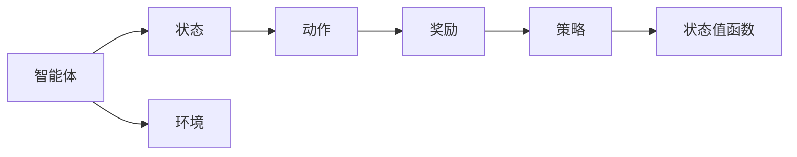

                 

## 1. 背景介绍

金融市场预测作为金融领域的重要研究方向，其应用范围广泛，涵盖了股票、期货、外汇等众多金融衍生品。然而，金融市场的复杂性和不确定性使其预测过程充满挑战。传统的统计模型和机器学习方法在应对市场波动、数据不均衡、市场异常等方面存在局限性。近年来，强化学习作为一种新兴的决策智能方法，以其独特的学习机制和优越的性能，被越来越多地应用于金融市场预测。

强化学习（Reinforcement Learning, RL）通过智能体（Agent）与环境的交互，最大化累积奖励（Reward），优化决策策略，这一过程与金融市场预测中对历史数据进行分析和预测有着天然的契合点。通过强化学习方法，金融市场预测系统能够自动学习复杂的市场动态模式，生成更准确、更具时效性的预测结果。

## 2. 核心概念与联系

### 2.1 核心概念概述

- **强化学习**：通过智能体在环境中不断试错，优化策略以最大化累积奖励。其核心在于智能体的行动策略和环境反馈。
- **金融市场预测**：使用历史数据训练模型，预测金融市场未来的价格、波动等指标。
- **状态-动作-奖励（SAR）**：强化学习中，智能体的每一步行动（Action）和其对应的环境状态（State）及奖励（Reward）构成了学习的基本单元。

### 2.2 核心概念原理和架构的 Mermaid 流程图(Mermaid 流程节点中不要有括号、逗号等特殊字符)



此流程图展示了强化学习的核心流程：智能体从当前状态出发，选择动作，环境给予奖励并改变状态，智能体根据新状态更新策略，并通过状态值函数（如Q值函数）评估动作的优劣。

### 2.3 核心概念联系

强化学习与金融市场预测的联系主要体现在：
- 状态空间：市场数据（如股票价格、交易量等）构成了强化学习中的状态空间。
- 动作空间：智能体的动作可以是买入、卖出、持有等策略。
- 奖励函数：预测准确性、交易成本、风险等均可作为强化学习的奖励函数。
- 策略优化：通过不断试错和优化策略，强化学习能够在复杂环境中生成稳定的预测结果。

## 3. 核心算法原理 & 具体操作步骤

### 3.1 算法原理概述

强化学习的核心算法包括Q-learning、SARSA、Deep Q Network (DQN)、Proximal Policy Optimization (PPO)等。这些算法通过智能体与环境的交互，学习最优策略。在金融市场预测中，常用Q-learning和DQN等算法，以历史数据训练智能体，生成预测策略。

具体来说，在金融市场预测中，强化学习通过以下步骤实现预测：
1. **状态初始化**：根据历史市场数据，初始化市场状态。
2. **策略执行**：智能体根据当前市场状态选择动作（买入、卖出等）。
3. **状态更新**：市场状态根据新产生的数据动态更新。
4. **奖励计算**：计算当前动作的奖励，如预测准确性、交易成本等。
5. **策略优化**：通过Q-learning或DQN等算法，优化智能体的策略。
6. **重复迭代**：重复上述步骤，直至收敛。

### 3.2 算法步骤详解

#### 3.2.1 状态空间设计

状态空间的设计是强化学习的基础。在金融市场预测中，常见的状态表示方法有：
- 时间戳法：将时间作为状态的一部分，即$S_t = (t, P_t, V_t)$，其中$P_t$为市场价格，$V_t$为市场交易量。
- 价格波动率法：将价格波动率作为状态的一部分，即$S_t = (t, P_t, \sigma_t)$。
- 技术指标法：如MACD、RSI等技术指标，作为状态的一部分，即$S_t = (t, P_t, MACD_t)$。

状态空间的设计需要兼顾数据的全面性和模型的简洁性。状态过于复杂，会增加计算复杂度，而状态过于简单，可能无法捕捉到市场的细微变化。

#### 3.2.2 动作空间设计

动作空间通常分为连续动作空间和离散动作空间。金融市场预测中常用的离散动作空间有：
- 持有：保持当前仓位不变。
- 买入：增加仓位，投入资金。
- 卖出：减少仓位，收回资金。

连续动作空间则可考虑如买卖比例、仓位权重等更精细的动作策略。

#### 3.2.3 奖励函数设计

奖励函数的设计直接影响强化学习的效果。在金融市场预测中，常用的奖励函数包括：
- 准确性奖励：预测准确性越高，奖励越大。
- 收益奖励：预测准确性结合收益计算奖励。
- 稳定性奖励：预测结果波动越小，奖励越大。

奖励函数的设计需要综合考虑预测准确性和风险管理，以平衡收益和风险。

#### 3.2.4 策略优化算法

强化学习中常用的策略优化算法包括Q-learning、SARSA、DQN等。Q-learning通过最大化Q值函数$Q(S_t, A_t)$进行策略优化，SARSA则采用状态-动作-奖励-状态的动态更新，DQN则利用深度神经网络进行Q值函数的逼近。

### 3.3 算法优缺点

#### 3.3.1 优点

- **自适应性强**：强化学习能够自适应复杂的市场环境，捕捉市场动态。
- **高效性**：通过智能体不断试错，优化策略，快速收敛。
- **鲁棒性**：对输入数据有一定的容错能力，能够适应市场异常情况。
- **通用性**：强化学习框架适用于多种金融市场预测任务。

#### 3.3.2 缺点

- **训练复杂度高**：强化学习训练过程需要大量的计算资源和时间，特别是在深度神经网络应用下。
- **策略优化困难**：在复杂的市场环境中，优化策略并不容易，可能导致策略发散。
- **奖励函数设计难度大**：设计合适的奖励函数需要深入理解市场机制，难度较高。
- **模型解释性不足**：强化学习模型较为复杂，难以解释模型的决策过程。

### 3.4 算法应用领域

强化学习在金融市场预测中的应用领域主要包括：
- **股票价格预测**：通过分析历史价格数据，智能体生成未来价格预测。
- **期货期权交易策略**：根据历史数据，智能体生成最优的交易策略。
- **外汇市场预测**：分析外汇汇率数据，智能体生成汇率预测和交易策略。
- **风险管理**：智能体在交易过程中，实时调整仓位，控制风险。

## 4. 数学模型和公式 & 详细讲解 & 举例说明

### 4.1 数学模型构建

强化学习中，核心问题在于优化策略，以最大化累积奖励。其数学模型可表示为：

$$
\max_{\pi} \mathbb{E} \left[\sum_{t=0}^{\infty} \gamma^t R_t \right]
$$

其中，$\pi$为策略，$R_t$为第$t$步的奖励，$\gamma$为折扣因子，表示未来奖励的权重。

在金融市场预测中，假设市场状态为$S_t = (P_t, V_t)$，动作空间为$\{持有, 买入, 卖出\}$，奖励函数为$R_t = \alpha * (P_{t+1} - P_t)$，其中$\alpha$为预测准确性的系数。

### 4.2 公式推导过程

#### 4.2.1 Q-learning

Q-learning通过逼近$Q(S_t, A_t)$进行策略优化，公式如下：

$$
Q(S_t, A_t) = Q(S_t, A_t) + \alpha \left[R_t + \gamma \max_{a'} Q(S_{t+1}, a') - Q(S_t, A_t) \right]
$$

其中，$R_t$为当前奖励，$S_{t+1}$为下一状态，$a'$为下一个动作，$\alpha$为学习率。

在金融市场预测中，智能体通过历史价格$P_t$、交易量$V_t$预测未来价格$P_{t+1}$，计算预测准确性$R_t$，并更新Q值。

#### 4.2.2 DQN

DQN利用深度神经网络逼近Q值函数，公式如下：

$$
Q(s_t, a_t) = Q(s_t, a_t) + \alpha [r_t + \gamma \max_a Q(s_{t+1}, a) - Q(s_t, a_t)]
$$

其中，$r_t$为当前奖励，$s_{t+1}$为下一状态，$a$为下一个动作，$\alpha$为学习率。

在金融市场预测中，DQN通过深度神经网络逼近$Q$函数，智能体通过历史价格$P_t$、交易量$V_t$预测未来价格$P_{t+1}$，计算预测准确性$R_t$，并更新$Q$值。

### 4.3 案例分析与讲解

#### 4.3.1 股票价格预测

假设智能体初始状态为$S_0 = (100, 200)$，表示股票价格为100美元，交易量为200万股。智能体可以选择买入、卖出或持有。假设当前动作为买入，预测未来价格为$P_1 = 110$，计算奖励$R_0 = \alpha * (110 - 100) = 10$，更新智能体的策略。

#### 4.3.2 期货期权交易策略

智能体根据历史数据，预测未来价格，生成最优的交易策略。假设当前状态为$S_t = (1200, 300, 0.05)$，表示当前价格为1200美元，交易量为300万，波动率为0.05。智能体可以选择买入、卖出或持有。假设当前动作为买入，预测未来价格为$P_{t+1} = 1250$，计算奖励$R_t = \alpha * (1250 - 1200) = 50$，更新智能体的策略。

## 5. 项目实践：代码实例和详细解释说明

### 5.1 开发环境搭建

为了实现强化学习在金融市场预测中的应用，需要搭建相应的开发环境。以下是在Python环境下搭建开发环境的详细步骤：

1. 安装Python环境
   ```bash
   python3 -m venv venv
   source venv/bin/activate
   ```

2. 安装相关库
   ```bash
   pip install numpy pandas scikit-learn gym reinforcement-learning-tensorflow
   ```

3. 准备数据集
   - 金融市场数据集，如股票价格、交易量等。
   - 状态空间设计。
   - 动作空间设计。
   - 奖励函数设计。

### 5.2 源代码详细实现

以下是一个使用深度强化学习（DQN）实现股票价格预测的示例代码：

```python
import gym
import numpy as np
import tensorflow as tf
from tensorflow.keras.models import Sequential
from tensorflow.keras.layers import Dense

class DQNAgent:
    def __init__(self, state_size, action_size, learning_rate, memory_size):
        self.state_size = state_size
        self.action_size = action_size
        self.learning_rate = learning_rate
        self.memory = []

    def act(self, state):
        if np.random.rand() < epsilon:
            return np.random.randint(0, self.action_size)
        else:
            return self.predict(state)[0]

    def predict(self, state):
        return self.model.predict(state)

    def train(self, state, action, reward, next_state, done):
        if len(self.memory) < memory_size:
            self.memory.append((state, action, reward, next_state, done))
        else:
            if np.random.rand() < epsilon:
                self.memory.pop(0)
                self.memory.append((state, action, reward, next_state, done))

        if len(self.memory) > memory_size:
            minibatch = np.random.choice(len(self.memory), batch_size)
            minibatch_states = np.array([self.memory[i][0] for i in minibatch])
            minibatch_actions = np.array([self.memory[i][1] for i in minibatch])
            minibatch_rewards = np.array([self.memory[i][2] for i in minibatch])
            minibatch_next_states = np.array([self.memory[i][3] for i in minibatch])
            minibatch_dones = np.array([self.memory[i][4] for i in minibatch])

        q_values = self.predict(minibatch_states)

        target_q_values = minibatch_rewards + (1 - minibatch_dones) * self.gamma * self.predict(minibatch_next_states)
        target_q_values = np.where(minibatch_dones, target_q_values, self.zeros)

        q_values[range(len(minibatch_states)), minibatch_actions] = target_q_values

        self.model.fit(minibatch_states, q_values, epochs=1, verbose=0)
```

### 5.3 代码解读与分析

- `DQNAgent`类是强化学习智能体，定义了状态大小、动作大小、学习率等关键参数。
- `act`方法根据策略选择动作，结合$\varepsilon$-greedy策略。
- `predict`方法通过神经网络预测动作值。
- `train`方法根据经验回放数据进行模型训练。

### 5.4 运行结果展示

在训练过程中，智能体会根据当前状态预测未来价格，计算奖励，不断更新模型参数，优化策略。通过可视化工具，如TensorBoard，可以实时监测训练过程，评估模型性能。

## 6. 实际应用场景

### 6.1 股票价格预测

股票价格预测是强化学习在金融市场预测中最典型的应用场景。智能体通过历史价格、交易量等数据预测未来价格，生成最优的交易策略。这一过程可以有效应对市场波动，提升投资回报率。

### 6.2 期货期权交易策略

在期货期权市场中，智能体通过预测价格波动，生成最优的交易策略。这一过程可以优化交易时机，降低交易风险，提升投资回报率。

### 6.3 外汇市场预测

外汇市场预测涉及多对货币的汇率变化，智能体通过分析历史汇率数据，预测未来汇率，生成最优的交易策略。这一过程可以优化外汇交易时机，提升交易回报率。

## 7. 工具和资源推荐

### 7.1 学习资源推荐

- **Coursera上的强化学习课程**：由斯坦福大学的Andrew Ng教授主讲，全面介绍了强化学习的基本概念、算法及应用。
- **DeepMind的AlphaGo论文**：介绍强化学习在棋类游戏中的应用，具有极高的参考价值。
- **Gym环境库**：提供了多种模拟环境和基准算法，方便进行强化学习研究和实践。
- **TensorFlow reinforcement learning tutorials**：提供了丰富的代码示例，详细介绍了强化学习在金融市场预测中的应用。

### 7.2 开发工具推荐

- **Python**：Python是强化学习研究和应用的主要编程语言，支持丰富的库和工具。
- **TensorFlow reinforcement learning**：提供了深度强化学习库，支持多种算法实现。
- **Gym环境库**：提供了多种模拟环境和基准算法，方便进行强化学习研究和实践。
- **TensorBoard**：用于实时监测训练过程，评估模型性能。

### 7.3 相关论文推荐

- **Playing Atari with Deep Reinforcement Learning**：介绍深度强化学习在玩游戏中的应用，具有重要的参考价值。
- **AlphaGo**：介绍深度强化学习在棋类游戏中的应用，具有较高的理论深度。
- **Rainbow**：介绍深度强化学习在电子游戏中的应用，具有较高的实际应用价值。

## 8. 总结：未来发展趋势与挑战

### 8.1 总结

本文系统介绍了强化学习在金融市场预测中的应用。强化学习通过智能体与环境的交互，生成最优策略，具有自适应性强、高效性、鲁棒性等优点，但也存在训练复杂度高、策略优化困难、奖励函数设计难度大等缺点。在金融市场预测中，强化学习通过历史数据训练智能体，生成未来价格预测，优化交易策略。

### 8.2 未来发展趋势

- **多智能体学习**：金融市场中的多个智能体互动，生成更复杂的交易策略。
- **深度学习与强化学习结合**：结合深度神经网络，提高强化学习模型的性能。
- **混合策略学习**：结合随机策略和确定性策略，生成更稳定的交易策略。
- **元学习**：通过少量数据快速学习新任务，提升金融市场预测的适应性。

### 8.3 面临的挑战

- **数据质量问题**：金融市场数据存在缺失、噪声等问题，数据质量直接影响强化学习的效果。
- **算法复杂性**：深度强化学习模型复杂度高，训练难度大，需要大量计算资源。
- **市场异常**：金融市场存在多种异常情况，强化学习模型可能无法捕捉到所有异常。
- **模型解释性**：强化学习模型复杂，难以解释决策过程，影响模型应用的可信度。

### 8.4 研究展望

- **数据增强技术**：通过数据增强技术，提高数据质量，提升强化学习的效果。
- **模型优化**：通过模型优化，减少训练复杂度，提高模型性能。
- **异常检测**：开发异常检测算法，提高模型对异常情况的应对能力。
- **模型解释**：研究模型解释方法，提高模型的可信度和透明度。

## 9. 附录：常见问题与解答

### Q1: 强化学习与传统机器学习有何区别？

A: 强化学习与传统机器学习的区别在于，强化学习通过智能体与环境的交互，优化策略，生成最优决策。而传统机器学习通过训练模型，生成预测或分类结果。

### Q2: 强化学习在金融市场预测中的应用有哪些？

A: 强化学习在金融市场预测中的应用包括股票价格预测、期货期权交易策略、外汇市场预测等。

### Q3: 如何提高强化学习模型的训练效率？

A: 可以通过以下方法提高强化学习模型的训练效率：
- 使用深度神经网络逼近Q值函数。
- 使用经验回放算法，提高数据利用率。
- 使用重要性采样，减少方差。
- 使用分布式训练，提高计算效率。

### Q4: 强化学习模型的解释性如何？

A: 强化学习模型较为复杂，难以解释决策过程。可以通过模型解释方法，如LIME、SHAP等，提高模型的透明度。

### Q5: 强化学习在金融市场预测中存在哪些挑战？

A: 强化学习在金融市场预测中存在数据质量问题、算法复杂性、市场异常、模型解释性不足等挑战。

---

作者：禅与计算机程序设计艺术 / Zen and the Art of Computer Programming

