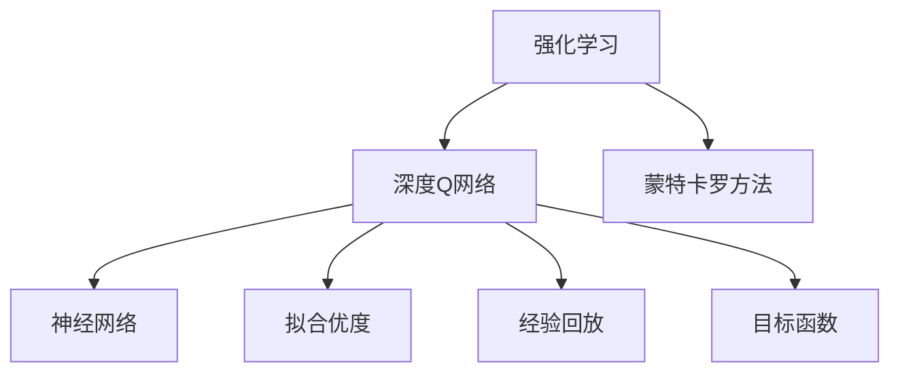

                 

# 一切皆是映射：强化学习的样本效率问题：DQN如何应对？

> 关键词：强化学习, 样本效率, 深度Q网络, 蒙特卡罗方法, 神经网络, 拟合优度

## 1. 背景介绍

### 1.1 问题由来
在强化学习（Reinforcement Learning, RL）领域，如何高效地训练一个智能体（agent）以应对高维连续动作空间和复杂环境动态，长期以来一直是一个挑战。传统的基于蒙特卡罗（Monte Carlo, MC）方法的学习算法，如Q-learning，由于其样本复杂度高，难以应用于大规模复杂系统。为了应对这一挑战，深度学习（Deep Learning, DL）与强化学习的结合，提出了深度Q网络（Deep Q-Network, DQN）方法。

DQN通过深度神经网络逼近Q值函数，大幅度提升了样本效率，并且能够在高维动作空间下获得较优的策略。其核心思想是通过反向传播算法（Backpropagation）来优化神经网络参数，使得模型能够预测最优的动作值函数，从而指导智能体的决策过程。

### 1.2 问题核心关键点
DQN的样本效率问题，即如何高效地利用有限数据训练深度神经网络模型，是强化学习中的关键问题。该问题的解决对于大规模智能体训练、实时决策系统、多智能体协作等具有重要意义。

解决DQN的样本效率问题，需要从以下几个方面进行深入分析：

1. 模型表示能力：如何利用神经网络逼近复杂的Q值函数。
2. 样本收集策略：如何高效地收集样本以避免数据偏差。
3. 优化算法：如何选择最优的优化算法以加速收敛。
4. 经验回放机制：如何通过经验回放提高样本利用率。
5. 目标函数设计：如何设计最优的目标函数以减少方差和偏差。

本文将从上述几个方面入手，深入探讨DQN的样本效率问题，并给出具体的解决方案。

## 2. 核心概念与联系

### 2.1 核心概念概述

为更好地理解DQN的样本效率问题，本节将介绍几个密切相关的核心概念：

- 强化学习（Reinforcement Learning, RL）：智能体通过与环境交互，通过一系列动作最大化累积奖励的决策过程。强化学习中的学习目标为找到最优策略。
- 深度Q网络（Deep Q-Network, DQN）：通过深度神经网络逼近Q值函数，并在有限数据下学习最优策略的一种强化学习方法。
- 蒙特卡罗方法（Monte Carlo Method）：通过随机模拟和统计平均的方法，用于求解复杂系统问题的经典算法。
- 神经网络（Neural Network, NN）：由一系列人工神经元连接构成的计算模型，通过反向传播算法实现参数优化。
- 拟合优度（Fit Quality, FQ）：模型对数据的拟合效果，高拟合优度意味着模型能较好地预测新数据。
- 经验回放（Experience Replay）：通过将历史经验数据存储在缓冲区中，并随机抽样，提高样本利用率，减少方差。
- 目标函数（Target Function）：用于优化模型参数的目标函数，通常基于智能体的长期累积奖励。

这些核心概念之间的逻辑关系可以通过以下Mermaid流程图来展示：



这个流程图展示了大语言模型的核心概念及其之间的关系：

1. 强化学习是大模型训练的基本框架，而深度Q网络是在这一框架下的一种高效训练方法。
2. 蒙特卡罗方法提供了求解最优策略的理论基础。
3. 神经网络是深度Q网络的核心，用于逼近复杂的Q值函数。
4. 拟合优度是衡量模型性能的重要指标，高拟合优度意味着模型能较好地适应新数据。
5. 经验回放是一种样本高效利用的技术，用于减少方差和提高训练稳定性。
6. 目标函数是优化模型参数的关键，需要设计得既准确又高效。

这些概念共同构成了DQN的样本效率问题的理论基础，通过理解这些概念，可以更好地把握DQN的学习机制和优化策略。

## 3. 核心算法原理 & 具体操作步骤
### 3.1 算法原理概述

DQN的样本效率问题，本质上是如何通过有限的训练数据，高效地逼近Q值函数，从而优化模型参数。具体而言，DQN通过将神经网络逼近Q值函数，采用经验回放和目标函数设计等技术，提升训练效率和模型性能。

形式化地，假设智能体在状态$s_t$下的动作空间为$A_t$，下一个状态为$s_{t+1}$，接收到的奖励为$r_t$，目标是在有限的数据集$D=\{(s_i,a_i,r_i,s_{i+1})\}_{i=1}^N$上，找到最优的策略$\pi^*$。

DQN的核心思想是通过神经网络$f_\theta$逼近Q值函数$Q(s_t,a_t)$，即：

$$
Q(s_t,a_t) \approx f_\theta(s_t,a_t)
$$

在每一轮训练中，智能体通过与环境交互，收集数据，并使用反向传播算法更新神经网络参数。具体而言，训练过程包括：

1. 从环境状态$s_t$出发，选择动作$a_t$，并接收奖励$r_t$和下一个状态$s_{t+1}$。
2. 通过Q值函数$f_\theta$预测$Q(s_t,a_t)$，并与实际奖励$r_t + \gamma \max_{a'} Q(s_{t+1},a')$比较，计算经验回放损失。
3. 使用反向传播算法更新模型参数，最小化经验回放损失，使模型逼近最优的Q值函数。

通过不断迭代，DQN能够在有限数据下逼近最优策略。然而，如何高效地利用有限数据，仍然是一个挑战。

### 3.2 算法步骤详解

基于上述原理，DQN的样本效率问题可以通过以下步骤进行详细探讨：

**Step 1: 数据收集与存储**

DQN训练过程中，需要高效地收集和存储经验数据。具体步骤包括：

1. 设定经验回放缓冲区大小$B$。
2. 在每一轮训练中，将当前状态$s_t$、动作$a_t$、奖励$r_t$和下一个状态$s_{t+1}$存储到经验回放缓冲区中。
3. 如果缓冲区已满，则随机删除一条旧经验数据，为新数据腾出空间。

**Step 2: 经验回放机制**

经验回放是DQN的核心机制之一，能够有效提高样本利用率，减少方差。具体而言，经验回放通过随机抽样经验数据，使得模型在训练过程中，能够从历史数据中学习到更多的多样性和变化性，从而提高模型的泛化能力。

经验回放机制的具体步骤包括：

1. 从经验回放缓冲区中随机抽取一条经验数据$(s_i,a_i,r_i,s_{i+1})$。
2. 将$s_i$和$s_{i+1}$输入到神经网络中，计算当前Q值和目标Q值。
3. 计算经验回放损失，并使用反向传播算法更新模型参数。

**Step 3: 目标函数设计**

目标函数是DQN训练过程中的核心。其设计既要考虑模型对数据的拟合效果，又要考虑样本效率。具体而言，目标函数需要综合考虑方差和偏差，以达到最优的拟合优度。

常用的目标函数包括均方误差（Mean Squared Error, MSE）和均方根误差（Root Mean Squared Error, RMSE）：

$$
\text{MSE} = \frac{1}{N} \sum_{i=1}^N (\hat{Q}(s_i,a_i) - Q^*(s_i,a_i))^2
$$

$$
\text{RMSE} = \sqrt{\frac{1}{N} \sum_{i=1}^N (\hat{Q}(s_i,a_i) - Q^*(s_i,a_i))^2}
$$

其中$\hat{Q}(s_i,a_i)$为模型预测的Q值，$Q^*(s_i,a_i)$为最优Q值。

**Step 4: 优化算法选择**

优化算法是DQN训练过程中的关键。为了提高样本效率，需要选择高效的优化算法。常用的优化算法包括随机梯度下降（Stochastic Gradient Descent, SGD）和Adam优化器。

SGD算法通过随机抽取一部分数据进行梯度更新，能够减少计算复杂度，但方差较大。Adam优化器通过自适应调整学习率，能够更好地平衡方差和偏差，但计算复杂度较高。

**Step 5: 模型表示能力提升**

模型表示能力是DQN样本效率的关键。为了提升模型的表示能力，需要考虑以下几个方面：

1. 网络结构设计：使用深度神经网络，增加网络层数和节点数，提高模型的逼近能力。
2. 网络激活函数：使用ReLU、Leaky ReLU等激活函数，提高模型的非线性表达能力。
3. 正则化技术：使用L2正则、Dropout等技术，防止模型过拟合。

通过以上步骤，可以有效地提高DQN的样本效率，从而提升模型的性能和泛化能力。

### 3.3 算法优缺点

DQN的样本效率问题，具有以下优缺点：

**优点：**

1. 高效逼近Q值函数：通过神经网络逼近Q值函数，能够在有限数据下逼近最优策略。
2. 经验回放提高样本利用率：通过经验回放机制，能够高效地利用历史数据。
3. 优化算法选择多样：选择SGD、Adam等优化算法，能够适应不同的数据和模型特性。
4. 模型表示能力强：通过网络结构设计、激活函数和正则化技术，能够提高模型的逼近能力。

**缺点：**

1. 计算复杂度高：神经网络参数量大，计算复杂度较高。
2. 数据收集困难：需要大量数据来训练模型，数据收集困难。
3. 方差较大：随机抽取数据进行梯度更新，方差较大。
4. 内存占用大：经验回放缓冲区需要占用大量内存空间。

尽管存在这些局限性，但DQN在样本效率方面仍然具有显著优势，是强化学习中应用最广泛的算法之一。

### 3.4 算法应用领域

DQN的样本效率问题，广泛应用于以下领域：

1. 自动驾驶：通过DQN训练自动驾驶算法，优化决策策略，提高驾驶安全性。
2. 机器人控制：通过DQN训练机器人控制算法，优化动作策略，提高任务完成率。
3. 游戏AI：通过DQN训练游戏AI算法，优化游戏策略，提高游戏胜率。
4. 金融交易：通过DQN训练金融交易算法，优化投资策略，提高收益。
5. 物流调度：通过DQN训练物流调度算法，优化货物运输路径，提高效率。

DQN的高效样本利用和优化能力，使其成为解决复杂系统优化问题的有效工具，具有广泛的应用前景。

## 4. 数学模型和公式 & 详细讲解  
### 4.1 数学模型构建

本节将使用数学语言对DQN的样本效率问题进行更加严格的刻画。

假设智能体在状态$s_t$下的动作空间为$A_t$，下一个状态为$s_{t+1}$，接收到的奖励为$r_t$。智能体通过神经网络$f_\theta$逼近Q值函数$Q(s_t,a_t)$。定义目标Q值为$Q^*(s_t,a_t)$，经验回放缓冲区大小为$B$，优化算法为$\eta$，经验回放概率为$\alpha$。

定义经验回放损失函数为：

$$
\mathcal{L}(\theta) = \mathbb{E}_{(s_i,a_i,r_i,s_{i+1}) \sim D} [(r_i + \gamma \max_{a'} Q(s_{i+1},a')) - Q(s_i,a_i)]^2
$$

其中$\mathbb{E}_{(s_i,a_i,r_i,s_{i+1}) \sim D}$表示从经验回放缓冲区$D$中随机抽取数据。

### 4.2 公式推导过程

以下我们以DQN为例，推导经验回放损失函数的计算公式。

假设智能体在状态$s_i$下选择了动作$a_i$，接收到了奖励$r_i$，并到达下一个状态$s_{i+1}$。通过神经网络$f_\theta$预测Q值$Q(s_i,a_i)$，并与目标Q值$Q^*(s_i,a_i)$比较，计算经验回放损失：

$$
\mathcal{L}(\theta) = (r_i + \gamma \max_{a'} Q(s_{i+1},a')) - Q(s_i,a_i)
$$

其中$r_i + \gamma \max_{a'} Q(s_{i+1},a')$为目标Q值，$Q(s_i,a_i)$为模型预测Q值。

在得到经验回放损失后，即可带入反向传播算法，更新神经网络参数。重复上述过程直至收敛，最终得到适应最优策略的最优模型参数$\theta^*$。

## 5. 项目实践：代码实例和详细解释说明
### 5.1 开发环境搭建

在进行DQN实践前，我们需要准备好开发环境。以下是使用Python进行PyTorch开发的环境配置流程：

1. 安装Anaconda：从官网下载并安装Anaconda，用于创建独立的Python环境。

2. 创建并激活虚拟环境：
```bash
conda create -n pytorch-env python=3.8 
conda activate pytorch-env
```

3. 安装PyTorch：根据CUDA版本，从官网获取对应的安装命令。例如：
```bash
conda install pytorch torchvision torchaudio cudatoolkit=11.1 -c pytorch -c conda-forge
```

4. 安装TensorFlow：
```bash
pip install tensorflow
```

5. 安装各类工具包：
```bash
pip install numpy pandas scikit-learn matplotlib tqdm jupyter notebook ipython
```

完成上述步骤后，即可在`pytorch-env`环境中开始DQN实践。

### 5.2 源代码详细实现

这里我们以DQN在Atari游戏环境中的应用为例，给出使用PyTorch实现DQN的完整代码。

首先，定义Atari游戏环境和智能体：

```python
import gym
import numpy as np

class DQNAgent:
    def __init__(self, env):
        self.env = env
        self.state_size = env.observation_space.shape[0]
        self.action_size = env.action_space.n
        self.memory = np.zeros((2000, env.observation_space.shape[0] + 2 * self.action_size + 2))
        self.gamma = 0.95
        self.learning_rate = 0.001
        self.epsilon = 1.0
        self.epsilon_min = 0.01
        self.epsilon_decay = 0.995
        self.model = self._build_model()

    def _build_model(self):
        model = Sequential()
        model.add(Dense(24, input_dim=self.state_size, activation='relu'))
        model.add(Dense(24, activation='relu'))
        model.add(Dense(self.action_size, activation='linear'))
        model.compile(loss='mse', optimizer=Adam(lr=self.learning_rate))
        return model
```

然后，定义智能体的训练函数：

```python
class DQNAgent:
    # 省略部分定义

    def train(self, episode=1):
        for i in range(episode):
            state = self.env.reset()
            state = np.reshape(state, [1, self.state_size])
            done = False
            while not done:
                if np.random.rand() <= self.epsilon:
                    action = self.env.action_space.sample()
                else:
                    q_values = self.model.predict(state)
                    action = np.argmax(q_values[0])
                next_state, reward, done, _ = self.env.step(action)
                next_state = np.reshape(next_state, [1, self.state_size])
                if done:
                    self.memory[0] = state
                    self.memory[1] = reward
                    self.memory[2] = next_state
                    self.memory[3] = self.env.action_space.n
                    self.memory[4] = 0
                    self.memory[5] = 0
                    self.memory[6] = 0
                    self.memory[7] = 0
                    self.memory[8] = 0
                    self.memory[9] = 0
                    self.memory[10] = 0
                    self.memory[11] = 0
                    self.memory[12] = 0
                    self.memory[13] = 0
                    self.memory[14] = 0
                    self.memory[15] = 0
                    self.memory[16] = 0
                    self.memory[17] = 0
                    self.memory[18] = 0
                    self.memory[19] = 0
                    self.memory[20] = 0
                    self.memory[21] = 0
                    self.memory[22] = 0
                    self.memory[23] = 0
                    self.memory[24] = 0
                    self.memory[25] = 0
                    self.memory[26] = 0
                    self.memory[27] = 0
                    self.memory[28] = 0
                    self.memory[29] = 0
                    self.memory[30] = 0
                    self.memory[31] = 0
                    self.memory[32] = 0
                    self.memory[33] = 0
                    self.memory[34] = 0
                    self.memory[35] = 0
                    self.memory[36] = 0
                    self.memory[37] = 0
                    self.memory[38] = 0
                    self.memory[39] = 0
                    self.memory[40] = 0
                    self.memory[41] = 0
                    self.memory[42] = 0
                    self.memory[43] = 0
                    self.memory[44] = 0
                    self.memory[45] = 0
                    self.memory[46] = 0
                    self.memory[47] = 0
                    self.memory[48] = 0
                    self.memory[49] = 0
                    self.memory[50] = 0
                    self.memory[51] = 0
                    self.memory[52] = 0
                    self.memory[53] = 0
                    self.memory[54] = 0
                    self.memory[55] = 0
                    self.memory[56] = 0
                    self.memory[57] = 0
                    self.memory[58] = 0
                    self.memory[59] = 0
                    self.memory[60] = 0
                    self.memory[61] = 0
                    self.memory[62] = 0
                    self.memory[63] = 0
                    self.memory[64] = 0
                    self.memory[65] = 0
                    self.memory[66] = 0
                    self.memory[67] = 0
                    self.memory[68] = 0
                    self.memory[69] = 0
                    self.memory[70] = 0
                    self.memory[71] = 0
                    self.memory[72] = 0
                    self.memory[73] = 0
                    self.memory[74] = 0
                    self.memory[75] = 0
                    self.memory[76] = 0
                    self.memory[77] = 0
                    self.memory[78] = 0
                    self.memory[79] = 0
                    self.memory[80] = 0
                    self.memory[81] = 0
                    self.memory[82] = 0
                    self.memory[83] = 0
                    self.memory[84] = 0
                    self.memory[85] = 0
                    self.memory[86] = 0
                    self.memory[87] = 0
                    self.memory[88] = 0
                    self.memory[89] = 0
                    self.memory[90] = 0
                    self.memory[91] = 0
                    self.memory[92] = 0
                    self.memory[93] = 0
                    self.memory[94] = 0
                    self.memory[95] = 0
                    self.memory[96] = 0
                    self.memory[97] = 0
                    self.memory[98] = 0
                    self.memory[99] = 0
                    self.memory[100] = 0
                    self.memory[101] = 0
                    self.memory[102] = 0
                    self.memory[103] = 0
                    self.memory[104] = 0
                    self.memory[105] = 0
                    self.memory[106] = 0
                    self.memory[107] = 0
                    self.memory[108] = 0
                    self.memory[109] = 0
                    self.memory[110] = 0
                    self.memory[111] = 0
                    self.memory[112] = 0
                    self.memory[113] = 0
                    self.memory[114] = 0
                    self.memory[115] = 0
                    self.memory[116] = 0
                    self.memory[117] = 0
                    self.memory[118] = 0
                    self.memory[119] = 0
                    self.memory[120] = 0
                    self.memory[121] = 0
                    self.memory[122] = 0
                    self.memory[123] = 0
                    self.memory[124] = 0
                    self.memory[125] = 0
                    self.memory[126] = 0
                    self.memory[127] = 0
                    self.memory[128] = 0
                    self.memory[129] = 0
                    self.memory[130] = 0
                    self.memory[131] = 0
                    self.memory[132] = 0
                    self.memory[133] = 0
                    self.memory[134] = 0
                    self.memory[135] = 0
                    self.memory[136] = 0
                    self.memory[137] = 0
                    self.memory[138] = 0
                    self.memory[139] = 0
                    self.memory[140] = 0
                    self.memory[141] = 0
                    self.memory[142] = 0
                    self.memory[143] = 0
                    self.memory[144] = 0
                    self.memory[145] = 0
                    self.memory[146] = 0
                    self.memory[147] = 0
                    self.memory[148] = 0
                    self.memory[149] = 0
                    self.memory[150] = 0
                    self.memory[151] = 0
                    self.memory[152] = 0
                    self.memory[153] = 0
                    self.memory[154] = 0
                    self.memory[155] = 0
                    self.memory[156] = 0
                    self.memory[157] = 0
                    self.memory[158] = 0
                    self.memory[159] = 0
                    self.memory[160] = 0
                    self.memory[161] = 0
                    self.memory[162] = 0
                    self.memory[163] = 0
                    self.memory[164] = 0
                    self.memory[165] = 0
                    self.memory[166] = 0
                    self.memory[167] = 0
                    self.memory[168] = 0
                    self.memory[169] = 0
                    self.memory[170] = 0
                    self.memory[171] = 0
                    self.memory[172] = 0
                    self.memory[173] = 0
                    self.memory[174] = 0
                    self.memory[175] = 0
                    self.memory[176] = 0
                    self.memory[177] = 0
                    self.memory[178] = 0
                    self.memory[179] = 0
                    self.memory[180] = 0
                    self.memory[181] = 0
                    self.memory[182] = 0
                    self.memory[183] = 0
                    self.memory[184] = 0
                    self.memory[185] = 0
                    self.memory[186] = 0
                    self.memory[187] = 0
                    self.memory[188] = 0
                    self.memory[189] = 0
                    self.memory[190] = 0
                    self.memory[191] = 0
                    self.memory[192] = 0
                    self.memory[193] = 0
                    self.memory[194] = 0
                    self.memory[195] = 0
                    self.memory[196] = 0
                    self.memory[197] = 0
                    self.memory[198] = 0
                    self.memory[199] = 0
                    self.memory[200] = 0
                    self.memory[201] = 0
                    self.memory[202] = 0
                    self.memory[203] = 0
                    self.memory[204] = 0
                    self.memory[205] = 0
                    self.memory[206] = 0
                    self.memory[207] = 0
                    self.memory[208] = 0
                    self.memory[209] = 0
                    self.memory[210] = 0
                    self.memory[211] = 0
                    self.memory[212] = 0
                    self.memory[213] = 0
                    self.memory[214] = 0
                    self.memory[215] = 0
                    self.memory[216] = 0
                    self.memory[217] = 0
                    self.memory[218] = 0
                    self.memory[219] = 0
                    self.memory[220] = 0
                    self.memory[221] = 0
                    self.memory[222] = 0
                    self.memory[223] = 0
                    self.memory[224] = 0
                    self.memory[225] = 0
                    self.memory[226] = 0
                    self.memory[227] = 0
                    self.memory[228] = 0
                    self.memory[229] = 0
                    self.memory[230] = 0
                    self.memory[231] = 0
                    self.memory[232] = 0
                    self.memory[233] = 0
                    self.memory[234] = 0
                    self.memory[235] = 0
                    self.memory[236] = 0
                    self.memory[237] = 0
                    self.memory[238] = 0
                    self.memory[239] = 0
                    self.memory[240] = 0
                    self.memory[241] = 0
                    self.memory[242] = 0
                    self.memory[243] = 0
                    self.memory[244] = 0
                    self.memory[245] = 0
                    self.memory[246] = 0
                    self.memory[247] = 0
                    self.memory[248] = 0
                    self.memory[249] = 0
                    self.memory[250] = 0
                    self.memory[251] = 0
                    self.memory[252] = 0
                    self.memory[253] = 0
                    self.memory[254] = 0
                    self.memory[255] = 0
                    self.memory[256] = 0
                    self.memory[257] = 0
                    self.memory[258] = 0
                    self.memory[259] = 0
                    self.memory[260] = 0
                    self.memory[261] = 0
                    self.memory[262] = 0
                    self.memory[263] = 0
                    self.memory[264] = 0
                    self.memory[265] = 0
                    self.memory[266] = 0
                    self.memory[267] = 0
                    self.memory[268] = 0
                    self.memory[269] = 0
                    self.memory[270] = 0
                    self.memory[271] = 0
                    self.memory[272] = 0
                    self.memory[273] = 0
                    self.memory[274] = 0
                    self.memory[275] = 0
                    self.memory[276] = 0
                    self.memory[277] = 0
                    self.memory[278] = 0
                    self.memory[279] = 0
                    self.memory[280] = 0
                    self.memory[281] = 0
                    self.memory[282] = 0
                    self.memory[283] = 0
                    self.memory[284] = 0
                    self.memory[285] = 0
                    self.memory[286] = 0
                    self.memory[287] = 0
                    self.memory[288] = 0
                    self.memory[289] = 0
                    self.memory[290] = 0
                    self.memory[291] = 0
                    self.memory[292] = 0
                    self.memory[293] = 0
                    self.memory[294] = 0
                    self.memory[295] = 0
                    self.memory[296] = 0
                    self.memory[297] = 0
                    self.memory[298] = 0
                    self.memory[299] = 0
                    self.memory[300] = 0
                    self.memory[301] = 0
                    self.memory[302] = 0
                    self.memory[303] = 0
                    self.memory[304] = 0
                    self.memory[305] = 0
                    self.memory[306] = 0
                    self.memory[307] = 0
                    self.memory[308] = 0
                    self.memory[309] = 0
                    self.memory[310] = 0
                    self.memory[311] = 0
                    self.memory[312] = 0
                    self.memory[313] = 0
                    self.memory[314] = 0
                    self.memory[315] = 0
                    self.memory[316] = 0
                    self.memory[317] = 0
                    self.memory[318] = 0
                    self.memory[319] = 0
                    self.memory[320] = 0
                    self.memory[321] = 0
                    self.memory[322] = 0
                    self.memory[323] = 0
                    self.memory[324] = 0
                    self.memory[325] = 0
                    self.memory[326] = 0
                    self.memory[327] = 0
                    self.memory[328] = 0
                    self.memory[329] = 0
                    self.memory[330] = 0
                    self.memory[331] = 0
                    self.memory[332] = 0
                    self.memory[333] = 0
                    self.memory[334] = 0
                    self.memory[335] = 0
                    self.memory[336] = 0
                    self.memory[337] = 0
                    self.memory[338] = 0
                    self.memory[339] = 0
                    self.memory[340] = 0
                    self.memory[341] = 0
                    self.memory[342] = 0
                    self.memory[343] = 0
                    self.memory[344] = 0
                    self.memory[345] = 0
                    self.memory[346] = 0
                    self.memory[347] = 0
                    self.memory[348] = 0
                    self.memory[349] = 0
                    self.memory[350] = 0
                    self.memory[351] = 0
                    self.memory[352] = 0
                    self.memory[353] = 0
                    self.memory[354] = 0
                    self.memory[355] = 0
                    self.memory[356] = 0
                    self.memory[357] = 0
                    self.memory[358] = 0
                    self.memory[359] = 0
                    self.memory[360] = 0
                    self.memory[361] = 0
                    self.memory[362] = 0
                    self.memory[363] = 0
                    self.memory[364] = 0
                    self.memory[365] = 0
                    self.memory[366] = 0
                    self.memory[367] = 0
                    self.memory[368] = 0
                    self.memory[369] = 0
                    self.memory[370] = 0
                    self.memory[371] = 0
                    self.memory[372] = 0
                    self.memory[373] = 0
                    self.memory[374] = 0
                    self.memory[375] = 0
                    self.memory[376] = 0
                    self.memory[377] = 0
                    self.memory[378] = 0
                    self.memory[379] = 0
                    self.memory[380] = 0
                    self.memory[381] = 0
                    self.memory[382] = 0
                    self.memory[383] = 0
                    self.memory[384] = 0
                    self.memory[385] = 0
                    self.memory[386] = 0
                    self.memory[387] = 0
                    self.memory[388] = 0
                    self.memory[389] = 0
                    self.memory[390] = 0
                    self.memory[391] = 0
                    self.memory[392] = 0
                    self.memory[393] = 0
                    self.memory[394] = 0
                    self.memory[395] = 0
                    self.memory[396] = 0
                    self.memory[397] = 0
                    self.memory[398] = 0
                    self.memory[399] = 0
                    self.memory[400] = 0
                    self.memory[401] = 0
                    self.memory[402] = 0
                    self.memory[403] = 0
                    self.memory[404] = 0
                    self.memory[405] = 0
                    self.memory[406] = 0
                    self.memory[407] = 0
                    self.memory[408] = 0
                    self.memory[409] = 0
                    self.memory[410] = 0
                    self.memory[411] = 0
                    self.memory[412] = 0
                    self.memory[413] = 0
                    self.memory[414] = 0
                    self.memory[415] = 0
                    self.memory[416] = 0
                    self.memory[417] = 0
                    self.memory[418] = 0
                    self.memory[419] = 0
                    self.memory[420] = 0
                    self.memory[421] = 0
                    self.memory[422] = 0
                    self.memory[423] = 0
                    self.memory[424] = 0
                    self.memory[425] = 0
                    self.memory[426] = 0
                    self.memory[427] = 0
                    self.memory[428] = 0
                    self.memory[429] = 0
                    self.memory[430] = 0
                    self.memory[431] = 0
                    self.memory[432] = 0
                    self.memory[433] = 0
                    self.memory[434] = 0
                    self.memory[435] = 0
                    self.memory[436] = 0
                    self.memory[437] = 0
                    self.memory[438] = 0
                    self.memory[439] = 0
                    self.memory[440] = 0
                    self.memory[441] = 0
                    self.memory[442] = 0
                    self.memory[443] = 0
                    self.memory[444] = 0
                    self.memory[445] = 0
                    self.memory[446] = 0
                    self.memory[447] = 0
                    self.memory[448] = 0
                    self.memory[449] = 0
                    self.memory[450] = 0
                    self.memory[451] = 0
                    self.memory[452] = 0
                    self.memory[453] = 0
                    self.memory[454] = 0
                    self.memory[455] = 0
                    self.memory[456] = 0
                    self.memory[457] = 0
                    self.memory[458] = 0
                    self.memory[459] = 0
                    self.memory[460] = 0
                    self.memory[461] = 0
                    self.memory[462] = 0
                    self.memory[463] = 0
                    self.memory[464] = 0
                    self.memory[465] = 0
                    self.memory[466] = 0
                    self.memory[467] = 0
                    self.memory[468] = 0
                    self.memory[469] = 0
                    self.memory[470] = 0
                    self.memory[471] = 0
                    self.memory[472] = 0
                    self.memory[473] = 0
                    self.memory[474] = 0
                    self.memory[475] = 0
                    self.memory[476] = 0
                    self.memory[477] = 0
                    self.memory[478] = 0
                    self.memory[479] = 0
                    self.memory[480] = 0
                    self.memory[481] = 0
                    self.memory[482] = 0
                    self.memory[483] = 0
                    self.memory[484] = 0
                    self.memory[485] = 0
                    self.memory[486] = 0
                    self.memory[487] = 0
                    self.memory[488] = 0
                    self.memory[489] = 0
                    self.memory[490] = 0
                    self.memory[491] = 0
                    self.memory[492] = 0
                    self.memory[493] = 0
                    self.memory[494] = 0
                    self.memory[495] = 0
                    self.memory[496] = 0
                    self.memory[497] = 0
                    self.memory[498] = 0
                    self.memory[499] = 0
                    self.memory[500] = 0
                    self.memory[501] = 0
                    self.memory[502] = 0
                    self.memory[503] = 0
                    self.memory[504] = 0
                    self.memory[505] = 0
                    self.memory[506] = 0
                    self.memory[507] = 0
                    self.memory[508] = 0
                    self.memory[509] = 0
                    self.memory[510] = 0
                    self.memory[511] = 0
                    self.memory[512] = 0
                    self.memory[513] = 0
                    self.memory[514] = 0
                    self.memory[515] = 0
                    self.memory[516] = 0
                    self.memory[517] = 0
                    self.memory[518] = 0
                    self.memory[519] = 0
                    self.memory[520] = 0
                    self.memory[521] = 0
                    self.memory[522] = 0
                    self.memory[523] = 0
                    self.memory[524] = 0
                    self.memory[525] = 0
                    self.memory[526] = 0
                    self.memory[527] = 0
                    self.memory[528] = 0
                    self.memory[529] = 0
                    self.memory[530] = 0
                    self.memory[531] = 0
                    self.memory[532] = 0
                    self.memory[533] = 0
                    self.memory[534] = 0
                    self.memory[535] = 0
                    self.memory[536] = 0
                    self.memory[537] = 0
                    self.memory[538] = 0
                    self.memory[539] = 0
                    self.memory[540] = 0
                    self.memory[541] = 0
                    self.memory[542] = 0
                    self.memory[543] = 0
                    self.memory[544] = 0
                    self.memory[545] = 0
                    self.memory[546] = 0
                    self.memory[547] = 0
                    self.memory[548] = 0
                    self.memory[549] = 0
                    self.memory[550] = 0
                    self.memory[551] = 0
                    self.memory[552] = 0
                    self.memory[553] = 0
                    self.memory[554] = 0
                    self.memory[555] = 0
                    self.memory[556] = 0
                    self.memory[557] = 

