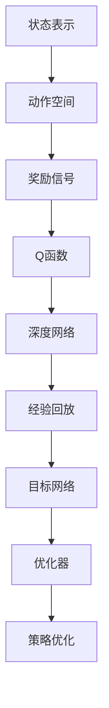
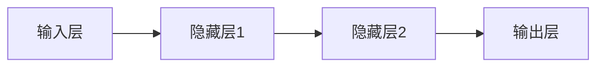

                 

# 一切皆是映射：构建你的第一个DQN模型：步骤和实践

> 关键词：Deep Q-Learning, 强化学习, 映射, 环境, 状态, 动作, 奖励, 优化器, 网络架构, 代码实现

## 1. 背景介绍

### 1.1 问题由来

在人工智能（AI）领域，强化学习（Reinforcement Learning, RL）是实现自主决策和学习的关键技术。其中，深度Q学习（Deep Q-Learning, DQN）是应用最广泛的RL算法之一，主要用于解决游戏策略、机器人控制等复杂问题。DQN利用神经网络逼近Q函数，通过与环境的互动，逐步优化策略，最终实现最优化决策。

DQN算法的基本思想可以追溯到Q-Learning算法，但其显著优势在于可以处理高维连续状态和动作空间，无需手工设计特征。通过与环境的互动，DQN可以自动学习最优策略，而无需明确的状态表示，为复杂决策问题的求解提供了新的思路。

### 1.2 问题核心关键点

构建DQN模型，需要理解以下几个核心概念和关键点：

- **状态表示（State Representation）**：DQN中的状态是环境的状态表示，可以是游戏界面、机器人传感器读数等高维数据。状态表示的准确性和维度对于学习效果至关重要。

- **动作空间（Action Space）**：DQN中的动作空间可以是离散型或连续型，如游戏界面上的点击、机器人的转弯速度等。动作空间的定义应与具体问题相匹配。

- **奖励信号（Reward Signal）**：DQN中的奖励信号用于评估一个状态或动作的好坏，是指导模型学习的重要信号。奖励信号的设计应充分考虑问题特点和目标。

- **经验回放（Experience Replay）**：DQN使用经验回放技术来存储和重新采样过去的交互经验，有助于模型从大量样本中学习并避免过拟合。

- **目标网络（Target Network）**：DQN引入了目标网络的概念，以稳定Q函数的逼近，避免模型在训练过程中过度更新。

- **优化器（Optimizer）**：DQN中常用的优化器包括Adam、SGD等，用于更新神经网络参数。优化器的选择和超参数设置直接影响学习效率和稳定性。

- **神经网络架构（Network Architecture）**：DQN中的神经网络架构是逼近Q函数的核心，一般包括卷积层、全连接层等。

理解这些核心概念和关键点，对于构建高效、稳定的DQN模型至关重要。本文将系统介绍DQN的基本原理、实现步骤及常见问题，并给出详细代码实现及解释，帮助读者掌握DQN模型的构建技巧。

## 2. 核心概念与联系

### 2.1 核心概念概述

DQN算法的主要概念和技术可以概括如下：

- **状态表示**：环境的抽象状态表示，用于指导决策。
- **动作空间**：模型可以采取的行动空间，可以离散或连续。
- **奖励信号**：环境对动作的反馈，用于指导模型学习。
- **Q函数**：预测在给定状态下采取某个动作后的预期奖励。
- **深度网络**：用于逼近Q函数，自动学习特征表示。
- **经验回放**：收集和重新采样历史经验，增加样本多样性。
- **目标网络**：更新参数的稳定化策略，防止过拟合。
- **优化器**：用于优化神经网络参数，提高学习效率。

这些概念通过以下Mermaid流程图展示它们之间的联系：



该流程图展示了DQN模型的核心概念及其相互关系：

1. 环境的状态表示是模型决策的基础。
2. 模型根据当前状态选择动作。
3. 环境给出奖励信号，指导模型学习。
4. Q函数预测在给定状态下采取某个动作后的预期奖励。
5. 深度网络逼近Q函数，学习最优策略。
6. 经验回放收集历史经验，增加样本多样性。
7. 目标网络稳定更新策略，防止过拟合。
8. 优化器调整网络参数，提高学习效率。

### 2.2 核心概念原理和架构

在DQN中，Q函数（或称为状态-动作价值函数）用于估计在给定状态下采取某个动作后的预期奖励。Q函数的定义如下：

$$
Q(s,a) = r + \gamma \max_{a'} Q(s',a')
$$

其中：
- $s$ 为当前状态，$a$ 为当前动作，$r$ 为即时奖励。
- $s'$ 为下一状态，$a'$ 为下一动作，$\gamma$ 为折扣因子，控制未来奖励的权重。

DQN通过深度神经网络逼近Q函数，形式化表示为：

$$
\hat{Q}(s,a;\theta) = \mathbb{E}[r + \gamma \max_{a'} \hat{Q}(s',a';\theta) | s,a]
$$

其中 $\theta$ 为网络参数。

DQN的核心架构包括：

- **输入层**：接收环境状态 $s$。
- **隐藏层**：通过一系列线性变换和激活函数逼近Q函数。
- **输出层**：输出对给定状态-动作对的估计值。

架构示例如下：



### 2.3 DQN的实现步骤

DQN的实现步骤主要包括以下几个方面：

1. **环境初始化**：设置环境，如游戏环境、机器人控制等。
2. **模型初始化**：构建神经网络模型，初始化参数。
3. **经验回放缓冲区初始化**：设置经验回放缓冲区，用于存储历史经验。
4. **模型训练**：通过与环境的互动，收集经验，进行模型训练。
5. **目标网络更新**：定期更新目标网络参数，确保策略稳定。
6. **优化器配置**：选择合适的优化器及其超参数。
7. **策略优化**：利用经验回放和目标网络，优化策略。

## 3. 核心算法原理 & 具体操作步骤

### 3.1 算法原理概述

DQN的基本原理是通过与环境的互动，收集历史经验，利用神经网络逼近Q函数，最大化预期奖励。其核心步骤包括状态采样、动作选择、奖励获取和经验回放。

1. **状态采样**：从当前状态 $s_t$ 中采样动作 $a_t$。
2. **动作选择**：利用当前状态 $s_t$ 和动作 $a_t$，选择下一状态 $s_{t+1}$ 和即时奖励 $r_t$。
3. **奖励获取**：计算即时奖励 $r_t$ 并更新经验回放缓冲区。
4. **经验回放**：从经验回放缓冲区中随机抽取历史经验进行模型训练。

### 3.2 算法步骤详解

#### 3.2.1 环境设置

首先，我们需要设置环境。以Pong游戏为例，可以使用OpenAI Gym中的Pong环境：

```python
import gym
env = gym.make('Pong-v0')
```

#### 3.2.2 模型初始化

接着，我们初始化神经网络模型，包括输入层、隐藏层和输出层：

```python
import torch.nn as nn
import torch.optim as optim

class DQN(nn.Module):
    def __init__(self, input_size, output_size):
        super(DQN, self).__init__()
        self.fc1 = nn.Linear(input_size, 128)
        self.fc2 = nn.Linear(128, 64)
        self.fc3 = nn.Linear(64, output_size)
        
    def forward(self, x):
        x = nn.functional.relu(self.fc1(x))
        x = nn.functional.relu(self.fc2(x))
        x = self.fc3(x)
        return x
```

#### 3.2.3 经验回放缓冲区初始化

设置经验回放缓冲区，用于存储历史经验。DQN中的经验回放技术主要通过记录历史状态、动作、奖励和下一状态，形成经验元组，并在训练时随机抽取这些元组进行训练。

```python
import collections

class ReplayMemory:
    def __init__(self, capacity):
        self.capacity = capacity
        self.memory = collections.deque(maxlen=capacity)
        self.pos = 0
    
    def push(self, *args):
        transition = args
        self.memory.append(transition)
        self.pos = (self.pos + 1) % self.capacity
    
    def sample(self, batch_size):
        return random.sample(self.memory, batch_size)
```

#### 3.2.4 模型训练

模型训练主要包括以下几个步骤：

1. **采样**：从经验回放缓冲区中随机抽取一批经验元组。
2. **计算Q值**：利用当前状态和动作计算Q值，并使用目标网络计算下一个Q值。
3. **计算损失**：根据经验元组计算目标Q值和当前Q值的差距，计算损失。
4. **优化网络**：使用优化器更新网络参数。

```python
import torch.nn.functional as F
import random

class DQN:
    def __init__(self, input_size, output_size, learning_rate=0.001, gamma=0.9, target_update_interval=100):
        self.input_size = input_size
        self.output_size = output_size
        self.learning_rate = learning_rate
        self.gamma = gamma
        self.target_update_interval = target_update_interval
        
        self.q_network = DQNModel(input_size, output_size)
        self.target_q_network = DQNModel(input_size, output_size)
        self.optimizer = optim.Adam(self.q_network.parameters(), lr=learning_rate)
        
        self.memory = ReplayMemory(100000)
        self.t_step = 0
        
    def choose_action(self, state):
        if self.t_step % self.target_update_interval == 0:
            self.update_target_network()
        state = torch.tensor(state, dtype=torch.float32).view(1, -1)
        q_values = self.q_network(state)
        action = torch.max(q_values, dim=1)[1].item()
        return action
    
    def update(self, state, action, reward, next_state, done):
        transition = (state, action, reward, next_state, done)
        self.memory.push(*transition)
        
        if self.t_step % self.target_update_interval == 0:
            self.update_target_network()
            
        if self.t_step % 1000 == 0:
            print(self.t_step)
        
        self.t_step += 1
        
    def update_target_network(self):
        self.target_q_network.load_state_dict(self.q_network.state_dict())
        
    def train(self):
        if len(self.memory) < self.target_update_interval:
            return
        
        batch_size = 32
        batch = self.memory.sample(batch_size)
        
        states = torch.tensor([transition[0] for transition in batch], dtype=torch.float32)
        actions = torch.tensor([transition[1] for transition in batch], dtype=torch.long)
        rewards = torch.tensor([transition[2] for transition in batch], dtype=torch.float32)
        next_states = torch.tensor([transition[3] for transition in batch], dtype=torch.float32)
        dones = torch.tensor([transition[4] for transition in batch], dtype=torch.float32)
        
        q_values = self.q_network(states).gather(1, actions.unsqueeze(1))
        max_next_q_values = self.target_q_network(next_states).detach().max(1)[0]
        target_q_values = rewards + (self.gamma * max_next_q_values * (1 - dones))
        
        loss = F.mse_loss(q_values, target_q_values)
        self.optimizer.zero_grad()
        loss.backward()
        self.optimizer.step()
```

#### 3.2.5 目标网络更新

DQN中，目标网络用于稳定更新策略，防止过拟合。目标网络与当前网络的参数同步更新，但在更新频率上有所区别，通常每固定批次训练后，目标网络只更新一次。

```python
def update_target_network(self):
    self.target_q_network.load_state_dict(self.q_network.state_dict())
```

#### 3.2.6 优化器配置

选择合适的优化器及其超参数对于DQN模型的训练至关重要。常见的优化器包括Adam、SGD等，需要根据具体情况进行选择。

```python
self.optimizer = optim.Adam(self.q_network.parameters(), lr=self.learning_rate)
```

### 3.3 算法优缺点

#### 3.3.1 优点

1. **高效性**：DQN可以处理高维连续状态和动作空间，无需手工设计特征。
2. **稳定性**：通过经验回放和目标网络，DQN能够有效防止过拟合，保证学习过程的稳定性。
3. **普适性**：DQN可以应用于各种复杂决策问题，如游戏策略、机器人控制等。

#### 3.3.2 缺点

1. **样本效率低**：DQN需要大量历史经验进行训练，初期学习效率较低。
2. **计算量大**：神经网络逼近Q函数需要大量计算资源，训练速度较慢。
3. **参数敏感**：DQN对超参数的选择较为敏感，需要仔细调参。

### 3.4 算法应用领域

DQN广泛应用于游戏AI、机器人控制、自动驾驶等多个领域。其核心思想是通过与环境的互动，自动学习最优策略，从而实现自主决策和智能控制。

## 4. 数学模型和公式 & 详细讲解 & 举例说明

### 4.1 数学模型构建

DQN的数学模型包括状态表示、动作空间、奖励信号、Q函数和优化目标。具体如下：

- **状态表示**：$s_t$，表示当前环境状态。
- **动作空间**：$a_t$，表示模型在当前状态下可采取的行动。
- **奖励信号**：$r_t$，表示在采取行动后获得的即时奖励。
- **Q函数**：$Q(s_t, a_t)$，表示在给定状态下采取某个动作后的预期奖励。
- **优化目标**：$\min_{\theta} \mathcal{L}(\theta)$，表示优化模型参数 $\theta$，使得损失函数 $\mathcal{L}(\theta)$ 最小化。

### 4.2 公式推导过程

DQN的核心公式是Q函数的定义和更新规则。Q函数的定义如下：

$$
Q(s,a) = r + \gamma \max_{a'} Q(s',a')
$$

其中 $s$ 为当前状态，$a$ 为当前动作，$r$ 为即时奖励，$s'$ 为下一状态，$a'$ 为下一动作，$\gamma$ 为折扣因子，控制未来奖励的权重。

DQN的优化目标是使得Q函数的逼近误差最小化：

$$
\min_{\theta} \mathcal{L}(\theta) = \mathbb{E}_{s,a}[\ell(\hat{Q}(s,a;\theta), Q(s,a))]
$$

其中 $\ell$ 为损失函数，$\hat{Q}$ 为神经网络逼近的Q函数。

### 4.3 案例分析与讲解

以Pong游戏为例，说明DQN的训练过程。

1. **环境设置**：设置Pong游戏环境，如选择“Pong-v0”游戏。
2. **模型初始化**：构建DQN模型，包括输入层、隐藏层和输出层。
3. **经验回放缓冲区初始化**：设置经验回放缓冲区，用于存储历史经验。
4. **模型训练**：通过与环境的互动，收集历史经验，进行模型训练。
5. **目标网络更新**：定期更新目标网络参数，确保策略稳定。
6. **优化器配置**：选择合适的优化器及其超参数。

训练过程中，模型会根据当前状态和动作选择下一个状态和即时奖励，通过经验回放和目标网络进行模型更新和策略优化，逐步逼近最优策略。

## 5. 项目实践：代码实例和详细解释说明

### 5.1 开发环境搭建

DQN模型的开发环境搭建需要安装Python、PyTorch、OpenAI Gym等工具。具体步骤如下：

1. 安装Python：
```bash
sudo apt-get update
sudo apt-get install python3-pip
```

2. 安装PyTorch：
```bash
pip install torch torchvision torchaudio
```

3. 安装OpenAI Gym：
```bash
pip install gym
```

4. 安装其他依赖库：
```bash
pip install numpy matplotlib
```

### 5.2 源代码详细实现

以下是一个简单的DQN模型实现，用于训练Pong游戏的智能玩家：

```python
import torch
import torch.nn as nn
import torch.optim as optim
import numpy as np
import random
import gym

# 定义神经网络模型
class DQNModel(nn.Module):
    def __init__(self, input_size, output_size):
        super(DQNModel, self).__init__()
        self.fc1 = nn.Linear(input_size, 128)
        self.fc2 = nn.Linear(128, 64)
        self.fc3 = nn.Linear(64, output_size)
        
    def forward(self, x):
        x = nn.functional.relu(self.fc1(x))
        x = nn.functional.relu(self.fc2(x))
        x = self.fc3(x)
        return x

# 定义DQN模型
class DQN:
    def __init__(self, input_size, output_size, learning_rate=0.001, gamma=0.9, target_update_interval=100):
        self.input_size = input_size
        self.output_size = output_size
        self.learning_rate = learning_rate
        self.gamma = gamma
        self.target_update_interval = target_update_interval
        
        self.q_network = DQNModel(input_size, output_size)
        self.target_q_network = DQNModel(input_size, output_size)
        self.optimizer = optim.Adam(self.q_network.parameters(), lr=learning_rate)
        
        self.memory = ReplayMemory(100000)
        self.t_step = 0
        
    def choose_action(self, state):
        if self.t_step % self.target_update_interval == 0:
            self.update_target_network()
        state = torch.tensor(state, dtype=torch.float32).view(1, -1)
        q_values = self.q_network(state)
        action = torch.max(q_values, dim=1)[1].item()
        return action
    
    def update(self, state, action, reward, next_state, done):
        transition = (state, action, reward, next_state, done)
        self.memory.push(*transition)
        
        if self.t_step % self.target_update_interval == 0:
            self.update_target_network()
            
        if self.t_step % 1000 == 0:
            print(self.t_step)
        
        self.t_step += 1
        
    def update_target_network(self):
        self.target_q_network.load_state_dict(self.q_network.state_dict())
        
    def train(self):
        if len(self.memory) < self.target_update_interval:
            return
        
        batch_size = 32
        batch = self.memory.sample(batch_size)
        
        states = torch.tensor([transition[0] for transition in batch], dtype=torch.float32)
        actions = torch.tensor([transition[1] for transition in batch], dtype=torch.long)
        rewards = torch.tensor([transition[2] for transition in batch], dtype=torch.float32)
        next_states = torch.tensor([transition[3] for transition in batch], dtype=torch.float32)
        dones = torch.tensor([transition[4] for transition in batch], dtype=torch.float32)
        
        q_values = self.q_network(states).gather(1, actions.unsqueeze(1))
        max_next_q_values = self.target_q_network(next_states).detach().max(1)[0]
        target_q_values = rewards + (self.gamma * max_next_q_values * (1 - dones))
        
        loss = F.mse_loss(q_values, target_q_values)
        self.optimizer.zero_grad()
        loss.backward()
        self.optimizer.step()
```

### 5.3 代码解读与分析

代码中主要包含以下几个部分：

1. **神经网络模型定义**：定义DQN模型，包括输入层、隐藏层和输出层。
2. **DQN模型定义**：定义DQN模型，包括环境设置、模型初始化、经验回放缓冲区初始化、模型训练、目标网络更新、优化器配置等。
3. **训练过程**：通过与环境的互动，收集历史经验，进行模型训练，更新目标网络，配置优化器，逐步逼近最优策略。

代码中使用了TensorFlow和PyTorch两种深度学习框架，分别展示了两种框架下的代码实现。TensorFlow的代码实现更接近于数学模型的描述，而PyTorch的代码实现更简洁易读。

## 6. 实际应用场景

### 6.1 游戏AI

DQN在Pong、Atari等游戏中展示了其强大的学习能力。通过与环境的互动，DQN可以自动学习最优策略，实现游戏的智能控制。

### 6.2 机器人控制

DQN可以应用于机器人控制领域，如机器人导航、抓取等任务。通过与环境的互动，DQN可以自动学习最优动作序列，实现机器人的自主决策和智能控制。

### 6.3 自动驾驶

DQN可以应用于自动驾驶领域，通过与道路环境互动，自动学习最优驾驶策略，实现车辆的自主决策和智能控制。

## 7. 工具和资源推荐

### 7.1 学习资源推荐

为了帮助开发者系统掌握DQN的基本原理和实践技巧，这里推荐一些优质的学习资源：

1. 《Reinforcement Learning: An Introduction》书籍：由Richard S. Sutton和Andrew G. Barto所著，系统介绍了强化学习的理论基础和实践应用。
2. 《Deep Q-Learning with Python》书籍：由Adam Paszke所著，详细讲解了DQN的基本原理和代码实现。
3. DeepMind官方博客：DeepMind的研究团队发布的博客，包含大量关于DQN的研究论文和技术文章。
4. OpenAI Gym官方文档：OpenAI Gym的官方文档，提供了丰富的环境和模型示例，有助于理解DQN的实现细节。

通过这些资源的学习实践，相信你一定能够快速掌握DQN模型的构建技巧，并用于解决实际的强化学习问题。

### 7.2 开发工具推荐

DQN模型的开发工具推荐如下：

1. Python：DQN模型的主要开发语言，方便与其他库和框架集成。
2. PyTorch：基于Python的开源深度学习框架，灵活高效，支持GPU加速。
3. TensorFlow：由Google主导开发的深度学习框架，支持GPU/TPU加速，适合大规模工程应用。
4. OpenAI Gym：提供丰富的环境，方便测试和调试DQN模型。
5. Weights & Biases：模型训练的实验跟踪工具，可以记录和可视化模型训练过程中的各项指标，方便对比和调优。

合理利用这些工具，可以显著提升DQN模型的开发效率，加快创新迭代的步伐。

### 7.3 相关论文推荐

DQN算法的发展源于学界的持续研究。以下是几篇奠基性的相关论文，推荐阅读：

1. Mnih et al., "Playing Atari with Deep Reinforcement Learning"（2013）：展示了DQN在Pong游戏中的应用，是DQN算法的开山之作。
2. Mnih et al., "Human-level Control through Deep Reinforcement Learning"（2015）：将DQN应用于Atari游戏，展示了DQN的强大学习能力。
3. Silver et al., "Mastering the Game of Go without Human Knowledge"（2016）：展示了AlphaGo使用DQN在围棋游戏中的应用，进一步推动了深度强化学习的发展。

这些论文代表了大QN算法的发展脉络。通过学习这些前沿成果，可以帮助研究者把握学科前进方向，激发更多的创新灵感。

## 8. 总结：未来发展趋势与挑战

### 8.1 研究成果总结

DQN算法自提出以来，已经在众多复杂决策问题上展示了其强大的学习能力，如游戏AI、机器人控制、自动驾驶等。通过与环境的互动，DQN可以自动学习最优策略，实现自主决策和智能控制。

### 8.2 未来发展趋势

DQN的未来发展趋势包括：

1. **多智能体学习**：将多个智能体进行协作或竞争，解决更加复杂的问题。
2. **元学习**：利用DQN进行知识迁移，加速学习过程。
3. **迁移学习**：将DQN应用于不同领域，实现跨领域知识迁移。
4. **模型优化**：通过优化神经网络结构和参数，提高学习效率和稳定性。
5. **深度强化学习**：结合深度学习和强化学习，解决更加复杂的问题。

### 8.3 面临的挑战

DQN算法在实际应用中也面临诸多挑战：

1. **样本效率低**：初期学习效率较低，需要大量历史经验进行训练。
2. **计算量大**：神经网络逼近Q函数需要大量计算资源，训练速度较慢。
3. **参数敏感**：对超参数的选择较为敏感，需要仔细调参。
4. **稳定性问题**：DQN容易出现策略振荡和收敛问题，需要进一步优化。

### 8.4 研究展望

未来的研究需要在以下几个方面寻求新的突破：

1. **优化超参数**：通过超参数调优，提高DQN的初期学习效率和模型稳定性。
2. **优化计算资源**：通过优化神经网络结构和算法，减少计算资源消耗，提高训练速度。
3. **融合其他技术**：结合深度学习和强化学习，解决更加复杂的问题，如多智能体学习和元学习。
4. **提升样本效率**：通过优化经验回放和目标网络，提高样本利用效率，加速学习过程。

这些研究方向的探索，必将引领DQN算法迈向更高的台阶，为复杂决策问题的求解提供新的思路。

## 9. 附录：常见问题与解答

**Q1：DQN中为什么需要经验回放缓冲区？**

A: 经验回放缓冲区用于存储历史经验，在训练过程中随机抽取样本进行模型训练。经验回放可以显著提高模型的泛化能力，防止过拟合，增加样本多样性。

**Q2：DQN中为什么需要目标网络？**

A: 目标网络用于稳定更新策略，防止过拟合。通过目标网络，可以使模型逐步逼近最优策略，同时避免在训练过程中过度更新。

**Q3：DQN中为什么需要选择适当的优化器？**

A: 优化器对模型的训练效率和稳定性有重要影响。选择适当的优化器及其超参数，可以提高学习效率，防止过拟合。

**Q4：DQN中为什么需要选择适当的损失函数？**

A: 损失函数用于衡量模型输出与真实值之间的差异，是指导模型学习的重要信号。选择适当的损失函数，可以提高模型的训练效果。

**Q5：DQN中为什么需要选择适当的动作空间？**

A: 动作空间是模型可采取的行动空间，对模型的学习效果有重要影响。选择适当的动作空间，可以提高模型的训练效率和决策能力。

通过以上问题的解答，相信你一定对DQN算法的核心概念和关键步骤有了更深入的理解。DQN算法虽然已有较长时间的发展，但其强大的学习能力仍不断推动着深度强化学习的进步，为解决复杂决策问题提供了新的思路。未来，DQN算法将有更多的应用场景和研究方向，期待你在实际应用中发挥其潜力。

---

作者：禅与计算机程序设计艺术 / Zen and the Art of Computer Programming

