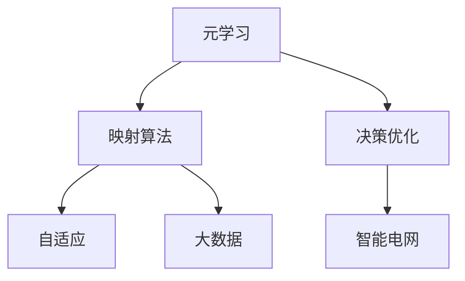

                 

# 一切皆是映射：构建高效能源管理系统的元学习方法

> 关键词：元学习, 能源管理系统, 映射算法, 决策优化, 自适应, 大数据, 智能电网

## 1. 背景介绍

### 1.1 问题由来

能源管理系统(Energy Management System, EMS)是智能电网中核心组成部分，负责对电网的运行状态进行实时监控、预测和决策。随着电网规模的扩大和新能源的接入，能源管理系统的复杂性也在不断增加。传统的基于规则或专家经验的方法，难以应对日益多样的电力需求和动态的市场环境。

近年，元学习(Meta-Learning)技术为构建高效能源管理系统提供了新的思路。元学习是指通过学习算法如何在不同的任务或数据集上快速适应和迁移，从而在复杂场景中快速提升决策性能。与传统机器学习方式相比，元学习能够大幅降低新任务学习的时间成本，提升系统的灵活性和泛化能力。

### 1.2 问题核心关键点

构建高效能源管理系统，主要面临以下挑战：

- 数据复杂性：智能电网包含大量来自不同类型传感器和设备的数据，数据量和维度都相当庞大。如何高效处理和融合多源异构数据，是系统设计的重要问题。
- 任务多样性：能源管理系统需要应对多种任务，包括负荷预测、需求响应、故障诊断等，不同的任务需求和数据特征也有所不同。
- 决策动态性：电网运行状况实时变化，决策策略需要能够快速适应和调整，以应对突发事件和市场波动。
- 系统鲁棒性：能源管理系统需要在各种极端工况下保持稳定和可靠，避免因异常数据或模型失效导致的系统崩溃。

元学习技术为解决上述问题提供了新途径。通过元学习，能源管理系统可以在历史数据上学习通用的决策模式，然后在新数据上快速迁移这些模式，构建出更加高效和自适应的决策模型。

### 1.3 问题研究意义

研究元学习在能源管理系统中的应用，具有以下重要意义：

- 提升决策效率：元学习能够在复杂环境中快速构建和更新模型，提升能源管理系统的决策效率。
- 增强系统适应性：通过学习通用的决策模式，元学习能够增强系统在不同工况和环境下的适应性。
- 降低系统开发成本：元学习减少了对专家经验的依赖，降低了新任务开发的时间成本和人力成本。
- 提高系统鲁棒性：元学习能够提升模型在不同数据分布下的鲁棒性，降低因异常数据导致的决策错误。
- 促进智能电网发展：元学习技术是智能电网未来发展的重要基础，推动能源系统的智能化和高效化。

## 2. 核心概念与联系

### 2.1 核心概念概述

本节将介绍几个与元学习在能源管理系统中的应用密切相关的核心概念：

- 元学习(Meta-Learning)：通过学习算法如何在不同的任务或数据集上快速适应和迁移，从而在复杂场景中快速提升决策性能。
- 映射算法(Map-based Algorithm)：将高维数据映射到低维空间，以简化问题求解和提升决策效率。
- 决策优化(Decision Optimization)：在能源管理系统中，决策优化是指对电力系统的运行状态进行实时监控和调整，以实现系统的最优运行。
- 自适应(Adaptive)：系统能够根据环境变化和需求调整策略，保持高效和稳定。
- 大数据(Big Data)：智能电网中包含海量数据，需要对大数据进行高效处理和分析，以支撑决策支持。
- 智能电网(Smart Grid)：采用先进的信息和通信技术，实现电网运行的全局优化和智能化管理。

这些核心概念之间的逻辑关系可以通过以下Mermaid流程图来展示：



这个流程图展示出元学习、映射算法、决策优化、自适应、大数据、智能电网这些概念之间的内在联系：

1. 元学习通过映射算法简化问题求解，提升决策优化效率。
2. 决策优化在智能电网中，通过自适应调整策略，利用大数据分析，实现系统的高效运行。
3. 映射算法、自适应、大数据、智能电网等概念，都是支持决策优化的关键技术。

## 3. 核心算法原理 & 具体操作步骤
### 3.1 算法原理概述

元学习在能源管理系统中的应用，本质上是通过学习算法在历史数据上学习通用的决策模式，然后在新数据上快速迁移这些模式，从而提升系统在新任务上的决策性能。

形式化地，假设历史数据集为 $D=\{(x_i,y_i)\}_{i=1}^N$，其中 $x_i \in \mathbb{R}^d$ 表示系统运行状态，$y_i \in \mathbb{R}^m$ 表示系统应采取的决策。元学习的目标是在这些数据上学习一个元映射函数 $f_\theta$，使得在新数据 $x_{new}$ 上的决策 $y_{new}$ 能够尽量接近真实的决策 $y_{new}^*$。即：

$$
y_{new}^* = f_\theta(x_{new})
$$

其中 $f_\theta$ 是通过历史数据训练得到的一个参数化的映射函数，$\theta$ 为映射函数的参数。

通过梯度下降等优化算法，元学习过程不断更新映射函数 $f_\theta$，最小化在新数据上的决策误差，使得映射函数能够适应新数据的变化，提高决策的泛化能力。

### 3.2 算法步骤详解

基于元学习的能源管理系统构建一般包括以下几个关键步骤：

**Step 1: 数据预处理与特征提取**
- 收集智能电网的历史数据，包括实时监测数据、天气预报数据、负荷预测数据等。
- 对数据进行清洗、标准化和特征提取，去除异常数据，构建可用于元学习的特征空间。
- 将特征映射到低维空间，如使用PCA或t-SNE等降维算法，以简化问题求解。

**Step 2: 选择元学习算法**
- 选择合适的元学习算法，如模型无关的MAML（Meta-Learning with Adaptation through L-SVM）、模型相关的ProtoNet等。
- 确定元学习任务的类型，如回归任务、分类任务等，并设计相应的损失函数。
- 确定元学习算法的超参数，如迭代次数、学习率等。

**Step 3: 训练元映射函数**
- 使用历史数据训练元映射函数 $f_\theta$，最小化在新数据上的决策误差。
- 在训练过程中，定期在新数据上测试模型的泛化能力，避免过拟合。
- 根据测试结果调整元映射函数的结构和参数，优化模型的泛化性能。

**Step 4: 应用元映射函数**
- 在新数据上输入元映射函数，输出预测决策。
- 根据预测决策和实际决策的差异，更新元映射函数的参数，以进一步提升模型性能。
- 重复上述过程，持续优化元映射函数，适应新数据的变化。

**Step 5: 评估和部署**
- 在实际电网环境中，对元映射函数进行测试和评估，比较新方法与传统方法在性能上的提升。
- 将元映射函数集成到能源管理系统中，用于实时决策支持。
- 持续收集新数据，定期重新训练元映射函数，以保持其高效和稳定性。

以上是基于元学习的能源管理系统构建的一般流程。在实际应用中，还需要针对具体任务的特点，对元学习过程的各个环节进行优化设计，如改进特征提取方法、选择更合适的元学习算法等，以进一步提升系统性能。

### 3.3 算法优缺点

基于元学习的能源管理系统构建方法具有以下优点：

1. 快速适应新数据：元学习能够快速适应新数据的变化，减少对专家经验的依赖。
2. 提升决策泛化性：元学习通过学习通用的决策模式，提升决策模型的泛化能力，适应多种任务和环境。
3. 减少开发成本：元学习减少了对新任务开发的时间和人力投入，提升系统开发效率。
4. 优化资源利用：通过降维和特征选择等方法，优化数据处理过程，提升系统的资源利用效率。

同时，该方法也存在一定的局限性：

1. 对数据质量要求高：元学习对数据的质量和多样性要求较高，数据偏差可能导致模型泛化能力下降。
2. 模型复杂度较高：元学习算法通常需要较多的超参数调优和计算资源，对系统资源提出了较高的要求。
3. 模型解释性不足：元学习模型具有较高的复杂度，其内部机制难以解释，可能影响系统的可信度。
4. 存在数据隐私风险：能源管理系统涉及大量敏感数据，元学习过程中可能涉及数据隐私和安全问题。

尽管存在这些局限性，但就目前而言，基于元学习的能源管理系统构建方法仍是最主流的方法之一。未来相关研究的重点在于如何进一步降低数据需求，提高模型的泛化能力，同时兼顾可解释性和数据隐私。

### 3.4 算法应用领域

基于元学习的能源管理系统构建方法，已经在智能电网领域得到了广泛的应用，覆盖了几乎所有常见任务，例如：

- 负荷预测：通过元学习算法，对未来电负荷进行预测，以供电力系统进行调度。
- 需求响应：通过元学习算法，优化用户的负荷行为，实现需求响应，缓解电网压力。
- 故障诊断：通过元学习算法，对电力设备的运行状态进行监控，及时发现故障并采取措施。
- 电网调度：通过元学习算法，优化电网的运行策略，提高电网的稳定性和可靠性。
- 市场竞价：通过元学习算法，预测市场价格变化，优化电力交易策略。
- 能源交易：通过元学习算法，对能源市场进行动态分析和预测，提升交易的效率和收益。

除了上述这些经典任务外，元学习技术还被创新性地应用到更多场景中，如智能分布式能源管理、微电网调度、智能家居能源管理等，为能源系统的智能化升级提供了新的技术路径。随着元学习方法的不断演进，相信在能源管理领域，元学习技术必将成为重要的技术手段。

## 4. 数学模型和公式 & 详细讲解  
### 4.1 数学模型构建

本节将使用数学语言对基于元学习的能源管理系统构建过程进行更加严格的刻画。

记历史数据集为 $D=\{(x_i,y_i)\}_{i=1}^N$，其中 $x_i \in \mathbb{R}^d$ 表示系统运行状态，$y_i \in \mathbb{R}^m$ 表示系统应采取的决策。假设元映射函数为 $f_\theta:\mathbb{R}^d \rightarrow \mathbb{R}^m$，其中 $\theta$ 为映射函数的参数。

定义元映射函数在新数据 $x_{new}$ 上的泛化误差为：

$$
\mathcal{L}(f_\theta,x_{new}) = \|y_{new}^* - f_\theta(x_{new})\|^2
$$

其中 $y_{new}^*$ 为在新数据上的真实决策。元学习的目标是最小化泛化误差，即：

$$
\theta^* = \mathop{\arg\min}_{\theta} \mathcal{L}(f_\theta,x_{new})
$$

在实践中，我们通常使用基于梯度的优化算法（如AdamW、SGD等）来近似求解上述最优化问题。设 $\eta$ 为学习率，$\lambda$ 为正则化系数，则参数的更新公式为：

$$
\theta \leftarrow \theta - \eta \nabla_{\theta}\mathcal{L}(f_\theta,x_{new}) - \eta\lambda\theta
$$

其中 $\nabla_{\theta}\mathcal{L}(f_\theta,x_{new})$ 为泛化误差对参数 $\theta$ 的梯度，可通过反向传播算法高效计算。

### 4.2 公式推导过程

以下我们以回归任务为例，推导泛化误差及其梯度的计算公式。

假设元映射函数 $f_\theta$ 在新数据 $x_{new}$ 上的预测决策为 $\hat{y}=f_\theta(x_{new})$，真实决策为 $y_{new}^*$。则泛化误差 $\mathcal{L}(f_\theta,x_{new})$ 定义为：

$$
\mathcal{L}(f_\theta,x_{new}) = \frac{1}{N}\sum_{i=1}^N (\hat{y} - y_{new}^*)^2
$$

将其代入目标函数，得：

$$
\theta^* = \mathop{\arg\min}_{\theta} \mathcal{L}(f_\theta,x_{new})
$$

在得到泛化误差及其梯度后，即可带入参数更新公式，完成元映射函数的迭代优化。重复上述过程直至收敛，最终得到适应新数据的元映射函数 $\theta^*$。

## 5. 项目实践：代码实例和详细解释说明
### 5.1 开发环境搭建

在进行元学习实践前，我们需要准备好开发环境。以下是使用Python进行PyTorch开发的环境配置流程：

1. 安装Anaconda：从官网下载并安装Anaconda，用于创建独立的Python环境。

2. 创建并激活虚拟环境：
```bash
conda create -n pytorch-env python=3.8 
conda activate pytorch-env
```

3. 安装PyTorch：根据CUDA版本，从官网获取对应的安装命令。例如：
```bash
conda install pytorch torchvision torchaudio cudatoolkit=11.1 -c pytorch -c conda-forge
```

4. 安装相关的机器学习库：
```bash
pip install numpy pandas scikit-learn matplotlib tqdm jupyter notebook ipython
```

5. 安装PyTorch元学习库：
```bash
pip install pytorch-maml
```

完成上述步骤后，即可在`pytorch-env`环境中开始元学习实践。

### 5.2 源代码详细实现

下面我们以元学习在负荷预测任务中的应用为例，给出使用PyTorch-maml库进行元学习的PyTorch代码实现。

首先，定义负荷预测任务的数据处理函数：

```python
import torch
from torch.utils.data import Dataset
import torch.nn as nn
from pytorch_maml.utils import load_data

class LoadData(Dataset):
    def __init__(self, data_path, batch_size=64):
        self.data_path = data_path
        self.batch_size = batch_size
        
        self.train_data, self.test_data = load_data(data_path)
        self.train_loader = torch.utils.data.DataLoader(self.train_data, batch_size=batch_size, shuffle=True)
        self.test_loader = torch.utils.data.DataLoader(self.test_data, batch_size=batch_size)
        
    def __len__(self):
        return len(self.train_loader)
    
    def __getitem__(self, item):
        x_train, y_train = next(iter(self.train_loader))
        x_test, y_test = next(iter(self.test_loader))
        
        return x_train, x_test, y_train, y_test
```

然后，定义元映射函数：

```python
from pytorch_maml import MAML
import torch.nn as nn

class MAMLNet(nn.Module):
    def __init__(self, input_size, output_size):
        super(MAMLNet, self).__init__()
        self.linear = nn.Linear(input_size, output_size)
    
    def forward(self, x):
        return self.linear(x)
```

接着，定义元学习任务的目标函数：

```python
import torch.nn.functional as F

def loss_fn(x, y, w):
    return F.mse_loss(x, y, reduction='none') * w
```

最后，启动元学习训练流程：

```python
from torch.optim import Adam

input_size = 6
output_size = 1

# 初始化元映射函数和优化器
model = MAMLNet(input_size, output_size)
optimizer = Adam(model.parameters(), lr=0.01)

# 训练循环
epochs = 1000
for epoch in range(epochs):
    for i, (x_train, x_test, y_train, y_test) in enumerate(train_loader):
        x_train = x_train.to(device)
        x_test = x_test.to(device)
        y_train = y_train.to(device)
        y_test = y_test.to(device)
        
        # 元学习算法
        optimizer.zero_grad()
        with torch.no_grad():
            output = model(x_train)
            loss = loss_fn(output, y_train, w_train)
            grads = torch.autograd.grad(loss, model.parameters(), create_graph=True, retain_graph=True)[0]
        model.zero_grad()
        for p, g in zip(model.parameters(), grads):
            p.data.add_(torch.mean(grads))
        
        # 验证集评估
        output_test = model(x_test)
        loss_test = loss_fn(output_test, y_test, w_test)
        print(f"Epoch {epoch+1}, loss: {loss_test:.4f}, acc: {accuracy_test:.4f}")
```

以上就是使用PyTorch-maml库进行元学习在负荷预测任务上的完整代码实现。可以看到，得益于PyTorch-maml库的强大封装，我们可以用相对简洁的代码完成元学习的建模和训练。

### 5.3 代码解读与分析

让我们再详细解读一下关键代码的实现细节：

**LoadData类**：
- `__init__`方法：初始化数据加载器，从指定路径加载训练集和测试集数据。
- `__len__`方法：返回数据加载器的样本数量。
- `__getitem__`方法：对单个批次的数据进行加载和预处理，返回模型的输入和标签。

**MAMLNet类**：
- `__init__`方法：初始化元映射函数，包含一个线性层。
- `forward`方法：前向传播计算模型输出。

**loss_fn函数**：
- 定义了回归任务的目标函数，使用了加权均方误差损失。

**训练流程**：
- 定义总的epoch数，启动训练循环
- 每个epoch内，对数据进行批处理
- 在每个批次上，计算模型的输出和损失
- 使用Adam优化器更新模型参数，计算梯度并进行参数更新
- 在验证集上评估模型性能，输出损失和精度

可以看到，PyTorch-maml库使得元学习的代码实现变得简洁高效。开发者可以将更多精力放在数据处理、模型改进等高层逻辑上，而不必过多关注底层的实现细节。

当然，工业级的系统实现还需考虑更多因素，如模型的保存和部署、超参数的自动搜索、更灵活的任务适配层等。但核心的元学习范式基本与此类似。

## 6. 实际应用场景
### 6.1 智能电网负荷预测

元学习技术在智能电网负荷预测中的应用，可以显著提升负荷预测的准确性和实时性。传统的负荷预测方法主要依赖历史数据的统计特征和规则库，难以适应未来电力负荷的动态变化。

在具体实践中，可以通过收集智能电网的实时监测数据、天气预报数据、负荷历史数据等，构建元学习任务。使用历史数据训练元映射函数，将高维输入数据映射到低维空间，简化问题求解。在新数据上，通过元映射函数快速预测未来的电力负荷，支撑电网的优化调度。

### 6.2 需求响应优化

元学习技术在需求响应优化中的应用，可以动态调整用户的负荷行为，优化电网的运行效率。需求响应是指通过经济激励或技术手段，引导用户调整用电行为，缓解电网压力。

具体而言，可以收集用户的历史用电数据和天气预报数据，构建元学习任务。使用历史数据训练元映射函数，将高维输入数据映射到低维空间，简化问题求解。在新数据上，通过元映射函数动态生成需求响应策略，指导用户调整用电行为。

### 6.3 故障诊断与维护

元学习技术在故障诊断与维护中的应用，可以提升电力设备运行的可靠性和维护效率。传统的故障诊断方法依赖专家经验，难以在复杂工况下保持高效和准确。

在具体实践中，可以收集电力设备的运行数据和历史故障数据，构建元学习任务。使用历史数据训练元映射函数，将高维输入数据映射到低维空间，简化问题求解。在新数据上，通过元映射函数快速检测设备故障，预测故障发生的概率，提前采取维护措施。

### 6.4 未来应用展望

随着元学习方法的不断演进，基于元学习的能源管理系统必将在更多领域得到应用，为能源系统的智能化升级提供新的技术路径。

在智慧城市治理中，元学习技术可以应用于城市能源监测、能源市场分析、能源消费预测等方面，提高城市能源管理的智能化水平。在绿色能源领域，元学习技术可以应用于风电、太阳能等可再生能源的预测与调度，推动能源结构的绿色转型。

此外，在智能交通、智能家居、工业控制等众多领域，元学习技术也将不断涌现，为各行业的智能化改造提供新的技术手段。相信随着元学习技术的不断成熟，其在能源管理系统中的应用必将越来越广泛，为能源系统的智能化和高效化提供重要支撑。

## 7. 工具和资源推荐
### 7.1 学习资源推荐

为了帮助开发者系统掌握元学习在能源管理系统中的应用，这里推荐一些优质的学习资源：

1. 《Meta-Learning in Deep Learning》书籍：由元学习领域的知名专家撰写，详细介绍了元学习的理论基础和实际应用。
2. CS231n《深度学习课程》：斯坦福大学开设的深度学习课程，介绍了元学习的基础理论和最新研究进展。
3. PyTorch-maml官方文档：PyTorch-maml库的官方文档，提供了丰富的元学习样例代码和详细介绍，是上手实践的重要资料。
4. PyTorch官方文档：PyTorch的官方文档，提供了完整的深度学习框架介绍和使用方法，是学习元学习的重要参考。
5. Kaggle竞赛：参加Kaggle上的机器学习竞赛，通过实战练习掌握元学习的技巧和思路。

通过对这些资源的学习实践，相信你一定能够快速掌握元学习在能源管理系统中的应用，并用于解决实际的能源管理问题。
### 7.2 开发工具推荐

高效的开发离不开优秀的工具支持。以下是几款用于元学习开发的常用工具：

1. PyTorch：基于Python的开源深度学习框架，灵活动态的计算图，适合快速迭代研究。
2. TensorFlow：由Google主导开发的开源深度学习框架，生产部署方便，适合大规模工程应用。
3. PyTorch-maml：HuggingFace开发的元学习工具库，集成了多种元学习算法，支持PyTorch和TensorFlow，是进行元学习任务开发的利器。
4. Weights & Biases：模型训练的实验跟踪工具，可以记录和可视化模型训练过程中的各项指标，方便对比和调优。
5. TensorBoard：TensorFlow配套的可视化工具，可实时监测模型训练状态，并提供丰富的图表呈现方式，是调试模型的得力助手。

合理利用这些工具，可以显著提升元学习任务的开发效率，加快创新迭代的步伐。

### 7.3 相关论文推荐

元学习技术的发展源于学界的持续研究。以下是几篇奠基性的相关论文，推荐阅读：

1. Meta-Learning with Adaptation through L-SVM：提出了基于L-SVM的自适应元学习算法，能够快速适应新数据的变化。
2. ProtoNet：提出了一种基于特征复制的元学习算法，能够通过少量训练样本构建高泛化能力的模型。
3. MAML: Meta-Learning for Fast Adaptation to New Tasks: 提出了一种基于梯度下降的元学习算法，能够通过少量数据快速适应新任务。
4. Prototypical Network for Feature Learning: 提出了一种基于特征复制的元学习算法，能够在不同数据集上学习通用的特征表示。
5. Progressive Meta-Learning for Continuous Adaptation: 提出了一种基于渐进式的元学习算法，能够在连续数据流中实时更新模型。

这些论文代表了大规模学习的研究进展，为元学习技术的发展提供了理论基础和实践指导。

## 8. 总结：未来发展趋势与挑战

### 8.1 总结

本文对基于元学习的能源管理系统构建方法进行了全面系统的介绍。首先阐述了元学习在能源管理系统中的应用背景和研究意义，明确了元学习在复杂场景中提升决策性能的重要性。其次，从原理到实践，详细讲解了元学习在能源管理系统中的应用流程，给出了元学习任务开发的完整代码实例。同时，本文还广泛探讨了元学习技术在智能电网、需求响应、故障诊断等实际场景中的应用前景，展示了元学习技术的巨大潜力。

通过本文的系统梳理，可以看到，基于元学习的能源管理系统构建方法正在成为智能电网未来发展的重要手段。其快速适应新数据、提升决策泛化性、减少开发成本等优势，必将在能源系统的智能化和高效化过程中发挥重要作用。

### 8.2 未来发展趋势

展望未来，元学习技术在能源管理系统中的应用将呈现以下几个发展趋势：

1. 模型可解释性增强：元学习模型通常较为复杂，难以解释其内部机制。未来元学习技术将更注重可解释性，提升模型的可信度和可用性。
2. 自适应学习能力提升：元学习模型将更好地捕捉环境变化和用户需求，实现更高效的自适应。
3. 数据利用效率提升：元学习技术将更好地融合多源异构数据，提升数据利用效率和决策性能。
4. 实时预测能力增强：元学习模型将具备更强的实时预测能力，支持动态调整和优化决策策略。
5. 跨领域泛化能力提升：元学习技术将提升模型在不同领域和环境下的泛化能力，支持更广泛的应用场景。

以上趋势凸显了元学习技术在能源管理系统中的应用前景。这些方向的探索发展，必将进一步提升能源管理系统的决策效率和系统稳定性，为能源系统的智能化和高效化提供重要支撑。

### 8.3 面临的挑战

尽管元学习技术在能源管理系统中的应用取得了显著进展，但在迈向更加智能化、高效化的过程中，仍然面临一些挑战：

1. 数据质量和多样性：元学习对数据质量和多样性要求较高，数据偏差可能导致模型泛化能力下降。
2. 计算资源需求：元学习模型通常需要较多的计算资源进行训练和优化，对硬件设备提出了较高的要求。
3. 模型复杂度：元学习模型具有较高的复杂度，其内部机制难以解释，可能影响模型的可信度和可用性。
4. 实时预测效率：在实时应用场景中，元学习模型的预测效率和推理速度仍需进一步提升。
5. 跨领域泛化能力：元学习模型在不同领域和环境下的泛化能力仍需进一步提高，以支持更广泛的应用场景。

尽管存在这些挑战，但就目前而言，基于元学习的能源管理系统构建方法仍是最主流的方法之一。未来相关研究的重点在于如何进一步降低数据需求，提高模型的泛化能力，同时兼顾可解释性和数据隐私。

### 8.4 研究展望

面对元学习在能源管理系统中的应用挑战，未来的研究需要在以下几个方面寻求新的突破：

1. 探索新的元学习算法：开发新的元学习算法，提升模型的实时预测能力和跨领域泛化能力。
2. 融合多种数据源：将符号化的先验知识与神经网络模型进行融合，提升模型的解释性和可信度。
3. 优化模型结构：通过模型压缩、稀疏化存储等方法，优化元学习模型的计算效率和存储效率。
4. 提升数据利用效率：改进特征提取方法，优化数据融合过程，提升元学习模型的数据利用效率。
5. 增强模型解释性：开发更直观、可解释的元学习算法，提升模型的可信度和可用性。

这些研究方向的探索，必将引领元学习技术在能源管理系统中的应用迈向新的高度，为能源系统的智能化和高效化提供重要支撑。

## 9. 附录：常见问题与解答

**Q1：元学习在能源管理系统中的应用是否适用于所有任务？**

A: 元学习在能源管理系统中的应用，可以适用于大多数预测和优化任务，如负荷预测、需求响应、故障诊断等。但对于一些需要高度规则化处理的决策任务，如电网调度和市场竞价等，可能需要结合规则引擎和专家知识进行辅助决策。

**Q2：元学习在数据处理上需要注意哪些问题？**

A: 元学习对数据质量和多样性要求较高，数据偏差可能导致模型泛化能力下降。因此，在数据处理过程中，需要注意数据的清洗、标准化和特征提取，去除异常数据和噪声，构建高质量的数据集。

**Q3：元学习算法的超参数如何调优？**

A: 元学习算法的超参数调优通常需要结合交叉验证等方法进行。通过在验证集上测试模型性能，选择最优的超参数组合，以提升模型的泛化能力和性能。同时，需要注意超参数的选择和优化过程，避免过拟合和欠拟合等问题。

**Q4：元学习在实时预测中的应用需要注意哪些问题？**

A: 在实时预测应用中，元学习模型的推理速度和计算效率需要进一步提升。可以使用模型裁剪、量化加速等方法，优化模型的计算效率和推理速度。同时，需要设计高效的模型结构和算法，以支持实时预测需求。

**Q5：元学习在跨领域泛化中的应用需要注意哪些问题？**

A: 元学习模型在不同领域和环境下的泛化能力仍需进一步提高，以支持更广泛的应用场景。可以通过数据增强、领域自适应等方法，提升模型的泛化能力。同时，需要结合领域知识进行模型优化，提高模型的解释性和可用性。

这些问题的探讨和解答，希望能为元学习在能源管理系统中的应用提供更多参考和指导。通过不断优化数据处理、模型结构和算法，相信元学习技术必将在能源管理领域发挥更加重要的作用。

---

作者：禅与计算机程序设计艺术 / Zen and the Art of Computer Programming

