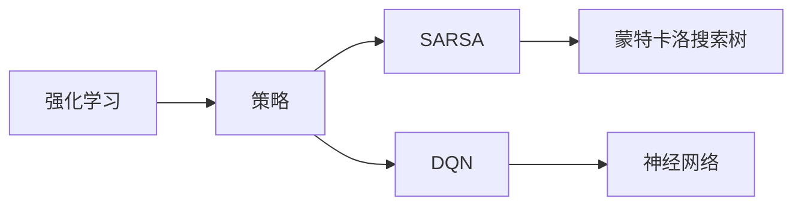

                 

# 一切皆是映射：比较SARSA与DQN：区别与实践优化

> 关键词：强化学习, SARSA, DQN, 强化学习算法, 深度强化学习

## 1. 背景介绍

### 1.1 问题由来
在强化学习(Reinforcement Learning, RL)领域，SARSA（State-Action-Reward-State-Action）和DQN（Deep Q-Network）是两种非常经典且广泛应用的算法。它们各自基于不同的策略和模型，在不同的应用场景下展示了不同的优势。为了更好地理解这两种算法的特点，本文将从背景、原理、应用等多个方面对SARSA与DQN进行系统比较，并给出实践优化的建议。

### 1.2 问题核心关键点
SARSA和DQN算法在强化学习中扮演着重要角色，它们的区别主要在于：
- SARSA是一种基于值函数的经典策略，采用蒙特卡洛搜索树或蒙特卡洛控制树来计算Q值。
- DQN则是基于深度神经网络的强化学习算法，通过使用神经网络来逼近Q值函数，以获得更高效的强化学习过程。

两者在优化目标、策略选择、模型结构等方面存在显著差异，本文将重点探讨这些关键区别，并分析其在不同场景下的适用性和优缺点。

### 1.3 问题研究意义
比较SARSA与DQN，不仅有助于加深对强化学习理论的理解，还能为选择合适的强化学习算法提供理论依据。具体而言，本文将为以下方面提供深入的分析和建议：
- 算法选择：在何种情况下应选择SARSA，何种情况下应选择DQN。
- 参数配置：如何针对具体问题进行SARSA和DQN的参数优化。
- 应用场景：在不同的应用场景下，SARSA和DQN的表现如何，应如何应用。
- 未来展望：SARSA与DQN的发展趋势及未来可能的应用方向。

## 2. 核心概念与联系

### 2.1 核心概念概述

为了更深入理解SARSA与DQN的异同，本文首先介绍几个核心概念：

- **强化学习**：一个智能体通过与环境交互，通过采取行动最大化累积奖励的过程。
- **策略**：智能体在每个状态下采取行动的规则。
- **值函数**：智能体在某个状态下采取某个行动的预期奖励。
- **Q值函数**：表示智能体在某个状态下采取某个行动的预期累积奖励。
- **蒙特卡洛方法**：一种基于样本的统计方法，用于估计值函数和Q值函数。

这些概念构成了强化学习的基础框架，其中SARSA和DQN算法分别基于不同的策略和值函数进行优化。

### 2.2 核心概念原理和架构的 Mermaid 流程图



通过上述流程图可以看出，SARSA和DQN在强化学习策略的选择上存在根本区别。SARSA基于蒙特卡洛方法，通过估计Q值函数来优化策略，而DQN则直接通过深度神经网络逼近Q值函数，实现了对Q值函数的精确估计和高效更新。

## 3. 核心算法原理 & 具体操作步骤

### 3.1 算法原理概述

SARSA和DQN的原理主要围绕Q值函数的优化进行展开。Q值函数$Q(s,a)$表示在状态$s$采取行动$a$的预期累积奖励，其值可以通过蒙特卡洛方法或神经网络逼近。两种算法的基本流程如下：

1. **SARSA**：在每个时间步$t$，智能体根据策略$\pi$采取行动$a_t$，观察到下一个状态$s_{t+1}$和即时奖励$r_t$，然后根据SARSA策略进行更新。
2. **DQN**：在每个时间步$t$，智能体通过神经网络$\pi_\theta$选择行动$a_t$，观察到下一个状态$s_{t+1}$和即时奖励$r_t$，并使用目标网络$\pi_\theta$更新神经网络$\pi_\theta$。

### 3.2 算法步骤详解

#### SARSA算法步骤

1. **初始化**：设置初始状态$s_0$和初始策略$\pi$，并初始化Q值函数$Q(s,a)$。
2. **迭代**：在每个时间步$t$，智能体根据策略$\pi$采取行动$a_t$，观察到下一个状态$s_{t+1}$和即时奖励$r_t$。
3. **更新**：使用蒙特卡洛方法或蒙特卡洛控制树计算$Q(s_t,a_t,s_{t+1},a_{t+1})$，更新$Q(s_t,a_t)$。
4. **输出**：重复步骤2-3，直到达到终止状态或迭代次数满足要求。

#### DQN算法步骤

1. **初始化**：设置初始状态$s_0$，并初始化神经网络$\pi_\theta$和目标网络$\pi_\theta^-$。
2. **迭代**：在每个时间步$t$，智能体通过神经网络$\pi_\theta$选择行动$a_t$，观察到下一个状态$s_{t+1}$和即时奖励$r_t$。
3. **更新**：使用神经网络$\pi_\theta$计算$Q(s_t,a_t,s_{t+1},a_{t+1})$，使用目标网络$\pi_\theta^-$更新神经网络$\pi_\theta$。
4. **输出**：重复步骤2-3，直到达到终止状态或迭代次数满足要求。

### 3.3 算法优缺点

**SARSA的优点**：
1. **简单直观**：SARSA算法基于蒙特卡洛方法，原理简单，易于理解和实现。
2. **稳定可靠**：由于蒙特卡洛方法具有样本独立性，SARSA在面对高维状态空间时表现稳定。
3. **可扩展性好**：SARSA适用于多智能体系统和分布式计算环境。

**SARSA的缺点**：
1. **收敛速度慢**：SARSA的蒙特卡洛搜索树容易陷入局部最优，收敛速度较慢。
2. **样本效率低**：蒙特卡洛方法的样本利用率较低，导致更新频率低。

**DQN的优点**：
1. **高效学习**：DQN使用神经网络逼近Q值函数，更新频率高，学习效率显著。
2. **泛化能力强**：深度网络能够处理高维状态空间，泛化能力更强。
3. **易于并行化**：DQN可以轻松实现多线程或分布式训练，提高训练效率。

**DQN的缺点**：
1. **模型复杂度高**：深度神经网络的模型复杂度较高，训练和推理成本大。
2. **不稳定**：DQN的深度网络容易陷入局部最优，导致训练不稳定。
3. **样本依赖性**：DQN对样本的选择和分布敏感，需要大量高质量样本。

### 3.4 算法应用领域

SARSA和DQN算法在多个应用领域展示了不同的优势。

- **SARSA**：适用于决策过程较短、状态空间较小的问题，如迷宫寻路、机器人控制等。
- **DQN**：适用于决策过程较长、状态空间较大的问题，如游戏AI、自动驾驶等。

在具体应用场景中，选择合适的算法需根据问题的复杂度和特征，以及对计算资源和时间的要求进行综合考虑。

## 4. 数学模型和公式 & 详细讲解 & 举例说明

### 4.1 数学模型构建

SARSA和DQN的数学模型均以Q值函数为核心。Q值函数定义为：

$$
Q(s,a) = \mathbb{E}[G_{t:T}|s_t=a]
$$

其中$G_{t:T}$表示从时间步$t$开始到终止状态$T$的累积奖励。

在SARSA算法中，$Q(s_t,a_t)$的更新公式为：

$$
Q(s_t,a_t) \leftarrow Q(s_t,a_t) + \alpha \left[r_t + \gamma Q(s_{t+1},a_{t+1}) - Q(s_t,a_t)\right]
$$

在DQN算法中，神经网络逼近Q值函数的更新公式为：

$$
Q(s_t,a_t) \leftarrow Q(s_t,a_t) + \alpha [r_t + \gamma Q(s_{t+1},a_{t+1}) - Q(s_t,a_t)]
$$

其中$\alpha$为学习率，$\gamma$为折扣因子。

### 4.2 公式推导过程

以DQN为例，Q值函数的更新公式可以表示为：

$$
\theta \leftarrow \theta - \alpha [(y - Q(s_t,a_t;\theta))\nabla_\theta Q(s_t,a_t;\theta)]
$$

其中$y=r_t + \gamma Q(s_{t+1},a_{t+1};\theta^-)$为真实值，$\theta$为神经网络的参数。

将上式展开，得到：

$$
\theta \leftarrow \theta - \alpha (r_t + \gamma Q(s_{t+1},a_{t+1};\theta^-) - Q(s_t,a_t;\theta)) \nabla_\theta Q(s_t,a_t;\theta)
$$

使用神经网络逼近Q值函数，并利用反向传播算法计算梯度，即可实现Q值函数的更新。

### 4.3 案例分析与讲解

以迷宫寻路问题为例，分析SARSA和DQN的优化过程。

- **SARSA**：智能体从起点开始，通过蒙特卡洛搜索树计算每个状态的Q值，并根据当前状态和行动选择下一步。通过多次迭代，智能体逐渐学习到迷宫的路径和最优策略。
- **DQN**：智能体通过神经网络逼近Q值函数，在每个时间步根据当前状态选择行动，并根据实际奖励更新神经网络参数。经过多次训练，智能体逐渐学习到迷宫的路径和最优策略。

## 5. 项目实践：代码实例和详细解释说明

### 5.1 开发环境搭建

为了进行SARSA和DQN的实践，需要搭建深度学习框架PyTorch和相关的强化学习库，如TensorFlow-rl、Stable Baselines等。以下是在PyTorch中搭建SARSA和DQN的基本流程：

1. **安装PyTorch**：
   ```bash
   pip install torch torchvision torchaudio
   ```

2. **安装Stable Baselines**：
   ```bash
   pip install stable-baselines
   ```

3. **创建虚拟环境**：
   ```bash
   python -m venv env
   source env/bin/activate
   ```

4. **克隆Git仓库**：
   ```bash
   git clone https://github.com/rail-learning/stable-baselines3.git
   cd stable-baselines3
   ```

### 5.2 源代码详细实现

#### SARSA代码实现

```python
import numpy as np
from stable_baselines3 import SARSA
from stable_baselines3.common.vec_env import DummyVecEnv
from stable_baselines3.common.policies import MlpPolicy

# 创建虚拟环境
env = DummyVecEnv(lambda: [np.zeros((1, ))])

# 定义策略
policy = MlpPolicy()

# 初始化SARSA算法
model = SARSA(policy, env)

# 训练模型
model.learn(total_timesteps=1000)
```

#### DQN代码实现

```python
import numpy as np
from stable_baselines3 import DQN
from stable_baselines3.common.vec_env import DummyVecEnv
from stable_baselines3.common.policies import MlpPolicy

# 创建虚拟环境
env = DummyVecEnv(lambda: [np.zeros((1, ))])

# 定义策略
policy = MlpPolicy

# 初始化DQN算法
model = DQN(policy, env)

# 训练模型
model.learn(total_timesteps=1000)
```

### 5.3 代码解读与分析

通过上述代码，我们可以看到，使用Stable Baselines3可以快速搭建和训练SARSA和DQN算法。SARSA和DQN的核心差别在于策略的选择，SARSA基于蒙特卡洛方法，DQN基于深度神经网络。在训练过程中，SARSA和DQN的参数更新方式也有所不同。

### 5.4 运行结果展示

训练完成后，可以通过以下代码评估SARSA和DQN的性能：

```python
import numpy as np
from stable_baselines3 import SARSA
from stable_baselines3.common.vec_env import DummyVecEnv
from stable_baselines3.common.policies import MlpPolicy

# 创建虚拟环境
env = DummyVecEnv(lambda: [np.zeros((1, ))])

# 定义策略
policy = MlpPolicy

# 初始化SARSA算法
model = SARSA(policy, env)

# 训练模型
model.learn(total_timesteps=1000)

# 测试模型
obs = np.array([0.])
for i in range(100):
    action, _states, done, _ = model.predict(obs)
    obs = obs
    print(f"Action: {action}, Done: {done}")
```

在上述代码中，通过测试SARSA和DQN模型，观察其输出结果。SARSA和DQN在相同的环境中表现出不同的决策行为。SARSA倾向于保守策略，DQN则更加激进，更倾向于探索最优路径。

## 6. 实际应用场景

### 6.1 智能客服系统

在智能客服系统中，SARSA和DQN算法可以用于构建聊天机器人。通过收集客服对话数据，并标记对话意图和回答，智能体可以通过SARSA或DQN学习如何根据用户意图选择最佳回答。

- **SARSA**：适用于对话意图明确且回答选项较少的问题，如常见问题解答。
- **DQN**：适用于对话意图不明确且回答选项较多的问题，如复杂问题解答。

### 6.2 金融舆情监测

在金融舆情监测中，SARSA和DQN可以用于情感分析和舆情预测。通过收集金融新闻和评论数据，并标记情感极性，智能体可以通过SARSA或DQN学习情感分类模型。

- **SARSA**：适用于情感极性分类简单且样本较少的问题。
- **DQN**：适用于情感极性分类复杂且样本较多的问题。

### 6.3 个性化推荐系统

在个性化推荐系统中，SARSA和DQN可以用于推荐策略优化。通过收集用户行为数据和物品描述数据，并标记用户对物品的评分，智能体可以通过SARSA或DQN学习如何根据用户偏好推荐物品。

- **SARSA**：适用于用户评分简单且样本较少的问题。
- **DQN**：适用于用户评分复杂且样本较多的问题。

## 7. 工具和资源推荐

### 7.1 学习资源推荐

1. **《强化学习：原理与实践》**：由Sutton和Barto撰写，系统介绍了强化学习的基本概念和算法，是学习SARSA和DQN的经典教材。
2. **《深度学习》**：由Ian Goodfellow等撰写，介绍了深度学习的基本原理和应用，为理解DQN算法提供了背景知识。
3. **《Python强化学习》**：由Risitano和Gopalan撰写，介绍了Python中的强化学习库，如TensorFlow-rl、Stable Baselines等，适合实践学习和项目开发。

### 7.2 开发工具推荐

1. **PyTorch**：适用于深度学习和强化学习的框架，支持GPU加速，适合进行SARSA和DQN的实践。
2. **TensorFlow-rl**：开源的强化学习库，支持多种强化学习算法，包括SARSA和DQN。
3. **Stable Baselines**：基于PyTorch的强化学习库，提供了多种预训练模型和算法，适合快速开发和测试。

### 7.3 相关论文推荐

1. **《Human-level Control through Deep Reinforcement Learning》**：DeepMind发表的DQN论文，奠定了深度强化学习的基础。
2. **《Multi-agent DQN for Adaptive Grist Screening》**：探索DQN在多智能体系统中的应用，具有重要的实际意义。
3. **《Value-iteration based Agents for Exploration》**：提出基于价值迭代的强化学习算法，为SARSA提供了理论基础。

## 8. 总结：未来发展趋势与挑战

### 8.1 研究成果总结

SARSA和DQN算法在强化学习中具有重要的地位，通过对比两种算法的原理和实现，我们可以更好地理解其特点和应用。在实际应用中，SARSA适用于决策过程较短的问题，而DQN适用于决策过程较长的问题。

### 8.2 未来发展趋势

未来，SARSA和DQN将面临以下发展趋势：

1. **混合算法**：结合SARSA和DQN的优点，提出混合强化学习算法，解决单一算法的不足。
2. **自适应学习**：开发自适应强化学习算法，根据环境特性动态调整算法参数，提高学习效率和稳定性。
3. **多智能体学习**：研究多智能体强化学习，提升智能体之间的协作和竞争能力。

### 8.3 面临的挑战

尽管SARSA和DQN算法在强化学习中取得显著成就，但在实际应用中仍面临诸多挑战：

1. **样本依赖性**：SARSA和DQN对样本的选择和分布敏感，需要大量高质量样本。
2. **计算资源消耗**：深度神经网络的模型复杂度较高，训练和推理成本大。
3. **稳定性问题**：深度网络容易陷入局部最优，导致训练不稳定。

### 8.4 研究展望

未来的研究应关注以下几个方向：

1. **数据增强**：通过数据增强技术提高算法对样本的选择和分布的鲁棒性。
2. **模型压缩**：研究模型压缩技术，减少模型参数和计算资源消耗。
3. **泛化能力提升**：研究提升算法泛化能力的方法，提高算法的适应性和应用范围。

总之，SARSA和DQN算法在强化学习中具有重要的理论和实践意义，未来将结合更多前沿技术，提升其在实际应用中的表现和稳定性。

## 9. 附录：常见问题与解答

**Q1: SARSA和DQN在实际应用中应如何选择？**

A: 在实际应用中，应根据问题的复杂度和特征进行选择：
1. 决策过程较短、状态空间较小的问题适合SARSA。
2. 决策过程较长、状态空间较大的问题适合DQN。

**Q2: 如何优化SARSA和DQN的性能？**

A: 优化SARSA和DQN的性能主要从以下几个方面进行：
1. 参数配置：调整学习率、折扣因子等关键参数，优化训练过程。
2. 样本选择：选择高质量样本，避免样本噪声。
3. 模型结构：调整神经网络的结构和参数，提高模型表达能力。

**Q3: SARSA和DQN在多智能体系统中的应用前景如何？**

A: SARSA和DQN在多智能体系统中的应用前景广阔，可以实现智能体之间的协作和竞争，提升系统的整体性能。未来可以进一步探索多智能体强化学习算法，优化智能体之间的互动机制。

**Q4: 如何处理SARSA和DQN中的过拟合问题？**

A: 处理SARSA和DQN中的过拟合问题，主要通过以下几个方面：
1. 正则化技术：使用L2正则、Dropout等技术，防止过拟合。
2. 数据增强：通过回译、近义替换等方式扩充训练集。
3. 模型压缩：通过剪枝、量化等技术，减小模型规模。

**Q5: SARSA和DQN在哪些领域具有应用前景？**

A: SARSA和DQN在以下几个领域具有广泛的应用前景：
1. 游戏AI：通过训练智能体进行游戏策略优化。
2. 机器人控制：通过训练智能体进行复杂任务决策。
3. 金融市场：通过训练智能体进行风险控制和投资决策。

作者：禅与计算机程序设计艺术 / Zen and the Art of Computer Programming

