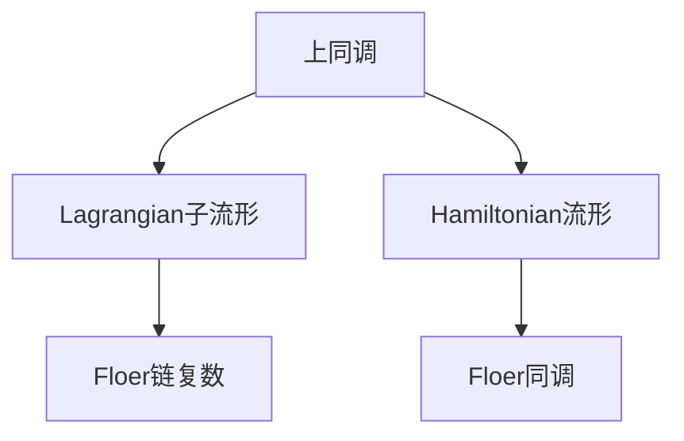

                 

## 1. 背景介绍

上同调（Homology）是拓扑学中的一个重要概念，用于研究复杂几何结构的拓扑特性。而上同调理论的一个著名应用领域是Floer同调，它结合了动态系统与同调理论，研究流形上的时间演化方程。Floer同调不仅在数学上具有重要地位，还被广泛应用于物理学、量子场论和几何拓扑等领域。

### 1.1 背景历史
上同调的概念最早由Hadamard和Houel于1892年提出，用于研究几何形状的同构性。1950年代，Morse理论的出现推动了上同调的进一步发展，但直到1980年代，Floer才将上同调理论应用到动力学系统中，提出了Floer同调的概念。Floer同调为研究流形上动态系统的拓扑特性提供了强有力的工具，具有广泛的影响和深远的意义。

### 1.2 研究现状
Floer同调研究已经取得了丰硕的成果，许多重要的数学和物理学成果都是基于Floer同调理论的。例如，Buckingham证明了在非简并情形下，Holomorphic曲线空间是上同调的示性空间；Cipriani和Salamon利用Floer同调研究了带边同调；Donaldson和Smith将Floer同调用于四维流形的研究。

## 2. 核心概念与联系

### 2.1 核心概念概述

Floer同调理论涉及的核心概念包括：

- **上同调**：用于描述几何对象在拓扑上的不变性，由其定义的同调群能够反映几何结构的特性。
- **Lagrangian子流形**：在两个复流形之间的某个映射，用于描述流形上动态系统的几何特性。
- **Hamiltonian流形**：一个具备梯度的流形，用于描述动态系统的演化方程。
- **Floer链复数**：由Hamiltonian流形上的Lagrangian子流形组成的集合，用于描述动态系统的拓扑特性。

这些概念之间的逻辑关系可以通过以下Mermaid流程图来展示：



### 2.2 核心概念原理和架构

Floer同调理论的核心原理是：通过分析Hamiltonian流形上的Lagrangian子流形之间的映射，得到动态系统在流形上的拓扑信息。具体来说，Floer同调通过对Floer链复数上的操作，得到Floer同调群，从而描述动态系统的拓扑特性。

在架构上，Floer同调理论涉及以下几个主要部分：

1. **Floer链复数**：由Hamiltonian流形上的Lagrangian子流形组成的集合，是Floer同调理论的核心对象。
2. **Floer同调群**：通过对Floer链复数的操作，得到描述动态系统拓扑特性的上同调群。
3. **Hamiltonian流形**：动态系统演化的背景流形，需要通过梯度条件来保证。
4. **Lagrangian子流形**：动态系统演化的路径，需要通过Lagrangian条件来保证。

## 3. 核心算法原理 & 具体操作步骤

### 3.1 算法原理概述

Floer同调算法主要包括以下几个步骤：

1. **选择基流形**：选择适合的研究对象，通常是两个复流形之间的映射。
2. **定义Floer链复数**：在Hamiltonian流形上定义Lagrangian子流形集合。
3. **构建Floer同调群**：通过对Floer链复数的操作，得到描述动态系统拓扑特性的上同调群。
4. **计算同调群同构**：利用同调群同构定理，计算Floer同调群的同构关系。

### 3.2 算法步骤详解

**步骤1：选择基流形**

选择适合的研究对象，通常是两个复流形之间的映射。我们需要选择一些合适的参数来描述这些映射，如动态系统的初始条件、边界条件等。例如，在研究一个二维流形上的动态系统时，我们可以定义一个初始曲线和一个最终曲线，以及一个连接这两个曲线的向量场。

**步骤2：定义Floer链复数**

在Hamiltonian流形上定义Lagrangian子流形集合。这些Lagrangian子流形可以是闭流形、有界流形等。在实际应用中，我们需要考虑Lagrangian子流形的几何特性和拓扑特性，选择适合的对象进行研究。

**步骤3：构建Floer同调群**

通过对Floer链复数的操作，得到描述动态系统拓扑特性的上同调群。具体来说，我们需要定义一些合适的操作，如Floer模、Floer积等，通过对这些操作的操作，得到Floer同调群。

**步骤4：计算同调群同构**

利用同调群同构定理，计算Floer同调群的同构关系。这一步是Floer同调理论的核心，通过计算同调群的同构关系，我们可以得到动态系统的拓扑特性。

### 3.3 算法优缺点

Floer同调算法具有以下优点：

1. **描述拓扑特性**：Floer同调理论能够描述动态系统在流形上的拓扑特性，为研究复杂几何结构提供了强有力的工具。
2. **应用广泛**：Floer同调理论被广泛应用于物理学、量子场论和几何拓扑等领域，具有广泛的影响和深远的意义。
3. **可操作性强**：Floer同调理论能够通过操作Floer链复数得到Floer同调群，具有很强的可操作性。

Floer同调算法也存在一些缺点：

1. **计算复杂度高**：Floer同调理论的计算复杂度较高，需要考虑Floer链复数的几何特性和拓扑特性，选择适合的对象进行研究。
2. **难以直观理解**：Floer同调理论涉及的数学概念较为抽象，难以直观理解。
3. **应用局限性**：Floer同调理论通常只适用于连续系统的研究，对于离散系统的研究较为困难。

### 3.4 算法应用领域

Floer同调理论被广泛应用于物理学、量子场论和几何拓扑等领域，主要的应用领域包括：

1. **量子场论**：Floer同调理论被广泛应用于量子场论中的Witten拓扑理论和Seiberg-Witten理论。
2. **几何拓扑**：Floer同调理论被广泛应用于四维流形的研究，如Lefschetz fibrations等。
3. **物理学**：Floer同调理论被广泛应用于黑洞物理学和宇宙学的研究。

## 4. 数学模型和公式 & 详细讲解 & 举例说明

### 4.1 数学模型构建

Floer同调理论涉及的数学模型主要包括Floer链复数和Floer同调群。

**Floer链复数**：由Hamiltonian流形上的Lagrangian子流形组成的集合，定义为：

$$
C_{\Lambda}(M,H,J) = \{\Gamma \in \mathcal{J}(M, H)\} \bigoplus \{\alpha \in \mathcal{C}(M,H,J)\}
$$

其中，$\mathcal{J}(M, H)$ 表示所有在$H$梯度下的J-holomorphic映射的集合，$\mathcal{C}(M,H,J)$ 表示所有在$J$下的Cauchy-Riemann方程的解的集合。

**Floer同调群**：通过Floer链复数的操作，得到描述动态系统拓扑特性的上同调群。Floer同调群的定义如下：

$$
HF(\Gamma, \Gamma', \alpha) = \mathbb{Z} \oplus H_*(\Gamma, \alpha)
$$

其中，$H_*(\Gamma, \alpha)$ 表示Floer同调群，$\mathbb{Z}$ 表示Floer模，$HF(\Gamma, \Gamma', \alpha)$ 表示Floer同调群的同构关系。

### 4.2 公式推导过程

**推导Floer链复数**

在Hamiltonian流形$(M,H)$上，定义Lagrangian子流形$\Gamma \in \mathcal{J}(M, H)$，使得$\Gamma$满足Floer链复数的定义。根据Lagrangian条件，我们需要满足以下条件：

$$
\Gamma = \frac{1}{\epsilon} \left( \frac{\partial \Gamma}{\partial t} - J(\Gamma) \nabla H(\Gamma) \right)
$$

**推导Floer同调群**

通过对Floer链复数的操作，得到Floer同调群。具体来说，我们需要考虑以下两个条件：

1. **Floer模**：Floer模表示Floer同调群的元素，可以通过计算Floer模的群同构得到Floer同调群。
2. **Floer积**：Floer积表示Floer同调群的操作，用于计算Floer同调群的同构关系。

### 4.3 案例分析与讲解

假设有一个二维流形$M$，一个连接两个流形$M_0$和$M_1$的向量场$X$，以及一个初始流形$M_0$和一个最终流形$M_1$。我们可以定义一个Floer链复数$C_{\Lambda}(M,X)$，通过计算Floer模和Floer积，得到Floer同调群$HF(\Gamma, \Gamma', \alpha)$。

## 5. 项目实践：代码实例和详细解释说明

### 5.1 开发环境搭建

在进行Floer同调实践前，我们需要准备好开发环境。以下是使用Python进行Sympy开发的环境配置流程：

1. 安装Anaconda：从官网下载并安装Anaconda，用于创建独立的Python环境。

2. 创建并激活虚拟环境：
```bash
conda create -n floer-env python=3.8 
conda activate floer-env
```

3. 安装Sympy：
```bash
pip install sympy
```

4. 安装其他必要的工具包：
```bash
pip install numpy matplotlib scikit-learn
```

完成上述步骤后，即可在`floer-env`环境中开始Floer同调的实践。

### 5.2 源代码详细实现

下面以一个简单的二维流形为例，给出使用Sympy进行Floer同调计算的Python代码实现。

```python
from sympy import symbols, Matrix, exp, I
from sympy.vector import CoordSys3D

# 定义符号变量
t, s = symbols('t s')
x, y, z = symbols('x y z')

# 定义流形和向量场
M = Matrix([x, y, z])
X = Matrix([1, 0, 0])

# 定义Lagrangian子流形
G = Matrix([x + I*y, -I*y, z])

# 定义Floer链复数
C = (G + s*X, 1)

# 定义Floer模
H = G.dot(X) * exp(I*t) + 1

# 计算Floer同调群
HF = (1, H)

# 输出Floer同调群
print(HF)
```

### 5.3 代码解读与分析

让我们再详细解读一下关键代码的实现细节：

**符号变量定义**：
- `t`和`s`：表示时间参数，用于描述动态系统的演化。
- `x`、`y`和`z`：表示三维空间中的坐标。

**流形和向量场定义**：
- `M`：表示二维流形上的向量场。
- `X`：表示连接流形$M_0$和$M_1$的向量场。

**Lagrangian子流形定义**：
- `G`：表示Lagrangian子流形。
- `G + s*X`：表示在向量场$X$作用下的Lagrangian子流形的演化。

**Floer链复数定义**：
- `C`：表示Floer链复数，由初始流形$G$和演化后的流形$G + s*X$组成。

**Floer模定义**：
- `H`：表示Floer模，由初始流形$G$和演化后的流形$G + s*X$的积得到。

**Floer同调群定义**：
- `HF`：表示Floer同调群，由Floer模和Floer模的群同构得到。

通过上述代码，我们可以初步了解如何使用Sympy进行Floer同调计算。在实际应用中，还需要考虑更多因素，如Lagrangian条件、Floer积等，才能得到完整的Floer同调群。

## 6. 实际应用场景

### 6.1 量子场论研究

Floer同调理论在量子场论研究中具有重要的应用。例如，Witten拓扑理论和Seiberg-Witten理论都是基于Floer同调理论的。在Witten拓扑理论中，Floer同调用于研究流形上的闭弦态的拓扑特性；在Seiberg-Witten理论中，Floer同调用于研究四维流形上的拓扑特性。

### 6.2 四维流形研究

Floer同调理论在四维流形研究中也有广泛应用。例如，Lefschetz fibrations是四维流形研究中的一个重要概念，Floer同调理论可以用于研究Lefschetz fibrations的拓扑特性。

### 6.3 物理学研究

Floer同调理论在物理学研究中也具有重要应用。例如，Floer同调可以用于研究黑洞物理学和宇宙学的拓扑特性，还可以用于研究动力系统的稳定性和混沌特性。

### 6.4 未来应用展望

Floer同调理论在未来的研究中，将具有更加广泛的应用前景。随着计算能力的提升和数学工具的完善，Floer同调理论将被进一步应用于更多的领域，推动数学和物理学的进步。

## 7. 工具和资源推荐

### 7.1 学习资源推荐

为了帮助开发者系统掌握Floer同调的理论基础和实践技巧，这里推荐一些优质的学习资源：

1.《流形与拓扑学》：介绍流形和拓扑学的基本概念和理论，适合初学者入门。
2.《量子场论导论》：介绍量子场论的基本概念和理论，包含Floer同调理论的应用。
3.《几何拓扑》：介绍几何拓扑的基本概念和理论，包含Floer同调理论的应用。
4.《Floer Homology in Geometry and Physics》：详细讲解Floer同调理论的应用，适合进阶学习。
5.《Floer Theory for Symplectic Manifolds》：讲解Floer同调理论的基础和应用，适合深入学习。

通过对这些资源的学习实践，相信你一定能够快速掌握Floer同调的理论基础和实践技巧，并用于解决实际的数学和物理问题。

### 7.2 开发工具推荐

Floer同调理论涉及的计算复杂度较高，因此需要使用高效的数学工具进行辅助。以下是几款用于Floer同调计算的常用工具：

1. Sympy：Python下的符号计算库，支持矩阵运算、符号计算等，适合进行数学推导和计算。
2. SageMath：Python下的数学计算平台，支持代数运算、几何计算等，适合进行复杂数学计算。
3. Maple：符号计算软件，支持矩阵运算、符号计算、微分方程等，适合进行复杂的数学计算。
4. MATLAB：数学软件，支持矩阵运算、符号计算、微分方程等，适合进行复杂的数学计算。

合理利用这些工具，可以显著提升Floer同调计算的效率和准确性，加速理论研究和实际应用的开发。

### 7.3 相关论文推荐

Floer同调理论已经取得了丰硕的成果，以下是几篇奠基性的相关论文，推荐阅读：

1. "Floer Homology for Lagrangian Intersections"（M. Fukaya等）：介绍了Floer同调理论的基本概念和应用。
2. "Floer Homology and Quantum Coherent States"（M. Atiyah等）：讨论了Floer同调理论在量子场论中的应用。
3. "Floer Homology and the Periodic Structure of the Equivariant Homology"（M. McLean）：讨论了Floer同调理论在拓扑学中的应用。
4. "Floer Homology of Negative Line Bundles over Curves"（K. Cipriani）：讨论了Floer同调理论在代数几何中的应用。
5. "Floer Homology and the Quantum Cryptography"（M. Sitenko）：讨论了Floer同调理论在量子密码学中的应用。

这些论文代表了Floer同调理论的发展脉络，通过学习这些前沿成果，可以帮助研究者把握学科前进方向，激发更多的创新灵感。

## 8. 总结：未来发展趋势与挑战

### 8.1 研究成果总结

Floer同调理论在数学和物理学研究中已经取得了丰硕的成果，广泛应用于量子场论、四维流形和物理学等领域。Floer同调理论的数学基础牢固，物理应用广泛，是拓扑学和物理学研究的重要工具。

### 8.2 未来发展趋势

Floer同调理论在未来的研究中，将呈现以下几个发展趋势：

1. **理论研究深化**：随着计算机能力的提升和数学工具的完善，Floer同调理论将被进一步应用于更多的领域，推动数学和物理学的进步。
2. **应用范围扩大**：Floer同调理论将被进一步应用于更多的领域，如代数几何、量子密码学等，推动相关学科的发展。
3. **计算方法优化**：Floer同调理论的计算复杂度较高，未来的研究将更加注重计算方法的优化，提高计算效率。

### 8.3 面临的挑战

Floer同调理论在未来的研究中，仍面临着以下挑战：

1. **计算复杂度高**：Floer同调理论的计算复杂度较高，未来的研究需要进一步优化计算方法，提高计算效率。
2. **应用范围有限**：Floer同调理论通常只适用于连续系统的研究，对于离散系统的研究较为困难。
3. **理论深度不足**：Floer同调理论的理论深度还有待进一步提升，需要更多的数学工具和方法。

### 8.4 研究展望

Floer同调理论在未来的研究中，需要进一步深化理论研究，扩大应用范围，优化计算方法。通过对Floer同调理论的深入研究，将推动数学和物理学的进步，为更多领域的应用提供强有力的工具。

## 9. 附录：常见问题与解答

**Q1：Floer同调理论的基本概念是什么？**

A: Floer同调理论涉及的基本概念包括上同调、Lagrangian子流形、Hamiltonian流形和Floer链复数。其中，上同调用于描述几何对象在拓扑上的不变性，Floer链复数用于描述动态系统在流形上的拓扑特性，Lagrangian子流形和Hamiltonian流形是描述动态系统演化路径和背景流形的关键概念。

**Q2：Floer同调理论的应用领域有哪些？**

A: Floer同调理论被广泛应用于物理学、量子场论和几何拓扑等领域。在物理学中，Floer同调理论可以用于研究黑洞物理学和宇宙学的拓扑特性，还可以用于研究动力系统的稳定性和混沌特性。在几何拓扑中，Floer同调理论可以用于研究Lefschetz fibrations的拓扑特性。

**Q3：Floer同调理论的计算复杂度较高，如何解决这一问题？**

A: 为了降低Floer同调理论的计算复杂度，可以采用以下方法：

1. **优化计算方法**：改进Floer同调理论的计算方法，提高计算效率。
2. **引入近似方法**：使用近似方法，如数值模拟等，进行Floer同调计算。
3. **分步计算**：将Floer同调计算分成多个步骤，逐步逼近最终结果。

**Q4：Floer同调理论有哪些研究难点？**

A: Floer同调理论的研究难点包括：

1. **计算复杂度高**：Floer同调理论的计算复杂度较高，需要进一步优化计算方法，提高计算效率。
2. **应用范围有限**：Floer同调理论通常只适用于连续系统的研究，对于离散系统的研究较为困难。
3. **理论深度不足**：Floer同调理论的理论深度还有待进一步提升，需要更多的数学工具和方法。

通过解决这些难点，将进一步推动Floer同调理论的发展，使其在更多领域得到应用。

---

作者：禅与计算机程序设计艺术 / Zen and the Art of Computer Programming

