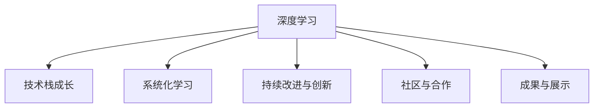

                 

# 专业知识的积累：源于重复练习

> 关键词：专业知识积累, 重复练习, 深度学习, 技术栈成长, 计算机科学教育, 技能提升

## 1. 背景介绍

### 1.1 问题由来
在计算机科学和信息技术领域，专业知识的积累与深度学习是一个永恒的主题。无论是在软件开发、架构设计、数据分析，还是人工智能领域，扎实而深度的专业知识都是从业者不断成长、应对挑战的关键。然而，如何高效地积累专业知识，如何在不断重复练习中提升技能，是所有学习者和从业者必须面对的挑战。

### 1.2 问题核心关键点
在专业知识的积累与深度学习过程中，核心关键点包括以下几个方面：
1. **深度学习的重要性**：通过深度学习和不断练习，理解并掌握核心概念和技术。
2. **系统化学习与实践**：从理论到实践，从基础知识到应用技能，系统化地提升专业能力。
3. **持续改进与创新**：在重复练习中不断反思和改进，推动技术和知识的前沿发展。
4. **社区与合作**：参与社区交流和合作，拓宽知识面，提升团队协作能力。
5. **成果与展示**：通过项目和成果展示，将所学知识转化为实际价值，加深理解。

这些关键点不仅涵盖了专业知识和深度学习的全过程，还强调了学习与实践相结合的重要性。

### 1.3 问题研究意义
研究专业知识的积累与深度学习，对于从业者的职业发展、技术栈的成长，以及整个计算机科学教育体系的改进，都具有重要意义：

1. **提升个人能力**：通过深入学习和不断实践，提升个人的技术水平和专业素养。
2. **推动行业进步**：技术栈的持续成长和创新，推动整个行业的技术进步和发展。
3. **促进教育改进**：系统化、实践导向的教育方法，有助于培养更多高水平的技术人才。
4. **应对挑战**：面对技术更新迭代带来的挑战，通过不断学习和实践，保持技术的前沿性和适应性。

## 2. 核心概念与联系

### 2.1 核心概念概述

为了更好地理解专业知识的积累与深度学习过程，本节将介绍几个密切相关的核心概念：

- **深度学习**：一种通过多层神经网络模型学习数据特征的机器学习方法。深度学习在图像识别、语音识别、自然语言处理等领域取得了巨大成功。
- **技术栈成长**：指在职业生涯中不断学习和掌握新技能，形成全面的技术能力和经验的过程。
- **系统化学习**：通过系统的课程和项目，从基础知识到实际应用，逐步提升技术水平。
- **持续改进与创新**：通过不断的学习和实践，反思和改进技术方法，推动技术进步。
- **社区与合作**：参与技术社区交流和项目合作，拓宽知识面，提升协作能力。
- **成果与展示**：通过项目实践和成果展示，验证所学知识，增强自信。

这些核心概念之间的逻辑关系可以通过以下Mermaid流程图来展示：



这个流程图展示了一个从深度学习到技术栈成长的系统化过程，包括学习和实践、改进与创新、社区合作、成果展示等关键环节。

## 3. 核心算法原理 & 具体操作步骤
### 3.1 算法原理概述

专业知识的积累与深度学习，本质上是一个通过不断重复练习，理解并掌握核心技术的过程。这一过程可以分为以下几个步骤：

1. **理论学习**：通过阅读书籍、观看视频、参加课程等方式，学习相关的理论知识。
2. **实践应用**：将所学理论知识应用于实际项目中，通过编码实现，加深理解。
3. **反思与改进**：在实践过程中，不断反思和改进自己的技术方法，提升技能。
4. **社区交流**：参与技术社区，与同行交流，学习他人的经验和技巧。
5. **成果展示**：通过项目展示和分享，验证所学知识，增强自信心。

### 3.2 算法步骤详解

#### 步骤1：理论学习

理论学习是积累专业知识的基础。这一阶段的核心任务是系统化地学习相关理论知识，建立坚实的知识基础。

- **阅读经典教材**：选择经典的教材，如《深入理解计算机系统》、《计算机网络》、《机器学习》等，深入理解其核心概念和技术。
- **参加在线课程**：利用Coursera、edX、Udacity等平台上的在线课程，系统学习相关理论知识。
- **观看视频教程**：通过YouTube、Bilibili等平台，观看相关领域的视频教程，快速掌握基本技能。

#### 步骤2：实践应用

理论学习只是第一步，将所学知识应用于实际项目中，通过编码实现，是深化理解的关键。

- **选择项目**：根据兴趣和职业发展需求，选择适合自己的项目，如开发一个web应用、实现一个机器学习模型等。
- **编写代码**：按照项目要求，编写代码，实现功能。这一过程中，不断调试和优化代码，提升编程能力。
- **版本控制**：使用Git等版本控制工具，记录代码变化，方便后续回溯和协作。

#### 步骤3：反思与改进

在实践中，不断反思和改进技术方法，是提升技能的重要环节。

- **代码评审**：通过代码评审，学习他人的代码实现和设计思路，发现自己的不足。
- **技术博客**：通过撰写技术博客，总结自己的学习和实践过程，分享心得和经验。
- **社区讨论**：参与技术社区讨论，学习他人的见解和反馈，提升技术水平。

#### 步骤4：社区交流

社区交流是拓宽知识面、提升协作能力的重要途径。

- **参与开源项目**：通过参与开源项目，学习他人的代码实现和设计思路，提升团队协作能力。
- **参加技术会议**：参加技术会议和论坛，与同行交流，学习最新的技术进展和行业动态。
- **加入技术社区**：加入GitHub、Stack Overflow等技术社区，参与讨论和合作，拓宽知识面。

#### 步骤5：成果展示

成果展示是将所学知识转化为实际价值，增强自信心的重要步骤。

- **展示项目**：通过GitHub、个人博客等方式，展示自己的项目和成果，分享技术经验。
- **撰写论文**：通过撰写技术论文，总结和推广自己的研究成果，提升学术影响力。
- **公开演讲**：参加技术会议和技术讲座，公开演讲自己的技术见解和经验，提升技术影响力。

### 3.3 算法优缺点

深度学习和专业知识的积累过程，具有以下优点：

- **系统化学习**：通过系统的课程和项目，从基础知识到实际应用，逐步提升技术水平。
- **实践导向**：通过实际项目和编程练习，加深理解，提升技能。
- **社区合作**：通过参与社区交流和项目合作，拓宽知识面，提升协作能力。
- **成果展示**：通过项目展示和分享，验证所学知识，增强自信。

同时，这一过程也存在一些局限性：

- **时间和资源投入**：需要大量时间和精力投入，对学习者和从业者的时间和资源都有较高要求。
- **知识更新快**：技术更新迭代迅速，需要不断学习和跟进，保持技术的前沿性。
- **实践机会有限**：对于一些高门槛的领域，如人工智能和大数据，实践机会较少，需要更多外部资源支持。

尽管存在这些局限性，但深度学习和专业知识的积累过程仍然是大规模技术人才培养和提升的重要方法。

### 3.4 算法应用领域

深度学习和专业知识的积累方法，已经在软件开发、架构设计、数据分析、人工智能等众多领域得到了广泛应用，具体应用如下：

- **软件开发**：通过不断学习和实践，提升编程能力和设计思路。
- **架构设计**：通过系统化学习和实践，形成全面的技术能力和经验。
- **数据分析**：通过数据分析项目，提升数据处理和分析能力。
- **人工智能**：通过深度学习项目，掌握核心技术和算法，提升AI能力。
- **教育培训**：通过系统化学习与实践，培养更多高水平的技术人才。

## 4. 数学模型和公式 & 详细讲解 & 举例说明

### 4.1 数学模型构建

专业知识的积累与深度学习，可以通过数学模型来系统化描述。以下是一个基本的数学模型：

- **输入**：理论学习、实践应用、反思与改进、社区交流、成果展示等步骤。
- **输出**：技术栈成长、专业技能提升、团队协作能力增强、技术影响力提升等成果。

### 4.2 公式推导过程

假设深度学习过程可以用一个时间序列来表示，其中 $T$ 表示时间步数，$X_t$ 表示在第 $t$ 步的输入，$Y_t$ 表示在第 $t$ 步的输出。则深度学习过程的数学模型可以表示为：

$$
Y_t = f(X_t, Y_{t-1}, \theta)
$$

其中，$f$ 表示深度学习算法，$\theta$ 表示模型参数。

通过不断的循环迭代，模型可以逐步提升性能，达到理想的输出效果。

### 4.3 案例分析与讲解

以机器学习模型的训练为例，展示深度学习和专业知识的积累过程。

#### 步骤1：理论学习
- **学习内容**：机器学习的基本概念、算法原理、数据处理技术等。
- **学习方式**：阅读经典教材《机器学习》，参加在线课程，观看视频教程。

#### 步骤2：实践应用
- **项目选择**：实现一个简单的分类模型，如鸢尾花分类器。
- **代码实现**：使用Python和scikit-learn库，编写代码实现模型训练和评估。
- **调试优化**：通过调试和优化代码，提升模型性能。

#### 步骤3：反思与改进
- **代码评审**：通过GitHub上的代码评审，学习他人的代码实现和设计思路。
- **技术博客**：撰写博客，总结自己的学习和实践过程，分享心得和经验。

#### 步骤4：社区交流
- **参与开源项目**：在GitHub上参与一个开源项目，学习他人的代码实现和设计思路。
- **参加技术会议**：参加Kaggle数据科学竞赛，与同行交流，学习最新的技术进展和行业动态。

#### 步骤5：成果展示
- **展示项目**：通过GitHub展示自己的项目和成果，分享技术经验。
- **撰写论文**：通过撰写技术论文，总结和推广自己的研究成果。

## 5. 项目实践：代码实例和详细解释说明

### 5.1 开发环境搭建

在进行深度学习和专业知识的积累实践前，我们需要准备好开发环境。以下是使用Python进行深度学习开发的环境配置流程：

1. 安装Anaconda：从官网下载并安装Anaconda，用于创建独立的Python环境。
2. 创建并激活虚拟环境：
```bash
conda create -n pytorch-env python=3.8 
conda activate pytorch-env
```
3. 安装PyTorch：根据CUDA版本，从官网获取对应的安装命令。例如：
```bash
conda install pytorch torchvision torchaudio cudatoolkit=11.1 -c pytorch -c conda-forge
```
4. 安装TensorFlow：
```bash
pip install tensorflow
```
5. 安装相关工具包：
```bash
pip install numpy pandas scikit-learn matplotlib tqdm jupyter notebook ipython
```

完成上述步骤后，即可在`pytorch-env`环境中开始深度学习和专业知识的积累实践。

### 5.2 源代码详细实现

这里我们以一个简单的图像分类项目为例，展示使用PyTorch进行深度学习的全过程。

首先，导入必要的库：

```python
import torch
import torch.nn as nn
import torch.optim as optim
import torchvision.transforms as transforms
import torchvision.datasets as datasets
```

定义数据处理函数：

```python
transform = transforms.Compose([
    transforms.Resize(224),
    transforms.ToTensor(),
    transforms.Normalize(mean=[0.485, 0.456, 0.406], std=[0.229, 0.224, 0.225])
])
```

加载数据集：

```python
train_dataset = datasets.CIFAR10(root='./data', train=True, download=True, transform=transform)
test_dataset = datasets.CIFAR10(root='./data', train=False, download=True, transform=transform)
```

定义模型：

```python
class Net(nn.Module):
    def __init__(self):
        super(Net, self).__init__()
        self.conv1 = nn.Conv2d(3, 6, 5)
        self.pool = nn.MaxPool2d(2, 2)
        self.conv2 = nn.Conv2d(6, 16, 5)
        self.fc1 = nn.Linear(16 * 5 * 5, 120)
        self.fc2 = nn.Linear(120, 84)
        self.fc3 = nn.Linear(84, 10)

    def forward(self, x):
        x = self.pool(F.relu(self.conv1(x)))
        x = self.pool(F.relu(self.conv2(x)))
        x = x.view(-1, 16 * 5 * 5)
        x = F.relu(self.fc1(x))
        x = F.relu(self.fc2(x))
        x = self.fc3(x)
        return x

net = Net()
```

定义损失函数和优化器：

```python
criterion = nn.CrossEntropyLoss()
optimizer = optim.SGD(net.parameters(), lr=0.001, momentum=0.9)
```

定义训练和评估函数：

```python
def train(net, train_loader, optimizer, criterion, num_epochs):
    for epoch in range(num_epochs):
        running_loss = 0.0
        for i, data in enumerate(train_loader, 0):
            inputs, labels = data
            optimizer.zero_grad()
            outputs = net(inputs)
            loss = criterion(outputs, labels)
            loss.backward()
            optimizer.step()

            running_loss += loss.item()
            if i % 2000 == 1999:
                print('[%d, %5d] loss: %.3f' %
                      (epoch + 1, i + 1, running_loss / 2000))
                running_loss = 0.0

def test(net, test_loader, criterion):
    correct = 0
    total = 0
    with torch.no_grad():
        for data in test_loader:
            images, labels = data
            outputs = net(images)
            _, predicted = torch.max(outputs.data, 1)
            total += labels.size(0)
            correct += (predicted == labels).sum().item()

    print('Accuracy of the network on the 10000 test images: %d %%' % (
        100 * correct / total))
```

启动训练流程并在测试集上评估：

```python
num_epochs = 2
train_loader = torch.utils.data.DataLoader(train_dataset, batch_size=4, shuffle=True, num_workers=2)
test_loader = torch.utils.data.DataLoader(test_dataset, batch_size=4, shuffle=False, num_workers=2)

train(net, train_loader, optimizer, criterion, num_epochs)
test(net, test_loader, criterion)
```

以上就是使用PyTorch进行深度学习的全过程，包括数据处理、模型定义、损失函数和优化器选择、训练和评估等环节。通过这个过程，可以系统化地学习和实践深度学习，提升专业技能。

### 5.3 代码解读与分析

让我们再详细解读一下关键代码的实现细节：

**定义数据处理函数**：
- `transforms.Compose`：组合多个数据处理步骤，如调整图像大小、转换为张量、归一化等。
- `transforms.Resize`：调整图像大小。
- `transforms.ToTensor`：将PIL图像转换为张量。
- `transforms.Normalize`：对张量进行归一化。

**加载数据集**：
- `datasets.CIFAR10`：加载CIFAR-10数据集。
- `root`：指定数据集的根目录。
- `train`：是否加载训练集。
- `download`：是否自动下载数据集。

**定义模型**：
- `nn.Conv2d`：定义卷积层。
- `nn.MaxPool2d`：定义最大池化层。
- `nn.Linear`：定义全连接层。
- `nn.Flatten`：将张量展平。
- `nn.Sequential`：定义多层网络。

**定义损失函数和优化器**：
- `nn.CrossEntropyLoss`：定义交叉熵损失函数。
- `optim.SGD`：定义随机梯度下降优化器。

**定义训练和评估函数**：
- `train`：定义训练过程，包括前向传播、损失计算、反向传播和优化器更新。
- `test`：定义测试过程，包括前向传播和模型评估。

**启动训练流程**：
- `num_epochs`：定义训练轮数。
- `train_loader`：定义训练集加载器，包括批次大小、是否打乱顺序等参数。
- `test_loader`：定义测试集加载器，包括批次大小、是否打乱顺序等参数。

可以看到，使用PyTorch进行深度学习和专业知识的积累，使得整个流程变得简洁高效，易于理解和实践。

## 6. 实际应用场景

### 6.1 智能推荐系统

智能推荐系统是深度学习和专业知识的积累在实际应用中的一个重要案例。通过深度学习和数据分析，智能推荐系统能够根据用户的历史行为和偏好，推荐个性化的商品和服务，提升用户体验和满意度。

在实践中，可以使用深度学习模型（如卷积神经网络、循环神经网络等）对用户行为数据进行建模，通过反向传播算法进行训练，提升模型的预测能力。同时，结合推荐算法和数据处理技术，实现个性化的推荐服务。

### 6.2 自然语言处理

自然语言处理（NLP）是大规模深度学习的一个重要应用领域。通过深度学习模型（如BERT、GPT等），NLP系统能够理解和生成自然语言，实现文本分类、情感分析、机器翻译等任务。

在实践中，可以使用预训练的NLP模型（如BERT）作为初始化参数，通过微调算法（如Fine-tuning）对模型进行适配，提升其在特定任务上的性能。同时，结合数据分析和模型优化技术，实现更高效、准确的自然语言处理服务。

### 6.3 图像识别

图像识别是大规模深度学习在计算机视觉领域的重要应用之一。通过深度学习模型（如卷积神经网络、ResNet等），图像识别系统能够识别和分类图像中的物体和场景，广泛应用于安防监控、医疗诊断等领域。

在实践中，可以使用预训练的图像识别模型（如ResNet）作为初始化参数，通过微调算法对模型进行适配，提升其在特定场景下的识别能力。同时，结合图像处理和数据分析技术，实现更高效、准确的图像识别服务。

## 7. 工具和资源推荐

### 7.1 学习资源推荐

为了帮助开发者系统掌握深度学习和专业知识的积累方法，这里推荐一些优质的学习资源：

1. 《深入理解计算机系统》（《CSAPP》）：经典教材，介绍了计算机系统的底层原理和编程技巧。
2. 《机器学习》（《ML》）：经典教材，介绍了机器学习的基本概念和算法原理。
3. 《计算机网络》（《CS231n》）：经典课程，介绍了计算机网络的基本概念和实现原理。
4. Coursera、edX、Udacity等在线学习平台：提供系统的课程和项目，从基础知识到实践技能，全面提升技术水平。
5. YouTube、Bilibili等视频平台：提供丰富的视频教程，快速掌握基本技能。

通过对这些资源的学习实践，相信你一定能够系统化地掌握深度学习和专业知识的积累方法，并用于解决实际的IT问题。

### 7.2 开发工具推荐

高效的开发离不开优秀的工具支持。以下是几款用于深度学习和专业知识的积累开发的常用工具：

1. PyTorch：基于Python的开源深度学习框架，灵活动态的计算图，适合快速迭代研究。
2. TensorFlow：由Google主导开发的开源深度学习框架，生产部署方便，适合大规模工程应用。
3. Jupyter Notebook：交互式编程环境，支持代码块、数学公式和图形展示，适合数据科学和深度学习研究。
4. Git：版本控制工具，记录代码变化，方便后续回溯和协作。
5. GitHub：代码托管平台，提供协作和版本控制功能，适合开源项目和社区交流。

合理利用这些工具，可以显著提升深度学习和专业知识的积累开发效率，加快创新迭代的步伐。

### 7.3 相关论文推荐

深度学习和专业知识的积累技术的发展源于学界的持续研究。以下是几篇奠基性的相关论文，推荐阅读：

1. 《深度学习》（《Deep Learning》）：Yoshua Bengio等著，介绍了深度学习的理论基础和实践技巧。
2. 《自然语言处理综论》（《Speech and Language Processing》）：Daniel Jurafsky等著，介绍了NLP的基本概念和实现方法。
3. 《计算机视觉：模型、学习和推理》（《Computer Vision: Models, Learning, and Inference》）：Andrew Ng等著，介绍了计算机视觉的基本概念和实现方法。

这些论文代表了大规模深度学习和专业知识的积累的发展脉络。通过学习这些前沿成果，可以帮助研究者把握学科前进方向，激发更多的创新灵感。

## 8. 总结：未来发展趋势与挑战

### 8.1 研究成果总结

本文对深度学习和专业知识的积累方法进行了全面系统的介绍。首先阐述了深度学习和专业知识的积累的重要性，明确了从理论到实践，从基础知识到实际应用的全过程。其次，从理论到实践，详细讲解了深度学习和专业知识的积累的数学模型和关键步骤，给出了深度学习项目开发的完整代码实例。同时，本文还广泛探讨了深度学习技术在推荐系统、自然语言处理、图像识别等诸多领域的应用前景，展示了深度学习范式的巨大潜力。此外，本文精选了深度学习技术的各类学习资源，力求为读者提供全方位的技术指引。

通过本文的系统梳理，可以看到，深度学习和专业知识的积累方法在大规模技术人才培养和应用中具有重要的意义。这些方法不仅能够提升个人的技术水平和专业素养，还能够推动整个行业的技术进步和发展，为计算机科学教育体系的改进提供重要的参考。

### 8.2 未来发展趋势

展望未来，深度学习和专业知识的积累技术将呈现以下几个发展趋势：

1. **模型规模不断增大**：随着算力成本的下降和数据规模的扩张，深度学习模型的参数量将继续增大，实现更复杂的模型结构。
2. **理论与实践结合更加紧密**：深度学习和专业知识的积累方法将更加注重理论与实践的结合，从理论基础到实际应用，形成完整的技术体系。
3. **多模态学习兴起**：深度学习将更多地应用于多模态数据处理，结合图像、语音、文本等多模态信息，提升系统的综合能力。
4. **算法优化与模型压缩**：为了提高深度学习系统的效率和可扩展性，算法优化和模型压缩技术将得到更多的关注和应用。
5. **实时化和边缘化**：深度学习将更多地应用于实时处理和边缘计算，提升系统的响应速度和处理能力。

这些趋势凸显了深度学习和专业知识的积累技术的广阔前景。这些方向的探索发展，必将进一步提升深度学习系统的性能和应用范围，为计算机科学教育体系的改进提供重要的参考。

### 8.3 面临的挑战

尽管深度学习和专业知识的积累技术已经取得了瞩目成就，但在迈向更加智能化、普适化应用的过程中，它仍面临着诸多挑战：

1. **数据质量与标注成本**：深度学习模型的性能高度依赖于数据质量，获取高质量标注数据的成本较高，成为制约技术发展的瓶颈。
2. **模型鲁棒性与泛化能力**：深度学习模型在面对新数据时，泛化能力不足，容易出现过拟合和灾难性遗忘等问题。
3. **计算资源消耗**：深度学习模型的训练和推理需要大量的计算资源，资源消耗大，部署成本高。
4. **模型可解释性**：深度学习模型通常被视为"黑盒"系统，难以解释其内部工作机制和决策逻辑，缺乏可解释性。
5. **伦理与安全问题**：深度学习模型可能学习到有害、偏见的信息，对社会产生不良影响，需要考虑伦理与安全问题。

这些挑战需要在未来的研究与实践中不断克服，才能使深度学习和专业知识的积累技术实现更广泛的应用。

### 8.4 研究展望

面对深度学习和专业知识的积累技术所面临的挑战，未来的研究需要在以下几个方面寻求新的突破：

1. **无监督与半监督学习**：探索无监督和半监督学习范式，降低对标注数据的依赖，实现更高效、灵活的学习过程。
2. **模型压缩与优化**：开发更高效的模型压缩与优化技术，减小计算资源消耗，提高系统的可扩展性和实时性。
3. **多模态学习**：将深度学习应用于多模态数据处理，提升系统的综合能力，实现更广泛的应用场景。
4. **模型解释与监控**：开发可解释性强的深度学习模型，提升模型的可解释性和可监控性，增强系统的透明度。
5. **伦理与安全机制**：建立伦理导向的评估指标和监控机制，确保深度学习模型的公平性、安全性与可靠性。

这些研究方向的探索，必将引领深度学习和专业知识的积累技术迈向更高的台阶，为构建安全、可靠、可解释、可控的智能系统铺平道路。面向未来，深度学习和专业知识的积累技术还需要与其他人工智能技术进行更深入的融合，如知识表示、因果推理、强化学习等，多路径协同发力，共同推动深度学习技术的发展。只有勇于创新、敢于突破，才能不断拓展深度学习和专业知识的积累技术的边界，让智能技术更好地造福人类社会。

## 9. 附录：常见问题与解答

**Q1：深度学习和专业知识的积累是否适用于所有IT领域？**

A: 深度学习和专业知识的积累方法在大规模技术人才培养和应用中具有重要的意义，适用于大多数IT领域。但在一些高门槛领域，如量子计算、生物信息学等，可能需要更多的专业知识和实验平台支持。

**Q2：如何进行深度学习和专业知识的积累？**

A: 深度学习和专业知识的积累方法包括以下步骤：
1. 理论学习：通过阅读经典教材、参加在线课程、观看视频教程等方式，系统化地学习相关理论知识。
2. 实践应用：选择适合的项目，编写代码实现，通过调试和优化提升技能。
3. 反思与改进：通过代码评审、技术博客、社区讨论等方式，不断反思和改进技术方法。
4. 社区交流：参与开源项目、技术会议、技术社区等方式，拓宽知识面，提升协作能力。
5. 成果展示：通过GitHub、技术博客、公开演讲等方式，展示项目和成果，验证所学知识，增强自信。

**Q3：深度学习和专业知识的积累过程中需要注意哪些问题？**

A: 深度学习和专业知识的积累过程中需要注意以下问题：
1. 时间和资源投入：需要大量时间和精力投入，对学习者和从业者的时间和资源都有较高要求。
2. 知识更新快：技术更新迭代迅速，需要不断学习和跟进，保持技术的前沿性。
3. 实践机会有限：对于一些高门槛的领域，如人工智能和大数据，实践机会较少，需要更多外部资源支持。

尽管存在这些挑战，但深度学习和专业知识的积累过程仍然是大规模技术人才培养和提升的重要方法。

**Q4：如何选择合适的深度学习模型？**

A: 选择合适的深度学习模型需要考虑以下几个方面：
1. 任务类型：根据任务类型选择适合的模型，如图像识别、自然语言处理、推荐系统等。
2. 数据量与质量：根据数据量与质量选择适合的模型，如小规模数据使用简单的模型，大规模数据使用复杂的模型。
3. 计算资源：根据计算资源选择适合的模型，如计算资源有限使用轻量级模型，计算资源充足使用复杂的模型。

**Q5：如何提高深度学习模型的性能？**

A: 提高深度学习模型性能的方法包括：
1. 增加数据量：增加训练数据，提升模型的泛化能力。
2. 优化算法：选择适合的数据和模型，优化算法和超参数，提升模型的训练效率和精度。
3. 模型压缩与优化：开发更高效的模型压缩与优化技术，减小计算资源消耗，提高系统的可扩展性和实时性。

**Q6：如何避免深度学习模型的过拟合？**

A: 避免深度学习模型过拟合的方法包括：
1. 增加数据量：增加训练数据，提升模型的泛化能力。
2. 正则化技术：使用L2正则、Dropout、Early Stopping等技术，防止模型过度适应训练数据。
3. 模型集成：通过模型集成，减小过拟合风险，提升模型的泛化能力。

这些方法可以帮助开发者在深度学习和专业知识的积累过程中，避免模型过拟合，提升模型的性能。

---

作者：禅与计算机程序设计艺术 / Zen and the Art of Computer Programming

